author: Michael Hilmen
summary:
id: Boomi-request-reply
tags:
categories: Boomi, request-reply
environments: Web
status: Draft
feedback link: https://github.com/SolaceDev/solace-dev-codelabs/blob/master/markdown/Boomi-request-reply

# How to use the Solace Connector for Boomi Request Action

## What you'll learn: Overview

Duration: 0:05:00

Sometimes Boomi Atom Processes need to communicate with external services in the middle of process execution. Anything from pulling data from a database, calling a service for a credit check, or validating the status of a warranty claim for processing a product return. These are synchronous types of calls, meaning the Boomi Atom Process needs to wait for the response before proceeding.

On May 15th 2021, Boomi released the latest version of the Solace connector to support this type of interaction: support for a Request Action in the Solace Connector Shape.

In this codelab, you will learn how to use the Solace Connector for Boomi Request Action.

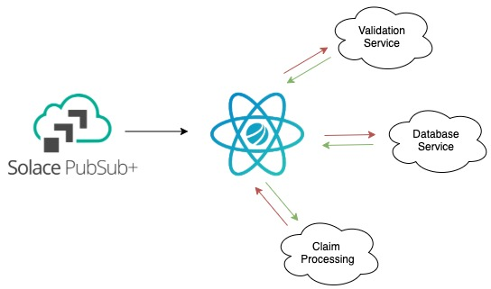

## What you need: Prerequisites

Duration: 0:04:00

1. A general understanding of [event-driven architecture (EDA) terms and concepts](https://docs.solace.com/#Messagin).
1. Basic knowledge of the Boomi GUI and deployments. A good place to start would be the [Getting Started with Boomi and Solace](https://codelabs.solace.dev/codelabs/boomi-v2-getting-started/index.html) Codelab.

After you finish the Getting Started with Boomi and Solace codelab, you’ll have the following

- A Solace trial account
- A Boomi trial account
- A local atom up and running
- An understanding of how to deploy a Boomi process to a Boomi Atom

Positive
: If you’re new to the world of events, welcome! Solace has [extensive blogs focusing on event-driven architecture and development.](https://solace.com/blog/)

## Use Case Overview

Duration: 0:10:00

In this example, we will be using the new Request Action within the Solace Connector Shape to perform a blocking synchronous request/reply in the middle of a Boomi Process. We will be doing the following:

1. Use Solace to handle the request which means the document that we feed to the Solace Connector Request will be published onto a topic.
1. The replying service will consume that document, do something with it.
1. Reply to a dynamically created ReplyTo topic with the response and the CorrelationID (also dynamically created by the Solace Connector).

We are not going to create a service replier the first time through. We are going to use a Solace web GUI to perform the reply so we can better see the inner workings.

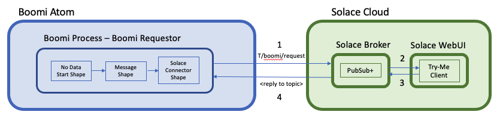

1. The Boomi Process will be setup to publish a request to the topic `T/boomi/request`
1. You will configure a Solace Broker to handle the request
1. You will use the _Try Me_ feature of the Solace Web GUI to function as a Javascript client listening to `T/boomi/request`
1. You will see the request come in and manually respond using the _Try Me_ feature (copy and paste the generated ReplyTo topic and correlation ID)
1. The Solace Broker will route the reply to the waiting Boomi Process

POSITIVE
: This is the most basic implementation of this pattern. Queues, ACL's and other Solace features can be used for persistence, access lock down and much more.

Let’s get started!

## Create a Boomi Request Process

Duration: 0:10:00

The first thing we will do is create a simple Process in Boomi that makes a request via a publication to a Solace topic

### Create a new Process

- In your Boomi environment, create a new Process. You may call it anything you like, we will be calling ours Boomi Requestor

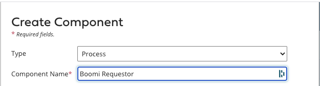

- Configure the Solace Connector Shape

  - Set the start shape type to "No Data"
    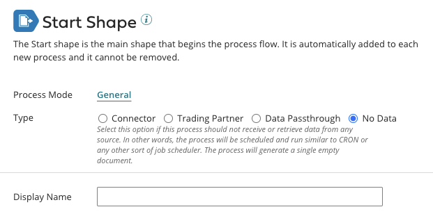

- Drag a Message Shape onto the canvas and give it some sample data

  - I am putting a silly question in, but it does not matter. We are not really processing this data.
    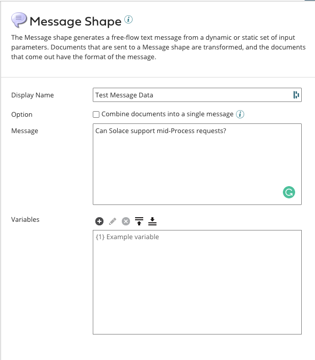

- Drag a Solace Connector Shape onto the canvas and configure to send a Request

  1. Set the Connection to your Solace instance
  1. Configure the operation as below.
  1. You can use any topic you like, or just copy the one I have below
  1. Set the Reply Timeout in the Request Operation to 100000, so we have plenty of time to manually respond.
     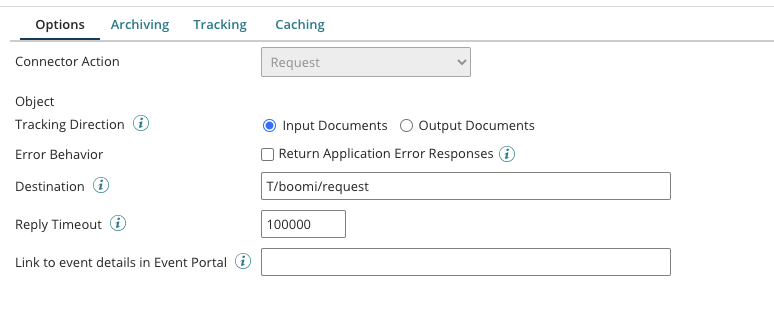

Positive
: Remember, we will be using topics only in this example. This means there is nothing to create/configure on the Solace side as topics are dynamic. In this case our topic name is `T/boomi/request`

- Add a Stop Shape to the end and then wire the shapes together and click Save
  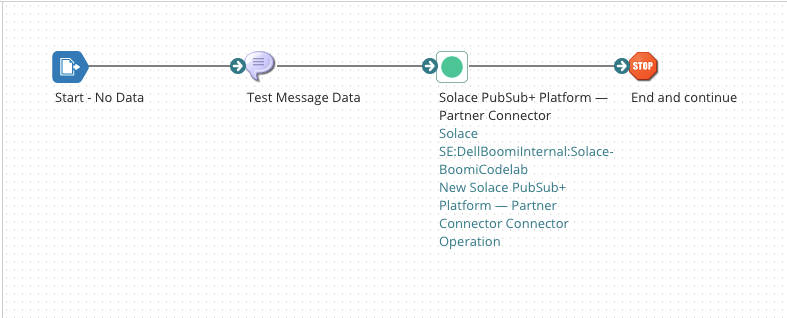

## Solace Try-Me Feature

Duration: 0:5:00

- Prepare the Solace WebUI Try-Me tab to function as the consumer of the posted request and the replier to the Boomi Atom Process
  1. Login to your Solace PS+ Service that your Boomi Process is pointed to. Mine is hosted in Solace Cloud.
  1. Click on the Try-Me link on the left
     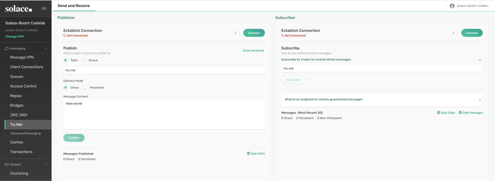
  1. Connect the Publisher by changing the default port to 443 for Solace Cloud.
  1. Set the Username
  1. Set the Password

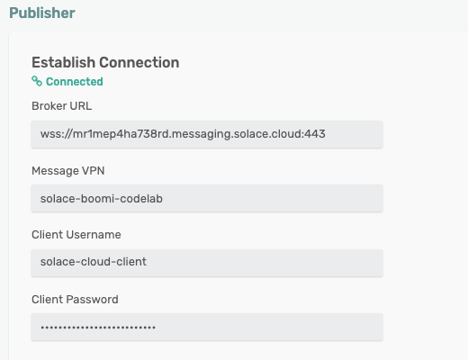

- You can get these values in the Connect tab of the Solace Cloud Console
  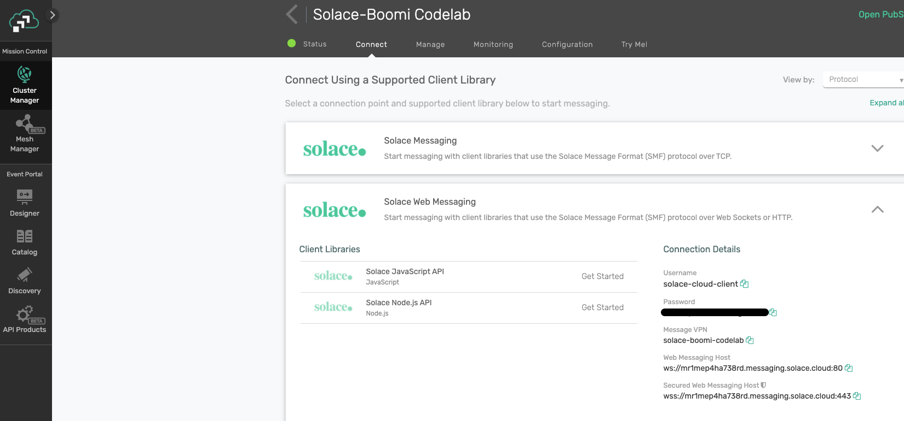
- Confirm the "Same as Publisher" checkbox is checked for the Subscriber and connect both the Publisher and Subcriber to the Solace Broker by clicking Connect on each.
  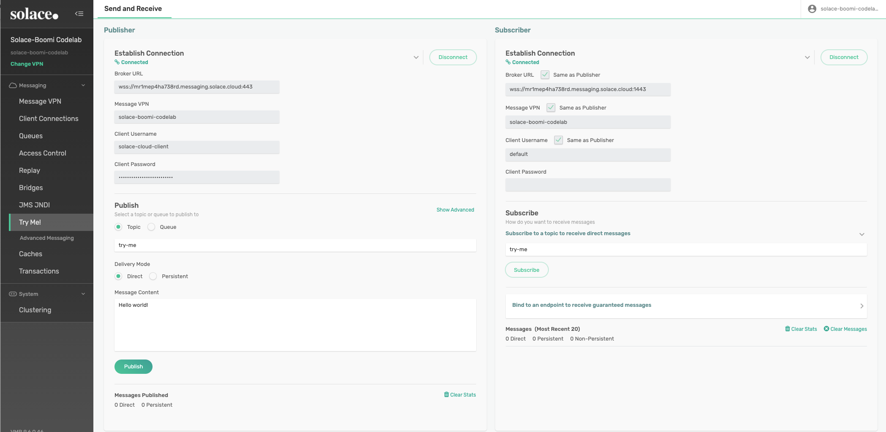
- Lastly, have the Subscriber start listening on the topic to which we will publih by typing the topic name in and clicking on Subscribe.
  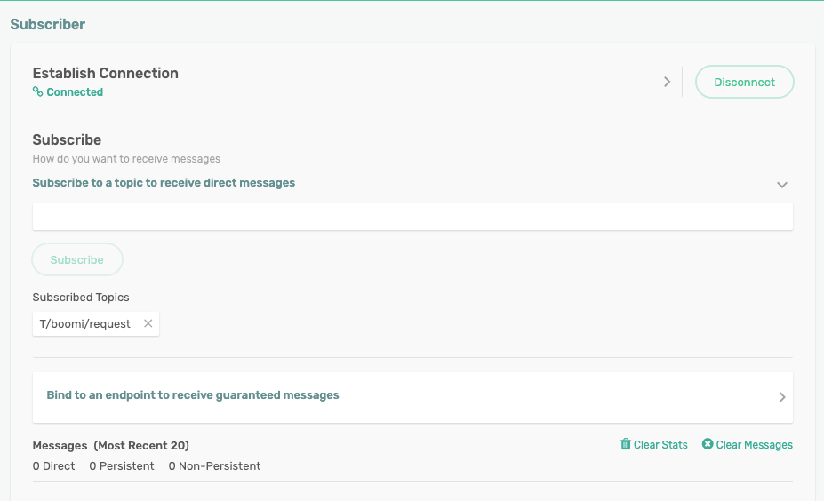

## Test

Duration: 0:20:00

Positive
: Note that the first time through this exercise, its very likely your Boomi Process will timeout, as you will be reading along. Never fear, you can simply send a new message by starting a new test and then follow along with the steps to publish a reply. You can do this as many times as you like.

- Use the Test capability in Boomi to test the Request Process

  - Go back to your Boomi Process and click Test in the upper right
    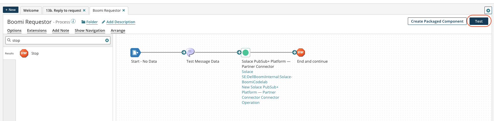
  - You should see your test process look to hang on the Solace Request Shape.
  - Once you see this, switch over to your Solace Try Me UI

- Use the Solace Subscriber to confirm receipt of the request from the Boomi Process

  - You should see that the message we configured in the Boomi Process has been recieved by our listener. Note 3 things:
    The messages text should be what you entered.
    There should be a generated ReplyTo topic name to which we will reply.
    There should be a generated Correlation ID that we need to include in our reply.
    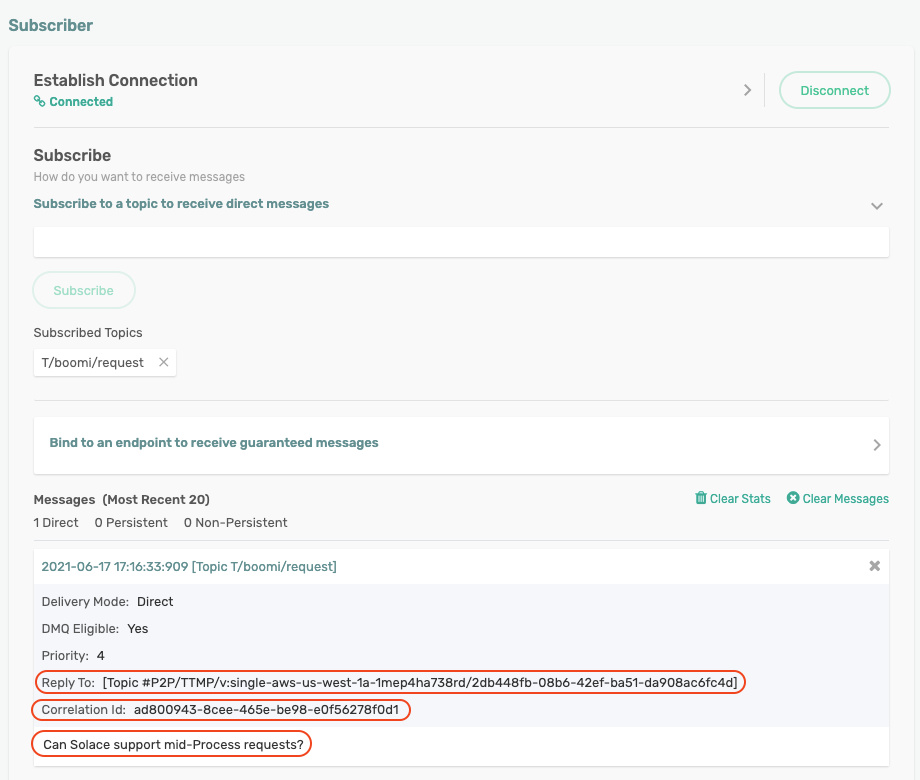

- Use the Solace Publisher to publish the reply

  - Copy and paste the ReplyTo and CorrelationID values into the Publisher and also add some text if you want to confirm that the response payload is also captured. You will need to click on "Show Advanced" in order to include the CorrelationID.
    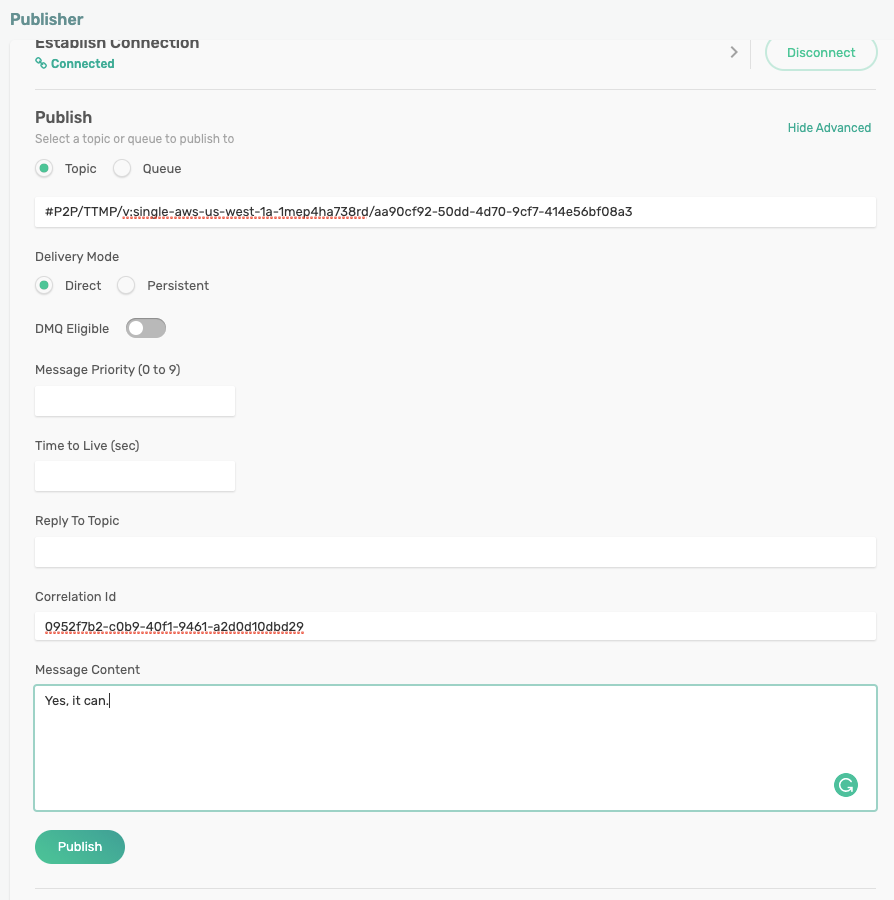

- Use the Boomi Test capability to confirm reciept of the reply and process completion.
  - The Boomi Process should have completed with success.
    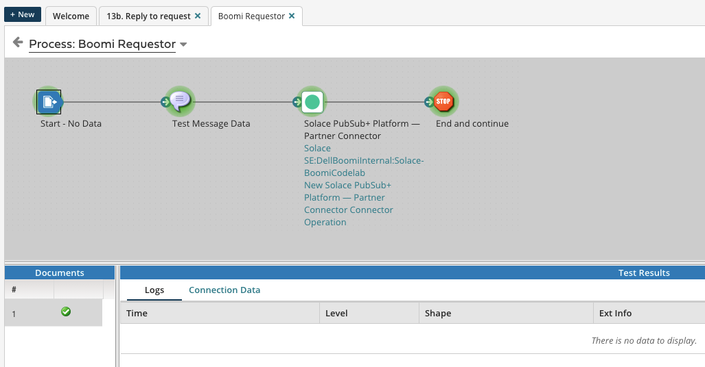
  - And you can check the Source data for the Stop Shape to see what data was returned.
    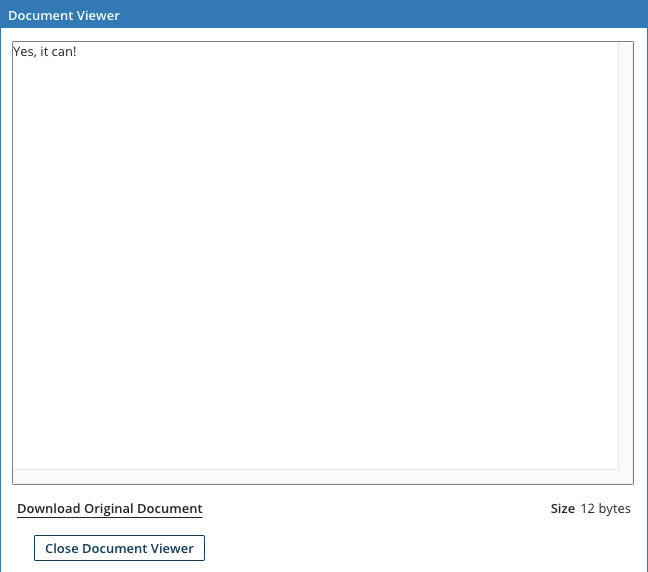

Positive
: **Can Solace support mid-Process requests? Yes, it can!**

## Conclusion

Duration: 0:2:00

### What did you learn?

We now have a native way for Boomi Atom Processes to communicate with external services in the middle of process execution by using what you learned in this codelab:

1. How to configure and deploy the Solace Connector using the Request Operation.
1. How to use that to request data/processing from an external service

   - **Note: This service could reside as another Process on the same Boomi Atom, another Booomi Atom in the same DC, another Boomi Atom half way around the world. The only requirement is that is can connect to the Solace Event Mesh.**

1. How to use Solace Try-Me to test successful operation of the new Solace Connector Operation.
