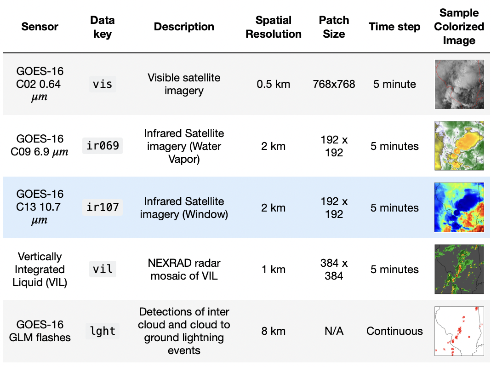

author: Moukthika Manapati
summary:
id: DAMG7241-assgn1
tags:
categories:
environments: Web
status: Published
feedback link: https://github.com/SolaceDev/solace-dev-codelabs/blob/master/markdown/DAMG7241-assgn1

# EXPLORING SEVIR DATA ON EVENT ID - S835047

## SEVIR DATASET

* **Moukthika Manapati - 002965188**
* **Adhrushta Arashanapalli - 002969521**

### SEVIR - Storm EVent ImagRy 

This dataset consists of spatially and temporally images containing weather events captured by satellite. The below image shows thousands of samples in SEVIR dataset. These events consists of 4 hours of data in 5 hours increments sampled over the US. Each event in SEVIR has 5 different image types that are captured by 5 different sensors.

### Brief description of the Tutorial

 This tutorial makes analyses and visualizations of the SEVIR Storm Imagery dataset:

* We will focus on a single instance of a SEVIR event and try to display the filenames from several sensors that have recorded data related to that event and are saved in HDF5 files on the SEVIR AWS S3 cloud. Then visualise various image types corresponding to the event.
* By uploading the data catalogue, storm details, storm fatalities, and storm locations files for the year 2019 to the Google Cloud Platform, we can then take a more comprehensive look at SEVIR data. GCP Storage Buckets will be used to store this data, and BigQuery will be used to transform the csv files into relational database form and conduct exploratory queries on the data. Additionally, we will be using Google Data Studio to develop engaging dashboards based on the findings of our exploratory BigQuery investigation.

## SEVIR Overview
Weather radar, GEO & LEO satellite, surface observations, numerical weather prediction models, balloons, ocean buoys, aircraft measurements, lightning sensing, radio occultation, and others are being measured every second of every day to aid in our ability to analyze and forecast the weather. The size and complexity of all of this data can make it difficult to work with.
SEVIR was created to enable faster R&D in weather sensing, avoidance, short-term forecasting and other related applications. SEVIR combines and aligns multiple weather sensing modalities into a single, accessible dataset accessible for free on the cloud.

Four of the five sensor types (vis,ir069,ir107 & vil) is represented as a sequence of single channel (gray scale) images. Each 4 hour event corresponding to them are represented as a L x L x 49 tensor, where L is the image size given in the Patch Size column above. The last dimension represents the time dimension of the data, which is consistent across all samples. 

This lightning data stored as collection of discrete eventsfor an event is represented by an Nx5 matrix, that contains information about flash time and location.

## Dataset Overview
SEVIR contains two major components:

- Catalog: A CSV file with rows describing the metadata of an event
- Data Files: A set of HDF5 files containing events for a certain sensor type

### Catalog.csv :
The data catalog is contained in the file named CATALOG.csv. Each row of this file represents a single event captured by one of the sensor types listed. Below are the columns that are present in the catalog.csv

- id is the unique id given to each event in SEVIR
- file_name is the name of the HDF5 file containing the image data
- file_index is the index within file_name where the data is located
- img_type tells us the image ot sensor type from the Data Key column
- time_utc is the UTC timestamp of the event which usually is the middle frame of the event
- minute_offsets are the colon separated values denoting time offset in minutes of each frame relative to time_utc
- event_id is the Storm Event EVENT_ID associated to the SEVIR event (NWS Storm Events only) 
- llcrnrlat, llcrnrlon are the Latitude and Longitude of the lower left corner respectively.
- urcrnrlat, urcrnrlon are the Latitude and Longitude of the upper right corner respectively.
- size_x, size_y are the X and Y Size of the image in pixels.

## NOTEBOOK 
### Scope 
- Downloading SEVIR DATA based on event id
- Accessing SEVIR DATA
- Visualising SEVIR DATA
- Georeferencing SEVIR DATA

### Steps:
- This notebook recreates that sevir tutorial with a narrower focus on examining only one particular historical event and accessing, visualizing, and georeferencing the same. 
- This notebook is used to visualise on 5 different sensor types.
- First, Filenames that are corresponding to a particular event ID is fetched.
- These filesnames are taken as an input to another function which downloads the files into the respective folders by parsing them accordingly. Boto3 is used to download files that are stored in s3 buckets.
- h5py module is used for reading the .h5 files directly to visualise frames of a particular modality. we are accessing vil image type file and visualising 40 images for event id b'S835047'.
- For each of the image kinds in SEVIR that correspond to the specified event id=835047, there are rows in this events data frame that pulls image data for each category from rows of events.Then data is extracted on this event and  visualised by five image types: vis, vil, ir069, ir107 and lightening.
- Then existing sevir module is cloned from github for getting expected color to the images.
- After visualising all the different image types for the event, the data is georeferenced with the catalog data to point to the coordinates of the  city affected by this event.
- Basemap is used for clearly dividing the map with state borders after getting a certain point on the map, which is used to visualise more effectively.

## Big Query

## Data Studio

## References
* [SEVIR_tutorial](https://nbviewer.org/github/MIT-AI-Accelerator/eie-sevir/blob/master/examples/SEVIR_Tutorial.ipynb#download)

