author: HariRangarajan-Solace
summary: This codelab wi
ll guide you through designing, coding and deployng an event driven flow using Solace Event Portal and Solace PubSub+
Cloud.
id: Design-Code-Deploy-With-Event-Portal
tags: Event Portal, Design first,
categories: Solace, Event Portal
environments: Web
status: Published
feedback
link: https://github.com/SolaceDev/solace-dev-codelabs/blob/master/markdown/Design-Code-Deploy-With-Event-Portal

# Design, Code, Deploy with Solace Event Portal

## What you'll learn: Overview

Duration: 0:05:00

In this codelab, you'll experience the complete lifecycle of event-driven architecture design and deployment using
Solace Event Portal and PubSub+ Cloud.
You'll learn how to:

- Register for a Solace Cloud trial account
- Provision a PubSub+ Cloud broker service
- Configure environment and modeled event mesh
- Design an EDA model using the AI Design Assistant in Event Portal
- Create and manage application domains
- Design application flows with events and topics
- Customise Event Portal with custom icons and logos
- Configure Runtime Data Policies (RDPs)
- Push configurations from Event Portal to live brokers
- Test end-to-end message flows with REST consumers
- Summmarize key takeaways and next steps

### What You'll Need

- A valid email address for registration
- A modern web browser (Chrome, Firefox, Safari, or Edge)
- Basic understanding of event-driven architecture concepts
- Access to [requestcatcher.com](https://requestcatcher.com/) for testing REST delivery

### What You'll Build

By the end of this codelab, you'll have:

- A fully configured PubSub+ Cloud broker
- An Event Portal design with application domains
- Event schemas and topic hierarchies
- Application flows showing event producers and consumers
- REST Delivery Points configured with queues
- A working end-to-end event flow delivering messages to a REST API

---

## Register for Solace Cloud Trial

Duration: 0:05:00

### Create Your Account

1. Navigate to [https://console.solace.cloud/](https://console.solace.cloud/)
2. Click **Sign Up**
3. Fill in the registration form:
    - Email address
    - First and last name
    - Company name
    - Role
    - Reason for trial : Become Solace certified
    - Password (must meet complexity requirements)
4. Accept the Terms of Service
5. Click **Sign up**
   
6. A verification email will be sent to your provided email address \
   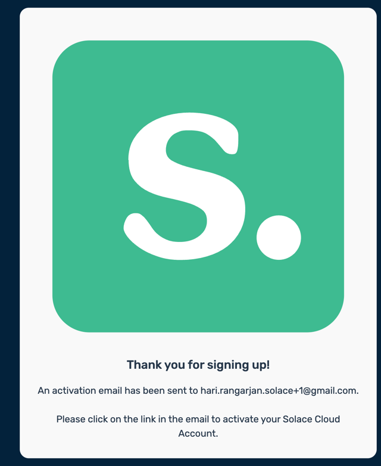

### Verify Your Email

1. Check your email inbox for a verification message from Solace
2. Click the **Verify Email** link in the message
3. You'll be redirected to the Solace Cloud Console
   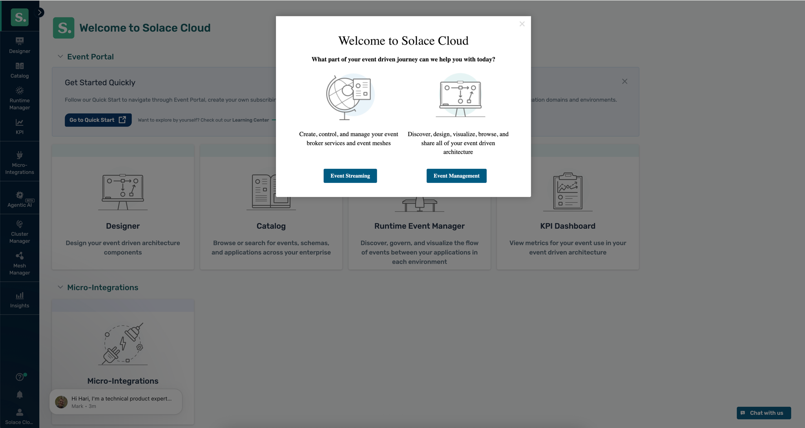

> aside positive **Note**: The trial account includes access to both PubSub+ Cloud and Event Portal with full features
> for 30 days.

---

## Provision Your First PubSub+ Broker

Duration: 0:10:00

### Navigate to Cluster Manager

1. In the Solace Cloud Console, click **Cluster Manager** in the left navigation
   
2. Click **Create Service** (or the **+** button if you have existing services)
   

### Configure Your Service

1. Fill in the service configuration details:
    - Name : Choose a concise name (e.g., `ep-codelab`)
    - Environment : Leave as **Default**
    - Cloud : Choose your preferred cloud provider (AWS, Azure, or GCP)
    - Region : Select a region closest to your location
    - Broker Release : Leave as default (latest stable)
    - Service Type : Select **Developer** (free tier)
      

2. Click **Create Service**

### Wait for Provisioning

1. The service will take 3-5 minutes to provision
2. Status will show as **Creating...**
   
3. Once complete, the broker details page will load
   

### Explore Your Broker

1. Navigate through the tabs:
    - **Connect**: Connection details and credentials
      
    - **Manage**: Service management and configuration
      

> aside positive **Checkpoint**: You should now have a running PubSub+ broker service with status "Running" in your
> Cluster Manager.

---

## Configure environment and modelled event mesh

Duration: 0:15:00

### Environment Setup

Environments in Solace Cloud represent the runtime environments within your organisation. For example, you may have

- Multiple development environments
- Multiple testing environments
- A Staging or Pre-Production
- A Production environment

1. In the Solace Cloud Console, navigate to the **Environments** tab
   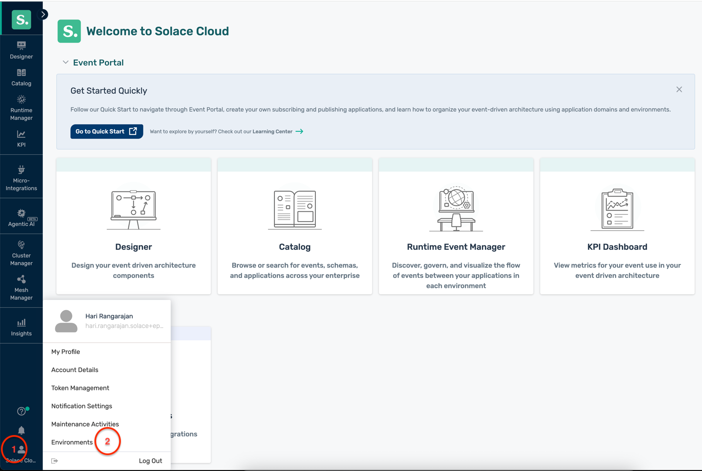
2. In the **Environments** tab, there is a default environment created for you called "Default"
   
3. Click on the **...** buttons next to the Default environment and select **Runtime Configuration Settings**
   
4. Click on the **Auto on Promotion** radio button to enable automatic promotion of configuration changes from Event
   Portal to the associated PubSub+ Cloud broker
   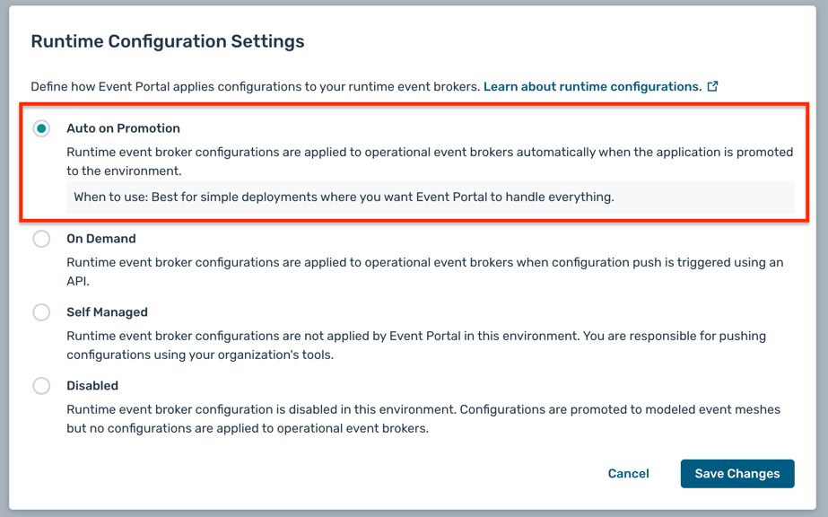
5. Click **Save** to save the changes
6. Optional: You can edit some of the environment details like name and description by clicking on the **Edit** button
   under the **...** menu
   

### Modeled Event Mesh Setup

A modeled event mesh represents an actual event mesh or event flow operating in a specific runtime environment. Modeled
event meshes help you define and visualize event flows between publishing and subscribing applications within your
event-driven architecture (EDA).

1. In the Solace Cloud Console, navigate to the **Runtime Event Manager** tab
   
2. Click on the **Create Modeled Event Mesh** button
   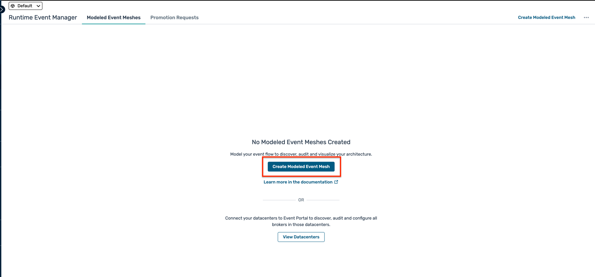
3. Fill in the details for the modeled event mesh:
    - Name : `Dev-Mesh`
    - Type : `Solace`
    - Description : `Development Modeled Event Mesh`
    - Environment : Select `Default` environment
4. Click **Create** to create the modeled event mesh
   
5. You will see the newly created modeled event mesh in the list
   
6. Click on the modeled event mesh name to view its details
7. Under the **Event Broker Connections** tab, click on **Connect Event Broker**
   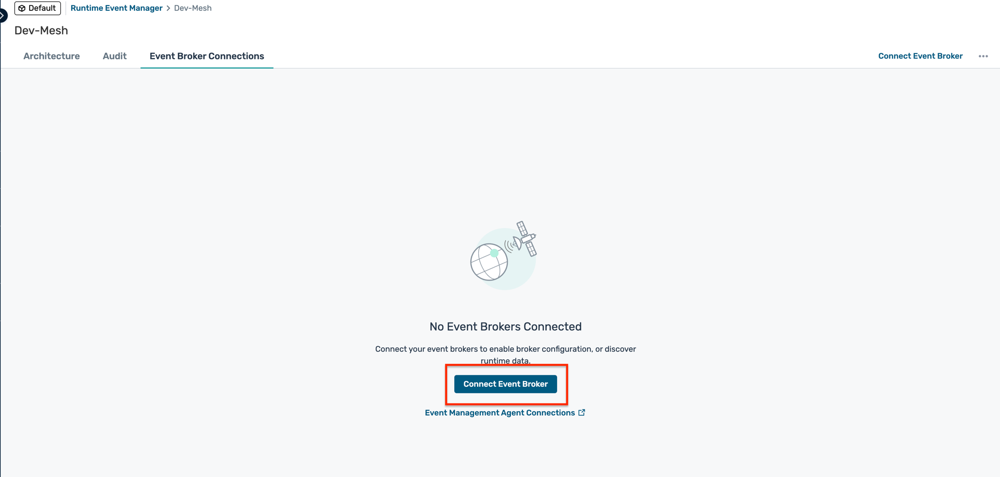
8. Select the PubSub+ Cloud broker you created earlier (e.g., `ep-codelab`) and click **Add**
   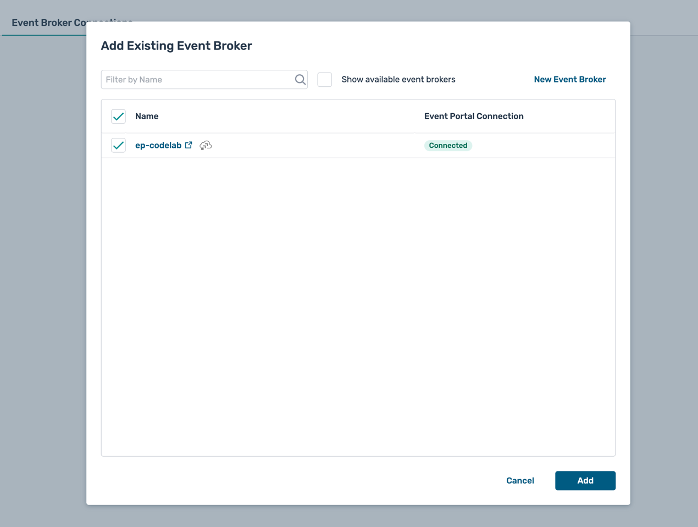
9. You should now see the broker connection listed under the **Event Broker Connections** tab
   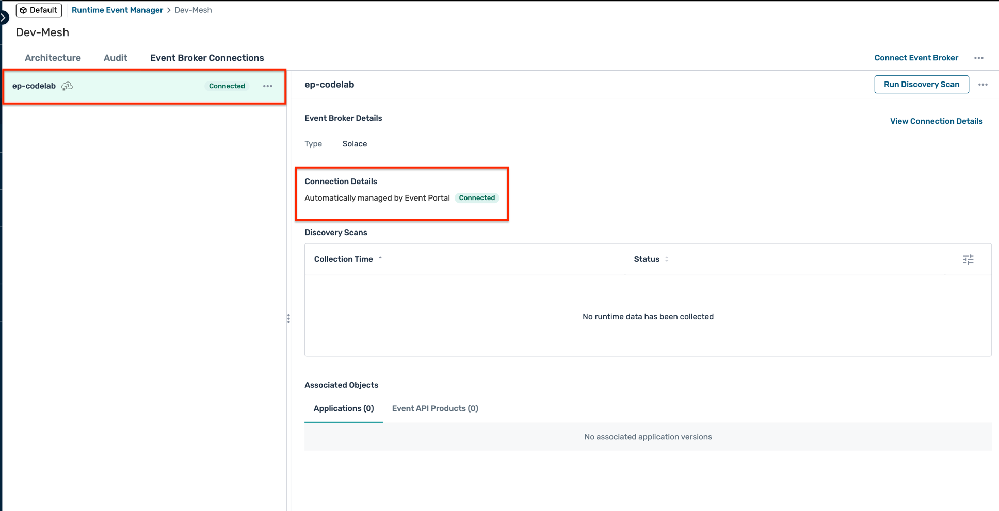

> aside positive **Checkpoint**: You should now have an environment configured with automatic promotion enabled and a
> modeled event mesh connected to your PubSub+ Cloud broker.
----

## Design EDA using the Event Portal

Duration: 0:10:00

Event Portal is a cloud-based event management tool that enables you to discover, create, design, share, manage, and
govern the assets and resources in your event-driven architecture (EDA). It makes developing and deploying event-driven
applications and integration easier for developers and architects.

### Navigate to the Event Portal

1. From the Solace Cloud Console, click **Designer** in the left navigation
   
2. This will open the Designer view of the Event Portal, where you can create and manage your event-driven architecture
   designs.
   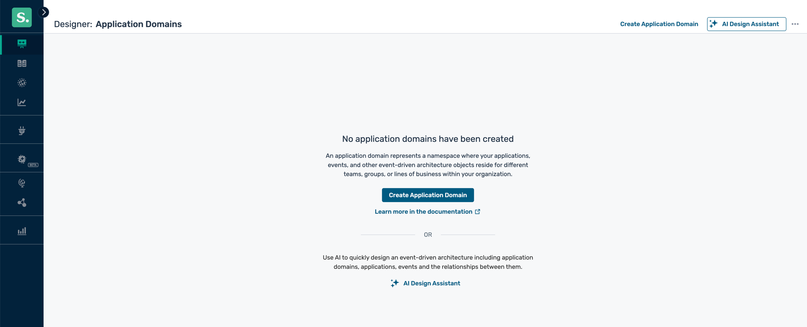

### Design with the AI Design Assistant

1. In the Event Portal Designer, click on the **AI Design Assistant** button located in the top right corner of the
   screen.
   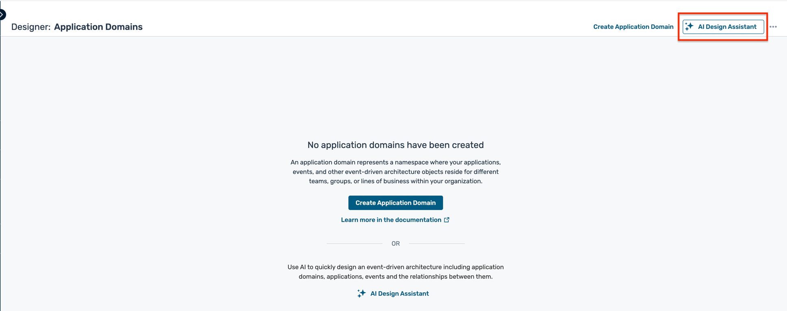
2. In the AI Design Assistant dialog, enter :
    - Your company name : `Walmart`
    - A detailed description of the solution you want to design. You can use the below description:
        - Create a retail point-of-sale system with the following:
            - A POS application that publishes order events when customers complete purchases
            - An inventory service that subscribes to order events and updates stock levels
            - A notification service that sends order confirmations
            - Events should include: order created, order completed, inventory updated, and notification sent
            - Use a hierarchical topic structure with retail as the root domain
    - You can choose to generate the design in a single application domain or multiple domains.
    - Click **Create Application Domains** to proceed to the next step
      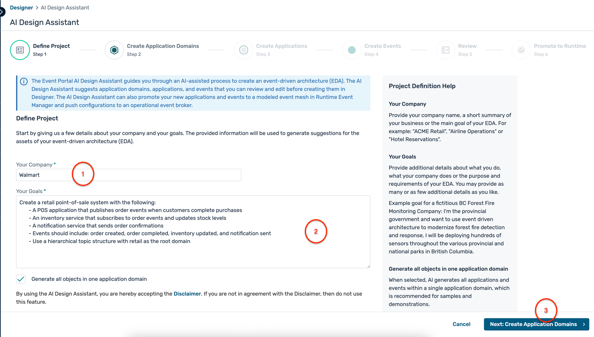
3. The AI Design Assistant will generate the application domains and present it for your review. Click **Create
   Applications** to proceed to the next step
   
4. The AI Design Assistant will generate the applications for each domain and present it for your review. Click **Create
   Events** to proceed to the next step
   
5. The AI Design Assistant will generate the events for each application and present it for your review. Click **Review
   ** to proceed to the next step
   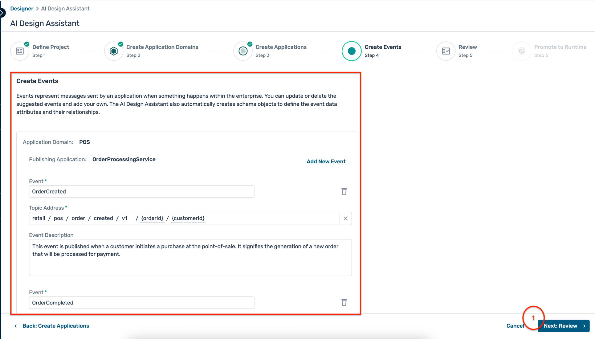

> aside positive **Note**: Look at the topic hierarchy generated by the AI Design Assistant. It should reflect the
> hierarchical structure you specified in the description.

6. You can also promote the design directly to the modeled event mesh you created earlier by selecting the checkbox *
   *Promote Applications and Events to Runtime Event Manager**. Click on **Create Assets** to complete the design
   process.
   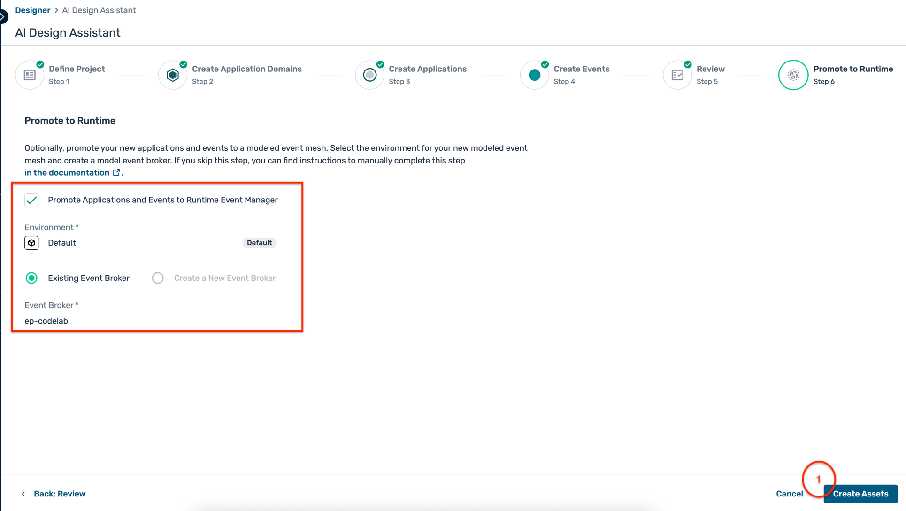
7. Once the design is created, you will see the application domains, applications, and events listed in the Event Portal
   Designer.
   
8. The designer view within each application domain will show the applications, events, and their relationships.
   
9. In the **Applications** tab, you can see the list of applications created by the AI Design Assistant.
   
   a. Within each application, you can view the application details, versions, the events it produces and consumes, the
   queues it has configured and their deployment statuses.
   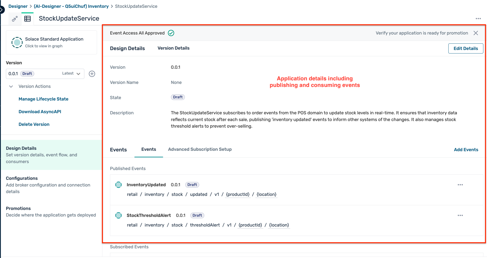 \
   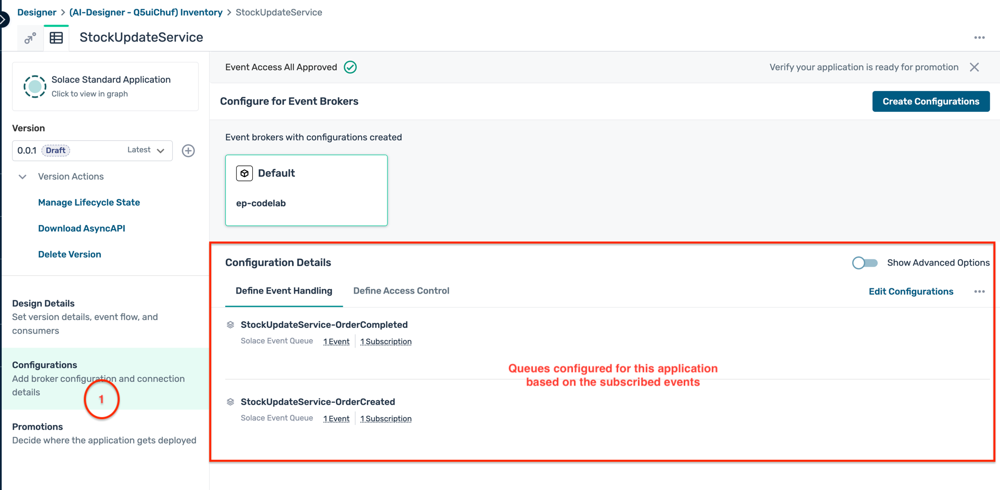 \
    \
10. In the **Events** tab, you can see the list of events created by the AI Design Assistant.
    
    a. Within each event, you can view the event details, versions, associated payload schema, and the applications that
    produce and consume the event.
    
    b. You can also view the topic address where the event should be published
    
11. In the **Schemas** tab, you can see the list of payload schemas created by the AI Design Assistant.
    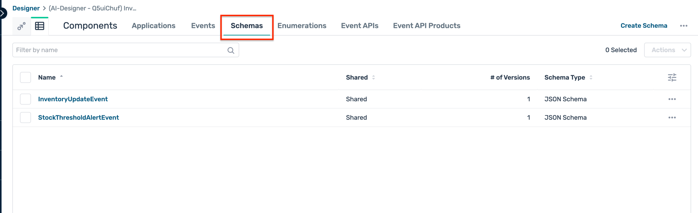
    a. Within each schema, you can view the schema details, versions, and the events associated with the schema.
    
    b. You can also view the schema definition in JSON format.
12. Repeat the above steps to explore the other application domains created by the AI Design Assistant.

### Customise Design with Icons and Logos

In the Event Portal, you can customise the appearance of your applications by changing their icons and logos. This helps
in visually distinguishing different applications within your event-driven architecture design.
It also helps in branding your applications according to your organisation's identity and makes it easier for team
members to recognize and navigate through the applications in the Event Portal.

> aside negative **Note** : The names of the application domains, applications and events created by the AI Design
> Assistant may vary each time you run the design process. The steps below will guide you on how to customise the icons
> and logos regardless of the specific names used.

1. Navigate to any of the application domains created by the AI Design Assistant e.g. **Notification Service**
   
2. Click on any of the applications within the domain e.g. **OrderConfirmationService**
   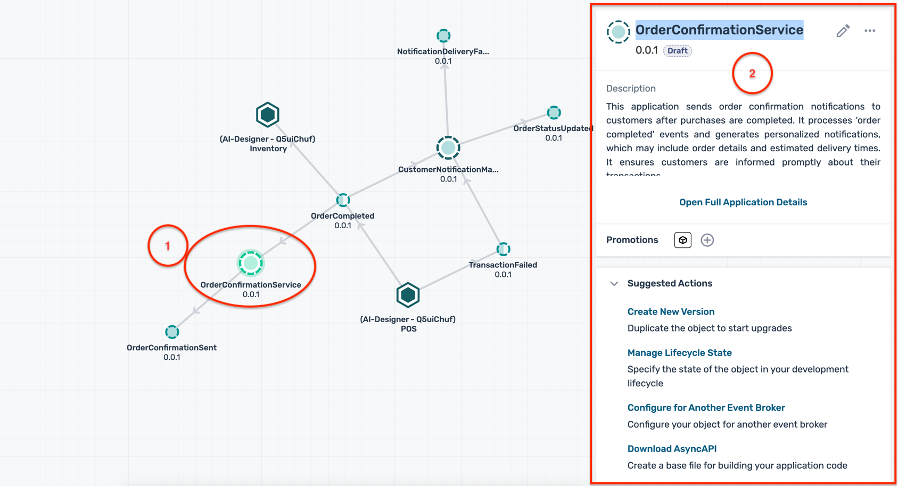
3. In the details panel on the right, click on the **...** buttons and then the **Edit Appearance** button
   
4. This opens the appearance customisation dialogue where you can change the icon, logo, and accent colour of the
   application \
   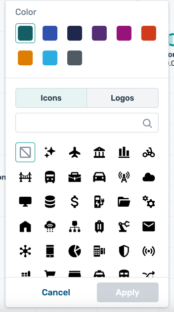 \
   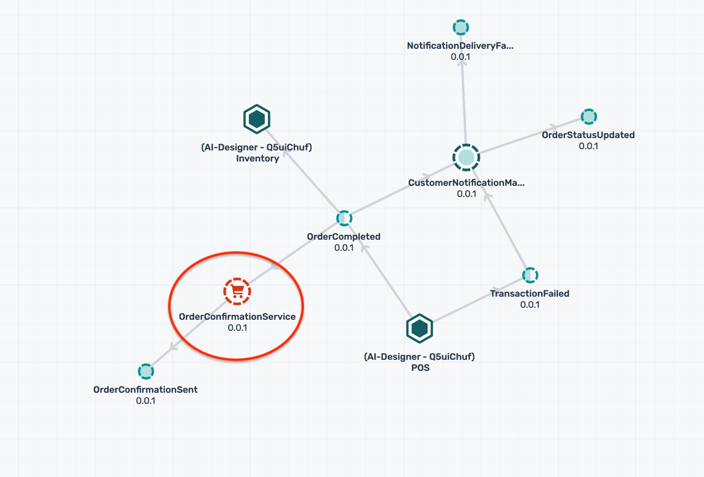
5. You can do the same for other applications within the application domain
6. You can also customise the colour of the events within the application domain by
   a. Click on any event
   b. In the details panel on the right, click on the **...** buttons and then the **Edit Appearance** button
   c. Select an **accent color** and click **Save**

> aside positive **Checkpoint**: You should now have an event-driven architecture design created by the AI Design
> Assistant with customised application icons and event colours.

----

## Design new events and application flows

Duration: 0:15:00

> aside negative **Note** : The names of the application domains, applications and events created by the AI Design
> Assistant may vary each time you run the design process. The steps below will guide you on how to create new events
> and application flows regardless of the specific names used.

### Create a new event

1. In the Event Portal Designer, navigate to an application domain where you want to create a new event e.g. **Inventory**
   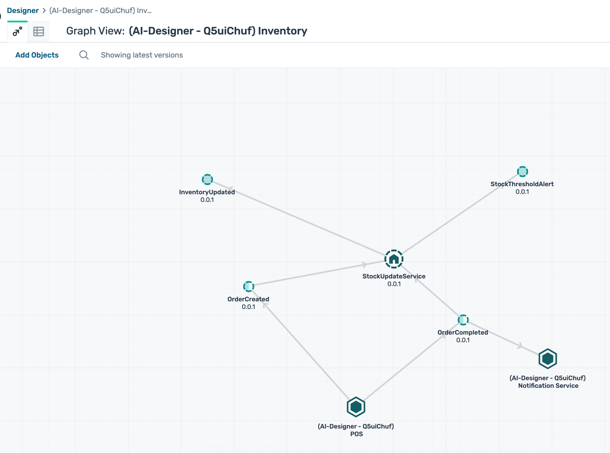
2. Right-click on the canvas and select **Create Solace Event**
   
3. Fill in the event details:
    - Name : `OutOfStockAlert`
      
4. Click on the newly created event to open its details panel and click **Edit Full Details**
   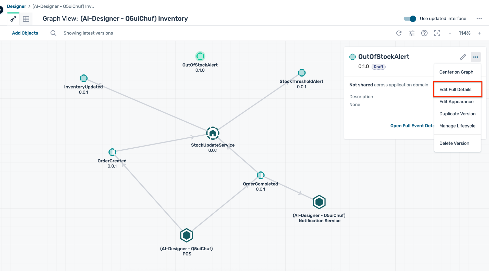
5. Fill in the full event details:
    - Description : `Event published when an item is out of stock`
    - Topic Address : `retail/inventory/stock/outofstockalert/v1/{productId}/{location}`
    - Schema : Create a new schema using the **Quick Create Schema** button with a simple JSON schema defining the
      payload structure
    - Click **Save** to save the event details
> aside negative **Note**: The JSON Schema for the new event will be used in the later steps to create a test message.

   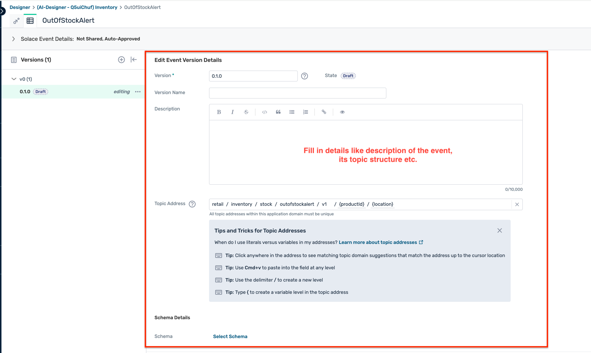 \
      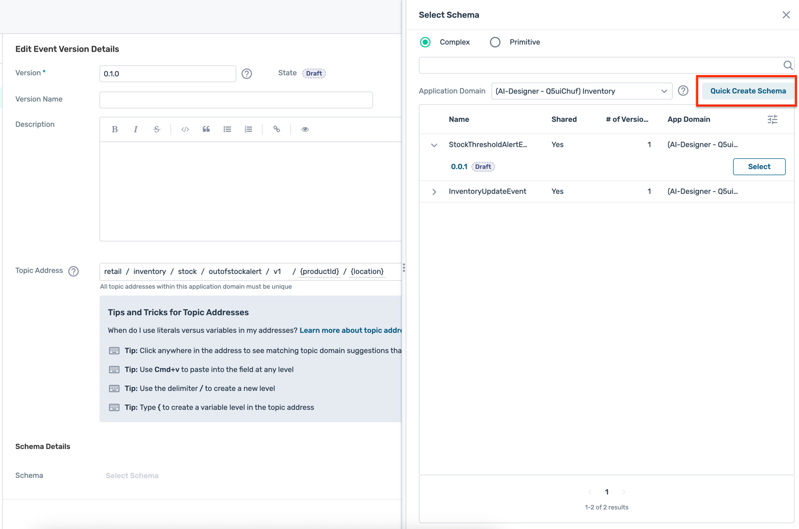 \
       
6. Once the event is created, you will see it listed in the **Events** tab of the application domain as well as in the
   designer view
   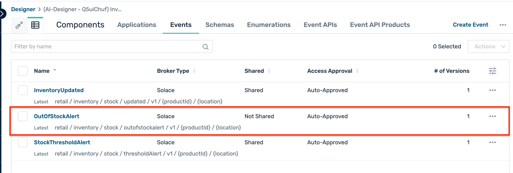
7. You can also view the newly created schema in the **Schemas** tab of the application domain
   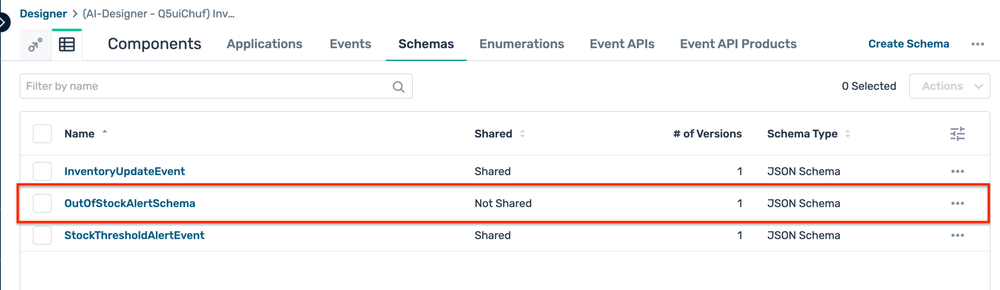
8. Go back to the designer view of the application domain and hover over the application that will produce the new event
   e.g. **StockUpdateService**
   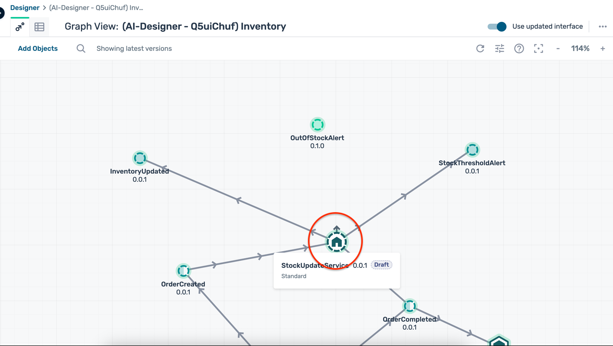
9. Pull the **Produces Event** handle (small arrow on the application) and drag it to the newly created event to create
   a producing relationship
   

## Configure REST Delivery Points push configuration to broker

Duration: 0:15:00

Now that you have updated your original design with a new event and established a producing relationship, you need to
create a consuming application that will forward the event messages to a REST endpoint using a REST Delivery Point (
RDP). You will also push the updated design to the PubSub+ Cloud broker.

### Create a consuming application

1. In the Event Portal Designer, navigate to the same application domain where you created the new event e.g. **Inventory**
2. Right-click on the canvas and select **REST Delivery Point (Webhook)**
   
3. Fill in the application details:
    - Name : `OutOfStockAlertRDP`
      
4. This RDP application will be linked to another application which denotes the REST API that will effectively receive
   the
   messages. You can rename this linked application to something more meaningful like `StockManagementAPI`
   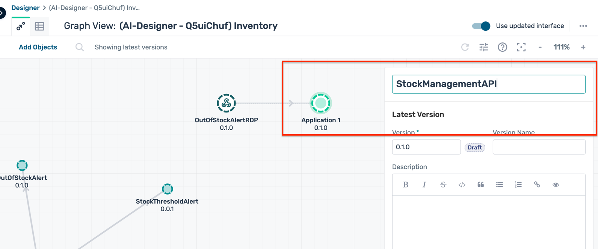
5. Hover over the newly created event and pull the **Consumes Event** handle (small arrow on the event) and drag it to
   the RDP application to create a consuming relationship
   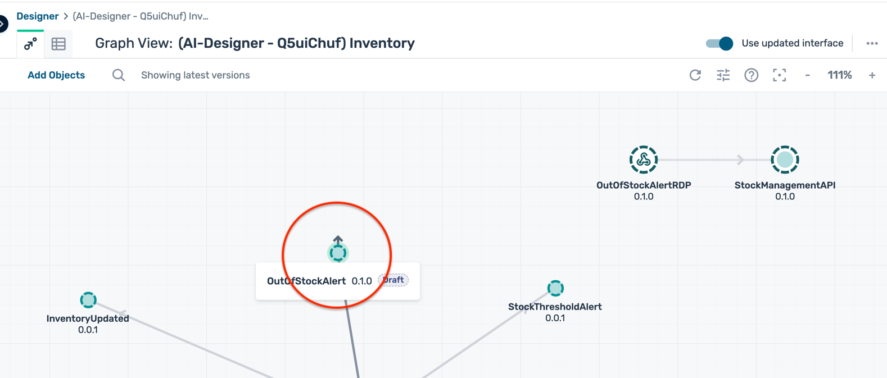
   

### Configure a REST API endpoint

1. Quickly set up a request catcher service to act as the REST endpoint that will receive the messages from the RDP.
   a. Navigate to [https://requestcatcher.com/](https://requestcatcher.com/) \
   b. Enter the name of the linked application from above e.g. StockManagementAPI in the input provided and click on the button **Get
   Started**
   
   c. This creates a unique endpoint URL for you to use in the RDP configuration later. Copy this URL and save it for
   later use.
   

### Configure RDP and push configuration to broker

> aside negative **Note** : Please make sure to follow the steps below carefully to successfully configure the RDP and push
> the configuration to the PubSub+ Cloud broker.

1. Click on the newly created RDP application to open its details panel and click **Open Full Application Details**
   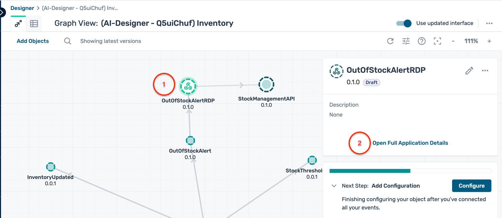
2. In the application details page, you can review the application information, associated events, and queues. Click on
   the **Advanced Subscription Setup** tab to view the queues associated with the RDP application.
   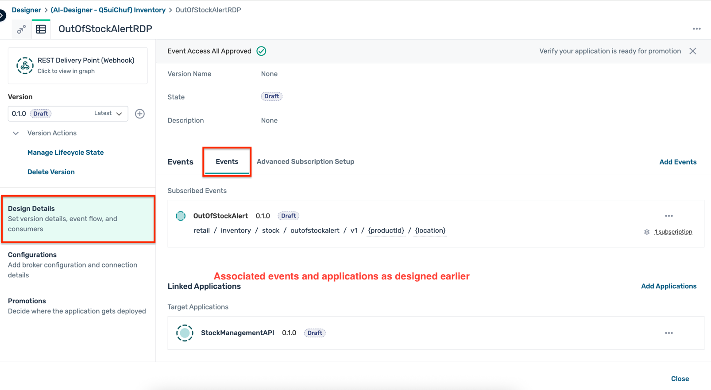
   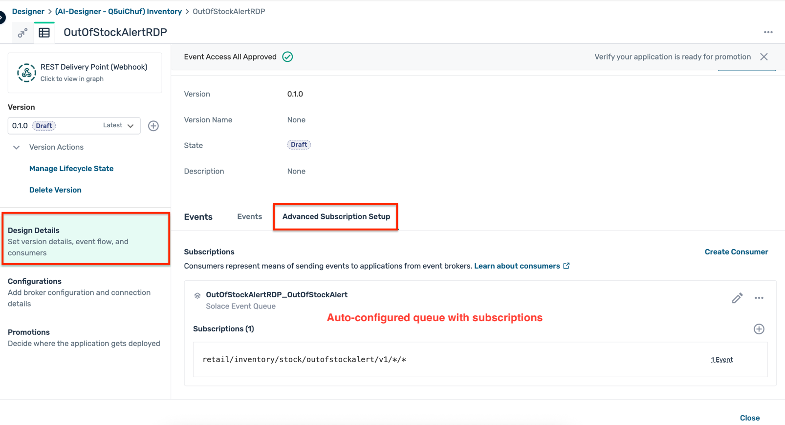
3. Click on the **Configurations** tab on the left to create the RDP configuration, and then click on the **Create
   Configuration** button.
   
4. In the RDP Configuration dialogue box:

   a. **Broker selection** : Select the default environment and broker that you created earlier and click on the button
   **Next:Define Event Handling**
   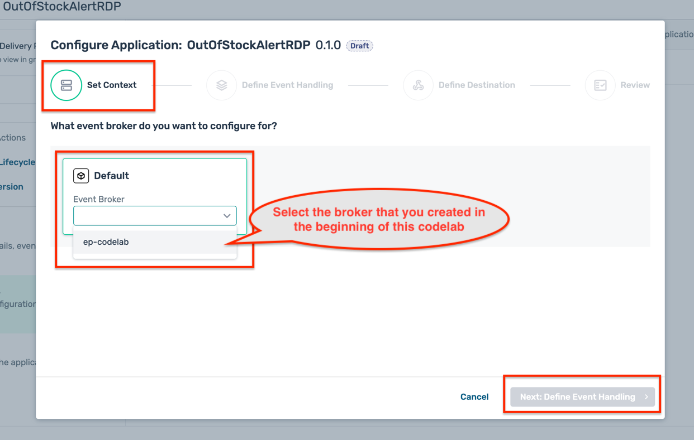

   b. Define Event Handling :
    - **Queue Name** : Keep the pre-filled value as is
    - **Queue Configuration** : Keep the default selection as is
    - **Request Target** : Update the value to `/test`
    - Click on the button **Next:Define Destination**
    

   c. Define Destination :
    - **RDP Name** : Keep the pre-filled value as is
    - **Destination Configuration Type** : Keep the default selection of `Generic Destination` as is
    - **Authentication Scheme** : Select the value `None` from the dropdown
    - **Remote Host** : Enter the URL that you configured in the previous step. **Make sure to remove the protocol and the ending `/`**. For e.g.`stockmanagementapi.requestcatcher.com`
    - **Remote Port** : Enter the value `443`
    - **TLS Enabled** : Keep the default selection of `TLS Enabled` as is
    - Click on the button **Next:Review**
   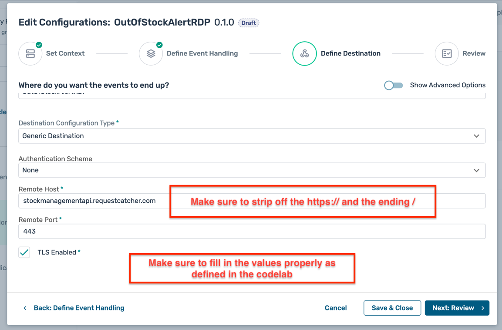
   
   d. Review :
    - Review the RDP configuration details 
      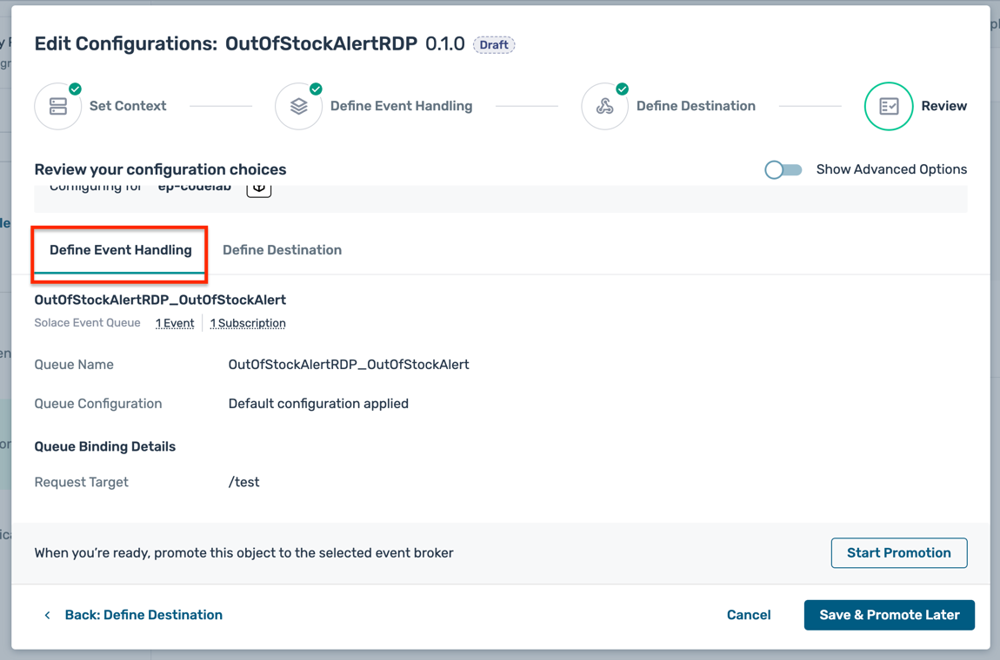
      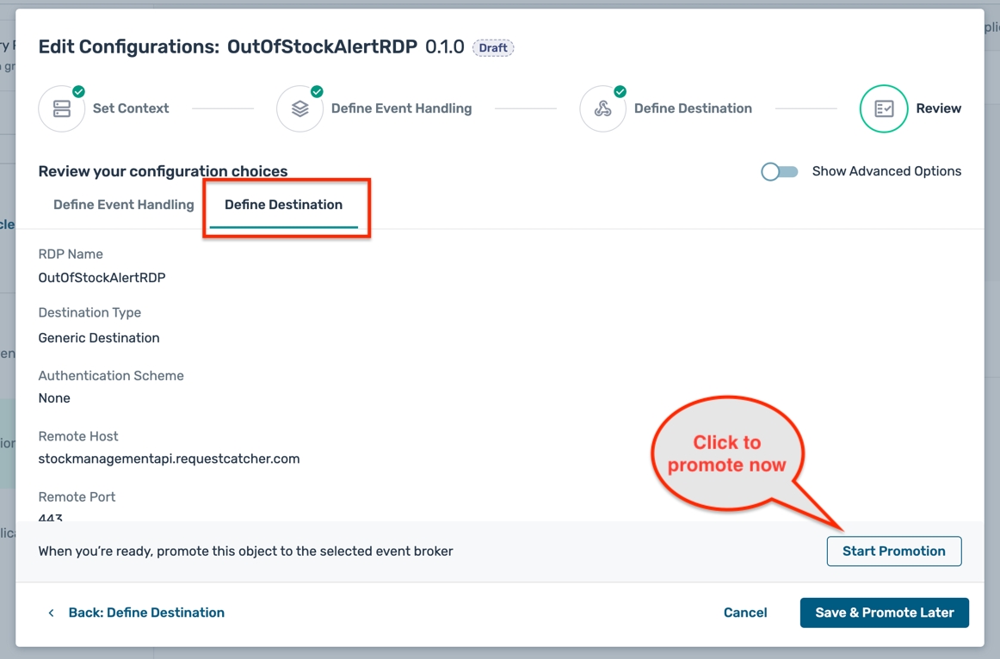
    - Click on the button **Start Promotion** to deploy the configuration to the selected PubSub+ Cloud broker
5. Configuration Promotion: 
   - Click on the **Preview Promotion** button to review the promotion details
     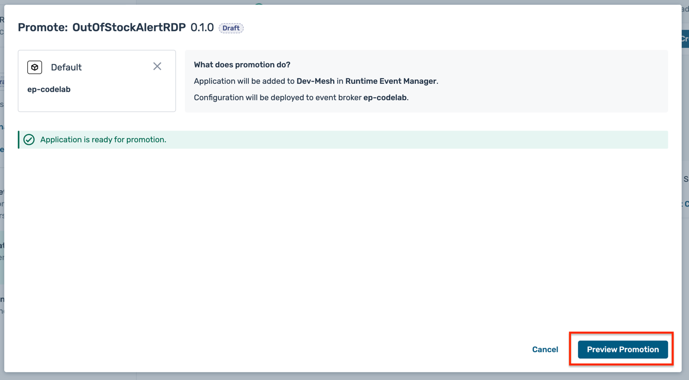
   - In the preview screen, click on the individual sections to review the changes that will be applied to the broker
     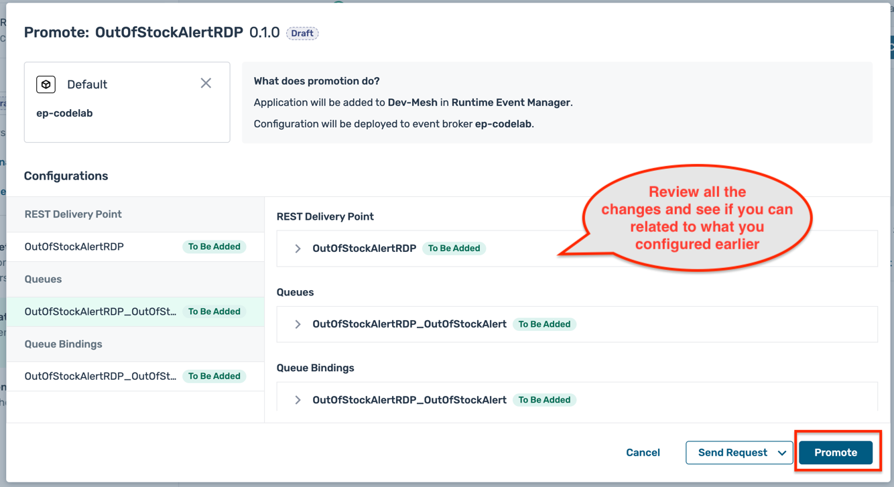
   - Once reviewed, click on the **Promote** button to initiate the promotion
   - You can see the promotion status in the **Promotions** tab of the application details page
   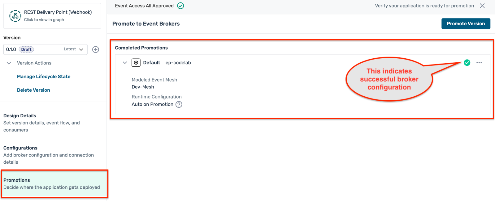
   > aside negative **Note**: In case there is an error during promotion, you can click on the **Remove Application** button to revert the configuration and fix it again. 
 

> aside positive **Checkpoint**: You should now have a new event configured, a consuming RDP application set up, and the updated design
> successfully pushed to the PubSub+ Cloud broker.

## Test end-to-end message flow with REST consumers

Duration: 0:10:00

Till now, we have :
- Provisioned a PubSub+ Cloud broker associated with an environment and linked it to a modeled event mesh
- Designed an event-driven architecture using the AI Design Assistant in Event Portal
- Created a new event and application flow
- Configured a REST Delivery Point (RDP) to forward event messages to a REST endpoint
- Pushed the updated design to the PubSub+ Cloud broker

Now, its time to test a single message flow from a producer application to the REST endpoint via the PubSub+ Cloud broker.

> aside negative **Note** : The names of the application domains, applications and events created by the AI Design
> Assistant and your specific use case may vary each time you run the design process. The steps below will guide you on how to use the schema to create and send a test message.

### Create a test message
1. In the Event Portal Designer, navigate to the application domain where you created the new event e.g. **Inventory**
2. Click on the **Schemas** tab and open the schema associated with the new event e.g. **OutOfStockAlertSchema**
   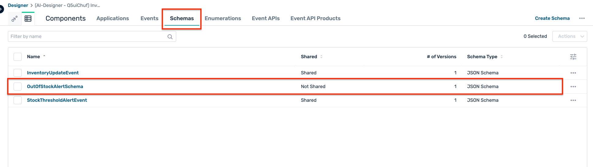
3. Copy the JSON schema definition to use it for creating a test message
   
4. Use the copied schema to create a sample JSON message. You can use any AI tool to generate a sample JSON object based on the schema. 
5. This generated JSON object will be used as the payload for the test message to be sent to the PubSub+ Cloud broker.

### Send a test message

1. In the Solace Cloud Console, navigate to the **Cluster Manager** tab and select the PubSub+ Cloud broker you
   provisioned earlier.
   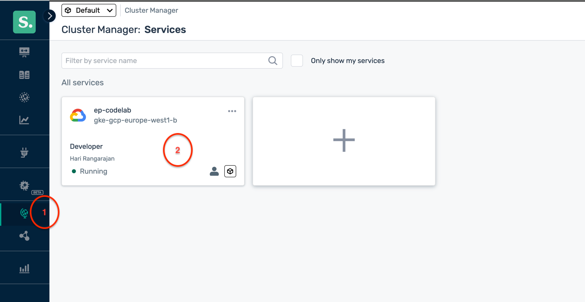
2. On the broker details page, click on the **Connect** tab to get the connection details.
   
3. Copy the **password** value for the **solace-cloud-client** username.
   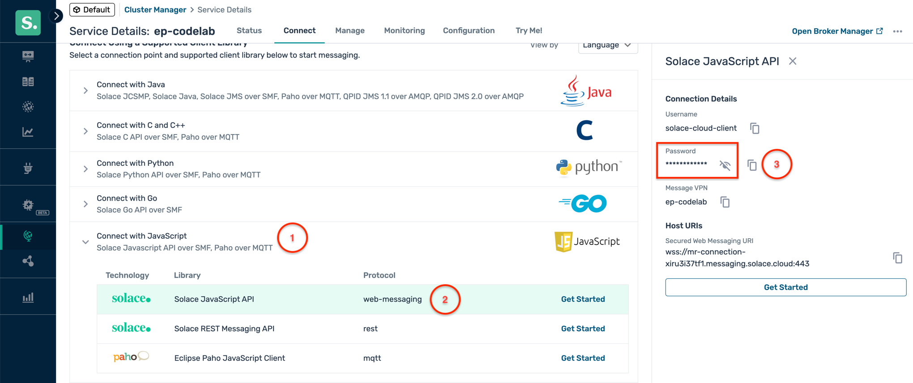
4. Click on the **Open Broker Manager** link in the top right corner to open the PubSub+ Broker Manager in a new tab.
   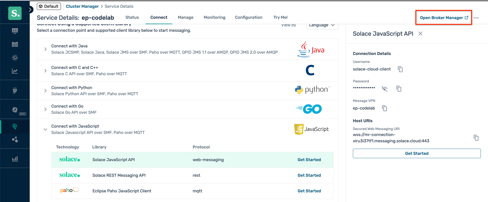
5. In the PubSub+ Broker Manager, navigate to the **Try-Me** tab on the left navigation.
   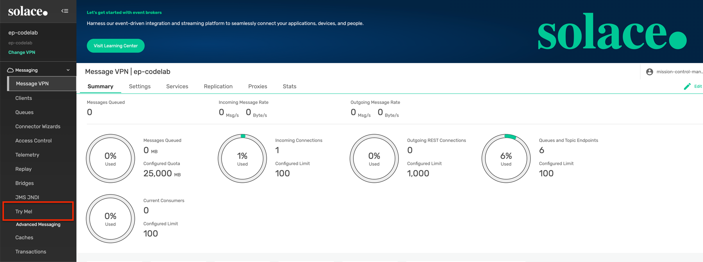
6. In the **Try-Me** tab, on the **Publisher** side, fill in the copied password for the **solace-cloud-client** username and click **Connect**
   
7. In the **Topic** field, enter the topic address of the new event e.g. `retail/inventory/stock/outofstockalert/v1/SKU-12345/NL-WH-01`
8. In the **Message Payload** field, paste the sample JSON message you created earlier.
   
9. Click on the **Publish Message** button to send the test message to the PubSub+ Cloud broker.
   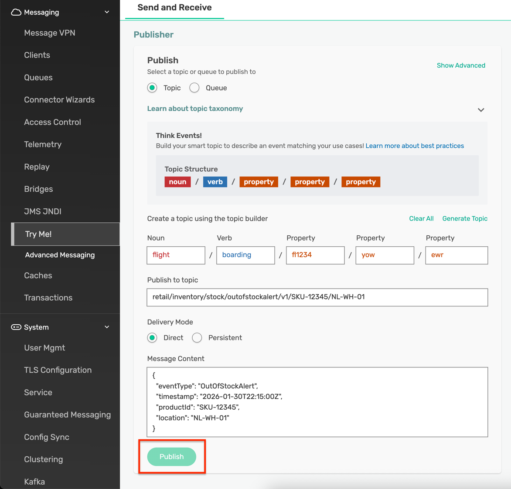

### Verify message delivery at REST endpoint
1. Go back to the request catcher service tab where you set up the REST endpoint earlier.
2. You should see a new request received in the request catcher dashboard.
   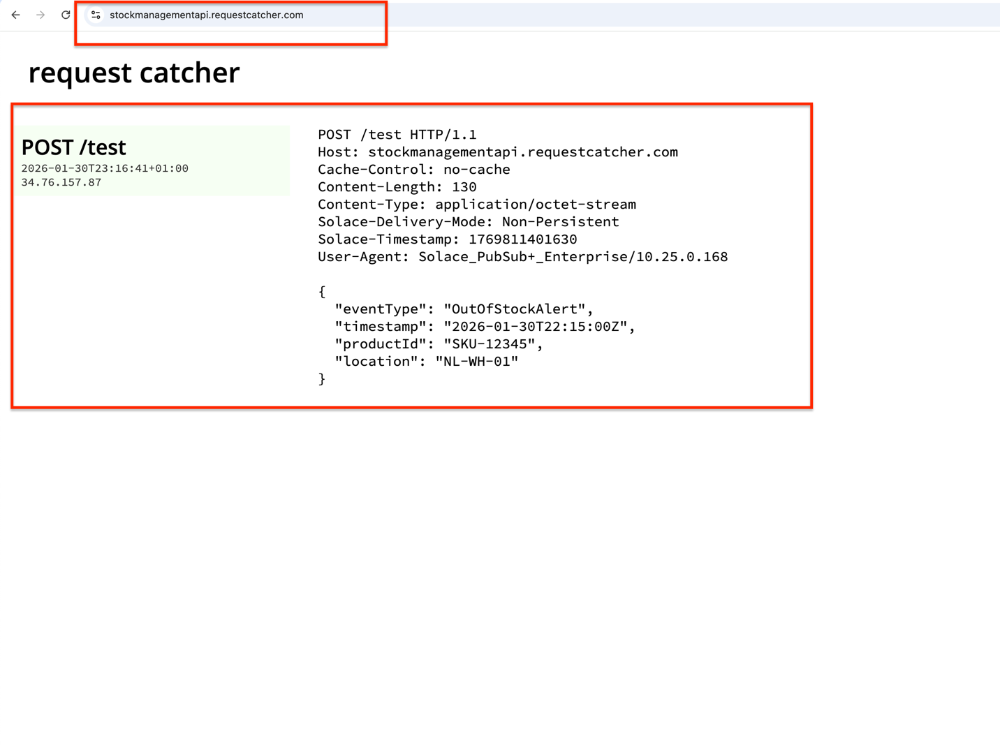
3. You can verify that the payload of the received request matches the sample JSON message you just sent from the Try-Me Publisher.
   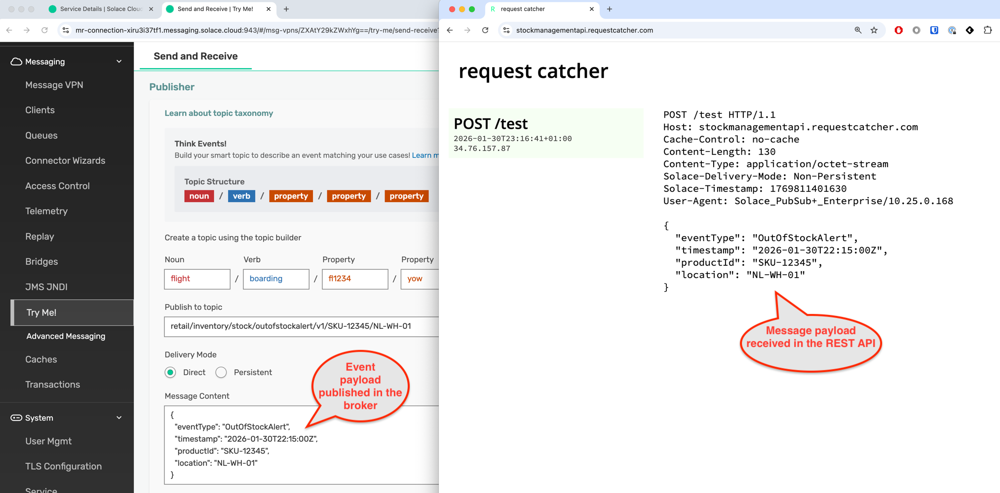

This confirms that the end-to-end message flow from the producer application to the REST endpoint via the PubSub+ Cloud
broker is working as expected.

## Summarize key takeaways and next steps

Duration: 0:05:00

### Summary

In the above exercises you have designed, coded and deployed an event driven flow using Solace Event Portal and Solace
PubSub+ Cloud.
Through this codelab, you have learned how to:

- Set up a Solace cloud broker
- Configure environment and modeled event mesh
- Design an EDA model in Event Portal
- Create and implement events and application flows
- Push configurations from Event Portal to live brokers
- Test end-to-end message flows

### Next steps

You can continue your learning journey with Solace by exploring the following resources:

- Do more advanced trainings using the Solace Learning Paths on [Solace Academy](https://training.solace.com/learn)
- Visit the [Solace Developer Portal](https://solace.dev/) for more codelabs, tutorials, and documentation
- Join the [Solace Community Forum](https://solace.community/) to connect with other developers and get support
- Explore the [Solace YouTube Channel](https://www.youtube.com/@Solacedotcom) for video tutorials and webinars

Thanks for participating in this codelab! Let us know what you thought in
the [Solace Community Forum](https://solace.community/)! If you found any issues along the way we'd appreciate it if
you'd raise them by clicking the Report a mistake button at the bottom left of this codelab.
