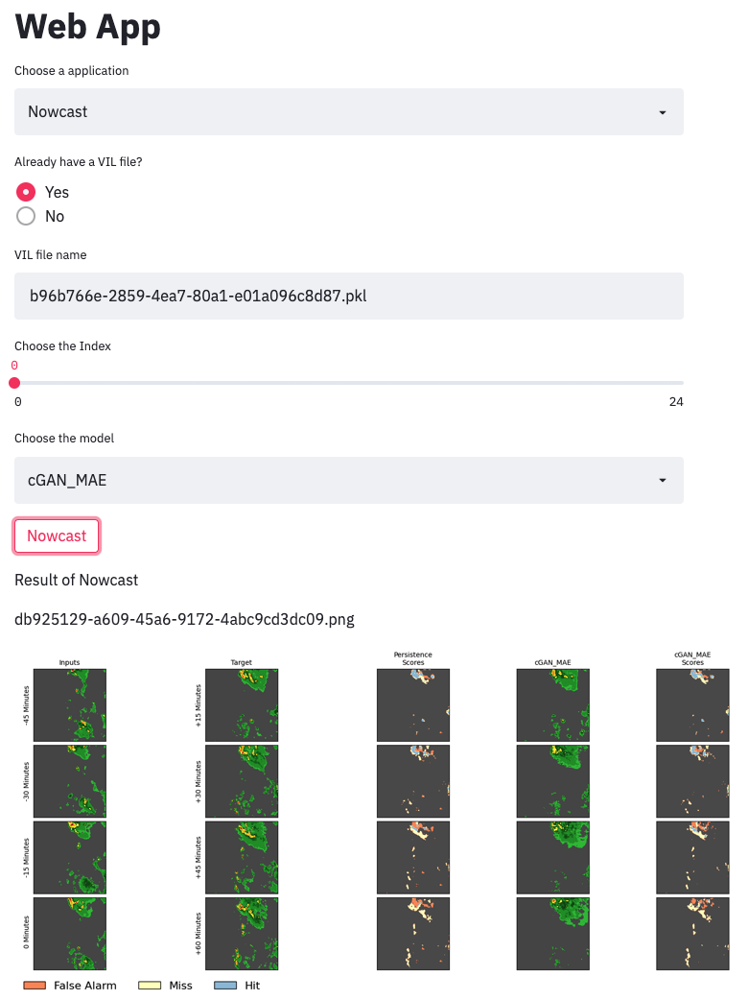
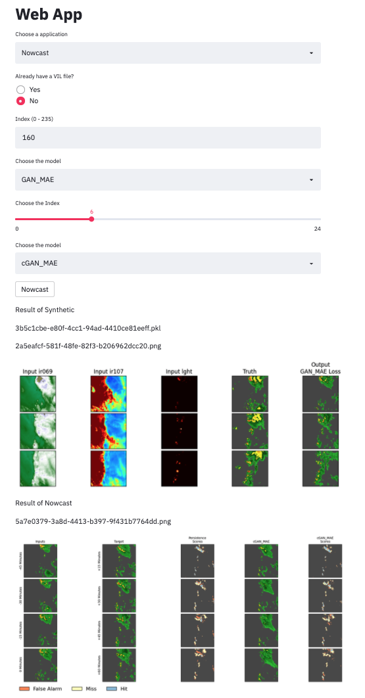
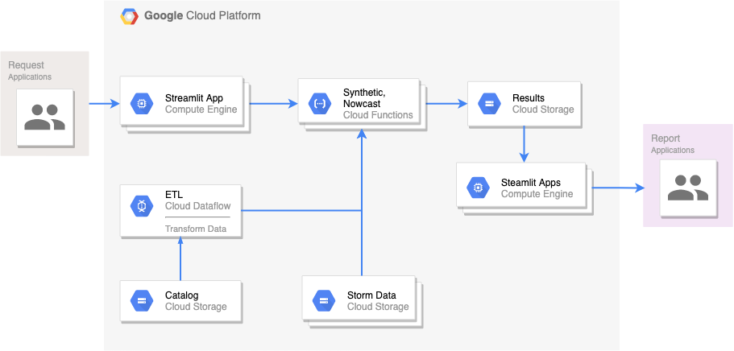
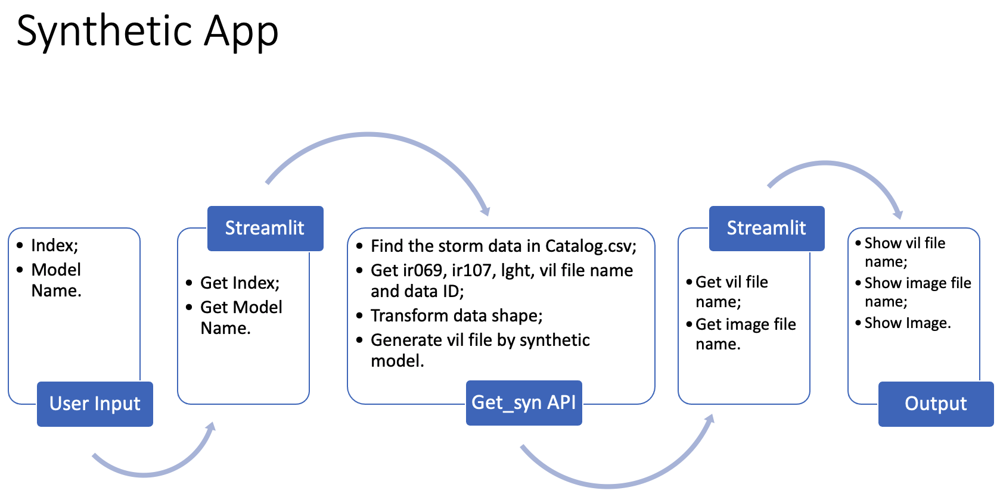
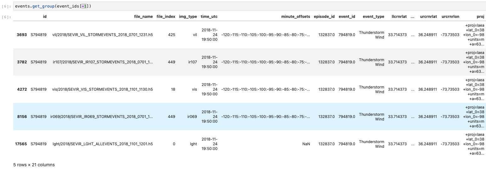
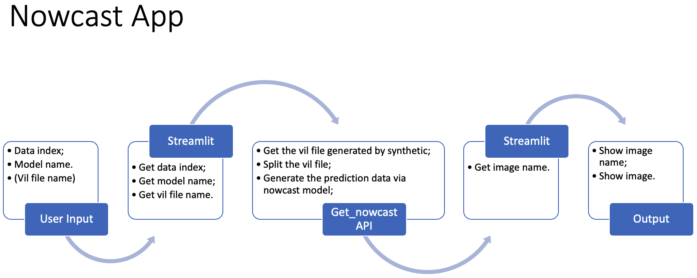

author: Chen Peng
summary:
id: FinalReport
tags:
categories:
environments: Web
status: Published
feedback link: https://github.com/SolaceDev/solace-dev-codelabs/blob/master/markdown/FinalReport

# Final Project Report -- Web App
## About This Project
The source code of Google Cloud APIs is in backend folder, and the source code of streamlit is in streamlit folder. The streamlit app is also deployed on Google Cloud Platform.

If you want to get a FastAPI + Streamlit version, you can see this [GitHub](https://github.com/pngchen/CSYE7245/tree/main/finalProject). But it is a old version, I have updated several versions only on Google Cloud Platform, because of the  time limitation. So FastAPI + Streamlit version is different from GCP version. And FastAPI + Streamlit version and GCP version are unrunnable, because I didn't upload the GCP credential json file. You can try to use your own GCP credential json file to run this code. And you can get your GCP keys according to [Creating and managing service account keys](https://cloud.google.com/iam/docs/creating-managing-service-account-keys#iam-service-account-keys-create-python).
## How to Use
You can visit the website by [https://hardy-portal-318606.de.r.appspot.com/](https://hardy-portal-318606.de.r.appspot.com/).
### Synthetic App
In ***Choose an appliocation***, if you choose the ***Synthetic***, the website will look like below without result part. Then you can input the index which you want to generate a VIL file, and choose a synthetic model. After that, you can click the ***Synthetic*** button.


Finally, you can get your result. The **b96b766e-2859-4ea7-80a1-e01a096c8d87.pkl** is the VIL file generated by synthetic model. And the **3ef16f03-bedc-4c41-8d42-4830f6d6570c.png** is the result figure.

### Nowcast App
In ***Choose an appliocation***, if you choose the ***Nowcast***, and if you already have a VIL file, you can click the ***Yes*** button in ***Already have a VIL file*** part. Then you can input your VIL file name, for example, you generated a VIL file in Synthetic step just now, the file name is **b96b766e-2859-4ea7-80a1-e01a096c8d87.pkl**. You can input that and choose the index and nowcast model. You can see the picture below.



Finally, you can get the **db925129-a609-45a6-9172-4abc9cd3dc09.png** as your result.

If you don't have a VIL file, you can click the ***No*** button in ***Already have a VIL file*** part. Then you can follow the steps above to do synthetic and nowcast together. You can see the example in figure below.



<u>Note: If you see the picture in the website is broken, you can copy the image file name, and in ***Choose an appliocation***, choose ***View Image***, then paste the image name into the input box and press <kbd>Enter</kbd>.</u>
## Technical Overview


I pushed `get_syn` function by `gcloud functions deploy get_syn --runtime python37 --memory 4096MB --timeout 500s --trigger-http --allow-unauthenticated` as a Google Cloud Function. And the source code of the `get_syn` is following:
```python
def get_syn(request):
    request_json = request.get_json(silent=True)
    request_args = request.args

    if request_json and 'modelName' in request_json and 'idx' in request_json:
        modelName = request_json['modelName']
        idx = int(request_json['idx'])
    elif request_args and 'modelName' in request_args and 'idx' in request_args:
        modelName = request_args['modelName']
        idx = int(request_args['idx'])

    FS = gcsfs.GCSFileSystem(project="Assignment1",
                             token="hardy-portal-318606-3c8e02bd3a5d.json")
    model = config.synthetics[modelName]

    with FS.open(f'gs://assignment1-data/models/synrad/{model}.h5', 'rb') as model_file:
        model_gcs = h5py.File(model_file, 'r')
        model = tf.keras.models.load_model(model_gcs, compile=False, custom_objects={"tf": tf})

    x_test, y_test = syntheticData.get_data(idx)

    y_pred = synthetic.run_synrad(model, x_test)

    imgname, pklname = synthetic.main(modelName, x_test, y_test, y_pred)

    return {"imgname": imgname, "pklname": pklname}
```

And then I also pushed `get_nowcast` function by `gcloud functions deploy get_nowcast --runtime python37 --memory 4096MB --timeout 500s --trigger-http --allow-unauthenticated` as a Google Cloud Function. The source code is following:
```python
def get_nowcast(request):
    request_json = request.get_json(silent=True)
    request_args = request.args

    if request_json and 'modelName' in request_json and 'pklname' in request_json and 'idx' in request_json:
        modelName = request_json['modelName']
        pklname = request_json['pklname']
        idx = int(request_json['idx'])
    elif request_args and 'modelName' in request_args and 'pklname' in request_args and 'idx' in request_args:
        modelName = request_args['modelName']
        pklname = request_args['pklname']
        idx = int(request_args['idx'])

    FS = gcsfs.GCSFileSystem(project="Assignment1",
                             token="hardy-portal-318606-3c8e02bd3a5d.json")
    model = config.models[modelName]

    with FS.open(f'gs://assignment1-data/models/nowcast/{model}.h5', 'rb') as model_file:
        model_gcs = h5py.File(model_file, 'r')
        model = tf.keras.models.load_model(model_gcs, compile=False, custom_objects={"tf": tf})

    x_test, y_test = dataPipeline.run(pklname)

    name = nowcast.visualize_result(model, x_test, y_test, idx, modelName)

    return {"name": name}
```

Finally, I deployed my steamlit app on Google Cloud by `gcloud app deploy app.yaml`. You can visit the website by [https://hardy-portal-318606.de.r.appspot.com/](https://hardy-portal-318606.de.r.appspot.com/).

## Pipeline Detail
### Prepare the Data Catalog
I didn't upload all of the sevir data to Google Cloud Platform, because of the extremely large data size. So I have cleaned the **Catalog.csv** file, retaining only the data which have ir069, ir107, lght, vil and vis files. After that, there are only 236 storm events remained in **Catalog.csv**. That's why, the input index of synthetic part should be from 0 to 235. 

### Synthetic App
#### Overview

#### Detail
- Input the data index and synthetic model name by user;
- Get the input information by streamlit app;
- `get_syn` API called by streamlit app:
  - `get_syn` function will find the storm data in **Catalog.csv** according to the data index passed by streamlit app;
  - Get the vil, ir069, ir107 and lght file name of target storm event data, and the event index in these files (more detail, you can see the picture below);
  
  - Transform the data shape, in order to input to synthetic model:
    - Vil data: (384, 384, 49) --> (49, 384, 384, 1);
    - Lght data: (2267, 5) --> (49, 48, 48, 1);
    - Ir069 data: (192, 192, 49) --> (49, 192, 192, 1);
    - Ir107 data: (192, 192, 49) --> (49, 192, 192, 1);
  - Using transformed data as input to synthetic model assigned by user, generate vil file;
  - Transform vil data: (49, 384, 384, 1) --> (384, 384, 49), save the data as a pickle file and save the visualized data as a png file in Google Cloud Bucket;
  - Return the pickle file name and png file name;
- Get the pickle file name and png file name by streamlit app and show the image.

### Nowcast App
#### Overview

#### Detail
- Input the data index and nowcast model name (and vil file name) by user;
- Get the input information by streamlit app;
- `get_nowcast` API called by streamlit app:
  - `get_nowcast` function will load the vil data passed by streamlit app;
  - Split vil data from (384, 384, 49) to X: (384, 384, 13) and Y: (384, 384, 12):
      ```python
      Event Frames:  [-----------------------------------------------]
                     [----13-----][---12----]
                       [----13----][----12----]
                         [-----13----][----12----]
                           ...  in total 25 (x, y)s
                                           [-----13----][----12----]
                                             [-----13----][----12----]
      ```
  - Using the split data as input to nowcast model assigned by user, generate the prediction data;
  - Save visualized prediction data as a png file in Google Cloud Bucket.
  - Return the png file name;
- Get png file name by streamlit app and show the image.

## Reference
- [Serving a Machine Learning Model with FastAPI and Streamlit](https://testdriven.io/blog/fastapi-streamlit/)
- [Deploying Streamlit Apps to GCP](https://towardsdatascience.com/deploying-streamlit-apps-to-gcp-79ad5933013e)
- [Your First Function: Python](https://cloud.google.com/functions/docs/first-python#testing_the_function)
- [Writing Cloud Functions](https://cloud.google.com/functions/docs/writing)
- [How to load Keras h5 model format from Google Cloud Bucket](https://medium.com/analytics-vidhya/how-to-load-keras-h5-model-format-from-google-cloud-bucket-abf9a77d3cb4)
- [SEVIR Tutorial](https://nbviewer.jupyter.org/github/MIT-AI-Accelerator/eie-sevir/blob/master/examples/SEVIR_Tutorial.ipynb)
- [neurips-2020-sevir](https://github.com/MIT-AI-Accelerator/neurips-2020-sevir)
