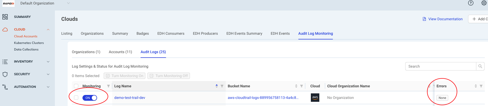
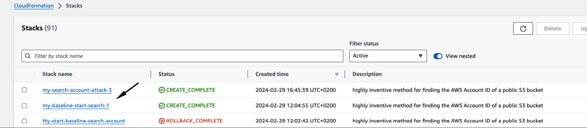

author: Tal Avissar
summary: Trailblazer unusual search account number data by using bucket name
id: Trailblazer-unusual-db-activity
tags:
categories: attack
environments: Web
status: Published
feedback link: https://github.com/SolaceDev/solace-dev-codelabs/blob/master/markdown/Trailblazer-search-account-activity

# Trailblazer demo: Unusual search account activity attack

## Overview

Duration: 0:05:00

Cloud Anomaly Detection
Trailblazer - An artificial inteligence agentless anomaly detection security engine which monitors cloud control plane api activity, detects threats, suspicious activities and abnormal behaviors.
With Trailblazer analyzing threat detections audit logs and tracking API sessions is no longer a challenge.
Trailblazer does this work for you with zero human intervention using unsupervised learming.


This will almost certainly become part of attackers' toolbox. a highly inventive method for finding the AWS Account ID of a public S3 bucket.
This attack describes a technique to find the Account ID of any S3 bucket (both private and public).

Why is this important and useful to attackers (even though accountId is not "secret" by strict AWS definition)?
1. An attacker may need this information to succeed in his attack, now he has automated way to get that from outside (before initial access) and automatically. It can save effort , time, noise, money during actual compromise.
2. Things (e.g. resources) in AWS may be correlated by discovered accountId. Or filtered by it for focused attack.
3. This information may be combined with other attacks and/or security counter measures in unexpected ways. For example avoiding honey tokens (intentionally publicized credentials), [see](https://trufflesecurity.com/blog/canaries)
4. The accountId may be used by organizations in ways unrelated to AWS accounts. Suppose a certain security company creates their own customerId by hashing the customer's AWS accountId.
5. It's possible to use such information to add credibility to phishing attacks.
6. In "attack mode" everything you know may be useful, now or in the future


This attack is using AWS Lambda function:
1. Search abd find an account number isng the policy parameter using policy condition key called “s3:ResourceAccount”
2. Find account number and other hidden metadata for the s3 bucket instance attacked in order to look legit later on.


## Prerequisites: What you need

Duration: 0:05:00

You need to have an AWS Cloud account and access in order to run the cloud formation templates.
CloudTrail needs to be enabled for the account, as well as Data Events for the dynamo db tables participating in this attack. (named '-UnusualDBActivity.-\*' - regex pattern)


You need to have AWS Cloudformation account and access in order to run the cloud formation template.

There are two cloud formation template for each attack
1. Initialization phase cloud formation template which creates basic frofiling of anomaly engine on the suspected/inspected role
   The init phase should run at least for 24 hours before going into step 2

2. Attack demo cloud formation template which creates the actual attack using the role from step 1
## About the demo templates

There are two cloud formation templates for the attack scenario:
1. CFT-Trailblazer-Demo-S3-Account-Search-Start.yaml - Initialization phase cloud formation template which creates basic frofiling of anomaly engine on the suspected/inspected role.

The init phase should run at least for 24 hours before going into step 2

2. CFT-Trailblazer-Demo-S3-Account-Search.yaml - Attack demo cloud formation template which creates the actual attack using the role from step 1

> aside negative
> This cloudformation template simulates malicious activity! make sure you run it in a non critical environment

> aside negative
> verify with your AWS admin before running this CFT

> aside positive
> You will need user/role with the right permissions to run cloud formation templates


## Attack scenario description

The scenario comprises of two parts, baseline (normal behaviour) and attack

#### Baseline:
The normal activity we set up is a normal behaviour lambda.
The lambda assumes a role and get data to from dynamo db table every few hours, this simulates a periodic fetch of data that runs every few hours from s3 bucket.

#### Attack:
The attacker have managed to get access to the role which the backup lambda uses (we can assume it was comprimised using social engineering).
The attacker scan all data in the dynamo db table, and start to conteminate the db table with useless data.

#### Weak points:
- Social Engineering
- Overpermissive role
- Centralized backup


## Onboard Audit Log Monitoring in ICS and monitor the AWS account

Duration: 0:10:00

Before running the AWS account activity simulation, make sure the account is onboarded and monitored in Audit Log Monitoring:
[Audit Log Monitoring Documentation](https://docs.rapid7.com/insightcloudsec/cloud-anomaly-detection/)

Also make sure there are no errors for the account audit log in ICS UI




## Setting up the initialization phase in AWS

Duration: 0:10:00

The normal activity we set up is a lambda, which assumes a role and prints to the log.

### Steps to upload and run the CFT baseline

* Prerequists: make sure youre using the currect user with permission to run and create CF stack
* Navigate to CloudFormation > Stacks
* Click the Create Stack button
* Choose the option (with new resources)

Continuing choose the following options:
* Template is ready
* upload a template file
* Click the choose file button
* Choose the CFT-Trailblazer-Demo-S3-Account-Search-Start.yaml
* Click the next button
* Enter unique descriptive stack name
* Click the next button
* check the checkbox of I acknowledge that AWS CloudFormation might create IAM resources
* Finish while click submit button

Wait for like 5 minutes until all resources are created

CFT needs to run for **at least 24 hours** to let Anomaly Engine getting solid base line profiles

After running the CFT you should see:


Click the resources tab of the stack that ran the CFT you should see the following resources created in status CREATE_COMPLETE
- Event Bridge Rule
- Lambda function
- Lambda Role
- PermissionForLambdaEvent


## Running the actual attack Cloud Formation table

The attack is a malicious lambda which uses the previous role,
the lambda starts to contiminate the db with useless data and scan the db to syslog.

> aside positive
> Before performing these steps verify that the baseline was run at least 24 hours before running CFT

Prepare your cloud formation in order to run search account attack

* Prerequists: make sure youre using the currect user with permission to run and create CF stack
* Navigate to CloudFormation > Stacks
* Click the Create Stack button
* Choose the option (with new resources)

Continuing choose the following options:
* Template is ready
* upload a template file
* Click the choose file button
* Choose the CFT-Trailblazer-Demo-Start-Unusual-DB-Activity.yaml
* Click the next button
* Enter unique descriptive stack name
* Click the next button
* Click the checkbox of I acknowledge that AWS CloudFormation might create IAM resources
* Click submit

## Verifying detection appear in ICS UI

Duration: 0:15:00

> aside negative
> After waiting for at least 15 minutes

Navigate to the ICS UI and refresh the page and perform the needed advanced filtering:
* Events Source=Rapid7

Verify you see in threat findings UI detections of finding type
``` txt
API Activity: unusual change in count of unique actions
API Activity: unusual DB activity
```


## Remediation and recommendations
#### Social Engineering:
Preventing cyber social engineering involves a combination of education, awareness, and implementing security measures. Here are some strategies to help prevent cyber social engineering:
- Education and training
- Verify requests by contacting the supposed requester
- Use multi-factor authentication
- Use Strong passwords

#### Overpermissive Principles
To prevent overpermissive principles in AWS roles and users, regularly review IAM policies, adhere to the principle of least privilege, utilize IAM policy conditions, implement automated policy enforcement, and provide comprehensive training on IAM best practices.

#### Centralized Backups
Centralized backups consolidate data in one location, creating a single point of failure vulnerable to hardware issues or cyberattacks. In contrast, distributed backups spread data across multiple locations, enhancing resilience and reducing the risk of data loss.

## Demo removal
In order to remove the demo, follow these steps:
1. Log into the AWS account
2. Go to AWS CloudFormation
3. Delete CFT-Trailblazer-Demo-S3-Account-Search-Start.yaml Cloud Formation Template
4. Delete CFT-Trailblazer-Demo-S3-Account-Search.yaml Cloud Formation Template


## Summary

Duration: 0:02:00

✅ Trailblazer created detection finding type of - unusual change in count of unique actions

✅ Trailblazer anomaly detection of resource name lambda.amazonaws.com

✅ Trailblazer created anomaly detection of resource name lambda.amazonaws.com

✅ Verify whether GuardDuty identified the attack and created detection (probably not detected)...


