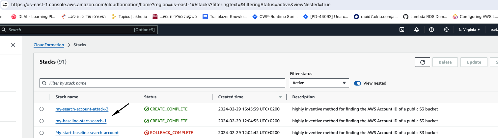
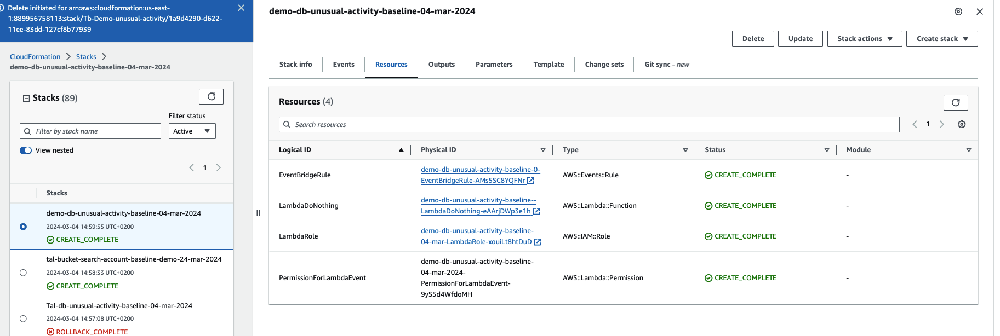

author: Tal Avissar
summary: this
id: Trailblazer-unusual-db-activity
tags:
categories:
environments: Web
status: Published
feedback link: https://github.com/SolaceDev/solace-dev-codelabs/blob/master/markdown/Trailblazer-unusual-db-activity

# Trailblazer demo attack of unusual db activity

## What you'll learn: Overview

Duration: 0:05:00

Cloud Anomaly Detection
Trailblazer - An AI-based agentless security engine that monitors cloud control plane api activity, detects threats, suspicious activities and abnormal behaviors. Analyzing audit logs and tracking API sessions is no longer a challenge.
The Cloud Anomaly Detection feature does this work for you with zero human touch.

We want to explore and see detections coming from trailblazer anomay engine related to Unusual Db activities.

From the same Principal (user, role, etc.) initiate API calls applying to multiple DB instances, engines, tables, snapshots, keyspaces and similar DBs-related resources (i.e. via RDS, DynamoDB, and other AWS DB services),
in roughly the same time (seconds), repeatedly over an extended period (roughly 15 minutes).
Persist an item to a DynamoDB table using Lambda function

The detection is usung Lambda function to:
1. Contaminate the dynamo db table with non relavant record rows
2. Scan table for exiting data
3. Print all data in table to sys log  :hushed:

### Info Boxes
Plain Text followed by green & yellow info boxes

> aside negative
> This will appear in a yellow info box.

> aside positive
> This will appear in a green info box.

### Numbered List
1. List
1. Using
1. Numbers

### Add an Image or a GIF

## What you need: Prerequisites

Duration: 0:07:00

prerequisites
You need to have AWS Cloudformation account and access in order to run the cloud formation template.

There are two cloud formation template for each attack
1. Initialization phase cloud formation template which creates basic frofiling of anomaly engine on the suspected/inspected role
   The init phase should run at least for 24 hours before going into step 2

2. Attack demo cloud formation template which creates the actual attack using the role from step 1

### Add a Link
Add a link!
[Example of a Link](https://www.google.com)

### Embed an iframe

## Setting up the init phase in Cloud formation

### Steps to upload and run the CFT
Plain Text followed by bullets
* Prerequists: make sure youre using the currect user with permission to run and create CF stack
* Navigate to CloudFormation > Stacks
* Click the Create Stack button
* Choose the option (with new resources)

Continuing choose the following options:
* Template is ready
* upload a template file
* Click the choose file button
* Choose the CFT-Trailblazer-Demo-Start-Unusual-DB-Activity.yaml
* Click the next button
* Enter unique descriptive stack name
* Click the next button
* check the checkbox of I acknowledge that AWS CloudFormation might create IAM resources
* Finish while click submit button

Wait for like 5 minutes until all resources are created

This CFT needs to run for at least 24 hours to let Anomaly Engine getting solid base line profiles

After running the CFT you should see:

Click the resources tab of the stack that ran the CFT you should see the following resources created in status CREATE_COMPLETE
- Event Bridge Rule
- Lambda function
- Lambda Role
- PermissionForLambdaEvent

## Running the attack CFT

Prepare your cloud formation in order to run db unusual activities attack

## Verifying detection appear in ICS UI

After waiting for about 10 minutes
Navigate to the ICS UI and refresh the page and perform the needed filtering

## Takeaways

Duration: 0:03:00

✅ Trailblazer created detection finding type of - unusual change in count of unique actions

✅ Trailblazer anomaly detection of resource name lambda.amazonaws.com

✅ Trailblazer created anomaly detection of resource name lambda.amazonaws.com

Thanks for participating in this codelab! Let us know what you thought in the [Rapid7 Community Forum](https://rapid7.community/)! If you found any issues along the way we'd appreciate it if you'd raise them by clicking the Report a mistake button at the bottom left of this codelab.
