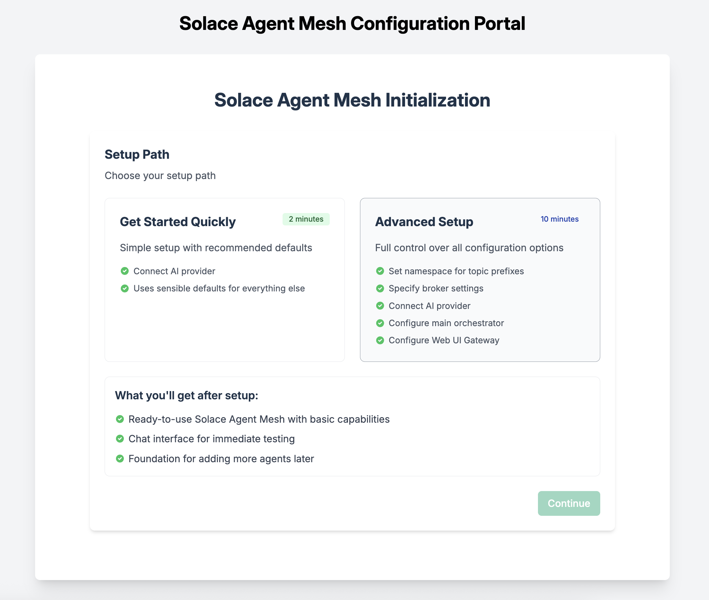
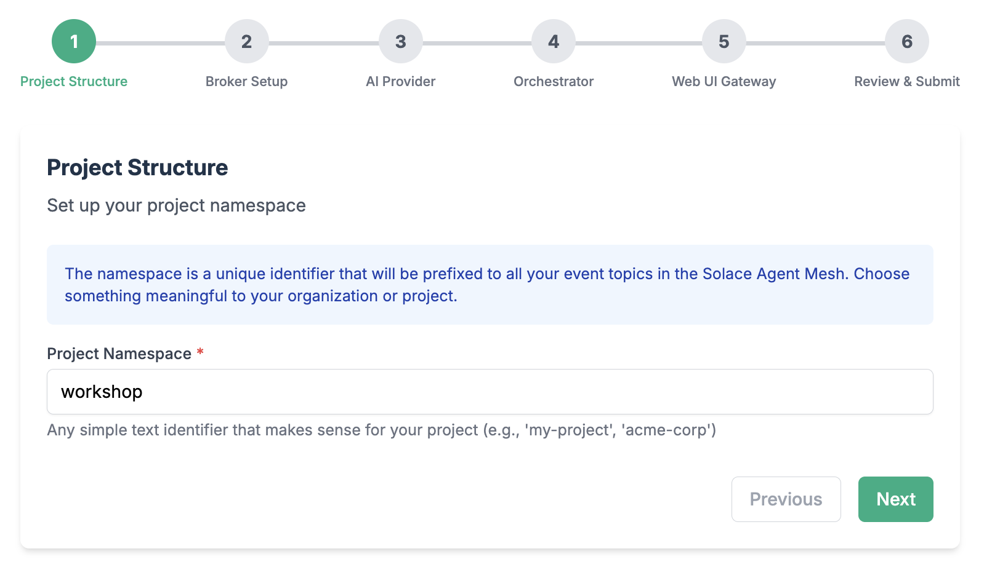
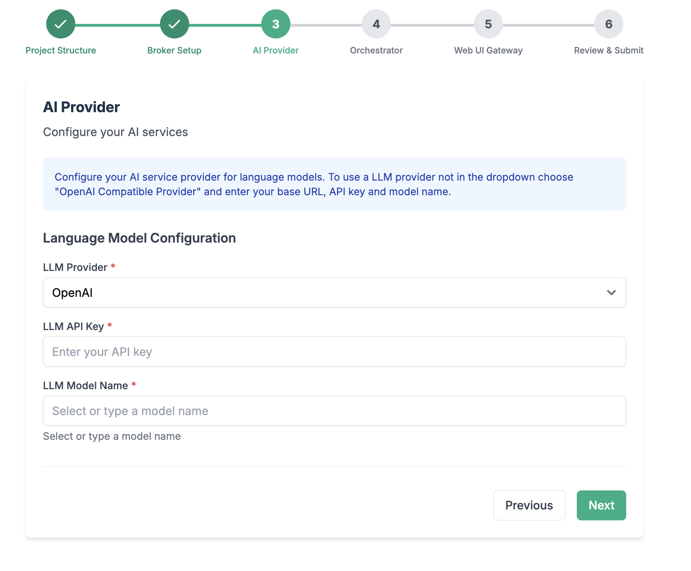
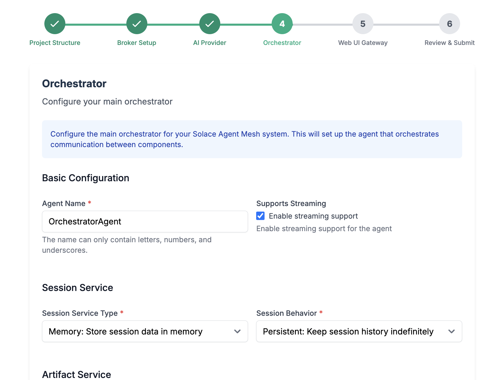
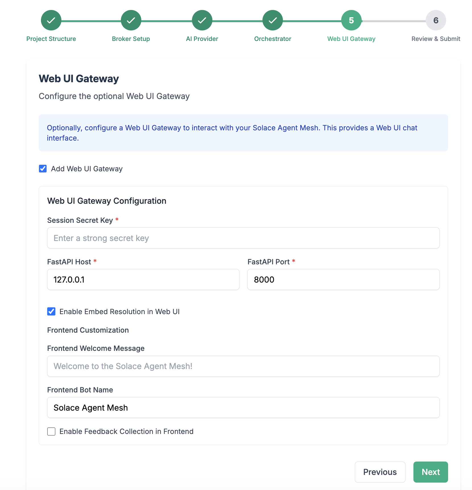
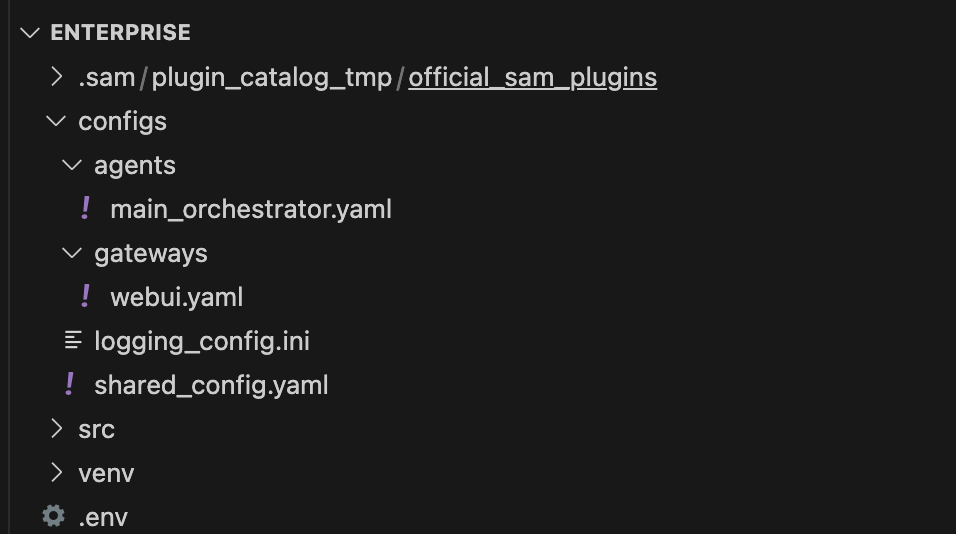
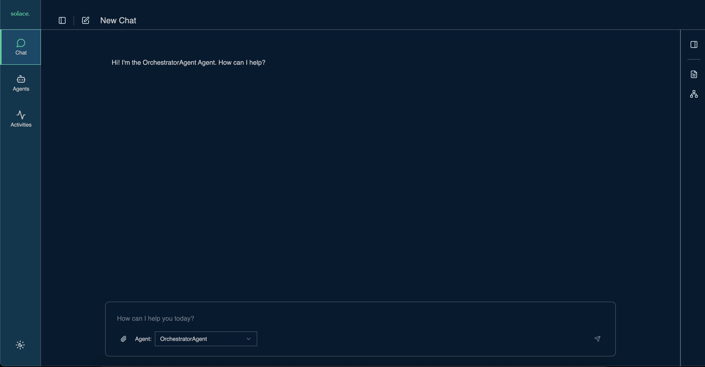

author: Tamimi
summary:
id: ai-bootcamp
tags:
categories:
environments: Web
status: Hidden
feedback link: https://github.com/SolaceDev/solace-dev-codelabs/blob/master/markdown/ai-bootcamp

# AI Bootcamp - Solace HQ

## Introduction
Duration: 0:01:00

Welcome to the HQ AI Bootcamps to come up to speed with Solace Agent Mesh. 

Follow the steps in this codelab to get started with the Enterprise Image for SAM.

## Load Enterprise Image 
Duration: 0:02:00

1. Download the enterprise image from [https://products.solace.com/](https://products.solace.com/)
1. Load the image into your local docker 

```
docker load -i path/to/solace-agent-mesh-enterprise-{version}.tar.gz
```

On successful loading, check the list of existing images
```
docker images 
```

> aside positive
> Tip: you can rename the image and tag as follows
> ```
> docker tag <original_name>:<original_tag> solace-agent-mesh-enterprise:<version>
> ```

> aside positive 
> If you don't have `docker` you can use `podman` and replace every docker command with podman

## Install SAM CLI
Duration: 00:05:00

While you dont technically need the SAM cli to work with the enterprise edition, this will facilitate creating the files you need. We will make use of the scaffolding commands to initialize and create SAM components.

1. Create working directory
    ```
    mkdir sam-bootcamp
    cd sam-bootcamp
    ```

1. Setup Python virtual environment
    ```
    python3.12 -m venv venv
    ```
    > aside positive
    > Depending on how you installed python on your machine, this command could be `python3`

    > aside positive
    > Note: If you dont have `venv` installed you will have to download it as follows `python3 -m pip install --user virtualenv`

    > aside positive
    > If you are running this on WSL/Linux you can use `python3-venv` instead and its installed as follows `apt-get install python3-venv`


1. Activate virtual environment

    ```
    source venv/bin/activate
    ```
    > aside positive
    > On windows activate it as follows `venv/Scripts/activate`

    > aside negative
    > This virtual environment is session lived; i.e. if you open a new session you will have to activate the virtual environment again

1. Install solace agent mesh

    ```
    pip install solace-agent-mesh
    ```

    > aside positive
    > Since you activated the virtual environment, you can use `pip` instead of `pip3` and `python` instead of `python3` since everything is within the virtual env session. You can confirm this by running 
    > ```
    > python --version
    > ```

## Initialize SAM
Duration: 00:10:00

In the same directory, run the following 

```
sam init --gui
```



1. From here, choose "Advanced Setup" to spin up an instance of the Agent Mesh that uses the Solace Broker as the communication backbone. 

    > aside negative
    > Note that the simple setup "Getting Started Quickly" spins up Agent Mesh without the Solace Broker and uses in-memory queues instead. This is not meant for production ready development and proof of concept project that require high performance and multiple Agentic workflow interactions.

1. Choose a namespace for your project

    

    > aside positive
    > The namespace will act as the topic root for all events in SAM

1. Configure connection to the Solace Broker

    

    > aside positive
    > Note: If you are using a Solace Cloud instance, you can get the connection parameters from the connect tab after spinning up a Broker Service. Use the Solace Web Messaging Protocol

    > aside positive
    > If you are running a local broker on a docker container with SAM Enterprise in a docker container as well, we will configure this in the following steps to leverage docker network

1. Configure your LLM endpoint, API Key, and Model name

    

    > aside positive
    > The model of choice impact the performance of your results and system behaviour. A performative model is recommended for advanced use-cases

    - From the LLM Provider, chose `OpenAI Compatible Provider`
    - Use `https://lite-llm.mymaas.net` as your LLM Endpoint URL
    - If you do not have a token, ask Solace Chat to generate a token for you. Navigate to [https://solacechat.mymaas.net/](https://solacechat.mymaas.net/). Note: If that doesnt work use [https://solacechatbeta.mymaas.net/](https://solacechatbeta.mymaas.net/)
    - Choose a model of choice. You can search for the model. Search for _gpt_ and choose `azure-gpt-4o`


1. Configure the orchestrator agent

    

    > aside positive
    > Keep all the configuration parameters as default. You can explore the other options for configuring the orchestrator agent to see what you have available for fine tuning the behaviour

1. Configure the WebUI Gateway
    

    > aside positive
    > Note: Choose any Session Secret Key needed for the WebUI. Keep the remaining configurations as default. 

    > aside positive
    > If you are running a local broker on a docker container with SAM Enterprise in a docker container as well, we will configure this in the following steps

Finalize the last steps and close the browser window when initialization is done. 

Now back to your terminal window, lets investigate the directories. Open your directory in your favourite editor



1. `configs`: contains yaml config files
    - agents --> e.g. `main_orchestrator.yaml`
    - gateways --> e.g. `webui.yaml`
1. `venv`: contains all python packages
1. `.env`: environment variables
1. `.sam`: plugins templates


## Start SAM Enterprise
Duration: 00:10:00

This step is involved with running SAM enterprise with the new files generated.

1. [Optional] Create a docker network bridge so that your SAM container can communicate with your Solace Broker container
    ```
    docker network create -d bridge sam-network
    ```

    > aside positive
    > skip this step if you are connecting to a cloud hosted broker instead

1. Create a `docker-compose.yaml` file with the following content
    ```yaml
    services:
        sam-ent:
            image: solace-agent-mesh-enterprise:1.0.37
            container_name: sam-ent
            platform: linux/amd64
            # entrypoint: /bin/bash
            stdin_open: true       # same as -it
            tty: true              # same as -it
            volumes:
            - ./configs:/app/configs
            - ./.env:/app/.env
            - ./enterprise-logs:/app  # Map the entire /app directory to enterprise-logs

            networks:
            - sam-network
            ports:
            - "0.0.0.0:8001:8001"        # expose container port 8001 as port 8001 on host IP 0.0.0.0

    networks:
        sam-network:
            external: true          # reuse your existing network

    ```

    Notes: 
    - Update the image `name:tag` to what you your image is called. Execute `docker images` to get a list. 
    - `platform: linux/amd64` if you are running on mac
    - `networks: sam-network` if you are attempting to connect to a local solace broker running on docker
    - We are passing the `configs` directory and `.env` file as volumes to the container
    - We are placing all the sam logs created in the container to a local directory called `enterprise-logs`
    - the `networks` section could be removed if you skipped previous step of creating a docker bridge

    > aside positive
    > There are two modes of operation for SAM
    > 1. Connect with broker (Cloud or Software)
    > 2. Run without broker (Dev Mode)

1. Create a directory called `enterprise-logs`
    ```
    mkdir enterprise-logs
    ```

1. [Optional] Run local solace broker (alternatively: use Solace Cloud)
    ```
    docker run -d -p 8080:8080 -p 55554:55555 -p 8008:8008 -p 8000:8000 -p 1883:1883 -p 5672:5672 -p 9000:9000 -p 2222:2222 --shm-size=2g --env username_admin_globalaccesslevel=admin --env username_admin_password=admin --name=solace solace/solace-pubsub-standard
    ```
1. Add the solace broker container to the same SAM network
    ```
    docker network connect sam-network solace
    ```
1. Open `.env` file and make the following changes
    - `SOLACE_BROKER_URL="ws://solace:8008"` - Update the broker URL to use the solace broker container
    - `FASTAPI_HOST="0.0.0.0"` - This where the webUI Gateway is hosted on the SAM Enterprise container. We change it to `0.0.0.0` to make sure its reachable by host
    - `FASTAPI_PORT="8001"`- In case your solace broker has port 8000 exposed
    - `WEB_UI_GATEWAY_DATABASE_URL="sqlite:///data/webui_gateway.db"` Change your Web UI Gateway Database to use a relative path on your broker instead 

    This is the final `.env` file
    ```
    LLM_SERVICE_ENDPOINT="https://lite-llm.mymaas.net"
    LLM_SERVICE_API_KEY="<llm_token_goes_here>"
    LLM_SERVICE_PLANNING_MODEL_NAME="openai/azure-gpt-4o"
    LLM_SERVICE_GENERAL_MODEL_NAME="openai/azure-gpt-4o"
    NAMESPACE="bootcamp/"
    SOLACE_BROKER_URL="ws://solace:8008"
    SOLACE_BROKER_VPN="default"
    SOLACE_BROKER_USERNAME="default"
    SOLACE_BROKER_PASSWORD="default"
    SOLACE_DEV_MODE="false"
    SESSION_SECRET_KEY="temp"
    FASTAPI_HOST="0.0.0.0"
    FASTAPI_PORT="8001"
    FASTAPI_HTTPS_PORT="8443"
    SSL_KEYFILE=""
    SSL_CERTFILE=""
    SSL_KEYFILE_PASSWORD=""
    ENABLE_EMBED_RESOLUTION="True"
    LOGGING_CONFIG_PATH="configs/logging_config.ini"
    S3_BUCKET_NAME=""
    S3_ENDPOINT_URL=""
    S3_REGION="us-east-1"
    WEB_UI_GATEWAY_DATABASE_URL="sqlite:///data/webui_gateway.db"
    ```

    > aside positive
    > Note that the specific model identifier that the endpoint expects in the format of `provider/model` (e.g., `openai/gpt-4`, `anthropic/claude-3-opus-20240229`).

1. Run docker compose
    ```
    docker compose up 
    ```

    > aside positive
    > When the Solace Enterprise container runs, the entry point command for the container is `sam run`. What this command does is go through all the yaml configuration files under the configs dir and run them. At this point its only the orchestrator agent and web UI gateway.

    > aside positive
    > The docker compose file makes sure port `8001` from the container is exposed to port `8001` on the host 

1. Open your browser and navigate to [http://localhost:8001/](http://localhost:8001/)
    

Try the following prompts:

```
Give me a list of all the agents in the system
What are the tools you have access to

```

## What is happening in the broker? 
Duration: 00:01:00

When SAM runs, it configures a couple of queues with subscriptions. 

1. Navigate to your broker admin console (e.g. [http://localhost:8080](http://localhost:8080))
1. Look at the created queues
1. Look at the subscriptions on each queue

## Adding agents with built-in tools
Duration: 00:10:00

Now that you have a docker image running the enterprise edition of SAM, lets go ahead and add configuration files. 

### Basic Agents

1. From a new terminal window, navigate to your configs directory
    ```
    cd sam-bootcamp/configs/agents
    ```
1. Add an agent file that leverages internal tools
    ```
    curl https://raw.githubusercontent.com/SolaceLabs/solace-agent-mesh/refs/heads/main/examples/agents/a2a_agents_example.yaml -o a2a_agents.yaml
    ```

1. Restart the enterprise container
    ```
    docker restart sam-ent
    ```

    > aside positive 
    > This restarts the SAM enterprise image with a new config agent config file
    > Pro tip: you can interactively go into the by executing the following
    > ```
    > docker exec -it sam-ent bash
    > ```


This file contains multiple agent configuration that leverages built-in tools. Go ahead and open this file lets inspect it.
Here is an example section from the file

```yaml
 - name: markitdown_agent_app
    app_base_path: .
    app_module: solace_agent_mesh.agent.sac.app
    broker:
      <<: *broker_connection

    # --- App Level Config ---
    app_config:
      namespace: ${NAMESPACE}
      supports_streaming: true
      agent_name: "MarkitdownAgent"
      display_name: "Markdown Creator"
      model: *multimodal_model # Or *planning_model, choose as appropriate
      instruction: |
        The MarkitdownAgent has the following capability:
        * convert various file types (like PDF, DOCX, XLSX, HTML, CSV, PPTX, ZIP) to Markdown.
        Any files you get that might be useful should be saved using create_artifact.
        There is no need to provide a preview of the content in the response.

      # --- Tools Definition ---
      tools:
        - tool_type: builtin
          tool_name: "convert_file_to_markdown"
        - tool_type: builtin-group
          group_name: "artifact_management"

      session_service:
        type: "memory"
        default_behavior: "PERSISTENT" # Or "RUN_BASED"

      artifact_service:
        type: "filesystem"
        base_path: "/tmp/samv2"
        artifact_scope: namespace
      artifact_handling_mode: "reference"
      enable_embed_resolution: true
      enable_artifact_content_instruction: true

      # --- Agent Card Definition ---
      agent_card:
        description: "An agent that converts various file types (like PDF, DOCX, XLSX, HTML, CSV, PPTX, ZIP) to Markdown format."
        defaultInputModes: ["text", "file"] # Can take files as input
        defaultOutputModes: ["text", "file"] # Outputs markdown file
        skills:
        - id: "convert_file_to_markdown"
          name: "Markdown Converter"
          description: "Converts various file types to Markdown format."

      # --- Discovery & Communication ---
      agent_card_publishing: { interval_seconds: 10 }
      agent_discovery: { enabled: false }
      inter_agent_communication:
        allow_list: []
        request_timeout_seconds: 60
```

Notes: 
- Name of the agent is markitdown_agent_app
- Uses the `convert_file_to_markdown` built-in tool and the `artifact_management` group of tools
    ```yaml
    tools:
        - tool_type: builtin
          tool_name: "convert_file_to_markdown"
        - tool_type: builtin-group
          group_name: "artifact_management"
    ```
- Configures the agent card by exposing the _skills_ this agent is capable of doing:
    ```yaml
    skills:
        - id: "convert_file_to_markdown"
          name: "Markdown Converter"
          description: "Converts various file types to Markdown format."
    ```
- Adds instructions to SAM on what this agent does
    ```yaml
    instruction: |
        The MarkitdownAgent has the following capability:
        * convert various file types (like PDF, DOCX, XLSX, HTML, CSV, PPTX, ZIP) to Markdown.
        Any files you get that might be useful should be saved using create_artifact.
        There is no need to provide a preview of the content in the response.
    ```

### Adding a multimedia agent
Lets add another multi-modal agent. This agent is capable of generating and processing content in both audio and visual formats. It includes features like text-to-speech with tone-based voice selection, multi-speaker conversations, audio transcription, image generation, and image analysis, while providing detailed guidelines for using these features effectively.

In the `configs/agents` directory

1. Add an agent file that leverages internal tools
    ```
    curl https://raw.githubusercontent.com/SolaceLabs/solace-agent-mesh/refs/heads/main/examples/agents/a2a_multimodal_example.yaml -o multimodal.yaml
    ```

1. Shared 
    ```
    image_describe: &image_description_model
      # This dictionary structure tells ADK to use the LiteLlm wrapper.
      # 'model' uses the specific model identifier your endpoint expects.
      model: ${IMAGE_DESCRIPTION_MODEL_NAME} # Use env var for model name
      # 'api_base' tells LiteLLM where to send the request.
      api_base: ${IMAGE_SERVICE_ENDPOINT} # Use env var for endpoint URL
      # 'api_key' provides authentication.
      api_key: ${IMAGE_SERVICE_API_KEY} # Use env var for API key

    audio_transcription: &audio_transcription_model
      # This dictionary structure tells ADK to use the LiteLlm wrapper.
      # 'model' uses the specific model identifier your endpoint expects.
      model: ${AUDIO_TRANSCRIPTION_MODEL_NAME} # Use env var for model name
      # 'api_base' tells LiteLLM where to send the request.
      api_base: ${AUDIO_TRANSCRIPTION_API_BASE} # Use env var for endpoint URL
      # 'api_key' provides authentication.
      api_key: ${AUDIO_TRANSCRIPTION_API_KEY} # Use env var for API key
    ```

1. Update yor env file with the following environment variable
    ```
    GEMINI_API_KEY=<token>
    ```

    > aside positive
    > Ask your instructor for a Gemini key or generate one from [aistudio.google.com](aistudio.google.com)

1. Restart the enterprise container
    ```
    docker restart sam-ent
    ```

## Adding MCP Agent 
Duration: 00:05:00

To add an MCP agent, we will simply define an agent yaml file with the basic configuration. In this step, we will go ahead and add a [Google Maps MCP Agent](https://github.com/cablate/mcp-google-map).

### Add Agent File 

1. Create a new file under `configs/agents`
    ```
    cd configs/agents
    touch google_maps_mcp.yaml
    ```
1. Open that file and place the following content in the file
    ```yaml
    # Solace AI Connector: Agent Configuration Template
    log:
    stdout_log_level: INFO
    log_file_level: DEBUG
    log_file: a2a_agent.log

    !include ../shared_config.yaml

    apps:
    - name: "GoogleMaps__app"
        app_base_path: .
        app_module: solace_agent_mesh.agent.sac.app
        broker:
        <<: *broker_connection

        # App Level Config
        app_config:
        namespace: "${NAMESPACE}" # Your A2A topic namespace
        supports_streaming: true # Host capability flag
        agent_name: "GoogleMaps"
        # The model will be an alias like *planning_model, *general_model etc.
        # The python script will replace *general_model with the correct alias string.
        model: *general_model 

        instruction: | # User-provided instruction
            TO BE FILLED
        
        tools: 
            ## TO BE FILLED

        session_service: *default_session_service
        artifact_service: *default_artifact_service
        
        artifact_handling_mode: "embed" # How to handle artifacts
        enable_embed_resolution: true # Enable embed feature and instruction injection
        enable_artifact_content_instruction: true # Enable instruction for late-stage embed
        enable_builtin_artifact_tools: # Enable artifact tools and instruction injection
            enabled: true
        enable_builtin_data_tools: # Enable data analysis tools and instruction injection
            enabled: false
        data_tools_config: *default_data_tools_config # Use the default data tools config

        # Agent Card Definition
        agent_card:
            description: "TO BE FILLED"
            defaultInputModes: [text] 
            defaultOutputModes: [text, file] 
            skills: []
        
        # Discovery & Communication
        agent_card_publishing: 
            interval_seconds: 10
        agent_discovery: 
            enabled: true
        inter_agent_communication:
            allow_list: [""] 
            deny_list: [] 
            request_timeout_seconds: 180
    ```

1. Update the `instruction` section with the following
    ```yaml
        You are a Google Maps MCP server with the following capabilities:

        1. Location Search
        - Search for places near a specific location with customizable radius and filters
        - Get detailed place information including ratings, opening hours, and contact details

        2. Geocoding Services
        - Convert addresses to coordinates (geocoding)
        - Convert coordinates to addresses (reverse geocoding)

        3. Distance & Directions
        - Calculate distances and travel times between multiple origins and destinations
        - Get detailed directions between two points with step-by-step instructions
        - Support for different travel modes (driving, walking, bicycling, transit)

        4. Elevation Data
        - Retrieve elevation data for specific locations
    ```

1. Update the tools section with the following: 
    ```yaml
    tools: 
        - group_name: artifact_management
          tool_type: builtin-group
        - group_name: general
          tool_type: builtin-group
        - connection_params:
            args:
            - -y
            - '@cablate/mcp-google-map'
            command: npx
            type: stdio
          environment_variables:
            GOOGLE_MAPS_API_KEY: ${GOOGLE_MAPS_API_KEY} 
          tool_type: mcp
    ```

    A couple of things to point out: 
    - This Agent leverages two built-in tools `artifact_management` and the `general` builtin-group
    - Also uses tools exposed by a local MCP server as configured via `tool_type: mcp`
    - The MCP server runs locally as per the [Google Maps MCP Agent Documentation](https://github.com/cablate/mcp-google-map)
    - An env var is required for this MCP server as defined in `environment_variables`

The final config file looks like this
```yaml

log:
  stdout_log_level: INFO
  log_file_level: DEBUG
  log_file: a2a_agent.log

!include ../shared_config.yaml

apps:
  - name: "GoogleMaps__app"
    app_base_path: .
    app_module: solace_agent_mesh.agent.sac.app
    broker:
      <<: *broker_connection

    # App Level Config
    app_config:
      namespace: "${NAMESPACE}" # Your A2A topic namespace
      supports_streaming: true # Host capability flag
      agent_name: "GoogleMaps"
      # The model will be an alias like *planning_model, *general_model etc.
      # The python script will replace *general_model with the correct alias string.
      model: *general_model 

      instruction: | # User-provided instruction
        You are a Google Maps MCP server with the following capabilities:

        1. Location Search
        - Search for places near a specific location with customizable radius and filters
        - Get detailed place information including ratings, opening hours, and contact details

        2. Geocoding Services
        - Convert addresses to coordinates (geocoding)
        - Convert coordinates to addresses (reverse geocoding)

        3. Distance & Directions
        - Calculate distances and travel times between multiple origins and destinations
        - Get detailed directions between two points with step-by-step instructions
        - Support for different travel modes (driving, walking, bicycling, transit)

        4. Elevation Data
        - Retrieve elevation data for specific locations
      
      tools: 
        - group_name: artifact_management
          tool_type: builtin-group
        - group_name: general
          tool_type: builtin-group
        - connection_params:
            args:
            - -y
            - '@cablate/mcp-google-map'
            command: npx
            type: stdio
          environment_variables:
            GOOGLE_MAPS_API_KEY: ${GOOGLE_MAPS_API_KEY} 
          tool_type: mcp

      session_service: *default_session_service
      artifact_service: *default_artifact_service
      
      artifact_handling_mode: "embed" # How to handle artifacts
      enable_embed_resolution: true # Enable embed feature and instruction injection
      enable_artifact_content_instruction: true # Enable instruction for late-stage embed
      enable_builtin_artifact_tools: # Enable artifact tools and instruction injection
        enabled: true
      enable_builtin_data_tools: # Enable data analysis tools and instruction injection
        enabled: false
      data_tools_config: *default_data_tools_config # Use the default data tools config

      # Agent Card Definition
      agent_card:
        description: "Google Maps MCP server with the following capabilities: Location Search, Geocoding Services, Distance & Directions, Elevation Data."
        defaultInputModes: [text] 
        defaultOutputModes: [text, file] 
        skills: []
      
      # Discovery & Communication
      agent_card_publishing: 
        interval_seconds: 10
      agent_discovery: 
        enabled: true
      inter_agent_communication:
        allow_list: [] 
        deny_list: [] 
        request_timeout_seconds: 180
```

### Add Env var

Edit your .env file to add a `GOOGLE_MAPS_API_KEY`

```yaml
GOOGLE_MAPS_API_KEY="YOUR_API_KEY"
```

### Restart Enterprise docker
```
docker restart sam-ent
```

Now navigate to your SAM instance on [http://localhost:8001/](http://localhost:8001/) and see the new agent added


## Adding Agent with Web GUI 
Duration: 00:05:00

```
sam add agent --gui
```
