author: Swen-Helge Huber
summary:
id: Apigee-apim-integration
tags: iguide
categories: Apigee, solace
environments: Web
status: Published
feedback link: https://github.com/SolaceDev/solace-dev-codelabs/blob/master/markdown/Apigee-apim-integration

# Unified APIM: Integrating Solace Event Portal with Apigee Platform and Developer Portal 

## Overview

Duration: 0:05:00

The blog ["Take Event APIs to where your Apigee APIs are …"](http:todo.com/) introduced an integration between the Google Apigee and Solace Platforms.

In this codelab we walk you through the steps that enable the developer experience for event APIs demonstrated in the blog.

The overall solution looks like this:
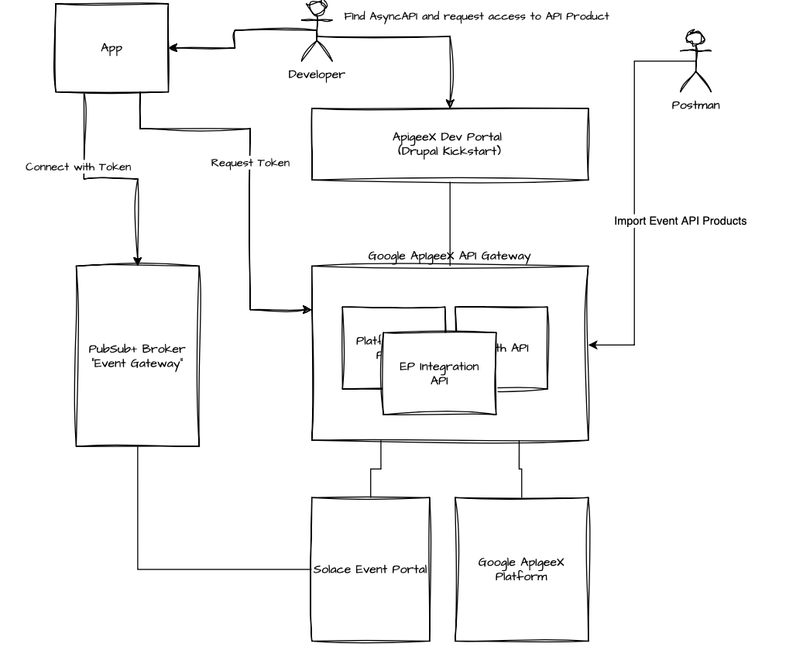

Let’s look at all the components involved:
* Apigee Dev Portal: the developer portal that developer interact with to find APIs and register their apps
* App: the application that the developer creates. We simulated this app with postman in the sections above.
* PubSub+ Broker: the event broker that the event API is accessible on. As it acts similarly to an API Gateway, we could also call it an “Event Gateway”. 
* Google Apigee API Gateway: the API gateway hosting all the required API Proxies for the integration (more on these later)
* Solace Event Portal: the event governance platform that allows to manage Events, Event APIs an Event API Products.
* Apigee Platform: the API management back office

As you can see the interactions flow through the Apigee gateway as we chose to implement the integration completely in Apigee:
* The integration provides a REST API for Discovery of Event API Products and to subsequently import these to the Dev Portal and Apigee platform. This includes uploading AsyncAPI specs to the developer portal as well as creating Apigee API Products that represent Event API Products
* Dev Portal requests to the core Apigee platform are proxied via the gateway – this allows us to hook our integration into requests such as adding an API Product to an app or deletion of apps. So we can create and manage app registrations and access requests in Solace Event Portal – which are required for the configuration of runtime access on the “Event Gateway”.

Head over to the blog to learn more if you haven't read it yet.

## Prerequisites

Duration: 0:15:00

### Solace Cloud Account & PubSub+ Broker

You need access to a Solace Cloud account  - including Event Portal -  and a PubSub+ Event Broker.

No problem if you haven't got that yet, simply follow step 3 in the [A Solace Primer - Getting Started with Solace PubSub+ Event Broker](https://codelabs.solace.dev/codelabs/get-started-basics/#2) codelab

### Solace Cloud API Token

You need to supply a Solace API Token to the API Proxies you'll deploy in Apigee.

Follow the steps at [API Authentication](https://api.solace.dev/cloud/reference/apim-getting-started#api-authentication) in the Solace Platform API documentation to create the token and store it in a place that you can refer to it again.

You can always regenerate the API token if it gets lost. 

### Apigee 

#### Start Apigee API Gateway 

If you haven't got a working Apigee environment you can go to the [Apigee console](https://console.cloud.google.com/Apigee/welcome) and either start the free trial or use the "Setup with Defaults" option.

> aside positive
> Enable external network access via HTTPS so you can easily access the APigee API Proxies later on in this codelab.
> **Take note of your API Gateway hostname as you will need it when you configure the Apigee DevPortal Kickstart.** If you launched the free trial it'll probably look similar to `34.54.246.147.nip.io`. 

> aside negative
> The duration of this step depends on how long the Google Cloud deployment and activation processes take.

#### Create a Service Account with Full Access to Apigee APIs

In the Google Cloud Console go to [Service Accounts](https://console.cloud.google.com/iam-admin/serviceaccounts) and create a new service account, name it "Apigee-eventportal-integration", add the "Apigee API Admin" role and save it.

> aside positive
> Once the account is created save the account email. You will need this later when deploying Apigee API Proxies.


### Apigee Developer Portal Kickstart

Set up the Developer Portal via the [Kickstart solution](https://console.cloud.google.com/marketplace/product/bap-marketplace/Apigee-drupal-devportal).

When launching the Kickstart, enable HTPS connectivity:
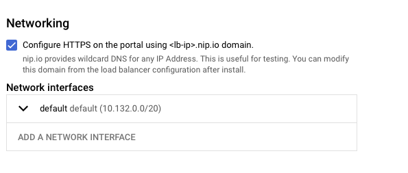

> aside positive
> Take note of the service account's email address when configuring the service account. You can re-use this account later when deploying the Apigee API Proxies


> aside negative
> Startup can take some time beyond completion of the infrastructure deployment. We would recommend to wait 30-45 min for the software initialisation to finish before starting the Dev Portal configuration.


### curl

REST API calls in this codelab are given as [curl](https://curl.se/) commands.

### MQTT Client

You can use MQTT to test developer access to Event APIs on the Solace PubSub+ Broker - a suitable tool is [MQTTX](https://mqttx.app/).

You can also use any other tool that you use to connect to Solace brokers.

### Java & Maven

You will use the `Apigee-deploy-maven-plugin` to package API Proxies.

See the prerequisites for running the maven plugin in the [README](https://github.com/Apigee/Apigee-deploy-maven-plugin/blob/main/README.md#Prerequisites)

### Clone github project

1. Fork the solace-Apigee-sample repo from [https://github.com/solace-iot-team/solace-Apigee-sample](https://github.com/solace-iot-team/solace-Apigee-sample)  

2. Clone your fork

```bash
git clone git@github.com:<YOUR_GITHUB_USER>/solace-Apigee-sample.git
cd solace-dev-codelabs
git checkout -b <BRANCH_NAME>
```
> aside positive
> Replace `< YOUR_GITHUB_USER >` with your github username and `< BRANCH_NAME >` with a suitable name.


> aside positive
> If you do not have [SSH setup](https://docs.github.com/en/authentication/connecting-to-github-with-ssh/generating-a-new-ssh-key-and-adding-it-to-the-ssh-agent) on your machine and got an error cloning the repo, you can clone the https link instead as follows:
> ```
> git clone https://github.com/<YOUR_GITHUB_USER>/solace-Apigee-sample.git
> ```

## Configure the Drupal Developer Portal

Duration 0:15:00

### Complete Portal Setup

When viewing your Dev Portal deployment in the Google Cloud console click "CONFIGURE YOUR SITE"  to finish the Dev Portal Setup
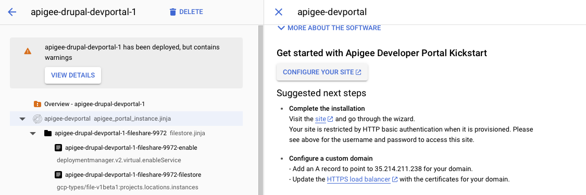


### Remove HTTP Basic Authentication

The steps to remove HTTP Basic Authentication are described on the deployment page of the Dev Portal in the Google Cloud Console.

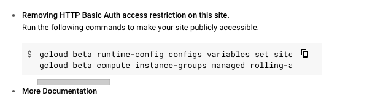


> aside positive
> This step requires the gcloud CLI. If you have not installed it locally you can connect to one of the Dev Portal VMs via SSH in [Compute Engine](https://console.cloud.google.com/compute/instances)
> 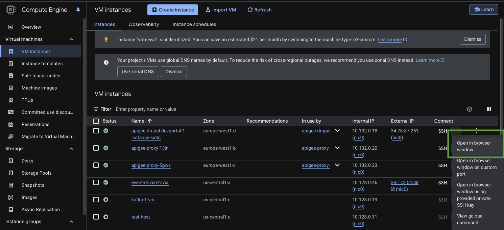

> aside negative
> The google account executing these commands needs to have `Compute Admin` and `Service Account User` roles.


### Patch AsyncAPI Support

The patch is contained in the github repo you cloned earlier in the folder `asyncapi-patch`.

Connect to one of the portal VMs in the Kickstart Deployment using SSH - you cna do this form within the Google Compute Engine console.

1. Upload the `asyncapi.patch` file from the location given above to the home directory on one of the the Kickstart VMs 
1. In the SSH console change the directory to `$> cd /var/www/devportal/code/web/modules/contrib/Apigee_api_catalog`
1. Then apply the patch `$> sudo patch -p1 < ~/asyncapi.patch`.

In the Dev Portal admin user interface enable the "AsyncAPI" module (if not already enabled):

### Point the Portal at your Apigee Gateway Host 

We need to patch the Apigee Platform API so the Developer Portal URL to point to API Proxy setup. You need to amend `ClientInterface.php` in `/var/www/devportal/code/vendor/Apigee/Apigee-client-php/src/`.

Please replace the link to `googleapis.com` with a link to your Apigee API Gateway in line 57 and line 64

> aside positive
> You can find the hostname of your API Gateway in the [Apigee Google Cloud Console](https://console.cloud.google.com/Apigee/overview). It is probably listed in the "Test your Apigee runtime" tile.
> 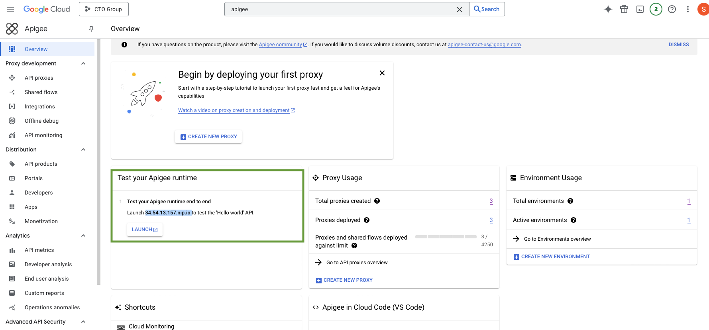

#### Example:

Original `ClientInterface.php` line 57-46:
```
public const HYBRID_ENDPOINT = 'https://Apigee.googleapis.com/v1';

/**
 * Default endpoint for Apigee Management API on GCP
 *
 * @var string
 */
public const APIGEE_ON_GCP_ENDPOINT = 'https://Apigee.googleapis.com/v1';
```
Example of amended `ClientInterface.php`:
```
public const HYBRID_ENDPOINT = 'https://34.54.13.157.nip.io/v1';

/**
 * Default endpoint for Apigee Management API on GCP
 *
 * @var string
 */
public const APIGEE_ON_GCP_ENDPOINT = 'https://34.54.13.157.nip.io/v1';

```

### Enable Dev Portal REST APIs

The integration with Event Portal requires that Apigee Dev Portal [REST APIs are enabled to interact with API Docs](https://www.drupal.org/docs/contributed-modules/Apigee-api-catalog/expose-rest-apis-to-interact-with-api-docs
). Please follow all the steps in this guide up to and including "Create a new role and a service account". 

When you follow the steps to install the [Drupal patch and module](https://www.drupal.org/docs/contributed-modules/Apigee-api-catalog/expose-rest-apis-to-interact-with-api-docs#install-patch-and-module
):
1. You can do this installation by connecting to one of the Google Compute VMs in the Kickstart deployment a
2. The composer config file you need to update is at `/var/www/devportal/code/composer.json`
3. Follow the steps documented in section 3 Option B of "Install Drupal patch and additional module" to install the `JSON:API Extras` and `HTTP Basic Authentication`
4. Once you enabled CRUD operations on the JSON API in section 4, select the "JSON:API Extras" tab then  the "Resource overrides" tab. Check that the `node--asyncapi_doc` resource is enabled. (see screenshot below) 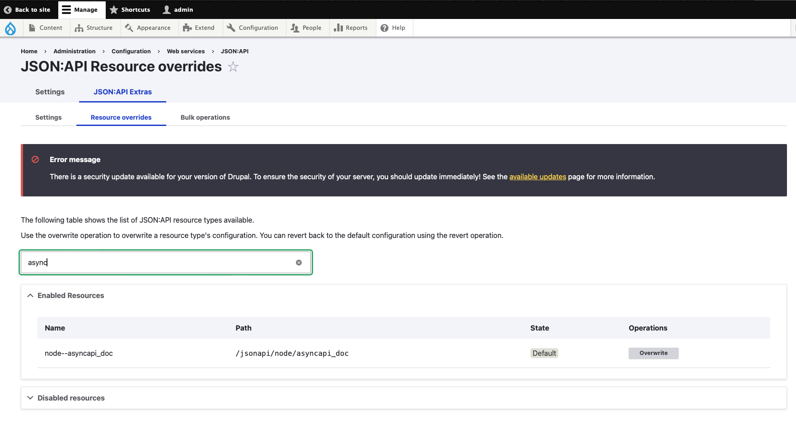


> aside positive
> Take note of the credentials you create in ["Create a new role and service account"](https://www.drupal.org/docs/contributed-modules/Apigee-api-catalog/expose-rest-apis-to-interact-with-api-docs#create-new-role-and%20account)
> You need these to configure the Event Portal Integration.

## Import and Deploy API Proxies

Duration 0:10:00

You can either import [API Proxies from API Proxy Bundles](https://cloud.google.com/apigee/docs/api-platform/fundamentals/build-simple-api-proxy#importinganapiproxyfromanapiproxybundle) or use the [Apigee-deploy-maven-plugin](https://github.com/apigee/apigee-deploy-maven-plugin) to build and deploy the API Proxies.

You need to build and deploy the API proxies found in `src/gateway` within the repository:
* `src/gateway/Apigee-Platform-Proxy`
* `src/gateway/EventPortalIntegration`
* `src/gateway/hello`
* `src/gateway/OAuth`

The `hello` proxy is optional, its purpose is to demonstrate use of the same access token / JWT for authn and authz across REST and Event APIs.

> aside positive
> `Apigee-Platform-Proxy` and `EventPortalIntegration` require a Service Account on deployment.
> Use the email address of the service account you created in Google IAM in the prerequisites section.


### Package API Proxies for Manual Import using Maven

For each of the API Proxies listed above:
```
$> cd <CLONED_REPO_ROOT>/src/gateway/<API_PROXY_DIRECTORY> 
$> mvn package
```

Replace `< CLONED_REPO_ROOT >` with the location of the cloned repo and `< API_PROXY_DIRECTORY >` with the directory of the API Proxy as listed in the previous section.

You'll find the zipped API Proxy Bundle for upload to Apigee in `< CLONED_REPO_ROOT >/src/gateway< API_PROXY_DIRECTORY >/target`

### Build and deploy API Proxies using Maven

See the [readme](https://github.com/Apigee/Apigee-deploy-maven-plugin) for full instructions on how to use the maven plugin for deployment to Apigee. 

For each of the API Proxies listed above:
```
$> cd <CLONED_REPO_ROOT>/src/gateway/<API_PROXY_DIRECTORY> 
$> mvn install
```

Replace `< CLONED_REPO_ROOT >` with the location of the cloned repo and `< API_PROXY_DIRECTORY >` with the directory of the API Proxy as listed in the previous section.

## Configure the API Proxies

Duration: 0:10:00

### Configure the OAuth API Proxy

#### Generate a JWK

First generate private and public key and a JSON Web Key.

There are multiple web tools that can do this 
1. Let's use [https://jwkset.com/generate](https://jwkset.com/generate):
2. Scroll down to the "Generate a new key" section and set it up as in the screenshot below.
3. Click generate and either keep the tab open or save JSON Web Key, Private Key and Public Key to separate files.

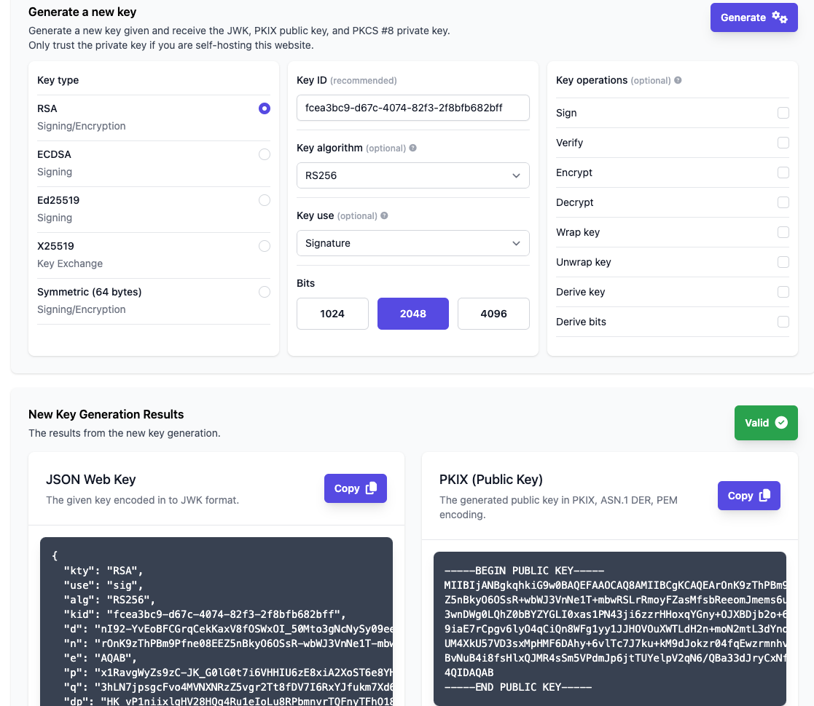

> aside positive
> We will refer to the generated keys below as
> `PUBLIC_KEY` - PKIX (Public Key)
> `PRIVATE_KEY` - PKCS #8 (Private Key)
> `JWK` - JSON Web Key

#### Upload keys to the OAuth API

First upload the `PRIVATE_KEY` that you just created:

```
curl --location 'https://<API_GATEWAY_HOSTNAME>/oauth/keys' \
--header 'Content-Type: text/plain' \
--data '<PRIVATE_KEY>'
```

Then upload the `JWK`:
```
curl --location 'https://<API_GATEWAY_HOSTNAME>/oauth/jwks' \
--header 'Content-Type: application/json' \
--data '<JWK>'
```

> aside positive
> `< API_GATEWAY_HOSTNAME >` is the hostname that is assigned to your gateway - if you launched an Apigee trial it will look something like this: `34.54.246.147.nip.io`

### Configure the Solace Integration API Proxy

Duration: 0:05:00

#### Upload Solace Cloud API Token

You have created the API Token in the "Prerequisites" section, it is referred to as `API_TOKEN` in the command below:

```
curl --location 'https://<API_GATEWAY_HOSTNAME>/ep-bootstrap/token' \
--header 'Content-Type: text/plain' \
--data '<API_TOKEN'
```

> aside positive
> `< API_GATEWAY_HOSTNAME >` is the hostname that is assigned to your gateway - if you launched an Apigee trial it will look something like this: `34.54.246.147.nip.io`


#### Configure the API with Dev Portal Connection Details

When you are importing Event API Products this API Proxy also uploads the associated AsyncAPI specs to the Apigee Dev Portal - you'll need to supply the endpoint and credentials for this connection.

```
curl --location 'https://<API_GATEWAY_HOSTNAME>/ep-bootstrap/devportal' \
--header 'Content-Type: application/json' \
--data '{
    "host": "https://<DEV_PORTAL_HOST>",
    "user": "<DEV_PORTAL_API_USER?",
    "password":"<DEV_PORTAL_API_PASSWORD>"
}'
```


You have created a user when you configured the Dev Portal. Replace `< DEV_PORTAL_API_USER >` and `< DEV_PORTAL_API_PASSWORD >` with the user credentials.

`DEV_PORTAL_HOST` refers to the public host name that was assigned to your Dev Portal when you ran the Kickstart deployment.

> aside positive
> `< API_GATEWAY_HOSTNAME >` is the hostname that is assigned to your gateway - if you launched an Apigee trial it will look something like this: `34.54.246.147.nip.io`

## Design Your Event APIs in Event Portal

Duration: 0:15:00

> aside positive
> Instead of modeling your own Event API and Event API Product, you can import a sample application domain.

Once you have access to Event Portal you'll need to do some initial configuration and create some assets:
1. Configure a modeled event mesh and add your event broker. 
1. Create Schemas, Events, Event API and Event API Product in Event Portal Designer
1. Alternatively, you can import an Application Domain from a file. If you do this you still need to execute the following step.	
1. Make the Event API Product available to API Management systems.

#### Configure a modeled event mesh and add your event broker
Follow the steps described [here](https://api.solace.dev/cloud/reference/apim-getting-started#configure-solace-event-brokers-in-runtime-event-manager)

#### Create Event API Products and required objects

You can skip steps if you already have created some of these objects - such as schemas, events-  in Event Portal that you intend to reuse.

> aside positive
> Ensure that all objects you create in an application domain are marked as "shared" and that you set the lifecycle state to "released".
> Where applicable all objects' "Broker Type" must be set to "Solace"

* Open the Event Portal Designer, see [here](https://docs.solace.com/Cloud/Event-Portal/event-portal-designer-tool.htm#Using_Designer)
* Create an application domain for broker type "Solace", see [here](hhttps://docs.solace.com/Cloud/Event-Portal/event-portal-designer-application-domains.htm#CreateAppDomain)
* Create a schema, skip if you want to define simple events with primitive payloads such as string). See [here](https://docs.solace.com/Cloud/Event-Portal/event-portal-designer-schemas.htm#create-schema). Remember to [set the state](https://docs.solace.com/Cloud/Event-Portal/event-portal-designer-schemas.htm#state_change_schema) of the schema version to released.
* Create an event, see [here](https://docs.solace.com/Cloud/Event-Portal/event-portal-designer-events.htm#create-event). Remember to [set the state](https://docs.solace.com/Cloud/Event-Portal/event-portal-designer-events.htm#state_change_event) of the event version to released.
* Create an Event API , see [here](https://docs.solace.com/Cloud/Event-Portal/event-portal-designer-event-apis.htm#Creating_an_Event_API). Remember to [set the state](https://docs.solace.com/Cloud/Event-Portal/event-portal-designer-event-apis.htm#Changing_the_State) of the event version to released.
* Create an Event API Product, see [here](https://docs.solace.com/Cloud/Event-Portal/event-portal-designer-event-api-products.htm#Creating_an_EAP)


#### Alternative: Import a Sample Application Domain

The sample domain is stored in the github repo that you have cloned. It's calles `retail-demo.json` and is located in the `eventportal` directory.

Follow the instructions to [import an Application Domain](https://docs.solace.com/Cloud/Event-Portal/event-portal-designer-application-domains.htm#importing-application-domains) into Event Portal.


#### Make the Event API Product available to API Management systems

Once you have an Event API Product - either imported or designed by you - you need to [assign it to an environment](https://docs.solace.com/Cloud/Event-Portal/event-portal-designer-event-api-products.htm#adding-an-event-api-product-to-an-environment) and make it visible to APIM solutions: see [Make Event API Products Publicly Available](https://api.solace.dev/cloud/reference/apim-getting-started#make-event-api-products-publicly-available) in the Solace Platform API documentation.

## Import Event API Products and Event APIs into Apigee

Duration: 0:05:00


### List Available Event API Products

> aside negative
> Each Plan of an Event API Product is treated as a separate importable apgeeX API Product. Apigee API Products do not have "Plans". 

Retrieve a list of importable API Products (i.e. Event API Product Plans):
```
curl --location 'https://<API_GATEWAY_HOSTNAME>/ep-bootstrap/eventApiProducts?where=applicationDomainId%3D%3Dgfjt1r5b8db'
```

> aside positive
> `< API_GATEWAY_HOSTNAME >` is the hostname that is assigned to your gateway - if you launched an Apigee trial it will look something like this: `34.54.246.147.nip.io`

### Import an Event API Product Plan into Apigee

Pick an API Product from the `importableApiProducts` element of the response you retrieved in the previous step and use it in the command below. Set `--data` payload replacing `< IMPORTABLE_API_PRODUCT >`:

```
curl --location 'https://<API_GATEWAY_HOSTNAME>/ep-bootstrap/eventApiProducts' \
--header 'Content-Type: application/json' \
--data '<IMPORTABLE_API_PRODUCT>'
```

For example:

```
curl --location 'https://<API_GATEWAY_HOSTNAME>/ep-bootstrap/eventApiProducts' \
--header 'Content-Type: application/json' \
--data '{
                "apiProductName": "Order Event API-default",
                "planId": "u3r88l0pxk7",
                "eventApiProductId": "rezt2caps5s"
            }'
```


> aside positive
> `< API_GATEWAY_HOSTNAME >` is the hostname that is assigned to your gateway - if you launched an Apigee trial it will look something like this: `34.54.246.147.nip.io`

## Testing the Developer Portal

Duration: 0:05:00

The blog ["Take Event APIs to where your Apigee APIs are …"](http:todo.com) walks you through the developer experience in more detail.

### Find and Explore Your Event API in the Developer Portal

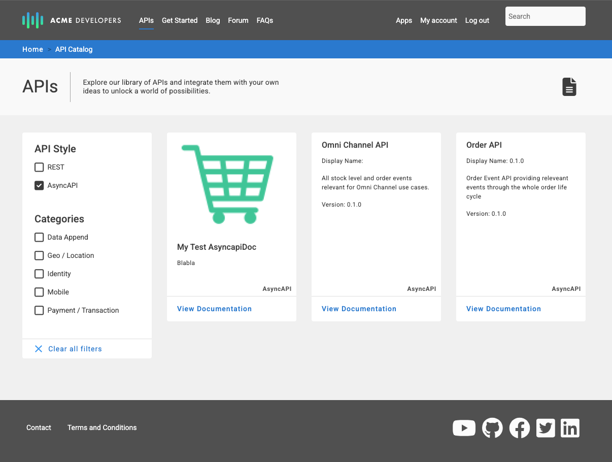

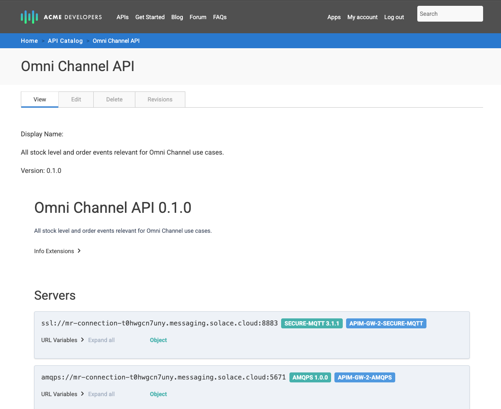

### Create an App and Gain Access to an Eent API

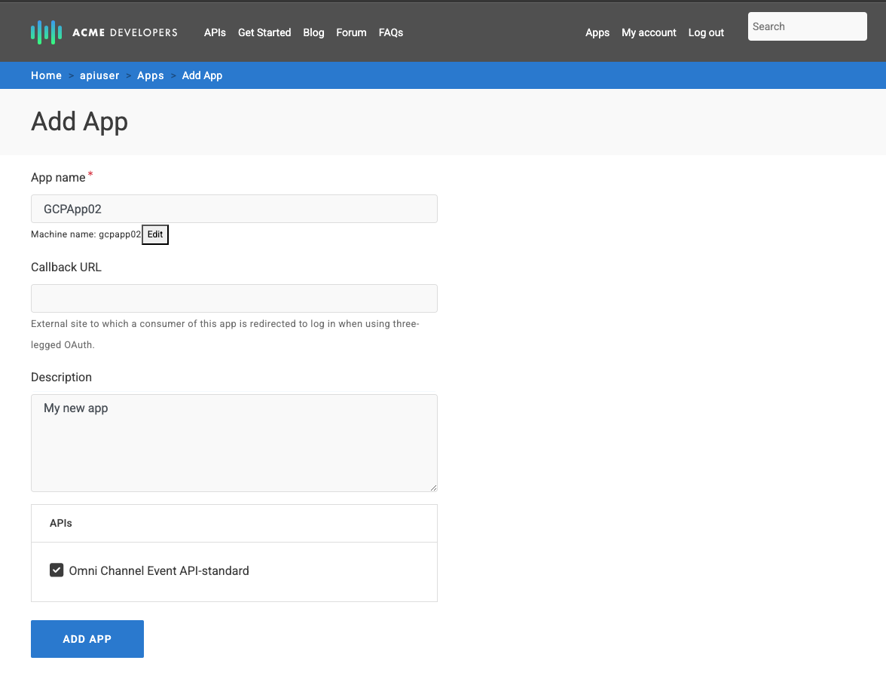

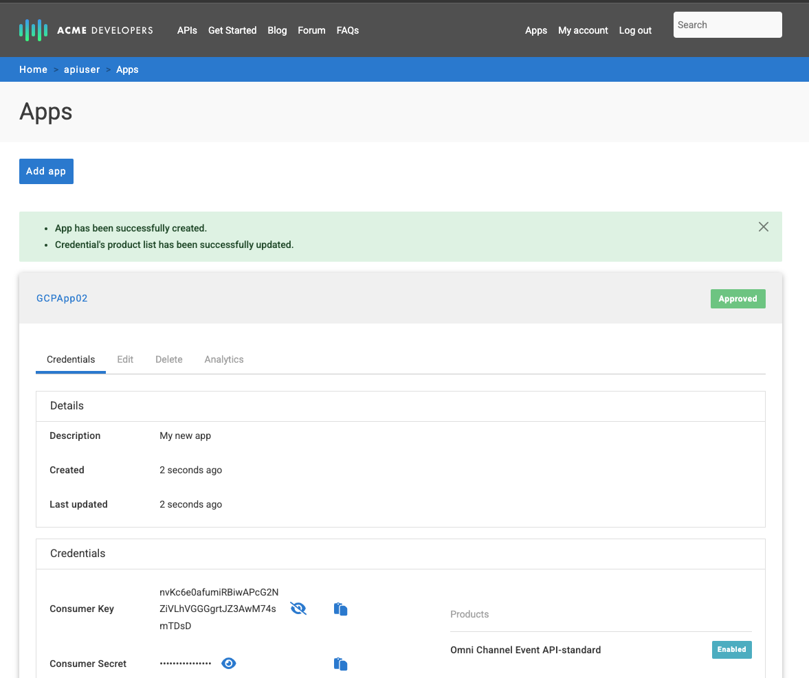

> aside positive
> If you want to follow the optional section to connect an API client to a Solace broker take note of the credentials - consumer key and secret - issued for the app.

## Review Apigee API Product

Duration: 0:02:00

The Event API Product that we imported from Solace Event Portal is listed on [API Product](https://console.cloud.google.com/Apigee/apiproducts)

> aside positive
> Note the custom attributes in the screenshot - they correlate to the Apigee API Product with the source in Event Portal.


## Optional: Testing Developer Access to Solace Cloud Broker

Duration: 0:10:00

> aside negative
> The Configure OAuth provider on PubSub+ Broker is applicable to all protocols supported by the PubSub+ Broker.
> The rest of the section documents access using the MQTT protocol. Of course you can also use other protocols that you are familiar with instead.

You need admin access to the Solace PubSub+ broker as you set up an OAuth provider in the broker in this section. This enables developers to use JWT issued by Apigee to connect to the broker.

Prerequisites to follow the MQTT connection steps:
* MQTTS (Secure MQTT) protocol must be enabled on the broker
* The Event API Product that you imported to Apigee must have MQTT included in the list of protocols. 

### Configure OAuth provider on PubSub+ Broker

Follow the steps on [Configuring an Event Broker Service to Use OAuth Identity Provider Authorization](https://docs.solace.com/Cloud/enable_oauth_for_broker.htm)

The OAuth Profile should look like the screenshot below, please note:
* Take note of the OAuth profile name you use, we will refer to this later as `< OAUTH_PROFILE_NAME >`
* OAuth client id and secret: use dummy values or leave empty. These values are not used when the broker assumes the "Resource Server" role.
* OAuth Role: must be set to "Resource Server"
* Issuer Identifier: provide a dummy HTTPS URL, this value is not validated in the configuraiton below
* JWKS Endpoint: set to `https://< API_GATEWAY_HOSTNAME >/oauth/jwks`

> aside positive
> `< API_GATEWAY_HOSTNAME >` is the hostname that is assigned to your gateway - if you launched an Apigee trial it will look something like this: `34.54.246.147.nip.io`


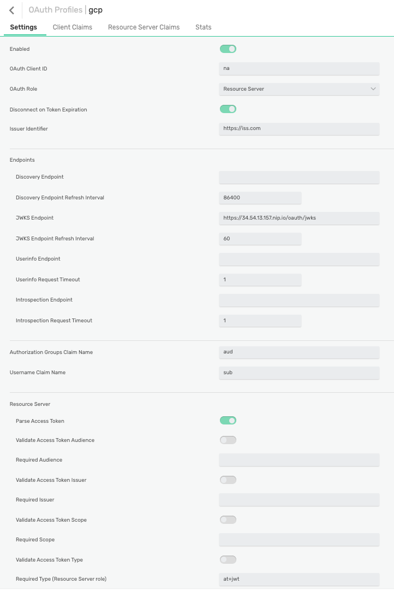

### Connect to the Broker using MQTT

#### Obtain a JWT

Use the credentials associated with the app you created in the Developer Portal:
* `CLIENT_ID`: the app's consumer key
* `CLIENT_SECRET`: the app's consumer secret

Exchange your credentials for an access token:
```
curl --location 'https://<API_GATEWAY_HOSTNAME>/oauth/jwt' \
--header 'Content-Type: application/x-www-form-urlencoded' \
-u '<CLIENT_ID>:<CLIENT_SECRET>' \
--data-urlencode 'grant_type=client_credentials'
```

Save the value of the `access_token` element of the response. You need it for your establishing the MQTT connection, we refer to it later as `TOKEN`.

> aside positive
> `< API_GATEWAY_HOSTNAME >` is the hostname that is assigned to your gateway - if you launched an Apigee trial it will look something like this: `34.54.246.147.nip.io`

#### Gather Connection Information

You also need the broker URL and you might want to test that you can start a subscription (receive) once connected. All of this information is contained in the AsyncAPI spec available on the Developer Portal:
* In the Developer Portal, view the AsyncAPI spec you previously imported 
* Choose an appropriate entry from the server section and take note of the URL, we refer to this as `MQTTS_URL` below
* Choose a "Receive" operation and take note of the channel information we refer to this as `MQTT_TOPIC` below

The screenshot below highlights examples for the values you need to take note of:
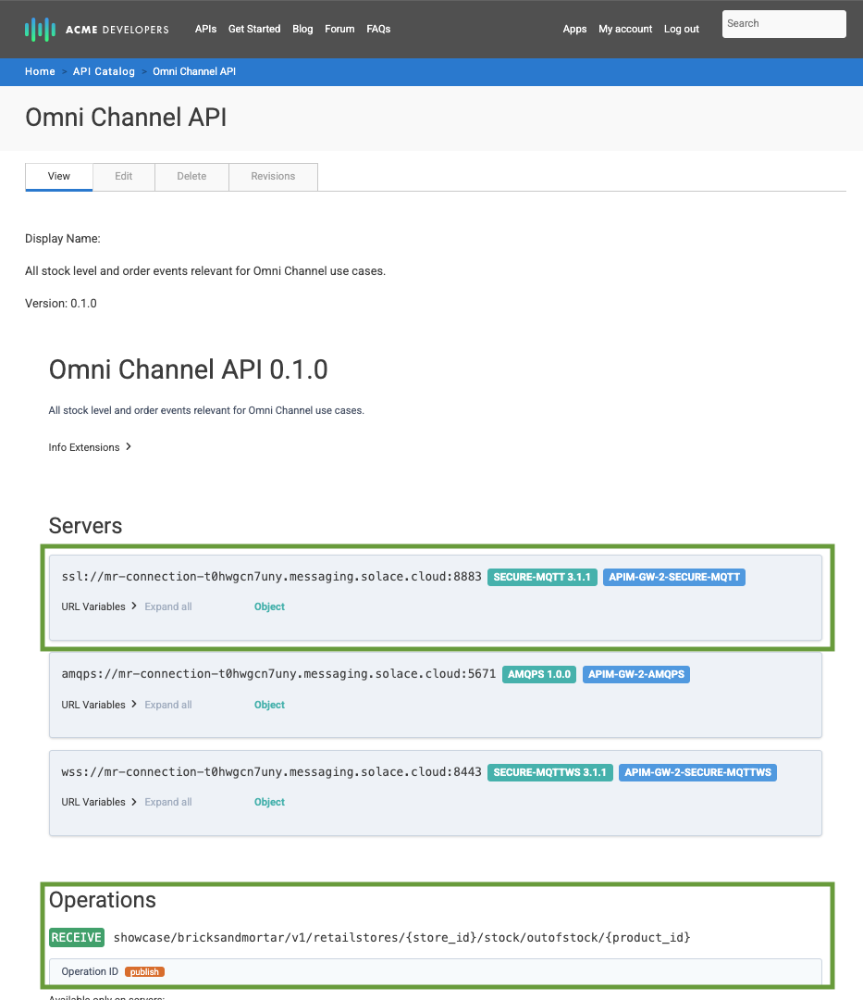


#### Connect using MQTTX
Start MQTTX (you can use another MQTT client that you prefer and are familiar with) and configure a new connection.

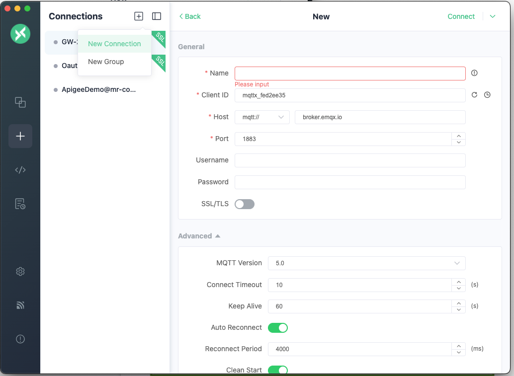

Use the following values in the connection details:
* Choose a name for the conneciton
* Select the `mqtts://` option (if you use a secure MQTT port)
* Host: use the hostname part of `MQTTS_URL`
* Port: use the port part of `MQTTS_URL`
* Username: this value is ignored, you can use anything you like e.g. "notused"
* Password: Concatenate `OAUTH~< OAUTH_PROFILE_NAME >~< TOKEN >`

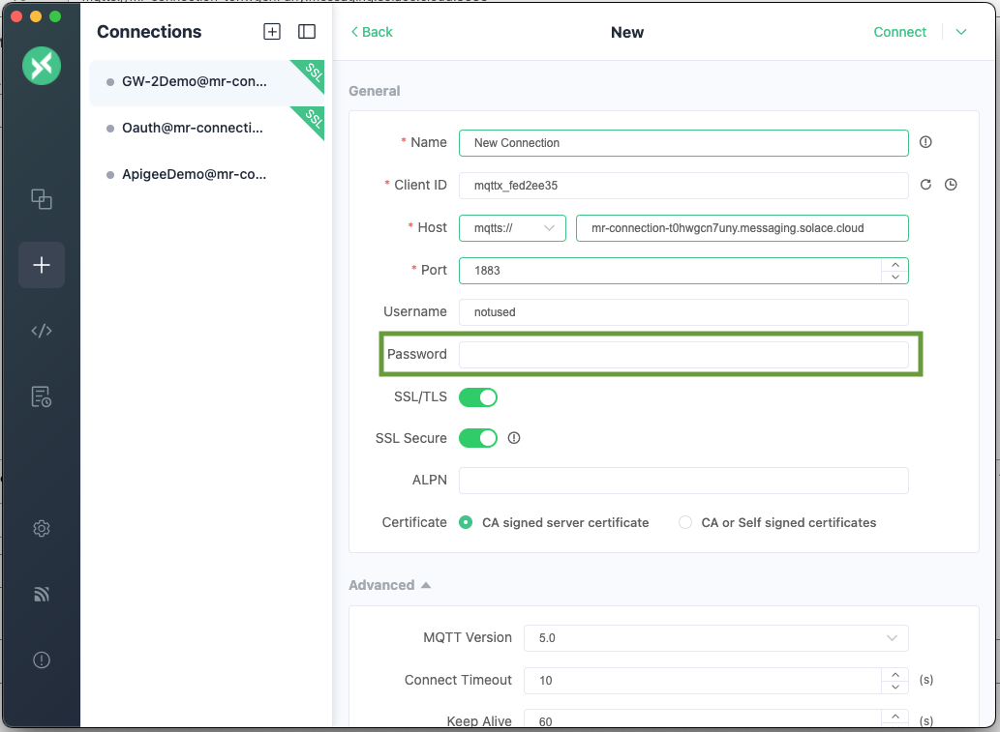

#### Subscribe to a Topic

Once connected add a subscription, use `MQTT_TOPIC` and replace any variables - enclosed in "{}""}" with suitable values or MQTT wildcards.
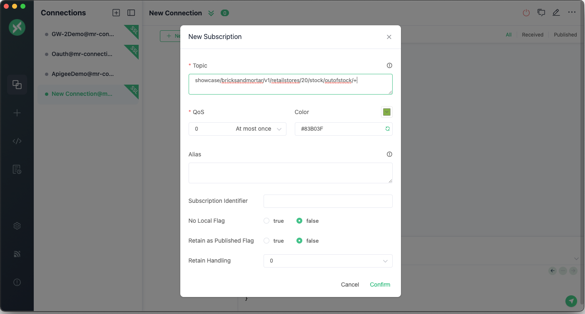

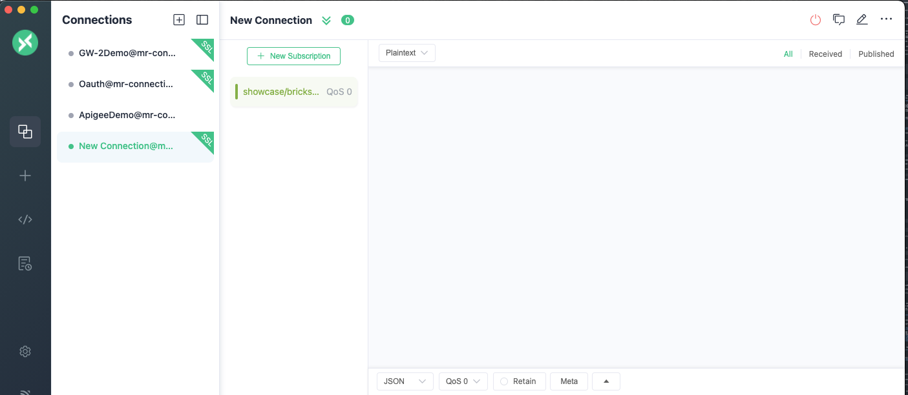

## Takeaways

Duration: 0:03:00

Congratulations, you now have a working custom integration between Google Apigee and Solace.

Thanks for participating in this codelab! Let us know what you thought in the [Solace Community Forum](https://solace.community/)! If you found any issues along the way we'd appreciate it if you'd raise them by clicking the Report a mistake button at the bottom left of this codelab.
