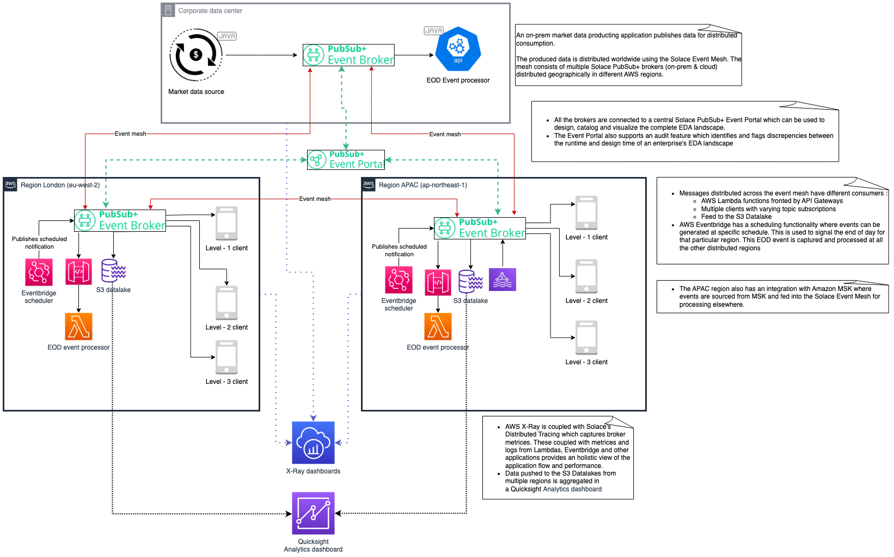

author: HariRangarajan-Solace
summary: Building a trading domain demo which showcases the strengths and integration between Solace and AWS.
id: aws-demo-fs-codelab
tags: workshop, codelab, AWS immersion day
categories: Solace, AWS, Hybrid cloud, Event Portal, Spring, JCSMP, Serverless, API Gateway, Lambda functions, Eventbridge Scheduler, etc.
environments: Web
status: Published
feedback link: https://github.com/SolaceDev/solace-dev-codelabs/blob/master/markdown/aws-demo-fs-codelab

# Solace - AWS - Integration Demo

## What you'll learn: Overview

Duration: 0:01:00

Through this interactive codelab, you'll gain a comprehensive understanding of the unique strengths and advantages that Solace and AWS bring to the table. 
Get ready to unlock a world of innovation as we walk you through the implementation and utilization of these powerful platforms in a practical, real-world scenario.  

Step into the world of trading platforms as we guide you through the creation and exploration of a practical application that leverages the combined power of Solace and AWS. Witness firsthand how these platforms synergistically enhance each other's functionalities, opening doors to limitless possibilities.

The code snippets and samples required for this codelab can be found over the github link : TODO - Link to the github repo.

This codelab will walk you through the steps to :

✅  Setup a Solace Event broker service and link it to an event mesh  
✅  Design the EDA Landscape using the Solace Event Portal
✅  Understand different Solace APIs and how to use them  
✅  Create a simple Angular base frontend and consume from Solace topics using the Solace Typescript API  
✅  Post events to the Solace event mesh using AWS Lambdas and AWS Eventbridge scheduler  
✅  Consume events using AWS Lambdas which are exposed by the AWS API Getway and how to use the Solace native API Gateway connector  
✅  Export AsyncAPI specficiations and use it to generate Spring Cloud Stream based applications.
✅  Export events to the AWS S3 bucket using the Solace native S3 connector and use it to generate AWS quicksight analytics dashboards  

In this codelab, we will be creating a relatively simple but functionally complete trading platform which has is depicted below :

Knowledge level requirement

- Intermediate level of coding with Java
- Computer with internet connectivity

## What you need: Prerequisites

A detailed list of pre-requisites :
- Internet connection
- Solace cloud account
- AWS account
- Java
- Maven
- Nodejs
- Shell terminal
- IDE
- Web browser to access the UI

etc

## Solace Cloud Account setup
### Login
### Verify existing services
### Create a mesh with 2 services

## Environment verification
### On-prem applications
* Verify the market-data-source
* Global-eod-event-processor
### Cloud region - 1 applications
* EOD event generator
* EOD event processor
* S3 bucket setup
* Client admin application in EC2 instance - FE1
* Client frontend application in EC2 instance - FE1

## New region setup
### New broker and mesh integration
* Create new service in new region, we refer it to as Cloud-2
* Edit event mesh and add new service
### Event portal setup
* Design EDA landscape, schemas, events and applications
### Admin application setup
* Update application properties with new broker connection details
* Deploy admin application in EC2 instance - FE2
* Run application
### Frontend client application
* Update application properties with new broker connection details
* Deploy admin application in EC2 instance - FE2
* Run application
* Walk thru demo
### End-Of-Day event generator
* Lambda creation and testing
* Update lambda with new broker connection details and region data in the event model
* Build lambda code
* Deploy new lambda and test it out
#### Event bridge scheduler
* Create new scheduler with test schedule
* Link it to lambda created above
### End-Of-Day event processor
#### Lambda creation and testing
* Using the code sample provided, build the lambda artifact
* Deploy new lambda and test it out
#### API Gateway setup
* Create new API gateway API
* Link to lambda created above
* Test
#### Connector setup
* Connect API Gateway and the broker using the native API Gateway connector
### S3 datalake and analytics dashboard
* Create S3 bucket connector ( S3 bucket details are common for all the cloud regions)
* Test out the connector
* Link S3 bucket to quicksight analytics dashboard
* Demo dashboard

## Takeaways

Thanks for participating in this codelab! Let us know what you thought in the [Solace Community Forum](https://solace.community/)! If you found any issues along the way we'd appreciate it if you'd raise them by clicking the Report a mistake button at the bottom left of this codelab.
