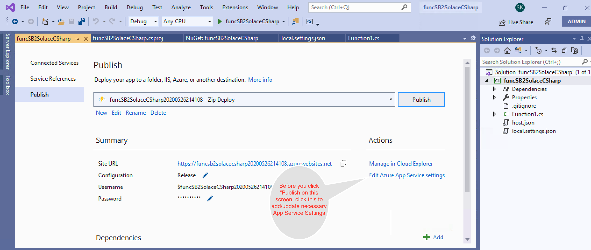
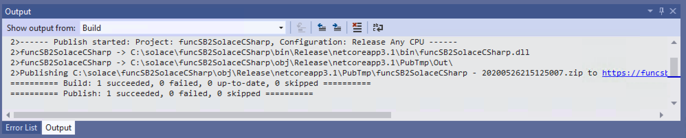

author: Sumeet Koshal
summary: Use Azure function to stream data from Azure messaging services to Solace PubSub+
id: azure2Solace
tags: iguide
categories: Azure, C# 
environments: Web
status: published
feedback link: https://github.com/solacese/azure2Solace
analytics account: UA-3921398-10


# Stream data from Azure Service Bus to Solace PubSub+ Event broker Using Azure Function

## What you'll learn: Overview

Often there is a requirement where architects and developer use messaging services like Azure Service Bus or Event Hub to move realtime data between apps running locally. However organizations need this realtime information to flow across various regions, cloud and/or data centers. To accomplish that one needs an Event Mesh that provides hybrid cloud connectivity. 

Solace is an industry leader and its PubSub+ event brokers makes such an Event Mesh a reality.

This codelab specifically talks about how you can easily stream data from Azure messaging service "ServiceBus" to Solace using Azure function.

You will find the Azure function code [here](https://github.com/solacese/azure2Solace).

To learn how to stream data from Solace PubSub+ broker to Azure messaging services, click [here](https://docs.solace.com/Configuring-and-Managing/HTTP-Header-Authentication-Azure-Event-Hub.htm).

## High Level Architecture of this codelab's goal
Duration: 0:04:00


## Prerequisites
Duration: 0:01:00


* Access to Solace PubSub+ Event Broker
* Access to Azure Cloud environment

## Configure the Solace PubSub+ Event broker to receives messages on a queue 
Duration: 00:05:00

In this example we will create two queues in Solace PubSub+, one of it will receive messages from Azure function over HTTP and another over C#.
Log on to Solace Console
1.	Create a queue that will receive data from Azure function using REST 

```
solace> enable
solace# configure
solace# (configure)# message-spool message-vpn <VPN Name> 
solace(configure/message-spool/message-vpn)# create queue azure-rest-queue
solace(configure/message-vpn/my-azure-queue )# permission all consume 
solace(configure/message-vpn/my-azure-queue )# subscription topic azure/2/solace-rest
solace(configure/message-vpn/my-azure-queue )# no shutdown
solace(configure/message-vpn/my-azure-queue )# exit
```


2. Create a queue that will receive data from Azure function using C#

```
   solace(configure/message-spool/message-vpn)# create queue azure-c#-queue
   solace(configure/message-vpn/my-azure-queue )# permission all consume 
   solace(configure/message-vpn/my-azure-queue )# subscription topic azure/2/solace
   solace(configure/message-vpn/my-azure-queue )# no shutdown
   solace(configure/message-vpn/my-azure-queue )# end
```


##  Azure Function Setup - For C#/.Net using Solace C# APIs
Duration: 0:15:00

Azure allows you to use multiple programming languages and APIs. However, for this codelab, I will walk you through usage of  C# using Solace C#API  and REST .


1. Create a new Azure function project in Visual Studio 
    
    Select **Azure Functions** from the list and click **Next**

1. Configure your new project
    

1. Create a new Azure Function application
    
   In the above screen you will do the following:
     * Select **Azure Service Bus Trigger** from the list
     * Specifiy **Storage Account**
     * Specify **Connection String Setting Name**. This is the name that we will use in the Azure function code later.
     * Specify Service Bus **Queue Name**. This is the queue that we will stream data from to Solace Event broker.
     * Click **Next** to finish create a project.

1. Open the **local.settings.json** file and add the following properties as shown in the code below:
```
//Update the Service Bus end point connection string below "SBConnection": "Endpoint=....windows.net/;SharedAccessKeyName=ListenOnly;SharedAccessKey=xxxxxxxxxxxxxxxxxxxxxxx",
//Update the Solace Host (SMF) URL string below "solace-host": "mr1xi40mbgzuj7.messaging.solace.cloud",
//Update the Solace Username string below "solace-username": "solace-cloud-client",
//Update the Solace Password string below "solace-password": "abcgdjsjj",
//Update the Solace VPN Name string below "solace-vpnname": "sumeet"
//Update the Solace Topic string below "solace-topic": "azure/2/solace"
```

1. Using NuGet package manager, search and install Solace library.
   

1. Create a new class called **SolacePublisher** and add the following code to **SolacePublisher.cs** class.

```
using System;
using SolaceSystems.Solclient.Messaging;
using System.Threading;
using System.Text;

namespace SB2SolaceCSharp
{
    public class SolacePublisher
    {
        private IContext context = null;
        private ISession session = null;
        private string sUserName = "default";
        private string sPassword = "default";
        private string sVPNName = "default";
        private string sHost = "default";
        private string sTopic = "default";
        //public Object lockThis = new Object();

        public SolacePublisher(string Host, string UserName, string Password, string VPNName, string Topic)
        {
            this.sHost = Host;
            this.sUserName = UserName;
            this.sPassword = Password;
            this.sVPNName = VPNName;
            this.sTopic = Topic;
            connect2Solace();
        }
    
        ~SolacePublisher()
        {
            Console.WriteLine("In destructor - Will try to dispose session and context");
            if (session != null)
            {
                session.Disconnect();
                session.Dispose();
                session = null;
                Console.WriteLine("In destructor - disposed session");
            }
            if (context != null)
            {
                context.Dispose();
                context = null;
                Console.WriteLine("In destructor - disposed context");
            }
    
        }
    
        public void sendMessage2Solace(String msg)
        {
            IMessage message = ContextFactory.Instance.CreateMessage();
            message.Destination = ContextFactory.Instance.CreateTopic(sTopic);
            message.DeliveryMode = MessageDeliveryMode.Direct;
            message.BinaryAttachment = Encoding.ASCII.GetBytes(msg);
    
            Console.WriteLine("About to send message '{0}' to topic '{1}'", msg, sTopic);
            session.Send(message);
            message.Dispose();
            Console.WriteLine("Message sent. Exiting.");
        }
    
        public void connect2Solace()
        {
            Console.WriteLine("In connect2Solace");
            ContextFactoryProperties cfp = new ContextFactoryProperties();
    
            // Set log level.
            cfp.SolClientLogLevel = SolLogLevel.Warning;
            // Log errors to console.
            cfp.LogToConsoleError();
            // Must init the API before using any of its artifacts.
            ContextFactory.Instance.Init(cfp);
            ContextProperties contextProps = new ContextProperties();
            SessionProperties sessionProps = new SessionProperties();
    
            sessionProps.Host = sHost;
            sessionProps.UserName = sUserName;
            sessionProps.Password = sPassword;
            sessionProps.SSLValidateCertificate = false;
            sessionProps.VPNName = sVPNName;
    
            //Connection retry logic
            sessionProps.ConnectRetries = 3; //-1 means try to connect forever.
            sessionProps.ConnectTimeoutInMsecs = 5000; //10 seconds
            sessionProps.ReconnectRetries = 3; //-1 means try to reconnect forever.
            sessionProps.ReconnectRetriesWaitInMsecs = 5000; //wait for 5 seconds before retry
    
            // Compression is set as a number from 0-9, where 0 means "disable
            // compression", and 9 means max compression. The default is no
            // compression.
            // Selecting a non-zero compression level auto-selects the
            // compressed SMF port on the appliance, as long as no SMF port is
            // explicitly specified.
            //sessionProps.CompressionLevel = 9;
    
            #region Create the Context
    
            context = ContextFactory.Instance.CreateContext(contextProps, null);
    
            #endregion
    
            #region Create and connect the Session
            session = context.CreateSession(sessionProps, null, null);
            session.Connect();
            #endregion
        }
    }
}
```

1. Add the following code to **function1.cs** class.

```
using System;
using Microsoft.Azure.WebJobs;
using Microsoft.Azure.WebJobs.Host;
using Microsoft.Extensions.Logging;
using SolaceSystems.Solclient.Messaging;
using System.Threading;
using System.Text;

namespace SB2SolaceCSharp
{

    public static class Function1
    {
    
        private static SolacePublisher solaceConnection = new SolacePublisher(
            Environment.GetEnvironmentVariable("solace-host"),
            Environment.GetEnvironmentVariable("solace-username"),
            Environment.GetEnvironmentVariable("solace-password"),
            Environment.GetEnvironmentVariable("solace-vpnname"),
            Environment.GetEnvironmentVariable("solace-topic"));
    
        [FunctionName("Function1")]
        public static void Run([ServiceBusTrigger("azure2solacecsharp", Connection = "SBConnection")]string myQueueItem, ILogger log)
        {
            log.LogInformation($">>>>>>>>>>>>>>>>>>>>>>>C# ServiceBus queue trigger function processed message: {myQueueItem}");
            solaceConnection.sendMessage2Solace(myQueueItem);
        }
    }
}
```

1. Now Build your project.
1. Publish your Azure function as follows:
   
   
   
   
   
   
   

1. Now that your function is published, logon to your Azure portal and start the function app.
      
   
1. Lets look at the Solace queue via Solace broker's WebUI that will be receiving messages from servicebus.
      

1. Send test messages to Service Bus Queue (on which you have configured the trigger to invoke above Azure function). Below is a screen grab of console output from my test application.
      

1. Refresh your Solace broker's WebUI to confirm you have received messages from ServiceBus.
      

##  For C#/.Net using REST APIs
Duration: 0:15:00


1. Create a new Azure function project in Visual Studio 
    
    Select **Azure Functions** from the list and click **Next**

1. Configure your new project
    

1. Create a new Azure Function application
    
   In the above screen you will do the following:
     * Select **Azure Service Bus Trigger** from the list
     * Specifiy **Storage Account**
     * Specify **Connection String Setting Name**. This is the name that we will use in the Azure function code later.
     * Specify Service Bus **Queue Name**. This is the queue that we will stream data from to Solace Event broker.
     * Click **Next** to finish create a project.

1. Open the **local.settings.json** file and add the following properties as shown in the code below:

```
		//Update all the below property values to point to your environment
	"SBConnection": "Endpoint=sb://sumeet.servicebus.windows.net/;SharedAccessKeyName=sendListen;SharedAccessKey=xxxxxxxxxxxxxxxxxxxxxxxx;",
	"solace-host": "sumeet-solace.mymaas.net",
	"solace-tls": false,
	"solace-plain-text-port": 80,
	"solace-tls-port": 443,
	"solace-username": "default",
	"solace-password": "dc7u1ne2ps16r5p1ss2frq4b4n",
	"solace-topic": "azure/2/solace-rest"
  }
}
```

1. Using NuGet package manager, search and install Solace library.
   

1. Rename function1.cs to **funcSB2SolaceREST.cs** and Copy the below code in **funcSB2SolaceREST.cs**

```
using System;
using System.Net.Http;
using System.Reflection;
using System.Text;
using Microsoft.AspNetCore.Http;
using Microsoft.Azure.WebJobs;
using Microsoft.Azure.WebJobs.Host;
using Microsoft.Extensions.Logging;

namespace SB2SolaceRest
{

    public static class funcSB2SolaceREST
    {
        private static readonly HttpClient _Client = new HttpClient();
        private static string solaceRESTUrl = null;
        private static Boolean init = initializeHttpClient();
    
        [FunctionName("funcSB2SolaceREST")]
        public static async void Run([ServiceBusTrigger("azure2solacerest", Connection = "SBConnection")] string myQueueItem, ILogger log)
        {
            log.LogInformation($"C# ServiceBus queue trigger function processed message: {myQueueItem}");
            if (initializeHttpClient())
            {
                HttpRequestMessage httpRequestMessage = new HttpRequestMessage
                {
                    Method = HttpMethod.Post,
                    RequestUri = new Uri(solaceRESTUrl)
                };
                HttpContent httpContent = new StringContent(myQueueItem, Encoding.UTF8, "application/text");
                httpRequestMessage.Content = httpContent;
                var response = await _Client.SendAsync(httpRequestMessage);
                string responseString = await response.Content.ReadAsStringAsync();
                log.LogInformation($"Response from Solace :{responseString}, Response Code :{response.StatusCode}");
            }
            else
            {
                log.LogInformation("Unable to initialize HTTP Client");
                throw new Exception("Unable to initialize HTTP Client");
            }
        }
    
        public static bool initializeHttpClient()
        {
            if (!init)
            {
                string username = Environment.GetEnvironmentVariable("solace-username");
                string password = Environment.GetEnvironmentVariable("solace-password");
                string auth = "Basic " + Convert.ToBase64String(Encoding.UTF8.GetBytes($"{username}:{password}"));
                _Client.DefaultRequestHeaders.Add("Authorization", auth);
                string port = null;
                string protocol = "http";
                if (Boolean.Parse(Environment.GetEnvironmentVariable("solace-tls")))
                {
                    port = Environment.GetEnvironmentVariable("solace-tls-port");
                    protocol = "https";
                    //TODO: If 2 -way TLS, we may need to add Cert related stuff
                }
                else
                    port = Environment.GetEnvironmentVariable("solace-plain-text-port");
                solaceRESTUrl = protocol + "://" + Environment.GetEnvironmentVariable("solace-host") + ":" + port +
                                "/" + Environment.GetEnvironmentVariable("solace-topic");
                init = true;
            }
            return init;
        }
    }
}
```
1. As described in previous section, Build your project and Publish your Azure function.

1. Now that your function is published, logon to your Azure portal and start the function app.

1. Look at the Solace queue via Solace broker's WebUI that will be receiving messages from servicebus and confirm there are no messages sitting in the queue.

1. Send test messages to Service Bus Queue (on which you have configured the trigger to invoke above Azure function). 

1. Refresh your Solace broker's WebUI to confirm you have received messages from ServiceBus.
      

## Takeaways

Duration: 0:07:00

✅ You have learned how to create an Azure function that helps you stream data from ServiceBus to Solace PubSub+ Event broker.    
✅ You can use similar approach to integrate with Azure, Blob Storage, Event Hub, IoT Hub, Cosmos Db etc.   
✅ Event though this codelab uses C#, you can use other programming languages supported by Azure functions.

✅ The code provided here is for demonstration purposes only. It is not production ready and hence you must refer Solace PubSub+ C# .Net API refernce documentation [here](https://docs.solace.com/Solace-PubSub-Messaging-APIs/dotNet-API/net-api-home.htm).	

✅ For more information on Azure functions connectors check out the [PubSub+ Connector Hub](https://solace.com/connectors/?fwp_connectors_search=azure) page    


Thanks for participating in this codelab! Let us know what you thought in the [Solace Community Forum](https://solace.community/)! If you found any issues along the way we'd appreciate it if you'd raise them by clicking the Report a mistake button at the bottom left of this codelab.