author: Tamimi
summary: Getting started with Boomi and Solace
id: boomi-getting-started
tags:
categories: Boomi
environments: Web
status: Draft
feedback link: 
analytics account: UA-3921398-10

# Getting started with Boomi and Solace using the V1 connector

## What you'll learn 
Duration: 0:02:00

Negative
: **Note that this CodeLab uses V1 of the Solace Connector. Please see the [Getting started with Boomi and Solace](https://codelabs.solace.dev/codelabs/boomi-v2-getting-started) Codelab to learn how to leverage the latest connector functionality+.**

In this tutorial, you will learn how to configure and use the Solace Boomi connector. This is done in 4 easy steps
1. Configure your Solace PubSub+ Event Broker (Hardware, Software, SasS)
1. Setup your Boomi AtomSphere
1. Configure the Solace connector in the Boomi AtomSphere
1. Send/Receive messages between Boomi and Solace

Positive
: Note that this tutorial is meant to be platform and programming language agnostic. Meaning that regardless what operating system you are running (Mac, Linux, Windows), programming languages or messaging APIs you choose to use, the setup will be the same.

Positive
: You can also [import the finished solution into your account](https://platform.boomi.com/AtomSphere.html#build;processLibrary=2b3ebc49-7bb3-4052-93ea-987c784a3e68) from the Boomi Process Library.

### Prerequisite 
This tutorial assumes:
* Users on MacOS/Linux have knowledge using Docker
* Access to a Solace broker (explained in Step 2)
* Access to a Boomi environment (explained in Step 3)

## Setup a Solace PubSub+ Broker 
Duration: 0:05:00

Access to a Solace messaging service, Solace PubSub+, can be achieved in either one of the three flavours
1. Hardware Appliance
1. Software broker image (Docker, Virtual image)
1. Solace Cloud service instance

This tutorial will walk you through setting up a Solace Cloud service instance. If you are interested in setting up a local broker running on Docker or a virtual machine check out the [PubSub+ Event  Broker: Software](https://docs.solace.com/Solace-SW-Broker-Set-Up/SW-Broker-Image-Setup.htm) documentation

### Sign up for free Solace Cloud account 
Navigate to the [Create a New Account](https://console.solace.cloud/login/new-account) page and fill out the required information. No credit card required!

### Create a messaging service
After you create your Solace Cloud account and sign in to the Solace Cloud Console, you'll be routed to the event mesh page.

Click on 'Messaging Services' and all the messaging services associated with your account will show up if you have any already created. To create a new service, click either button as depicted in the image below:

Fill out all the details for your messaging service, and then click "Create" at the bottom of the page.

Your service should be ready to use in a couple seconds! 🌪

## Setup Boomi AtomSphere
Duration: 0:30:00

### Core concepts
Boomi builds, deploys and manage all the processes in a concept called **Atoms**, which is a lightweight Java application that is deployed on a host with Internet access. Think of it as your single-tenant, single-node runtime engine. There are two deployment models for Atoms:

1. **In-the-cloud deployment** (using Boomi Atom Cloud)
1. **On-premise deployment** (using local Atom setup)

Positive
: The Boomi Atom is a lightweight, dynamic runtime engine. Once your integration processes have been deployed to your Atom, the Atom contains all the components required to execute your processes from end to end, including connectors, transformation rules, decision handling, and processing logic.

### 4 Steps to get started with Boomi

#### 1. Create a Boomi trial account
if you dont have an account, navigate to [https://boomi.com/form/trial/](https://boomi.com/form/trial/) and sign up for a free account.

After you sign up for a Boomi platform account and login, you will have access to the Boomi AtomSphere - your one stop shop for all your integrations 🤓

You will see the menu at the top

* **Build**: This is where you design and package your process (i.e. architecture)
* **Deploy**: This is where you deploy the packaged process in your Atom for execution
* **Manage**: This is where you configure your environment and Atoms

#### 2. Configure and deploy your local Atom
In this tutorial, we will be setting up a local Atom. 

Positive
: You can skip this if you have access to a cloud Atom

You can either navigate to the links below for more information or follow the steps after

1. [Windows Machine](https://help.boomi.com/bundle/integration/page/t-atm-Installing_a_local_Atom_on_Windows_beec31b0-477d-430b-a744-cedb3a8d67eb.html).
1. [Using Docker](https://help.boomi.com/bundle/integration/page/t-atm-Using_Docker_to_install_a_local_Atom_on_Linux_b54f0e8c-c02c-4eea-87f5-7233d1c5e0a5.html).

👉 Navigate to the **Manage** tab and click on **Atom Management**

👉 Click on **+New** and choose **Atom**

👉 Choose the operating system of choice in the **Atom Setup** box

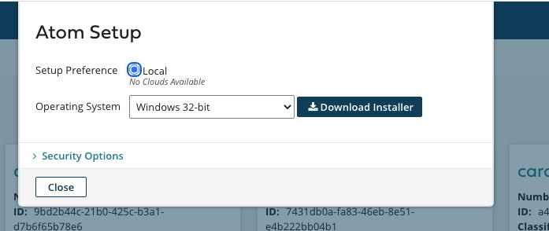

📝 **Notes on Docker installation**

The installer is a shell script that you run locally and automatically configure your docker setup

1. `./atomdocker_install64.sh -h` for more information on how to run it
1. You can generate a token by clicking on **Generate Token** under **Security Options** 
1. Create a `/var/boomi` directory because the script assumes it already exists and make sure its owned by the current user
    1. Navigate to `/var/boomi/` after you create it
    1. Execute the following from terminal `chown $USER .`
    1. Make sure this directory is shared on docker. This is done by opening the docker preferences and adding it under **File Sharing Resources** tab

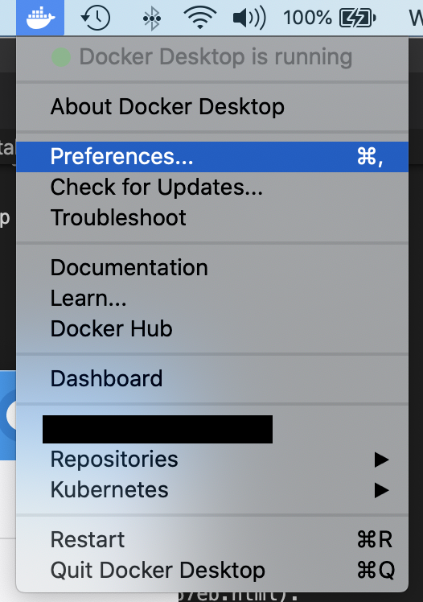

🏃‍♂️ **Run the atom**

Execute the atom docker installation shell script as follows     
`./atomdocker_install64.sh -n <name_of_atom> -k <insert_token>`

At this point, you can confirm that the Atom has been created and linked to your AtomSphere when you navigate to the Atom Management in the Manage tab and you will see your newly created atom under the **Unattached Atoms** section

#### 3. Setup Boomi environment

Boomi Environments are synonymous to workspaces thats used for testing or production purposes. You need an environment to "attach" the atom to. You can read more about Boomi Environments on the [Environment Management Boomi User Guide](https://help.boomi.com/bundle/integration/page/c-atm-Environment_management_1ec94aeb-ffaf-4cec-a3b0-483c2af3967c.html)

Under the Manage menu, navigate to the Atom management and add a new environment
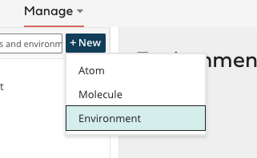

Give it a name and choose **Test** for the environment classification

#### 4. Attach the Atom to the environment

Select your newly created environment and search for your atom to attach it
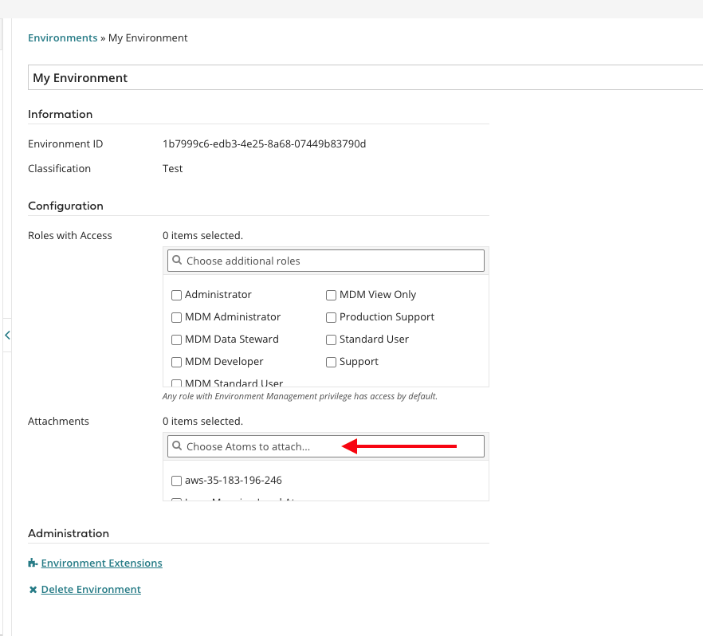

Positive
: Note: a blue icon next to your newly created Atom means that it has an Online Status 

#### 🎉 Viola! Now you have your Solace and Boomi environments setup

## Configure Solace Broker 
Duration: 0:02:00

Let's assume that you want to collect real-time events from Taxi's in NYC and stream them over a Solace Broker into your Boomi architecture and applications. These events could represent anything from ride status analytics to payment methods. 

We will first need to configure a queue so that the Solace PubSub+ connector on the Boomi AtomSphere can bind to and listen to any incoming messages on a given topic.

👉 Navigate to the Solace Cloud console Messaging Service tab 

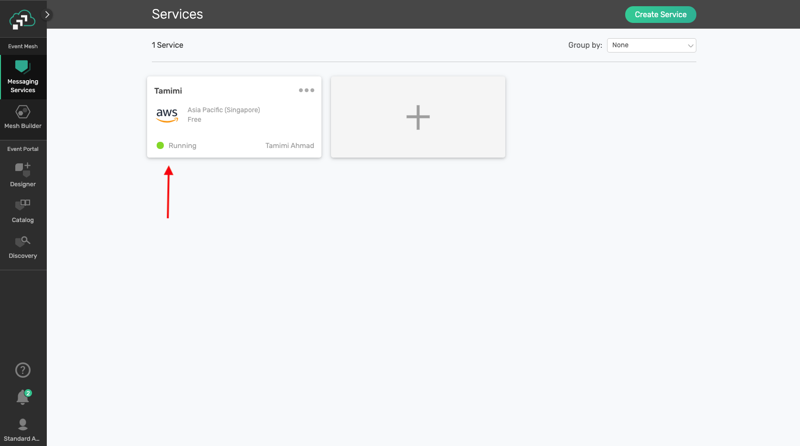

👉 Click on the previously created service from step 2 and navigate to the **Manage Service** option

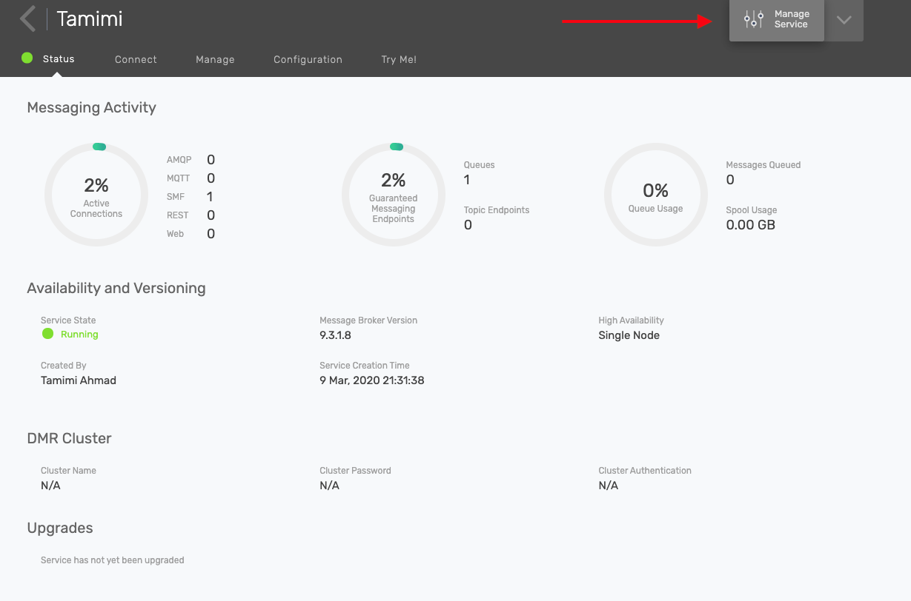

👉 Now you are in the PubSub+ management console. Navigate to the _Queue_ section from the left hand side panel and click on the **+ Queue** button to create a new queue. Name the queue **taxi**

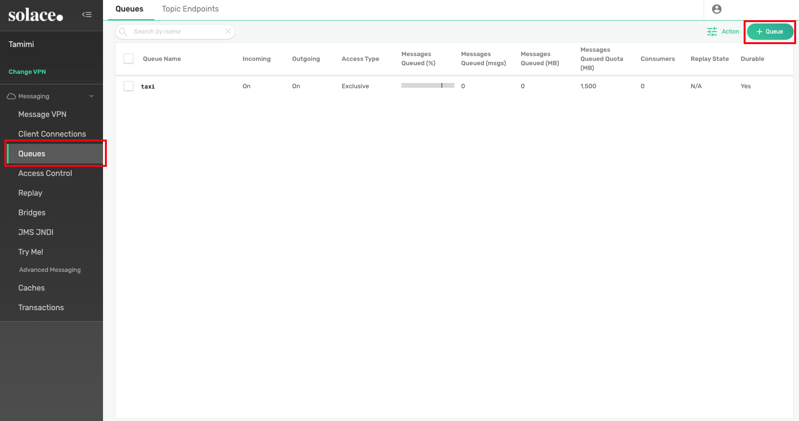

👉 After creating the new queue, click on it and navigate to the **Subscriptions** tab. Add a new subscription to the topic `taxi/nyc/v1/dropoff/>`

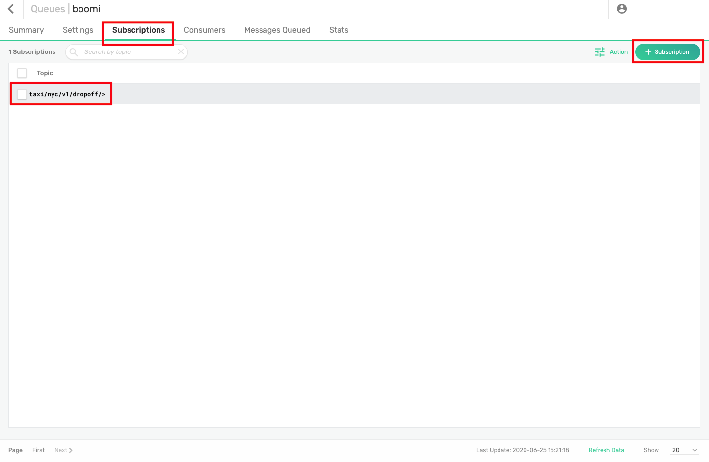

Positive
: Note: Subscribing to topic `taxi/nyc/v1/dropoff/>` means that this queue will receive all messages sent on a topic that has `taxi/nyc/v1/dropoff/` as a prefix. The use of the `>` wildcard means matching one or more levels. Read more about [Solace Wildcards](https://docs.solace.com/PubSub-Basics/Wildcard-Charaters-Topic-Subs.htm)

## Setup Solace connector in Boomi 
Duration: 0:10:00

Now back to the Boomi AtomSphere!

### 1. Create a new Boomi component

👉 Click on the **New** button to create a new component

👉 Make sure the **Type** is **Process**. Give it a name and folder to be saved in

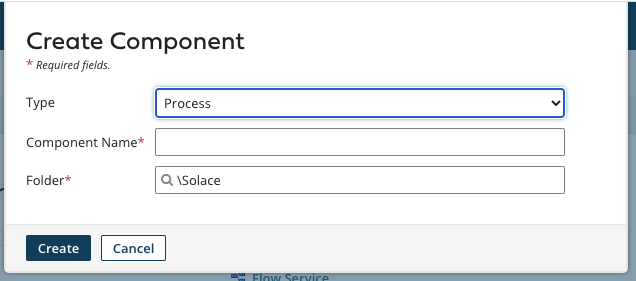

Positive
: The Boomi canvas is where you drag and drop different Boomi connecters, also known as **Shapes**

### 2.. Configure Solace Shape
👉 Hover over the Start shape to configure it 

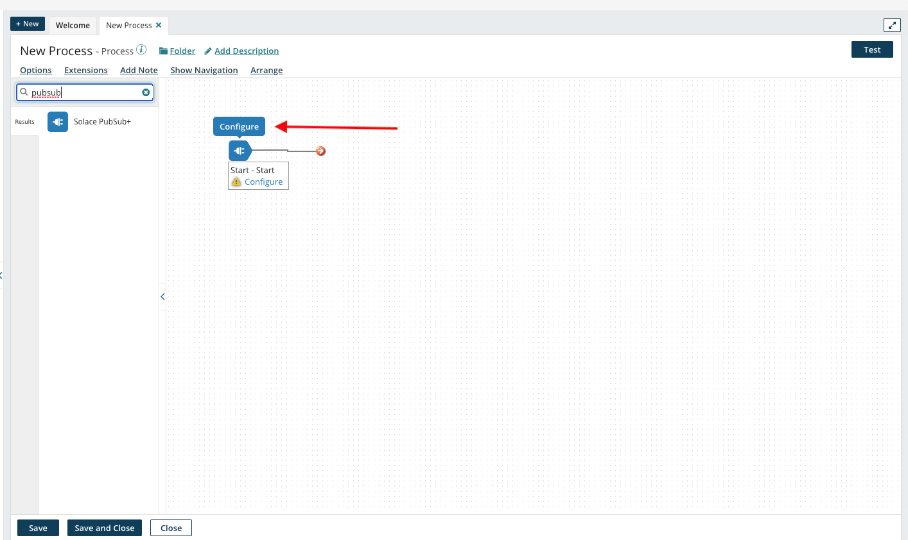

👉 Configure the Start shape to be a Solace PubSub+ Connector with the a **Listen** action as seen in the screenshot below

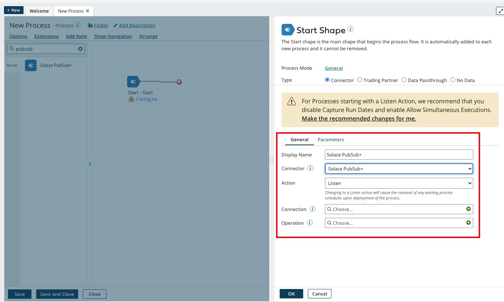

### A. Configure Connection

👉 In the **Connection** section, click on the + icon to configure the connection parameters

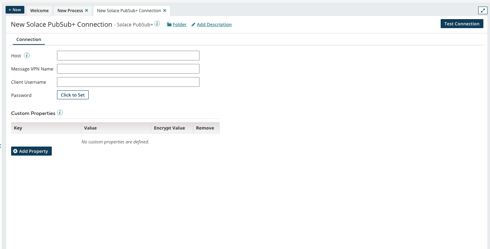

👉 Fill in the connection parameters with the **Host**, **Message VPN Name**, **Client Username** and **Password**. This is obtained by navigating back to the Solace Cloud console, clicking on the previously created service and navigating to the **Connect** tab. Note that you will have to expand the "Solace Messaging" menu to get the connection details

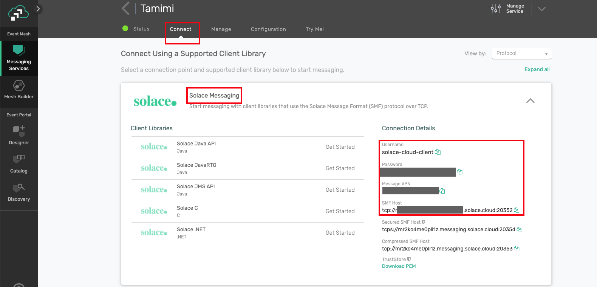

👉 Test the connection, by clicking on the **Test Connection** button. Note: Choose your Atom here

Positive
: Dont forget to "Save and Close" when done!

### B. Configure Operation
Back to the Start Shape configuration, click on the + icon for the **Operation** section to configure the operation parameters as seen in the screenshot below  

`Mode`: `Persistent Transacted`     
`Destination`: `taxi` <-- (thats the name of the queue we previously configured on the Solace Pubsub+ broker!)     
`Batch Size`: `1`       

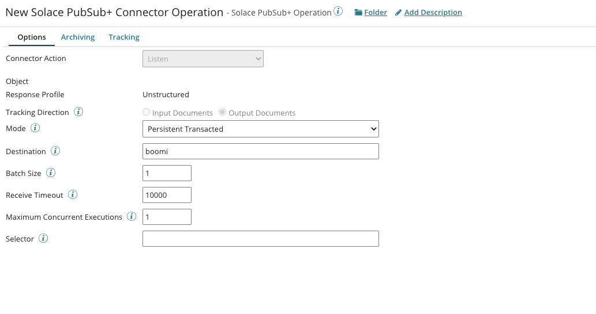

Save and close!

Now your Canvas should look like this with the newly added shape

### 3. Add a Notify shape
In order to test out the end to end connection and make sure that the events sent from the Solace PubSub+ broker are being received by the Solace Boomi Connector, we want to add a way to log the events received. To do so, lets go ahead and add a Notify shape

👉 Search for and drag the notify shape into the canvas

👉 Configure the Notify shape to log the payload received from the message sent 

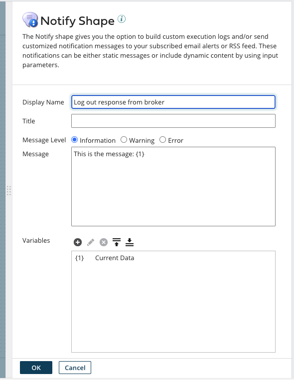

Note that `{1}` in the Boomi context means variables. Click on the `+` icon to add a new variable and choose the type to be **Current Data**

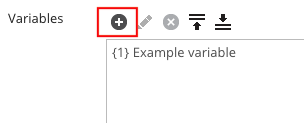

### 4. Connect the Solace PubSub+ Listener to the Notify Shape
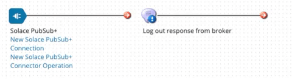

Positive
: It is good practice to add a Stop Shape at the end of your process that provides the ability to terminate the data flow in the a process path

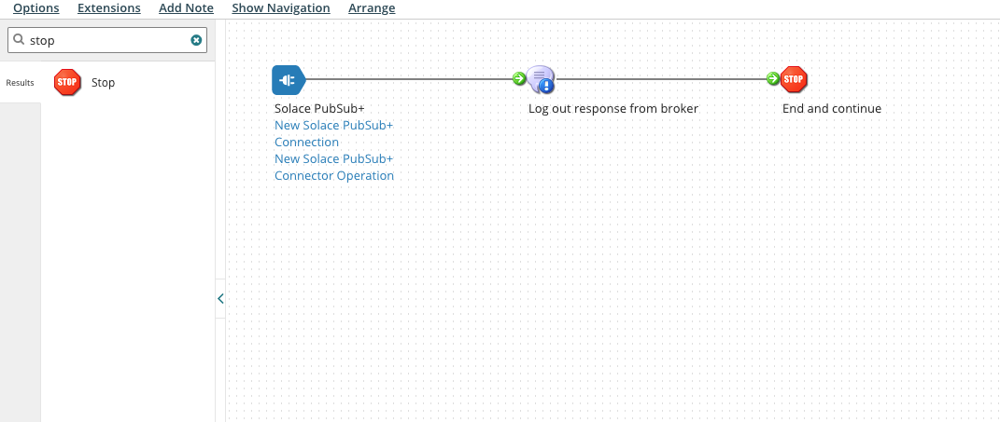

Save the process flow!

## Connect Everything!
Duration: 0:30:00

To connect everything together, we will need to package the newly created process flow and deploy it on the locally running Atom

### Package and Deploy the Process
👉 Click on the **Create Package** button

👉 The newly created component will be automatically selected by default 

👉 Click Next to add details. No need to add any more details

👉 Click create package and you will see this notification

### Deploy the packaged process on the running atom

👉 Click on the **Deploy** button and choose the Environment that you created previously

👉 Click Next until you get to the Review Deploy step 

👉 Click on the Deploy button!

### Publish events 💥!

👉 Navigate back to your Solace Cloud console, select the messaging service and navigate to the Try Me! tab

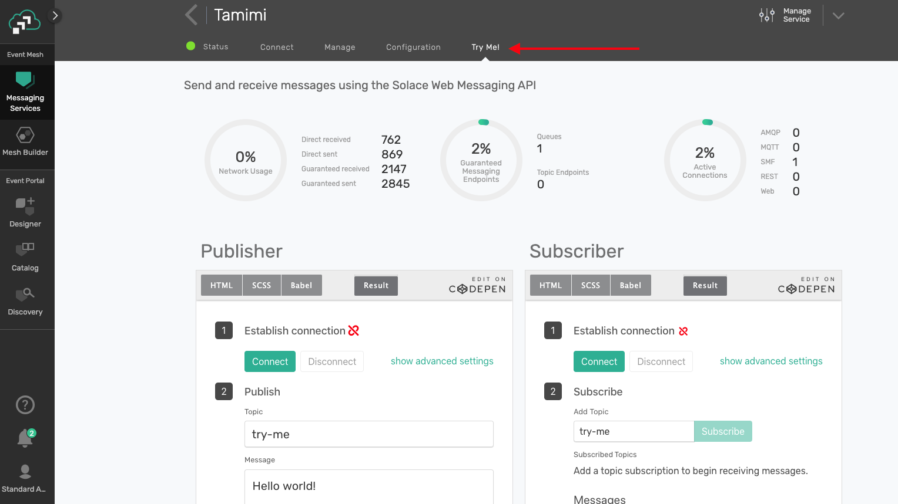

👉 In the Publisher section, click on the **Connect** button, change the topic to be `taxi/nyc/v1/dropoff/rideX` (since we have our queue subscribing to this topic, remember!) and update the message body to whatever you want

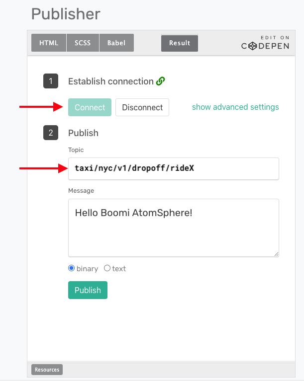

👉 Smash that Publish button.

### Check out the logs

👉 From the Boomi AtomSphere, navigate to the **Process Reporting** section under the Manage tab

You will see the process reporting menu with your newly created **NewProcess** process. Note that you can click on the refresh icon 

👉 Click on the view process logs icon

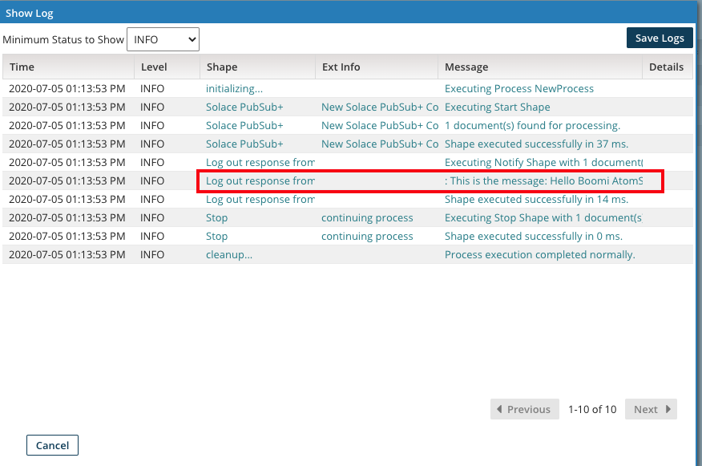

You're done! 

Positive
: Note that any publisher that publishes on topic `taxi/nyc/v1/dropoff/>` will be received by Solace PubSub+ Connecter on the Boomi AtomSphere and logged 

## Takeaways

Duration: 0:07:00

✅ Sign up for a Solace PubSub+ Cloud account and configure a messaging service broker with a queue    
✅ Sign up for a Boomi AtomSphere account and setup a Solace Pubsub+ Connector for a listen configuration and bind to a message queue   
✅ Send events to the same topic the queue is subscribed to    
✅ Check out more information on the Solace Connector in the [PubSub+ Connector Hub](https://solace.com/connectors/dell-boomi-ipaas/) page    

Thanks for participating in this codelab! Let us know what you thought in the [Solace Community Forum](https://solace.community/)!