author: Jesse Menning
summary:
id: boomi-salesforce-codelab
tags: workshop
categories: boomi, salesforce, azure, taxi
environments: Web
status: Draft
feedback link: https://github.com/jmenning-solace/nycmoderntaxi
analytics account: UA-3921398-10

# Event enabling Salesforce and AzureDB using Boomi and Solace


## What you'll learn: Overview

Duration: 0:05:00


As NYC Modern Taxi begins its quest to compete with ride sharing companies, it faces many challenges. One of them is winning over existing taxi drivers, who aren't excited about using the new app. 

To that end, NYC Modern Taxi Company decided to use Salesforce to treat each cabdriver like a potential customer. Account managers have been assigned 30 taxicab drivers each and have been instructed to spare no amount of free coffee to get them using the new app. Time is of the essence, so as soon as a driver agrees to join the app, the data in Salesforce needs to be available in the operations database. Simultaneously, NYC Taxi conducts a background check. 

In this scenario, there’s no time for data re-entry, or delays in data transmission: It’s gotta be event-driven. If a driver tries to login to the app and can’t because the information isn’t there…fuhgettaboutit. 

This codelab covers a lot of ground. You’ll learn about: 

✅ How to design an Event Driven Architecture with the Solace’s Event Portal 

✅ How to seamlessly implement your architecture using the PubSub+ Connector for Boomi and distribute real-time data around your enterprise 

✅ How to get events flowing out of Salesforce using its Change Data Capture and Platform Events capabilities 

✅ How to use Boomi’s Salesforce Platform Events connector to receive those events and transform them 

✅ How to interact with Azure SQL, a cloud-based database, using Boomi’s connector. 


## What you need: Prerequisites

Duration: 0:07:00


1. A general understanding of [event-driven architecture (EDA) terms and concepts](https://docs.solace.com/#Messagin). 
1. Basic knowledge of the Boomi GUI and deployments. A good place to start would be the [Getting Started with Boomi and Solace](https://codelabs.solace.dev/codelabs/boomi-getting-started/index.html) Codelab. 
1. A free Salesforce developer account. You can sign up here: [https://developer.salesforce.com/signup](https://developer.salesforce.com/signup)
1. A free Azure account: You can sign up here: [https://azure.microsoft.com/en-us/free/](https://azure.microsoft.com/en-us/free/ ) 


After you finish the Getting Started with Boomi and Solace codelab, you’ll have the following 
- A Solace trial account  
- A Boomi trial account, 
- A local atom up and running. 
- An understanding of how to deploy a Boomi process to a Boomi Atom 

Negative
: It's important to note that this codelab uses a pre-release version of the Solace connector to highlight cutting edge features and some prebuilt code to get you up and running faster. Please reach out to our [Solace Community](https://solace.community/) to get a copy of both. 

Positive
: If you’re new to the world of events, welcome! Solace has [extensive blogs focusing on event-driven architecture and development.](https://solace.com/blog/)

## Use Case Overview 🚕
Duration: 0:15:00

### ⚙️ Import Event Portal Application Domain
Download the Event Portal Application Domain export files: 

[Back Office](https://raw.githubusercontent.com/jmenning-solace/nycmoderntaxi/master/event_portal/NYC-Modern-Taxi-Co-Back-Office.json)

[Analytics](https://raw.githubusercontent.com/jmenning-solace/nycmoderntaxi/master/event_portal/NYC-Modern-Taxi-Co-Analytics.json)

[Operations](https://raw.githubusercontent.com/jmenning-solace/nycmoderntaxi/master/event_portal/NYC-Modern-Taxi-Co-Ops.json)

Inside of your logged into Solace Cloud Account navigate to the Event Portal Designer by clicking "Designer" in the menu on the left. 

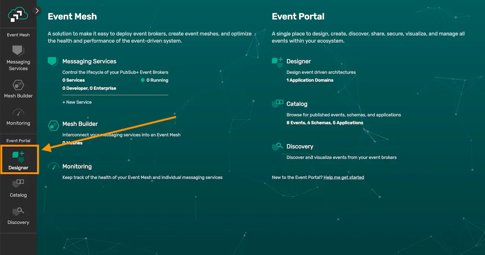

Then import the downloaded Application Domain files by clicking the `Import` button at the top right of the _Designer_ and importing the files. 


### ⚙️ High-level Architecture overview with the Solace Event Portal 
1. Go to the Solace Event Portal Designer [https://console.solace.cloud/designer](https://console.solace.cloud/designer) 
1. Open the NYC Modern Taxi Co – Back Office domain by double clicking on it. 

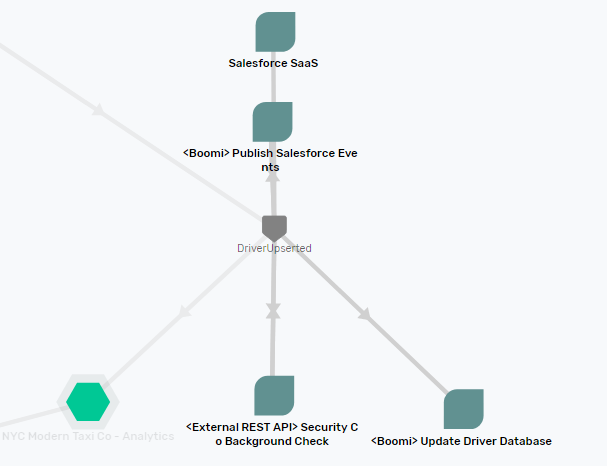

Here's the basic flow of events through the system

👉 After being convinced by cash, coffee or other means, a driver agrees to use the app

👉 The account representative changes the driver’s account from inactive to active

👉 Salesforce sends an event to Boomi

👉 A Boomi process transforms the event payload, removing unnecessary fields and publishes the event to the Solace event broker.

👉 Solace simultaneously distributes copies of the driver’s information across the company:


- `Update Driver Database` Boomi process receives the event, and inserts or updates the driver information in an Azure Cosmos database 
- If the `active` field on the account is set to `activated`, the `Background Check` Boomi process runs a background check on the driver. This takes 3 minutes. When finished, the `Update Driver Database` process updates the database with the results. (You already got a lot on our plate, so that’ll be an optional exercise at the end) 
- The account information goes to the Analytics department’s data lake for real-time analysis. (Once again, you’ll save that part for another CodeLab)

Do a deep dive into the individual applications, events and schemas by double clicking on them. Note that Event Portal houses all the schemas and topic strings that you’ll need for the CodeLab.

Positive
: If you want to learn more about the architecture for this CodeLab, check out the [Solace Architecture blog](https://solace.com/blog/category/architects/).

Two notes:
-	With event-driven design, each component is decoupled from one another. That makes development and testing each component in isolation easier. You’ll take that approach here: one at a time, we’ll get Solace, Salesforce, Boomi and Azure SQL working in “Hello World” fashion. Then you will link them all together using the PubSub+ Event Broker to complete the solution.
-	Designing the architecture in Solace Event Portal means that the schemas, topics and events are in one place, versioned and governed. It also means that the Solace PubSub+ Connector for Boomi can import them, saving you from manually re-entering information into Boomi.

## Salesforce Event Architecture
Duration: 0:05:00

### ⚙️ Deeper Dive into Salesforce Event Architecture


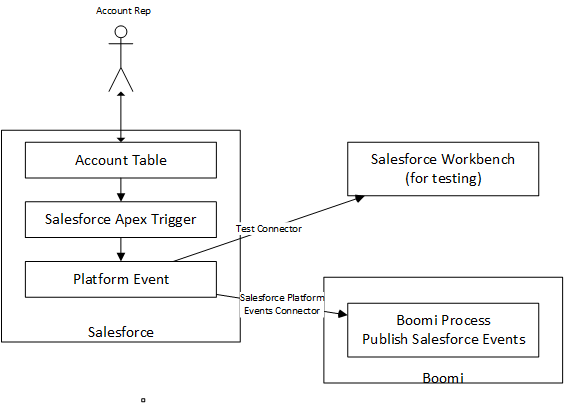

-	An account rep updates or adds an Account using the Salesforce UI
-	Salesforce alerts an Apex trigger that an account has changed
-	The trigger maps the new values for the Account into a custom platform AccountChanged event
-	Salesforces publishes the event on its internal message bus
-	Boomi’s Salesforce Platform Events connector listens for AccountChanged events
-	A Boomi process maps the Salesforce Platform Event into a Solace event, standardizing the data format and creating a topic string that allows for pinpoint data distribution.

## Connect Boomi to Solace Event Portal and Event Broker
Duration: 0:30:00

### ⚙️ Get connection values for PubSub+ 

Follow the steps in the [Getting Started with Boomi and Solace codelab](https://codelabs.solace.dev/codelabs/boomi-getting-started/index.html?#1) to get the connection values for your Solace PubSub+ Broker

### ⚙️ Generate the Solace Event Portal token
1. You’ll generate the token needed to connect to the Event Portal from Boomi. Click on the very last icon in the left hand column takes you to the User Profile (the label will be your account name, not Solace CTO 😄) Note: if you’ve already generated an Event Portal token for another CodeLab, feel free to reuse it. 
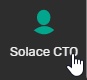 
1. Click on Token Management 
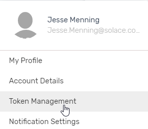 
1. Click on Create Token 
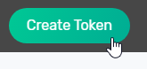 
1. Name the token BoomiUIAccess. Give it the “Event Portal Read” permission: 
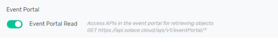 
1. Click on Generate Token 
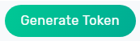 
1. Copy the generated token to a text editor. You will use it in the next section.

### ⚙️ Boomi configuration

Negative
: At this point, Solace is not part of the Boomi Process Library. Reach out to us at the [Solace Community](https://solace.community/) and we will get the code to you. 

### ⚙️ Connect the process to listen for Solace events
1.	Go to the [Boomi Integrate UI](https://platform.boomi.com/AtomSphere.html#build)
1. Open the Hello World – Listen for Solace Event process you just added to your workspace. 
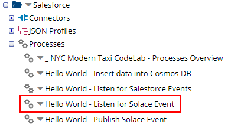 
1. Click on the start shape, then click on the pencil icon next to the Solace Event Portal and PubSub+ Connection field 
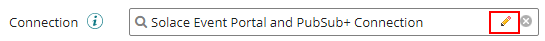 
1. Fill in the Solace Event Portal and Event Broker connection information you gathered in the last section. 
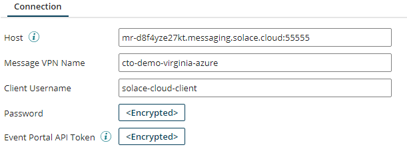 
1. Click on Test Connection. Select an atom, then click Next. You should get a message indicating that the test connection was successful. Then save and close the Connection. 
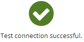 
1. Next, modify the Connector Operation by clicking on the pencil icon. 
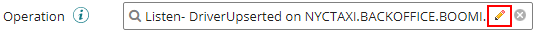 
1. Click on the Import button 
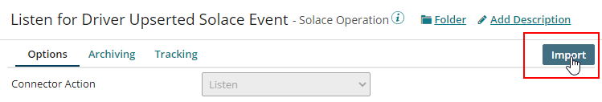 
1. Pick an atom, and use the Event Portal connection that you just modified. 
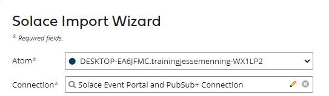 
1. Event Portal returns a list of events currently available on the Event Portal. Select the DriverUpserted event, and click on OK. 
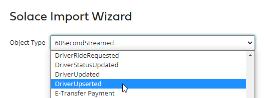 
Boomi grabs the schema from the Event Portal and creates a response profile (you’ll use this for mapping in a later section). It also brings the topic subscription format from Event Portal.
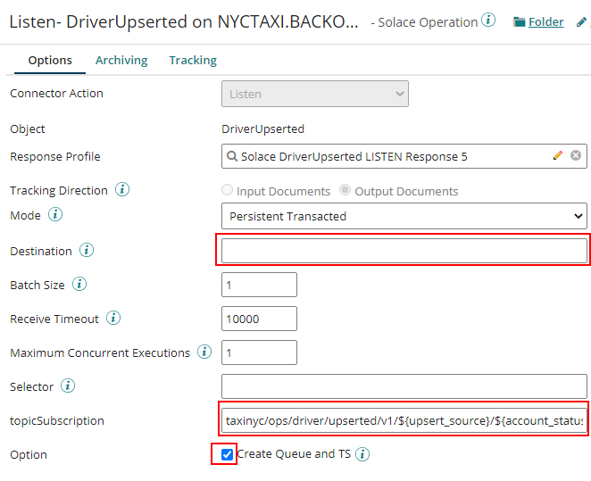 
- Change the destination to `NYCTAXI.BACKOFFICE.BOOMI.UPDATEDRIVERDB` This will be the Solace queue that the process binds to. Solace will create it automatically when you deploy the process for the first time. 
- Replace the topic string structure with `taxinyc/backoffice/driver/upserted/v1/salesforce/>`
The `>` character at the end is a wildcard that means that your process will get all DriverUpserted events, regardless of the upsert source or the account status. 
- Make sure that the check box next to Create Queue and TS is checked. 
- Save and Close the Connector operation and start shape.

Negative
: Due to Boomi SDK limitations, the current version of the connect does not allow you to modify an existing topic string. If you do want to make a change, re-import the event from Event Portal. 


### ⚙️ Package and deploy 
1. Save the Process, then click on Create Packaged Component using default options. Proceed to Deploy the new components to your atom. 
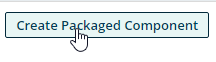 
1. Ensure that the Solace listener is up and running by going to Manage > Atom Management 
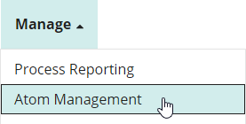 
1. Click on your atom 
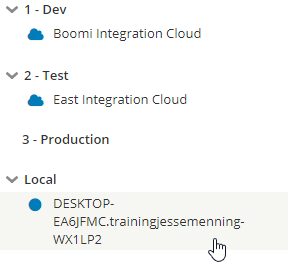 
1. In the middle column, select Listeners 
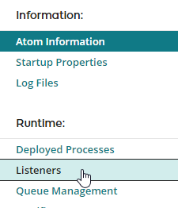 
1. You should see the listener up and running, with a green circle next to it. 
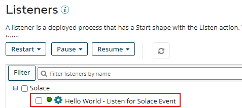 

Positive
: You’ll test this flow in the next section once you have a publisher process up and running.
So what did you just do? You just created the Boomi flow and the Solace objects needed for the solution. Once we have a publisher (which you’ll do in the next step), you’ll be able route a message through Boomi using Solace.

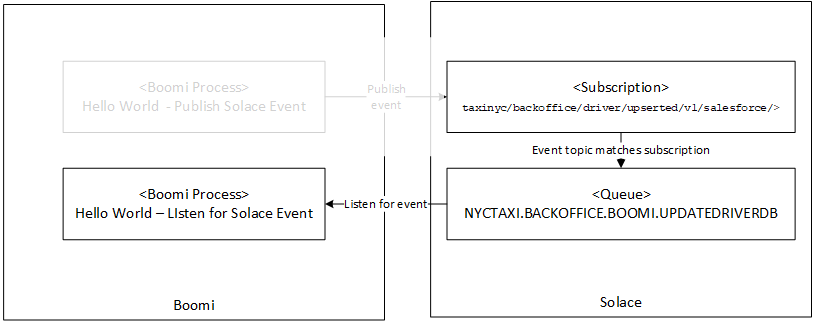 

###And Now-One Quick Fix
Negative
: In the current version of the Solace connector, if an error occurs while a Boomi process is processing an event, it could lead to a "poison message" scenario, where the event is processed over and over again. To avoid this, use this manual workaround for the time being, until Solace releases a new version (it's coming). 

1. Go back to the Solace UI, click on Messaging Services in the upper left, then select the messaging service that you created.
1. Click on Manage
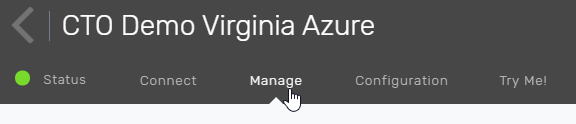 
1. Click on Queues
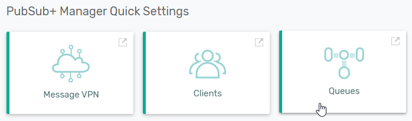
1. Click on the +Queue button to create a new queue to hold events that have failed processing
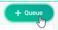
1. In the popup, name the new queue `#DEAD_MSG_QUEUE` and hit Done.
1. Click on the input queue for your Boomi Process: `NYCTAXI.BACKOFFICE.BOOMI.UPDATEDRIVERDB` queue
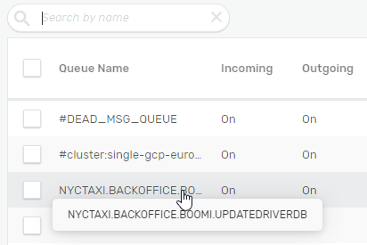
1. Click on the Edit button (with the pencil) in the upper right
1. Click on Show Advanced Settings in the upper right
1. Change the `Maximum Redelivery Count` field to `3`. This moves a failed event to a queue named `#DEAD_MSG_QUEUE` after 3 attempts. 
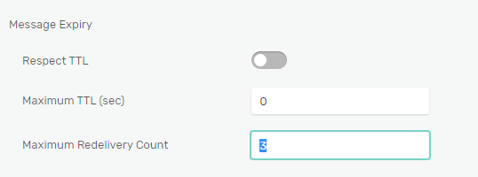


 

## Connect the Solace message publishing process
Duration: 0:10:00

You will reuse the Solace connector you created in the last step, so you’ll just need to modify the Solace connector operation.
1.	Open the “Hello World - Publish Solace Event” process, and click on the Publish DriverUpsertedEvent operation
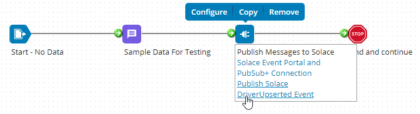 
 
1.	You’ll note that the sample code has already filled in the destination topic.
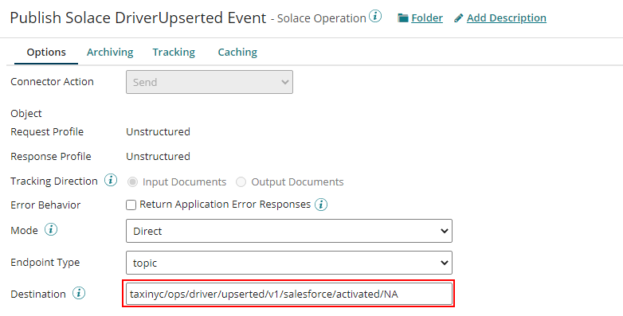 
 
1.	Since this process doesn’t use a Listen, we can just use Boomi’s test functionality. Click on the Test button and choose your atom.
1.	Once the test completes, go to Manage > Process Reporting 
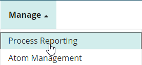 
 
1.	You should see an execution of the Hello World Listener 
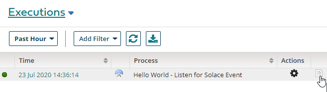 

1.	Click to view the logs and see that the process received the message successfully.
So what did you just do? You now have a complete Boomi and Solace integration, with the first Boomi process publishing a message on a topic. Solace examines the topic string on the event, finds a matching subscription and puts the event on a queue. A second Boomi process is listening for events that land on that queue, so when a event does land there, the process instantly triggers. 
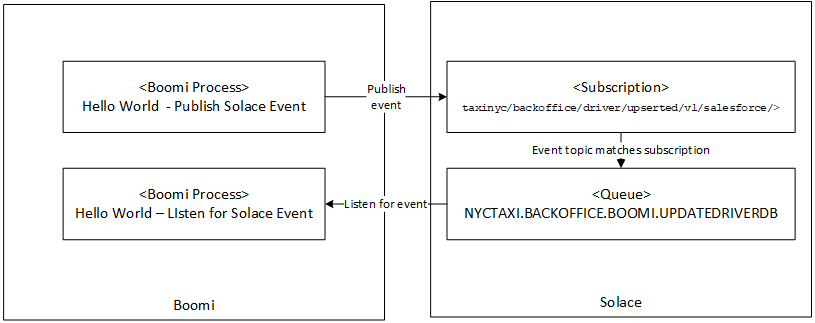 

## Create a new Connected App in Salesforce
Duration: 0:30:00

### ⚙️ Salesforce configuration 

1.	Log into your Salesforce Developer account
1.	Switch to the Setup view using the button in the upper right hand corner 
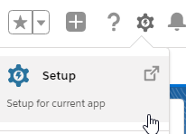 
 
1.	In left hand column, expand out Apps, then click on App Manager 
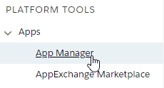 

1.	Click on “New Connected App” 
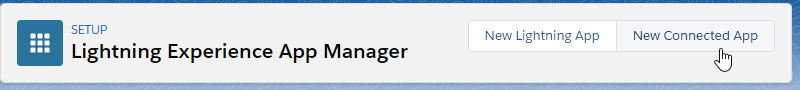 

1.	 Configure the Connected App 
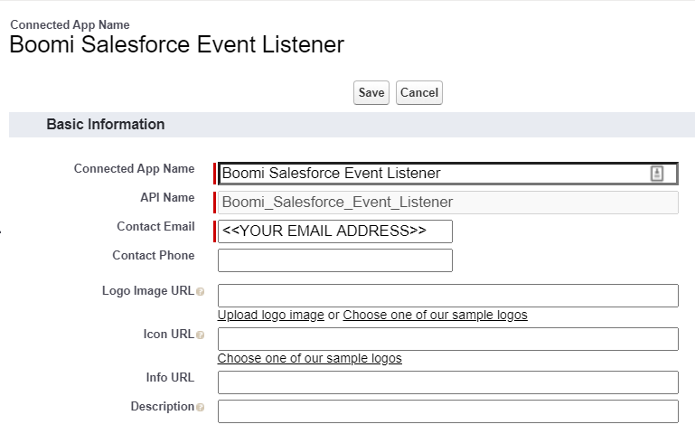 
 
-	For the callback URL, insert your Boomi account ID. If you’re logged into Boomi, it will be the part immediately after accountId=
For example, if your Boomi URL is:
`https://platform.boomi.com/AtomSphere.html#build;accountId=trainingjessemenning-WX1LP2`
Then your account id is: `trainingjessemenning-WX1LP2`
And your callback URL is: `https://platform.boomi.com/account/trainingjessemenning-WX1LP2/oauth2/callback`

-	For the Oauth Scopes, move Full Access into the Selected OAuth Scopes.

-	Click on the Configure ID Token check box, and make the token valid for 720 minutes
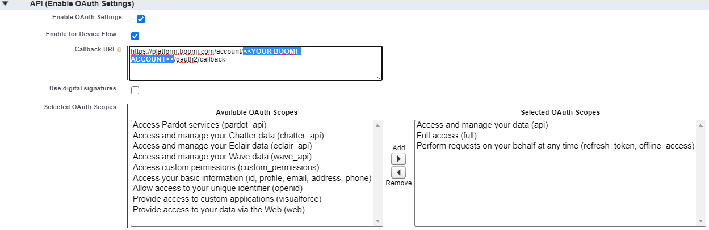 
 
1.Click on Save. In the next screen, Copy and paste the consumer key and consumer secret into a text editor. You’ll use the values when you’re configuring Boomi’s Salesforce Platform Event connector. 
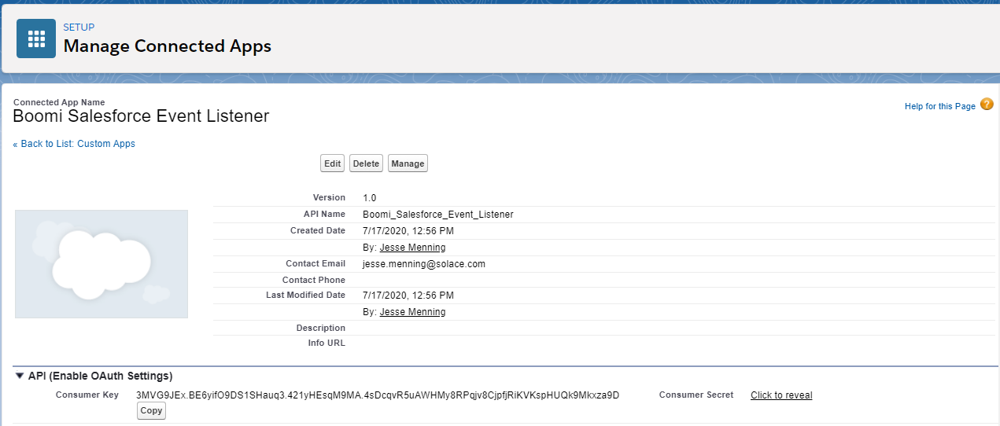 

### ⚙️ Define Platform Event structure
	
1. Type “platform” into the quick find box in the left-hand column and click on “Platform Events”
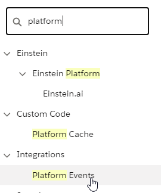
1. Click on New Platform Event
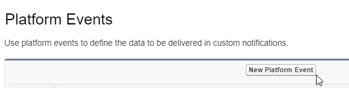
1. Use AccountChanged as the label for the event and click on Save.
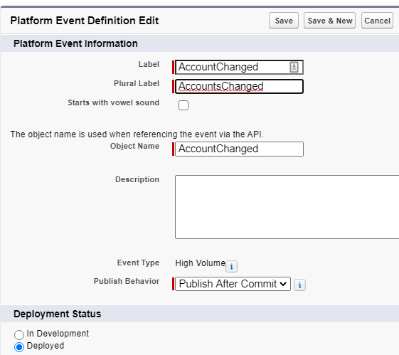
1. Add the following Custom Fields by repeatedly clicking on the “New” button and following the instructions. Note that spelling does matter, so please be careful. 
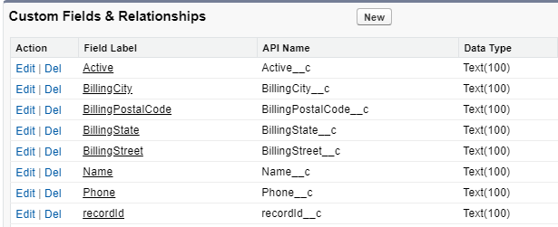 

### ⚙️ Create a trigger that populates and publishes the Platform Event

1. In the upper right-hand portion of the screen, click on Developer Console 
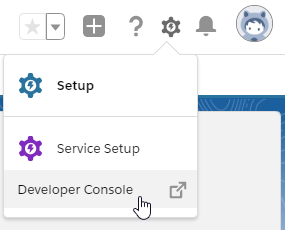 
 
1. Go to File > New > Apex Trigger 
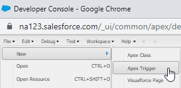 
 
1. In the popup, enter the following values and click on submit: 
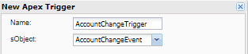 
 
1. Download the [Account Change trigger definition](https://raw.githubusercontent.com/jmenning-solace/nycmoderntaxi/master/boomi-salesforce-codelab/AccountChangeTrigger.txt) Cut and paste the code into the main code area and save. 

### ⚙️ Test it out using Salesforce Workbench

1. In a new tab, go to https://workbench.developerforce.com/login.php. Accept the term and click Login with Salesforce 
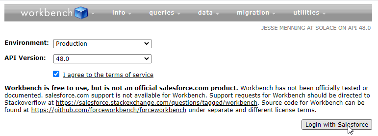 
 
1. Select “Stream Push Topics” from the Jump To menu 
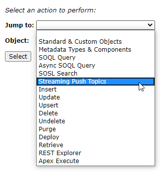 

1. Click on the Generic Subscriptions radio button 
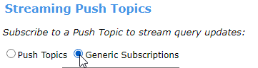 

1. In the subscription field, enter /event/AccountChanged__e
1. Back in Salesforce, leave the Setup section of Salesforce, and go to the Sales Console 
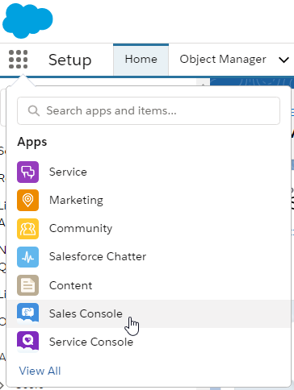 

1. Create a new account. 
 
 
1. Enter the name of the driver, phone number and billing address information. Be sure to set the Active dropdown to of the account to “active”, as only active accounts are sent over to the Driver database. 
 
 
 
 
1. Move back to the workbench tab. You should see data from your newly created account. 
 

## Configure Boomi to connect to Salesforce

1. Open the "Hello World - Listen for Salesforce Platform Event" sample process.
 
1. Click on the Start shape, then select “Salesforce Platform Events” in the dropdown
1. Click on the plus sign in the Connection box to create a new connection to Salesforce

1. Cut and paste the Client ID from the previous step into the Client ID box

1. Cut and paste the Client Secret into the Client Secret box. 

Scroll to the bottom of the screen and click on Generate 
 

NEGATIVE
: If you get an error that states `Unable to browse connector: invalid response: [{"message":"The REST API is not enabled for this Organization.","errorCode":"API_DISABLED_FOR_ORG"}]`
the connected app is not ready yet. It can take a couple hours.

 

You’ll see the following if it’s successful: 

 

1. Click on Save and Close
1. Click on the Plus sign next to Connector operation to create a new operation.
1. Click on Import in the upper right corner
 
 
1. Fill out the Import wizard with your local atom, and your newly created connection.
 
 
1. You should see your account change event listed.
 

 
1. Before plunging further, deploy your testing flow using the typical deployment routine. Then make a change within Salesforce and see if it reaches Boomi.

## Create the Azure SQL database

1. Login to [https://portal.azure.com/](https://portal.azure.com/)
1. In the top menu got to SQL Databases > Create
 
 
1. Enter your Subscription and Resource Group, creating a new one if needed
1. Database name should be taxinyc
1. Create a new server. Note that the server name must be unique, so find one that’s available.
 

 
1. In a text editor, save the Server name (including .database.windows.net), server admin login, and the password for later.
1. Under Compute+Storage, change options to “serverless”
1. Click on review and create
 

 
1. Deployment starts. Once it’s finished, click on “Go to resource”
 
 

1. To allow connections into the database, you need to create a firewall rule that allows certain IP addresses to connect.


Click on Set Server Firewall. In the firewall rules section create a rule that looks like this:


NEGATIVE
: Because this is only a demo, we’ll let all IPs connect. NEVER DO THIS IN A PROD ENVIRONMENT!!!!

Click on Save

1. Now you can start set up the Driver table. Click on the query editor 
 
 
Create the table by cutting and pasting this code into the Query tab, then clicking on Run
```
CREATE TABLE Drivers (
 driver_id int IDENTITY(1,1) PRIMARY KEY,
 first_name varchar(255) ,
 last_name varchar(255),
 rating int,
 car_class varchar(10),
 salesforce_id varchar(255) UNIQUE,
 account_status varchar(12),
	background_status varchar(10),
 account_type varchar(10),
 billing_street_address varchar(255),
 billing_city varchar(255),
 billing_state varchar(10),
 billing_zip varchar(10)
);
```
 

1. Confirm that the table exists: 
 

 
## Connect Boomi to the Azure SQL Database
1. If you are using a local atom, need to do some extra steps to add the SQL jar: 
 1. Download jar from here: [https://docs.microsoft.com/en-us/sql/connect/jdbc/download-microsoft-jdbc-driver-for-sql-server](https://docs.microsoft.com/en-us/sql/connect/jdbc/download-microsoft-jdbc-driver-for-sql-server) 
 1. Extract the zip file 
 1. Copy mssql-jdbc-8.2.2.jre8.jar to `<Boomi install directory>/userlib/database` . If those directories don’t exist, just create them. 
 1. End result should look like this, where the highlighted portion depends on how you installed the Atom 
  

 
1. OK, back to the fun stuff: In another tab, head back to the Boomi UI
1. Open the “Azure SQL Database Connection – taxinyc” 
1. Open the “Hello World - Select from/Insert into Azure SQL” process
1. Fill in the connection details you saved in the last section. The value for the host will be different than the one listed here. 
 

1. Click on Test Connection, you should get a “success” message. If not, check your connection values. Save and close.
1. Open the Hello World - Select from/Insert into Azure SQL process.
1. Click on the “Test” button
1. Once it runs, return to the Azure UI, and get the data you just inserted.
 
 
1. Return to Boomi, double click on the “Sample data for testing” shape, and change the first name
 
 
1. Rerun the test and confirm that the data has changed.
 
 
## Tying it all together with Solace PubSub+

1. Now that we have all the components tested individually, we can use the Solace event broker to tie them all together.

1. First, undeploy all the processes we used for testing. Go to Deploy > Deployments 
 
 
Undeploy any “Hello World” processes that are deployed 
 
 
1. Open the “Listen for Salesforce Platform Account, publish Solace DriverUpserted” process. Expanding on the Hello World functionality, here are the differences: 
 
 
Rather than using the same topic, here the code change the topic string based on whether the account is active, just was activated or was deactivated 
 
 
There is now a mapping from the Salesforce event over into the standard Solace event. 
 
 
At the end of the process, Boomi publishes the message to Solace, on the topic string you generate earlier in the process.

1. You don’t need to make any changes, just create a packaged component and deploy it as usual 
1. Open up the “Listen for Solace DriverUpserted, Insert into Drivers” process. This process also expands on the Hello World flows. Rather than just using canned data, it listens for events on the queue you created earlier. As Solace publishes DriverUpserted events, they land on the queue. The process grabs them and inserts or updates the Driver table. 
1. Create a Packaged Component and deploy. 
1. The world is your oyster. Log back into Salesforce and add and modify Accounts. As you do, they should stream in real time over Boomi and Solace, and instantly land in the SQL database 

## Conclusion
Congratulations, you now have a functioning, real-time, event-driven Salesforce implementation. No more worries about your operational database lagging behind Salesforce. Because no one likes an angry cabbie.
Although seeing event move quickly though an enterprise is pretty cool, this is just the beginning. Event enabling Salesforce vastly simplifies adding on additional information consumers. Like we mentioned in the beginning—need to add a background check? Just add another process with a subscription and add the logic. Want to add real-time analytics? Send the DriverUpserted events to Kafka. Now that you have real-time data flowing, the possibilities are endless.


## Takeaways

Duration: 0:01:00


Thanks for participating in this codelab! Let us know what you thought in the [Solace Community Forum](https://solace.community/)! If you found any issues along the way we'd appreciate it if you'd raise them by clicking the Report a mistake button at the bottom left of this codelab.

✅ For more information on the Solace Connector check out the [PubSub+ Connector Hub](https://solace.com/connectors/dell-boomi-ipaas/) page    

