author: Tamimi
summary:
id: boomi-v2-getting-started
tags: workshop
categories: Boomi, Portal
environments: Web
status: Published
feedback link: https://github.com/SolaceDev/solace-dev-codelabs/blob/master/markdown/boomi-v2-getting-started
analytics account: UA-3921398-10
# Getting started with Boomi and Solace

## What you'll learn 
Duration: 0:02:00

In this tutorial, you will learn how to 
1. Configure your Solace PubSub+ Broker
1. Setup your Boomi AtomSphere
1. Design a basic event-driven architecture in Solace PubSub+ Event Portal
1. Configure the Solace connector in the Boomi AtomSphere
1. Send/Receive messages between Boomi and Solace

Positive
: Note that this tutorial is meant to be platform and programming language agnostic. Meaning that regardless what operating system you are running (Mac, Linux, Windows), programming languages or messaging APIs you choose to use, the setup will be the same.

### Prerequisite 
This tutorial assumes:
* Users on MacOS/Linux have knowledge using Docker for Boomi Atom configuration
* Access to a Solace broker (explained in Step 2)
* Access to a Boomi environment (explained in Step 3)

## Setup a Solace PubSub+ Broker for Messaging
Duration: 0:05:00

Access to a Solace messaging service, Solace PubSub+, can be achieved in either one of the three flavours
1. Hardware Appliance
1. Software broker image (Docker, Virtual image)
1. Solace Cloud service instance

This tutorial will walk you through setting up a Solace Cloud service instance, which also gives you access to the Event Portal. If you are interested in setting up a local broker running on Docker or a virtual machine check out the [PubSub+ Event  Broker: Software](https://docs.solace.com/Solace-SW-Broker-Set-Up/SW-Broker-Image-Setup.htm) documentation

### Sign up for free Solace Cloud account 
Navigate to the [Create a New Account](https://console.solace.cloud/login/new-account) page and fill out the required information. No credit card required!

### Create a messaging service
After you create your Solace Cloud account and sign in to the Solace Cloud Console, you'll be routed to the event mesh page.

Click on 'Messaging Services' and all the messaging services associated with your account will show up if you have any already created. To create a new service, click either button as depicted in the image below:

Fill out all the details for your messaging service, and then click "Create" at the bottom of the page.

Your service should be ready to use in a couple seconds! 🌪

## Setup Boomi AtomSphere
Duration: 0:30:00

### Core concepts
Boomi builds, deploys and manages all the processes in a concept called **Atoms**, which is a lightweight Java application that is deployed on a host with Internet access. Think of it as your single-tenant, single-node runtime engine. There are two deployment models for Atoms:

1. **In-the-cloud deployment** (using Boomi Atom Cloud)
1. **On-premise deployment** (using local Atom setup)

Positive
: The Boomi Atom is a lightweight, dynamic runtime engine. Once your integration processes have been deployed to your Atom, the Atom contains all the components required to execute your processes from end to end, including connectors, transformation rules, decision handling, and processing logic.

### 4 Steps to get started with Boomi

#### 1. Create a Boomi trial account
if you dont have an account, navigate to [https://boomi.com/form/trial/](https://boomi.com/form/trial/) and sign up for a free account.

After you sign up for a Boomi platform account and login, you will have access to the Boomi AtomSphere - your one stop shop for all your integrations 🤓

You will see the menu at the top

* **Build**: This is where you design and package your process (i.e. architecture)
* **Deploy**: This is where you deploy the packaged process in your Atom for execution
* **Manage**: This is where you configure your environment and Atoms

#### 2. Configure and deploy your local Atom
In this tutorial, we will be setting up a local Atom. 

Positive
: You can skip this if you have access to a cloud Atom

You can either navigate to the links below for more information or follow the steps after

1. [Windows Machine](https://help.boomi.com/bundle/integration/page/t-atm-Installing_a_local_Atom_on_Windows_beec31b0-477d-430b-a744-cedb3a8d67eb.html).
1. [Using Docker](https://help.boomi.com/bundle/integration/page/t-atm-Using_Docker_to_install_a_local_Atom_on_Linux_b54f0e8c-c02c-4eea-87f5-7233d1c5e0a5.html).

👉 Navigate to the **Manage** tab and click on **Atom Management**

👉 Click on **+New** and choose **Atom**

👉 Choose the operating system of choice in the **Atom Setup** box

📝 **Notes on Docker installation**

The installer is a shell script that you run locally and automatically configure your docker setup

1. `./atomdocker_install64.sh -h` for more information on how to run it
1. You can generate a token by clicking on **Generate Token** under **Security Options** 
1. Create a `/var/boomi` directory because the script assumes it already exists and make sure its owned by the current user
    1. Navigate to `/var/boomi/` after you create it
    1. Execute the following from terminal `chown $USER .`
    1. Make sure this directory is shared on docker. This is done by opening the docker preferences and adding it under **File Sharing Resources** tab

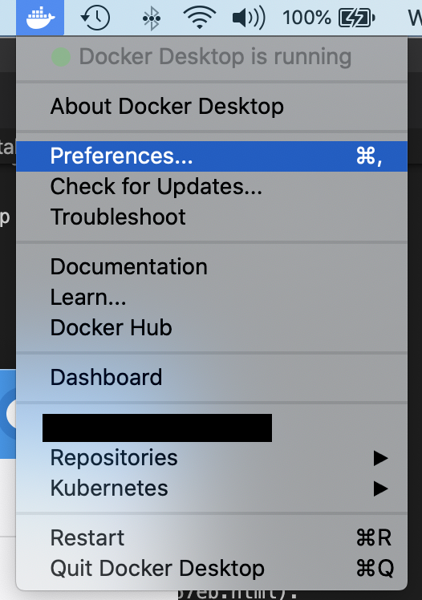

🏃‍♂️ **Run the atom**

Execute the atom docker installation shell script as follows     
`./atomdocker_install64.sh -n <name_of_atom> -k <insert_token>`

At this point, you can confirm that the Atom has been created and linked to your AtomSphere when you navigate to the Atom Management in the Manage tab and you will see your newly created atom under the **Unattached Atoms** section

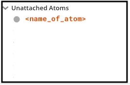

#### 3. Setup Boomi environment

Boomi Environments are synonymous to workspaces thats used for testing or production purposes. You need an environment to "attach" the atom to. You can read more about Boomi Environments on the [Environment Management Boomi User Guide](https://help.boomi.com/bundle/integration/page/c-atm-Environment_management.html)

Under the Manage menu, navigate to the Atom management and add a new environment
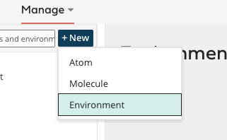

Give it a name and choose **Test** for the environment classification
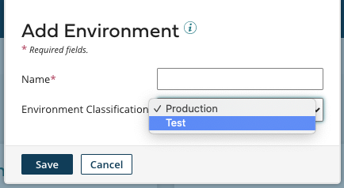

#### 4. Attach the Atom to the environment

Select your newly created environment and search for your atom to attach it
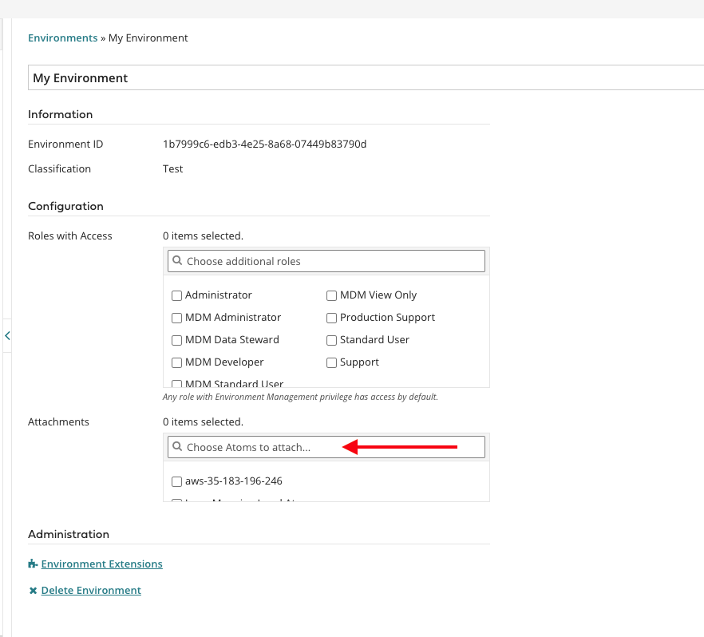

Positive
: Note: a blue icon next to your newly created Atom means that it has an Online Status

#### 🎉 Voila! Now you have your Solace and Boomi environments setup

## Design your architecture using Solace PubSub+ Event Portal
Duration: 0:02:00

Your free trial of Solace PubSub+ Cloud comes with the Event Portal, which helps you visualize the structure of event-driven architectures. The trial also includes a sample architecture called Acme Rideshare, that we'll use for this lab.

- Start it up by going to the "Designer" icon in the left hand column     

   

- Then double click on the Acme Rideshare domain      

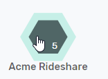   

- There's a lot going on, but we'll just focus on the **Passenger** application sending a **RideRequested Event** to the **Driver Management** application.       
    

For our purposes:       

**Passenger App**: will mock an event publisher      
**Ride Requested**: is an event with a JSON schema payload representing a ride request       
**Driver Management**: will be a simple Boomi flow, which will pick up the ride request and write it to the process log. Very simple 🤙    

- Double click on the RideRequested event to get more details about the event      

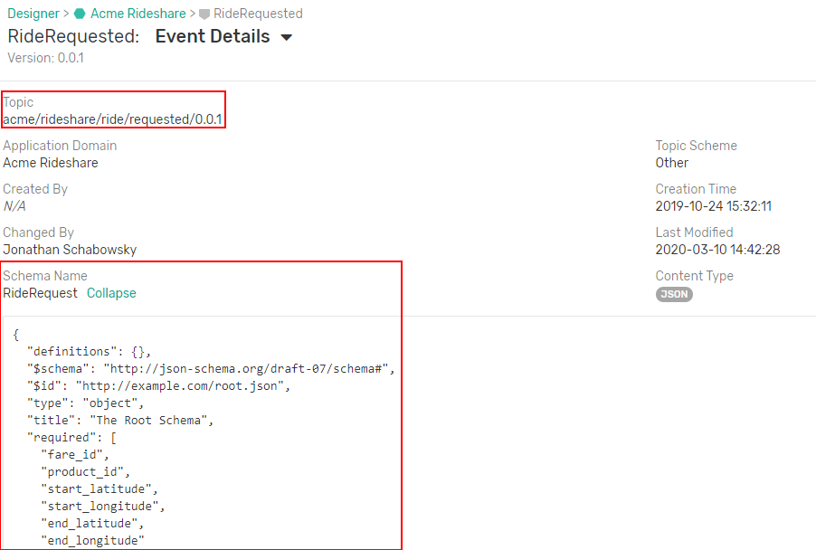     

Two things to note here:
* The topic is meta information about the event that lets Boomi flows quickly know if they are interested or not. 
* The schema describes the data format, similar to a [profile](https://help.boomi.com/bundle/integration/page/c-atm-Profile_components.html) within Boomi

Positive
: The topic and schema information in the Event Portal can be imported into Boomi using the Solace connector

## Setup Solace connector in Boomi 
Duration: 0:10:00

Now back to the Boomi AtomSphere!

### 1. Create a new Boomi component

👉 Click on the **New** button to create a new component

👉 Make sure the **Type** is **Process**. Give it a name and folder to be saved in

Positive
: The Boomi canvas is where you drag and drop different Boomi connecters, also known as **Shapes**

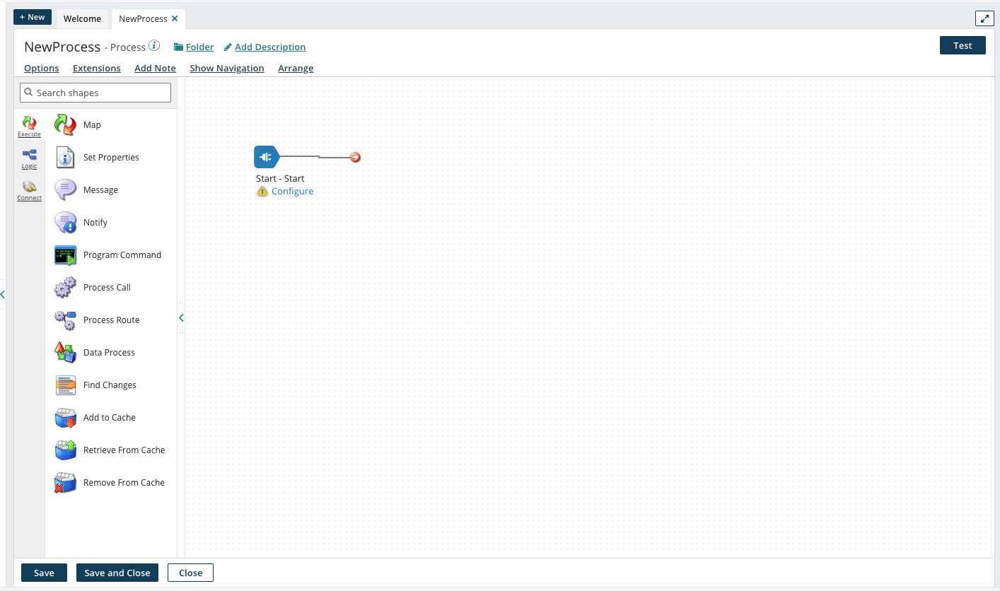

### 2. Search for the Solace shape from the list of connectors

👉 Drag and drop it into the canvas

👉 Configure the Start shape to be a Solace PubSub+ Connector with the a **Listen** action as seen in the screenshot below

Positive
: Note: For more information about the solace connector available operations (`Listen`, `Get`, `Send`) check out the [Solace PubSub+ – Partner operation documentation guide](https://help.boomi.com/bundle/connectors/page/int-Solace_PubSub_operation.html). 

### 3. Configure Connection

👉 In the **Connection** section, click on the + icon to configure the connection parameters

👉 Fill in the connection parameters with the **Host**, **Message VPN Name**, **Client Username** and **Password**. This is obtained by navigating back to the Solace PubSub+ Cloud Manager console, clicking on the previously created service and navigating to the **Connect** tab. Note that you will have to expand the "Solace Messaging" menu to get the connection details
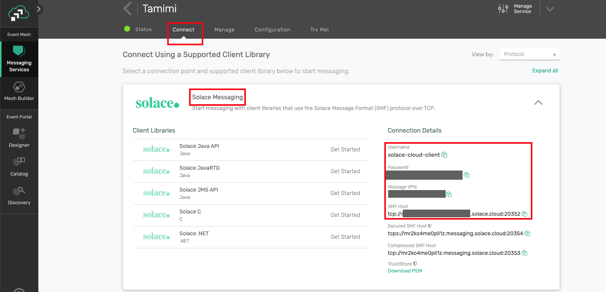

👉 One more piece of information you'll need is an Event Portal token (this lets you import in the topic string and schema from the previously designed architecture).  In Solace Cloud console, scroll all the way to the bottom of the left column, and click on the account management icon, then select Token Management.       

     

👉 Click on the "Create Token" button in the upper right.

👉 Name the token "Boomi UI access"     

   

👉 Scroll all the way to the bottom of the page and enable the Event Portal Read permission.    

👉 Click on Generate Token

👉 Copy the generated token (make sure to grab it all), and paste it into the Event Portal API Token field in Boomi.

👉 Test the connection, by clicking on the **Test Connection** button. Note: Choose your Atom here

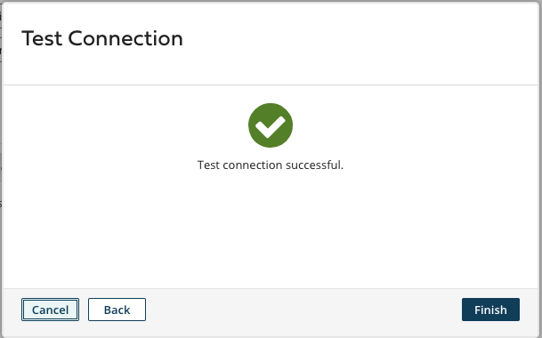

Positive
: Dont forget to "Save and Close" when done!

### 4. Configure Operation
Back to the Solace Shape configuration, click on the + icon for the **Operation** section to configure the operation parameters as seen in the screenshot below  

👉 Assign the Mode to Persistent Transacted    
👉 Select the Create Queue and Topic Subscription option

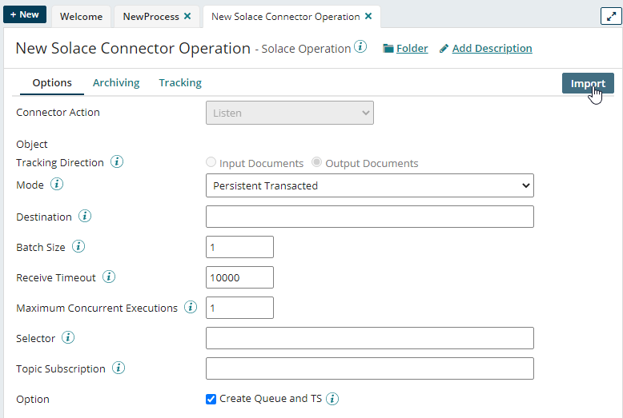

Positive
: Note: The `Create Queue and Topic Subscription` option means that the Solace connector will create the queue and subscription for you behind the scenes

👉 Click on the Import Button in the Upper Right.  Select your atom and the Solace connection that you just created, then click on Next.
 
Boomi grabs the events available to you from the Event Portal, and lists them in a drop down box

👉 Pick the RideRequested event, click Next, then Finish.

Now check out our Connector Operation:  The data format from the Event Portal is now a Boomi Profile (click on the pencil to see more) and the topic string is filled in for us.
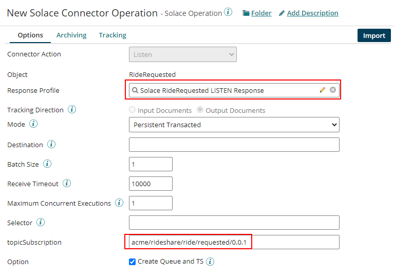    

Positive
: Don't forget to Save and close!

👉 Now your Canvas should look like this with the newly added shape

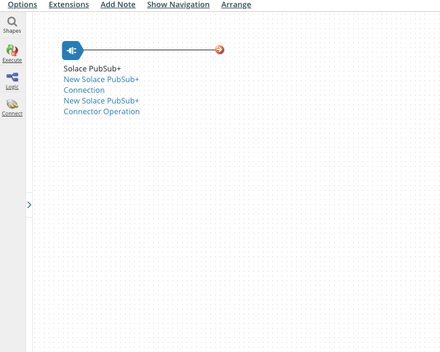

### 5. Add a Notify shape
In order to test out the end to end connection and make sure that the events sent from the Solace PubSub+ broker are being received by the Solace Boomi Connector, we want to add a way to log the events received. To do so, lets go ahead and add a Notify shape

👉 Search for and drag the notify shape into the canvas

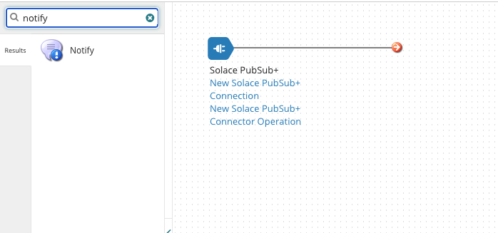

👉 Configure the Notify shape to log the payload received from the message sent 

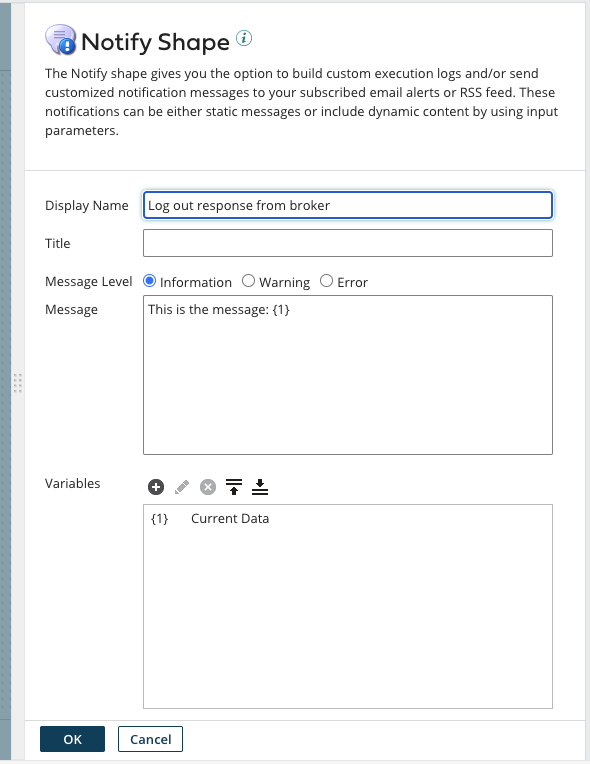

Note that `{1}` in the Boomi context means variables. Click on the `+` icon to add a new variable and choose the type to be **Current Data**

### 6. Connect the Solace PubSub+ Listener to the Notify Shape
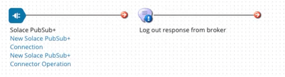

Positive
: It is good practice to add a Stop Shape at the end of your process that provides the ability to terminate the data flow in the a process path

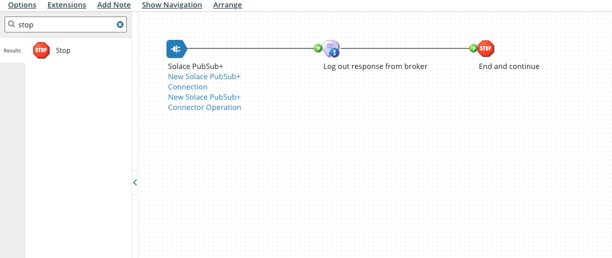

Positive
: Don't forget to Save and close!

## Send and receive messages!
Duration: 0:30:00

To connect everything together, we will need to package the newly created process flow and deploy it on the locally running Atom

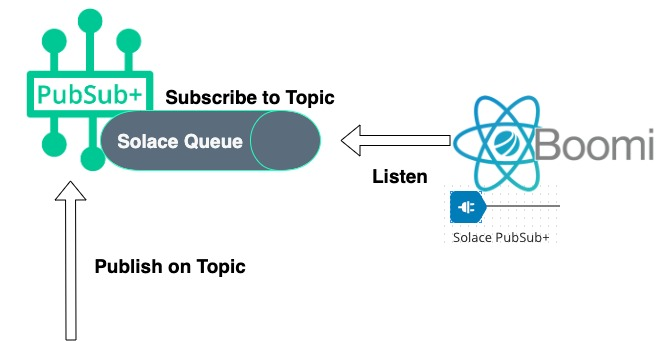

### Package and Deploy the Process
👉 Click on the **Create Package** button

👉 The newly created component will be automatically selected by default 

👉 Click Next to add details. No need to add any more details

👉 Click create package and you will see this notification

### Deploy the packaged process on the running atom

👉 Click on the **Deploy** button and choose the Environment that you created previously

👉 Click Next until you get to the Review Deploy step 

👉 Click on the Deploy button!

Positive
: Typically this is when you would have to manually create queues and subscriptions.  But behind the scenes, the Solace connector autocreates those for you, so no work there.

### Publish events 💥!

👉 Navigate back to your Solace Cloud console, select the messaging service and navigate to the Try Me! tab

👉 In the Publisher section, click on the **Connect** button, change the topic to be `acme/rideshare/ride/requested/0.0.1` (since we have our queue subscribing to this topic, remember!) and update the message body to whatever you want

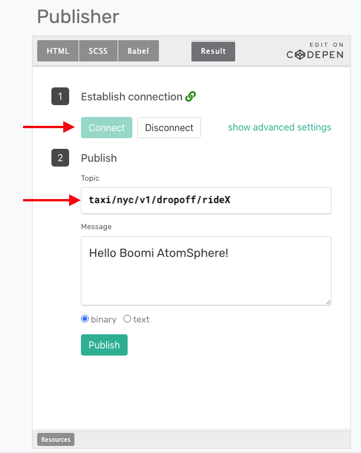

👉 Smash that Publish button.

### Check out the logs

👉 From the Boomi AtomSphere, navigate to the **Process Reporting** section under the Manage tab

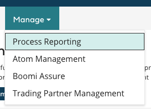

You will see the process reporting menu with your newly created **NewProcess** process. Note that you can click on the refresh icon 
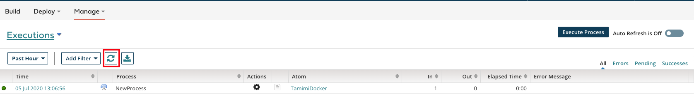

👉 Click on the view process logs icon

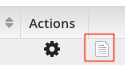
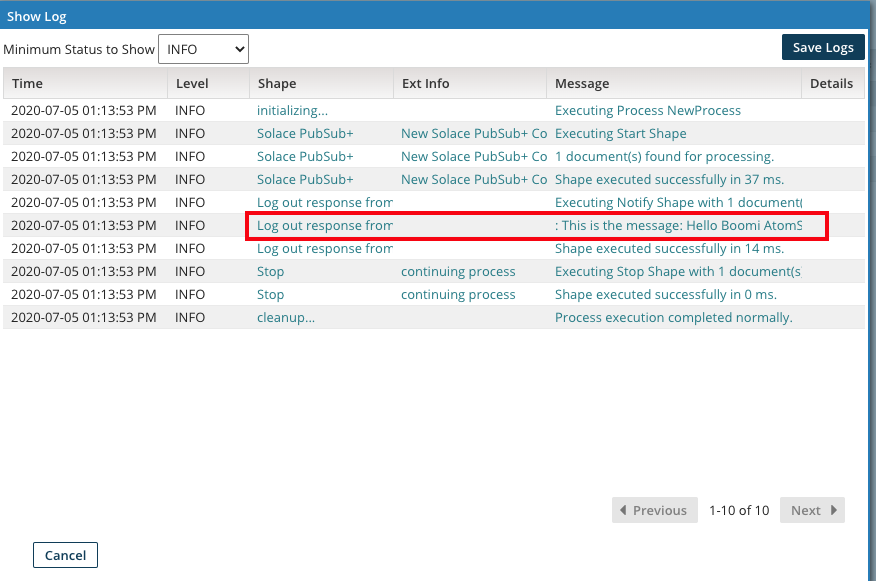
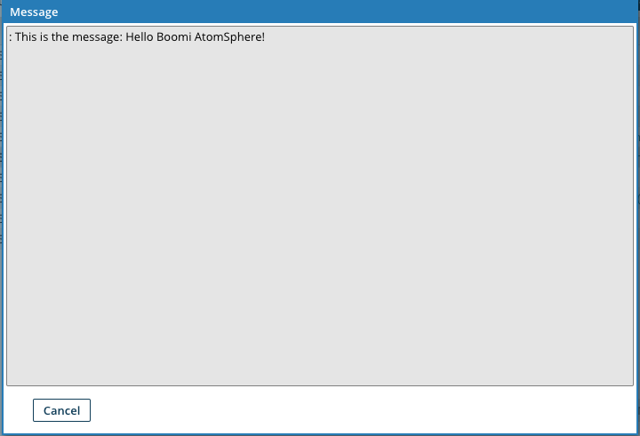

You're done! 

Positive
: Note that any publisher that publishes on topic `acme/rideshare/ride/requested/0.0.1` will be received by Solace PubSub+ Connector on the Boomi AtomSphere and logged 

## Takeaways

Duration: 0:07:00

✅ Sign up for a Solace PubSub+ Cloud account and configure a messaging service broker with a queue    
✅ Sign up for a Boomi AtomSphere account and setup a Solace Pubsub+ Connector for a listen configuration and bind to a message queue   
✅ Send events to the same topic the queue is subscribed to    
✅ Check out more information on the Solace Connector in the [PubSub+ Connector Hub](https://solace.com/connectors/dell-boomi-ipaas/) page    

Thanks for participating in this codelab! Let us know what you thought in the [Solace Community Forum](https://solace.community/)!

