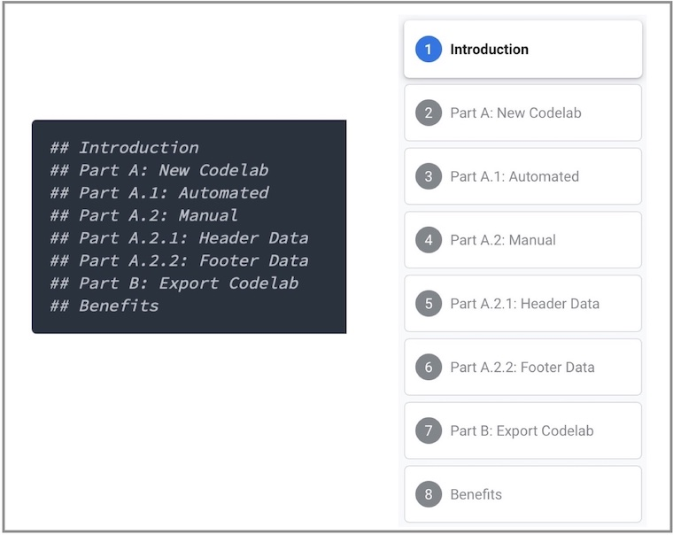
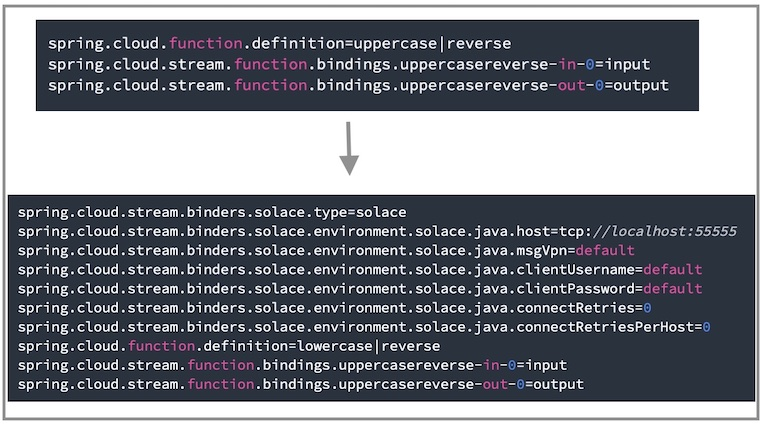

author: Marc DiPasquale
summary: Create a Codelab Using Markdown
id: codelab-4-codelab
tags:
categories: Solace, Codelabs
environments: Web
status: Published
feedback link: https://github.com/SolaceDev/solace-dev-codelabs/tree/master/markdown/codelab-4-codelab

# Codelab to Create a Codelab

## Codelab Overview

Duration: 0:02:00

This Codelab will show you how to quickly create your own Google Codelab just like the one you're using right now!

We'll be authoring the codelabs using markdown format. This gives us the flexibility of using our markdown file for other things and also storing it in our [github repo](https://github.com/SolaceDev/solace-dev-codelabs/tree/master/markdown).

Here is an example image of another Codelab that I created:

### Resources

- The markdown for this codelab is located here: [codelab.md](https://raw.githubusercontent.com/SolaceDev/solace-dev-codelabs/master/markdown/codelab-4-codelab/codelab-4-codelab.md)
- [Google Codelabs Tools Github](https://github.com/googlecodelabs/tools) - The repo that contains the claat tool we'll be using today
- [Google Group for Codelab Authors](https://groups.google.com/forum/#!forum/codelab-authors) - great forum for asking questions about codelabs and discussing future functionality

## Environment Setup

Duration: 0:04:00

Authoring a new codelab is as simple as writing your content in markdown format and opening pull request in the codelabs repo as defined in steps 4, 5, and 8. Please refer to the Tips and Tricks: Syntax step to keep note of codelab specific syntax that you will need to follow for the correct formatting. 

Note that you can view your markdown file using a markdown viewer of your own (e.g. a viewer embedded in VsCode, or online tool)

### Optional, But Recommended
If you would like to view your codelab locally in the same format before contributing to the main [codelabs site](https://codelabs.solace.dev/), follow the steps below to mimic the environment used to build codelabs 👇


You will need to have the following dependencies

- [Go](https://golang.org/dl/)
- [claat](https://github.com/googlecodelabs/tools/tree/master/claat) (the codelabs command line tool)
- [Nodejs](https://nodejs.org/en/download/)

### Option A: Download from source

- Install Go, claat, and NodeJs from the links above if you don't have them already installed. You can follow the documentation on Go's website and the Google Codelabs github repo.

### Option B: Download from cli: MacOS/Linux setup

#### Make sure you Go installed in your system

```bash
$ brew install go
```

#### Setup Go Environment Variables

Below is what I set on mac, but instructions are [here](https://golang.org/doc/install) for other OS options

```bash
$ export GOPATH=$HOME/go
$ export PATH=$PATH:$GOPATH/bin
```

#### Install claat

```bash
$ go install github.com/googlecodelabs/tools/claat@latest
```


#### Confirm claat installment

You should now have the _claat_ command available to you.

```bash
$ claat
```
## Solace Guidelines

Duration: 0:05:00

### Content Guidance

✅ Each codelab should be focused on one topic or a very small group of related topics.  
✅ Use sections to separate steps for ease of navigation  
✅ Include an "Overview" or "What You'll Learn Section" at the beginning of a codelab  
✅ Include an "Environment Setup" or "What You'll Need Section" section that sets up the environment, if necessary.  
✅ Try to make the codelab fun and engaging using images and/or gifs  
✅ Provide code used in a separate public git repo

### Tips 
💡 To capture a multi-part topic, create smaller sections of the topic and organize the section titles as parts and sub-sections to capture the grouping of content.


💡 Attempt to give complete context when specifying properties, configuration etc as much as possible.


### Where to create your codelab

📌 Create your codelab in the [Solace codelabs repo](https://github.com/SolaceDev/solace-dev-codelabs) for version tracking  
📌 All other code referenced in your codelab should be kept in a separate repo  
📌 Example codelab markdown structure can be found in the [codelabs repo](https://github.com/SolaceDev/solace-dev-codelabs/tree/master/markdown).

### Content Reviewer

Upon authoring of your codelab, we request you have two reviewers:

1️⃣ Technical reviewer who is knowledgeable with the content. **Make sure they are tagged on github as a reviewer**  
2️⃣ A member of the Developer Relations team to confirm the structure of your codelab and merge it into the main github repo

✨ Now that we have the environment setup, you have two options you can follow to create your first codelab: Automated or Manual

## Prepare your repo

Duration: 0:02:00

1. Fork the solace-dev-codelabs repo from [https://github.com/SolaceDev/solace-dev-codelabs](https://github.com/SolaceDev/solace-dev-codelabs)  

2. Clone your fork

```bash
git clone git@github.com:<Your_Github_User>/solace-dev-codelabs.git
cd solace-dev-codelabs
git checkout -b add-codelab-<name_of_codelab>
```
> aside positive
> Replace `< Your_Github_User >` with your github username and `< name_of_codelab >` with the name of your codelabs.


> aside positive
> If you do not have [SSH setup](https://docs.github.com/en/authentication/connecting-to-github-with-ssh/generating-a-new-ssh-key-and-adding-it-to-the-ssh-agent) on your machine and got an error cloning the repo, you can clone the https link instead as follows:
> ```
> git clone https://github.com/<Your_Github_User>/solace-dev-codelabs.git
> ```

> aside negative
> Do not forget to checkout the code into a new branch **git checkout -b \<add-codelab-name_of_codelab>**. This would help facilitating a peer review and approve/reject changes without affecting the published content.


## Create a new Codelab

Duration: 0:05:00

### Prerequisites

- [Optional] NodeJS

### Steps

1. After cloning your fork of the repository and checking out a new branch as per the earlier step, from the root directory, run the init script as follows `source init.sh < name-of-codelab >`
1. You should now be in your `/markdown/< name-of-codelab >` directory
1. [Optional] Install the required dependencies for watching any changes you make in your markdown file by running the following from terminal `npm install`
1. [Optional] Compile and start the `claat` server by running `npm run watch`. Note: This will open a tab in your browser and serve your markdown file
1. Edit your `< name-of-codelab >.md` file in your text editor of choice

> aside negative
> If you're using Windows make sure to set your text editor to use UNIX line endings!

🚀 Go ahead to the **Step 8** and add your codelabs on the main repo

## Tips and Tricks: Syntax


> aside negative
> If you're using Windows make sure to set your text editor to use UNIX line endings!

### Open your markdown file
```bash
$ vim <name-of-codelab>.md
```

#### Header metadata [Auto generated]

Update the headers metadata in your markdown file and change the values appropriately.
Guidelines are available below the sample headers.

```
author: Author Name
summary: Summary of your codelab that is human readable
id: unique-codelab-identifier
tags: workshop,iguide
categories: Java,Spring
environments: Web
status: Published
feedback link: A link where users can go to provide feedback (e.g. the git repo or issue page)
```

Metadata consists of key-value pairs of the form "key: value". Keys cannot
contain colons, and separate metadata fields must be separated by blank lines.
At present, values must all be on one line. All metadata must come before the
title. Any arbitrary keys and values may be used; however, only the following
will be understood by the renderer:

- `Author`: Author name or git username
- `Summary`: A human-readable summary of the codelab. Defaults to blank
- `Id`: An identifier composed of lowercase letters ideally describing the content of the codelab. This field should be unique among codelabs. This will be in the URL of the codelab
- `Tags`: Leave "workshop" if creating a Developer workshop or "iguide" if creating an integration guide. Remove both if neither. Note: this is used for the "Filter by Type" feature on the [landing page](solace.dev/codelabs)
- `Categories`: A comma-separated list of the topics or technologies the codelab covers. Include items such as language(s) and protocol(s) used. The first one is used to create a new "Filter by category" feature on the [landing page](solace.dev/codelabs) and the styling of the category. The remaining will be used for the filtering.
  - Note that the list of available categories can be found in the main [site repo](https://github.com/SolaceDev/solace-dev-codelabs-site/blob/master/site/app/styles/_categories.scss#L152-L181)
  - The current list is (case insensitive): `[amqp, boomi, codelab, java, jms, kafka, mqtt, rest, solace, spring, kubernetes, javascript, helm, azure, opentelemetry, mulesoft, rabbitmq, keda, apama, hermesjms, flink, nifi, nagios, jboss, weblogic, websphere, webspherelib, spark, sap, terraform]`
- `Environments`: Leave as "Web"
- `Status`: The publication status of the codelab. Valid values are:
  - Draft: Codelab is not finished.
  - Published: Codelab is finished and visible.
  - Deprecated: Codelab is considered stale and should not be widely advertised.
  - Hidden: Codelab is not shown in index.
- `Feedback Link`: A link to send users to if they wish to leave feedback on the codelab. Link to git repo where code for the tutorial will live.

#### Add the Title

Next add your title using a single '#' character

```
# Title of codelab
```

#### Add Sections & Durations

Then for each section use Header 2 or '##' & specify q duration beneath for time remaining calculations

> aside positive 
> Duration is in the following time format" 
>
> `hh:mm:ss`

Example

```bash
## Section 1
Duration: 0:10:00

## Section 2
Duration: 0:05:00
```

#### Add Section Content

Now that we have 2 sections to our titled codelab let's go ahead and add some content to each section.
Make up your own or copy & paste the example below:

Copy into section 1 (Below Duration and above Section 2):

```
### Info Boxes
Plain Text followed by green & yellow info boxes

> aside negative
> This will appear in a yellow info box.
> This is line two of the negative block
> ```
> this is a code block
> with multiple lines
> ```

> aside positive
> This will appear in a green info box.

You created info boxes!

### Bullets
Plain Text followed by bullets
* Hello
* Codelab
* World

You created bullets!

### Numbered List
1. List
1. Using
1. Numbers

You created a numbered list!

```

Copy into section 2 (Below Duration):

```
### Add a Link
Add a link!
[Example of a Link](https://www.google.com)

### Add an Image
Add an image!


### Embed an iframe

```

More Markdown Parser examples can be found [here](https://github.com/googlecodelabs/tools/tree/master/claat/parser/md).

### Serve Locally

Now that you have an initial codelab defined in your markdown file let's go ahead and serve the codelab locally to view it.
Simply run the following command

```bash
$ npm install
$ npm run watch
```

Your browser will automatically launch to the hosted markdown file!

> aside positive
> Every time you save your markdown file the browser will refresh the latest content

🚀 Go ahead to **Step 8** and add your codelabs on the main repo

## Modify an existing Codelab

Duration: 0:03:00

### Steps

1. Navigate to the `/markdown/<name-of-codelab>` directory
2. Compile and start the claat server by running `npm run watch`. Note: This will open a tab in your browser and serve your markdown file
3. Edit your `<name-of-codelab>.md` file in your text editor of choice

> aside negative
> If you're using Windows make sure to set your text editor to use UNIX line endings!

🚀 Go ahead to **Step 8** and add your codelabs on the main repo

## Contribute your Codelab

Duration: 0:05:00

### Stage your Codelab

Add your changes and any newly created files, then commit & push the changes to your forked repo. From your **codelabs root** directory, execute:

```bash
cd solace-dev-codelabs
# If you use npm run watch to serve markdown locally, make sure the temp directory is deleted
rm -fr /markdown/<name-of-codelab>/temp
git add .
git commit -m 'Added or Updated <header-metadata-id> codelab'
git push origin add-codelab-<name_of_codelab>
```

### Create a Pull Request

Now that your changes have been pushed to a new branch, navigate to your fork `https://github.com/<Your_Github_User>/solace-dev-codelabs` and create a pull request against master.

Since your commit has already been pushed you should see a highlighted box near the top of the page; Choose the "Pull Request" button next to it and fill out the form with comments on what changes are being requested. Upon submitting the Pull Request the Codelabs team will be notified, perform a review and ensure the codelab goes live on the site.

> aside positive
> We recommend a technical review of the codelab to verify the technical steps and make sure they work as mentioned in the codelab.

### Thank You!

Thank you for contributing to Solace Codelabs!
Please reach out to the Solace DevRel team with any questions.
