author: Giri Venkatesan
summary: Building EventAPI Products using Spring Cloud Stream, Event Portal and AsyncAPI 
id: create-api-products-using-scs-and-ep
tags: workshop,
categories: Spring, Java, AsyncAPI, Event Portal
environments: Web
status: Hidden
feedback link: https://github.com/SolaceDev/solace-dev-codelabs/blob/master/markdown/create-api-products-using-scs-and-ep

# Creating Event API Products using Spring Cloud Stream, Event Portal and AsyncAPI

## Overview
Duration: 0:01:00

> aside negative
> **Note that this Codelab uses Event Portal v1 which has been deprecated in favor of Event Portal v2. Please use the in-app samples, [PubSub+ Cloud Event Portal Fundamentals](https://training.solace.com/learn/course/373/PubSub%252B%2520Cloud%2520Event%2520Portal%2520Fundamentals) course, and the [Solace Docs](https://docs.solace.com/Cloud/Event-Portal/event-portal-lp.htm) to get started.**

If your requirement is to build modern real-time applications using event-driven architecture (EDA), this codelab is for you! 

This codelab will walk you through the steps to 

✅  build Event API products,   
✅  define asynchronous APIs,   
✅  implement them using Spring Cloud Stream microservices,   
✅  and globally distribute them across multi-cloud and on-premises environments using an Solace PubSub+ platform.    

In this codelab, we will create API Products to consume business capabilities of a _SmartTown_. The SmartTown implements a microservices architecture for the Heating and Cooling system. More details on this will be covered throughout the codelab.    

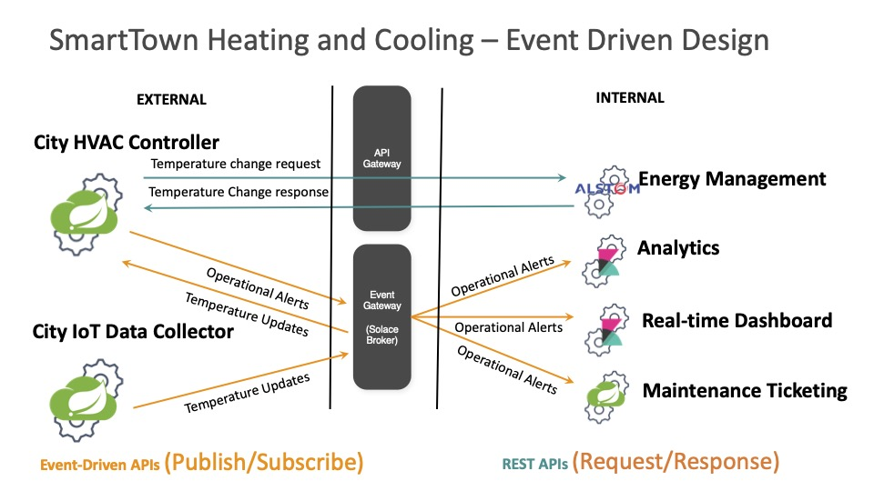


We will also

- Learn how to define asynchronous APIs.
- Use the AsyncAPI Generator template for Spring Cloud Stream.
- Develop event-driven microservices using Spring Cloud Stream and Java.
- Connect your microservices to PubSub+ Event Brokers and stream events across the globe

Prerequisites

- Intermediate level of knowledge coding with Java
- Computer with internet connectivity

## Requirements
Duration: 0:01:00

🛠 This page covers the setup needed to perform this codelab. 🛠

### Create a new PubSub+ Event Broker

✅ You need to sign for a free Solace Cloud Account using [this link](https://console.solace.cloud/login/new-account).

> aside positive
> Note that no credit card is required. You will receive an email to activate the account and will then be prompted to start the free trail.

Complete the following steps:

1. __Log into the PubSub+ Cloud Console__  To start using PubSub+ Cloud, log in to the PubSub+ Cloud Console. 
   For more information on accessing the Cloud Console, check out the [documentation](https://docs.solace.com/Solace-Cloud/ggs_login.htm)

2. __Create an Event Broker Service__ Create an event broker service (or simply a service) using Cluster Manager tool and name the service as `solace-eap`. 
   For more information on accessing the Cloud Console, check out the [documentation](https://docs.solace.com/Solace-Cloud/ggs_create_first_service.htm)

> aside negative
> Event Broker Service creation may take anywhere from 2 to 4 minutes to complete the process.

### Use an existing PubSub+ Event Broker

If you have a PubSub+ Cloud account and an existing Event Broker Service, you can use the existing Message VPN on the Broker Service for this codelab.

1. __Message VPN Name__ Make a note of the Message VPN name - you will be using this name wherever 'solace-eap' is referred as VPN name in this codelab.   

### AsyncAPI Generator Requirements

✅ Install instructions available [here](https://github.com/asyncapi/generator#requirements)

- Node.js v12.16+ (Check version using `node -v`)
- npm v6.13.7+ (Check version using `npm -version`)

### Spring Cloud Stream Requirements

✅ Spring Cloud Stream just requires Java and Maven to use 🚀

- Java 1.8+ (Check version using `java -version`)
- Maven 3.3+ (Check version using `mvn -version`)
  - On mac you can `brew install maven`
  - Other install instructions [here](https://maven.apache.org/install.html)
- Your favorite Java IDE 💥

## Clone Git Repository
Duration: 0:01:00

A ready to use code of few of the microservices referred in this workshop are available in Git. We will use this codebase and build new code wherever necessary to complete this workshop.

> aside positive
> Note: the completed solution is available n the `solution` branch

* Launch Terminal application 
* Execute the following command   
  `git clone https://github.com/gvensan/smarttown.git`

Below is the directory structure of the newly cloned **smarttown** folder
  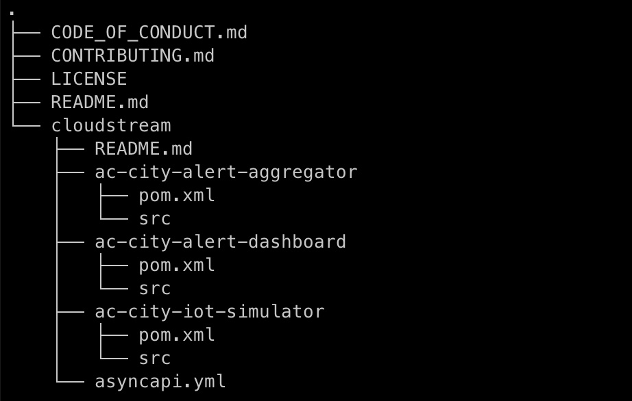

## Introduction to PubSub+ Event Portal
Duration: 0:02:00

### Solace PubSub+ Event Portal

The Solace [PubSub+ Event Portal](https://solace.com/blog/api-portal-for-events/) is a single place where architects and developers can collaboratively catalog, share, create and manage all the events, schemas and applications internal and external to the enterprise.

One of the features of the event portal is the **Catalog**, allowing users assess which events have high value over others to consumers (both internal and external). This information is used to build Event API Product.


With the PubSub+ Event Portal, you can:

- Define and model event-driven systems
- Visualize existing relationships
- Develop consistent event-driven applications
- Discover and share events of interest
- Govern the event-driven system
- Integrate with 3rd-party systems for programmatic interactions
- Manage and audit changes to events, schemas, and applications
- Runtime event discovery
- Understand statistics about events    

### Elements of PubSub+ Event Portal

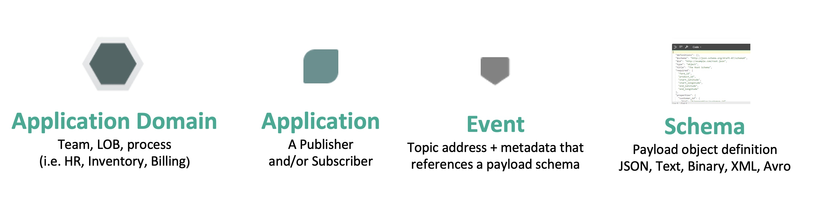

#### Application Domain
An application domain represents a namespace where applications, events, and schemas can live. 
* Application domains are useful to decompose the enterprise and create organizational boundaries within which teams can work
*  Within the application domain, you can create a suite of applications, events and schemas that are isolated from other application domains   
  
#### Application
An application represents a piece of software that produces and consumes events. 
* Applications connect to the event broker in an event-driven architecture and communicate with other applications via events. 
* A single application represents a class of applications that are running the same code base; therefore, there is no need to create multiple applications for each instance in a cluster.

#### Event
The event represents a business moment or an action that can be communicated with zero or more interested applications. 
* The event is where you define metadata that describes and categorizes the event. An event is produced on a specific topic that must be defined for that event
* From a modelling perspective, events reference payload schemas, and events are referenced by applications, thus forming the glue that binds applications together           

#### Schema
In simple terms, a schema represents the contract to describe the payload of an event. 
* Producers and consumers of an event can trust that the event's payload matches the schema definition assigned to that event
* Schemas define a type of payload through JSON, AVRO, XML, Binary, or Text. JSON, AVRO, and XML schemas have content that describes each property of the schema
* The content is either in JSON or AVRO Schema format, or XSD/DTD format        

## Introduction to Spring Cloud Stream
Duration: 0:03:00


Spring Cloud Stream is a framework for creating highly scalable, event-driven microservices connected by pluggable messaging services. Messaging services are pluggable via Binders that we'll cover in a bit. The framework is based on Spring Boot and Spring Integration.

Spring Cloud Stream has three different types of message exchange contracts:

1. **Suppliers** are sources of events
1. **Sinks** are consumers of events
1. **Processors** are both consumers and subscribers of events

### Spring Cloud Stream Components
Spring Cloud Stream introduces three main components that allow developers to utilize messaging in their code:

* __Binder__ - The component that implements communication with a specific message broker. For example, there is a RabbitMQ Binder, a Kafka Binder, and so on. Binders abstracts the messaging API
* __Binding__ - The interface for sending and receiving messages. This component links the abstract channels in your code with a topic or queue that’s handled by the binder.
* __Message__ - The data structure used to communicate with the bindings between your code and your message broker. How this data is packaged and communicated over the message broker is determined by the binder.

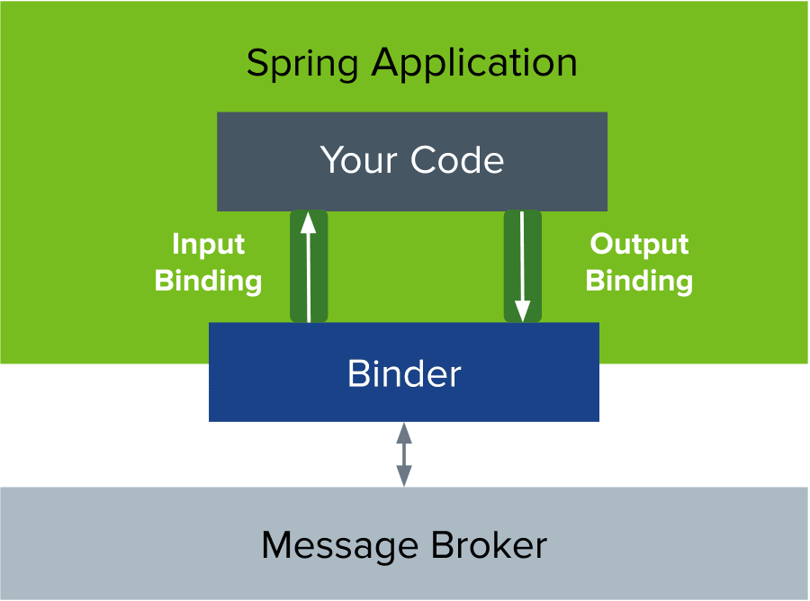

### Message Exchange Contracts Map to Java Functions

As of Spring Cloud Stream v3 the preferred programming model is to use Java Functions to implement your cloud stream apps.

We just mentioned the 3 types of Cloud Stream message exchange contract are "Sources", "Sinks" and "Processors".
Those map to functions as follows:

- `java.util.function.Supplier` -> Source [Producer/Publisher of Events]
- `java.util.function.Consumer` -> Sink [Subscriber/Consumer of Events]
- `java.util.function.Function` -> Processor [ Consumes, Processes, and Produces Events ]

### Binders

Spring Cloud Stream Binders are really what make the framework useful. Binders provide an abstraction layer between your code and the messaging systems over which events are flowing. This allows you to write your code without having to worry about learning messaging APIs! When messages are sent or received from the messaging system they pass through the messaging system specific binder which knows how to communicate with that specific message broker.

As of the creation of this codelab the available Cloud Stream Binders are:

- RabbitMQ
- Apache Kafka
- Amazon Kinesis
- Google PubSub
- Solace PubSub+
- Azure Event Hubs
- Apache RocketMQ

> aside positive
> We will be using the [Solace PubSub+ Binder](https://github.com/SolaceProducts/solace-spring-cloud/tree/master/solace-spring-cloud-starters/solace-spring-cloud-stream-starter) which supports publish subscribe and consumer groups.

### Communication Models

Instead of having to learn Messaging APIs, developers just have to understand the communication models that Spring Cloud Stream supports. There are 3 supported models, but support varies per binder.

1. Publish-subscribe: subscribers are independent from each other & receive events in order
1. Consumer groups: fan-out and load-balancing across multiple consumers
1. Stateful partitioning support: in-order processing for consistency and performance

### References:

- The Spring Cloud Stream [Reference Guide](https://cloud.spring.io/spring-cloud-static/spring-cloud-stream/current/reference/html/spring-cloud-stream.html#spring-cloud-stream-reference)
- Spring Sample [Github Repository](https://github.com/spring-cloud/spring-cloud-stream-samples)
- Solace Sample [Github Repository](https://github.com/SolaceSamples/solace-samples-spring)
- Solace Codelab - [Spring Cloud Stream - Basics](https://codelabs.solace.dev/codelabs/spring-cloud-stream-basics/)
- Solace Codelab - [Spring Cloud Stream - Beyond the Basics](https://codelabs.solace.dev/codelabs/spring-cloud-stream-beyond)
- Spring Cloud Stream Binder for Solace PubSub+ - [Spring Cloud Stream Binder for Solace PubSub+ ](https://github.com/SolaceProducts/solace-spring-cloud/tree/master/solace-spring-cloud-starters/solace-spring-cloud-stream-starter)

## Spring Cloud Stream - Solace API Connection
Duration: 0:03:00

Launch the Broker Service from PubSub+ Console and open the connection tab.

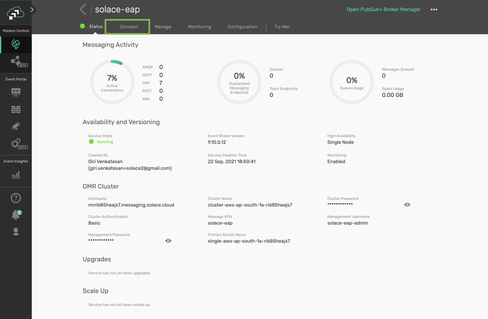

Click on __Get Started__ button next to the Spring Cloud Stream library

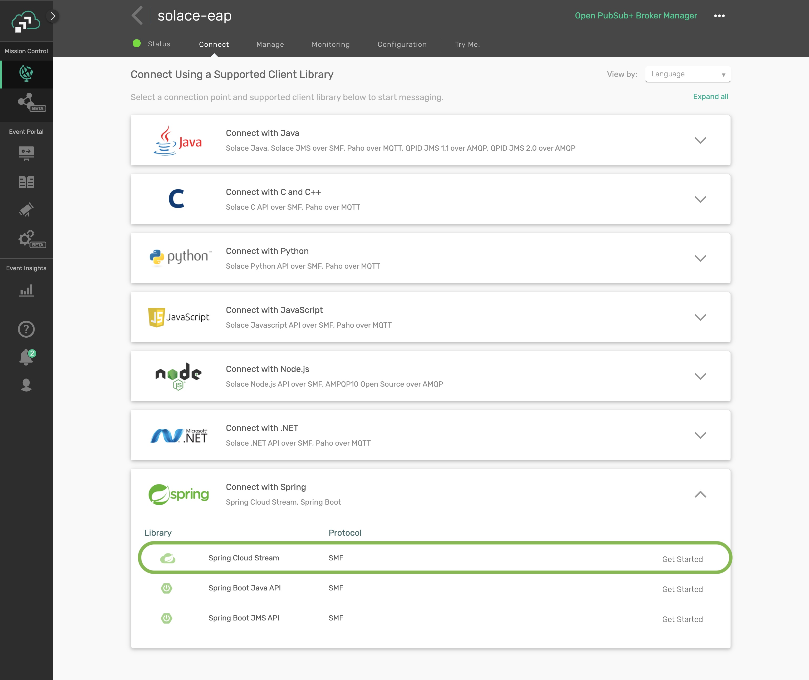

Make a note of the following parameters:
* __Host URI__ 
* __Username__
* __Password__
  
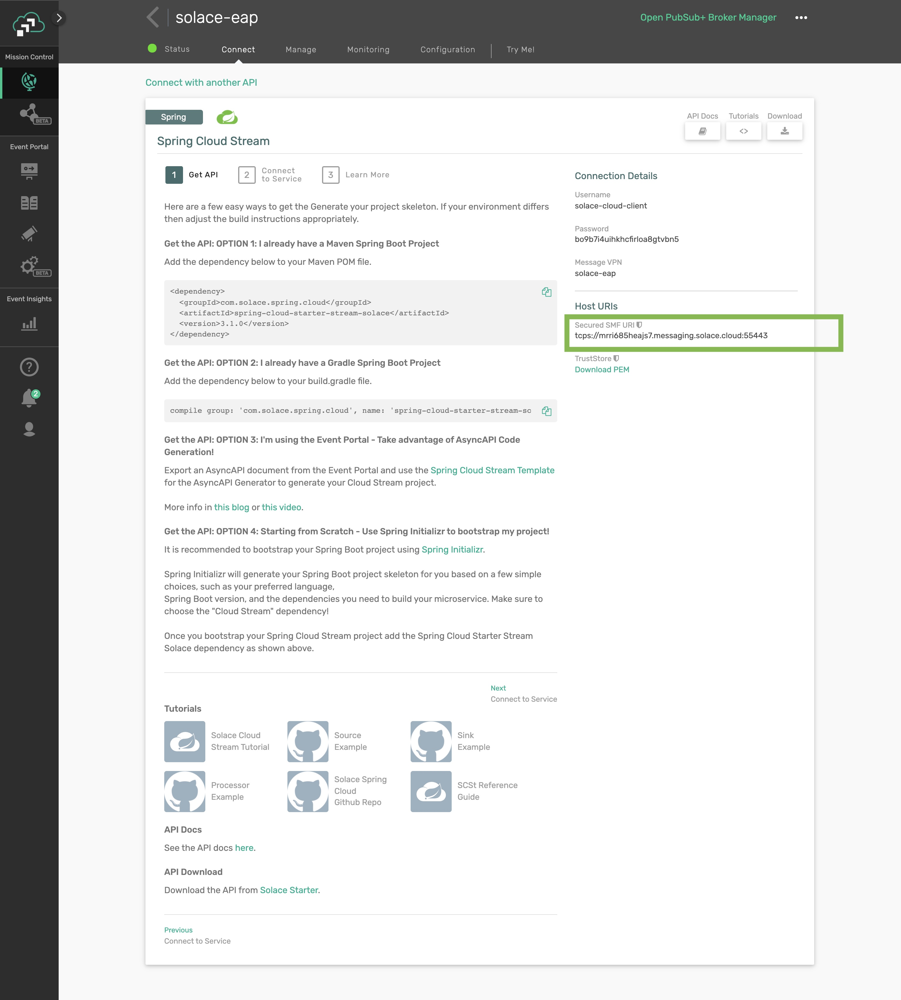


## SmartTown - Event-Driven Design
Duration: 0:03:00

SmartTown uses information and communication technology to improve operational efficiency, share information with the public and provide a better quality of government service and citizen welfare. SmartTown uses internal microservice architecture with functionality exposed through APIs and externally exposed API products while hiding the implementation details.


#### Application Domains

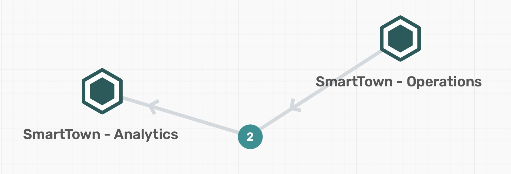

We will focus on the Analytics and Operations applications for this workshop.

#### Applications


#### Events

- **TemperatureReading** - An event generated by a Temperature Sensor (IoT Device) with temperature reading and a timestamp
- **OperationalAlert** - An event generated when the temperature is found to be out of bounds with an alert type and prioritization level.


> aside positive    
> Few pointers on the implementation of the microservices in this workshop
> * Temperature Sensor data generator
>  * A simulator program (microservice) will be used to generate temperature reading
>   * The simulation algorithm would use the current CPU load as a seed to generate temperature readings to cover wider temperature ranges
>   * CPU load shall be manipulated with the use of utilities like __stress_ or others to increase the CPU load, in turn increase the temperature readings
> * Alerts Generator
>   * With the intent to generate alerts with priority types as
>     * <= 60 - No alert required
>     * 60 < Temperature <= 70 - Low Priority Alert
>     * 70 < Temperature <= 80 - Medium Priority Alert
>     * Temperature > 80 - High Priority Alert
> * The scope of __Analytics__ in this workshop is limited to plotting the alert on a map. 

### References:

- [PubSub+ Event Portal - Overview](https://docs.solace.com/Solace-Cloud/Event-Portal/event-portal.htm)
- [PubSub+ Event Portal - Getting started](https://solace.com/resources/pubsub-event-portal/eventportal-get-started-demo-video)
- [PubSub+ Event Portal - Resources](https://solace.com/resources/pubsub-event-portal)

## Import Application Domain
Duration: 0:03:00

We will create an event-driven design for SmartTown functions in the Event Portal using the PubSub+ Designer. To begin with, we will import an application domain export file that contains required event, schema and application domain definitions - we just need to create application and tie the event with those applications.

✅ Launch Solace PubSub+ Event Portal and open the Designer
- Click on __Import__ button next to ___Application Domain File___ or right-click on the canvas and choose __Import Application Domain__ option.

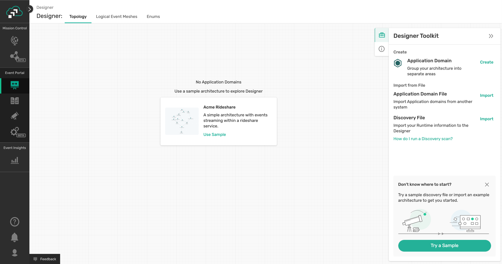

✅ On the file open dialog, choose the file ___asyncapi-designer-topology.json___ in __cloudstream__ folder of the cloned repository folder.

This import action would create

* Application domains   
  * SmartTown - Operations
  * SmartTown - Analytics
* Events
  * TemperatureReading with a topic address of `SmartTown/Operations/temperatureReading/created/v1/{city}/{latitude}/{longitude}`
  * OperationalAlert with a topic address of `SmartTown/Operations/OperationalAlert/created/v1/{AlertPriority}/{AlertType}`
* Schemas
  * TemperatureReading
  * OperationalAlert

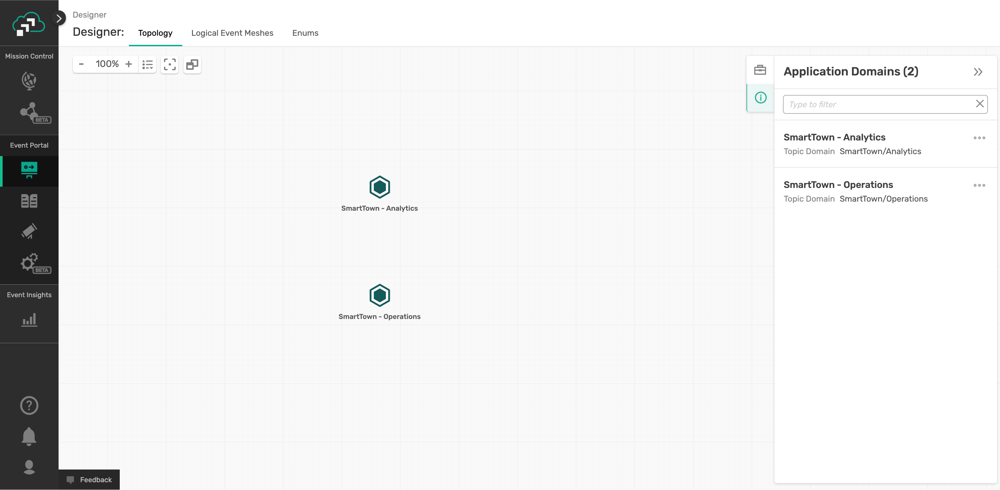

> aside positive
> Note that the design is still missing applications and the application-event pub/sub association, which we will be defining in the next steps.

✅ Review the elements under each of the Application Domains to get an understanding of what is created by the import and their association.  
## Create Application
Duration: 0:04:00

Let's create the Temperature Sensors and the Eternal Heating/Cooling Controllers Applications. To do so:

✅ Navigate to the ___SmartTown - Operations___ Application Domain 
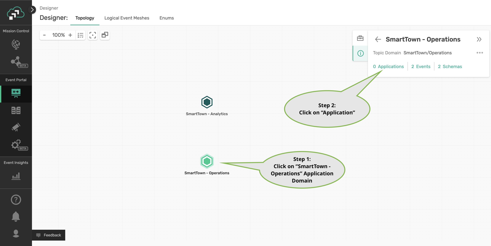

✅ Click on create application option

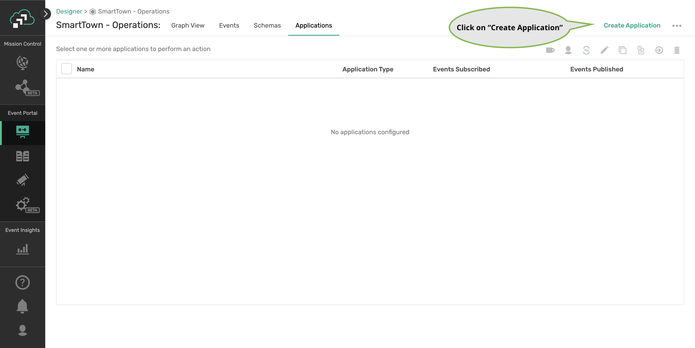

### 1️⃣ Temperature Sensors	Application

The following section describes how to create an application and set its attributes - name, application type and event association.

In the Create Application page:
- Enter __Temperature Sensors__ for ___Name___
- Choose ___Standard___ as selected option for __Application Type__


✅ Click on ___Manage___ events page

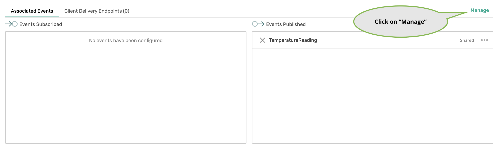

In the Manage Events page:
- Identify the Events relevant to the application
- Click on the **Pub** icon on the **TemperatureReading** Event indicating the event relationship with the application

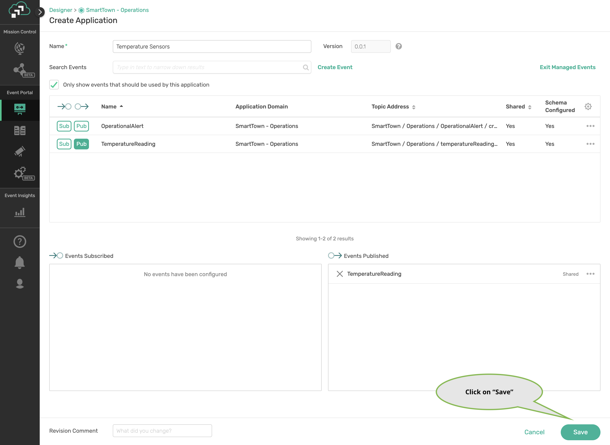

### 2️⃣ External Heating/Cooling Controllers Application

In the Create Application page:
- Enter __Heating Cooling Controllers - EXTERNAL__ for ___Name___
- Choose ___Standard___ as selected option for __Application Type__

✅ Launch ___Manage___ events page and set Publish/Subscribe permissions on Events

In the Manage Events page:
- Identify the Events relevant to the application
- Click on the __Sub__ icon for the **TemperatureReading** Event 
- Click on the __Pub__ icon for the **Operational Alert** Event 
- Click on __Save__ button

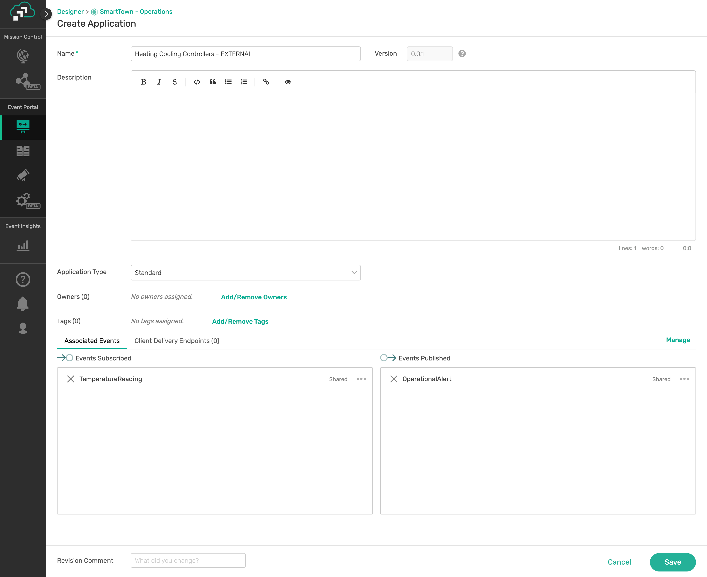

### Applications List

When  you click on the Application List tab you will see the following

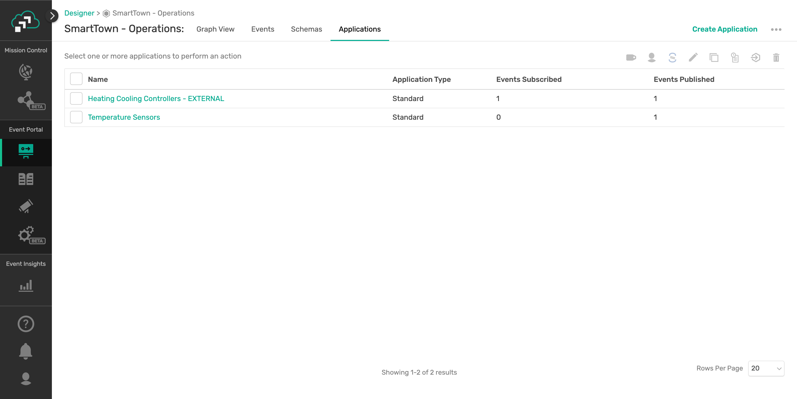

## Introduction to AsyncAPI
Duration: 0:03:00

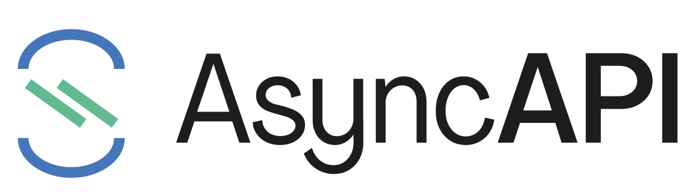

AsyncAPI has emerged as the industry standard for defining asynchronous, event-driven APIs; you can think of it as OpenAPI for the asynchronous world.    

It is an open source initiative that provides both 
* a specification to describe and document your asynchronous applications in a machine-readable format, and 
* tooling (such as code generators) to make life easier for developers tasked with implementing them.   

### AsyncAPI Document

An AsyncAPI document that defines the application that you want to develop. This document can be represented as JSON objects conforming to the JSON standards, or an YAML file. You can either manually create the document or use an event portal.

The AsyncAPI initiative provides a handy, interactive tool called the [AsyncAPI playground](https://playground.asyncapi.io) to make the document creation easier. 


Alternatively you can generate this document from EDA tools such as [Event Portal](https://solace.com/products/portal/) of Solace PubSub+ platform. Typically they are design-time tools allowing architects and developers to collaborate using a GUI to design the event-driven architecture. 

Having a catalog of well-organized channels and events for reuse will also save you both time and headaches while collaborating, instead of having to comb through a bunch of files in various locations.

### AsyncAPI Generator

AsyncAPI Generator is a tool that can generate a skeleton code from the AsyncAPI document, reducing the need to laboriously create boilerplate code saving time and effort.

The AsyncAPI Code Generator supports templates to generate code for a variety of different languages and protocols (nodejs, python, go), but for this workshop we’re going to use the [Spring Cloud Stream template](https://github.com/asyncapi/java-spring-cloud-stream-template).

The Spring Cloud Stream framework provides an easy way to get started with event-driven microservices by providing binders that allow the developer to create their microservices without having to learn messaging APIs.

```
Example:

ag ~/AsyncApiDocument.yaml https://github.com/asyncapi/java-spring-cloud-stream-template.git
```

### Coding Business Logic

The generated spring project is a regular Spring Boot application and contains:
* Generated classes under javaPackage, including POJOs defined from the schemas in the AsyncAPI document 
* _application.yml_ containing Spring Cloud Stream configuration and binding details
* _Application.java_ containing implementation of one or more Spring Cloud Stream Functions interfaces asper the AsyncAPI specification
  * A Supplier function that implements delivery of messages to the channel 
  * A Producer function that handles messages delivered on the channels
  * A Function implementation that processes a delivered message and returns a response message       

### AsyncAPI in Event Portal

PubSub+ Event Portal makes adopting and using AsyncAPI simple:
* __Faster__: you don’t have to edit asyncapi specs by hand
* __Ensure Consistency__: changes to events and schemas up stream can easily be exported
* __Flexible__: Export Event API Products for interested developer and/or model your application interface and export it

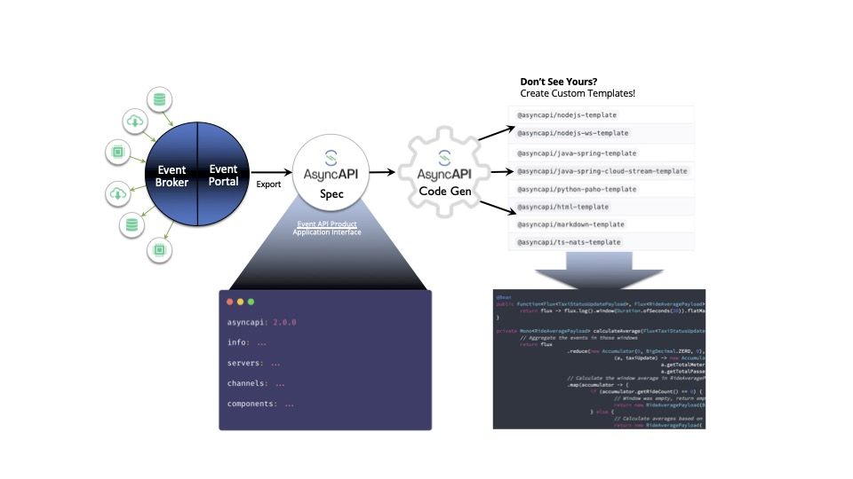


# References:
- [AsyncAPI Specification](https://www.asyncapi.com/docs/specifications/v2.2.0)
- [AsyncAPI Code Generator](https://www.asyncapi.com/generator)
- [AsyncAPI Code Generator - GitHub](https://github.com/asyncapi/generator#update-the-cli)
- [AsyncAPI vs OpenAPI](https://solace.com/blog/asyncapi-vs-openapi/)
- [AsyncAPI Code Generation: Microservices Using Spring Cloud Stream](https://solace.com/blog/asyncapi-codegen-microservices-using-spring-cloud-stream/)


## Event API Product
Duration: 0:02:00

An Event API Product can be composed of events from either Solace PubSub+ Event Broker or Kafka for external developers' consumption, enabling them to build event-driven applications that can subscribe to and/or publish the specified events.

The events bundled in an Event API Product can be added from one or more application domains, so you can mix and match events. Event API is all about identifying and bundling high-value events for external consumption similar to REST APIs. 

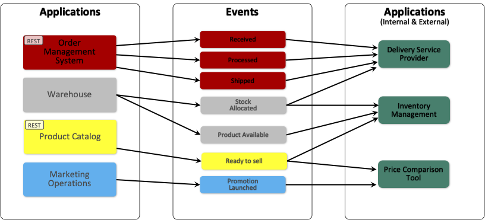

When it comes to value and exposure, Event-driven applications can combine the classic system and business events to create a bundle as a specification without exposing any of the internal or implementation details. Solace PubSub+ uses AsyncAPI as the standard for API specification for exposing such Event API bundles. Consuming applications also benefits from AsyncAPI's code-generation facility to focus just on the business logic and not the mundane tasks.

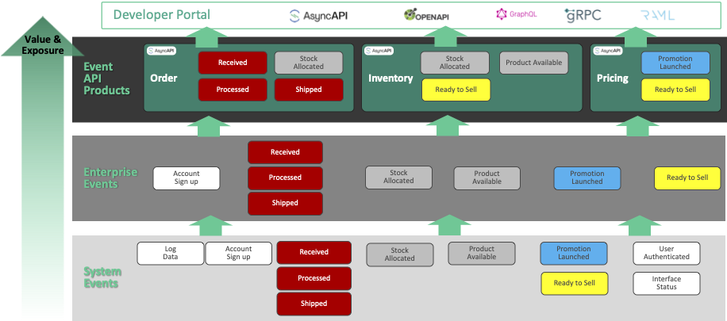


### References:

- Getting started with PubSub+ Cloud [Documentation](https://docs.solace.com/Solace-Cloud/ggs_signup.htm)
- Event API Products [Documentation](https://docs.solace.com/Solace-Cloud/Event-Portal/event-api-products.htm)
- Understanding the Concept of an Event Portal - An API Portal for Events [Blog](hthttps://solace.com/blog/api-portal-for-events/)

## Create Event API Product
Duration: 0:04:00

Next step in building an Event API product involves bundling of high-value, share-worthy events. The resulting bundle is released as a specification for public consumption. The generated specification is based on a commonly understood standard - like AsyncAPI. 

AsyncAPI also provides tools to generate code (supports popular languages) helping consumers directly go from spec-to-code, leaving the only responsibility of updating the business logic.

✅ Launch API Products

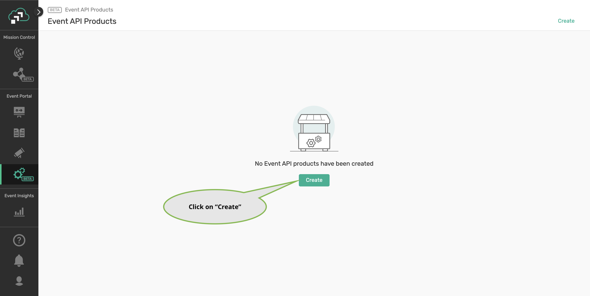

### Create EventAPI Product

✅ Configure the API Product settings

In the Create Event API Product page:
- Enter __HVAC  Controller__ for ___Name___
- Choose __LogicalEventMesh__ for ___Logical Event Mesh___
- Enter __localhost:55555__ for ___Server URL___
- Enter __smf__ for ___Server Protocol___

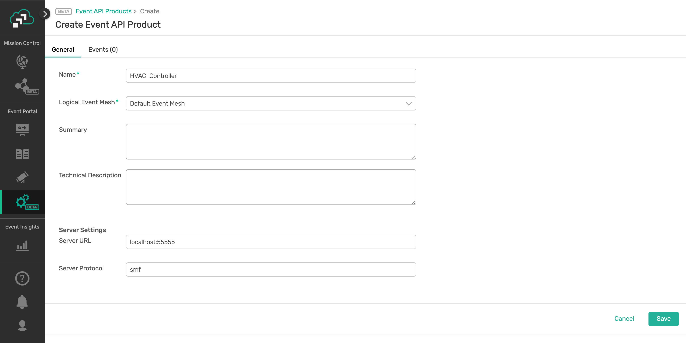


> aside negative
> Do not yet click on __Save__ button! We will configure the Events and then save.


✅ Navigate to the Events tab to configure Event settings

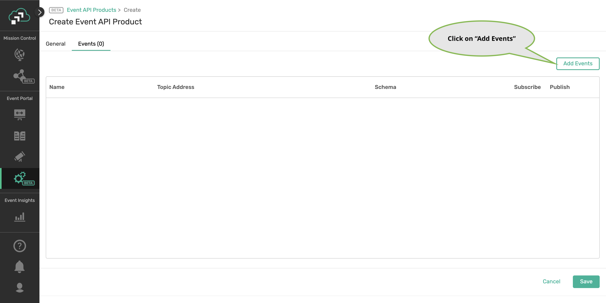

- Click on the __Add Events__ button

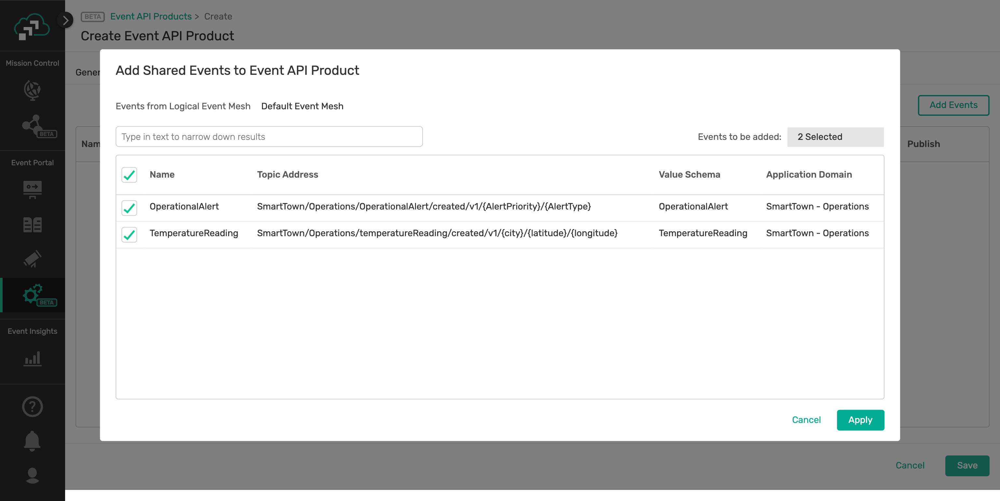

- Select __TemperatureReading__ and __OperationalAlert__ events
- Click on the __Apply__ button

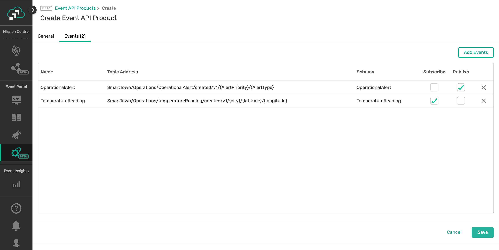

- Mark __TemperatureReading__ with ___Subscribe___ property 
- Mark __OperationalAlert__ with ___Publish___ property
- Click on the __Save__ button

✅ Event API Product list 

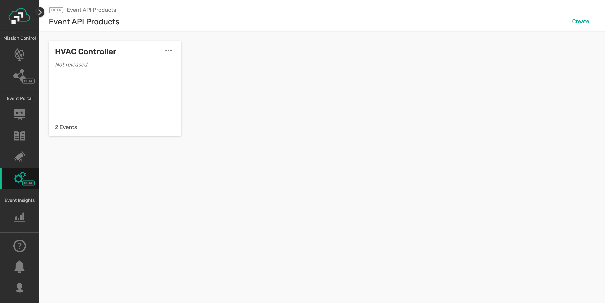

✅ Click on the __HVAC Controller__ Event API product Details 

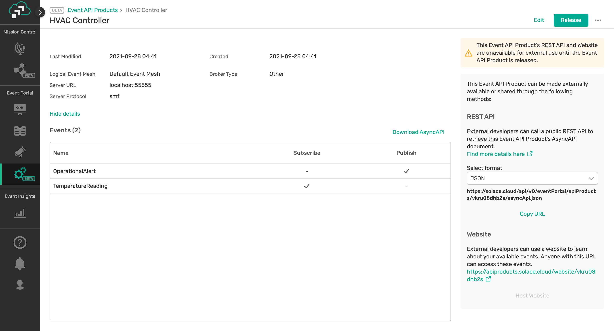

A newly created Event API Product can be made externally available or shared through the following methods:
- REST API
External developers can call a public REST API to retrieve this Event API Product's AsyncAPI document.
- Website
External developers can use a website to learn about your available events. Anyone with this URL can access these events.

> aside negative
> This Event API Product’s REST API URL and Website are unavailable for external use until the Event API Product is released 

These URLs are available only when the API Product is marked as __Released__. To release the API Product, click on the __Release__ button at the top right.

More info about the API release and website hosting:

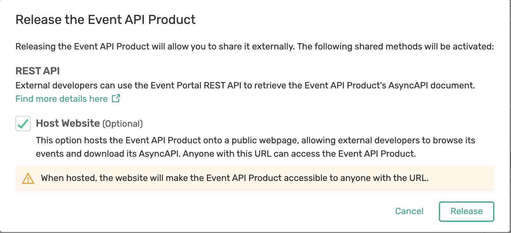

> aside positive
> Do check the __Host Website__ option to ensure that the hosted URL is publicly available. 

With this, the Event API Product named __HVAC Controller__ is ready and published for access on public URLs.

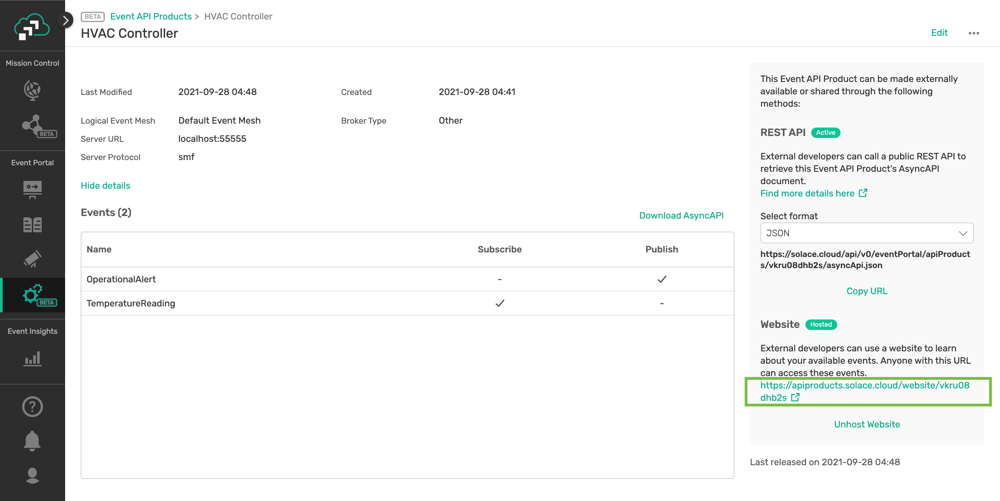

#### Exposed AsyncAPI URL


Interested parties can download the AsyncAPI specification from this public URL and build applications with minimal code using AsyncAPI codegen tools.

## Download AsyncAPI Document
Duration: 0:02:00

###Review API Product URL

You can locate the website URL where the EventAPI Product is hosted from the Event API Product settings. 


✅ Open the website URL in the browser (click on the link)


You can click on the __Download YAML__ button and download the document from this portal. Let's move it to the `cloudstream` directory in the previously cloned github repo. 

Navigate to the `smarttown/cloudstream` directory and run the following command on a terminal window
```
mv ~/Downloads/asyncapi.yaml .
```

## Create IoT Data Simulator MicroService
Duration: 0:08:00

The directory __github/cloudstream/ac-city-iot-simulator__ contains a prebuilt spring cloud stream project that can readily publish temperature reading data. You just have to update the application.yml configuration with host details.

Import the projects under __github/cloudstream/__ directory.

###Launch Spring Tool Suite

* Open Spring Cloud Suite tool by clicking on the icon in the desktop
* Import cloud stream projects from the smarttown folder as 'Existing maven projects' 
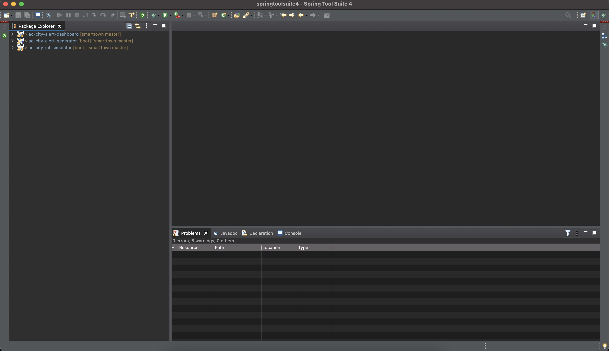

###Review the ac-city-iot-simulator project

####TemperatureReading.java

✅ Review the TemperatureReading.java file. It carries temperature reading data - a simple POJO with attributes and corresponding getters/setters.

####Application.java

✅ Review the Application.java, specifically the Supplier function.

```
  @Bean
  Supplier<Message<TemperatureReading>> publishTemperatureData()  {
    // Collect CPU metrics 
    return () -> {
      SystemInfo si = new SystemInfo();
      HardwareAbstractionLayer hal = si.getHardware();
      CentralProcessor processor = hal.getProcessor();
        
      double[] loadAverage = processor.getSystemLoadAverage(1);
          
      BigDecimal cpuLoad = new BigDecimal((loadAverage[0] < 0 ? 0 : loadAverage[0]));
      BigDecimal cpuTemp = new BigDecimal(50.0 + cpuLoad.doubleValue() * 8.0);
        
      // Construct the topic name with alert type and priority as per the Topic hierarchy design
      // SmartTown/Operations/temperatureReading/created/v1/{city}/{latitude}/{longitude}
      String topic = "SmartTown/Operations/temperatureReading/created/v1/" + city + "/" + latitude + "/" + longitude;	        			
      TemperatureReading data = new TemperatureReading(cpuLoad, city, latitude, longitude, cpuTemp);

      logger.info(data.toString());	

      // Set the target destination as the constructed topic name
      return MessageBuilder.withPayload(data)
                .setHeader(BinderHeaders.TARGET_DESTINATION, topic)
                .build();		
    };
  }	

```

✅ The Supplier function is a Cloud Stream message exchange contract that publishes an event to configured Event Broker.

✅ Notice the topic name construction:     

__SmartTown/Operations/temperatureReading/created/v1/{city}/{latitude}/{longitude}__

The values for variables _city, latitude_ and _longitude_ are read from the configuration file via @Value annotation.

```
    @Value("${application.latitude}")
    public BigDecimal latitude;
    @Value("${application.longitude}")
    public BigDecimal longitude;
    @Value("${application.city}")
    public String city;

```

The topic name is dynamically constructed by concatenating the root topic name and dynamic values picked up from the application configuration. 

✅ The return value from the _Supplier_ function is a Spring Cloud Stream _Message_ that is set with destination as the dynamic topic and published to the Broker.

✅ The temperature simulation is closely tied to CPU load on the machine, which can be manipulated using _stress_ system utility. The simulation logic is built to generate a temperature value as a multiple of CPU load.

> aside positive
> _stress_ utility is used to dynamically increase the CPU load, which in turn affects the simulation to produce higher temperature readings.

####application.yml

✅ Review the application.yml

```
server.port: 8082
application:
  city: New York City      
  latitude: 40.713050       
  longitude: -74.007230      
spring:
  cloud:
    function:
      definition: publishTemperatureData
    stream:
      bindings:
        publishTemperatureData-out-0:
          destination: SmartTown/Operations/temperatureReading/created/v1/*/*/*
      binders:
        solace-binder:
          type: solace
          environment:
            solace:
              java:
                host: tcps://<your_host>.messaging.solace.cloud:55443  
                msgVpn: <your_msgVPN>
                clientUsername: solace-cloud-client
                clientPassword: <your_password>
logging:
  level:
    root: info
    org:
      springframework: info      
```

> aside positive
> Update the __host__, __msgVpn__, __clientUsername__ and __clientPassword__ parameters with the Host URI, Message VPN, Client Username and Password noted before to connect with your Broker using Spring Cloud Stream client library.

Affect the following changes on the application configuration file:

1. Goto [Latlang.net](https://www.latlong.net) and enter your city name to get latitude and longitude values
2. In the yml file
   * Update your city name
   * Update latitude
   * Update longitude
3. Save the file

####Running IoT Data Simulation

✅ Open a terminal, change directory to ac-city-iot-simulator project and run the following maven command.
```
cd ~/github/smarttown/cloudstream/ac-city-iot-simulator
mvn clean spring-boot:run
```
Alternatively, you can also run `./mvnw clean spring-boot:run`


This should run the simulator microservice and publish temperature reading events to the Event Broker.

```
mvn clean 
mvn spring-boot:run
................................
2021-09-30 18:04:59.401  INFO 5981 --- [   scheduling-1] c.e.s.a.datacollector.Application        :
TemperatureReading [mCpuLoad=6.7255859375, mCity=New York City, mLatitude=40.71305, mLongitude=-74.00723, mCpuTemp=103.8046875]
2021-09-30 18:05:00.409  INFO 5981 --- [   scheduling-1] c.e.s.a.datacollector.Application        :
TemperatureReading [mCpuLoad=6.7255859375, mCity=New York City, mLatitude=40.71305, mLongitude=-74.00723, mCpuTemp=103.8046875]
2021-09-30 18:05:01.416  INFO 5981 --- [   scheduling-1] c.e.s.a.datacollector.Application        :
TemperatureReading [mCpuLoad=6.7255859375, mCity=New York City, mLatitude=40.71305, mLongitude=-74.00723, mCpuTemp=103.8046875]
2021-09-30 18:05:02.423  INFO 5981 --- [   scheduling-1] c.e.s.a.datacollector.Application        :
TemperatureReading [mCpuLoad=6.7255859375, mCity=New York City, mLatitude=40.71305, mLongitude=-74.00723, mCpuTemp=103.8046875]
2021-09-30 18:05:03.428  INFO 5981 --- [   scheduling-1] c.e.s.a.datacollector.Application        :
TemperatureReading [mCpuLoad=6.26708984375, mCity=New York City, mLatitude=40.71305, mLongitude=-74.00723, mCpuTemp=100.13671875]
2021-09-30 18:05:04.432  INFO 5981 --- [   scheduling-1] c.e.s.a.datacollector.Application        :
TemperatureReading [mCpuLoad=6.26708984375, mCity=New York City, mLatitude=40.71305, mLongitude=-74.00723, mCpuTemp=100.13671875]
2021-09-30 18:05:05.435  INFO 5981 --- [   scheduling-1] c.e.s.a.datacollector.Application        :
................................
```

## Create Alert Generator Microservice
Duration: 0:08:00

Before we proceed, we have to make minor changes to the AsyncAPI yml file. The yml file is located under __~/github/smarttown/cloudstream/__ directory (the last step in ___Download AsyncAPI Document___).

✅ Make the following updates to the asyncapi.yaml file

Let's add a few of the template's configuration options to the download AsyncAPI document.

Add `x-scs-function-name: processTemperatureReading` under the `subscribe` operation and the `publish` operation under the two channels. By adding this you are telling the generator the name of the function you would like to handle events being exchanged and by adding the same function-name for both the subscribe and the publish operation you are saying you want them handled by the same function!

a) After 
```
channels:
  SmartTown/Operations/OperationalAlert/created/v1/{AlertPriority}/{AlertType}:
    subscribe:
```

b) And after  
```
  SmartTown/Operations/temperatureReading/created/v1/{city}/{latitude}/{longitude}:
    publish:
```

> aside negative
> Careful not to mess up the indentation in your YAML file!

With this change, the channels section of the YAML file will look like this
```
channels:
  SmartTown/Operations/OperationalAlert/created/v1/{AlertPriority}/{AlertType}:
    subscribe:
      x-scs-function-name: processTemperatureReading
      message:
        $ref: "#/components/messages/OperationalAlert"
    parameters:
      AlertType:
        schema:
          type: "string"
      AlertPriority:
        schema:
          type: "string"
  SmartTown/Operations/temperatureReading/created/v1/{city}/{latitude}/{longitude}:
    publish:
      x-scs-function-name: processTemperatureReading
      message:
        $ref: "#/components/messages/TemperatureReading"
    parameters:
      city:
        schema:
          type: "string"
      latitude:
        schema:
          type: "string"
      longitude:
        schema:
          type: "string"
```

Under the `info` section at the bottom of the yml file, remove the `x-view: "provider"`.  
```
info:
  x-generated-time: "2021-09-30 13:15 UTC"
  description: ""
  title: "HVAC Controller"
  x-view: "provider"
  version: "1"
```
With this change, info section of the YAML file will look like this

```
info:
  x-generated-time: "2021-09-30 13:15 UTC"
  description: ""
  title: "HVAC Controller"
  version: "1"
```

✅ Save the asyncapi.yaml file

We will be building this microservice using AsyncAPI Generator tool from the AsyncAPI document hosted by the PubSub+ Event Portal.

> aside positive
> A file with required changes is made available in the folder by name __asyncapi-reference.yml__ for your reference.      

###Generate code using AsyncAPI Code Generator

✅ Change directory to cloudstream and run the following command

```
cd ~/github/smarttown/cloudstream
```

Run the following command to invoke AsyncAPI code generator utility.

> aside negative
> Be sure to update the host URI in the __-p host__, __-p username__, __-p password__, and __-p msgVpn__ parameters with the parameters noted from the Spring Cloud Stream connection settings in the previous section.     

``` 
ag -o ac-city-alert-generator -p view=provider -p binder=solace -p dynamicType=header -p artifactId=ac-city-alert-generator  -p groupId=com.eap -p javaPackage=com.eap.scs.asyncapi.alertgenerator -p host=tcps://your_host_name.messaging.solace.cloud:55443 -p username=username -p password=password -p msgVpn=msgVPN asyncapi.yaml @asyncapi/java-spring-cloud-stream-template --force-write
```

This command will take some time (minute or so) and complete with the following message.

```
Done! ✨
Check out your shiny new generated files at /home/ubuntu/github/smarttown/cloudstream/ac-city-alert-generator.
```
###Open Spring Tool Suite

* Open Spring Cloud Suite tool by clicking on the icon in the desktop (if not open already)
* Import cloud stream projects from the smarttown folder as 'Existing maven projects' and choose smarttown/cloudstream folder.
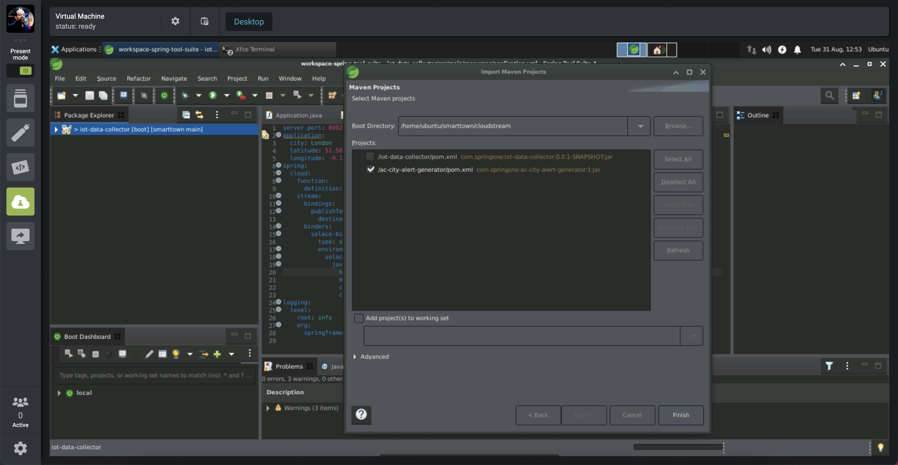

####TemperatureReading.java

✅ Review the TemperatureReading.java file. It carries temperature reading data - a simple POJO with attributes and corresponding getters/setters. 

It is same as the TemperatureReading POJO present in the ac-city-iot-simulator microservice.

####OperationalAlert.java

✅ Review the OperationalAlert.java file. It carries operational alert data - a simple POJO with attributes and corresponding getters/setters. 

####Application.java

✅ Review the Application.java, specifically the Supplier function.

Let us review the Function
```
@Bean
  public Function<TemperatureReading, Message<OperationalAlert>> processTemperatureReading() {
    return data -> {
      // Add business logic here.
      logger.info(data.toString());
      String alertType = "string";
      String alertPriority = "string";
      String topic = String.format("SmartTown/Operations/OperationalAlert/created/v1/%s/%s",
        alertType, alertPriority);
      OperationalAlert payload = new OperationalAlert();
      Message message = MessageBuilder
        .withPayload(payload)
        .setHeader(BinderHeaders.TARGET_DESTINATION, topic)
        .build();

      return message;
    };
  }
```

This Spring Cloud Stream _Function_ contract is a processor that subscribes to __TemperatureReading__ message, and publishes a __OperationalAlert__ message. 

The business logic of what transpires in this function is something we will be coding here. Our goal is to generate Alerts of HighTemperature type with three distinct priority levels:
* **LOW**: When temperature > 60 and <= 70
* **MEDIUM**: When temperature > 70 and <= 80
* **HIGH**: When temperature > 80

With the updated logic, the Function contract will be
```
@Bean
public Function<TemperatureReading, Message<OperationalAlert>> processTemperatureReading() {
  return data -> {
    // NOTE: A return value of null indicates that no message will be published to the Broker 
    if (data.getMCpuTemp().doubleValue() <= 60)
      return null;
    
    // Since the goal is to generate temperature alerts, set the alertType to a 
    // default value of 'HighTemperature' 
    String alertType = "HighTemperature"; // HighCpuLoad
    
    // Based on the defined bounds for Low, Medium and High temperature,
    // check the incoming temperature reading and set the alert priority appropriately
    String alertPriority = "High";
    if (data.getMCpuTemp().doubleValue() > 60 && data.getMCpuTemp().doubleValue() <= 70)
      alertPriority = "Low";
    else if (data.getMCpuTemp().doubleValue() > 70 && data.getMCpuTemp().doubleValue() <= 80)
      alertPriority = "Medium";
    
    // Construct the topic name with alert type and priority as per the Topic hierarchy design
    //		SmartTown/Operations/OperationalAlert/created/v1/{AlertPriority}/{AlertType}
    String topic = String.format("SmartTown/Operations/OperationalAlert/created/v1/%s/%s",
      alertType, alertPriority);
    
    // Construct an OperatinalAlert object 
    OperationalAlert payload = new OperationalAlert(alertPriority, alertType, data.getMCity(), data.getMCpuTemp(), 
                            data.getMLatitude(), data.getMLongitude());
    
    logger.info("Operational Alert: \n" + payload.toString());
    

    // Add OperationalAlert as type parameter to Message declaration (AsyncAPI codegen will fix this soon)
    Message<OperationalAlert> message = MessageBuilder
      .withPayload(payload)
      .setHeader(BinderHeaders.TARGET_DESTINATION, topic)
      .build();

    return message;
  };
}
```

There could be other internal services like monitor and external applications like analytics, dashboard could subscribe to this Alert event.

✅ Notice the topic name construction:     

__SmartTown/Operations/OperationalAlert/created/v1/{AlertPriority}/{AlertType}__

The topic name is dynamically constructed by concatenating the root topic name and computed values for _AlertPriority_, and _AlertType_ . 

✅ The return value from the _Function_ function is a Spring Cloud Stream _Message_ that is set with destination as the dynamic topic and published to the Broker.

✅ The temperature simulation is closely tied to CPU load on the machine, which can be manipulated using _stress_ system utility. The simulation logic is built to generate a temperature value as a multiple of CPU load.

####application.yml

> aside positive
> 1. Before you proceed, make sure that you have received connection details for the Solace PubSub+ Event Broker from the instructor and keep it handy.
>
> 2. Note the City name you used in the ac-city-iot-simulator microservice, as you would want to use the same city name to subscribe to TemperatureReading events. Otherwise, this microservice will end up receiving TemperatureReading events from all cities.


✅ Review the application.yml

```
spring:
  cloud:
    function:
      definition: processTemperatureReading
    stream:
      bindings:
        processTemperatureReading-out-0:
          destination: 'SmartTown/Operations/OperationalAlert/created/v1/{AlertPriority}/{AlertType}'
        processTemperatureReading-in-0:
          destination: SmartTown/Operations/temperatureReading/created/v1/*/*/*
      binders:
        solace-binder:
          type: solace
          environment:
            solace:
              java:
                host: 'tcps://mrm28q29kuoha.messaging.solace.cloud:55443'
                msgVpn: sprint-eap
                clientUsername: solace-cloud-client
                clientPassword: <your_password>
logging:
  level:
    root: info
    org:
      springframework: info

```
> aside positive
> Update the __host__, __msgVpn__, __clientUsername__ and __clientPassword__ parameters with the Host URI, Message VPN, Client Username and Password noted before to connect with your Broker using Spring Cloud Stream client library.

####Running Alert Generator

✅ Open a terminal, change directory to ac-city-alert-generator project and run the following maven command.
```
cd ~/github/smarttown/cloudstream/ac-city-alert-generator
mvn clean spring-boot:run
```
This should run the alert generator microservice that subscribes to temperature reading event and publishes appropriate operational alert  events to the Event Broker.


```
mvn clean 
mvn spring-boot:run
................................
OperationalAlert [ severity: High alertType: HighTemperature city: New York City temperature: 80.25 lat: 40.71305 _long: -74.00723 ]
2021-10-04 06:03:20.852  INFO 45472 --- [pool-4-thread-1] c.e.s.a.alertgenerator.Application       : Operational Alert:
OperationalAlert [ severity: High alertType: HighTemperature city: New York City temperature: 80.25 lat: 40.71305 _long: -74.00723 ]
2021-10-04 06:03:21.862  INFO 45472 --- [pool-4-thread-1] c.e.s.a.alertgenerator.Application       : Operational Alert:
OperationalAlert [ severity: High alertType: HighTemperature city: New York City temperature: 80.25 lat: 40.71305 _long: -74.00723 ]
2021-10-04 06:03:22.859  INFO 45472 --- [pool-4-thread-1] c.e.s.a.alertgenerator.Application       : Operational Alert:
OperationalAlert [ severity: High alertType: HighTemperature city: New York City temperature: 80.25 lat: 40.71305 _long: -74.00723 ]
2021-10-04 06:03:23.860  INFO 45472 --- [pool-4-thread-1] c.e.s.a.alertgenerator.Application       : Operational Alert:
OperationalAlert [ severity: High alertType: HighTemperature city: New York City temperature: 81.66796875 lat: 40.71305 _long: -74.00723 ]
2021-10-04 06:03:24.867  INFO 45472 --- [pool-4-thread-1] c.e.s.a.alertgenerator.Application       : Operational Alert:
OperationalAlert [ severity: High alertType: HighTemperature city: New York City temperature: 81.66796875 lat: 40.71305 _long: -74.00723 ]
................................
```

## Simulate Temperature Variation
Duration: 0:05:00


#### Running IoT Data Simulation

✅ Open a terminal, change directory to ac-city-iot-simulator project and run the following maven command.
```
cd ~/github/smarttown/cloudstream/ac-city-iot-simulator
mvn clean spring-boot:run
```
This should run the simulator microservice and publish temperature reading events to the Event Broker.

####Running Alert Generator

✅ Open a terminal, change directory to ac-city-alert-generator project and run the following maven command.
```
cd ~/github/smarttown/cloudstream/ac-city-iot-generator
mvn clean spring-boot:run
```

This should run the alert generator microservice that subscribes to temperature reading event and publish appropriate operational alert  events to the Event Broker.

This should run the simulator microservice and publish temperature reading events to the Event Broker.

####Simulating CPU load to generate 

✅ Open a terminal, change directory to ac-city-alert-generator project and run the following maven command.

> aside positive
> _stress_ utility is used to dynamically increase the CPU load, which in turn affects the simulation to produce higher temperature readings.     

To run the stress command, type:    

```
stress -c 6 -t 180  -v    
```

__Hint:__ Simulate load on CPU with 6 worker threads and exit after 180 seconds.   

This will simulate load on the VM and till timeout after 180 seconds. As the CPU load varies, it gets translated to temperature variation in the Alert Generator microservice and the readings gets tagged as Low, Medium or High severity appropriately.     

Observe that the alerts generated are qualified with Low, High and Medium severity types appropriately as the CPU Load varies.
## Alert Aggregator (optional)
Duration: 0:08:00

We will extend the workshop to generate an aggregated alert (over a period/duration of 30 seconds) with average temperature and alert nature. In turn these aggregated alerts will be subscribed by a web application using MQTT client in Javascript and plots geo-location markers on Google Maps. 

To accomplish that, we would extend the EDA design:
* Create a Schema `AggregateAlert`
* Create a Event `AggregateAlert`
* Create Application `Heating Cooling Controllers - DASHBOARD` 

### 1️⃣ Schema: - ___AggregateAlert___ Schema

✅ Create schema __AggregateAlert__ under the ___Smart - Analytics___ Application Domain

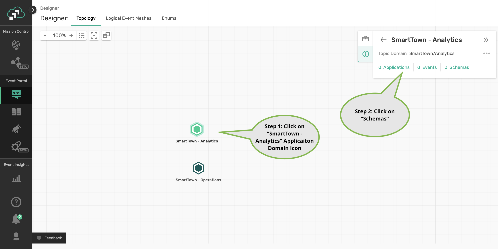

✅ Launch create schema page


In the Create Schema page:
- Enter __AggregateAlert__ for ___Name___
- Choose __JSON__ for ___Content Type___
- Enable the checkbox for ___Shared___
- Under the Content section, click on the __Import from file__ link. Choose the file __AggregateAlert-schema.json__ in __~/github/smarttown/cloudstream__ folder
- Click on __Save__ button

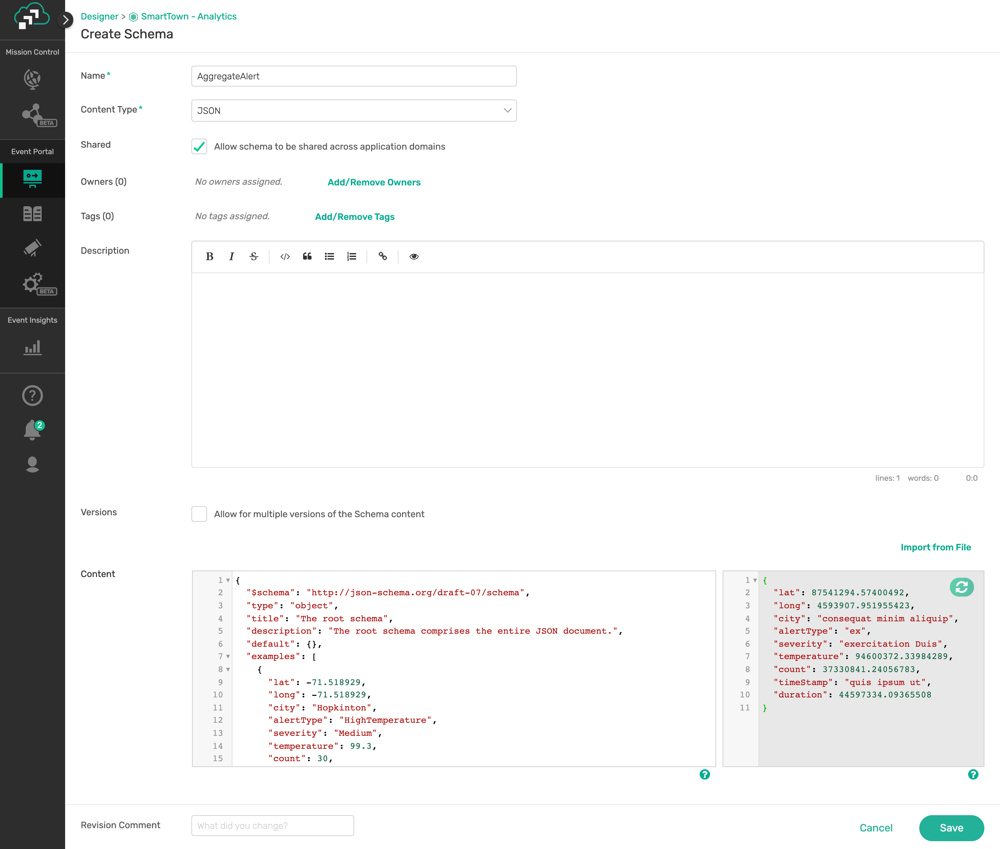

### 2️⃣ Event - ___AggregateAlert___ Event

✅ Create event under ___Smart - Analytics___ Application Domain 

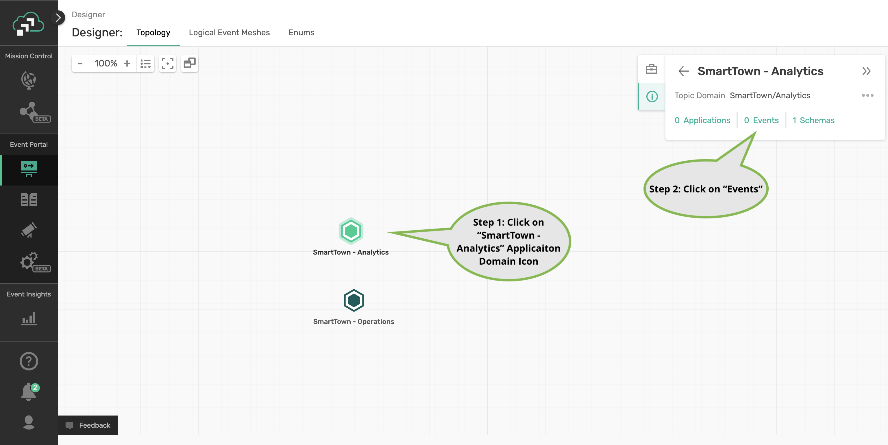

✅ Launch create event page

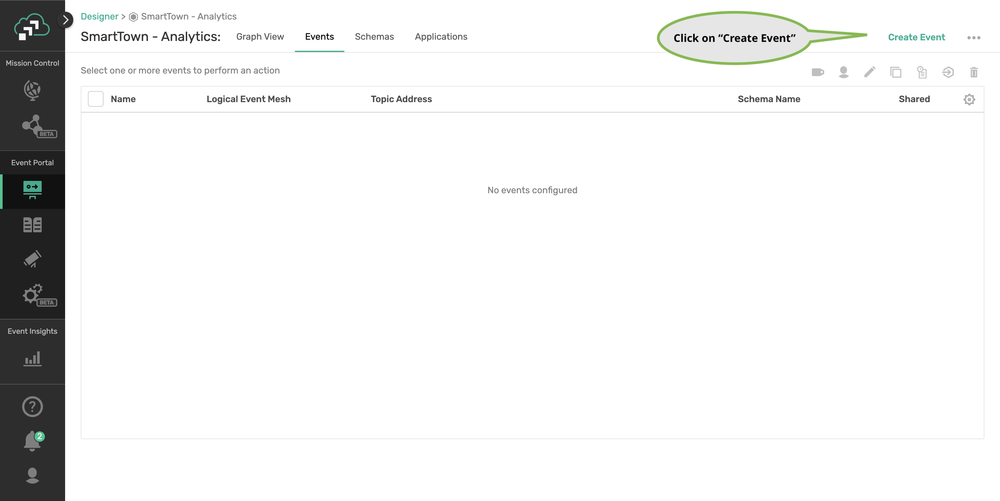


The following section describes how to create an event and set its attributes - name, logical event mesh, topic address and schema.

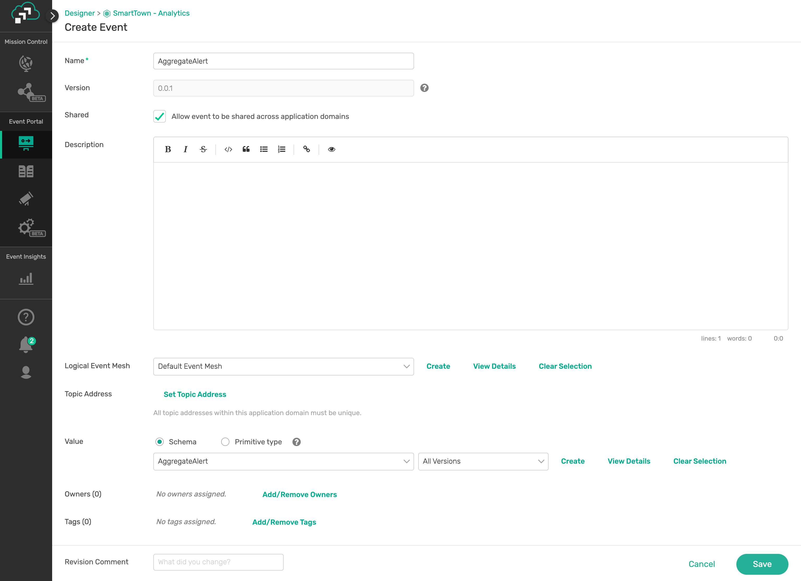

In the Create Event page:
- Enter __AggregateAlert__ for ___Name___
- Enable the checkbox for ___Shared___
- Choose __LogicalEventMesh__ for ___Logical Event Mesh___
- Choose ___Schema___ as selected option for __Value__
  - In the first dropdown select __AggregateAlert__ 
  - In the second dropdown select __All Versions__
  
✅ Launch ___Set Topic Name___ page


✅ Set Topic page

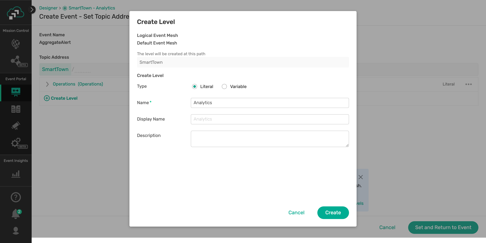


✅ Create level __AggregateAlert__ at the path ___SmartTown___/___Analytics___ of _Literal_ type

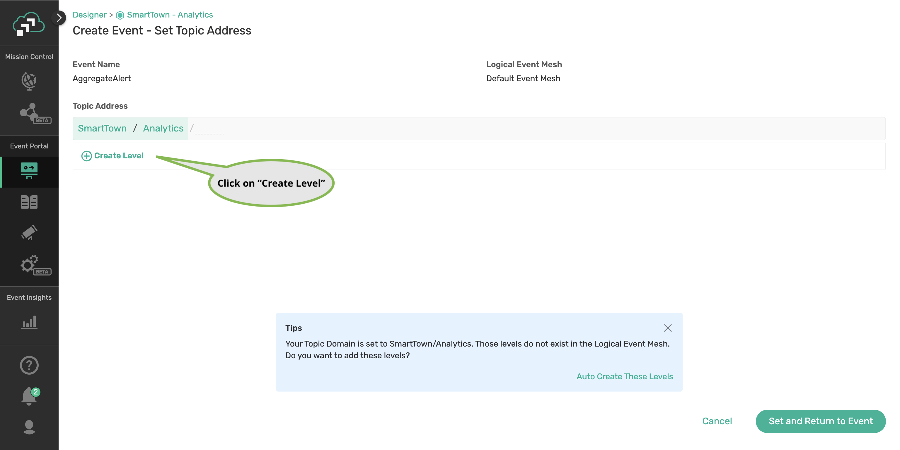
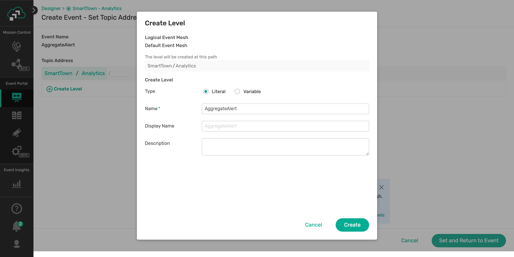

✅ Create level __created__ at the path ___SmartTown___/___Analytics___/___AggregateAlert___ of _Literal_ type

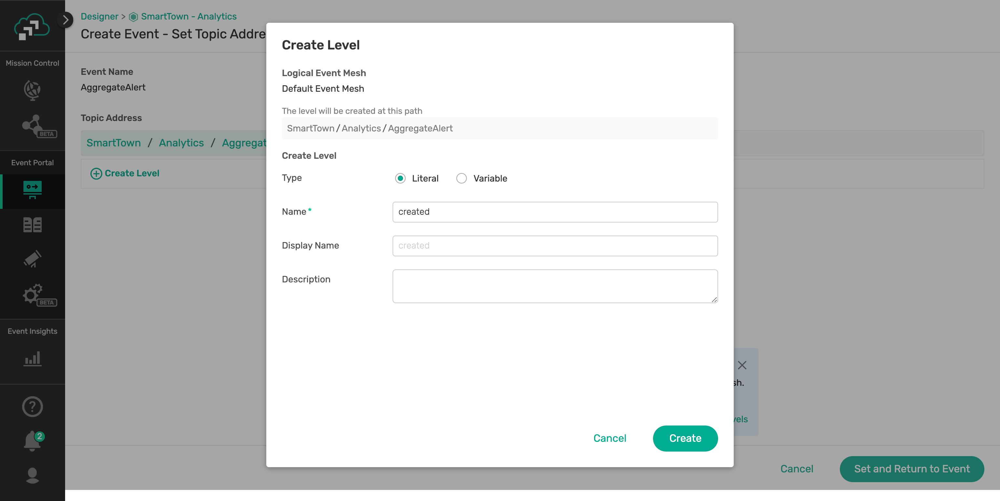

✅ Create level __v1__ at the path ___SmartTown___/___Analytics___/___AggregateAlert___/___created___ of _Literal_ type

✅ Create level __city__ at the path ___SmartTown___/___Analytics___/___AggregateAlert___/___created___/___v1___ of _Variable_ type

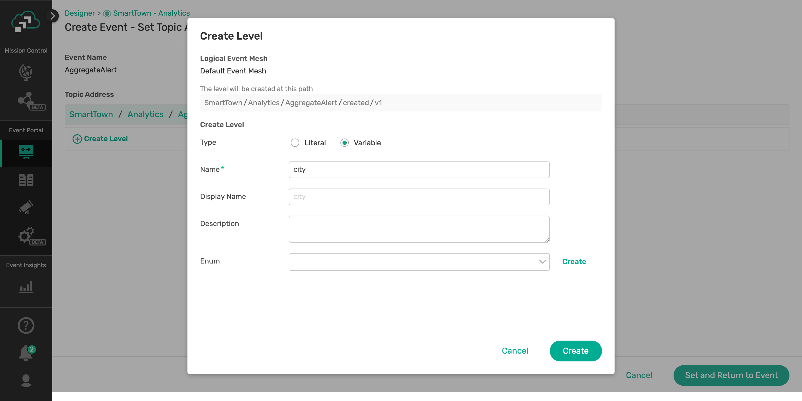

✅ Create level __AlertPriority__ at the path ___SmartTown___/___Analytics___/___AlertPriority___/___created___/___v1___/___city___ of _Variable_ type

✅ Create level __AlertType__ at the path ___SmartTown___/___Analytics___/___AggregateAlert___/___created___/___v1___/___city___/___AlertPriority___ of _Variable_ type

- The final topic name structure

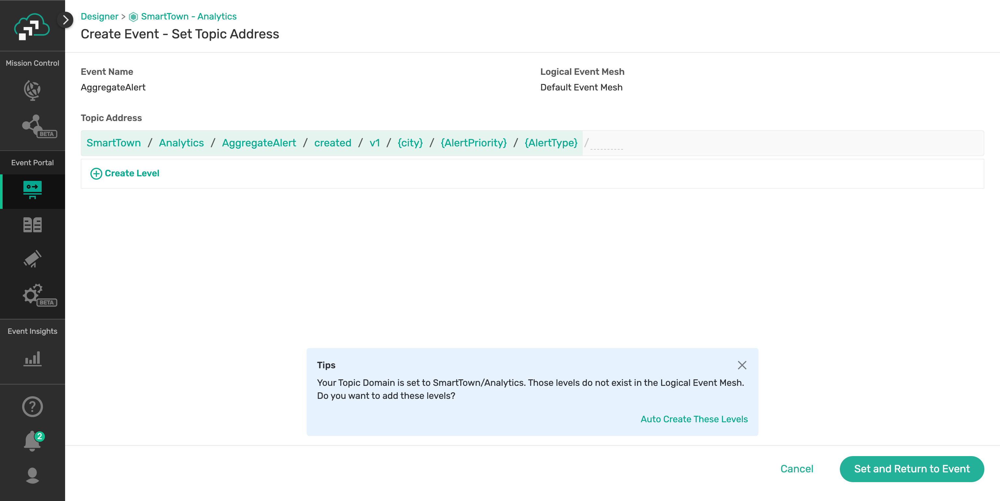

- Click on __Set and Return to Event__ button

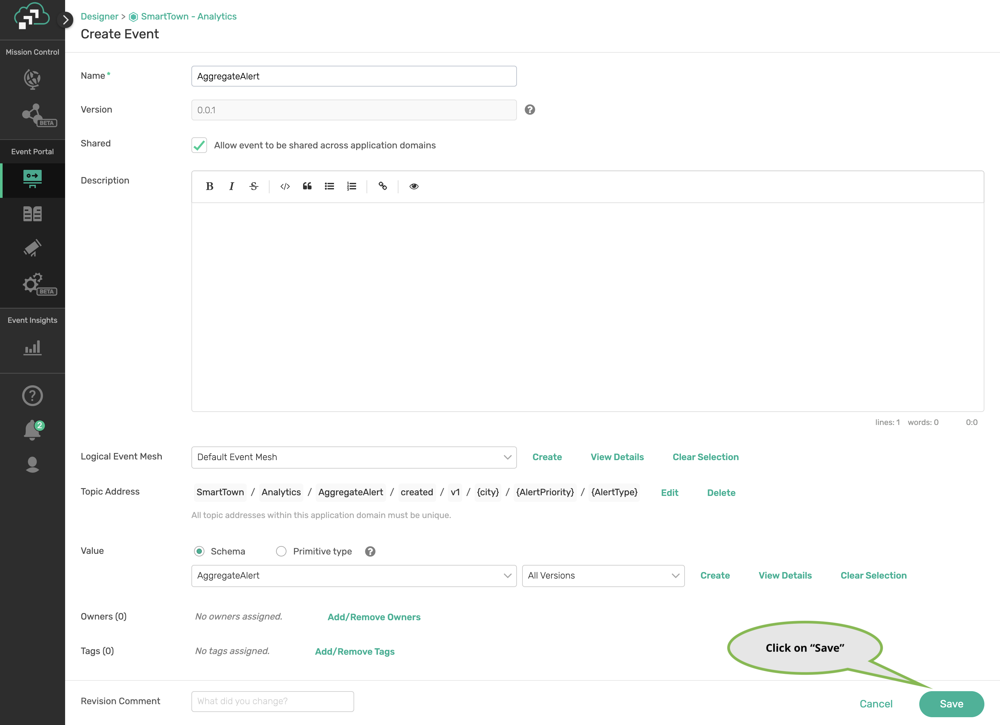

- Click on __Save__ button

### 3️⃣ Application - Heating Cooling Controllers - DASHBOARD	

In the Create Application page:
- Enter __Heating Cooling Controllers - DASHBOARD__ for ___Name___
- Choose ___Standard___ as selected option for __Application Type__

✅ Launch ___Manage___ events page and set Publish/Subscribe permissions on Events

In the Manage Events page:
- Identify the Events relevant to the application
- Click on __Sub__ for the **OperationalAlert** Event
- Click on __Pub__ for the **AggregateAlert** Event 
- Click on __Save__ button


### Applications List

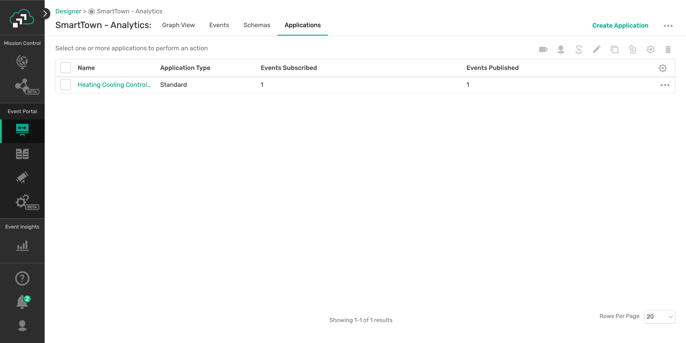

###Review ___ac-city-alert-aggregator___ project

####OperationalAlert.java

✅ Review the OperationalAlert.java file. It carries temperature reading data - a simple POJO with alert attributes and corresponding getters/setters.

####AggregateAlert.java

✅ Review the AggregateAlert.java file. It carries average temperature reading and geo details - a simple POJO with attributes and corresponding getters/setters.

####Application.java

✅ Review the Application.java file. The critical aspect of collecting OperationalAlert events (30 seconds time window) and computing city-wise average temperature, severity and publish AggregateAlert events is carried out here.

####application.yml

✅ Review the application.yml

```
server.port: 8084
spring:
  cloud:
    function:
      definition: aggregateTemperature
    stream:
      bindings:
        aggregateTemperature-out-0:
          destination: 'SmartTown/Analytics/AggregateAlert/created/v1/*/*/*'
        aggregateTemperature-in-0:
          destination: 'SmartTown/Operations/OperationalAlert/created/v1/*/*'
      binders:
        solace-binder:
          type: solace
          environment:
            solace:
              java:
                host: tcps://mrm28q29kuoha.messaging.solace.cloud:55443  
                msgVpn: solace-eap
                clientUsername: solace-cloud-client
                clientPassword: <your_password>
logging:
  level:
    root: info
    org:
      springframework: error
```

> aside positive
> Update the __host__, __msgVpn__, __clientUsername__ and __clientPassword__ parameters with the Host URI, Message VPN, Client Username and Password noted before to connect with your Broker using Spring Cloud Stream client library.

####Running Alert Aggregator

✅ Open a terminal, change directory to ac-city-alert-aggregator project and run the following maven command.
```
cd ~/github/smarttown/cloudstream/ac-city-alert-aggregator
mvn clean spring-boot:run
```
This should run the simulator microservice and publish temperature reading events to the Event Broker.

```
mvn clean 
mvn spring-boot:run
................................
Aggregate for city: San Francisco
AggregateAlert [count=10, severity=Medium, alertType=HighTemperature, city=San Francisco, timeStamp=2021-10-04T12:59:11.730+05:30, temperature=74.2976562500000028421709430404007434844970703125, lat=37.774929, _long=-122.419418]
Aggregate for city: New York City
AggregateAlert [count=10, severity=Medium, alertType=HighTemperature, city=New York City, timeStamp=2021-10-04T12:59:11.750+05:30, temperature=74.487890625000005684341886080801486968994140625, lat=40.71305, _long=-74.00723]
Aggregate for city: Sau Paulo
AggregateAlert [count=9, severity=Medium, alertType=HighTemperature, city=Sau Paulo, timeStamp=2021-10-04T12:59:11.778+05:30, temperature=74.466579861111114269078825600445270538330078125, lat=-23.550520, _long=-46.633308]
Aggregate for city: London
AggregateAlert [count=9, severity=Medium, alertType=HighTemperature, city=London, timeStamp=2021-10-04T12:59:11.803+05:30, temperature=74.466579861111114269078825600445270538330078125, lat=51.507351, _long=-0.127758]
Aggregate for city: Melbourne
AggregateAlert [count=10, severity=Medium, alertType=HighTemperature, city=Melbourne, timeStamp=2021-10-04T12:59:11.830+05:30, temperature=74.2976562500000028421709430404007434844970703125, lat=-37.813629, _long=144.963058]
................................
```
## Alert Dashboard (optional)
Duration: 0:05:00

###Review ___ac-city-alert-dashboard___ project

Alert Dashboard is a Spring Boot Application that serves static web application with HTML pages & JS scripts. The web application makes a MQTT client connection to the Broker and subscribes to ___AggregateAlert___ event, on receipt it simply plots them on the Google Map. 

A tooltip facility details the alert nature with information on timestamp, temperature, sample size, city name and geo-coordinates.

✅ Review the shared.js

The connection details to establish a MQTT client session is retrieved from the following page.


```
  // eclipse test server
  var deets = {
    host: '<your_host>.messaging.solace.cloud',
    port: 8443,
    ssl: true,
    username: 'solace-cloud-client',
    password: '<your_password>',
  }
  
  var topicName = 'SmartTown/Analytics/AggregateAlert/created/v1/+/+/+';
  var windowSizeSecs = 10000;

  // this is for MQTT, it should return a connected or connecting valid Paho client
  function getClientConnection(uniqueID,onMessageArrived,onConnectionLost,onConnect) {
    var client = new Paho.MQTT.Client(deets['host'], Number(deets['port']), uniqueID); // AWS SGP Nano
    // set the callback handlers
    client.onConnectionLost = onConnectionLost;
    client.onMessageArrived = onMessageArrived;
    // define connection options
    var connectOptions = {};
    if (deets['ssl'] == true) {
      connectOptions["useSSL"] = true;
    } else {
      connectOptions["useSSL"] = false;
    }
    //connectOptions["reconnect"] = true;
    connectOptions["userName"] = deets['username'];
    connectOptions["password"] = deets['password'];  // AWS SGP Nano
    connectOptions["onSuccess"] = onConnect;
    // try to connect!
    client.connect(connectOptions);
    return client;
  }

```

MQTT client connection is established with the Broker.
> aside positive
> Update the __host__, __username__ and __password__ parameters with the Host URI, Client Username and Password noted before to connect with your Broker using Spring Cloud Stream client library.

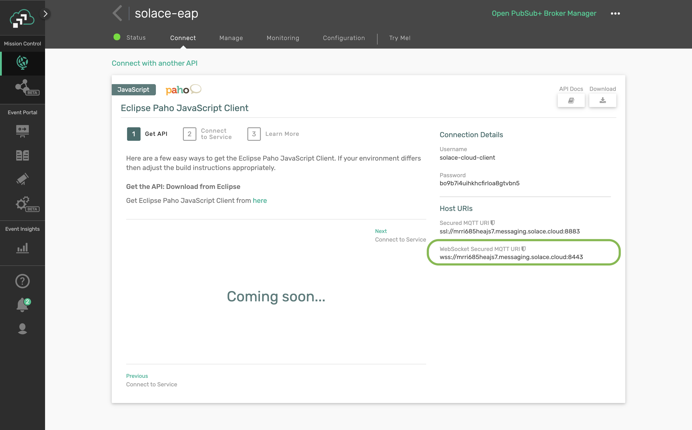

####Running Alert Dashboard

✅ Open a terminal, change directory to ac-city-alert-dashboard project and run the following maven command.
```
cd ~/github/smarttown/cloudstream/ac-city-alert-dashboard
mvn clean spring-boot:run
```
This should run the simulator microservice and publish temperature reading events to the Event Broker.

```
mvn clean 
mvn spring-boot:run
................................
2021-10-04 12:49:35.174  INFO 62510 --- [  restartedMain] o.s.b.w.embedded.tomcat.TomcatWebServer  : Tomcat initialized with port(s): 8080 (http)
2021-10-04 12:49:35.176  INFO 62510 --- [  restartedMain] o.apache.catalina.core.StandardService   : Starting service [Tomcat]
2021-10-04 12:49:35.177  INFO 62510 --- [  restartedMain] org.apache.catalina.core.StandardEngine  : Starting Servlet engine: [Apache Tomcat/9.0.48]
2021-10-04 12:49:35.194  INFO 62510 --- [  restartedMain] o.a.c.c.C.[Tomcat].[localhost].[/]       : Initializing Spring embedded WebApplicationContext
2021-10-04 12:49:35.194  INFO 62510 --- [  restartedMain] w.s.c.ServletWebServerApplicationContext : Root WebApplicationContext: initialization completed in 363 ms
2021-10-04 12:49:35.248  INFO 62510 --- [  restartedMain] o.s.b.a.w.s.WelcomePageHandlerMapping    : Adding welcome page: class path resource [static/index.html]
2021-10-04 12:49:35.270  WARN 62510 --- [  restartedMain] ion$DefaultTemplateResolverConfiguration : Cannot find template location: classpath:/templates/ (please add some templates or check your Thymeleaf configuration)
2021-10-04 12:49:35.278  INFO 62510 --- [  restartedMain] o.s.b.d.a.OptionalLiveReloadServer       : LiveReload server is running on port 35729
2021-10-04 12:49:35.284  INFO 62510 --- [  restartedMain] o.s.b.w.embedded.tomcat.TomcatWebServer  : Tomcat started on port(s): 8080 (http) with context path ''
2021-10-04 12:49:35.287  INFO 62510 --- [  restartedMain] c.e.scs.asyncapi.dashboard.Application   : Started Application in 0.503 seconds (JVM running for 1303.432)
2021-10-04 12:49:35.289  INFO 62510 --- [  restartedMain] .ConditionEvaluationDeltaLoggingListener : Condition evaluation unchanged
2021-10-04 12:50:09.348  INFO 62510 --- [nio-8080-exec-1] o.a.c.c.C.[Tomcat].[localhost].[/]       : Initializing Spring DispatcherServlet 'dispatcherServlet'
2021-10-04 12:50:09.349  INFO 62510 --- [nio-8080-exec-1] o.s.web.servlet.DispatcherServlet        : Initializing Servlet 'dispatcherServlet'
2021-10-04 12:50:09.349  INFO 62510 --- [nio-8080-exec-1] o.s.web.servlet.DispatcherServlet        : Completed initialization in 0 ms
................................
```
####Access Alert Dashboard

✅ Open a browser and navigate to [localhost:8080](http://localhost:8080/)

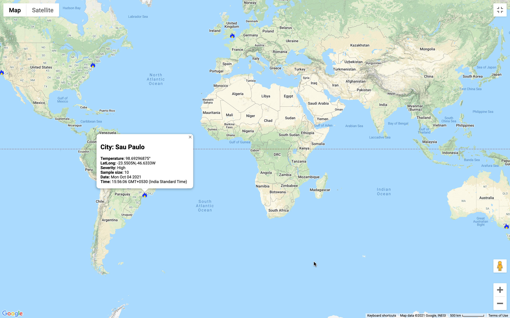

### Simulating Temperature Readings from multiple SmartTowns


Lunch a terminal and run the following commands. 

```
cd ~/github/smarttown/cloudstream/ac-city-iot-simulator
```

Run one or more (maybe all) of the following commands to simulate sensor data for different locations. 

```   
mvn spring-boot:run -Dspring-boot.run.arguments="--application.city=London --application.latitude=51.507351 --application.longitude=-0.127758 --server.port=8091" &
mvn spring-boot:run -Dspring-boot.run.arguments="--application.city='Sau Paulo' --application.latitude=-23.550520 --application.longitude=-46.633308 --server.port=8092" &
mvn spring-boot:run -Dspring-boot.run.arguments="--application.city=Melbourne --application.latitude=-37.813629 --application.longitude=144.963058 --server.port=8093" &
mvn spring-boot:run -Dspring-boot.run.arguments="--application.city='SanFrancisco' --application.latitude=37.774929 --application.longitude=-122.419418 --server.port=8094"
mvn spring-boot:run -Dspring-boot.run.arguments="--application.city=Bangalore --application.latitude=12.971599 --application.longitude=77.594566 --server.port=8095" &
mvn spring-boot:run -Dspring-boot.run.arguments="--application.city=Singapore --application.latitude=1.290453 --application.longitude=103.852038 --server.port=8096" &
```

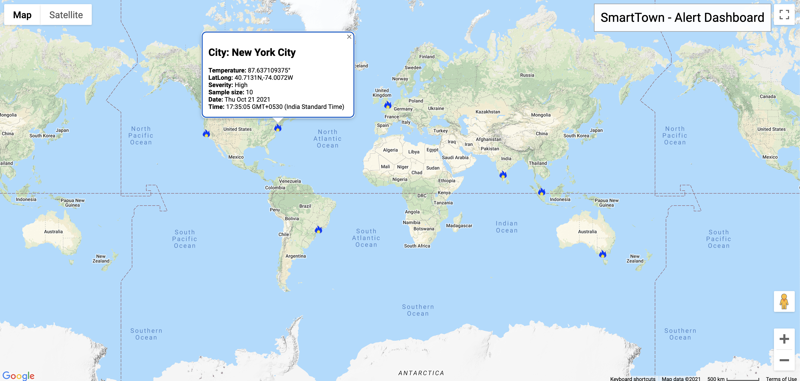

## Takeaways
Duration: 0:01:00

- ✅ The [Solace PubSub+ Event Portal](solace.com/products/portal) is an excellent tool to design and visualize your Event-Driven Architecture, discover what events exist, collaborate with your team and kickstart development via exporting of AsyncAPI documents.
- ✅ [AsyncAPI Generator](https://github.com/asyncapi/generator) templates allow developers to consistently create event-driven applications by generating code skeletons that are pre-wired with the events and channels defined in the AsyncAPI documents.
- ✅ [Spring Cloud Stream](https://spring.io/projects/spring-cloud-stream) allows developers to implement highly scalable, event-driven microservices without having to learn how to use messaging APIs.


**Thanks for participating in this codelab!** Let us know what you thought in the [Solace Community Forum](https://solace.community) and if you found any issues along the way we'd appreciate it if you'd raise them by clicking the _Report a mistake_ button at the bottom left of this codelab.
