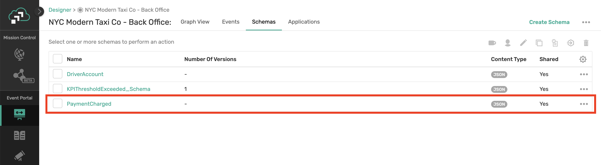

author: Jonathan Schabowsky
summary: In this tutorial we'll cover how to design, extend and implement your event-driven APIs using Solace PubSub+ Event Portal
id: design-document-discover-develop-event-driven-apis
tags: workshop
categories: Solace, Taxi, Event Portal
environments: Web
status: Published
feedback link: https://github.com/SolaceDev/solace-dev-codelabs/blob/master/markdown/design-document-discover-develop-event-driven-apis

# Be Real-Time: Design, Document, Discover and Develop Event-Driven APIs

## What you'll learn

Duration: 0:01:00

Most organizations are adopting an event-driven architecture (EDA) to compete in a world where customer satisfaction requires real-time outcomes.

In this code lab we’ll build and expand your toolbox by learning how an Event Portal, paired with industry standard specifications and frameworks, enable a smooth journey to bring your EDA from initial architecture and design to code running in production while also setting your team up for success as the business needs, architecture and applications themselves are enhanced over time.

Throughout this workshop we will get hands on and talk about:

PubSub+ Event Portal

- Architect, Design and extend an EDA which includes multiple Applications, Events, and Schemas.
- Document Applications, Events, and Schemas along with best practices for documentation

<!--

- Use Discovery capability to see what you already have in runtime and audit for changes)

-->


- Use the Event Catalog and Designer to Learn, Understand and Ideate

AsyncAPI

- AsyncAPI is an open initiative for defining asynchronous APIs, providing a specification, and tooling such as code generation.
- Use the AsyncAPI Generator to generate skeleton code and object models for event-driven microservices

Positive
: Artifacts created or used throughout this codelab can be found in [this Github repo](https://github.com/Mrc0113/ep-design-workshop)

## What you need: Prerequisites

Duration: 0:08:00

🛠 This page covers the setup needed to perform this codelab. 🛠

### AsyncAPI Generator Requirements

✅ Install instructions available [here](https://github.com/asyncapi/generator#requirements)

- Node.js v14.16+ (Check version using `node -v`)
- npm v6.13.7+ (Check version using `npm -version`)

We'll install the generator itself later 👍

### Java / Spring Cloud Stream Requirements

✅ Spring Cloud Stream just requires Java and Maven to use 🚀

- Java 1.8+ (Check version using `java -version`)
- Maven 3.3+ (Check version using `mvn -version`)
  - On mac you can `brew install maven`
  - Other install instructions [here](https://maven.apache.org/install.html)
- Your favorite Java IDE 💥

### Node.js Requirements

✅ There are only a few requirements for the Node.js steps!

- Node version >= v14.16.1 Check version using `node -v`)
- Your favorite Editor

### PubSub+ Event Broker Connection Info

✅ The credentials below are for a public event feed found on the [Solace feed Marketplace](http://solace.dev/marketplace) that we'll use during this codelab.

- SMF Host: `tcp://taxi.messaging.solace.cloud:55555`
- MQTT Host: `mqtt://taxi.messaging.solace.cloud:8883`
- Message VPN: `nyc-modern-taxi`
- Username: `public-taxi-user`
- Password: `iliketaxis`

✅ Note that this client-username has permissions to subscribe to `taxinyc/>` and `test/taxinyc/>` and permissions to publish to `test/taxinyc/>`

### Prepare PubSub+ Event Portal

#### Sign-up for Solace Cloud

✅ If you already have a Solace Cloud account just login, otherwise please sign-up for a free Solace Cloud Account using [this link](https://bit.ly/try-solace-free). Note that no credit card is required. You will receive an email to activate the account and will then be prompted to start the free trial.


#### Import Existing Designed EDA

✅ Download the Application Domain export file: [EventPortalExport_Initial.json](https://github.com/Mrc0113/ep-design-workshop/blob/main/EventPortalExport_Initial.json)

You can download the file via curl or by cloning the git repo

```bash
curl -k -XGET https://raw.githubusercontent.com/Mrc0113/ep-design-workshop/main/EventPortalExport_Initial.json -o EventPortalExport_Initial.json
```

OR

```bash
git clone https://github.com/Mrc0113/ep-design-workshop.git
```

✅ Inside your logged into Solace Cloud Account navigate to the Event Portal Designer by clicking "Designer" in the menu on the left.


✅ Then import the previously downloaded Application Domain file by clicking the `Import` button at the top right of the _Designer_ and importing the file.


🚀 Setup complete! Let's get going! 🚀

## Use Case Overview

Duration: 0:05:00

You are a member of the engineering team at the _NYC Modern Taxi Co_, a fictional taxi cab company based in New York City. Your team is playing from behind and racing to catch up with technology innovation introduced to the industry by Rideshare competitors such as Uber and Lyft. In order for the company to survive and eventually thrive your team has convinced the board that transforming the companies' IT systems is of utmost importance. Your team has done its research and determined that moving to an Event-Driven Architecture is essential to future rapid innovation and has already kicked this initiative off by deploying a Solace Event Mesh and updating the taxi fleet to stream real-time events that include ride and location information. We know what the fleet is up to! Now it's time to start to continually improve and provide a world class customer experience.

In order to react in a real-time manner the team has decided that we want to process the updates as they stream in from the fleet of taxis instead of putting them directly into a datastore and then having to retrieve them to do processing later. To prototype this work, you'll see a high level design in the diagram below. Since we already have the taxi fleet streaming their updates into our PubSub+ Event Mesh we need to do the following:

1. 🚖 Create and capture this **design** in the PubSub+ Event Portal where we can define our Event-Driven Architecture, including its components: Applications, Events, and Schemas. This will allow us to define the details needed to implement, visualize and extend the architecture as it evolves, and share/collaborate with our entire engineering team as we continue to innovate.
2. 🚕 Next up we're going to **document** few applications and events so that they can be understood and reused by others.

<!--

3. 🚕 We will **discover** existing implementation by running a discovery scan of a Kafka Cluster to reverse engineer what another team at NYC Taxi already has implemented)

-->

4. 🚕 Learn, Understand and Reuse some of our events in a new use case
5. 🚖 Lastly we'll **develop** the _ProcessPayment_ microservice that that receives the stream of _RideUpdated_ events, charges the customer's credit card and generate a _PaymentCharged_ Event.


Positive
: The dataset you will be using in this lab originally comes from the NYC Taxi & Limousine Commission's open data release of more than a billion taxi ride records. Google then extended one week worth of data (3M taxi rides) from their original pickup and drop-off points into full routes in order to simulate a fleet of taxis roaming the streets of NYC. Solace is streaming this data over Solace PubSub+ for you to analyze and process.

_Terms of Use:_ This dataset is publicly available for anyone to use under the following terms provided by the Dataset Source — [https://data.cityofnewyork.us/](https://data.cityofnewyork.us/) — and is provided "AS IS" without any warranty, express or implied, from Solace. Solace disclaims all liability for any damages, direct or indirect, resulting from the use of the dataset.

## Foundational Concepts

Duration: 0:08:00

Before we dive deeper, let's ensure we are all aligned with terminology of the objects and concepts we will use in PubSub+ Event Portal.

### Application Domain & Workspace

An application domain represents a namespace where applications, events, and schemas can live. Within this namespace, you can create a suite of applications, events, and schemas that are independent of other application domains. In our NYC Taxi use case we introduced earlier, we may group applications into different domains, for ex. we may have a domain for our rideshare apps and services, one for our _back-office apps_ where invoicing and background checks are being processed, and maybe another domains for _analytics_ where we group apps that are responsible for analyzing the successful operation of our rideshare services.

<!--

In the Event Portal you will associate all objects like Consumer Groups, Topics, Schema, etc, to one or more Application Domains.

You can further group multiple domains into a _Workspace_, which will make it easier to review our Discovery scan. So our Analytics, Operations, and Back-Office Application Domain in the NYC taxi example could be part of a single Workspace.

-->


### Events/Topics

Events are an important part of the Event Portal. Think of an event as a concept of the publish-subscribe (pub/sub) architectural pattern. Topics are used to route data or events (in the form of messages) between distributed applications, often using a message broker or an event broker.

<!--
A Solace topic and an Apache Kafka topic might seem fundamentally the same, but there are quite a few [differences between them](https://solace.com/blog/solace-topics-vs-kafka-topics/). Later in this CodeLab, when you run a discovery scan against a Kafka cluster the Topic Scheme for events discovered will be Kafka format.
-->

A Solace topic and an Apache Kafka topic might seem fundamentally the same, but there are quite a few [differences between them](https://solace.com/blog/solace-topics-vs-kafka-topics/). 

Here are some examples from our use case:

Kafka Topics:

- taxinyc.analytics.fraud.alerted.v1
- taxinyc.ops.payment.charged.v1
- taxinyc.ops.ride.called.v1

Solace Topics:

- taxinyc/ops/ride/updated/v1/{ride_status}/{driver_id}/{passenger_id}/{current_latitude}/{current_longitude}
- taxinyc/backoffice/payment/charged/v1/{payment_status}/{driver_id}/{passenger_id}

### Schemas

In simple terms, a schema represents the contract to describe the payload of an event. Producers and consumers of an event can trust that the event's payload matches the schema definition assigned to that event. Schemas define a type of payload through JSON, AVRO, XML, Binary, or Text. JSON, AVRO, and XML schemas have content that describes each property of the schema.

In our use case all events are in JSON Schema format.


### Applications

An application represents a piece of software that produces and consumes events. Applications connect to the event broker in an event-driven architecture and communicate with other applications via events. A single application represents a class of applications that are running the same code base; therefore, a Kafka consumer group can be associated with an Application object in the Event Portal.

<!---

### Kafka Specific Objects and Terminology

#### Consumer Groups

Event Portal supports the concept of Kafka's consumer groups. A consumer group is used by Kafka to group consumers into a logical subscriber for a topic. In the Event Portal, you can model consumer groups in the Designer. This enables the Event Portal's runtime discovery to associate a discovered consumer group to an existing application.

Kafka consumers that belong to the same consumer group share a group ID. The consumers in a group divide the topic partitions, as fairly as possible, so that each consumer consumes only a single partition from the group.

A few examples of Consumers Groups from our NYC Taxi Analytics use case would be:

- Passenger Surge Detection
- Fraud Detection
- Driver Incentive Calculation

#### Connector

A connector is used in Kafka for connecting Kafka brokers with external systems to stream data into or out of Apache Kafka. In the Event Portal, a Kafka Connector is an application class you select to configure associated published and/or subscribed events and a set of Kafka-native attributes like Connector Type, Class, Cluster ID, and Maximum Task.

-->


## Best Practices

Duration: 0:08:00

### Decomposing the Enterprise

<!-- 

Whether you perform discovery manually or using our agent, it is important to consider how your enterprise is organized so that it can be decomposed using the Application Domain construct. An Application Domain provides the ability to organize and decompose an enterprise into logical groupings. These groupings could be based on-line of business, related functional capabilities or based on team dynamics. The benefits of doing this includes: 

-->

It is important to consider how your enterprise is organized so that it can be decomposed using the Application Domain construct. An Application Domain provides the ability to organize and decompose an enterprise into logical groupings. These groupings could be based on-line of business, related functional capabilities or based on team dynamics. The benefits of doing this includes:


1. **Event sharing rules** – decide which events should be shared with other application domains and those which are for internal application domain usage only. This has implications both from a security perspective, but also which events need to be managed more tightly as they affect others outside the application domain
1. **Provide uniform event topic prefixes** – ensures that the prefix is unique and that topic best practices are followed

### Topic Naming Best Practices

The topic of which an event is addressed seems like a pretty simple decision, but in reality, it can result in some negative consequences if not planned in advance. A topic is more than an address, it is metadata that describes the event and can be used for several purposes such as routing, access control and versioning. Thus, it is important to properly govern and manage the topic structure. **Regardless of your broker type**, it is a good practice to make topics structured and hierarchical the same way a RESTful Resource uses hierarchical addressing. In other words we want to produce hierarchical topics that rank from least specific to most specific.

#### Parts of the Event Topic

The event topic structure has two parts:

1. The **Event Topic Root** contains enough information to describe the type of event that has occurred. Each Event Topic Root is a static field that describes the type of event. The list of Event Topic Roots forms a catalog of events that can be produced and consumed. This catalog could be brought into the PubSub+ Event Portal's event catalog, listing each event type along with details about the event. Each Event Topic Root describes the event in as much detail as necessary to map it to a single data schema.
1. The **Event Topic Properties** are optional fields that further describe a particular event. This part of the topic has fields that are dynamically filled when the producer publishes the event. These fields are used to describe the specific or unique attributes of this event instance that would be used for routing and filtering.

- Event Topic Root: The Event Topic Root of an event should have the following form:

        Domain/ObjectType/Verb/Version/

- Event Topic Properties: The Event Topic Properties should have the following form:
  Locality/SourceID/ObjectID

Positive
: Complete Event Topic Format: Putting together an Event Topic Root and Event Topic Properties creates an event topic that describes the event with a series of fields from least specific to most specific.

        Domain/ObjectType/Verb/Version/Locality/SourceID/ObjectID

For more information about topic best practices, review the [Topic Architecture Best Practices Guide] (https://docs.solace.com/Best-Practices/Topic-Architecture-Best-Practices.htm)

### Event Information Exchange Patterns

There are multiple Event Exchange Patterns (EEP) that should be considered when using EDA:

#### Thin Event Notification

- If using a _Thin Event Notification_ pattern, where only the necessary details are provided from a data point of view, this does tend to increase coupling between the event source and sink’s (consumers) as what attributes are provided are typically directly correlated with the needs of the use case vs being more flexible.

Positive
: The advantage of this pattern however is that the data is smaller and can thus reduce latency and bandwidth when important. In general, the source of that event should be the single authoritative source for all published attributes.

#### Hypermedia-Driven Events

- If using _Hypermedia-Driven Events_ pattern, links are provided in the event payload and works to bridge event notifications with dynamic API backends. This can be a good pattern to use where multiple levels of security are concerned related to attributes of the event. Consumers are still notified in realtime of state changes but must invoke the hyperlink in order to get access to more data. The service can then filter the response based on the client’s access level.

Negative
: The disadvantage to this pattern is it increases the latency of the interaction as all the data is not available within the event and puts more complexity on the client and its behavior.

#### Event-Carried State Transfer

- If using _Event-Carried State Transfer_ pattern, all known data is broadcast with the event (possibly entire record) thus enabling the consuming system to know the entire entity state vs just what changed as is the case with Thin Events. This is very common approach as many times the subscribing application want the entire snapshot to avoid having to persist previous state changes.

Negative
: The challenge in this case is that the publishing application may not be the authoritative source of all attributes published. Additionally, the event may become large and increase latency/decrease performance.

Positive
: The benefit however is that decoupling has been achieved in that it will support a variety of use cases and the publisher does not need to be aware of the client’s usage of the data.

For more information about discovering, organizing and enhancing your Event-Driven Architecture, review [Understand, Manage, and Enhance Your Event-Driven Architecture Lifecycle
] (https://docs.solace.com/Cloud/Event-Portal/get-started-event-portal-user-scenario.htm)


## Design an Event Driven Architecture

Duration: 0:10:00

By designing a new event-driven application or extending your event-driven architecture, you're able to deliver new real-time business capabilities in a decoupled and reusable fashion. There are however several key elements which should be considered when designing events, schemas and applications including topic best practices, options for exchanging event data and sharing/visibility rules. Considering these things early will put you on the road to success and enable better reusability down the road.

Now that you're familiar with the use case 🚕 🚖 🚕 and you've imported the application domain into the Event Portal, let's update our Event-Driven Architecture (EDA).

Lets say that your tasked with working within the Back Office team (where the cool kids all work) and are asked to architect the way in which we will charge our passengers for their rides and if the passenger is part of a commercial account, send to our Invoicing System. This is composed of 4 steps

1. Ideate
1. Design the schema
1. Design the event
1. Design the applications

### Step 1: Determine What Can Trigger Payment - Ideate

So essentially we need to consider, is there a business event that would help us trigger on the moment when the ride has been completed?

Positive
: Event-Driven Ideation: To create new business value you must be able to imagine or conceive of a new solution to an existing problem. These ideas can be derived from two different directions. First, I have a known problem, and I am searching for a solution or secondly, let us look at what is available and uncover unique solutions for problems we were not actively looking for. The Event Portal enables learnings from both directions as without it, you do not have a central location to capture all the events that are available, nor do you have a way to understand whether a given event stream solves your problem. The search and filter functionality enable the user to perform keyword searches which range from data level attributes to metadata within the description.

1. Navigate to the _Catalog_ component of the Event Portal  
   
1. Click on the _Schemas_ tab and search for "dropoff"
   
1. In the Search Results click on the **RideUpdated** event in order to understand the matching text context.
1. We now know that the RideUpdated Schema has a field called **ride_status** that can have a value of _dropoff_. So how do we get access to that data? Click on the _RideUpdated_ schema and we will find out!
   
1. We now see the metadata about the RideUpdated schema and at the bottom we can see there is an Event that references this schema called _RideUpdated_. The topic being used leverages the **ride_status** attribute which is pretty sweet! So we can filter on dropoff as a client.
   
1. Lets navigate to the _RideUpdated_ Event and look at its documentation to ensure its what we would want to trigger our _ProcessPayment_ Application.

### Step 2: Design the _PaymentCharged_ Schema

Next we should decide what we want the data to look like once we have processed a payment.

1. First we must decide what Event Exchange Pattern (EEP) we will use. For Maximum flexibility, and because time is not of the essence, we will leverage "Event-Carried State Transfer".
2. Click into the _Designer_ component of the Event Portal  
   
3. Double-click on the _NYC Modern Taxi Co - Back Office_ Application Domain and its time to get creating!
   

4. Click on the Schema tab
5. On the Upper Right Corner, Click the _Create_ button and select _Create Schema_  
   
6. Create Schema by setting values:
   1. Name: PaymentCharged
   2. Content Type: JSON
   3. Shared: YES
   4. Owner: Assign Yourself
   5. Tags: NONE
   6. Description: NONE
   7. Versions: Leave unchecked
   8. Content:


```yaml   
{
  "$schema": "http://json-schema.org/draft-07/schema",
  "$id": "http://example.com/example.json",
  "type": "object",
  "title": "The root schema",
  "description": "The root schema comprises the entire JSON document.",
  "default": {},
  "examples": [
    {
      "payment_charged_id": "23232323",
      "timestamp": "2020-06-03T16:51:47.29612-04:00",
      "information_source": "ProcessPayment",
      "payment_status": "accepted",
      "invoice_system_id": "PSG-32923",
      "amount_charged": 12.32,
      "ride_id": "545496c5-a334-4344-9662-efde68c0b98a",
      "entity_type": "Driver",
      "driver": {
        "driver_id": 1234132,
        "first_name": "Frank",
        "last_name": "Smith",
        "rating": 4,
        "car_class": "SUV"
      },
      "passenger": {
        "passenger_id": 2345243,
        "first_name": "Jesse",
        "last_name": "Menning",
        "rating": 2
      }
    }
  ],
  "required": [
    "payment_charged_id",
    "timestamp",
    "information_source",
    "payment_status",
    "invoice_system_id",
    "amount_charged",
    "ride_id",
    "entity_type",
    "driver",
    "passenger"
  ],    
  "properties": {
    "payment_charged_id": {
      "$id": "#/properties/payment_charged_id",
      "type": "string",
      "title": "The payment_charged_id schema",
      "description": "An explanation about the purpose of this instance.",
      "default": "",
      "examples": ["23232323"]
    },
    "timestamp": {
      "$id": "#/properties/timestamp",
      "type": "string",
      "title": "The timestamp schema",
      "description": "An explanation about the purpose of this instance.",
      "default": "",
      "examples": ["2020-06-03T16:51:47.29612-04:00"]
    },
    "information_source": {
      "$id": "#/properties/information_source",
      "type": "string",
      "title": "The information_source schema",
      "description": "An explanation about the purpose of this instance.",
      "default": "",
      "examples": ["ProcessPayment"]
    },
    "payment_status": {
      "$id": "#/properties/payment_status",
      "type": "string",
      "title": "The payment_status schema",
      "description": "An explanation about the purpose of this instance.",
      "default": "",
      "examples": ["accepted"]
    },
    "invoice_system_id": {
      "$id": "#/properties/invoice_system_id",
      "type": "string",
      "title": "The invoice_system_id schema",
      "description": "An explanation about the purpose of this instance.",
      "default": "",
      "examples": ["PSG-32923"]
    },
    "amount_charged": {
      "$id": "#/properties/amount_charged",
      "type": "number",
      "title": "The amount_charged schema",
      "description": "An explanation about the purpose of this instance.",
      "default": 0,
      "examples": [12.32]
    },
    "ride_id": {
      "$id": "#/properties/ride_id",
      "type": "string",
      "title": "The ride_id schema",
      "description": "An explanation about the purpose of this instance.",
      "default": "",
      "examples": ["545496c5-a334-4344-9662-efde68c0b98a"]
    },
    "entity_type": {
      "$id": "#/properties/entity_type",
      "type": "string",
      "title": "The entity_type schema",
      "description": "An explanation about the purpose of this instance.",
      "default": "",
      "examples": ["Driver"]
    },
    "driver": {
      "$id": "#/properties/driver",
      "type": "object",
      "title": "The driver schema",
      "description": "An explanation about the purpose of this instance.",
      "default": {},
      "examples": [
        {
          "driver_id": 1234132,
          "first_name": "Frank",
          "last_name": "Smith",
          "rating": 4,
          "car_class": "SUV"
        }
      ],
      "required": [
        "driver_id",
        "first_name",
        "last_name",
        "rating",
        "car_class"
      ],
      "properties": {
        "driver_id": {
          "$id": "#/properties/driver/properties/driver_id",
          "type": "integer",
          "title": "The driver_id schema",
          "description": "An explanation about the purpose of this instance.",
          "default": 0,
          "examples": [1234132]
        },
        "first_name": {
          "$id": "#/properties/driver/properties/first_name",
          "type": "string",
          "title": "The first_name schema",
          "description": "An explanation about the purpose of this instance.",
          "default": "",
          "examples": ["Frank"]
        },
        "last_name": {
          "$id": "#/properties/driver/properties/last_name",
          "type": "string",
          "title": "The last_name schema",
          "description": "An explanation about the purpose of this instance.",
          "default": "",
          "examples": ["Smith"]
        },
        "rating": {
          "$id": "#/properties/driver/properties/rating",
          "type": "number",
          "title": "The rating schema",
          "description": "An explanation about the purpose of this instance.",
          "default": 0,
          "examples": [4]
        },
        "car_class": {
          "$id": "#/properties/driver/properties/car_class",
          "type": "string",
          "title": "The car_class schema",
          "description": "An explanation about the purpose of this instance.",
          "default": "",
          "examples": ["SUV"]
        }
      },
      "additionalProperties": true
    },
    "passenger": {
      "$id": "#/properties/passenger",
      "type": "object",
      "title": "The passenger schema",
      "description": "An explanation about the purpose of this instance.",
      "default": {},
      "examples": [
        {
          "passenger_id": 2345243,
          "first_name": "Jesse",
          "last_name": "Menning",
          "rating": 2
        }
      ],
      "required": ["passenger_id", "first_name", "last_name", "rating"],
      "properties": {
        "passenger_id": {
          "$id": "#/properties/passenger/properties/passenger_id",
          "type": "integer",
          "title": "The passenger_id schema",
          "description": "An explanation about the purpose of this instance.",
          "default": 0,
          "examples": [2345243]
        },
        "first_name": {
          "$id": "#/properties/passenger/properties/first_name",
          "type": "string",
          "title": "The first_name schema",
          "description": "An explanation about the purpose of this instance.",
          "default": "",
          "examples": ["Jesse"]
        },
        "last_name": {
          "$id": "#/properties/passenger/properties/last_name",
          "type": "string",
          "title": "The last_name schema",
          "description": "An explanation about the purpose of this instance.",
          "default": "",
          "examples": ["Menning"]
        },
        "rating": {
          "$id": "#/properties/passenger/properties/rating",
          "type": "number",
          "title": "The rating schema",
          "description": "An explanation about the purpose of this instance.",
          "default": 0,
          "examples": [2]
        }
      },
      "additionalProperties": true
    }
  },
  "additionalProperties": true
}


```

7. Revision Comment: <Optional> "Initial Creation of Schema"
8. Click _Save_
    

### Step 3: Design _PaymentCharged_ Event

So now that we have constructed the payload format for the PaymentCharged event, it is time to design the event itself. What's involved? Well we need to apply our best practices as it comes to the Topic name!

1. Click into the _Designer_ component of the Event Portal
1. Double-Click on the _NYC Modern Taxi Co - Back Office_ Application Domain
2. Click on the Events tab
3. On the Upper Right Corner, Click the _Create_ button and select _Create Event_
   
4. Create Event by setting values:
   1. Name: PaymentCharged
   2. Shared: YES
   3. Description: NONE
   4. Logical Event Mesh: NYC Modern Taxi Logical Event Mesh (default selection)
   5. Description: NONE
   6. Topic Address: Click on "Set Topic Address"
      *  As you can see the domain already has some "Event Topic Root" `taxinyc/backoffice/`
      * We need to apply the best practice of _Domain/ObjectType/Verb/Version/Locality/SourceID/ObjectID_ to this event
      * We will use the topic name of: `taxinyc/backoffice/payment/charged/v1/{payment_status}/{driver_id}/{passenger_id}`
      * We will create topic levels `{payment_status}, {driver_id} and {passenger_id}` as variables
   7. Value: Keep the Schema radio button selected
   8. Choose the Schema "PaymentCharged" that we created in the previous step
   9.  Owner: Assign Yourself
   10. Tags: NONE
   11. Revision Comment: <Optional> "Initial Creation of Event"
   12. Click _Save_
   
   

### Step 4a: Design _ProcessPayment_ Application

Now for the fun part! We need to design the event-driven interface of the _ProcessPayment_ Application. This is pretty easy as it has one input which triggers a single output.

1. Click into the _Designer_ component of the Event Portal
1. Double-click on the _NYC Modern Taxi Co - Back Office_ Application Domain
2. Click on the Applications tab
3. In the Upper Right Corner, Click the _Create_ button and select _Create Application_
   
4. Create Application by setting values:
   1. Name: ProcessPayment
   2. Description: NONE
   3. Application Type: Standard
   4. Owners: Assign Yourself
   5. Tags: NONE
   6. Associate Events - Click the _Manage_ link
      1. Select the _Sub_ button next to the _RideUpdated_ event
      2. Select the _Pub_ button next to the _PaymentCharged_ event
    
    

   7. Revision Comment: <Optional> "Initial Creation of Application"
   8. Click _Save_
        
    

5. You should now see the newly added application on the graph!


Positive
: Pro Tip!: If you wanted to develop/implement this application you could right-click on the _ProcessPayment_ Application in graph and export an AsyncAPI Document that could be used to generate code!

### Step 4b: Design _InvoiceSystem_ Application

Remember back to our use case... We have designed how we process payment but still have to deal with invoicing customers when the payment_status says to invoice. Therefore, our plan is to create an application that integrates with our invoicing system.

1. Click into the _Designer_ component of the Event Portal
2. Double-Click on the _NYC Modern Taxi Co - Back Office_ Application Domain
3. Click on the Applications tab
4. On the Upper Right Corner, Click the _Create_ button and select _Create Application_
   1. Name: InvoiceSystem
   1. Description: NONE
   1. Application Type: Standard
   1. Owners: Assign Yourself
   1. Tags: NONE
   1. Associated Events - Click the _Manage_ link
      1. Select the _Sub_ button next to the _PaymentCharged_ event

    

   2. Revision Comment: <Optional> "Initial Creation of Application"
   3. Click _Save_

    


5. You should now see the newly added application on the graph!


### Reuse _PaymentCharged_ Event

Getting reuse of your events is an important part of proving return on investment (ROI) and also enables other applications and teams to integrate with realtime data.

In this scenario we will act as though we are members of the "Ops" team (they are not as cool as us back office kids, but oh well). They have a use case that Payment charged events should go to the _Rider Mobile Application_. Lets make it happen!

1. Click into the _Designer_ component of the Event Portal
1. Double-click on the _NYC Modern Taxi Co - Ops_ Application Domain
1. Double-click on the _RIder Mobile Application_
1. On the Upper Right Corner, Click the _Edit_ button
2. Associated Events - Click the _Manage_ link
      1. Select the _Sub_ button next to the _PaymentCharged_ event
3. Revision Comment: <Optional> "Updated to Satisfy JIRA-01245"
4. Click _Save_

You should now see the relationship on the graph where we are subscribed to the _PaymentCharged_ event and the dependency on the Back Office App domain!


Positive
: Change Impact Analysis: Changes happen. The question is what is the effect and who is affected? In the synchronous world changes to an API of course may/will affect the clients, so changes are rolled out, clients notified, and changes implemented. The challenge in the EDA world is that consumers are decoupled from producers and vice/versa. In addition, the ripple effect can be large in that integrations though connectors and integration capabilities can move events between different groups which further casts a fog upon dependency management. The Event Portal enables you to navigate the relationships you just designed and understand impact.

## Documentation Best Practices

Duration: 0:05:00

💡 **Know your Audience**  
The events which you have are used to enable real-time collaboration between systems and solve a problem for a specific industry and organization. These events are integrated into applications by software developers/engineers, but they are not all the same and can be decomposed into:

- **Decision Makers** - Some people in the organization are looking and evaluating the events and schemas available in order to decide if it makes sense to have the development team further explore the service. They are evaluating with a problem in mind and are looking to see if the events registered within the Event Portal can be used to solve that problem. In many cases they will not be the ones writing the code that solves the problem but are extremely important as they drive the decision as to if the effort to use it will be undertaken. Examples of these types of decision makers include but are not limited to: CTO, Product Managers, Data Analysts and Data Scientists/Engineers.
- **Users** - These are the people who will be directly consuming and developing using the events and schemas defined in the event portal. Typically, the decision to use an event/schemas has been made, and they need to understand the event, how it applies to their use case and how to integrate with it. They are critical to enable as they are always short on time and are the last link to getting an event to be reused. In addition, these users are the ones creating the documentation to enable others if they are the author of an event or schema, so they are critical to the maintainability of the event-driven ecosystem of documentation. Examples of users include but are not limited to integration engineers, front end developer, backend developer.

💡 **Capture Business Point of View and Moment**

- The hardest thing to capture is the “what does this event represent” and without it, it will be hard for a decision maker to understand if it provides value. Be sure to document the moment in which the event was generated, the attributes of which it is the authoritative source and the intended use of the event. Do not assume the user will read the corresponding payload schema or understand much about the publishing application so focus on documenting the event concisely and thoroughly

💡 **Technical Requirements**

- This is the section where you need to provide the developer the information needed to consume the event itself. What are some suggest client APIs that should be used to consume the event? Are there important headers being used? What authentication/authorization schemes are required? All of this type of information should be captured to ensure an easy development process.

💡 **Link to other References**

- The Event Portal is just one source of information within the organization. Addition info on the application may be stored in a GitHub repo, so provide a link. A schema may also have a corresponding GitHub or wiki page, so provide a link. An event may have been a part of a larger development task tracked in JIRA, so provide a link. The point is link to all the places the organization captures information and ideally link from those places into the event portal so that no matter where you start, you can understand what’s available and the state.

💡 **Provide Examples**

- An example can be an often-underutilized format of communication. By seeing an example of an event, the user may better understand a concrete business moment rather than the description. In addition, those examples are also all part of our search mechanism so anything within it provides better search context.

💡 **Terms of Use**

- This is the legal agreement between the event producer and any/all consumers. Talk to the API teams about their Terms of Use contracts and decide if it should be updated for event-driven API relationships. Also think of others within the same organization and their expectations of use and document them here.

💡 **Tags**

- When in doubt, add a tag (within reason). As more and more events, apps and schemas are input into the system, search and tagging becomes more and more important for users to find the capabilities available. Browse the existing tags and see which may apply to your event, application or schema. Add tags if needed so that others can more easily filter and find your event, application or schema.

## Document Events, Applications, and Schemas

Duration: 0:08:00
Events are only as good as their documentation. After all, it is up to a human to understand what something is and make a determination as to wither it provides value. This is why documentation is critical for success in Event Driven Architecture. Creating and maintaining good documentation that’s easy to read, enjoyable to interact with and sets up the user for success can be challenging. Great documentation requires effort but has significant implications on the reuse of the events within the ecosystem. The PubSub+ Event portal enables you to document Events easily while also managing the decoupled relationships so that users can easily understand the context of an event. Before you sit down and write documentation on events, applications and schemas, It is good to consider the purpose along with who will be using the artifacts.

Positive
: Organizational Enablement: Organizational changes happen all the time. How ready are you to take over another groups EDA implementation? How about enable new members on yours? What if your current architect were to resign, are you capturing everything you should be? Tribal knowledge happens and is dangerous. The above organizational changes showcase the multitude of scenarios that can occur that leave the business in limbo and result in reverse engineering something that was already engineered. If you get into the habit and develop the muscle memory around designing/documenting and continuously validating your EDA, tribal knowledge is eliminated as its now available centrally and kept up to date. While most organizations believe they have a software development and governance process that will prevent this from happening, it is typically comprised of multiple conflicting sources of truth, none of which actually representing the current truth. This leads the team to constantly as the question “so how does this actually work” and wasting time trying to investigate vs simply using a tool that captures the information and ensures it matches reality.

### Update Documentation of _PaymentCharged_ Event

Remember how we did not provide any description or tags for the Events and Applications we created before? Well, lets go in and follow our best practices fixing this.
Lets enhance the documentation of the _PaymentCharged_ Event

1. Click into the _Designer_ component of the Event Portal
1. Double-click on the _NYC Modern Taxi Co - Back Office_ Application Domain
1. Double-click on the _PaymentCharged_ Event in the graph
   1. Click on the _Edit_ button <Top Right>
   2. Copy and Paste the following into the _Description_ field:

```

Description of Business Moment

	Overview:

		The PaymentCharged Event exists in order to notify other systems that we have attempted to charge the passenger. There are also other states such as:
            accepted - customer credit card on file has been charged
            declined - customer credit card on file has been declined
            org - the customer is part of a B2B org and does not provide automated payment


Technical Requirements

Format: JSON
Security Level: PCI

Terms of Use

N/A


```


  1. Lets make it nicer to read by using bullets, bold, italics etc.
  2. Lets now also add Tags
      1. Click _Add/Remove Tags_
          1. Type _PCI_ in the box and Select (Create a new tag) below.
          2. Optionally add other tags.
          3. Click Done
  3. The documentation should look something like:
      
  4. Click _Save_

### Update Documentation of _ProcessPayment_ Application

Lets enhance the documentation of the _ProcessPayment_ Application and put our Documentation Best Practices to work!

1. Click into the _Designer_ component of the Event Portal
1. Double-click on the _NYC Modern Taxi Co - Back Office_ Application Domain
1. Double-click on the _ProcessPayment_ Application in the graph
   1. Click on the _Edit_ button <Top Right>
   2. Copy and Paste the following into the _Description_ field:


```

Description of Business Capability

Overview:

    The ProcessPayment application solely exists in order to monitor for when Passenger Rides are completed such that final billing can be performed against the passengers credit card. Because this application will need to look up the passenger's billing information it is important that security be taken into account as it will need to be PCI compliant. 
    
    Upon successful payment, the application shall emit an event to signify that payment has happened.

Technical Requirements

  Java Version:  OpenJDK 11.0.4
  Spring Cloud Version:  Hoxton.SR8
  Number of Instances: 1
  Cloud: AWS us-east
  Security Level: PCI
  Event Broker Profile: Solace


Source Code Repository

  github repo


Terms of Use

  N/A


```

  1. Lets make it nicer to read by using bullets, bold, italics etc
  2. Lets add a hyperlink to the _github repo_ that points to https://github.com
  3. Lets now also add Tags
      1. Click _Add/Remove Tags_
          1. Type _PCI_ in the box and Select below.
          2. Optionally add other tags.
          3. Click Done
  4. The documentation should look something like:
      
  5. Click _Save_

<!--

## Discover Existing EDA Assets

Duration: 0:36:00


Most organizations already leverage event driven architecture (EDA) and have one or more event brokers. Today the Solace PubSub+ Event Portal supports the ability to scan, catalog and reverse engineer the following Event Brokers:

1. Kafka – Confluent Kafka, Amazon MSK, Apache Kafka
1. Solace PubSub+ Event Broker – Coming Soon!

If you have a non-supported Event Broker type/configuration, then you will need to add the schemas, events and applications to the Event Portal manually by using your existing documentation. While this may seem like a lot of work, it may be possible to capture this metadata and use the PubSub+ Event Portal’s APIs in order to automate the ingestion of this data. The benefits of doing this from a dependency management perspective is enormous as your EDA evolves and enables you to begin to manage and expose the existing event-driven capabilities implemented.

### Automated Discovery and Data Importation from Kafka

Once you have decided on the application domains that are required for your enterprise, it is time to start the data importation process.

If you have an event broker type/configuration that is supported by the discovery agent then an automated discovery process not only provides a faster path to managing and governing your existing EDA assets, it also ensures that the data is valid and up to date.

[Follow the Solace Docs to Perform Event Discovery](https://docs.solace.com/Solace-Cloud/Event-Portal/event-portal-discovery.htm#Scanning-Kafka-brokers)
-->

## The AsyncAPI Initiative

Duration: 0:03:00

The [AsyncAPI Initiative](https://www.asyncapi.com/) is an open source initiative that provides both the AsyncAPI specification to define your asynchronous APIs, and open source tools to enable developers to build and maintain an event-driven architecture.

Positive
: Learn More in the [AsyncAPI Docs](https://www.asyncapi.com/docs/getting-started)

The AsyncAPI Generator allows you to generate a wide variety of things from an AsyncAPI document depending on what template you choose. The latest list of templates can be found [here](https://github.com/asyncapi/generator#list-of-official-generator-templates)


### Install the AsyncAPI Generator

Now that we've defined the architecture for our use case in the Event Portal we're ready to write some code! But we don't want to have to write everything from scratch, so we're going to use the [AsyncAPI Generator](https://github.com/asyncapi/generator)

In order to use the AsyncAPI Generator we first need to install the CLI.


If you have the prerequisites installed as defined earlier in the "What You'll Need" section you should be able to pop open your terminal and use the command below to install the CLI.

```bash
npm install -g @asyncapi/generator
```

Negative
: Note that the AsyncAPI project is continuously updated so if you previously installed the generator you can also use the command above to update to the latest.

## Implement ProcessPayment (Java/Spring)

Duration: 0:12:00

Before we proceed with AsyncAPI document download and code generation, let us make note of connection parameters to the Solace Cloud Broker using Spring Cloud Stream. 

Launch the Cloud Console, select the **Message Broker Service** and click on the **Connect** tab.


Click on the **Spring Cloud Stream** client library, this will open the detailed page with connection parameters (username, password, message VPN and host details).


### Develop the ProcessPayment Microservice

🚕 🚖 🚕 🚖 🚕 🚖 🚕 🚖 🚕 🚖 🚕 🚖 🚕 🚖 🚕
On to developing the _ProcessPayment_ App. As defined during the design sections of this codelab, we determined that this will be a microservice written using Java & Spring. We are going to use the [Spring Cloud Stream](https://spring.io/projects/spring-cloud-stream) framework to develop this microservice since it was created for the exact purpose of developing event-driven microservices. We'll also keep the business logic to a minimum to focus on the process of creating an event-driven microservice with AsyncAPI + Spring Cloud Stream and getting it running!

#### Generate the Code Skeleton

Open the `NYC Modern Taxi Co - Back Office` Application Domain in the Solace Event Portal, right-click on the _ProcessPayment_ application, Choose _AsyncAPI_, Choose _**YAML**_ and click _Download_


Positive
: The AsyncAPI Java Spring Cloud Stream Generator Template includes many [Configuration Options](https://github.com/asyncapi/java-spring-cloud-stream-template#configuration-options) that allow you to change what the generated code will look like.

Let's add a few of the template's configuration options to the downloaded AsyncAPI document.

- Add `x-scs-function-name: processPayment` under the _subscribe_ operation **and** the _publish_ operation under our two channels. By adding this you are telling the generator the name of the function you would like to handle events being exchanged and by adding the same function-name for both  _subscribe_ and  _publish_ operation you are saying you want them handled by the same function!
- Add `x-scs-destination: test/taxinyc/PaymentProcessorQueue` under the _subscribe_ operation. By adding this and using the _Solace_ binder you are specifying the durable queue name if you're using a Consumer Group, or part of the temporary queue name if you're not. This will also add a topic subscription matching the channel specified in the AsyncAPI document to the queue.

✅ After adding those configuration options your channels section of the AsyncAPI document should look like the image below.

```yaml
channels:
  'taxinyc/backoffice/payment/charged/v1/{payment_status}/{driver_id}/{passenger_id}':
    subscribe:
      x-scs-function-name: processPayment
      x-scs-destination: test/taxinyc/PaymentProcessorQueue
      message:
        $ref: '#/components/messages/PaymentCharged'
  ....
  ....
  'taxinyc/ops/ride/updated/v1/{ride_status}/{driver_id}/{passenger_id}/{current_latitude}/{current_longitude}':
    publish:
      x-scs-function-name: processPayment
      message:
        $ref: '#/components/messages/RideUpdated'
```

Negative
: Note that by default, AsyncAPI document downloaded from the Event Portal contains "id" reference for each event, schema, and field references in the document. Due to an open bug in the code generator, the `$id` field adversely affects the code generation. Till it gets addressed, it is upon us to remove the `$id` references in the document. You can do that by manually editing the downloaded AsyncAPI document.

Alternatively, you can download the file and use it.
```bash
curl -k -XGET https://raw.githubusercontent.com/Mrc0113/ep-design-workshop/main/ProcessPayment.yml -o ProcessPayment.yaml
```

🚀 Our AsyncAPI document is now ready to generate the actual code so go over to your terminal and enter the command in the code snippet below.

Note the different pieces of the command:

- `ag` is the AsyncAPI Generator command
- `-o` is the output directory
- `-p` allows you to specify [parameters](https://github.com/asyncapi/java-spring-cloud-stream-template#parameters) defined for the template you're using
- `binder` is the Spring Cloud Stream binder you wish to use, in this case Solace
- `artifactId` & `groupId` configure Maven params of the same names
- `javaPackage` specifies the Java Package to place the generated classes into
- `host`, `username`, `password` and `msgVpn` allow you to set binder connection information (use the connection detailed noted from the previous step).
- The yaml file is our AsyncAPI document
- And lastly, the `@asyncapi/java-spring-cloud-stream-template` is the AsyncAPI generator template that we are using.

```bash

ag -o ProcessPayment -p binder=solace -p dynamicType=header -p view=provider -p artifactId=ProcessPayment -p groupId=org.taxi.nyc -p javaPackage=org.taxi.nyc -p host=taxi.messaging.solace.cloud:55555 -p username=public-taxi-user -p password=iliketaxis -p msgVpn=nyc-modern-taxi ProcessPayment.yaml @asyncapi/java-spring-cloud-stream-template
```

✅ After running the command you should see output that ends with where you can find your generated files.

```
Done! ✨
Check out your shiny new generated files at /private/tmp/codelab/ProcessPayment.
```

#### Import and Explore the Generated Project

The generated project is a Maven project so head over to your IDE and import the project, so we can add our business logic. Once imported you should see something like the image below.  


Negative
: If you are wondering why the POJO name has a character 1 – it is because there already exists a schema with the same name.


A few notes on the project:

- The generated java classes are in the `org.taxi.nyc` package that we specified.
- The `PaymentCharged` and `RideUpdated` POJOs were generated from the schemas defined in our AsyncAPI document and includes getters/setters/toString/etc.
- `Application.java` contains a `processPayment` method which is a `Function` that takes in a `RideUpdated` POJO and returns a `PaymentCharged` POJO.
- The `application.yml` file contains the Spring configuration which tells our app how to connect to Solace using the SCSt binder as well as which message channels to bind our methods to.
- The `pom.xml` file contains the dependencies needed for the microservice. These include the `solace-cloud-starter-stream-solace` dependency which allows you to use the Solace SCSt. Binder.

#### Changes to _application.yml_

As of the writing of this codelab, dynamic topics are not supported by the AsyncAPI Code Generator. Hence, all the destinations on the cloud stream settings have to be updated with a literal string without any wildcard characters.

Let us make changes to the _application.yml_ file to reflect this.

* Update the _destination_ field in _spring.cloud.stream.bindings.processPayment-out-0_ to `test/taxinyc/YOUR_UNIQUE_NAME/backoffice/payment/charged/v1/accepted`
  * **Be sure to replace YOUR_UNIQUE_NAME with your name or some unique field; and remember it for later!.** Because there are potentially multiple people using a shared broker participating in this codelab at the same time we need to make sure we publish to a unique topic.

* Update the _destination_ field in _spring.cloud.stream.bindings.processPayment-in-0_ to *test/taxinyc/ProcessPaymentQueue*
  * We needed to make this change to avoid using wildcard characters in the destination name.
   
We need information on **all** taxi dropoff events to process payments. Our Taxis are publishing their _RideUpdate_ events to a dynamic topic structure - `taxinyc/ops/ride/updated/v1/{ride_status}/{driver_id}/{passenger_id}/{current_latitude}/{current_longitude}` capturing the dropoff status in the `{ride_status}` variable. For the ProcessPament application, we need only `dropoff` events. To do so, we'll need to add a new section in our application.yml file. Add the following binder-level setting on the same level of spring.cloud.stream.bindings:  

   ```yaml
      solace:
        bindings:
          processPayment-in-0:
            consumer:
              queueAdditionalSubscriptions: "taxinyc/ops/ride/updated/v1/dropoff/>"
  ```
  
Now we have the ProcessPayment application subscribing to a dynamic topic `taxinyc/ops/ride/updated/v1/dropoff/>` and publishing to `test/taxinyc/YOUR_NAME/backoffice/payment/charged/v1/accepted` topic.

Positive
: Note that the `>` symbol, when placed by itself as the last level in a topic, is a multi-level wildcard in Solace which subscribes to all events published to topics that begin with the same prefix. Example: `animals/domestic/>` matches `animals/domestic/cats` and `animals/domestic/dogs`. [More wildcard info, including a single level wildcard, can be found in docs](https://docs.solace.com/PubSub-Basics/Wildcard-Charaters-Topic-Subs.htm)


✅ After updating the `spring.cloud.stream` portion of your _application.yml_ file should look something like this:

```yaml
spring:
  cloud:
    function:
      definition: processPayment
    stream:
      bindings:
        processPayment-out-0:
          destination: 'test/taxinyc/YOUR_NAME/backoffice/payment/charged/v1/accepted'
        processPayment-in-0:
          destination: test/taxinyc/ProcessPaymentQueue
      solace:
        bindings:
          processPayment-in-0:
            consumer:
              queueAdditionalSubscriptions: "taxinyc/ops/ride/updated/v1/dropoff/>"
      binders:
        solace-binder:
          type: solace
          environment:
            solace:
              java:
                host: 'taxi.messaging.solace.cloud:55555'
                msgVpn: nyc-modern-taxi
                clientUsername: public-taxi-user
                clientPassword: iliketaxis
logging:
  level:
    root: info
    org:
      springframework: info
```

#### Fill in the Business Logic

Obviously in the real world you'd have more complex business logic but for the sake of showing simplicity we're just going to log the _RideUpdated_ events as they're received and create a new PaymentCharged event for each.

Open the _Application.java_ file and modify the `processPayment` method to log the events. When you're done it should look something like the code below.

```java
@Bean
public Function<RideUpdated1, Message<PaymentCharged>> processPayment() {
  return rideUpdated -> {
    logger.info("Received Ride Updated Event:" + rideUpdated);

    // Process Payment
    PaymentCharged pc = new PaymentCharged();
    pc.setRideId(rideUpdated.getRideId());
    pc.setAmountCharged(rideUpdated.getMeterReading());
    pc.setPaymentStatus("accepted");
    pc.setPaymentChargedId(UUID.randomUUID().toString());
    pc.setInvoiceSystemId("PSG-" + RandomUtils.nextInt());
    pc.setInformationSource("ProcessPayment Microservice");
    pc.setTimestamp(Instant.now().toString());
    pc.setEntityType("Driver");
    
    org.taxi.nyc.RideUpdated1.Driver driver = rideUpdated.getDriver();
    pc.setDriver(new org.taxi.nyc.PaymentCharged.Driver(
            driver.getDriverId(), driver.getRating(), driver.getLastName(), 
            driver.getCarClass(), driver.getFirstName()));
    
    org.taxi.nyc.RideUpdated1.Passenger passenger = rideUpdated.getPassenger();
    pc.setPassenger(new org.taxi.nyc.PaymentCharged.Passenger(
              passenger.getPassengerId(), passenger.getRating(),
              passenger.getLastName(), passenger.getFirstName()
            ));

    logger.info("Created PaymentCharged Event:" + pc);
    
    String topic = "test/taxinyc/YOUR_UNIQUE_NAME/backoffice/payment/charged/v1/accepted";
    Message<PaymentCharged> message = MessageBuilder
        .withPayload(pc)
        .setHeader(BinderHeaders.TARGET_DESTINATION, topic)
        .build();

    return message;
    
  };
}
```

**Be sure to replace YOUR_UNIQUE_NAME with your name or some unique field in the following line of code:**
```
    String topic = "test/taxinyc/YOUR_UNIQUE_NAME/backoffice/payment/charged/v1/accepted";
```


Negative
: After updating the code, ensure that all "Instant cannot be resolved" errors due to missing imports. Or simply insert the following import statements at the top of the file.
```
import java.time.Instant;
import java.util.UUID;
import org.apache.commons.lang.math.RandomUtils;
```


That's it! The app development is complete.

🚀🚀🚀 Was that simple enough for you!? 🚀🚀🚀

### Run the app!

Now that our app has been developed let's run it!

If your IDE has support for Spring Boot you can run it as a Spring Boot App.

Or run it from the terminal by navigating to the directory with the pom and running the `mvn clean spring-boot:run` command.

Negative
: If you get an error that says something like `Web server failed to start. Port XXXX was already in use.` then change the `server.port` value in `application.yml` to an open port.

Once running you should see that for each RideUpdated event that is received a PaymentCharged Event is created which is being published back out onto the broker for downstream apps to consume. The output should look something like the below.

```log
2022-03-31 09:50:58.267  INFO 26107 --- [pool-4-thread-1] org.taxi.nyc.Application                 : 
Received Ride Updated Event:RideUpdated1 [ rideId: 056b4e73-60d6-4e90-bd29-0261d5824b5c heading: 35 latitude: 40.7888 passengerCount: 1 pointIdx: 545 informationSource: RideDispatcher speed: 18 driver: Driver [ driverId: 325 rating: 2.89 lastName: Ferro carClass: Coupe firstName: Florence ] passenger: Passenger [ passengerId: 66574939 rating: 4.39 lastName: Cast firstName: Sally ] meterIncrement: 0.0317431 longitude: -73.974224 timestamp: 2022-03-31T00:20:58.184-04:00 meterReading: 17.3 rideStatus: dropoff ]
2022-03-31 09:50:58.270  INFO 26107 --- [pool-4-thread-1] org.taxi.nyc.Application                 : 
Created PaymentCharged Event:PaymentCharged [ rideId: 056b4e73-60d6-4e90-bd29-0261d5824b5c entityType: Driver amountCharged: 17.3 driver: Driver [ driverId: 325 rating: 2.89 lastName: Ferro carClass: Coupe firstName: Florence ] paymentChargedId: 02917306-79ff-457c-b2bc-73a547bcfdbe passenger: Passenger [ passengerId: 66574939 rating: 4.39 lastName: Cast firstName: Sally ] paymentStatus: accepted invoiceSystemId: PSG-1656881013 informationSource: ProcessPayment Microservice timestamp: 2022-03-31T04:20:58.269Z ]

```

🤯🤯 **The Microservice is now Running, connected to the Solace Event Broker and processing events!** 🤯🤯

## Implement InvoiceSystem (Node.js w/ MQTT)

Duration: 0:08:00

### Develop the InvoiceSystem Node.js App

🚕 🚖 🚕 🚖 🚕 🚖 🚕 🚖 🚕 🚖 🚕 🚖 🚕 🚖 🚕
On to developing the _InvoiceSystem_ Node.js app that we previously designed. We are going to be using the Node.js service that uses Hermes package to communicate with our event broker over MQTT. To do this we will leverage the [Node.js AsyncAPI Generator Template](https://github.com/asyncapi/Node.js-template) to bootstrap our app creation. Note that [MQTT](https://mqtt.org/) is an open standard messaging protocol very popular in Internet of Things (IoT) world and is designed to be extremely lightweight and

#### Generate the Code Skeleton
Open the `NYC Modern Taxi Co - Back Office` Application Domain in the Solace Event Portal, right-click on the _InvoiceSystem_, Choose _AsyncAPI_, Choose _**YAML**_ and click _Download_


Let's add a few of the template's configuration options to the downloaded AsyncAPI document.

* Update the channel configuration to a static topic name on which the process payment message is published by the ProcessPayment application we built in the previous section. Also, add the operationId to the publish operation.     

```yaml
    channels:
      'test/taxinyc/YOUR_UNIQUE_NAME/backoffice/payment/charged/v1/accepted':
        publish:
          operationId: receivePaymentCharged
```
**Be sure to replace YOUR_UNIQUE_NAME with your name or some unique field in the following line of code:**

* Add server configuration at the end of the yaml file

```yaml
servers:    
  production:     
    url: 'mqtt://taxi.messaging.solace.cloud:8883'
    protocol: mqtt
```

* Add the `name` parameter next to the `PaymentCharged` message.

```yaml
  messages:
    PaymentCharged:
      name: PaymentCharged
```

Alternatively, you can download the file and use it.
```bash
curl -k -XGET https://raw.githubusercontent.com/Mrc0113/ep-design-workshop/main/InvoiceSystem.yml -o InvoiceSystem.yaml
```

🚀 Our AsyncAPI document is now ready to generate the actual code so go over to your terminal and enter the command in the code snippet below.

Note the different pieces of the command:

- `ag` is the AsyncAPI Generator command
- `-o` is the output directory
- `-p` is the parameter to specify server configuration to be utilized 
- The yaml file is our AsyncAPI document
- And lastly, the `@asyncapi/nodejs-template` is the AsyncAPI generator template that we are using.

```bash
ag InvoiceSystem.yaml @asyncapi/nodejs-template -o InvoiceSystem -p server=production
```

✅ After running the command you should see output that ends with where you can find your generated files.

```
Done! ✨
Check out your shiny new generated files at /private/tmp/codelab/InvoiceSystem.
```

#### Explore the Generated Project

The AsyncAPI Generator generated a nodejs project in the directory specified by the `-o` parameter so head over to your favorite Editor/IDE and open it up. Once opened you should see something like the image below.


**A few notes on the project:**

- The `test-taxinyc-YOUR_UNIQUE_NAME-backoffice-payment-charged-v1-accepted.js` in the `src/api/handlers` directory contains callback function that will receive subscribed messages. This is the place where you can implement your business logic (message processing).
- The `common.yml` file in the `config` directory contains broker and application details.

#### Add the broker connection and protocol info 

In the **common.yml** in the _config_ directory:

* Update the protocol to mqtts from mqtt in both `url` and `protocol` fields.

Before coding our nodejs app let's go ahead and put our credentials in place.     

* Add username and password details.

```yaml
  broker:
    mqtt:
      url: mqtts://taxi.messaging.solace.cloud:8883
      topics: ["test/taxinyc/YOUR_UNIQUE_NAME/backoffice/payment/charged/v1/accepted"]
      qos:
      protocol: mqtts
      retain:
      subscribe: true
      config:
        username: "public-taxi-user"
        password: "iliketaxis"
```


That's it! The app development is complete.

🚀🚀🚀 Was that simple enough for you!? 🚀🚀🚀

### Run the app!

Now that our app has been developed let's run it!

```bash
# Go to the generated server

$ cd InvoiceSystem

# Build generated application

$ npm i

# Start server - Once running you should see PaymentCharged Events are received from the Broker. 
# The output should look something like the below.

$ npm start
> invoice-system@0.0.1 start /Users/xxxx/gitsolace/work/InvoiceSystem
> node src/api/index.js

 SUB  Subscribed to test/taxinyc/YOUR_UNIQUE_NAME/backoffice/payment/charged/v1/accepted
InvoiceSystem 0.0.1 is ready!

🔗  MQTT adapter is connected!
← test/taxinyc/YOUR_UNIQUE_NAME/backoffice/payment/charged/v1/accepted was received:
{
  driver: {
    rating: 2.24,
    driver_id: 77,
    last_name: 'Van Zandt',
    car_class: 'Coupe',
    first_name: 'Pablo'
  },
  passenger: {
    rating: 4.65,
    passenger_id: 93731728,
    last_name: 'Schlicht',
    first_name: 'Aaron'
  },
  timestamp: '2022-03-31T04:23:34.055Z',
  ride_id: 'effd0ef8-6358-4592-ac97-2be6173bfa4d',
  entity_type: 'Driver',
  amount_charged: 14.3,
  payment_charged_id: '553ef9a9-dd18-4112-b79d-970156d529d2',
  payment_status: 'accepted',
  invoice_system_id: 'PSG-1557019248',
  information_source: 'ProcessPayment Microservice'
}
```


🤯🤯 **The Node.js app is now Running, connected to the Solace Event Broker  receiving and logging events!** 🤯🤯

## Implement: Other Options!

Duration: 0:04:00

You can create event driven applications in a wide variety of different options as shown here:
![APIs and Protocols] (img/Solace-PubSub-Platform-Diagram-1.png)

### Generate Custom Code

Since the AsyncAPI Specification provides a machine-readable way to define your Asynchronous applications it allows for the creation of custom code generators. The easiest way to likely do this is to leverage the tooling that the AsyncAPI Initiative has already put in place and create a new template for the [AsyncAPI Generator](https://github.com/asyncapi/generator)

### Use an Integration Platform

[Dell Boomi Connector] (https://solace.com/boomi/)

## Takeaways

Duration: 0:04:00

✅ Event Driven Architecture does not have to be hard if you understand some key fundamentals and follow best practices.

✅ The Solace PubSub+ Event Portal is an excellent tool to design, visualize and document your Event-Driven Architecture, discover what events exist, collaborate with your team and kick start development via exporting of AsyncAPI documents.

✅ AsyncAPI Generator templates allow developers to consistently create event-driven applications by generating code skeletons that are pre-wired with the events and channels defined in the AsyncAPI documents.


Thanks for participating in this codelab! Let us know what you thought in the [Solace Community Forum](https://solace.community/)! If you found any issues along the way we'd appreciate it if you'd raise them by clicking the Report a mistake button at the bottom left of this codelab.
