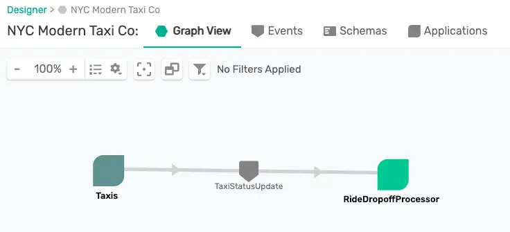

author: Marc DiPasquale
id: design-to-code-workshop
summary: This codelab walks you through how to design an EDA using the Solace PubSub+ Event Portal, export the AsyncAPI documents, generate code using the AsyncAPI generator and see your events flow across your apps!
tags: AsyncAPI, Spring, Java, Portal
categories: workshop
environments: Web
status: Published
feedback link: https://github.com/Mrc0113/design-to-code-workshop
analytics account: UA-3921398-10

# Developer Workshop: Design to Code using Portal + AsyncAPI Code Generation

## What You'll Learn
Duration: 0:05:00

## What You'll Need
Duration: 0:05:00

* Event Broker & Connection Info

* AsyncAPI Generator Requirements
  * Node.js v12.16+
  * npm v6.13.7+
  * Install instructions available [here](https://github.com/asyncapi/generator#requirements)

### Solace Event Portal 

#### Login or Sign-up

#### Import Application Domain

### Terminal Access?

## Use Case Overview
Duration: 0:05:00


## Design Your EDA
Duration: 0:05:00

Now that you're familiar with the use case and you've imported the application domain into the Event Portal let's get update our Event-Driven Architecture (EDA). 

Open the _NYC Modern Taxi Co_ Application Domain that you previously imported in the Event Portal Designer. You should see a _Taxis_ Application which publishes _TaxiStatusUpdate_ Events. We want to extend this architecture to match the design discussed for in our use case.


### Add the _RideDropoffProcessor_ Application
The first step towards doing this is to add the _RideDropoffProcessor._ To do this right click on the graph and choose _Create Application_. 

Fill in the fields as follows: 
1. **Name**: RideDropoffProcessor
1. **Description**: This is a Spring Cloud Stream microservice that will consume the TaxiStatusUpdates with a ride status of "dropoff", process the events, and output summary events. 
1. Click _Add/Remove Owners_ and choose yourself
1. Click _Add/Remove Tags_ and add "SCSt" as a tag. This tag is short for "Spring Cloud Stream" which is the framework we will use to develop our microservice later. 
1. Click the _Manage Events_ button, search for "TaxiStatusUpdate" and click _Sub_ next to it. This means that your application will subscribe to these events.
1. Click the _Save_ Button

You should now see your _RideDropoffProcessor_ added to the graph. 




### Add the _RideAverageUpdate_ Event
It's great that the _RideDropoffProcessor_ is now consuming the _TaxiStatsUpdate_ events, but we want it to process those events and publish _RideAverageUpdate_ events. To show this we need to create the _RideAverageUpdate_ event and the schema which defines it's payload. 

Right click on the graph and choose _Create Event_ 

Fill in the fields as follows: 
1. **Name**: RideAverageUpdate
1. **Description**: This event contains the average cost of rides over a specified duration
1. **Topic**: taxi/nyc/v1/stats/dropoff/avg
1. Click _Add/Remove Owners_ and choose yourself 
1. For **Payload Schema** click _Add New_ 

Positive
: When designing your own Event-Driven Architecture the defining of your topic space is an important step towards achieving the benefits promised by an EDA. Be sure to take the time to read our [Topic Architecture Best Practices](https://docs.solace.com/Best-Practices/Topic-Architecture-Best-Practices.htm).  

Since our data is JSON we'll define a JSON Schema to define our event payload. 

Fill in the fields as follows: 
1. **Name**: RideAveragePayload
1. **Description**: Event Payload which contains average meter readings, average passenger counts, and the number of rides in a given window duration.
1. **Content Type**: JSON
1. Click _Add/Remove Owners_ and choose yourself 
1. Under _Content_ paste the JSON schema in the code block below. This schema was generated from a sample message using [jsonschema.net](https://jsonschema.net) 
1. Click _Save_ 
```
{
    "$schema": "http://json-schema.org/draft-07/schema",
    "$id": "http://example.com/example.json",
    "type": "object",
    "title": "The root schema",
    "description": "The root schema comprises the entire JSON document.",
    "default": {},
    "examples": [
        {
            "timestamp": "2020-06-04T20:09:59.99832-04:00",
            "avg_meter_reading": 21.615217,
            "avg_passenger_count": 1.5,
            "window_duration_sec": 300,
            "window_ride_count": 5
        }
    ],
    "required": [
        "timestamp",
        "avg_meter_reading",
        "avg_passenger_count",
        "window_duration_sec",
        "window_ride_count"
    ],
    "additionalProperties": true,
    "properties": {
        "timestamp": {
            "$id": "#/properties/timestamp",
            "type": "string",
            "title": "The timestamp schema",
            "description": "An explanation about the purpose of this instance.",
            "default": "",
            "examples": [
                "2020-06-04T20:09:59.99832-04:00"
            ]
        },
        "avg_meter_reading": {
            "$id": "#/properties/avg_meter_reading",
            "type": "number",
            "title": "The avg_meter_reading schema",
            "description": "An explanation about the purpose of this instance.",
            "default": 0.0,
            "examples": [
                21.615217
            ]
        },
        "avg_passenger_count": {
            "$id": "#/properties/avg_passenger_count",
            "type": "number",
            "title": "The avg_passenger_count schema",
            "description": "An explanation about the purpose of this instance.",
            "default": 0.0,
            "examples": [
                1.5
            ]
        },
        "window_duration_sec": {
            "$id": "#/properties/window_duration_sec",
            "type": "integer",
            "title": "The window_duration_sec schema",
            "description": "An explanation about the purpose of this instance.",
            "default": 0,
            "examples": [
                300
            ]
        },
        "window_ride_count": {
            "$id": "#/properties/window_ride_count",
            "type": "integer",
            "title": "The window_ride_count schema",
            "description": "An explanation about the purpose of this instance.",
            "default": 0,
            "examples": [
                5
            ]
        }
    }
}
```  


Positive
: We have now created a new payload schema and the schema has automatically been added to our event. 


Go ahead and click _Save_ to complete the creation of our _RideAverageUpdate_ event.

### Update _RideDropoffProcessor_ to publish _RideAverageUpdate_ Events
Now that we've created our _RideAverageUpdate_ event and defined it's payload we need to update the _RideDropoffProcessor_ to publish it. 

To do this follow these steps: 
1. Right click on the _RideDropoffProcessor_ and choose _Edit_. 
1. Click _Manage Events_, search for "RideAverageUdpdate" and click "Pub" next to it since the _RideDropoffProcessor_ needs to publish these events. 
1. Click _Save_ 

The _RideDropoffProcessor_ is now complete and you should see it both consuming and publishing events! 


### Add the _RideDropoffConsumer_ Application
To complete the architecture for our use case we just need to add the _RideDropoffConsumer_ application. Don't worry, this one will be quick since we've already created all of the needed Events and Payloads :) 

Right click on the graph and choose _Create Application_. 
Fill in the form as follows: 
1. **Name**: RideDropoffConsumer
1. **Description**: This is a nodejs application that will consume summary events via MQTT for further analysis
1. Click _Add/Remove Owners_ and choose yourself
1. Click _Manage Events_, search for "RideAverageUpdate" and click "Sub" next to it since the _RideDropoffConsumer_ wants to subscribe to these events. 
1. Click _Save_ 


That's it! Our Use Case design is now reflected by our architecture captured in the Event Portal and we're ready for implementation!


## Install the AsyncAPI Generator
Duration: 0:03:00

Now that we've defined the architecture for our use case in the Event Portal we're ready to write some code! But we don't want to have to write everything from scatch so we're going to use the [AsyncAPI Generator](https://github.com/asyncapi/generator)

In order to use the AsyncAPI Generator we first need to install the CLI. 

If you have the prequisites installed as defined earlier in the "What You'll Need" section you should be able to pop open your terminal and use the command below to install the CLI. 

```bash
npm install -g @asyncapi/generator
```

Negative
: Note that the AsyncAPI project is continuously updated so if you previously installed the generator you can also use the command above to update to the latest. 


## Develop the RideDropoffProcessor
Duration: 0:05:00

On to developing the _RideDropoffProcessor_ microservice. As we mentioned during design we want to implement this app using the [Spring Cloud Stream](https://spring.io/projects/spring-cloud-stream) framework. For more information on the framework the [reference guide](https://cloud.spring.io/spring-cloud-static/spring-cloud-stream/current/reference/html/) is an excellent resource! 

### Generate the Code Skeleton
In the Solace Event Portal right click on the _RideDropoffProcessor_, Choose _AsyncAPI_, Choose _YAML_ and click _Download_


Open & check out the downloaded AsyncAPI document. 


It should include a lot of the information about the app that we defined via the Event Portal, including: 
* The **title** and **description** under the **info** section
* Our **events**, referred to as **messsages** in the AsyncAPI document
* The **schemas** that define the payloads of our events
* The **channels** on which the events are exchanged


Positive
: The AsyncAPI Java Spring Cloud Stream Generator Template includes many [Configuration Options](https://github.com/asyncapi/java-spring-cloud-stream-template#configuration-options) that allow you to change what the generated code will look like. 

Let's add a few of the template's configuration options to the download AsyncAPI document. 
* Add `x-scs-function-name: processDropoffRideAverages` under the _subscribe_ operation and the _publish_ operation under our two channels. By adding this you are telling the generator the name of the function you would like to handle events being exchanged and by adding the same function-name for both the _subscribe_ and the _publish_ operation you are saying you want them handled by the same function! 
* Add `x-scs-destination: taxiUpdateQueue` under the _subscribe_ operation. By adding this and using the _Solace_ binder you are specifying the durable queue name if you're using a Consumer Group, or part of the temporary queue name if you're not. This will also add a topic subscription matching the channel specified in the Asyncapi document to the queue.  

After adding those configuration options your channels section of the AsyncAPI document should look like the image below. 


Negative
: Note that by default, AsyncAPI code generator templates generate publisher code for subscribe operations and vice versa. You can switch this by setting the `info.x-view` parameter to `provider`. This parameter is automatically set in AsyncAPI documents exported from the Solace PubSub+ Event Portal. 

Our AsyncAPI document is now ready to generate the actual code so go over to your terminal and enter the command in the code snippet below. 

Note the different pieces of the command: 
* `ag` is the AsyncAPI Generator command
* `-o` is the output directory
* `-p` allows you to specify [parameters](https://github.com/asyncapi/java-spring-cloud-stream-template#parameters) defined for the template you're using
* `binder` is the Spring Cloud Stream binder you wish to use, in this case Solace
* `reactive=true` allows you to use a reactive programming style
* `actuator` includes the Spring Boot Actuator dependency which exposes a web endpoint for monitoring and stat collection
*  `artifactId` & `groupId` configure Maven params of the same names
* `javaPackage` specifies the Java Package to place the generated classes into
* `host`, `username`, `password` and `msgVpn` allow you to set binder connection information.
* The yaml file is our AsyncAPI document
* And lastly, the `@asyncapi/java-spring-cloud-stream-template` is the AsyncAPI generator template that we are using. 

```bash
ag -o RideDropoffProcessor -p binder=solace -p reactive=true -p actuator=true -p artifactId=RideDropoffProcessor -p groupId=org.taxi.nyc -p javaPackage=org.taxi.nyc -p host=localhost:55555 -p username=default -p password=default -p msgVpn=default ~/Downloads/RideDropoffProcessor.yaml @asyncapi/java-spring-cloud-stream-template
```

After running the command you should see output that ends with where you can find your generated files. 
```
Done! ✨
Check out your shiny new generated files at /private/tmp/codelab/RideDropoffProcessor.
```

💥Boom💥 We've generated our code skeleton! 

### Import and Explore the Generated Project
The generated project is a Maven project so head over to your IDE and import the project so we can add our business logic. Once imported you should see something like the image below. 


A few notes on the project: 
* The generated java classes are in the `org.taxi.nyc` package that we specified. 
* The `RideAveragePayload` and `TaxiStatusUpdatePayload` POJOs were generated from the schemas defined in our AsyncAPI document and includes getters/setters/toString/etc.
* `Application.java` contains a `processDropoffRideAverages` method which takes in a `Flux<TaxiStatusUpdatePayload>` and outputs a `Flux<RideAveragePayload>`. Note the use of `Flux` since we specified `reactive=true` when generating the code skeleton.  
* The `application.yml` file contains the Spring configuration which tells oour app how to connect to Solace using the SCSt binder as well as which message channels to bind our methods to. 
* The `pom.xml` file contains the dependencies needed for the microservice. These include the `solace-cloud-starter-stream-solace` dependency which allows you to use the Solace SCSt. Binder. 

### Subscribe to _dropoff_ events**
As of the writing of this codelab dynamic topics are not yet supported by the Event Portal or the AsyncAPI Code Generator template. Because our Taxis are publishing their _TaxiStatusUpdate_ events to a dynamic topic structure of `taxi/nyc/v1/${ride_status}/${passenger_count}/${ride_id}/${longitude}/${latitude}` we need to update the `application.yml` file to subscribe to only `dropoff` events. To do this change the `queueAdditionalSubscriptions` parameter value to `taxi/nyc/v1/dropoff/>`

Positive
: Note that the `>` symbol, when placed by itself as the last level in a topic, is a multi-level wildcard in Solace which subscribes to all events published to topics that begin with the same prefix. Example: `animals/domestic/>` matches `animals/domestic/cats` and `animals/domestic/dogs`. [More wildcard info, including a single level wildcard, can be found in docs](https://docs.solace.com/PubSub-Basics/Wildcard-Charaters-Topic-Subs.htm)

After making the update your _application.yml_ file should look like below for the `spring.cloud.stream` section 
```yaml
spring:
  cloud:
    stream:
      function:
        definition: processDropoffRideAverages
      bindings:
        processDropoffRideAverages-out-0:
          destination: taxi/nyc/v1/stats/dropoff/avg
        processDropoffRideAverages-in-0:
          destination: taxiUpdateQueue
      solace:
        bindings:
          processDropoffRideAverages-in-0:
            consumer:
              queueAdditionalSubscriptions: 'taxi/nyc/v1/dropoff/>'
```

### Fill in the Business Logic

Navigate to and open the `Application.java` file. We're going to edit the _processDropoffRideAverages_ method to add our business logic. Remember that our Use Case defines that our _RideDropoffProcessor_ should listen to the stream of `dropoff` events, capture events for a specified time window (we'll hard code 20 seconds to make it easy), calculate the averages, and publish a _RideAverageUpdate_ event for each window. 

Go ahead and code up this business logic yourself or feel free to add your business logic by looking at the code snippet available below. 


```java
package org.taxi.nyc;

import java.text.SimpleDateFormat;
import java.time.Duration;
import java.util.Date;
import java.util.function.Function;

import org.springframework.boot.SpringApplication;
import org.springframework.boot.autoconfigure.SpringBootApplication;
import org.springframework.context.annotation.Bean;

import lombok.AllArgsConstructor;
import lombok.Data;
import reactor.core.publisher.Flux;
import reactor.core.publisher.Mono;

@SpringBootApplication
public class Application {

	public static final String ISO_8601_24H_FULL_FORMAT = "yyyy-MM-dd'T'HH:mm:ss.SSSXXX";
	final SimpleDateFormat sdf = new SimpleDateFormat(ISO_8601_24H_FULL_FORMAT);

	public static void main(String[] args) {
		SpringApplication.run(Application.class);
	}

	@Bean
	public Function<Flux<TaxiStatusUpdatePayload>, Flux<RideAveragePayload>> processDropoffRideAverages() {
		return flux -> flux.log().window(Duration.ofSeconds(20)).flatMap(this::calculateAverage);
	}

	private Mono<RideAveragePayload> calculateAverage(Flux<TaxiStatusUpdatePayload> flux) {
		// Aggregate the events in those windows
		return flux
			.reduce(new Accumulator(0, 0, 0),
					(a, taxiUpdate) -> new Accumulator(a.getRideCount() + 1,
							a.getTotalMeter() + taxiUpdate.getMeterReading(),
							a.getTotalPassengers() + taxiUpdate.getPassengerCount()))
			// Calculate the window average in RideAveragePayload objects'
			.map(accumulator -> new RideAveragePayload((accumulator.getTotalMeter() / accumulator.getRideCount()),
					20, ((double) accumulator.getTotalPassengers() / accumulator.getRideCount()),
					accumulator.getRideCount(), sdf.format(new Date())))
			.log();
	}

	//Using Lombok to generate getters, setters, constructors, etc. 
	@Data
	@AllArgsConstructor
	static class Accumulator {

		private int rideCount;
		private double totalMeter;
		private int totalPassengers;
	}

}
```

**Add Lombok Support (Optional)**
Since we're using [Project Lombok](https://projectlombok.org/) to keep our code a bit shorter you'll need to update your `pom.xml` file to include this dependency. Go ahead and add the `dependenices` in your pom. If you haven't used Lombok in the past you might also need to install support for it in your IDE. Choose the _Install_ option on the project lombok webpage to select your IDE and install. 
```
    <dependency>
      	<groupId>org.projectlombok</groupId>
       	<artifactId>lombok</artifactId>
    </dependency> 
```

Negative
: If you prefer not to use Lombok go ahead and use the tools available in your IDE to generate a getter and setter for each parameter in the `Accumulator` class. You'll also need to add a Constructor that looks like `public Accumulator(int rideCount, double totalMeter, int totalPassengers)`

#### Run the app! 
Now that our app has been developed let's run it! 

If your IDE has support for Spring Boot you can run it as a Spring Boot App. 

Or run it from the terminal by navigating to the directory with the pom and running the `mvn clean spring-boot:run` command. 

Negative
: If you get an error that says something like `Web server failed to start. Port 8080 was already in use.` then change the `server.port` value in `application.yml` to an open port.

Positive
: Notice that by using Spring Cloud Stream the developer doesn't need to learn the Solace Messaging API. The developer just writes generic Spring beans and configuration, filled in by the AsyncAPI generator, in the application.yml file binds the messaging channels and connection to the broker for the developer.  

## Develop the RideDropoffConsumer
Duration: 0:05:00

### Generate the Code Skeleton

### Import and Explore the Generated Project

### Fill in the Business Logic

## Takeaways
Duration: 0:05:00
