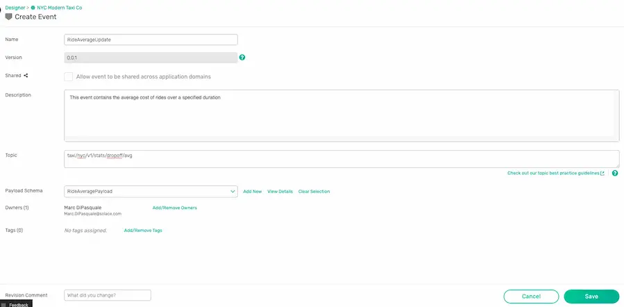
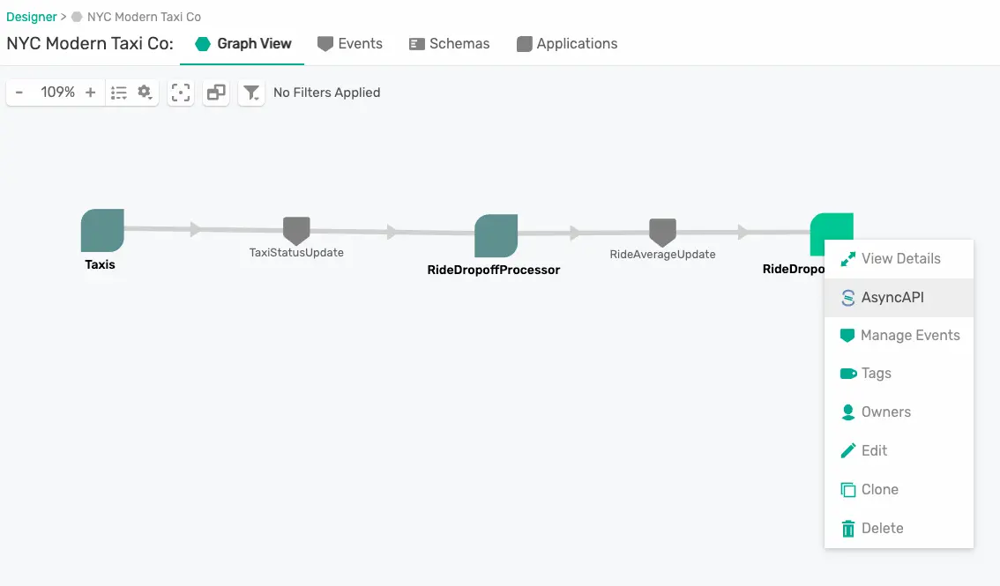
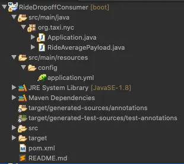

author: Marc DiPasquale
id: design-to-code-workshop
summary: This codelab walks you through how to design an EDA using the Solace PubSub+ Event Portal, export the AsyncAPI documents, generate code using the AsyncAPI generator and see your events flow across your apps!
categories: Solace, AsyncAPI, Spring, Java, Portal, Taxi
tags: workshop
environments: Web
status: Published
feedback link: https://github.com/Mrc0113/design-to-code-workshop
analytics account: UA-3921398-10

# Design to Code using Event Portal + AsyncAPI Code Generation

## What You'll Learn
Duration: 0:02:00

🚀 Welcome to this Developer Workshop! 🚀 

During this workshop we're going to use a real-world use case to explore some new technologies. We'll jump into our use case more in a little bit (hint: 🚕 🚖 🚕 ) but first let's introduce the 3 main technologies you'll be learning during this workshop. 

1. 💥 You'll be using the **Solace PubSub+ Event Portal** to design the Event-Driven Architecture for our use case. While you're likely not working as a team during this workshop think about how a tool like this would be useful as you collaborate with your team on a day to day basis to designing your architecture, implement it, and iteratively make enhancements and changes throughout your software development cycle. 
1. 💥 Second you'll be learning about the **AsyncAPI Initiative** and the **Generators** that make our lives as developers simpler.
1. 💥 Lastly, you'll develop event-driven microservices that implement our use case using the **Spring Cloud Stream** framework.

Oh, and of course you'll also be using some Java and Solace PubSub+ Event Brokers but those aren't the ⭐️ of the show today. No worries if you're not an expert in either :)

So let's get started!

Positive
: There is no code needed to start this workshop, but you can find the solution in this [Github Repo](https://github.com/Mrc0113/design-to-code-workshop)


## Use Case Overview
Duration: 0:05:00

You are a member of the engineering team at the _NYC Modern Taxi Co_, a fictional taxi cab company based in New York City. Your team is playing from behind and racing to catch up with technology innovation introduced to the industry by Rideshare competitors such as Uber and Lyft. In order for the company to survive and eventually thrive your team has convinced the board that transforming the companies' IT systems is of utmost importance. Your team has done it's research and determined that moving to an Event-Driven Architecture is essential to future rapid innovation and has already kicked this initiative off by deploying a Solace Event Mesh and updating the taxi fleet to stream real-time events that include ride and location information. We know what the fleet is up to! Now it's time to start to continually improve and provide a world class customer experience.  

In order to react in a real-time manner the team has decided that we want to process the updates as they stream in from the fleet of taxis instead of putting them directly into a datastore and then having to retrieve them to do processing later. To prototype this work, you'll see a high level design in the diagram below. Since we already have the taxi fleet streaming their updates into our PubSub+ Event Mesh we need to do three things: 

1. 🚖 Capture this high level design in the PubSub+ Event Portal where we can define our Event-Driven Architecture, including its' components: Applications, Events and Schemas. This will allow us to define the details needed to implement, visualize and extend the architecture as it evolves, and share/collaborate with our entire engineering team as we continue to innovate.  
1. 🚕 Next up we're going to create the _RideDropoffProcessor_ microservice which will subscribe to the stream of _dropoff_ taxi updates from the fleet, capture events for a specified time window (we'll use 20 seconds to make it easy), calculate the averages, and publish a new _RideAverageUpdate_ event for each window.  
1. 🚖 Lastly we'll create a _RideDropoffConsumer_ that receives the stream of _RideAverageUpdate_ events and captures them for display and further processing. 


Positive
: The dataset you will be using in this lab originally comes from the NYC Taxi & Limousine Commission's open data release of more than a billion taxi ride records. Google then extended one week worth of data (3M taxi rides) from their original pickup and drop-off points into full routes in order to simulate a fleet of taxis roaming the streets of NYC. Solace is streaming this data over Solace PubSub+ for you to analyze and process. 
<p>Terms of Use: This dataset is publicly available for anyone to use under the following terms provided by the Dataset Source — [https://data.cityofnewyork.us/](https://data.cityofnewyork.us/) — and is provided "AS IS" without any warranty, express or implied, from Solace. Solace disclaims all liability for any damages, direct or indirect, resulting from the use of the dataset.</p>

## What You'll Need
Duration: 0:08:00

🛠 This page covers the setup needed to perform this codelab. 🛠 

### AsyncAPI Generator Requirements
✅ Install instructions available [here](https://github.com/asyncapi/generator#requirements)
* Node.js v12.16+ (Check version using `node -v`)
* npm v6.13.7+  (Check version using `npm -version`)

We'll install the generator itself later 👍

### Spring Cloud Stream Requirements
✅ Spring Cloud Stream just requires Java and Maven to use 🚀  
* Java 1.8+ (Check version using `java -version`)
* Maven 3.3+ (Check version using `mvn -version`)
	* On mac you can `brew install maven`
	* Other install instructions [here](https://maven.apache.org/install.html)
* Your favorite Java IDE 💥

### PubSub+ Event Broker Connection Info
✅ The credentials below are for a public event feed found on the [Solace feed Marketplace](http://solace.dev/marketplace) that we'll use during this codelab.
* SMF Host: `tcp://taxi.messaging.solace.cloud:55555`
* Message VPN: `nyc-modern-taxi`
* Username: `public-taxi-user`
* Password: `iliketaxis`

✅ Note that this client-username has permissions to subscribe to `taxinyc/>` and `test/taxinyc/>` and permissions to publish to `test/taxinyc/>`

### Prepare PubSub+ Event Portal

#### Sign-up for Solace Cloud
✅ If you already have a Solace Cloud account just login, otherwise please sign-up for a free Solace Cloud Account using [this link](https://bit.ly/try-solace-free). Note that no credit card is required. You will receive an email to activate the account and will then be prompted to start the free trail. 


#### Import Application Domain
✅ Download the Application Domain export file: [EventPortal_Export_NYCModernTaxiCo.json]( https://github.com/Mrc0113/design-to-code-workshop/blob/master/EventPortal_Export_NYCModernTaxiCo.json)

You can download the file via curl or by cloning the git repo
```bash
curl -k -XGET https://raw.githubusercontent.com/Mrc0113/design-to-code-workshop/master/EventPortal_Export_NYCModernTaxiCo.json -o EventPortal_Export_NYCModernTaxiCo.json
```
OR
```bash
git clone https://github.com/Mrc0113/design-to-code-workshop.git
```

✅ Inside of your logged into Solace Cloud Account navigate to the Event Portal Designer by clicking "Designer" in the menu on the left. 


✅ Then import the previously downloaded Application Domain file by clicking the `Import` button at the top right of the _Designer_ and importing the  file. 


🚀 Setup complete! Let's get going! 🚀

## Design Your EDA
Duration: 0:16:00

Now that you're familiar with the use case 🚕 🚖 🚕 and you've imported the application domain into the Event Portal, let's update our Event-Driven Architecture (EDA). 

Open the _NYC Modern Taxi Co_ Application Domain that you previously imported in the Event Portal Designer. You should see a _Taxis_ Application which publishes _TaxiStatusUpdate_ Events. We want to extend this architecture to match the design discussed for in our use case.


### Add the _RideDropoffProcessor_ Application
The first step towards doing this is to add the _RideDropoffProcessor._ To do this right click on the graph and choose _Create Application_. 

Fill in the fields as follows: 
1. **Name**: RideDropoffProcessor
1. **Description**: This is a Spring Cloud Stream microservice that will consume the TaxiStatusUpdates with a ride status of "dropoff", process the events, and output summary events. 
1. Leave _Application Class_ as "Unspecified"
1. Click _Add/Remove Owners_ and choose yourself
1. Click _Add/Remove Tags_ and add "SCSt" as a tag. This tag is short for "Spring Cloud Stream" which is the framework we will use to develop our microservice later. 
1. Click the _Manage_ button, search for "TaxiStatusUpdate" and click _Sub_ next to it. This means that your application will subscribe to these events.
1. Click the _Save_ Button

✅ You should now see your _RideDropoffProcessor_ added to the graph. 


### Add the _RideAverageUpdate_ Event
It's great that the _RideDropoffProcessor_ is now consuming the _TaxiStatsUpdate_ events, but we want it to process those events and publish _RideAverageUpdate_ events. To show this we need to create the _RideAverageUpdate_ event and the schema which defines it's payload. 

Right click on the graph and choose _Create Event_ 

Fill in the fields as follows: 
1. **Name**: RideAverageUpdate
1. **Description**: This event contains the average cost of rides over a specified duration
1. **Topic Scheme**: Solace (AMQP, REST, SMF)
1. **Topic**: taxinyc/ops/monitoring/updated/v1/dropoff/avg
1. Click _Add/Remove Owners_ and choose yourself 
1. For **Payload Schema** click _Add New_ 

Positive
: When designing your own Event-Driven Architecture the defining of your topic space is an important step towards achieving the benefits promised by an EDA. Be sure to take the time to read our [Topic Architecture Best Practices](https://docs.solace.com/Best-Practices/Topic-Architecture-Best-Practices.htm).  

Since our data is JSON we'll define a JSON Schema to define our event payload. 

Fill in the fields as follows: 
1. **Name**: RideAveragePayload
1. **Description**: Event Payload which contains average meter readings, average passenger counts, and the number of rides in a given window duration.
1. **Content Type**: JSON
1. Click _Add/Remove Owners_ and choose yourself 
1. Under _Content_ paste the JSON schema in the code block below. This schema was generated from a sample message using [jsonschema.net](https://jsonschema.net) 
1. Click _Save_

```   
{
    "$schema": "http://json-schema.org/draft-07/schema",
    "$id": "http://example.com/example.json",
    "type": "object",
    "title": "The root schema",
    "description": "The root schema comprises the entire JSON document.",
    "default": {},
    "examples": [
        {
            "timestamp": "2020-06-04T20:09:59.99832-04:00",
            "avg_meter_reading": 21.615217,
            "avg_passenger_count": 1.5,
            "window_duration_sec": 300,
            "window_ride_count": 5
        }
    ],
    "required": [
        "timestamp",
        "avg_meter_reading",
        "avg_passenger_count",
        "window_duration_sec",
        "window_ride_count"
    ],
    "additionalProperties": true,
    "properties": {
        "timestamp": {
            "$id": "#/properties/timestamp",
            "type": "string",
            "title": "The timestamp schema",
            "description": "An explanation about the purpose of this instance.",
            "default": "",
            "examples": [
                "2020-06-04T20:09:59.99832-04:00"
            ]
        },
        "avg_meter_reading": {
            "$id": "#/properties/avg_meter_reading",
            "type": "number",
            "title": "The avg_meter_reading schema",
            "description": "An explanation about the purpose of this instance.",
            "default": 0.0,
            "examples": [
                21.615217
            ]
        },
        "avg_passenger_count": {
            "$id": "#/properties/avg_passenger_count",
            "type": "number",
            "title": "The avg_passenger_count schema",
            "description": "An explanation about the purpose of this instance.",
            "default": 0.0,
            "examples": [
                1.5
            ]
        },
        "window_duration_sec": {
            "$id": "#/properties/window_duration_sec",
            "type": "integer",
            "title": "The window_duration_sec schema",
            "description": "An explanation about the purpose of this instance.",
            "default": 0,
            "examples": [
                300
            ]
        },
        "window_ride_count": {
            "$id": "#/properties/window_ride_count",
            "type": "integer",
            "title": "The window_ride_count schema",
            "description": "An explanation about the purpose of this instance.",
            "default": 0,
            "examples": [
                5
            ]
        }
    }
}     
```


✅ We have now created a new payload schema and the schema has automatically been added to our event. 



✅ Go ahead and click _Save_ to complete the creation of our _RideAverageUpdate_ event.

### Update _RideDropoffProcessor_ to publish _RideAverageUpdate_ Events
Now that we've created our _RideAverageUpdate_ event and defined it's payload we need to update the _RideDropoffProcessor_ to publish it. 

To do this follow these steps: 
1. Right click on the _RideDropoffProcessor_ and choose _Manage Events_
1. Search for "RideAverageUpdate" and click "Pub" next to it since the _RideDropoffProcessor_ needs to publish these events.
1. Click _Save_ 

✅ The _RideDropoffProcessor_ is now complete and you should see it both consuming and publishing events! 


🚕 Let's go ahead and develop the first app! 🚕

## Install the AsyncAPI Generator
Duration: 0:03:00

Now that we've defined the architecture for our use case in the Event Portal we're ready to write some code! But we don't want to have to write everything from scatch so we're going to use the [AsyncAPI Generator](https://github.com/asyncapi/generator)

In order to use the AsyncAPI Generator we first need to install the CLI. 

If you have the prequisites installed as defined earlier in the "What You'll Need" section you should be able to pop open your terminal and use the command below to install the CLI. 

```bash
npm install -g @asyncapi/generator@0.53.1
```

Negative
: Note that the AsyncAPI project is continuously updated so if you previously installed the generator you can also use the command above to update to the latest. 


## Develop the RideDropoffProcessor
Duration: 0:15:00

🚕 🚖 🚕 🚖 🚕 🚖 🚕 🚖 🚕 🚖 🚕 🚖 🚕 🚖 🚕
On to developing the _RideDropoffProcessor_ microservice. As we mentioned during design we want to implement this app using the [Spring Cloud Stream](https://spring.io/projects/spring-cloud-stream) framework. For more information on the framework the [reference guide](https://cloud.spring.io/spring-cloud-static/spring-cloud-stream/current/reference/html/) is an excellent resource! 

### Generate the Code Skeleton
In the Solace Event Portal right click on the _RideDropoffProcessor_, Choose _AsyncAPI_, Choose _**YAML**_ and click _Download_


Open & check out the downloaded AsyncAPI document. 

It should include a lot of the information about the app that we defined via the Event Portal, including: 
* The **title** and **description** under the **info** section
* Our **events**, referred to as **message** in the AsyncAPI document
* The **schemas** that define the payloads of our events
* The **channels** on which the events are exchanged


Positive
: The AsyncAPI Java Spring Cloud Stream Generator Template includes many [Configuration Options](https://github.com/asyncapi/java-spring-cloud-stream-template#configuration-options) that allow you to change what the generated code will look like. 

Let's add a few of the template's configuration options to the download AsyncAPI document. 
* Add `x-scs-function-name: processDropoffRideAverages` under the _subscribe_ operation **and** the _publish_ operation under our two channels. By adding this you are telling the generator the name of the function you would like to handle events being exchanged and by adding the same function-name for both the _subscribe_ and the _publish_ operation you are saying you want them handled by the same function! 
* Add `x-scs-destination: test/taxinyc/RideDropoffProcessorQueue` under the _subscribe_ operation. By adding this and using the _Solace_ binder you are specifying the durable queue name if you're using a Consumer Group, or part of the temporary queue name if you're not. This will also add a topic subscription matching the channel specified in the Asyncapi document to the queue.  

✅ After adding those configuration options your channels section of the AsyncAPI document should look like the image below. 


Negative
: Note that by default, AsyncAPI code generator templates generate publisher code for subscribe operations and vice versa. You can switch this by setting the `info.x-view` parameter to `provider`. This parameter is automatically set in AsyncAPI documents exported from the Solace PubSub+ Event Portal. 

Our AsyncAPI document is now ready to generate the actual code so go over to your terminal and enter the command in the code snippet below. 

Note the different pieces of the command: 
* `ag` is the AsyncAPI Generator command
* `-o` is the output directory
* `-p` allows you to specify [parameters](https://github.com/asyncapi/java-spring-cloud-stream-template#parameters) defined for the template you're using
* `binder` is the Spring Cloud Stream binder you wish to use, in this case Solace
* `reactive=true` allows you to use a reactive programming style
*  `artifactId` & `groupId` configure Maven params of the same names
* `javaPackage` specifies the Java Package to place the generated classes into
* `host`, `username`, `password` and `msgVpn` allow you to set binder connection information.
* The yaml file is our AsyncAPI document
* And lastly, the `@asyncapi/java-spring-cloud-stream-template` is the AsyncAPI generator template that we are using. 

```bash
ag -o RideDropoffProcessor -p binder=solace -p reactive=true -p artifactId=RideDropoffProcessor -p groupId=org.taxi.nyc -p javaPackage=org.taxi.nyc -p host=taxi.messaging.solace.cloud:55555 -p username=public-taxi-user -p password=iliketaxis -p msgVpn=nyc-modern-taxi ~/Downloads/RideDropoffProcessor.yaml @asyncapi/java-spring-cloud-stream-template
```

✅ After running the command you should see output that ends with where you can find your generated files. 
```
Done! ✨
Check out your shiny new generated files at /private/tmp/codelab/RideDropoffProcessor.
```

💥Boom💥 We've generated our code skeleton! 

### Import and Explore the Generated Project
The generated project is a Maven project so head over to your IDE and import the project so we can add our business logic. Once imported you should see something like the image below.     


A few notes on the project: 
* The generated java classes are in the `org.taxi.nyc` package that we specified. 
* The `RideAveragePayload` and `TaxiStatusUpdatePayload` POJOs were generated from the schemas defined in our AsyncAPI document and includes getters/setters/toString/etc.
* `Application.java` contains a `processDropoffRideAverages` method which takes in a `Flux<TaxiStatusUpdatePayload>` and outputs a `Flux<RideAveragePayload>`. Note the use of `Flux` since we specified `reactive=true` when generating the code skeleton.  
* The `application.yml` file contains the Spring configuration which tells our app how to connect to Solace using the SCSt binder as well as which message channels to bind our methods to. 
* The `pom.xml` file contains the dependencies needed for the microservice. These include the `solace-cloud-starter-stream-solace` dependency which allows you to use the Solace SCSt. Binder. 

### Subscribe to _dropoff_ events
As of the writing of this codelab, dynamic topics are not yet supported by the Event Portal or the AsyncAPI Code Generator template. Because our Taxis are publishing their _TaxiStatusUpdate_ events to a dynamic topic structure of `taxinyc/ops/ride/updated/v1/${ride_status}/${driver_id}/${passenger_id}/${current_latitude}/${current_longitude}` we need to update the `application.yml` file to subscribe to only `dropoff` events. To do this change the `queueAdditionalSubscriptions` parameter value to `taxinyc/ops/ride/updated/v1/dropoff/>`

Positive
: Note that the `>` symbol, when placed by itself as the last level in a topic, is a multi-level wildcard in Solace which subscribes to all events published to topics that begin with the same prefix. Example: `animals/domestic/>` matches `animals/domestic/cats` and `animals/domestic/dogs`. [More wildcard info, including a single level wildcard, can be found in docs](https://docs.solace.com/PubSub-Basics/Wildcard-Charaters-Topic-Subs.htm)

### Publish to a personalized topic for uniqueness
Because there are potentially multiple people using a shared broker participating in this codelab at the same time we need to make sure we publish to a unique topic. Change your `spring.cloud.stream.bindings.processDropoffRideAverages-out-0.destination` to be `test/taxinyc/<YOUR_UNIQUE_NAME>/ops/ride/updated/v1/stats/dropoff/avg`. **Be sure to replace <YOUR_UNIQUE_NAME> with your name or some unique field; and remember it for later!**

✅ After making the update your _application.yml_ file should look like below for the `spring.cloud.stream` section.   
```yaml
spring:
  cloud:
    stream:
      function:
        definition: processDropoffRideAverages
      bindings:
        processDropoffRideAverages-out-0:
          destination: test/taxinyc/yourname/ops/ride/updated/v1/stats/dropoff/avg
        processDropoffRideAverages-in-0:
          destination: test/taxinyc/RideDropoffProcessorQueue
      solace:
        bindings:
          processDropoffRideAverages-in-0:
            consumer:
              queueAdditionalSubscriptions: 'taxinyc/ops/ride/updated/v1/dropoff/>'
```

### Fill in the Business Logic

Navigate to and open the `Application.java` file. We're going to edit the _processDropoffRideAverages_ method to add our business logic. Remember that our Use Case defines that our _RideDropoffProcessor_ should listen to the stream of `dropoff` events, capture events for a specified time window (we'll hard code 20 seconds to make it easy), calculate the averages, and publish a _RideAverageUpdate_ event for each window. 

Go ahead and code up this business logic yourself or feel free to add your business logic by looking at the code snippet available below. 


```java
package org.taxi.nyc;

import java.text.SimpleDateFormat;
import java.time.Duration;
import java.util.Date;
import java.util.function.Function;

import org.springframework.boot.SpringApplication;
import org.springframework.boot.autoconfigure.SpringBootApplication;
import org.springframework.context.annotation.Bean;

import lombok.AllArgsConstructor;
import lombok.Data;
import reactor.core.publisher.Flux;
import reactor.core.publisher.Mono;

@SpringBootApplication
public class Application {

	public static final String ISO_8601_24H_FULL_FORMAT = "yyyy-MM-dd'T'HH:mm:ss.SSSXXX";
	final SimpleDateFormat sdf = new SimpleDateFormat(ISO_8601_24H_FULL_FORMAT);

	public static void main(String[] args) {
		SpringApplication.run(Application.class);
	}

	@Bean
	public Function<Flux<TaxiStatusUpdatePayload>, Flux<RideAveragePayload>> processDropoffRideAverages() {
		return flux -> flux.log().window(Duration.ofSeconds(20)).flatMap(this::calculateAverage);
	}

	private Mono<RideAveragePayload> calculateAverage(Flux<TaxiStatusUpdatePayload> flux) {
		// Aggregate the events in those windows
		return flux
			.reduce(new Accumulator(0, 0, 0),
					(a, taxiUpdate) -> new Accumulator(a.getRideCount() + 1,
							a.getTotalMeter() + taxiUpdate.getMeterReading(),
							a.getTotalPassengers() + taxiUpdate.getPassengerCount()))
			// Calculate the window average in RideAveragePayload objects'
			.map(accumulator -> new RideAveragePayload((accumulator.getTotalMeter() / accumulator.getRideCount()),
					20, ((double) accumulator.getTotalPassengers() / accumulator.getRideCount()),
					accumulator.getRideCount(), sdf.format(new Date())))
			.log();
	}

	//Using Lombok to generate getters, setters, constructors, etc. 
	@Data
	@AllArgsConstructor
	static class Accumulator {

		private int rideCount;
		private double totalMeter;
		private int totalPassengers;
	}

}
```

**Add Lombok Support (Optional)**
Since we're using [Project Lombok](https://projectlombok.org/) to keep our code a bit shorter you'll need to update your `pom.xml` file to include this dependency. Go ahead and add the `dependenices` in your pom. If you haven't used Lombok in the past you might also need to install support for it in your IDE. Choose the _Install_ option on the project lombok webpage to select your IDE and install. 
```
    <dependency>
      	<groupId>org.projectlombok</groupId>
       	<artifactId>lombok</artifactId>
    </dependency> 
```

Negative
: If you prefer not to use Lombok go ahead and use the tools available in your IDE to generate a getter and setter for each parameter in the `Accumulator` class. You'll also need to add a Constructor that looks like `public Accumulator(int rideCount, double totalMeter, int totalPassengers)`

#### Run the app! 
Now that our app has been developed let's run it! 

If your IDE has support for Spring Boot you can run it as a Spring Boot App. 

Or run it from the terminal by navigating to the directory with the pom and running the `mvn clean spring-boot:run` command. 

Negative
: If you get an error that says something like `Web server failed to start. Port XXXX was already in use.` then change the `server.port` value in `application.yml` to an open port.

Positive
: Notice that by using Spring Cloud Stream the developer doesn't need to learn the Solace Messaging API. The developer just writes generic Spring beans and configuration, filled in by the AsyncAPI generator, in the application.yml file binds the messaging channels and connection to the broker for the developer. 

## Extend Your EDA Design
Duration: 0:02:00

To complete the architecture for our use case we just need to add the _RideDropoffConsumer_ application. Don't worry, this one will be quick since we've already created all of the needed Events and Payloads earlier :) 

Log into Solace Cloud and navigate to the _NYC Modern Taxi Co_ Application Domain within the Event Portal Designer. 

Right click on the graph and choose _Create Application_. 
Fill in the form as follows: 
1. **Name**: RideDropoffConsumer
1. **Description**: This is a Spring Cloud Stream microservice that will consume summary events for further analysis
1. Click _Add/Remove Owners_ and choose yourself
1. Click _Manage_, search for "RideAverageUpdate" and click "Sub" next to it since the _RideDropoffConsumer_ wants to subscribe to these events. 
1. Click _Save_ 


🚀🚀 That's it! Our full Use Case design is now reflected by our architecture captured in the Event Portal and we're ready for implementation! 🚀🚀

## Develop the RideDropoffConsumer
Duration: 0:08:00

🚕 🚖 🚕 🚖 🚕 🚖 🚕 🚖 🚕 🚖 🚕 🚖 🚕 🚖 🚕
On to developing the _RideDropoffConsumer_ microservice. We are also going to use the [Spring Cloud Stream](https://spring.io/projects/spring-cloud-stream) framework to develop this microservice, but we'll keep the business logic to a minimum this time to show just how quick it is to generate the code skeleton, slap some logic in and run the app! 

### Generate the Code Skeleton
In the Solace Event Portal right click on the _RideDropoffConsumer_, Choose _AsyncAPI_, Choose _**YAML**_ and click _Download_



🚀 Our AsyncAPI document is now ready to generate the actual code so go over to your terminal and enter the command in the code snippet below. 

Note the different pieces of the command: 
* `ag` is the AsyncAPI Generator command
* `-o` is the output directory
* `-p` allows you to specify [parameters](https://github.com/asyncapi/java-spring-cloud-stream-template#parameters) defined for the template you're using
* `binder` is the Spring Cloud Stream binder you wish to use, in this case Solace
* `artifactId` & `groupId` configure Maven params of the same names
* `javaPackage` specifies the Java Package to place the generated classes into
* `host`, `username`, `password` and `msgVpn` allow you to set binder connection information.
* The yaml file is our AsyncAPI document
* And lastly, the `@asyncapi/java-spring-cloud-stream-template` is the AsyncAPI generator template that we are using. 

```bash
ag -o RideDropoffConsumer -p binder=solace -p artifactId=RideDropoffConsumer -p groupId=org.taxi.nyc -p javaPackage=org.taxi.nyc -p host=taxi.messaging.solace.cloud:55555 -p username=public-taxi-user -p password=iliketaxis -p msgVpn=nyc-modern-taxi ~/Downloads/RideDropoffConsumer.yaml @asyncapi/java-spring-cloud-stream-template
```

✅ After running the command you should see output that ends with where you can find your generated files. 
```
Done! ✨
Check out your shiny new generated files at /private/tmp/codelab/RideDropoffConsumer.
```

### Import and Explore the Generated Project
The generated project is a Maven project so head over to your IDE and import the project so we can add our business logic. Once imported you should see something like the image below.     


A few notes on the project: 
* The generated java classes are in the `org.taxi.nyc` package that we specified. 
* The `RideAveragePayload` POJO was generated from the schema defined in our AsyncAPI document and includes getters/setters/toString/etc.
* `Application.java` contains a `taxinycOpsMonitoringUpdatedV1StatsDropoffAvgConsumer` method which is a `Consumer` that takes in a `RideAveragePayload` POJO. Note that since we didn't specify a `x-scs-function-name` this time the generator created the method name by looking at the channel name and operation (subscribe in this case). Also note the absense of `Flux` this time since we did not specify `reactive=true` when running the generator.  
* The `application.yml` file contains the Spring configuration which tells our app how to connect to Solace using the SCSt binder as well as which message channels to bind our methods to. 
* The `pom.xml` file contains the dependencies needed for the microservice. These include the `solace-cloud-starter-stream-solace` dependency which allows you to use the Solace SCSt. Binder. 

### Subscribe to your unique topic
Open the _application.yml_ file and update the `spring.cloud.stream.bindings.taxinycOpsMonitoringUpdatedV1StatsDropoffAvgConsumer-in-0.destination` to match the destination we used in our _RideDropoffProcessor_ that used `<YOUR_UNIQUE_NAME>`

After updating the `spring.cloud.stream` portion of your _application.yml_ file should look something like this:

```yaml
spring:
  cloud:
    stream:
      function:
        definition: taxinycOpsMonitoringUpdatedV1StatsDropoffAvgConsumer
      bindings:
        taxinycOpsMonitoringUpdatedV1StatsDropoffAvgConsumer-in-0:
          destination: test/taxinyc/yourname/ops/ride/updated/v1/stats/dropoff/avg
```

### Fill in the Business Logic
Obviously in the real world you'd have more complex business logic but for the sake of showing simplicity we're just going to log the _RideAverageUpdate_ events as they're received.

Open the _Application.java_ file and modify the `taxinycOpsMonitoringUpdatedV1StatsDropoffAvgConsumer` method to log the events. When you're done it should look something like the code below. 

```java
@Bean
public Consumer<RideAveragePayload> taxinycOpsMonitoringUpdatedV1StatsDropoffAvgConsumer() {
	return rideAverageUpdate -> {
		logger.info("Received Ride Average Event:" + rideAverageUpdate);
	};
}
```

That's it! The app development is complete. 
🚀🚀🚀 Was that simple enough for you!? 🚀🚀🚀

### Run the app! 
Now that our app has been developed let's run it! 

If your IDE has support for Spring Boot you can run it as a Spring Boot App. 

Or run it from the terminal by navigating to the directory with the pom and running the `mvn clean spring-boot:run` command. 

Negative
: If you get an error that says something like `Web server failed to start. Port XXXX was already in use.` then change the `server.port` value in `application.yml` to an open port.


🤯🤯 **The Microservice is now is now Running, connected to the Solace Event Broker and receiving events!** 🤯🤯


## Takeaways
Duration: 0:01:00

* ✅ The [Solace Event Portal](solace.com/products/portal) is an excellent tool to design and visualize your Event-Driven Architecture, discover what events exist, collaborate with your team and kickstart development via exporting of AsyncAPI documents. 
* ✅ [AsyncAPI Generator](https://github.com/asyncapi/generator) templates allow developers to consistently create event-driven applications by generating code skeletons that are pre-wired with the events and channels defined in the AsyncAPI documents. 
* ✅ [Spring Cloud Stream](https://spring.io/projects/spring-cloud-stream) allows developers to implement highly scalable, event-driven microservices without having to learn how to use messaging APIs. 


**Thanks for participating in this codelab!** Let us know what you thought in the [Solace Community Forum](https://solace.community) and if you found any issues along the way we'd appreciate it if you'd raise them by clicking the _Report a mistake_ button at the bottom left of this codelab. 
