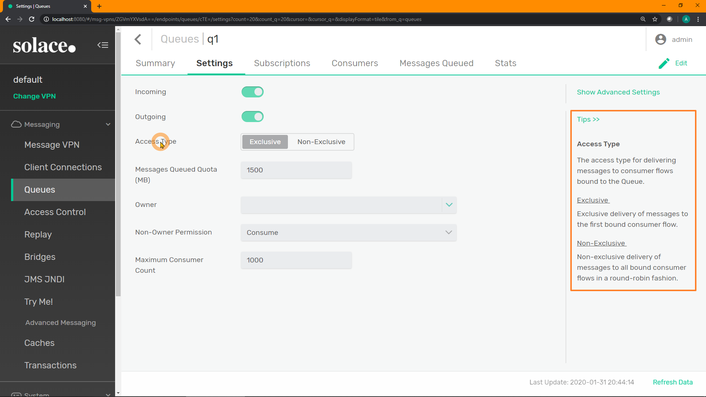
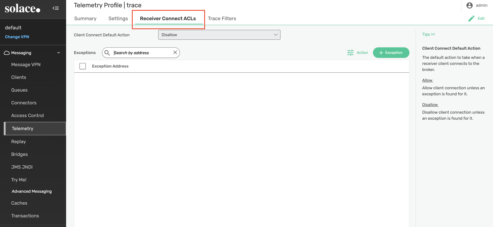
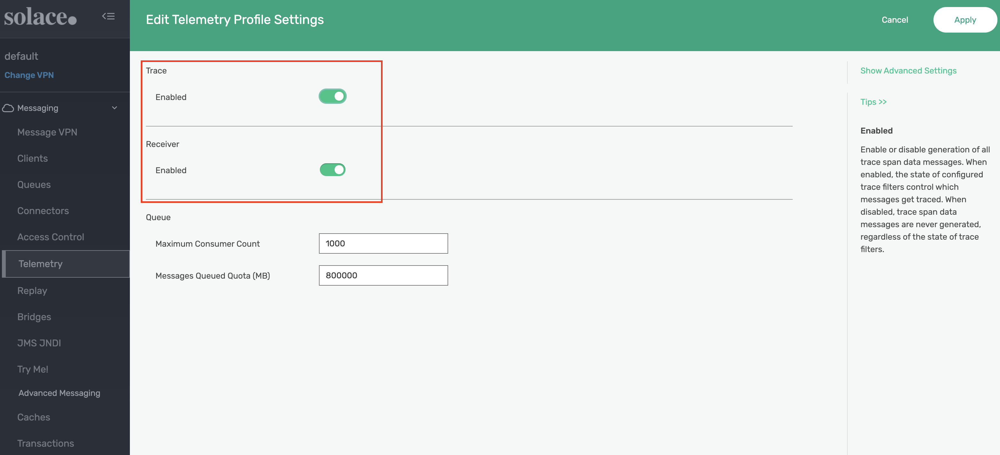
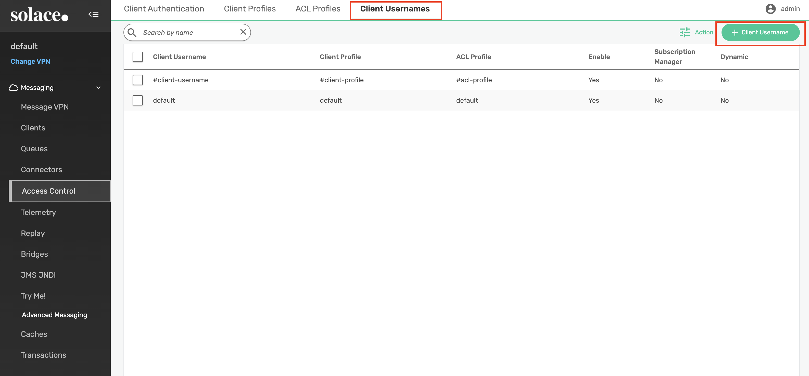
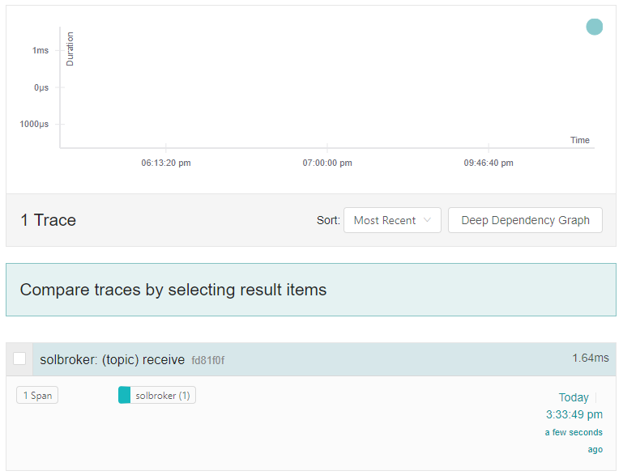
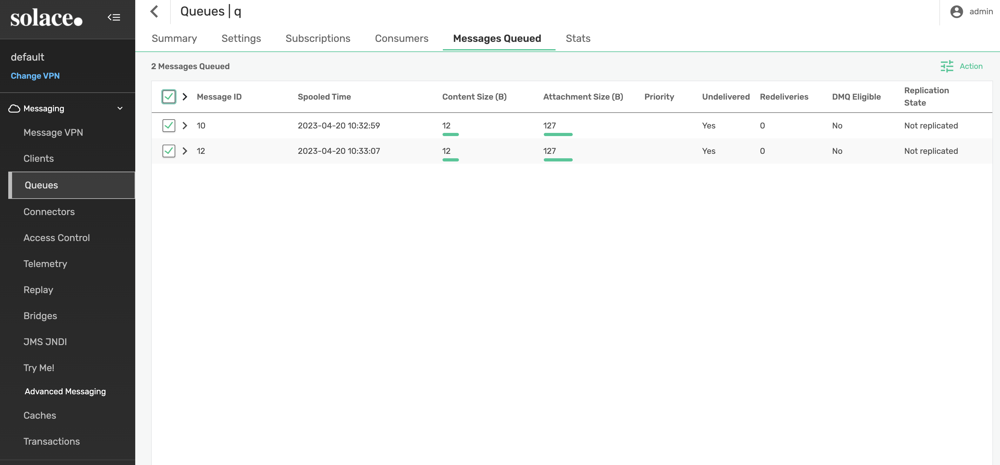
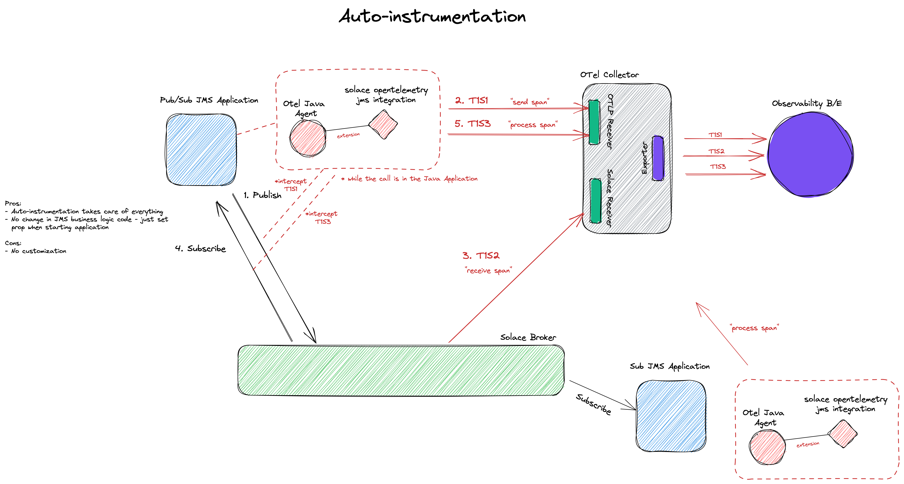
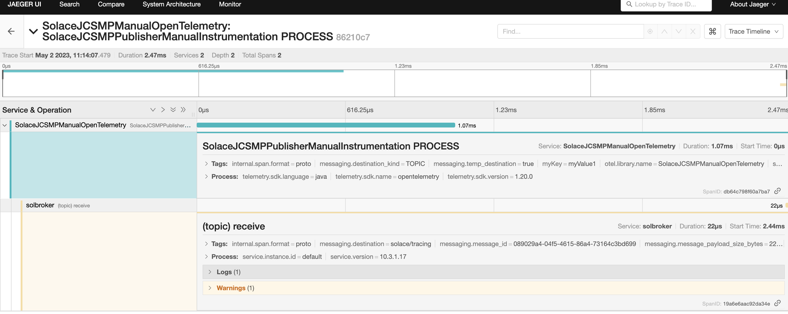

author: Mikhail Gevantmakher
summary: This Codelab will walk you through how to get started using Solace Distributed Tracing with Context Propagation
id: dt-otel
tags: 
categories: Opentelemetry, Solace
environments: Web
status: Published
feedback link: https://github.com/SolaceDev/solace-dev-codelabs/blob/master/markdown/dt-otel

# Getting Started with Solace Distributed Tracing and Context Propagation

## What you'll learn: Overview
Duration: 0:03:00

This codelab will take you through the basics of Soalce's PubSub+ Distributed Tracing feature. Following these steps will take you through:
* Launching and configuring a PubSub+ Event Broker Software
* Launching the OpenTelemetry Collector Contribution
* Launching Jaeger, the open source, end-to-end distributed tracing backend to observe our traces   
* Publishing and receiving messages to/from your broker to generate broker trace events
* Context propagation via auto-instrumented JMS applications that will generate end to end linked traces (publisher – broker – receiver traces)
* Context propagation via manual-instrumented JCSMP applications that will generate end to end linked traces (publisher – broker – receiver traces)
  
Upon successful completion of this codelab, we encourage you to experiment with distributed tracing and the environment provided to see how it fits with your use case(s). This can include other message sources, OpenTelemetry exporters, and telemetry analysis tools.

### Limitations and caveats
For this release, trace events will be generated for published messages (guaranteed and promoted direct) upon broker receipt and when the message is enqueued by the broker. This release supports context propagation to link traces for the same message from multiple sources. You can find more details about Solace's support of distributed tracing in the [documentation](https://docs.solace.com/Features/Distributed-Tracing/Distributed-Tracing-Overview.htm).

This codelabs project is provided for demonstration purposes only. The sample applications included herein (`solace-publisher` and `solace-queue-receiver`), the configuration, and the setup scripts are not intended for general use, nor do they contain necessary certificates, or configuration for a secure session connection. As such they should only be used in a local environment for feature demonstration purposes only.
Please contact your SE for support. 


### Share your findings and projects
We encourage to share your findings on the [Solace Community](https://solace.community/) and start a discussion with the other community members! And if you have any questions feel free to ask there as well


## What you need: Prerequisites
Duration: 0:5:00

### Docker
This codelab relies on the use of Docker. If you do not already have Docker installed, you will first need to do that. [Docker Desktop](https://www.docker.com/products/docker-desktop/) can be installed  for ease of use. At least 4 GiB and 2 cores should be made available for Docker. If more physical resources are available, providing more may improve your experience (e.g. 8 GiB and 4 cores).

> aside positive
> For Kubernetes instructions, please refer to the `k8s` directory in the github repository referenced below

### Java

This codelab relies on the features found in modern Java JRE version (Open JDK or Oracle JDK when appropriate license is available by user). For this demo you must have Java 16 or higher.

To validate that Java is correctly installed on your system type following commands in your console:

```bash
[solace@dev ~]$ java -version
```

If Java is correctly installed on your machine this will be printed indicating a vendor and the version of the Java installed on your machine.

```bash
[solace@dev ~]$ java -version
openjdk version "16" 2021-03-16
OpenJDK Runtime Environment (build 16+36-2231)
OpenJDK 64-Bit Server VM (build 16+36-2231, mixed mode, sharing)
```

### Source code
The [solace-dt-demo repository](https://github.com/TamimiGitHub/solace-dt-demo) contains the following:
* `docker-compose.yaml` containing the following:
  * Docker image of the Solace PubSub+ Event Broker
  * Docker image of the [OpenTelemetry Collector Contrib](https://github.com/open-telemetry/opentelemetry-collector-contrib) packaged with a Solace receiver modules
  * Docker Image for the Jaeger all in one
* `otel-collector-config.yaml`
* `solace_config_keys.env`
* `.env `(file with environment variables used in a docker compose files)
* `solace-publisher.jar` (command line Solace jms application for publishing of messages)
* `solace-queue-receiver.jar` (command line Solace jms application for receiving of messages from a JMS Queue)
* `opentelemetry-javaagent.jar` OpenTelemetry Java Instrumentation API 
* `solace-opentelemetry-jms-integration-{version}.jar` [Solace PubSub+ OpenTelemetry Integration API for JMS](https://repo1.maven.org/maven2/com/solace/solace-opentelemetry-jms-integration/1.1.0/solace-opentelemetry-jms-integration-1.1.0.jar)
* `jms-auto-instrumentation-sampler-sources.jar` (Source code for the Solace jms application for publishing and receiving messages) 

To get access to the above resources, clone the repository as follows

```bash
git clone git@github.com:TamimiGitHub/solace-dt-demo.git
cd solace-dt-demo
```

> aside negative
> Note: If you do not have SSH access configured between your local machine and your github account you will receive the following error while cloning `Permission denied (publickey). fatal: Could not read from remote repository`. To avoid that, just clone the https link as follows
> ```
> git clone https://github.com/TamimiGitHub/solace-dt-demo.git
> ```


## Launch the required containers
Duration: 0:02:00

The following command will download and launch all containers necessary for the codelab (Internet access will be required to download images from Docker hub).

```bash
[solace@dev solace-dt-demo]$ docker compose up -d

...
⠿ otel-collector Pulled                                                                     32.3s

   ⠿ 023b804a592f Pull complete                                                               0.3s
   ⠿ c03681d022c8 Pull complete                                                              31.3s
   ⠿ 2313e8fe3f45 Pull complete                                                              31.4s
 ⠿ solbroker Pulled                                                                          73.2s
   ⠿ 1d6f30850896 Pull complete                                                               9.7s
   ⠿ 39751529f01e Pull complete                                                              65.4s
   ⠿ 4f4fb700ef54 Pull complete                                                              65.5s
   ⠿ 113360f5164b Pull complete                                                              72.2s
[+] Running 4/4
 ⠿ Network solace_msg_net                         Created                                     0.1s
 ⠿ Container solace-dt-demo-jaeger-all-in-one-1  Started                                     1.5s
 ⠿ Container solace-dt-demo-solbroker-1          Started                                     1.6s
 ⠿ Container solace-dt-demo-otel-collector-1     Started   
```

> aside negative
> Be aware  the command demonstrated above is `docker compose` and not  `docker-compose`. Make sure to use a recent version. Both `docker compose` and `docker-compose` may be available on your system and could differ in version.

###  Few notes to the code lab configuration
The `.env` file contains several environment variables that are used within the `docker-compose.yaml` file and may need to be changed by user depends on the runtime environment: 

* Solace PubSub+ broker port `55557`
* OpenTelemetry contribution repository collector docker image tag and version for `otel/opentelemetry-collector-contrib`
* Solace PubSub+ broker docker image tag and version `solace/solace-pubsub-standard`

## Three Options for Config Management
Duration: 0:03:00

You can (generally) configure the Solace PubSub+ broker using three different methods; this section provides a very brief outline of those.

Each section of this codelab that performs a configuration step on the Solace broker will include all three options.


> aside negative
> Note: do not perform all 3 configuration options, just choose 1 for each section.


For any configuration management, you will need a username/password with either admin or read/write level privileges.

### A. PubSub+ Manager GUI

The PubSub+ Manager for Solace brokers is a web GUI, usually accessed on port 8080 on the software broker, port 80 of the management plane of the hardware appliance, or via the Solace Cloud console and clicking on "Manage Service" in the top right.

> aside positive
> Tip: throughout the PubSub+ Manager, by clicking on any configuration item or attribute, a "Tip" will show on the right-hand side of the screen describing the object. Built-in help!




### B. SEMP Management API

All of the commands and capabilities within the PubSub+ Manager can also be accomplished programmatically via the RESTful **Solace Element Management Protocol** (SEMP) API. For more information on the SEMP API, please consult the following links:

- [SEMPv2 Swagger Reference Documentation](https://docs.solace.com/API-Developer-Online-Ref-Documentation/swagger-ui/config/index.html)
- [SEMP User Guide](https://docs.solace.com/SEMP/Using-SEMP.htm)

> aside positive
> All API commands in the codelab assume that the software broker is running locally in docker and that the commands are executed using the default Admin credentials


### C. Command Line Interface (CLI)

The Solace **Command Line Interface** (CLI) can be reached by one of the following methods (as appropriate):

- Software broker, SSH to port 2222, and login with the admin username/password
- Software broker running as Docker container: `sudo docker exec -it <container-name> cli`
- Software broker running as machine image: login to the machine image, then: `solacectl cli`
- Hardware appliance: login to port 22 of the management VRF

Note that `show` commands can be run anywhere in CLI, from any "level".  But configuration commands must be executed in a specific order.

- [Solace CLI Reference Documentation](https://docs.solace.com/Solace-CLI/Using-Solace-CLI.htm)
- [Get Started with CLI (blog)](https://solace.com/blog/getting-started-solos-cli/)

## Message VPN Configuration
Duration: 0:03:00

To improve the user's exposure to the distributed tracing feature, the broker comes with minimal configuration. Here are the step-by-step instructions to configure your broker.
Please note that for simplicity's sake these steps will not go through configuring any TLS settings and as a result, most data will be exchanged in a non-secure manner.

The following minimal configuration is **necessary** on the Message VPN.

> aside negative
> ⚠️ If these steps aren't followed, your OpenTelemetry Collector logs will show 

```bash
"error": "no supported auth mechanism ([ANONYMOUS])".
```
This message is the Collector warning you that you're trying to connect to an unsecured resource (i.e. the broker).
</aside>

### PubSub+ Manager
Login to the PubSub+ GUI Manager, then select the default Message VPN:


Select Access Control -> Client Authentication -> Settings. Double-click the Basic Authentication Type field or click the edit icon on the right:


Select Internal database from the Type input field and click Apply:


### SEMP API
```bash
curl --location --request PATCH 'http://localhost:8080/SEMP/v2/config/msgVpns/default' \
--header 'Content-Type: application/json' \
--header 'Accept: application/json' \
--header 'Authorization: Basic YWRtaW46YWRtaW4=' \
--data '{
    "authenticationBasicType": "internal"
}'
```

### CLI

First you must access your container; do so by typing the following command.

```bash
[solace@dev solace-dt-demo]$ docker exec -it solace-dt-demo-solbroker-1 /bin/bash

This Solace product is proprietary software of
Solace Corporation. By accessing this Solace product
you are agreeing to the license terms and conditions
located at http://www.solace.com/license-software
```

Once inside the container, simply type `cli`.
Note: If you are flying through the steps too quickly, you may need to give the broker a few seconds to fully initialize itself after running the `docker compose` command from the previous section before being able to access `cli` successfully.

```bash
[appuser@solbroker sw]$ cli

Solace PubSub+ Standard Version 10.2.xxx

This Solace product is proprietary software of
Solace Corporation. By accessing this Solace product
you are agreeing to the license terms and conditions
located at http://www.solace.com/license-software

Copyright 2004-2022 Solace Corporation. All rights reserved.

To purchase product support, please contact Solace at:
https://solace.com/contact-us/

Operating Mode: Message Routing Node

solbroker>
```

The following commands will suffice.

```bash
solbroker> enable
solbroker# configure
solbroker(configure)# message-vpn default
solbroker(configure/message-vpn)# authentication basic auth-type internal
solbroker(configure/message-vpn)# end
```
## Default Client Username Configuration
Duration: 0:02:00

This Client Username will be used later for publishing messages to the broker.

### PubSub+ Manager

From the Access Control menu, select the 1) Client Usernames menu, 2.) select the default username from the list and 3.) select Edit from the Action menu:


Change the default username password to _default_ and click Apply:


### SEMP API
```bash
curl --location --request PATCH 'http://localhost:8080/SEMP/v2/config/msgVpns/default/clientUsernames/default' \
--header 'Content-Type: application/json' \
--header 'Accept: application/json' \
--header 'Authorization: Basic YWRtaW46YWRtaW4=' \
--data '{
  "password": "default"
}'
```

### CLI

```bash
solbroker# configure
solbroker(configure)# client-username default message-vpn default
solbroker(configure/client-username)# password default
solbroker(configure/client-username)# end
```

## Default Client Profile Configuration
Duration: 0:02:00

This Client Profile is used by the Client Username configured above.

### PubSub+ Manager

Remaining in the default message VPN, navigate to Access Control -> Client Profiles. Apply the following settings to the default Client Profile: 
  1. Confirm that _Send Guaranteed Messages_ is enabled. Enable if disabled.
  2. Confirm that _Receive Guaranteed Messages_ is enabled. Enable if disabled.
  3. Enable the _Reject Messages to Sender On NO Subscription Match Discard_ setting. 
     - This setting allows us to illustrate specific error behavior on the broker in a later step.


### SEMP API
```bash
curl --location --request PATCH 'http://localhost:8080/SEMP/v2/config/msgVpns/default/clientProfiles/default' \
--header 'Content-Type: application/json' \
--header 'Accept: application/json' \
--header 'Authorization: Basic YWRtaW46YWRtaW4=' \
--data '{
  "allowGuaranteedMsgReceiveEnabled": true,
  "allowGuaranteedMsgSendEnabled": true,
  "rejectMsgToSenderOnNoSubscriptionMatchEnabled": true
}'
```
### CLI

```bash
solbroker# configure
solbroker(configure)# client-profile default message-vpn default
solbroker(configure/client-profile)# message-spool reject-msg-to-sender-on-no-subscription-match
solbroker(configure/client-profile)# end
```

## Telemetry Profile Configuration
Duration: 0:03:00


The Telemetry Profile defines which published messages should be traced as well as who should be allowed to consume those trace messages.

When creating a Telemetry Profile, a Telemetry Queue is created. In this example, the queue name would be `#telemetry-trace` because we use `trace` as the profile name when creating the Telemetry Profile. 
When generated, trace messages will be added to this queue for consumption.

Creating a Telemetry Profile will also cause the broker to create a Client Profile as well as an ACL Profile. Just like the Telemetry Queue, the names of these profiles will take on the format of `#telemetry-&#60;telemetry-profile-name&#62;`.
These profiles must be used by the Client Username or else the Client will not be able to bind to the Telemetry Queue to consume trace messages.
In our demo, the `Client` is the Solace Receiver on OpenTelemetery collector. More on that to come in upcoming steps

Below is a snippet from the OpenTelemetry Collector configuration included in the solace-dt-demo downloaded earlier. Notice how the username, password, and queue name all match the settings configured on the broker.
Be sure to update the collector configuration should any of the Telemetry Profile config change on the broker.
```yaml
receivers:
  otlp:
    protocols:
      grpc:

  solace:
    broker: [solbroker:5672]
    max_unacknowledged: 500
    auth:
      sasl_plain:
        username: trace
        password: trace
    queue: queue://#telemetry-trace
    tls:
      insecure: true
      insecure_skip_verify: true
```

First, start by creating the Telemetry Profile.

### PubSub+ Manager

Within the default message VPN, navigate to Telemetry and select _Create Telemetry Profile_


Name the profile _trace_ and click Apply. We'll come back to this page later to update additional settings.


Next, we need to enable the receiver. From the trace Telemetry Profile page, select _Receiver Connect ACLs_ and update the _Client Connect Default Action_ to _Allow_
  _Tip: Double-click the input to enable edit mode_




After applying the ACL, edit the trace Telemetry Profile page to enable the _Reciever_ and _Trace_ settings.



Finally, let's create a Trace Filter and add a subscription that will attract all topic messages (using the `>` subscription)

Create the filter with name _default_. Be sure to enable before clicking Apply.


Add the `>` subscription


### SEMP API
First, start by creating the Telemetry Profile and enabling the receiver.
```bash
curl --location 'http://localhost:8080/SEMP/v2/config/msgVpns/default/telemetryProfiles' \
--header 'Content-Type: application/json' \
--header 'Accept: application/json' \
--header 'Authorization: Basic YWRtaW46YWRtaW4=' \
--data '{
  "msgVpnName": "default",
  "receiverAclConnectDefaultAction": "allow",
  "receiverEnabled": true,
  "telemetryProfileName": "trace",
  "traceEnabled": true
}'
```
Next, let's create a filter that will attract all topic messages (using the `>` subscription).
```bash
curl --location 'http://localhost:8080/SEMP/v2/config/msgVpns/default/telemetryProfiles/trace/traceFilters' \
--header 'Content-Type: application/json' \
--header 'Accept: application/json' \
--header 'Authorization: Basic YWRtaW46YWRtaW4=' \
--data '{
  "enabled": true,
  "msgVpnName": "default",
  "telemetryProfileName": "trace",
  "traceFilterName": "default"
}'
```
Add the subscription to the new filter
```bash
curl --location 'http://localhost:8080/SEMP/v2/config/msgVpns/default/telemetryProfiles/trace/traceFilters/default/subscriptions' \
--header 'Content-Type: application/json' \
--header 'Accept: application/json' \
--header 'Authorization: Basic YWRtaW46YWRtaW4=' \
--data '{
  "msgVpnName": "default",
  "subscription": ">",
  "subscriptionSyntax": "smf",
  "telemetryProfileName": "trace",
  "traceFilterName": "default"
}'
```
### CLI
First, start by creating the Telemetry Profile.
```bash
solbroker# configure
solbroker(configure)# message-vpn default
solbroker(configure/message-vpn)# create telemetry-profile trace
```

Next, open up and enable the receiver.
```bash
solbroker(configure/message-vpn/telemetry-profile)# receiver acl connect default-action allow
solbroker(configure/message-vpn/telemetry-profile)# no receiver shutdown
```

Finally, let's create a filter that will attract all topic messages (using the `>` subscription).
```bash
solbroker(configure/message-vpn/telemetry-profile)# trace
solbroker(...e/message-vpn/telemetry-profile/trace)# no shutdown
solbroker(configure/message-vpn/telemetry-profile)# create filter default
solbroker(...ge-vpn/telemetry-profile/trace/filter)# no shutdown
solbroker(...ge-vpn/telemetry-profile/trace/filter)# create subscription ">"
solbroker(...try-profile/trace/filter/subscription)# end
```

## OpenTelemetry Collector Client Username Configuration
Duration: 0:03:00

We need to create a new Client Username for binding to the Telemetry Queue because a Client Username can only be used to bind to a Telemetry Queue if it uses both the Telemetry Client Profile and Telemetry ACL Profile. Additionally, the Telemetry Client Profile does not allow the Client to publish persistent messages.

Again we reference a snippet from the OpenTelemetry Collector configuration included in the solace-dt-demo downloaded earlier. Note that the username and password in the configuration must match the credentials configured for the Client Username on the broker in the following steps.
```yaml
receivers:
  otlp:
    protocols:
      grpc:

  solace:
    broker: [solbroker:5672]
    max_unacknowledged: 500
    auth:
      sasl_plain:
        username: trace
        password: trace
    queue: queue://#telemetry-trace
    tls:
      insecure: true
      insecure_skip_verify: true
```

### PubSub+ Manager

Within the default message VPN. Navigate to Access Control -> Client Usernames and add a new Client Username.



Create the new client username with a name of _trace_. Apply the following settings to the trace client username:
  1. Enable the client username
  2. Change the password to _trace_
  3. Assign _#telemetry-trace_ for both the Client Profile and ACL Profile


### SEMP API
```bash
curl --location 'http://localhost:8080/SEMP/v2/config/msgVpns/default/clientUsernames' \
--header 'Content-Type: application/json' \
--header 'Accept: application/json' \
--header 'Authorization: Basic YWRtaW46YWRtaW4=' \
--data '{
  "aclProfileName": "#telemetry-trace",
  "clientProfileName": "#telemetry-trace",
  "clientUsername": "trace",
  "enabled": true,
  "msgVpnName": "default",
  "password": "trace"
}'
```
### CLI
```bash
solbroker# configure
solbroker(configure)# create client-username trace message-vpn default
solbroker(configure/client-username)# password trace
solbroker(configure/client-username)# client-profile #telemetry-trace
solbroker(configure/client-username)# acl-profile #telemetry-trace
solbroker(configure/client-username)# no shutdown
solbroker(configure/client-username)# end
```

## Messaging Queue Configuration
Duration: 0:03:00

Finally, create a queue for attracting messages for our producers and consumers. Add a topic subscription of `solace/tracing` to the queue.

### PubSub+ Manager

Within the default message VPN. Navigate to _Queues_ to create a queue named 'q' with the specified topic subscription.


After naming the queue, update the Non-Owner Permission to _Delete_


Navigate to the Subscriptions tab for the new queue and select '+ Subscription' to add the `solace/tracing` topic subscription.


### SEMP API
Create the queue
```bash
curl --location 'http://localhost:8080/SEMP/v2/config/msgVpns/default/queues' \
--header 'Content-Type: application/json' \
--header 'Accept: application/json' \
--header 'Authorization: Basic YWRtaW46YWRtaW4=' \
--data '{
        "msgVpnName": "default",
        "egressEnabled": true,
        "ingressEnabled":true,
        "permission": "delete",
        "queueName": "q"
        
    }'
```
Add the topic subscription
```bash
curl --location 'http://localhost:8080/SEMP/v2/config/msgVpns/default/queues/q/subscriptions' \
--header 'Content-Type: application/json' \
--header 'Accept: application/json' \
--header 'Authorization: Basic YWRtaW46YWRtaW4=' \
--data '{
  "msgVpnName": "default",
  "queueName": "q",
  "subscriptionTopic": "solace/tracing"
}'
```
### CLI
```bash
solbroker# configure
solbroker(configure)# message-spool message-vpn default
solbroker(configure/message-spool)# create queue q
solbroker(configure/message-spool/queue)# permission all delete
solbroker(configure/message-spool/queue)# subscription topic solace/tracing
solbroker(configure/message-spool/queue)# no shutdown
solbroker(configure/message-spool/queue)# end
```

## Verifying your broker configuration
Duration: 0:02:00


### Verifying your telemetry queue

As previously mentioned, a special Telemetry Queue should have been created when the Telemetry Profile was created. 
The client bound to the Telemetry Queue is the Solace Receiver Module, part of the OpenTelemetry Collector application that was launched in an earlier step.

#### PubSub+ Manager

From Queues, select the _#telemetry-trace_ queue and confirm the following settings:
  1. Current Consumers: 1
  2. Access Type: Non-Exclusive
  3. Durable: Yes 


#### SEMP API
Fetch the #telemetry-trace data form the monitor API and confirm the following settings:
  1. Current Consumers: 1
  2. Access Type: Non-Exclusive
  3. Durable: Yes
```bash
curl --location 'http://localhost:8080/SEMP/v2/monitor/msgVpns/default/queues/%23telemetry-trace' \
--header 'Accept: application/json' \
--header 'Authorization: Basic YWRtaW46YWRtaW4=' \
```

#### CLI
Now that all configuration has been applied to the broker, you should see a Bind Count of "1" on your Telemetry Queue.
```bash
solbroker# show queue #telemetry-trace

Flags Legend:
I - Ingress Admin State (U=Up, D=Down)
E - Egress  Admin State (U=Up, D=Down)
A - Access-Type         (E=Exclusive, N=Non-Exclusive)
S - Selector            (Y=Yes, N=No)
R - Redundancy          (P=Primary, B=Backup)
D - Durability          (D=Durable, N=Non-Durable)
P - Priority            (Y=Yes, N=No)

Queue Name                   Messages      Spool             Bind Status
Message VPN                   Spooled  Usage(MB)   HWM (MB) Count I E A S R D P
------------------------- ----------- ---------- ---------- ----- -------------
#telemetry-trace
default                             0       0.00       0.00     1 D U N N P D N
```

## Producing trace messages and accessing trace span in Jaeger
Duration: 0:07:00

### Publishing messages using a simple jms application

We have provided a simple JMS publishing application in `solace-publisher.jar`.   

As you follow the steps in this codelab don’t forget to replace the IP address in the command with your system's IP address if docker compose is not running on a same host.

If Docker is running on the same system (which is expected) where you are running solace-publisher, you can use the following command:

```bash
[solace@dev solace-dt-demo]$ cd src
[solace@dev solace-dt-demo]$ java -Dsolace.host=localhost:55557 \
-Dsolace.vpn=default \
-Dsolace.user=default \
-Dsolace.password=default \
-Dsolace.topic=solace/tracing -jar solace-publisher.jar
```

### Jaeger UI

As part of an earlier step, the Jaeger UI was launched. It can be accessed using your favourite browser.

If Docker is running on the same system your browser is running on, you can access the Jaeger UI using the following URI: [http://0.0.0.0:16686/](http://0.0.0.0:16686/) or [http://localhost:16686/](http://localhost:16686/).
If Docker is running on another system in your network, simply replace `0.0.0.0` to the system's IP, e.g. `http://192.168.3.166:16686/`.

### Verify published messages are traced in the Jaeger UI

After the OpenTelemetry Collector has received a message, you should be able to see the solbroker trace. Once the right service has been selected, select "Find Traces" button.


You should now see a trace for the message published using solace-publisher from the previous step.


To view more details about this trace, click on it. You can then expand various boxes so that more information is displayed.


## Jaeger UI - Searching for traces
Duration: 0:05:00


### Publishing more interesting messages

Let's publish three messages with user properties so that we can search for them on Jaeger. The messages will contain the following {key,value} pairs.

1. {myKey,myValue1}
2. {myKey,myValue2}
3. {myKey,myValue3} 

```bash
java -Dsolace.user-properties=“myKey=myValue1” -Dsolace.host=localhost:55557 -Dsolace.vpn=default -Dsolace.user=default -Dsolace.password=default -Dsolace.topic=solace/tracing -jar solace-publisher.jar
java -Dsolace.user-properties=“myKey=myValue2” -Dsolace.host=localhost:55557 -Dsolace.vpn=default -Dsolace.user=default -Dsolace.password=default -Dsolace.topic=solace/tracing -jar solace-publisher.jar
java -Dsolace.user-properties=“myKey=myValue3” -Dsolace.host=localhost:55557 -Dsolace.vpn=default -Dsolace.user=default -Dsolace.password=default -Dsolace.topic=solace/tracing -jar solace-publisher.jar
```

### Verifying traced messages in the Jaeger UI

If you look at the details for the third message published, notice how it has a tag with the user property provided by the publisher.


That value can be used for searching traces. On the Search page, search for the following tag: `messaging.solace.user_properties.myKey=myValue3`
This request should find the third message published.


### Using Jaeger to debug problems
In an earlier section, we created a queue which had a subscription to topic `solace/tracing`. Let's try publishing a message to the topic `solace/tracing2`, a topic for which no client or endpoint is subscribed.

```bash
java -Dsolace.host=localhost:55557 -Dsolace.vpn=default -Dsolace.user=default -Dsolace.password=default -Dsolace.topic=solace/tracing2 -jar solace-publisher.jar
```
Notice the message from the app `No Subscription Match - Topic 'solace/tracing2'`. The message is considered as errored because it was discarded by the broker.

From the Jaeger UI, search for the following tag `error=true`


If you select the message and expand its detailed view, you will see that the message published had `No Subscription Match`.


This information can be used to perform any corrective actions, e.g.:
* Fix the publisher and have it publish to the intended topic
* Update the broker configuration and have your queue also subscribe to topic `solace/tracing2`

## Clean-up from previous sections
Duration: 0:02:00

If there are messages on your queue from previous sections, let's take a moment to delete them.

#### PubSub+ Manager

Login to the PubSub+ Manager console and select the default message VPN. Navigate to Queues and select the 'q' queue we created earlier. From here navigate to the Messages Queued tab and select all messages.



Next, select Action -> Delete Messages and confirm.

#### SEMP API
Use the Action API to delete all spooled messages from the 'q' queue
```bash
curl --location --request PUT 'http://localhost:8080/SEMP/v2/action/msgVpns/default/queues/q/deleteMsgs' \
--header 'Content-Type: application/json' \
--header 'Accept: application/json' \
--header 'Authorization: Basic YWRtaW46YWRtaW4=' \
--data '{}'
```

#### CLI
```bash
solbroker> enable
solbroker# admin
solbroker(admin)# message-spool message-vpn default
solbroker(admin/message-spool)# delete-messages queue q
This will delete all spooled messages in q
Do you want to continue (y/n)? y
```

## Introduction to Context Propagation
Duration: 0:10:00

While the previous examples have provided the ability to trace events as they arrive at the broker, we're still lacking the context required to know what is occurring at the publisher and at the subscriber. 
In order to create a trace containing information from end to end, we need to enable context propagation at the publisher and the subscriber.

[OpenTelemetry.io](https://opentelemetry.io/docs/concepts/glossary/#context-propagation) describes Context Propagation as:

> aside positive
> Allowing all Data Sources to share an underling context mechanism for storing state and accessing data across the lifespan of a Transaction. 


In other words, Context Propagation
is the processes by which we can link individual operations such as `send`, `receive`, or `process` together into a single trace. With OpenTelemetry, these operations are identified by spans and are tied to a single trace by way of parent-child relationships. For a deeper look at Context Propagation for Distributed Tracing, check out the [Solace Docs](https://docs.solace.com/Features/Distributed-Tracing/Distributed-Tracing-Context-Propagation.htm#Context_Propagation_for_Distributed_Tracing).

Now that we know what Context Propagation is, when we can discuss two main ways for enabling it: 
- **Auto Instrumentation** - using a side agent as part of the java execution command
- **Manual Instrumentation** - tracing implemented directly in source code

### Auto Instrumentation

With [Automatic instrumentation with Java](https://opentelemetry.io/docs/instrumentation/java/automatic/), a Java agent JAR is attached to an existing Java 8+ application. The agent JAR dynamically injects bytecode to capture telemetry within the app or service. This enables the ability to add telemetry to the existing app or service without any code changes or refactoring.



### Manual Instrumentation

With Manual instrumentation, applications or services must use the [OpenTelemetry API](https://opentelemetry.io/docs/specs/otel/library-guidelines/) to implement tracing directly from the source code. Note that this process requires code changes and refactoring


While both options allow for the ability to add custom context information to traces (more on this later). Manual instrumentation provides for finer grained control. To determine the best option for your app or service, you must evaluate the time to implement, context required for traces, and existing opentelemetry api support.

In the next few sections, we'll take a look at how both auto and manual instrumentation can be implemented to enable context propagation at the edge and across your Solace broker.

## Auto-instrumentation
Duration: 0:10:00

### Run the publisher with context propagation enabled
The following command will 
1. Launch the opentelemetry java agent 
1. Configure the agent with the solace opentelemetry JMS integration solace-publisher JMS extension
1. Run the JMS `solace-publisher.jar` application and publish a message 

Additional context information will be **automatically** sent to the collector with no code changes to the JMS publishing application thanks to the opentelemetry javaagent. 

> aside positive
> Be sure to:
> 
> * Update this argument's IP to point to your collector: `-Dotel.exporter.otlp.endpoint=http://localhost:4317`
> 
> * replace `{absolute_path_to_the_jar_file}` with an absolute path to the `solace-dt-demo/src` folder on your machine. There are 2 places in the command where this needs to be done.

```bash
[solace@dev solace-dt-demo]$ 
java -javaagent:<absolute_path_to_the_jar_file>/opentelemetry-javaagent.jar \
-Dotel.javaagent.extensions=<absolute_path_to_the_jar_file>/solace-opentelemetry-jms-integration-1.1.0.jar \
-Dotel.propagators=solace_jms_tracecontext \
-Dotel.exporter.otlp.endpoint=http://localhost:4317 \
-Dotel.traces.exporter=otlp \
-Dotel.metrics.exporter=none \
-Dotel.instrumentation.jms.enabled=true \
-Dotel.resource.attributes=“service.name=SolaceJMSPublisher” \
-Dsolace.host=localhost:55557 \
-Dsolace.vpn=default \
-Dsolace.user=default \
-Dsolace.password=default \
-Dsolace.topic=solace/tracing \
-jar solace-publisher.jar
```

### Run the subscriber with context propagation enabled

The following command will 
1. Launch the opentelemetry java agent 
1. Configure the agent with the solace opentelemetry JMS integration solace-publisher JMS extension
1. Run the JMS `solace-queue-receiver.jar` application and consume the message that was just published on to the queue


> aside positive
> Be sure to:
> 
> * Update this argument's IP to point to your collector: `-Dotel.exporter.otlp.endpoint=http://localhost:4317`
> 
> * replace `{absolute_path_to_the_jar_file}` with an absolute path to the `solace-dt-demo/src` folder on your machine. There are 2 places in the command where this needs to be done.

```bash
[solace@dev solace-dt-demo]$ 
java -javaagent:<absolute_path_to_the_jar_file>/opentelemetry-javaagent.jar \
-Dotel.javaagent.extensions=<absolute_path_to_the_jar_file>/solace-opentelemetry-jms-integration-1.1.0.jar \
-Dotel.propagators=solace_jms_tracecontext \
-Dotel.traces.exporter=otlp \
-Dotel.metrics.exporter=none \
-Dotel.instrumentation.jms.enabled=true \
-Dotel.resource.attributes="service.name=SolaceJMSQueueSubscriber" \
-Dsolace.host=localhost:55557 \
-Dsolace.vpn=default \
-Dsolace.user=default \
-Dsolace.password=default \
-Dsolace.queue=q \
-Dsolace.topic=solace/tracing \
-jar solace-queue-receiver.jar
```
> aside negative
> Note: When you are done testing and wish to end the solace-queue-receiver application, simply send ctrl+c from the keyboard.

### Verify trace generated in Jaeger

A new trace should have been generated, notice how it has 3 spans.


Opening up the newly generated trace will allow you to easily follow the sequence of events.


* The first **SEND** span was generated by the publisher when the message was published.

* The second **RECEIVE** span was generated by the PubSub+ Broker when the message was received.

* The third **PROCESS** span was generated by the consumer when the message was consumed.

## Manual-instrumentation - Publisher
Duration: 0:10:00

In this section, we'll take a look at how to use the OpenTelemetry API with the [Solace PubSub+ OpenTelemetry Integration For Solace JCSMP API](https://mvnrepository.com/artifact/com.solace/solace-opentelemetry-jcsmp-integration). We'll start with a simple Publisher application that publishes messages on the `solace/tracing` topic and update it to produce spans for various operations to enable context propagation at the edges.

The related file can be found in the following directory from the [solace-dt-demo](https://github.com/TamimiGitHub/solace-dt-demo) repo `solace-dt-demo/manual-instrumentation/jcsmp-publisher/src/main/java/com/solace/samples/Publisher.java` 

After initializing the tracer in the `JcsmpTracingUtil.java` class we use _SolaceJCSMPTextMapGetter_ to extract existing context
from the message
```java
//Extract tracing context from message, if any using the SolaceJCSMPTextMapGetter
//It is always advised to extract context before injecting new one
final SolaceJCSMPTextMapGetter getter = new SolaceJCSMPTextMapGetter();
final Context extractedContext = JcsmpTracingUtil.openTelemetry.getPropagators().getTextMapPropagator()
        .extract(Context.current(), message, getter);
```

This context is then set as the parent on our new span. As we build out the span we can see how we are able to set specific span attributes and add in our custom attributes.
```java
 //Set the extract context as current context
try (Scope parent = extractedContext.makeCurrent()) {
    //Create a child span and set extracted/current context as parent of this span
    final Span sendSpan = JcsmpTracingUtil.tracer
            .spanBuilder(SERVICE_NAME + " " + SpanAttributes.MessagingOperation.SEND)
            .setSpanKind(SpanKind.CLIENT)
            .setAttribute(SpanAttributes.MessagingAttribute.DESTINATION_KIND.toString(),
                    SpanAttributes.MessageDestinationKind.TOPIC.toString())
            .setAttribute(SpanAttributes.MessagingAttribute.IS_TEMP_DESTINATION.toString(), "true")
            //Set more attributes as needed
            .setAttribute("myKey", "myValue" + ThreadLocalRandom.current().nextInt(1, 3))
            .setParent(extractedContext) // set extractedContext as parent
            .startSpan();
// continues below...
```

After creating the new span, we are able to inject it back on the message as now current context. 
After which we go ahead and send our message, making sure to catch relevant errors and end the current span. Only after ending the current span
is the data exported to the configured Opentelemetry collector.
<aside>
The OpenTelemetry collector is brought in to the application via the _opentelemetry-exporter-otlp_ library. Default settings are used to export
to the collector executing in Docker.
</aside>

```java
// ...continued from above
    try (Scope scope = sendSpan.makeCurrent()) {
        final SolaceJCSMPTextMapSetter setter = new SolaceJCSMPTextMapSetter();
        final TextMapPropagator propagator = JcsmpTracingUtil.openTelemetry.getPropagators().getTextMapPropagator();
        //and then inject new current context (set by sendSpan.makeCurrent()) in the message
        propagator.inject(Context.current(), message, setter);
        try {
            producer.send(message, topic);  // send the message
            msgSentCounter++;  // add one
            message.reset();   // reuse this message, to avoid having to recreate it: better performance
        } catch (JCSMPException e) {
            System.out.printf("### Caught while trying to producer.send(): %s%n", e);
            if (e instanceof JCSMPTransportException) {  // all reconnect attempts failed
            isShutdown = true;  // let's quit; or, could initiate a new connection attempt
        }
            throw e;
        }
    } catch (Exception e) {
        sendSpan.recordException(e); //Span can record exception if any
        sendSpan.setStatus(StatusCode.ERROR, e.getMessage()); //Set span status as ERROR/FAILED
    } finally {
        sendSpan.end(); //End sendSpan. Span data is exported when span.end() is called.
    }
}
```

We've provided a jar containing the manual implementation code from above, to run the jar and publish messages to the broker, execute the command below from the solace-dt-demo directory.

```bash
java -jar solace-samples-jcsmp-publisher-manual-instrumentation-1.0-SNAPSHOT.jar tcp://localhost:55557 default default default
```

After publishing a few messages, stop the jar by pressing `[ENTER]`.

Navigating back to the Jaeger UI, update the Service filter to _SolaceJCSMPManualOpenTelemetry_.

We should see our traces from the Publisher as well as the trace from the broker.


Clicking into trace, we can see the span created by _SolaceJCSMPPublisherManualInstrumentation_ with our custom attributes.


Next, we'll take a look at how we can manually implement tracing in the the Queue Subscriber applicaiton.

## Manual-instrumentation - Queue Subscriber
Duration: 0:10:00

As with the Publisher application, the Queue Subscriber application leverages the Solace [JCSMP API](https://docs.solace.com/API/Messaging-APIs/JCSMP-API/jcsmp-api-home.htm) to consume messages from the `q` queue and the [Solace PubSub+ OpenTelemetry Integration For Solace JCSMP API](https://mvnrepository.com/artifact/com.solace/solace-opentelemetry-jcsmp-integration) to enable tracing.

The related file can be found in the following directory from the [solace-dt-demo](https://github.com/TamimiGitHub/solace-dt-demo) repo `solace-dt-demo/manual-instrumentation/jcsmp-subscriber/src/main/java/com/solace/samples/QueueSubscriber.java`

With the Queue Subscriber, we add the tracing functionality to the `onReceive` method of the QueueFlowListen.
Again we use the _SolaceJCSMPTextMapGetter_ to extract existing context from the message.
```java
final SolaceJCSMPTextMapGetter getter = new SolaceJCSMPTextMapGetter();
final Context extractedContext = JcsmpTracingUtil.openTelemetry.getPropagators().getTextMapPropagator().extract(Context.current(), message, getter);
```

Next, we'll see that the manual implementation has enabled us customized the behavior of the QueueSubscriber to generate a span upon initial reception of the message and after our application has completed app specific processing

```java
// Set the extracted context as current context
try (Scope scope = extractedContext.makeCurrent()) {
    //Create a child span and set extracted/current context as parent of this span
    final Span receiveSpan = JcsmpTracingUtil.tracer.spanBuilder(SERVICE_NAME + " " + SpanAttributes.MessagingOperation.RECEIVE).setSpanKind(SpanKind.CLIENT).setAttribute(SpanAttributes.MessagingAttribute.DESTINATION_KIND.toString(), SpanAttributes.MessageDestinationKind.QUEUE.toString()).setAttribute(SpanAttributes.MessagingAttribute.IS_TEMP_DESTINATION.toString(), "false")
            //Set more attributes as needed
            .setAttribute("myReceiveKey", "receiveValue1")
            //.setAttribute(...)
            .setParent(extractedContext).startSpan();

    //... and then we do processing and have another span
    try {
        final Span processSpan = JcsmpTracingUtil.tracer.spanBuilder(SERVICE_NAME + " " + SpanAttributes.MessagingOperation.PROCESS).setSpanKind(SpanKind.CLIENT)
                //Set more attributes as needed
                .setAttribute("myProcessingKey", "postProcessInformation")
                //.setAttribute(...)
                .setParent(Context.current().with(receiveSpan)) // make RECEIVE span be parent
                .startSpan();
// continued below...
```
After creating both the receive and process spans, completing our custom processing, and ACK'ing the message we can go ahead and end our process and receive spans (order is important here!). Only after ending the current span is the data exported to the configured Opentelemetry collector.
<aside>

The OpenTelemetry collector is brought in to the application via the _opentelemetry-exporter-otlp_ library. Default settings are used to export
to the collector executing in Docker.

</aside>

```java
//...continued from above
        try {
            msgRecvCounter++;
            if (message.getRedelivered()) {  // useful check
                // this is the broker telling the consumer that this message has been sent and not ACKed before.
                 // this can happen if an exception is thrown, or the broker restarts, or the network disconnects
                 // perhaps an error in processing? Should do extra checks to avoid duplicate processing
                 hasDetectedRedelivery = true;
            }
             // Messages are removed from the broker queue when the ACK is received.
             // Therefore, DO NOT ACK until all processing/storing of this message is complete.
             // NOTE that messages can be acknowledged from a different thread.
             message.ackMessage();  // ACKs are asynchronous
        } catch (Exception e) {
         processSpan.recordException(e); //Span can record exception if any
         processSpan.setStatus(StatusCode.ERROR, e.getMessage()); //Set span status as ERROR/FAILED
        } finally {
         processSpan.end(); //End processSpan. Span data is exported when span.end() is called.
        }
    } finally {
     receiveSpan.end(); //End receiveSpan. Span data is exported when span.end() is called.
    }
}
```

We've provided a jar containing the manual implementation code from above, to run the jar and subscribe to the `q` queue on the broker, execute the command below from the solace-dt-demo directory.
```bash
java -jar solace-samples-jcsmp-subscriber-manual-instrumentation-1.0-SNAPSHOT.jar tcp://localhost:55557 default default default
```

After consuming the messages from the queue, stop the jar by pressing `[ENTER]`.

Back in Jaeger, we can see the new spans added to the existing traces after refreshing the search UI.

We see both the receive and process spans with their respective custom attributes.


### More samples
For more examples on how to use manual instrumentation head to the [Solace Samples](https://github.com/SolaceSamples) github org and navigate to the API of choice

## Clean-up
Duration: 0:02:00

### Removing created Docker containers

To tear down Docker containers created in an earlier step, run the following command:
```bash
[solace@dev ~] $ cd solace-dt-demo
[solace@dev solace-dt-demo] $ docker compose down
```

To remove Docker images created:
```bash
[solace@dev solace-dt-demo] $ docker image rm <image id>
```

To view the list of Docker images, you can run the following command:
```bash
[solace@dev solace-dt-demo]$ docker image ls
```
## Takeaways
Duration: 0:02:00

In this codelab, we went over 

✅ Setting up an environment the supports tracing messages in an event driven architecture system using OpenTelemetry and a distributed tracing enabled Solace PubSub+ Event Broker   
✅ Used Jaeger as the open source, end-to-end distributed tracing backend to observe our traces   
✅ Discussed the differences between Auto and Manual instrumentation instrumentation    


Thanks for participating in this codelab! Let us know what you thought in the [Solace Community Forum](https://solace.community/)! If you found any issues along the way we'd appreciate it if you'd raise them by clicking the Report a mistake button at the bottom left of this codelab.


