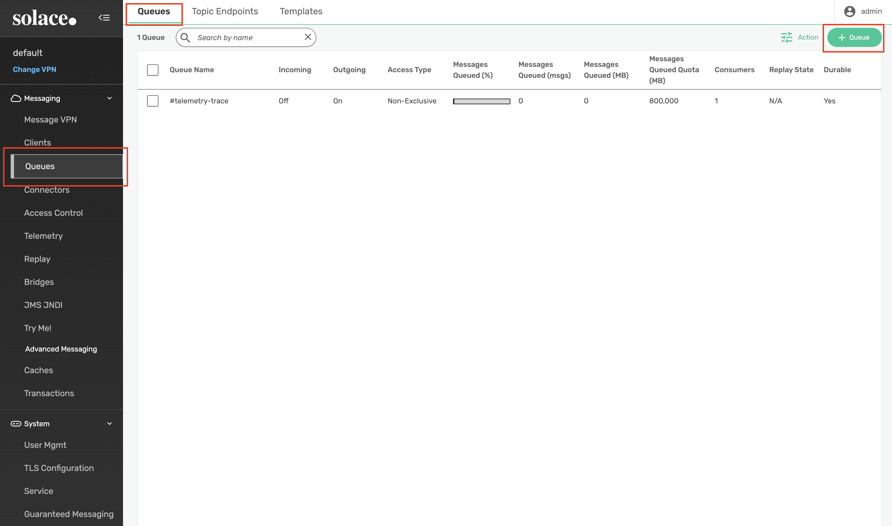
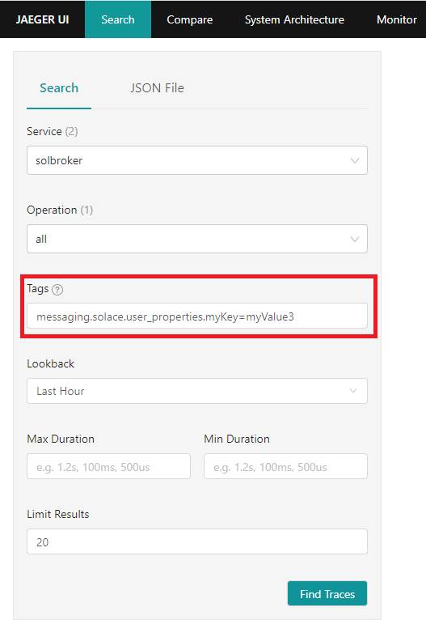
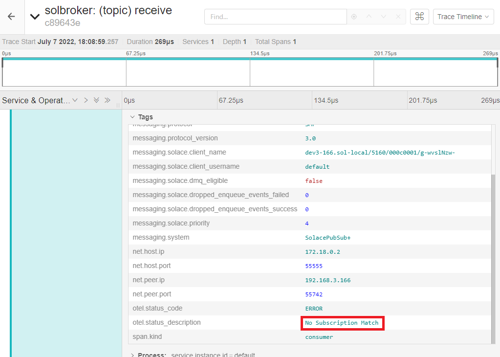
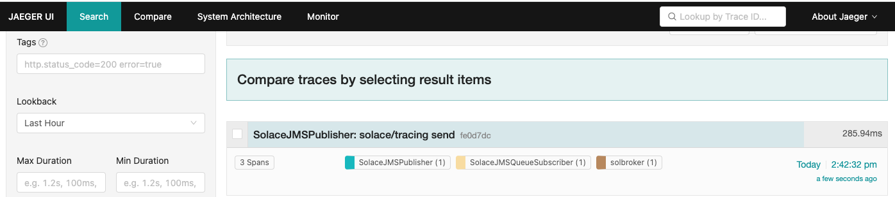

author: Mikhail Gevantmakher
summary: This Codelab will walk you through how to get started using Solace Distributed Tracing with Context Propagation
id: dt-otel
tags: 
categories: Solace, Opentelemetry
environments: Web
status: Published
feedback link: https://github.com/SolaceDev/solace-dev-codelabs/blob/master/markdown/dt-otel

# Getting Started with Solace Distributed Tracing and Context Propagation

## What you'll learn: Overview
This CodeLabs will take you through the basics of the new distributed tracing feature. Following these steps will take you through:
* Launching and configuring a PubSub+ Event Broker Software
* Launching the OpenTelemetry Collector configured to use Solace modules
* Launching Jaeger which offers a user interface to view traced events
* Publishing and receiving messages to/from your broker to generate broker trace events
* Using auto-instrumented JMS application that will generate end to end linked traces (publisher – broker – receiver traces)
  
Upon successful completion of this Code Labs, we encourage you to experiment with distributed tracing and the environment provided to see how it fits with your use case(s). This can include other message sources, Open Telemetry exporters, and telemetry analysis tools. Please note that as a Demo feature using a standard broker edition release there are some restrictions.

### Limitations and caveats
For this release, trace events will be generated for published messages (guaranteed and promoted direct) upon broker receipt and when the message is enqueued by the broker. This release supports context propagation to link traces for the same message from multiple sources.

This codelabs project is provided for demonstration purposes only. The sample applications included herein (solace-publisher and solace-queue-receiver), the configuration, and the setup scripts are not intended for general use, nor do they contain necessary certificates, or configuration for a secure session connection. As such they should only be used in a local environment for feature demonstration purposes only.
Please contact your SE for support. 

###


## What you need: Prerequisites

### Docker
This CodeLabs relies on the use of Docker. If you do not already have Docker installed, you will first need to do that. Docker Desktop can be installed  for ease of use. At least 4 GiB and 2 cores should be made available for Docker. If more physical resources are available, providing more may improve your experience (e.g. 8 GiB and 4 cores).

### Java

This CodeLabs relies on the features found in modern Java JRE version (Open JDK or Oracle JDK when appropriate license is available by user). For this demo you must have Java 16 or higher.

To validate that Java is correctly installed on your system type following commands in your console:

```console
[solace@dev ~]$ java -version
```

If Java is correctly installed on your machine this will be printed indicating a vendor and the version of the Java installed on your machine.

```console
[solace@dev ~]$ java -version
openjdk version "16" 2021-03-16
OpenJDK Runtime Environment (build 16+36-2231)
OpenJDK 64-Bit Server VM (build 16+36-2231, mixed mode, sharing)
```

### Downloading the tracing-codelab package
The tracing-codelab package contains/require the following items:
* docker-compose.yaml (Docker images will be downloaded by Docker environment upon first launch from a Docker hub):
  * Docker image of the Solace PubSub+ Event Broker
  * Docker image of the [OpenTelemetry Collector Contrib](https://github.com/open-telemetry/opentelemetry-collector-contrib) packaged with a Solace receiver modules
  * Docker Image for the Jaeger all in one
* otel-collector-config.yaml
* solace_config_keys.env
* .env (file with environment variables used in a docker compose files)
* solace-publisher.jar (command line Solace jms application for publishing of messages)
* solace-queue-receiver.jar (command line Solace jms application for receiving of messages from a JMS Queue)
* opentelemetry-javaagent-all-\<version\>.jar OpenTelemetry Java Instrumentation API 
* solace-opentelemetry-jms-integration-\<version\>.jar [Solace PubSub+ OpenTelemetry Integration API for JMS](https://repo1.maven.org/maven2/com/solace/solace-opentelemetry-jms-integration/1.0.0/solace-opentelemetry-jms-integration-1.0.0.jar)
* jms-auto-instrumentation-sampler-sources.jar (Source code for the Solace jms application for publishing and receiving messages) 

You will be able to download the following package from the Solace product [download site](https://products.solace.com/download/COMMUNITY_CODELABS_TRACING) 

When extracting from this archive, it is mandatory that there are no SPACES in the full path to the working directory.

```console
[solace@dev ~]$ unzip tracing-codelab-1.0.zip
[solace@dev ~]$ cd tracing-codelab
```

###  Creating and launching the containers

The following command will download and launch all containers necessary for the codelab (Internet access will be required to download images from Docker hub).

```console
[solace@dev tracing-codelab]$ docker compose up -d

...
⠿ otel-collector Pulled                                                                     32.3s

   ⠿ 023b804a592f Pull complete                                                               0.3s
   ⠿ c03681d022c8 Pull complete                                                              31.3s
   ⠿ 2313e8fe3f45 Pull complete                                                              31.4s
 ⠿ solbroker Pulled                                                                          73.2s
   ⠿ 1d6f30850896 Pull complete                                                               9.7s
   ⠿ 39751529f01e Pull complete                                                              65.4s
   ⠿ 4f4fb700ef54 Pull complete                                                              65.5s
   ⠿ 113360f5164b Pull complete                                                              72.2s
[+] Running 4/4
 ⠿ Network solace_msg_net                         Created                                     0.1s
 ⠿ Container tracing-codelab-jaeger-all-in-one-1  Started                                     1.5s
 ⠿ Container tracing-codelab-solbroker-1          Started                                     1.6s
 ⠿ Container tracing-codelab-otel-collector-1     Started   
```

*NOTE:* Be aware  the command demonstrated above is `docker compose` and not  `docker-compose`. Make sure to use a recent version. Both `docker compose` and `docker-compose` may be available on your system and could differ in version.

###  Few notes to the code lab configuration
The `.env` file contains several environment variables that are used within the `docker-compose.yaml` file and may need to be changed by user depends on the runtime environment: 

* Solace Pub Sub Plus broker port `55557`
* Open Telemetry contribution repository collector docker image tag and version `otel/opentelemetry-collector-contrib:0.67.0`
* Solace PubSub+ broker docker image tag and version `solace/solace-pubsub-standard:10.2`

## Three Options for Config Management
Duration: 0:03:00

You can (generally) configure the Solace PubSub+ broker using three different methods; this section provides a very brief outline of those.

Each section of this CodeLab that performs a configuration step on the Solace broker will include all three options.

Negative
: **Note:** do _not_ perform all 3 configuration options, just choose 1 for each section.

For any configuration management, you will need a username/password with either admin or read/write level privileges.

### PubSub+ Manager GUI

The PubSub+ Manager for Solace brokers is a web GUI, usually accessed on port 8080 on the software broker, port 80 of the management plane of the hardware appliance, or via the Solace Cloud console and clicking on "Manage Service" in the top right. (It is a replacement for SolAdmin, if you know that that is).

Positive
: **Tip:** throughout the PubSub+ Manager, by clicking on any configuration item or attribute, a "Tip" will show on the right-hand side of the screen describing the object. Built-in help!


### SEMP Management API

All of the commands and capabilities within the PubSub+ Manager can also be accomplished programmatically via the RESTful **Solace Element Management Protocol** (SEMP) API. For more information on the SEMP API, please consult the following links:

- [SEMPv2 Swagger Reference Documentation](https://docs.solace.com/API-Developer-Online-Ref-Documentation/swagger-ui/config/index.html)
- [SEMP User Guide](https://docs.solace.com/SEMP/Using-SEMP.htm)

<aside class="positive">
All API commands in the CodeLab assume that the software broker is running in locally in docker and that the commands are executed using the default Admin credentials
</aside>


### Command Line Interface (CLI)

The Solace **Command Line Interface** (CLI) can be reached by one of the following methods (as appropriate):

- Software broker, SSH to port 2222, and login with the admin username/password
- Software broker running as Docker container: `sudo docker exec -it <container-name> cli`
- Software broker running as machine image: login to the machine image, then: `solacectl cli`
- Hardware appliance: login to port 22 of the management VRF

Note that `show` commands can be run anywhere in CLI, from any "level".  But configuration commands must be executed in a specific order.

- [Solace CLI Reference Documentation](https://docs.solace.com/Solace-CLI/Using-Solace-CLI.htm)
- [Get Started with CLI (blog)](https://solace.com/blog/getting-started-solos-cli/)

## Message VPN Configuration

To improve the user's exposure to the distributed tracing feature, the broker comes with minimal configuration. Here are the step-by-step instructions to configure your broker.
Please note that for simplicity's sake these steps will not go through configuring any TLS settings and as a result, most data will be exchanged in a non-secure manner.

The following minimal configuration is **necessary** on the Message VPN.

<aside class="negative">
⚠️ If these steps aren't followed, your OpenTelemetry Collector logs will show 

```console
"error": "no supported auth mechanism ([ANONYMOUS])"}.
```
This message is the Collector warning you that you're trying to connect to an unsecured resource (i.e. the broker).
</aside>

### PubSub+ Manager
Login to the PubSub+ GUI Manager, then select the default Message VPN:


Select Access Control -> Client Authentication -> Settings. Double-click the Basic Authentication Type field or click the edit icon on the right:


Select Internal database from the Type input field and click Apply:


### API
```console
curl --location --request PATCH 'http://localhost:8080/SEMP/v2/config/msgVpns/default' \
--header 'Content-Type: application/json' \
--header 'Accept: application/json' \
--header 'Authorization: Basic YWRtaW46YWRtaW4=' \
--data '{
    "authenticationBasicType": "internal"
}'
```

### CLI

First you must access your container; do so by typing the following command.

```console
[solace@dev tracing-codelab]$ docker exec -it tracing-codelab-solbroker-1 /bin/bash

This Solace product is proprietary software of
Solace Corporation. By accessing this Solace product
you are agreeing to the license terms and conditions
located at http://www.solace.com/license-software
```

Once inside the container, simply type `cli`.
Note: If you are flying through the steps too quickly, you may need to give the broker a few seconds to fully initialize itself after running the `docker compose` command from the previous section before being able to access `cli` successfully.

```console
[appuser@solbroker sw]$ cli

Solace PubSub+ Standard Version 10.2.xxx

This Solace product is proprietary software of
Solace Corporation. By accessing this Solace product
you are agreeing to the license terms and conditions
located at http://www.solace.com/license-software

Copyright 2004-2022 Solace Corporation. All rights reserved.

To purchase product support, please contact Solace at:
https://solace.com/contact-us/

Operating Mode: Message Routing Node

solbroker>
```

The following commands will suffice.

```console
solbroker> enable
solbroker# configure
solbroker(configure)# message-vpn default
solbroker(configure/message-vpn)# authentication basic auth-type internal
solbroker(configure/message-vpn)# end
```
## Default Client Username Configuration

This Client Username will be used later for publishing messages to the broker.

### PubSub+ Manager

From the Access Control menu, select the 1) Client Usernames menu, 2.) select the default username from the list and 3.) select Edit from the Action menu:


Change the default username password to _default_ and click Apply:


### API
```console
curl --location --request PATCH 'http://localhost:8080/SEMP/v2/config/msgVpns/default/clientUsernames/default' \
--header 'Content-Type: application/json' \
--header 'Accept: application/json' \
--header 'Authorization: Basic YWRtaW46YWRtaW4=' \
--data '{
  "password": "default"
}'
```

### CLI

```console
solbroker# configure
solbroker(configure)# client-username default message-vpn default
solbroker(configure/client-username)# password default
solbroker(configure/client-username)# end
```

## Default Client Profile Configuration

This Client Profile is used by the Client Username configured above.

### PubSub+ Manager

Remaining in the default message VPN, navigate to Access Control -> Client Profiles. Apply the following settings to the default Client Profile: 
  1. Confirm that _Send Guaranteed Messages_ is enabled. Enable if disabled.
  2. Confirm that _Receive Guaranteed Messages_ is enabled. Enable if disabled.
  3. Enable the _Reject Messages to Sender On NO Subscription Match Discard_ setting.


### API
```console
curl --location --request PATCH 'http://localhost:8080/SEMP/v2/config/msgVpns/default/clientProfiles/default' \
--header 'Content-Type: application/json' \
--header 'Accept: application/json' \
--header 'Authorization: Basic YWRtaW46YWRtaW4=' \
--data '{
  "allowGuaranteedMsgReceiveEnabled": true,
  "allowGuaranteedMsgSendEnabled": true,
  "rejectMsgToSenderOnNoSubscriptionMatchEnabled": true
}'
```
### CLI

```console
solbroker# configure
solbroker(configure)# client-profile default message-vpn default
solbroker(configure/client-profile)# message-spool reject-msg-to-sender-on-no-subscription-match
solbroker(configure/client-profile)# end
```

## Telemetry Profile Configuration

The Telemetry Profile defines which published messages should be traced as well as who should be allowed to consume those trace messages.

When creating a Telemetry Profile, a Telemetry Queue is created. In this example, the queue name would be `#telemetry-trace` because we used `trace` as the profile name when creating the Telemetry Profile. When generated, trace messages will be added to this queue for consumption.

Also worth mentioning, creating a Telemetry Profile will also cause the broker to create a Client Profile as well as an ACL Profile. Just like the Telemetry Queue, the names of these profiles will take on the format of `#telemetry-<telemetry-profile-name>`.
These profiles must be used by the Client Username or else the Client will not be able to bind to the Telemetry Queue to consume trace messages.

First, start by creating the Telemetry Profile.

### PubSub+ Manager

Within the default message VPN, navigate to Telemetry and select _Create Telemetry Profile_


Name the profile _trace_ and click Apply. We'll come back to this page later to update additional settings.


Next, we need to enable the receiver. From the trace Telemetry Profile page, select _Receiver Connect ACLs_ and update the _Client Connect Default Action_ to _Allow_
  _Tip: Double-click the input to enable edit mode_


After applying the ACL, edit the trace Telemetry Profile page to enable the _Reciever_ and _Trace_ settings.


Finally, let's create a Trace Filter and add a subscription that will attract all topic messages (using the '>' subscription)

Create the filter with name _default_. Be sure to enable before clicking Apply.


Add the '>' subscription


### API
First, start by creating the Telemetry Profile and enabling the receiver.
```console
curl --location 'http://localhost:8080/SEMP/v2/config/msgVpns/default/telemetryProfiles' \
--header 'Content-Type: application/json' \
--header 'Accept: application/json' \
--header 'Authorization: Basic YWRtaW46YWRtaW4=' \
--data '{
  "msgVpnName": "default",
  "receiverAclConnectDefaultAction": "allow",
  "receiverEnabled": true,
  "telemetryProfileName": "trace",
  "traceEnabled": true
}'
```
Next, let's create a filter that will attract all topic messages (using the `>` subscription).
```console
curl --location 'http://localhost:8080/SEMP/v2/config/msgVpns/default/telemetryProfiles/trace/traceFilters' \
--header 'Content-Type: application/json' \
--header 'Accept: application/json' \
--header 'Authorization: Basic YWRtaW46YWRtaW4=' \
--data '{
  "enabled": true,
  "msgVpnName": "default",
  "telemetryProfileName": "trace",
  "traceFilterName": "default"
}'
```
Add the subscription to the new filter
```console
curl --location 'http://localhost:8080/SEMP/v2/config/msgVpns/default/telemetryProfiles/trace/traceFilters/default/subscriptions' \
--header 'Content-Type: application/json' \
--header 'Accept: application/json' \
--header 'Authorization: Basic YWRtaW46YWRtaW4=' \
--data '{
  "msgVpnName": "default",
  "subscription": ">",
  "subscriptionSyntax": "smf",
  "telemetryProfileName": "trace",
  "traceFilterName": "default"
}'
```
### CLI
First, start by creating the Telemetry Profile.
```console
solbroker# configure
solbroker(configure)# message-vpn default
solbroker(configure/message-vpn)# create telemetry-profile trace
```

Next, open up and enable the receiver.
```console
solbroker(configure/message-vpn/telemetry-profile)# receiver acl connect default-action allow
solbroker(configure/message-vpn/telemetry-profile)# no receiver shutdown
```

Finally, let's create a filter that will attract all topic messages (using the `>` subscription).
```console
solbroker(configure/message-vpn/telemetry-profile)# trace
solbroker(...e/message-vpn/telemetry-profile/trace)# no shutdown
solbroker(configure/message-vpn/telemetry-profile)# create filter default
solbroker(...ge-vpn/telemetry-profile/trace/filter)# no shutdown
solbroker(...ge-vpn/telemetry-profile/trace/filter)# create subscription ">"
solbroker(...try-profile/trace/filter/subscription)# end
```

## OpenTelemetry Collector Client Username Configuration

We need to create a new Client Username for binding to the Telemetry Queue because a Client Username can only be used to bind to a Telemetry Queue if it uses both the Telemetry Client Profile and Telemetry ACL Profile. Additionally, the Telemetry Client Profile does not allow the Client to publish persistent messages.

### PubSub+ Manager

Within the default message VPN. Navigate to Access Control -> Client Usernames and add a new Client Username.


Create the new client username with a name of _trace_. Apply the following settings to the trace client username:
  1. Enable the client username
  2. Change the password to _trace_
  3. Assign _#telemetry-trace_ for both the Client Profile and ACL Profile


### API
```console
curl --location 'http://localhost:8080/SEMP/v2/config/msgVpns/default/clientUsernames' \
--header 'Content-Type: application/json' \
--header 'Accept: application/json' \
--header 'Authorization: Basic YWRtaW46YWRtaW4=' \
--data '{
  "aclProfileName": "#telemetry-trace",
  "clientProfileName": "#telemetry-trace",
  "clientUsername": "trace",
  "enabled": true,
  "msgVpnName": "default",
  "password": "trace"
}'
```
### CLI
```console
solbroker# configure
solbroker(configure)# create client-username trace message-vpn default
solbroker(configure/client-username)# password trace
solbroker(configure/client-username)# client-profile #telemetry-trace
solbroker(configure/client-username)# acl-profile #telemetry-trace
solbroker(configure/client-username)# no shutdown
solbroker(configure/client-username)# end
```

## Messaging Queue Configuration
Finally, create a queue for attracting messages for our producers and consumers. Add a topic subscription of `solace/tracing` to the queue.

### PubSub+ Manager

Within the default message VPN. Navigate to _Queues_ to create a queue named 'q' with the specified topic subscription.



After naming the queue, update the Non-Owner Permission to _Delete_


Navigate to the Subscriptions tab for the new queue and select '+ Subscription' to add the 'solace/tracing' topic subscription.


### API
Create the queue
```console
curl --location 'http://localhost:8080/SEMP/v2/config/msgVpns/default/queues' \
--header 'Content-Type: application/json' \
--header 'Accept: application/json' \
--header 'Authorization: Basic YWRtaW46YWRtaW4=' \
--data '{
        "msgVpnName": "default",
        "egressEnabled": true,
        "ingressEnabled":true,
        "permission": "delete",
        "queueName": "q"
        
    }'
```
Add the topic subscription
```console
curl --location 'http://localhost:8080/SEMP/v2/config/msgVpns/default/queues/q/subscriptions' \
--header 'Content-Type: application/json' \
--header 'Accept: application/json' \
--header 'Authorization: Basic YWRtaW46YWRtaW4=' \
--data '{
  "msgVpnName": "default",
  "queueName": "q",
  "subscriptionTopic": "solace/tracing"
}'
```
### CLI
```console
solbroker# configure
solbroker(configure)# message-spool message-vpn default
solbroker(configure/message-spool)# create queue q
solbroker(configure/message-spool/queue)# permission all delete
solbroker(configure/message-spool/queue)# subscription topic solace/tracing
solbroker(configure/message-spool/queue)# no shutdown
solbroker(configure/message-spool/queue)# end
```

## Verifying your broker configuration

### Verifying your telemetry queue

As previously mentioned, a special Telemetry Queue should have been created when the Telemetry Profile was created. 
The client bound to the Telemetry Queue is the Solace Receiver Module, part of the OpenTelemetry Collector application that was launched in an earlier step.

#### PubSub+ Manager

From Queues, select the _#telemetry-trace_ queue and confirm the following settings:
  1. Current Consumers: 1
  2. Access Type: Non-Exclusive
  3. Durable: Yes 


#### API
Fetch the #telemetry-trace data form the monitor API and confirm the following settings:
  1. Current Consumers: 1
  2. Access Type: Non-Exclusive
  3. Durable: Yes
```console
curl --location 'http://localhost:8080/SEMP/v2/monitor/msgVpns/default/queues/%23telemetry-trace' \
--header 'Accept: application/json' \
--header 'Authorization: Basic YWRtaW46YWRtaW4=' \
```

#### CLI
Now that all configuration has been applied to the broker, you should see a Bind Count of "1" on your Telemetry Queue.
```console
solbroker# show queue #telemetry-trace

Flags Legend:
I - Ingress Admin State (U=Up, D=Down)
E - Egress  Admin State (U=Up, D=Down)
A - Access-Type         (E=Exclusive, N=Non-Exclusive)
S - Selector            (Y=Yes, N=No)
R - Redundancy          (P=Primary, B=Backup)
D - Durability          (D=Durable, N=Non-Durable)
P - Priority            (Y=Yes, N=No)

Queue Name                   Messages      Spool             Bind Status
Message VPN                   Spooled  Usage(MB)   HWM (MB) Count I E A S R D P
------------------------- ----------- ---------- ---------- ----- -------------
#telemetry-trace
default                             0       0.00       0.00     1 D U N N P D N
```

## Producing trace messages and accessing trace span in Jaeger

### Publishing messages using a simple jms application

We have provided a simple JMS publishing application in `solace-publisher.jar`.  
As you follow the steps in this codelab don’t forget to replace the IP address in the command with your system's IP address if docker compose is not running on a same host.

If Docker is running on the same system (which is expected) where you are running solace-publisher, you can use the following command:

```console
[solace@dev tracing-codelab]$ 
java -Dsolace.host=localhost:55557 -Dsolace.vpn=default -Dsolace.user=default -Dsolace.password=default -Dsolace.topic=solace/tracing -jar solace-publisher.jar
```

### Jaeger UI

As part of an earlier step, the Jaeger UI was launched. It can be accessed using your favourite browser.

If Docker is running on the same system your browser is running on, you can access the Jaeger UI using the following URI: [http://0.0.0.0:16686/](http://0.0.0.0:16686/) or [http://localhost:16686/](http://localhost:16686/).
If Docker is running on another system in your network, simply replace `0.0.0.0` to the system's IP, e.g. `http://192.168.3.166:16686/`.

### Verify published messages are traced in the Jaeger UI

After the OpenTelemetry Collector has received a message, you should be able to see the solbroker trace. Once the right service has been selected, select "Find Traces" button.


You should now see a trace for the message published using solace-publisher from the previous step.


To view more details about this trace, click on it. You can then expand various boxes so that more information is displayed.


## Jaeger UI - Searching for traces

### Publishing more interesting messages

Let's publish three messages with user properties so that we can search for them on Jaeger. The messages will contain the following {key,value} pairs.

1. {myKey,myValue1}
2. {myKey,myValue2}
3. {myKey,myValue3} 

```console
java -Dsolace.user-properties=“myKey=myValue1” -Dsolace.host=localhost:55557 -Dsolace.vpn=default -Dsolace.user=default -Dsolace.password=default -Dsolace.topic=solace/tracing -jar solace-publisher.jar
java -Dsolace.user-properties=“myKey=myValue2” -Dsolace.host=localhost:55557 -Dsolace.vpn=default -Dsolace.user=default -Dsolace.password=default -Dsolace.topic=solace/tracing -jar solace-publisher.jar
java -Dsolace.user-properties=“myKey=myValue3” -Dsolace.host=localhost:55557 -Dsolace.vpn=default -Dsolace.user=default -Dsolace.password=default -Dsolace.topic=solace/tracing -jar solace-publisher.jar
```

### Verifying traced messages in the Jaeger UI

If you look at the details for the third message published, notice how it has a tag with the user property provided by the publisher.


That value can be used for searching traces. On the Search page, search for the following tag: `messaging.solace.user_properties.myKey=myValue3`
This request should find the third message published.


### Using Jaeger to debug problems
In an earlier section, we created a queue which had a subscription to topic `solace/tracing`. Let's try publishing a message to the topic `solace/tracing2`, a topic for which no client or endpoint is subscribed.

```console
java -Dsolace.host=localhost:55557 -Dsolace.vpn=default -Dsolace.user=default -Dsolace.password=default -Dsolace.topic=solace/tracing2 -jar solace-publisher.jar
```
Notice the message from the app `No Subscription Match - Topic 'solace/tracing2'`. The message is considered as errored because it was discarded by the broker.

From the Jaeger UI, search for the following tag `error=true`


If you select the message and expand its detailed view, you will see that the message published had `No Subscription Match`.


This information can be used to perform any corrective actions, e.g.:
* Fix the publisher and have it publish to the intended topic
* Update the broker configuration and have your queue also subscribe to topic `solace/tracing2`


## Adding context to messages published (JMS automatic instrumentation)

### Clean-up from previous sections
If there are messages on your queue from previous sections, let's take a moment to delete them.

#### PubSub+ Manager

Login to the PubSub+ Manager console and select the default message VPN. Navigate to Queues and select the 'q' queue we created earlier. From here navigate to the Messages Queued tab and select all messages.


Next, select Action -> Delete Messages and confirm.

#### API
Use the Action API to delete all spooled messages from the 'q' queue
```console
curl --location --request PUT 'http://localhost:8080/SEMP/v2/action/msgVpns/default/queues/q/deleteMsgs' \
--header 'Content-Type: application/json' \
--header 'Accept: application/json' \
--header 'Authorization: Basic YWRtaW46YWRtaW4=' \
--data '{}'
```

#### CLI
```console
solbroker> enable
solbroker# admin
solbroker(admin)# message-spool message-vpn default
solbroker(admin/message-spool)# delete-messages queue q
This will delete all spooled messages in q
Do you want to continue (y/n)? y
```

### Using solace-publisher app with auto-instrumentation

This command will launch the solace-publisher application and publish a message as well as push additional context information to the collector. Be sure to update this argument's IP to point to your collector: `-Dotel.exporter.otlp.endpoint=http://localhost:4317`

Be sure to replace <absolute_path_to_the_jar_file> with an absolute path to the `tracing-codelab` folder on your machine. There are 2 places in the command where this needs to be done.

```console
[solace@dev tracing-codelab]$ 
java -javaagent:<absolute_path_to_the_jar_file>/opentelemetry-javaagent-all-1.19.0.jar -Dotel.javaagent.extensions=<absolute_path_to_the_jar_file>/solace-opentelemetry-jms-integration-1.0.0.jar -Dotel.propagators=solace_jms_tracecontext -Dotel.exporter.otlp.endpoint=http://localhost:4317 -Dotel.traces.exporter=otlp -Dotel.metrics.exporter=none -Dotel.instrumentation.jms.enabled=true -Dotel.resource.attributes=“service.name=SolaceJMSPublisher” -Dsolace.host=localhost:55557 -Dsolace.vpn=default -Dsolace.user=default -Dsolace.password=default -Dsolace.topic=solace/tracing -jar solace-publisher.jar
```

The following command will launch solace-queue-receiver application to consume the message that was just published as well as provide additional context information directly to the collector about this message being consumed.

Be sure also here to replace <absolute_path_to_the_jar_file> with an absolute path to the `tracing-codelab` folder on your machine. There are 2 places in the command where this needs to be done.

```console
[solace@dev tracing-codelab]$ 
java -javaagent:<absolute_path_to_the_jar_file>/opentelemetry-javaagent-all-1.19.0.jar -Dotel.javaagent.extensions=<absolute_path_to_the_jar_file>/solace-opentelemetry-jms-integration-1.0.0.jar -Dotel.propagators=solace_jms_tracecontext -Dotel.traces.exporter=otlp -Dotel.metrics.exporter=none -Dotel.instrumentation.jms.enabled=true -Dotel.resource.attributes="service.name=SolaceJMSQueueSubscriber" -Dsolace.host=localhost:55557 -Dsolace.vpn=default -Dsolace.user=default -Dsolace.password=default -Dsolace.queue=q -Dsolace.topic=solace/tracing -jar solace-queue-receiver.jar
```

When you are done testing and wish to end the solace-queue-receiver applicaiton, simply send ctrl+c from the keyboard.

### Verify trace generated in Jaeger


A new trace should have been generated, notice how it has 3 spans.


Opening up the newly generated trace will allow you to easily follow the sequence of events.


The first span was generated by the publisher when the message was published.

The second span was generated by the PubSub+ Broker when the message was received.

The third span was generated by the consumer when the message was received.


## Clean-up

### Removing created Docker containers

To tear down Docker containers created in an earlier step, run the following command:
```console
[solace@dev ~] $ cd tracing-codelab
[solace@dev tracing-codelab] $ docker compose down
```

To remove Docker images created:
```console
[solace@dev tracing-codelab] $ docker image rm <image id>
```

To view the list of Docker images, you can run the following command:
```console
[solace@dev tracing-codelab]$ docker image ls
```

Thanks for participating in this Code Labs! If you have found any issues along the way we'd appreciate it if you'd raise them by clicking the Report a mistake button found at the bottom left.


