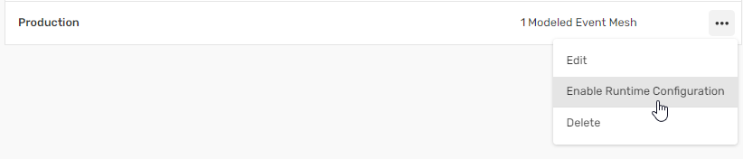

author: jessemenning
summary: Establishes connectivity between Event Portal, Pub Sub+ Event Broker (the runtime component) and the Event Management Agent.  This in turn enables config push
id: ep-connect-ep-broker
tags: eventportal
categories: eventportal
environments: Web
status: Hidden
feedback link: https://github.com/SolaceDev/solace-dev-codelabs/blob/master/markdown/ep-connect-ep-broker

# Connecting Event Portal to a runtime Event Broker

## What you'll learn: Overview

Duration: 0:05:00

Delivering innovative event-driven features to the hands of users means moving micro-integrations from development to production.  That means getting the right event infrastructure in the right environment at the right time. Event Portal makes that easier, faster and more resilient.

This code lab establishes connectivity between Event Portal, Pub Sub+ Event Broker (the runtime component) and the Event Management Agent.  This in turn enables config push, which we will explore in the next Codelab.

> aside positive
> If you run into issues, please utilize the Slack channel #techmesh-troubleshooting


## What you need: Prerequisites

Duration: 0:07:00

* Postman installed on a local machine, you can [download it for free](https://www.postman.com/downloads/).
* Docker installed on a local machine.  If you are using Podman, please note that you will need to use different commands later in the lab.
* A completely empty Event Portal account.  Do **not** use accounts like se-demo or se-all.  All TechMesh attendees should have received a dedicated account.   If you have not, please contact Mark Barrington-Little at Mark.Barrington-Little@solace.com

## Start a local event broker

Follow the instructions for [Setting Up Container Images](https://docs.solace.com/Software-Broker/SW-Broker-Set-Up/Containers/Set-Up-Container-Image.htm)

## Use Postman to populate Event Portal Environments and MEMs
### Get an Event Portal Access Token
Duration: 0:07:00
1. Log into your newly created Solace Platform Account
1. Go to Token Management in Event Portal <br><<br><br>
1. Create a token<br><br><br>
1. Name the token ```Demo Setup```
1. Give the token full Read and Write access to:<br>
Event Portal 2.0<br>
Event Portal<br>
Account Management<br>
Environments
1. Click on Create Token <br><br><br><br>
1. Confirm that your token has the following permissions:<br><br><br>
1. Copy the token value and save it in a text file on your desktop. 
> aside positive
> This token will be used multiple times through the demo, so keep it handy.

### Import scripts into Postman
Duration: 0:03:00
1. Launch the desktop Postman applicatication
1. Download the Postman Collection and Environment files below:<br>
[Environment file](https://raw.githubusercontent.com/SolaceLabs/PostmanScripts/main/EventPortalEnvironment.postman_environment.json)<br>
[Script to populate Event Portal](https://raw.githubusercontent.com/SolaceLabs/PostmanScripts/main/PopulateEventPortaldemo.postman_collection.json)<br>
[Script to remove all objects from  Event Portal](https://raw.githubusercontent.com/SolaceLabs/PostmanScripts/main/TearDownEventPortal.postman_collection.json)
1. Drag the files from your hard drive to the left-hand column of Postman to import<br><br><br>

### Configure Postman with your Event Portal token
Duration: 0:05:00
1. Open the environment variables tab (1), select the Event Portal Environment and (2) set it as the active Environmental variables.<br><br><br>
1. Fill in the CURRENT VALUE column for  api_key with the token you just generated in Event Portal.<br><br><br>
1. Save the environment variables.<br><br><br>

### Run the Postman script
Duration: 0:10:00
1. Switch back to the Collections tab, hit the three dots next to “Generate and populate Event Portal demo”, then click “Run collection”<br><br><br>
1. On the next screen, click on Run Generate and populate Event Portal<br><br><br>
1. Wait for the script to complete. Be patient, there are a lot of commands to run! 


## Enable runtime configuration for your environments
Duration: 0:03:00
1. To guide application promotion, Event Portal models all of your runtime environments.  To do this, go to the profile icon in the lower left hand side, then click on Environments.<br><br><br>
1. To allow Event Portal to configure the runtime environment, click on the three dots, then select Enable Runtime Configuration. Do this for both Test and Prod.<br><br><br>
## Update the event management agent to connect to your local broker
Duration: 0:10:00

> aside positive
> If you are using Podman instead of Docker, you'll need to replace ```docker``` with ```podman``` in all command line entries.


1. Open the Runtime Event Manager (1), then go to the Event Management Agent tab (2).   Click on the 3 dots next to your Event Managment Agent (the script created one for you).  Then click on Edit Connection Details (4).<br><br><br>
1. On the next screen, click on the three dots next to the PROD-solace event broker, then click on “Edit Connection Details”<br><br><br>
1. Update the Message VPN, SEMP username and SEMP URL to point to your local broker.<br>
Message VPN (1) is typically: ```default```<br>
SEMP username (2) is typically: ```admin```<br>
SEMP URL (3) can be found, if using docker by finding the brokers ip address using the following command:<br> ```docker inspect  -f '{{range.NetworkSettings.Networks}}{{.IPAddress}}{{end}}' solace```

Once you have the ip address, the SEMP_URL is typically port 8080, thus ```http://BROKER-IP:8080```  <br><br> Once properly configured, click on Save Changes (4)<br><br><br>

## Run the Event Management Agent
Duration: 0:10:00

> aside positive
> These instructions are also on the Event Portal once you create the Event Management Agent.

> aside positive
> If you are using Podman instead of Docker, you'll need to replace ```docker``` with ```podman``` in all command line entries.

> aside negative
> If you are using a Mac with an m chip, you may get the error<br>
>``` WARNING: The requested image's platform (linux/amd64) does not match the detected host platform (linux/arm64/v8) and no specific platform was requested ```
><br>You can ignore this warning.


Now it’s time to connect the Event Portal model and the runtime broker using the Event Management Agent.

1. From the main Runtime Event Manager tab, click on the three dots and go to Install Event Management Agent<br><br><br>
1. Click on the download button and save the file to your hard drive. <br><br><br>
1. Execute the following commands at the command line:
```
export PASSWORD_ENV_VAR_1=envVarPassword1
export PASSWORD_ENV_VAR_2=envVarPassword2
docker run -d -p 8180:8180 -v /absolute/path/to/your/ema/config.yml:/config/ema.yml \
--env PRODsolace_SOLACE_SEMP_PASSWORD=${PASSWORD_ENV_VAR_1} \
--env TESTsolace_SOLACE_SEMP_PASSWORD=${PASSWORD_ENV_VAR_2} \
--name event-management-agent solace/event-management-agent:latest
```
where ```PASSWORD_ENV_VAR_1``` is the password for your locally running broker and ```/absolute/path/to/your/ema/config.yml```  points to your downloaded EMA configuration.

4. Confirm the connection by running:<br>
```docker logs -f event-management-agent```<br>

The last line should be: ```Started event-management agent```<br><br><br>
5. Further confirm by going back to the Event Management Agents tab.  Look to see your EMA has a green “Connected” label<br><br><br>


## Confirm EMA Connection to Broker using an Audit
Duration: 0:05:00

Since the EMA is used for both audit and for config push, we will confirm broker connectivity by running an audit.
1. Go to Runtime Event Manager, then click on the ```us-central-solace-Prod``` modelled event mesh.<br><br><br>
1. Click on Audit, then “Run Discovery Scan”<br><br><br>
1. Confirm you want to run a Discovery Scan<br><br><br>
1. If you see this message, you’ve successfully created a connection between the EMA and your event broker.<br><br><br>

You are done!

## Takeaways

Duration: 0:03:00

Delivering innovative event-driven features to the hands of users means moving micro-integrations from development to production. That means getting the right event infrastructure in the right environment at the right time. Event Portal makes that easier, faster and more resilient.

This code lab establishes connectivity between Event Portal, Pub Sub+ Event Broker (the runtime component) and the Event Management Agent. This in turn enables config push, which we will explore in the next Codelab.


Thanks for participating in this codelab! Let us know what you thought in the [Solace Community Forum](https://solace.community/)! If you found any issues along the way we'd appreciate it if you'd raise them by clicking the Report a mistake button at the bottom left of this codelab.
