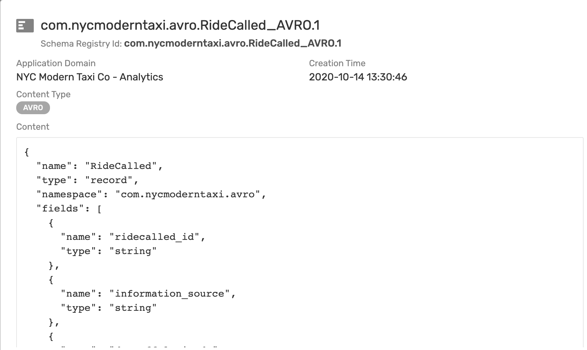
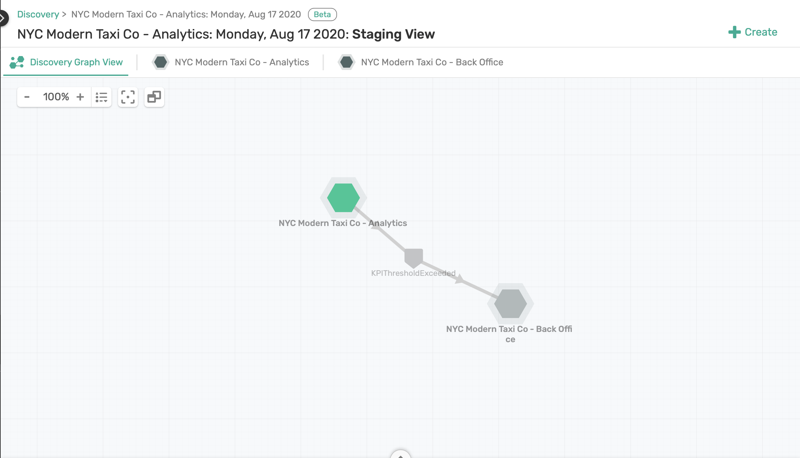
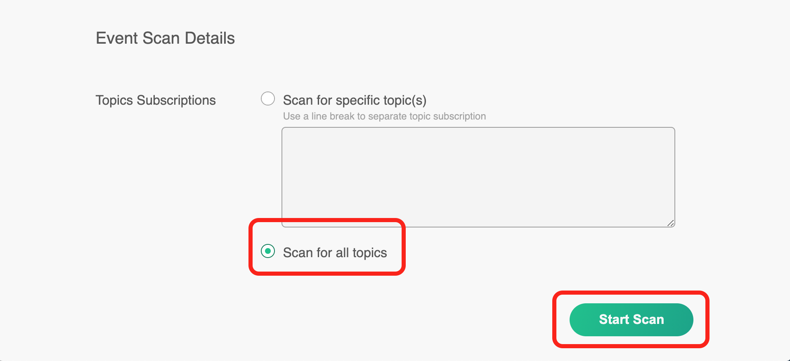
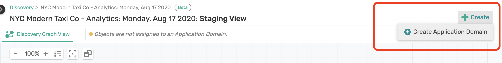
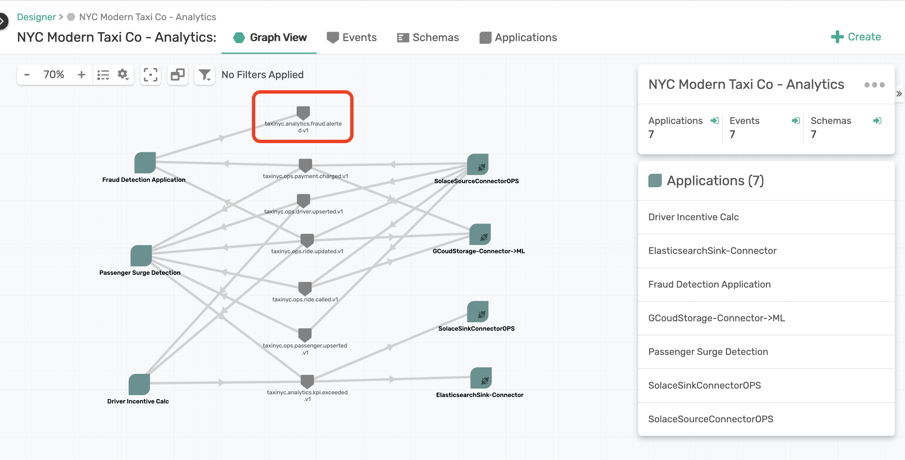
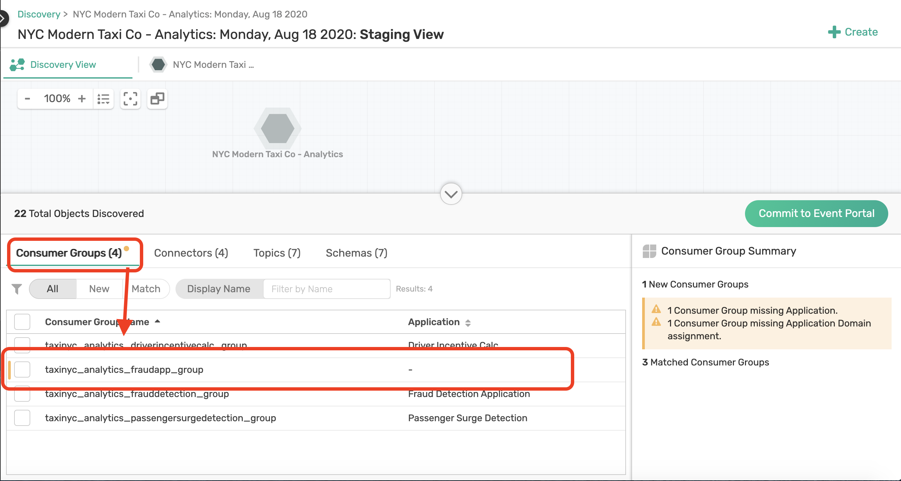

author: Dishant Langayan
summary: A guided walk through of PubSub+ Event Portal Discovery with Kafka
id: ep-discovery-kafka
tags: kafka,guide,event-portal
categories: Kafka, Portal, taxi
environments: Web
status: Draft
feedback link: https://github.com/SolaceDev/solace-dev-codelabs/blob/master/markdown/ep-discovery-kafka
analytics account: UA-3921398-10

# Guided Walk Through of PubSub+ Event Portal Discovery with Kafka

## Introduction

Duration: 0:01:00

Are you looking to discover, visual, catalog, share, and reuse your Kafka event streams, but don't know how and or where to begin. Or does your organization look something like the picture below and you are struggling to understand what is the data that is really going through your Kafka clusters?


Well you have come to the right place, and in this guided walk through, we will show you how to:

* Run a discovery scan on a Kafka cluster (optional - you can instead use our pre-scanned discovery file)
* Upload the scan to PubSub+ Event Portal to visualize the results
* And finally take action on your Kafka consumer groups and topics by linking them to applications, organizing them in a domain, sharing and collaborating on the data with your teams

We expect with this knowledge you will be able to scan your own Kafka clusters to discover & visualize new event streams or consumer groups you may not be aware off. 

To make this walk through engaging and meaningful, we will make use of a real-world use, which we will jump into a bit, and ask you to transport yourself to be an employee of a new company. We also cover some foundational concepts so we all aligned on the same page.

So let's get started!

## Use Case: NYC Taxi Co.

Duration: 0:03:00

You are a member of the engineering team at the _NYC Modern Taxi Co_, a fictional taxi cab company based in New York City. Your team is playing from behind and racing to catch up with technology innovation introduced to the industry by Rideshare competitors such as Uber and Lyft. In order for the company to survive and eventually thrive your team has convinced the board that transforming the companies' IT systems is of utmost importance. Your team has done it's research and determined that moving to an Event-Driven Architecture is essential to future rapid innovation and has already kicked this initiative off by deploying a Solace Event Mesh and updating the taxi fleet to stream real-time events that include ride and location information. We know what the fleet is up to! Now it's time to start to continually improve and provide a world class customer experience.

In order to react in a real-time manner the team has decided that we want to process the updates as they stream in from the fleet of taxis instead of putting them directly into a datastore and then having to retrieve them to do processing later. To prototype this work, you'll see a high level design in the diagram below. Since we already have the taxi fleet streaming their updates into our PubSub+ Event Mesh we need to do three things: 

1. 🚖 Capture this high level design in the PubSub+ Event Portal where we can define our Event-Driven Architecture, including its' components: Applications, Events and Schemas. This will allow us to define the details needed to implement, visualize and extend the architecture as it evolves, and share/collaborate with our entire engineering team as we continue to innovate.  
1. 🚕 Next up we're going to create the _RideDropoffProcessor_ microservice which will subscribe to the stream of _dropoff_ taxi updates from the fleet, capture events for a specified time window (we'll use 20 seconds to make it easy), calculate the averages, and publish a new _RideAverageUpdate_ event for each window.  
1. 🚖 Lastly we'll create a _RideDropoffConsumer_ that receives the stream of _RideAverageUpdate_ events and captures them for display and further processing. 


Positive
: The dataset you will be using in this lab originally comes from the NYC Taxi & Limousine Commission's open data release of more than a billion taxi ride records. Google then extended one week worth of data (3M taxi rides) from their original pickup and drop-off points into full routes in order to simulate a fleet of taxis roaming the streets of NYC. Solace is streaming this data over Solace PubSub+ for you to analyze and process. 
<p>Terms of Use: This dataset is publicly available for anyone to use under the following terms provided by the Dataset Source — [https://data.cityofnewyork.us/](https://data.cityofnewyork.us/) — and is provided "AS IS" without any warranty, express or implied, from Solace. Solace disclaims all liability for any damages, direct or indirect, resulting from the use of the dataset.</p>

## Foundational Concepts

Duration: 0:05:00

Before we dive deeper, let ensure we are all aligned with Kafka objects and concepts we will use in PubSub+ Event Portal. 

Positive
: We are assuming you are familiar with Kafka, its foundational concepts, and have been introduced to PubSub+ Event Portal, so we won't go into depth of explaining the Kafka concepts but rather explain how they relate to the Event Portal. If you are completely new to our Event Portal then watch [this quick 2 mins video](https://share.vidyard.com/watch/cYiSmhz5ZUBh6bavDHAJNQ?) to get overview and create your [free trial account](https://solace.com/products/portal/).

### Consumer Groups

Event Portal supports the concept of Kafka's consumer groups. A consumer group is used by Kafka to group consumers into a logical subscriber for a topic. In Event Portal, you can model consumer groups in Designer. This enables the Event Portal's runtime discovery to associate a discovered consumer group to an existing application. 

Kafka consumers that belong to the same consumer group share a group ID. The consumers in a group divide the topic partitions, as fairly as possible, so that each consumer consumes only a single partition from the group.

A few examples of Consumers Groups from our NYC Taxi Analytics use case would be:

* Passenger Surge Detection
* Fraud Detection
* Driver Incentive Calculation


### Topics

Topics are an important part of the Event Portal. Think of a topic as a concept of the publish-subscribe (pub/sub) architectural pattern. They are used to route data or events (in the form of messages) between distributed applications, often using a message broker or an event broker.

A Solace topic and an Apache Kafka topic might seem fundamentally the same but there are quite a few [differences between them](https://solace.com/blog/solace-topics-vs-kafka-topics/). Later in this CodeLab, when you run a discovery scan against a Kafka cluster the Topic Scheme for events discovered will be Kafka format.

Here are some examples from our use case:

* taxinyc.analytics.fraud.alerted.v1
* taxinyc.ops.payment.charged.v1
* taxinyc.ops.ride.called.v1


### Schemas

In simple terms, a schema represents the contract to describe the payload of an event. Producers and consumers of an event can trust that the event's payload matches the schema definition assigned to that event. Schemas define a type of payload through JSON, AVRO, XML, Binary, or Text. JSON, AVRO, and XML schemas have content that describes each property of the schema. 

In our use case all events are in AVRO Schema format.




### Application Domain & Workspace

An application domain represents a namespace where applications, events, and schemas can live. Within this namespace, you can create a suite of applications, events and schemas that are independent of other application domains. In our NYC Taxi use case we introduced earlier, we may group application into different domains, for ex. we may have a domain for our rideshare apps and services, one for our back-office apps where we invoicing and background checks are being processed, and maybe another domains for analytics where we group apps that are responsible for analyzing the successful operation of our rideshare services.

In the Event Portal you will associate all objects like Consumer Groups, Topics, Schema, etc, to one or more Application Domains. 

You can further group multiple domains into a *Workspace*, which will make it easier to review our Discovery scan. So our Analytics, Operations, and Back-Office Application Domain in the NYC taxi example could be part of a single Workspace.



### Applications

An application represents a piece of software that produces and consumes events. Applications connect to the event broker in an event-driven architecture and communicate with other applications via events. A single application represents a class of applications that are running the same code base; therefore, a Kafka consumer group can be associated with an Application object in the Event Portal.

### Connector

A connector is used in Kafka for connecting Kafka brokers with external systems to stream data into or out of Apache Kafka. In the Event Portal, a Kafka Connector is an application class you select to configure associated published and/or subscribed events and a set of Kafka-native attributes like Connector Type, Class, Cluster ID, and Maximum Task.


With the foundational concepts out of the way, lets go through some prerequisites for running a Discovery scan.

## What you need: Prerequisites

Duration: 0:05:00

In this walk through you have a choice to pick either of the following options:
1. Scan our demo NYC Taxi Kafka cluster		
2. Download one of our pre-scanned Discovery file

You will find some prerequisites for both options below. 

### Option 1: Live Scan Requirements

If you want run a live scan on a Kafka cluster, you will need to download and install the Offline Discovery Agent. As with everything in life, you have two options again:
1. Install the Agent as a Docker Container
2. Install the Agent via a Binary Executable

The most easiest way install the agent is using Docker. Option 2 will require JDK/JRE 11; OpenJDK 11 is bundled with the agent installation package.

If you are on Mac OS or Linux and already have Docker for Desktop installed, then go ahead copy and paste the below command into a terminal window. The Discovery Agent may take a few minutes to initialize. 

Negative
: NOTE: If you are on Windows OS follow the instructions from the documentation [here](https://docs.solace.com/Solace-Cloud/Event-Portal/Discovering-Events-and-EDAs.htm#Install). 
Or if you would like to install the Discovery Agent via a binary executable then refer to the instructions [here](https://docs.solace.com/Solace-Cloud/Event-Portal/Discovering-Events-and-EDAs.htm#Install2).


``` bash
echo 'cMopz4m+GV60hBb8DysZna8uMP4tM84P' | docker login --username discovery-preview --password-stdin solaceclouddev.azurecr.io
	docker pull solaceclouddev.azurecr.io/maas-event-discovery-agent:latest
	docker run \
	--env SPRING_APPLICATION_NAME=maas-event-discovery-agent-offline \
	--env EVENT_DISCOVERY_OFFLINE=true \
	--env MAAS_VMR_ENABLED=false \
	--env MAAS_HEARTBEATS_ENABLED=false \
	--env MAAS_RESTPROXY_GATEWAY=false \
	--name discovery_agent -p 8120:8120 \
	-d solaceclouddev.azurecr.io/maas-event-discovery-agent:latest
```

To launch the Discovery Agent go to: [http://localhost:8120](http://localhost:8120).

### Option 2: Pre-Scanned Discovery File

If you don't want to install the agent and run a live scan, you can still follow along in this CodeLab using the following pre-scanned JSON file.

**Download:** [NYC Modern Taxi Co. Analytics Discovery File](https://gist.githubusercontent.com/dishantlangayan/dd050e4ea2e3a7d8b14fa4fdca03785a/raw/NYC_Modern_Taxi_Co_Analytics.json)

Or run the curl/git clone command below to download the file:

``` bash
curl -k -XGET https://gist.githubusercontent.com/dishantlangayan/dd050e4ea2e3a7d8b14fa4fdca03785a/raw/NYC_Modern_Taxi_Co_Analytics.json -o NYC_Modern_Taxi_Co_Analytics.json
```

### Some General Requirements

Regardless of the option you chose above, you should also:

1. Sign into your [Solace PubSub+ Cloud account](http://console.solace.cloud/). If you don't have an account yet, go ahead and [create a trial account](https://console.solace.cloud/login/new-account).
2. Ensure that you have the correct user role and permission in Event Portal. At minimum you will need the "Event Portal Editor" permission. For instructions, refer to [Managing Accounts, Roles, and Permissions](https://docs.solace.com/Solace-Cloud/cloud-user-management.htm#Editing).

If you are scanning your own Kafka clusters, then the following event brokers versions are currently supported:
* Apache Kafka versions 2.2, 2.3, 2.4, 2.5
* Confluent versions 5.3, 5.4, 5.5
* Amazon MSK version 2.2

## Scan a Kafka Cluster (Optional)
Duration: 0:03:00

Negative
: The Kafka Cluster referenced in this section is not currently available for scanning. The steps below show you how you would scan a Kafka cluster, but for now just skip this section and use the pre-scanned discovery file available in Step 4	

Once the Offline Discovery Agent is installed, you can configure and run a scan on our NYC Taxi Kafka cluster from your browser. 

Negative
: NOTE: If you going to use the pre-scanned Discovery file instead then you can skip this section.

### Step 1: Go to the Discovery Agent

Go to [http://localhost:8120](http://localhost:8120)

Here you'll see a list of Event Brokers the Discovery Agent supports. We are going to select **Confluent** as broker type, as that is the Kafka distribution our NYC Taxi service is using. 


### Step 2: Configure Connection Details

Under the *Target Cluster Authentication*, copy and paste the following:

* **Discovery Name:** `Kafka Discovery CodeLab`
* **Host:** `vmobuajpyc47tci0.eastus.cloudapp.azure.com:9092`
* **Auth:** `No Auth`

Select Add Connector and then copy and paste the Host and Port:

* **Host:** `vmobuajpyc47tci0.eastus.cloudapp.azure.com`
* **Port:** `8083`
* **Authentication:** `No Auth`


Under Schema Registry Authentication, copy and paste the Host and Port:

* **Host:** `vmobuajpyc47tci0.eastus.cloudapp.azure.com`
* **Port:** `8081`
* **Authentication:** `No Auth`

And finally for the *Event Scan Details*, select `Scan for all topics` and click **Start Scan**.



The agent is now discovering the Topics that are being produced and consumed, inspecting the Scheme Registry, discovering consumer groups, and looking at various connectors that consuming or producing data with the cluster.

### Step 3: Download the Scan File

Once the scan completes download the scan file to your desktop. The scan file will be in JSON format.


Now on to the fun part where we will upload the scan to Event Portal and visualize the result. 

## Upload the scanned file
Duration: 0:020:00

This is where all the exciting stuff will happen with your Discovery scans. A few things you can do here:
* Review the discovered data
* Create applications and associate consumers groups to applications
* Link events published to the applications publishing them
* Resolve any discrepancies
* And finally import the staged data into Designer and Catalog.

So lets start by uploading the scan file first.

### Uploading Your Scan File

Open your PubSub+ Cloud Console account and navigate to the Event Portal Discovery. Here you can upload your scan file you download in the last step or use our [pre-scanned file](https://gist.githubusercontent.com/dishantlangayan/dd050e4ea2e3a7d8b14fa4fdca03785a/raw/NYC_Modern_Taxi_Co_Analytics.json) instead. For the purpose of walk through we will be using the pre-scanned file below.


### Assign to Workspace

One of the first things we want to do is to organize our work in a Workspace. Click on your scan file from the table and select **Assign to Workspace**.


Lets create a new Workspace called `NYC Modern Tax Co` and select **Run Synchronization Audit**.	


Once your workspace is created you'll see the **Staging view**. What you essentially have here is all the objects the Discovery Agent found in the Kafka cluster it scanned which includes
- Discovered Consumer Groups	
- Kafka Connectors	
- Topics 	
- Schemas.	


Positive
: This is where you will map what you have discovered to Applications and Events in the Event Portal to make associations with your application domain.

## Assign Kafka Objects to Solace Application Domain
Duration: 0:05:00

Now that you have uploaded your scan file and staged your events, let's go ahead and create an application domain to map topics, events and consumer groups

### Creating an Application Domain

First we need to associate the Consumer Groups, Connectors, Topics, and Schema that were discovered from our NYC Taxi Analytics cluster to an Application Domain. 

To do this click on the **"+ Create"** button and select ***Create Application Domain**.



Double click on the domain that was created to rename it. We will call this Domain: `NYC Modern Taxi Co - Analytics`


### Assigning Consumer Groups, Topics, Schemas to the Application Domain

Now lets assign our discovered Analytics Consumers Groups, Connectors, Topics, and Schema to the application domain we created.

Notice at the bottom of your discovery view, you can see a list of all **Objects** in the workspace		


Positive
: In reality you may have thousands of Consumers or Topics, so to ensure we are making the right associations with a domain, you can use the search capability on the table to filter our Analytics objects only.

Assign the following objects to your newly created application domain:
- Consumer Groups	
- Connectors	
- Topics	
- Schemas

This is done by 
1. Clicking on the respected tab
1. Checking the objects you want to assign
1. Click on the application Domain

Filter and select Consumer Groups:


Repeat for Connectors, Topics and Schemas

	
	
	

## Map Consumer Groups & Topics to Applications
Duration: 0:05:00

With the objects associated to an Application Domain, click on the Domain name tab at the top navigation bar to see a graph view of what has been mapped. 	
	

The Event Portal will automatically attempt to reverse engineer to map those Consumer Groups, Connectors, and Topics to an Applications and Events. 

You will notice that some consumer groups like the `taxinyc_analytics_frauddetection_group` and topic like `taxinyc.analytics.fraud.alerted.v1` where not mapped to an application. These discrepancies are identified by the little orange circle icon on the object itself and need to resolved before we can commit our work to the Event Portal.	

	

This is where your domain expertise will come in handy and considering you are part of the NYC Taxi Analytics team you know that the `taxinyc_analytics_frauddetection_group` maps to the say the `Fraud Detection Application`. 	

### Application Mapping

Click on the **"+ Create"** button at the top right corner of page and select **Create Application**. Call this application: `Fraud Detection Application`. Then drag and drop the consumer group `taxinyc_analytics_frauddetection_group` to the newly created application.


Similarly map the `taxinyc_analytics_passengersurgedetection_group` to a new application called `Passenger Surge Detection`, and the `taxinyc_analytics_driverincentivecalc_group` to a new application called `Driver Incentive Calc`.


### Topic Mapping

#### taxinyc.analytics.fraud.alerted.v1

Now we have one Topic, `taxinyc.analytics.fraud.alerted.v1` remaining that needs to be mapped. You being an expert in NYC Taxi Analytics team, you know this Topic is produced by the `Fraud Detection App`. So we can drag the topic to that app now.


#### taxinyc.analytics.kpi.exceeded.v1

What about the `taxinyc.analytics.kpi.exceeded.v1` topic that is being consumed by the two Connectors (SolaceSinkConnectorOPS and the ElasticsearchSink-Connector)? After talking with our domain expert we identified that this is an event published by both the **Passenger Surge Detection** & **Drive Incentive Calc** application. So go ahead and make those association.


### Commit to Event Portal

Alright, so now that we have associated and mapped all objects discovered during our scan it is time to commit this to the Event Portal so your architecture teams and developers can collaborate, design, and govern the NYC Taxi Analytics architecture. 

Negative
: You also want to make sure that all association are resolved, i.e. there are no alert orange circle icons on any of the objects on the Graph View as these won't be imported or committed to the Event Portal.

To commit click on the **Commit To Event Portal** button.


And your done!! ...well almost. All the applications, events and linkages you made are now in sync with our Kafka cluster and have been cataloged, available for others in our teams to search and discover. For this we are next going to explore two other important features of the Event Portal, i.e. the Designer and Catalog.


## Designer and Catalog 
Duration: 0:05:00

Now that our Consumers Groups, Topics, and other objects have been committed to the Event Portal, they can be viewed and searched from the Designer and Catalog.

In short the **Designer** is a tool to design and view all aspects of your event-driven architectures. It is through the Designer that you can create new events and applications for our NYC Taxi service as the use case evolves. It provides a graphical representation of application domains, applications, schemas, and events. You can use Designer to visualize the interaction of events between applications and to provision your architecture into the Event Portal.

Whereas, the **Catalog** acts as a storefront for all the applications, events, and schemas you've created in the Event Portal. Objects discovered & committed from our scan earlier, or created in Designer are automatically available in Catalog. Using Catalog's searchable interface, you can access all the existing events, schemas, and applications.

We will first take Designer for a test drive, so go ahead on open the Designer in Event Portal:


You'll notice the `NYC Modern Taxi Co - Analytics` domain we created in Discovery. Double click on that domain name or select the domain to see a quick summary and click on **View Domain Details**.

This is where you might want to spend some time to redraw you graph, maybe putting all custom apps one side and connectors on another, and have an understandable architecture diagram. Here is what ours looks like:



As we did this, we realized something that wasn't really right. From reorganizing the graph we noticed that there is an event `taxinyc.analytics.fraud.alerted.v1` that is produced by the `Fraud Detection Application` but not really consumed by anyone. We look at this as a opportunity as that event has some value, and can be used for a new business use case, maybe to have a new insight or customer experience. Ideally you could create a new application in the Designer, associate this event to be consumed by it, generate an AsyncAPI spec from the Event Portal, run it through code generators or code it up, connect it to Kafka, and re-scan where the Discovery would say our design is in sync with Kafka runtime. 

But we don't live in an ideal world and say we didn't follow the above process, developed a quick Kafka application that consumed that event, and maybe we forgot to update it in the Designer. So lets say that happened. What would our Discovery Scan show if we re-ran the Discovery Agent? Well lets find out.

We already have a pre-scanned file for you to use here, which you can download [from here](https://gist.githubusercontent.com/dishantlangayan/e597aeb4d4c48796320b923745796568/raw/NYC_Modern_Taxi_Co_Analytics-Audit.json) directly or use curl/git clone as shown below.

``` bash
curl -k -XGET https://gist.githubusercontent.com/dishantlangayan/e597aeb4d4c48796320b923745796568/raw/NYC_Modern_Taxi_Co_Analytics-Audit.json -o NYC_Modern_Taxi_Co_Analytics-Audit.json
```

Once downloaded go back to Discovery and upload this new discovery file.


Like before we are going to assign the scan to a Workspace. Use the same Workspace you created last time and select **Run Synchronization Audit**. The Event Portal will now run an audit with your existing domain and check for any discrepancies. We noticed that there is a new Consumer Group `taxinyc_analytics_fraudapp_group` that wasn't there before. 



Assign this new group to the `NYC Modern Taxi Co - Analytics` domain first. Then click on the domain from the tab menu. You may have to zoom out a little to see the Consumer Group that was discovered, which is now consuming the `taxinyc.analytics.fraud.alerted.v1` event. 


We can right-click on this Consumer Group and **Convert To Application**, and finally **Commit to Event Portal**.

If you head back to the Designer, the new application is now part of the architecture diagram and our Kafka runtime is now synchronized with our design!


## Next Steps
Duration: 0:01:00

Hopefully your enjoyed the walk through of how to run discovery scans on a Kafka cluster, visualize them into an architecture diagram, and catalog all your Kafka event streams and applications for others in your organization to find and collaborate on.

### Key Takeaways

  

### Next Steps

* Scan your own Kafka clusters
* Import the scans in your Event Portal
* Show & share your discoveries with your teams
* And lets us know if you found something cool and share it us on our [Developer Community](https://solace.community)


