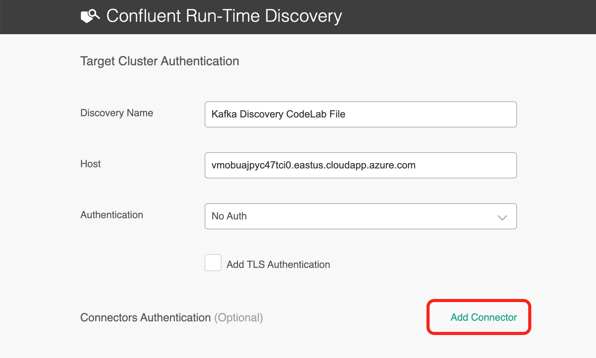
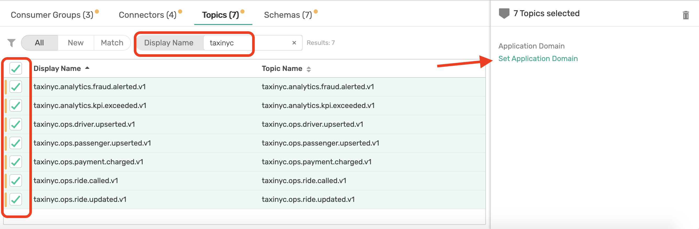

author: Dishant Langayan
summary: A guided walk through of PubSub+ Event Portal Discovery with Kafka
id: ep-discovery-kafka
tags: kafka,guide,event-portal
categories: Kafka, Portal
environments: Web
status: Draft
feedback link: https://solace.community/
analytics account: UA-3921398-10

# Guided Walk Through of PubSub+ Event Portal Discovery with Kafka

## Introduction

Duration: 0:02:00

Are you looking to discover, visual, catalog, share, and reuse your Kafka event streams, but don't know how and or where to begin. Or does your organization look something like the picture below and you are struggling to understand what is the data that is really going through your Kafka clusters?

Well you have come to the right place, and in this guided walk through, we will show you how to:

* Run a discovery scan on a Kafka cluster (optional - you can instead use our pre-scanned discovery file)
* Upload the scan to PubSub+ Event Portal to visualize the results
* And finally take action on your Kafka consumer groups and topics by linking them to applications, organizing them in a domain, sharing and collaborating on the data with your teams

We expect with this knowledge you will be able to scan your own Kafka clusters to discover & visualize new event streams or consumer groups you may not be aware off. 

To make this walk through engaging and meaningful, we will make use of a real-world use, which we will jump into a bit, and ask you to transport yourself to be an employee of a new company. We also cover some foundational concepts so we all aligned on the same page.

So let's get started!

## Use Case: NYC Taxi Co.

Duration: 0:03:00

You are a member of the engineering team at the _NYC Modern Taxi Co_, a fictional taxi cab company based in New York City. Your team is playing from behind and racing to catch up with technology innovation introduced to the industry by Rideshare competitors such as Uber and Lyft. In order for the company to survive and eventually thrive your team has convinced the board that transforming the companies' IT systems is of utmost importance. Your team has done it's research and determined that moving to an Event-Driven Architecture is essential to future rapid innovation and has already kicked this initiative off by deploying a Solace Event Mesh and updating the taxi fleet to stream real-time events that include ride and location information. We know what the fleet is up to! Now it's time to start to continually improve and provide a world class customer experience.

In order to react in a real-time manner the team has decided that we want to process the updates as they stream in from the fleet of taxis instead of putting them directly into a datastore and then having to retrieve them to do processing later. To prototype this work, you'll see a high level design in the diagram below. Since we already have the taxi fleet streaming their updates into our PubSub+ Event Mesh we need to do three things: 

1. 🚖 Capture this high level design in the PubSub+ Event Portal where we can define our Event-Driven Architecture, including its' components: Applications, Events and Schemas. This will allow us to define the details needed to implement, visualize and extend the architecture as it evolves, and share/collaborate with our entire engineering team as we continue to innovate.  
1. 🚕 Next up we're going to create the _RideDropoffProcessor_ microservice which will subscribe to the stream of _dropoff_ taxi updates from the fleet, capture events for a specified time window (we'll use 20 seconds to make it easy), calculate the averages, and publish a new _RideAverageUpdate_ event for each window.  
1. 🚖 Lastly we'll create a _RideDropoffConsumer_ that receives the stream of _RideAverageUpdate_ events and captures them for display and further processing. 

Positive
: The dataset you will be using in this lab originally comes from the NYC Taxi & Limousine Commission's open data release of more than a billion taxi ride records. Google then extended one week worth of data (3M taxi rides) from their original pickup and drop-off points into full routes in order to simulate a fleet of taxis roaming the streets of NYC as they define [here](https://codelabs.developers.google.com/codelabs/cloud-dataflow-nyc-taxi-tycoon/?_ga=2.11039092.-1355519641.1572284467/#0). Solace is streaming this data over Solace PubSub+ for you to analyze and process. 

Terms of Use: This dataset is publicly available for anyone to use under the following terms provided by the Dataset Source — [https://data.cityofnewyork.us/](https://data.cityofnewyork.us/) — and is provided "AS IS" without any warranty, express or implied, from Solace. Solace disclaims all liability for any damages, direct or indirect, resulting from the use of the dataset.

## Foundation Concepts

Duration: 0:03:00

Before we dive deeper, let ensure we are all aligned with Kafka objects and concepts we will use in PubSub+ Event Portal. 

Positive
: We are assuming you are familiar with Kafka, its foundation concepts, and have been introduced to PubSub+ Event Portal, so we won't go into depth of explaining the Kafka concepts but rather explain how the relate to the Event Portal. If you are completely new to our Event Portal then watch [this quick 2 mins video](https://share.vidyard.com/watch/cYiSmhz5ZUBh6bavDHAJNQ?) to get overview and create your [free trial account](https://solace.com/products/portal/).

### Consumer Groups

Event Portal supports the concept of Kafka's consumer groups. A consumer group is used by Kafka to group consumers into a logical subscriber for a topic. In Event Portal, you can model consumer groups in Designer. This enables the Event Portal's runtime discovery to associate a discovered consumer group to an existing application. 

Kafka consumers that belong to the same consumer group share a group ID. The consumers in a group divide the topic partitions, as fairly as possible, so that each consumer consumes only a single partition from the group.

### Topics

Topics are an important part of the Event Portal. Think of a topic as a concept of the publish-subscribe (pub/sub) architectural pattern. They are used to route data or events (in the form of messages) between distributed applications, often using a message broker or an event broker.

A Solace topic and an Apache Kafka topic might seem fundamentally the same but there are quite a few [differences between them](https://solace.com/blog/solace-topics-vs-kafka-topics/). Later in this CodeLab, when you run a discovery scan against a Kafka cluster the Topic Scheme for events discovered will be Kafka format.

### Schemas

In simple terms, a schema represents the contract to describe the payload of an event. Producers and consumers of an event can trust that the event's payload matches the schema definition assigned to that event. Schemas define a type of payload through JSON, AVRO, XML, Binary, or Text. JSON, AVRO, and XML schemas have content that describes each property of the schema. In our Kafka cluster, our events are all in ARVRO Schema format.

### Application Domain & Workspace

An application domain represents a namespace where applications, events, and schemas can live. Within this namespace, you can create a suite of applications, events and schemas that are independent of other application domains. In our NYC Taxi use case we introduced earlier, we may group application into different domains, for ex. we may have a domain for our rideshare apps and services, one for our back-office apps where we invoicing and background checks are being processed, and maybe another domains for analytics where we group apps that are responsible for analyzing the successful operation of our rideshare services.

In the Event Portal you will associate all objects like Consumer Groups, Topics, Schemea, etc, to one or more Application Domains. 

You can further group multiple domains into a *Workspace*. So our Analytics, Operations, and Back-Office Application Domain in the NYC taxi example could be part of a single Workspace.

### Applications

An application represents a piece of software that produces and consumes events. Applications connect to the event broker in an event-driven architecture and communicate with other applications via events. A single application represents a class of applications that are running the same code base; therefore, a Kafka consumer group can be associated with an Application object in the Event Portal. In fact you could have a 1..* consumer group association with an Application.

### Connector

A connector is used in Kafka for connecting Kafka brokers with external systems to stream data into or out of Apache Kafka. In the Event Portal, a Kafka Connector is an application class you select to configure associated published and/or subscribed events and a set of Kafka-native attributes like Connector Type, Class, Cluster ID, and Maximum Task.

With the foundational concepts out of the way, lets go through some prerequisites for running a Discovery scan.

## What you need: Prerequisites

Duration: 0:05:00

You have a choice to pick either of the following options:
1. Scan our NYC Taxi Kafka cluster (which we recommend as it will help you setup to scan your own clusters) or
2. Download one of our pre-scanned Discovery file

You will find some prerequisites for both options below. 

### Option 1: Live Scan Requirements

If you want run a live scan on a Kafka cluster, you will need to download and install the Offline Discovery Agent. As with everything in life, you have two options again:
1. Install the Agent as a Docker Container
2. Install the Agent via a Binary Executable

The most easiest way install the agent is using Docker. Option 2 will require JDK/JRE 11; OpenJDK 11 is bundled with the agent installation package.

### Option 2: Pre-Scanned Discovery File

If you don't want to install the agent and run a live scan, you can still follow along in this CodeLab using the following pre-scanned JSON file.

**Download:** [NYC Modern Taxi Co. Analytics Discovery File](NYC_Modern_Taxi_Co_Analytics.json)

### Some General Requirements

Regardless of the option you chose above, you should also:

1. Sign into your [Solace PubSub+ Cloud account](http://console.solace.cloud/). If you don't have an account yet, go ahead and [create a trial account](https://console.solace.cloud/login/new-account).
2. Ensure that you have the correct user role and permission in Event Portal. At minimum you will need the "Event Portal Editor" permission. For instructions, refer to [Managing Accounts, Roles, and Permissions](https://docs.solace.com/Solace-Cloud/cloud-user-management.htm#Editing).

If you are scanning your own Kafka clusters, then the following event brokers versions are currently supported:
* Apache Kafka versions 2.2, 2.3, 2.4, 2.5
* Confluent versions 5.3, 5.4, 5.5
* Amazon MSK version 2.2

## Scan a Kafka Cluster (Optional)
Duration: 0:02:00

Once the Offline Discovery Agent is installed, you can configure and run a scan on our NYC Taxi Kafka cluster from your browser. 

### Step 1: Go to the Discovery Agent

Go to [http://localhost:8120](http://localhost:8120)

Select **Confluent** as broker type.

### Step 2: Configure Connection Details

Under the *Target Cluster Authentication*, copy and paste the following:

* **Discovery Name:** `Kafka Discovery CodeLab`
* **Host:** `vmobuajpyc47tci0.eastus.cloudapp.azure.com:9092`
* **Auth:** `No Auth`

Select Add Connector and then copy and paste the Host and Port:

* **Host:** `vmobuajpyc47tci0.eastus.cloudapp.azure.com`
* **Port:** `8083`
* **Authentication:** `No Auth`

Under Schema Registry Authentication, copy and paste the Host and Port:

* **Host:** `vmobuajpyc47tci0.eastus.cloudapp.azure.com`
* **Port:** `8081`
* **Authentication:** `No Auth`

And finally for the *Event Scan Details*, select `Scan for all topics` and click **Start Scan**.

### Step 3: Download the Scan File

Now download the scan file to your desktop. The scan file will be in JSON format.

Now on to the fun part where we will upload the scan to Event Portal and visualize the result. 

## Review Scan In Staging
Duration: 0:010:00

### Uploading Your Scan File

Open your PubSub+ Cloud Console account and navigate to the Event Portal Discovery. Here you can upload your scan file you download in the last step or use our [pre-scanned file](NYC_Modern_Taxi_Co_Analytics.json) instead. For the purpose of this CodeLab we will be using the pre-scanned file below.

### Assign to Workspace

One of the first things we want to do is to organize our work in a Workspace. Click on your scan file from the table and select **Assign to Workspace**

### Staging View

TODO: Explain various thing we see on this Staging View.

### Creating an App Domain

TODO: Create an app domain

### Assigning Consumer Groups, Topics, Schemas to the App Domain

TODO: Describe why assign to domain

### Mapping Consumer Groups & Topics to Applications

### Making Links Across App Domains

### Commit to Event Portal

## Designer and Catalog 
Duration: 0:05:00

## Next Steps
Duration: 0:01:00

Summarize and key takeaways

✅ < Fill IN TAKEAWAY 1>   
✅ < Fill IN TAKEAWAY 2>   
✅ < Fill IN TAKEAWAY 3>   

Next steps -> scan your own clusters