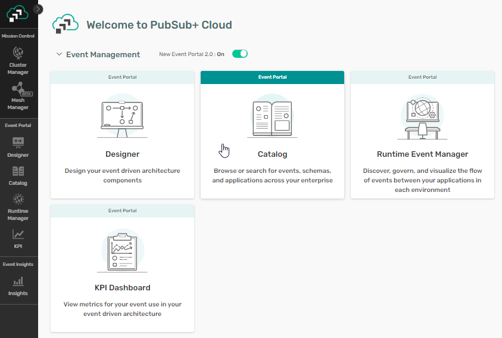
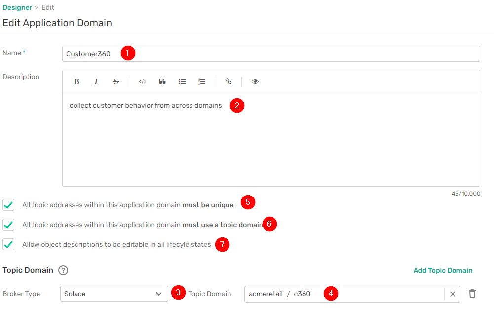

author: jessemenning
summary: See how Event Portal can guide you on a smooth path from fantastic idea to the hands of your users
id: ep-lifecycle
tags:
categories: solace,eventportal
environments: Web
status: Published
feedback link: https://github.com/SolaceDev/solace-dev-codelabs/blob/master/markdown/ep-lifecycle

# Event Portal: event-driven innovation that's faster, easier, more resilient

## What you'll learn: Overview

Duration: 0:03:00

Delivering innovative event-driven features to the hands of users means moving micro-integrations from development to production.  That means getting the right event infrastructure in the right environment at the right time. Event Portal makes that easier, faster and more resilient.

This code lab takes you through the lifecycle of a new event-driven application, from finding relevant events to jump start development, to generating rock-solid code, to automated event configuration with your existing CICD pipeline.

## What you need: Prerequisites

Duration: 0:02:00

**For all sections, you'll need to:**
- Complete the [Connecting Event Portal to a runtime Event Broker](https://codelabs.solace.dev/codelabs/ep-connect-ep-broker) code lab. 

**For config push and CICD integration sections, you will also need to:**
- Have a running Event Management Agent connected to a cloud Event Broker (That's also covered in the [Connecting Event Portal to a runtime Event Broker](https://codelabs.solace.dev/codelabs/ep-connect-ep-broker) code lab.)
- A GitHub account.  If you don’t have one, you can [get one free](https://github.com/signup). 

## Discover event-driven stuff you didn’t know existed
Duration: 0:04:00
### Find interesting events to use in your solution
1. In the home screen of Solace Cloud, click on Catalog.<br><br><br>
1. Within Catalog, click on the Events tab, then search for ```customer``` in the search box.  You’ll note that there are two existing customer events that would be perfect.<br><br><br>
1. Also, look for order related events by searching for ```order```<br><br><br>

## Easily design EDA solutions, together 
Duration: 0:15:00
### Create an Application Domain to house your application, event and schema
1. Now that we have candidate events, click on the Designer icon in the left bar (1), then Create Application Domain. (2)<br><br><br>
1. Configure the domain:<br>
Name (1):  ```Customer360```<br>
Description (2): ```collect customer behavior from across domains```<br>
Add a Solace (3) topic domain of ``acmeretail/c360`` (4)<br>
Select all 3 checkboxes, enforcing topic uniqueness (5), enforcing topic domain (6) and allowing descriptions to be edited  (7)<br>

Then click on OK
<br><br><br>
### Graphically create your application
1. Go into the newly created Customer360 domain.<br><br>
1. Click on Add Objects and drag “New Application” to the canvas and name it `Customer 360`.<br><br><br>
1. Again click on Add Objects, and drag a Shared Event to the canvas<br><br><br>
1. In the popup, select *Customer Updated*, then click on Add.
1. Repeat this process to add the *Customer Created* shared event, which you discovered in the catalog earlier. 
1. To define which events Customer 360 subscribes to, hover over the *Customer Created* event and drag the arrow to the *Customer360* application.  Repeat for the *Customer Updated* event.<br><br><br>
1. Drag a “New Event” onto the canvas and call it ```Customer Insight Generated```.
1. To define the event Customer 360 publishes, hover over the Customer360 application and drag the arrow to the Customer Insight Generated event.<br><br><br>
### Add an event directly from the catalog
1. Navigate back to the catalog (1), click on the Events tab (2), select *Order Created* (3). <br><br><br>
1. In the right hand column, click on the latest version  <br><br><br>
1. Click on Associate with Application<br><br><br>
1. Select the Customer360 domain (1), the latest Customer360 version (2), and specify that you want to subscribe to the event (3).  Then click on Save.<br><br><br>
### Create consumers for your application
1. In the resulting screen, scroll down to the Referenced By section, click on the three dots next to Customer 360, and then Open Application<br><br><br>
1. Click on Edit This Version<br><br><br>
1. Click on the Consumers tab (1), then on Add Consumer (2)<br><br><br>
1. Name the queue ```C360.ORDERS``` (1)<br>
give it a type of Solace Event Queue (2)<br>
Click on Set Configuration (3) to use the default configuration
Then click on Add Subscriptions (4) <br><br><br>
1. In the resulting screen, select the Order Created event, which will prefill the subscription.  Then click on Add Subscription<br><br><br>
1. Repeat the process to create the consumer for the two Customer events, naming the queue ```C360.CUSTOMERS```   When you click on Add Subscriptions, select both of the Customer events and a subscription for both.<br><br><br>
1. To save your changes, click on Save & Close.<br><br><br>

### Create a new Customer Insight Generated event
1. You will use this schema file for the payload of the event.  Download it and save it to your hard drive. [Schema file](https://raw.githubusercontent.com/SolaceLabs/PostmanScripts/main/customerinsight.json)<br>
1. Click on the Schemas tab (1)for the Customer360 domain, then click on Create Schema(2)<br>
1. Name the schema ```Customer Insight```, then the Import from File button.  Navigate to the ```customerinsight.json``` schema file you just downloaded.<br>
1. Click on Save and Close.
1. Click on the Events tab (1) at the top of the screen, then click on Customer Insight Generated (2). <br>
1. Click on Edit This Version<br>
1. Define the Topic Address.  Start by clicking on the field and selecting the ```acmeretail/c360``` topic domain<br>
1. Type in the remainder of the topic address, using brackets for parameters.  The final result should be: ```acmeretail/c360/customerinsight/generated/v1/{insighttype}/{customerid}```<br>

1. Scroll down further and click on Select Schema.<br>
1. Select the Customer Insight schema you just created.<br>
> aside positive
> In a more production-ready use case, you would likely use an enumeration for {insighttype}.  For speed you will use an unbounded variable in this lab. 


## Give your developers a headstart with code generation
### AsyncAPI export
Duration: 0:05:00
1. Click on Applications (1) in the top menu, then on Customer360(2)<br><br><br>
1. Click on the three dots next to version 0.1.0 and click on Download AsyncAPI.  Save the file on your hard drive.<br><br><br>
1. In a web browser, navigate to AsyncAPI Studio at  ```https://studio.asyncapi.com```<br><br><br>
1. Click on the three dots in main panel (1), then on Import File. (2)<br><br><br>
1. In the resulting pop up, change the conversion to version 2.6.0, then click on Convert.<br><br><br>
1. Now that the AsyncAPI is loaded you can browse it, and also look through the autocreated documentation. 
1. When you’re finished browsing, click again on the three dots (1), then click on Generate code/docs.(2)<br><br><br>
1. In the popup window, select Java Spring Cloud Stream Project, then click on Generate.
1.  Save the resulting .zip file to your hard drive.  

> aside positive
>You’ll use the source code zip file in the CICD/GitHub Actions portion of the lab, so save it in a place you can remember.
## Provide exactly the events you need, when you need them
Duration: 0:15:00
### Assign your application to an environment/event broker
1. Click on Applications, then on Customer360.<br><br><br>
1. Click on the Runtime tab.<br><br><br>
1. Expand the Prod environment, then click on the three dots next to PROD-solace, then on Manage Credentials.<br><br><br>
1. For the Username enter ```c360``` (1).  For the Password enter ```c360``` (2). Click on Save. (3)<br><br><br>
1. Back in the main screen, expand the Prod environment (1) again click on the three dots, and then “Add Application” (2) <br><br><br>
1. The resulting popup previews the changes that will occur.  Expand out the credentials (1) and queues (2) to see more details.  Then click on Add (3)<br><br><br>

> aside negative
>If the config push fails, ensure that your EMA is running.

### Confirm EP provisioned your queues and access
1. Go to the management console of your cloud broker by clicking Cluster Manager in the left hand column, then clicking on your Event Broker. <br><br><br>  
1. Click on the Manage tab (1), then Queues (2).<br><br><br>
1. You should see the two queues you defined earlier, ```C360.CUSTOMERS``` and ```C360.ORDERS```.  Clicking on each, you should see that they are owned by c360, only the owner is allowed to access the queue and the subscriptions you defined are in place. <br><br><br>
1. Click on Access Control (1), the Client Usernames tab (2), and you should see the c360 client username. (3) <br><br><br>
1. Click on the ACL Profiles tab (1) and you should see the ACL associated with your user. (2) <br><br><br>

### View the updated event flow for Production
1. Click on the Runtime Event Manager icon on the left hand side (1), then on the us-central-solace-Prod event mesh. (2)<br><br><br>
1. Scroll down the list of applications in the left column to find Customer360, then click on the three dots (1).  Then select Center on Graph. (2)  This highlights the Customer360 on the graph.<br><br><br>
1. To highlight only the direct dependencies  for Customer360 in Production, click on the three dots (1), then Show Relationships(2).<br><br><br>

### Remove application from runtime event broker and modelled event Mesh
1. Click on the Customer360 link in the left hand column.<br><br><br>
1. In the resulting popup, click on Open in Designer.<br><br><br>
1. Click on the Runtime tab.<br><br><br>
1. Expand the Prod tab (1), click the three dots(2), the click on Remove Application.(3)<br><br><br>
1. In the popup, review the details of what queues will be removed.  Then click on Remove<br><br><br>

## Make your existing CICD even better
Duration: 0:20:00
> aside positive
>You need to have a GitHub account for this portion.  If you don’t have one, you can [get one free](https://github.com/signup). 

### Create new repository with Event Portal GitHub Actions
1. Make sure you are logged into GitHub and go to the [Import Existing Repository page](https://github.com/new/import). 
1. Use ```https://github.com/SolaceLabs/ep-scs-workflow``` for the URL, list yourself as the owner, and name the new repository ```customer360```. Click on Begin Import.<br><br><br>
1. Wait for the import to complete, usually around 3 minutes. Then click on the link to open the repository.

> aside negative
>Cloning through GitHub occassionally takes a bit of time.  After 3 minutes, try refreshing the page to see if it's done.

### Configure GitHub Actions
1. In the top menu of the repository, select Settings.<br><br><br>
1. In the left hand column, select Actions(1), then General (2).<br><br><br>
1. Scroll to the bottom of the page, and click on the radio button next to Read and write permissions (1).  Then click on Save.(2)<br><br><br>
1. Again in the left hand column, scroll down, expand Secrets and variables (1), then click on Actions (2).<br><br><br>
1. In the main panel, click on New Repository Secret.<br><br><br>
1. Name the secret ```SOLACE_CLOUD_TOKEN```.   The value of the secret should be the token you created for Postman when initially populating your account.<br><br><br>

### Upload micro-integration to GitHub
1. Unzip the Spring Cloud Stream source code you downloaded from studio.asyncapi.com on your hard drive.<br>
1. In the root directory, move the ```asyncapi.yml``` file to the template directory. <br><br><br>
1. Navigate to the template directory.  It should look like this: <br><br><br>
1. In your browser go to the new repository, click on the plus sign (1), then on Upload files. (2)<br><br><br>
1.  Select all 4 of files/subdirectories in the template directory, then click on OK

> aside negative
>Do *not* upload the template directory.  You need to upload the 4 files/subdirectories.

### Commit the files and open a pull request
1. In the resulting window, change the radio button to Create a new branch for this commit.   Then click on Propose changes.<br><br><br>
1.  In the next screen, click on Create pull request.<br><br><br>
1. The GitHub Actions kick off.  When they are finished, there should be a list of changes that will occur should the pull request be approved.<br><br><br>
1.  Scroll down to the bottom of the pull request and click on Merge pull request.  Then click on Confirm merge.<br><br><br>
1.  Using the management console of your cloud broker, confirm that the CICD process created the same queues, subscriptions, ACLs as manual promotion.
## Takeaways

Duration: 0:07:00

- Finding relevant events to jump start development
- Generating rock-solid code
- Automated event configuration with your existing CICD pipeline.


Thanks for participating in this codelab! Let us know what you thought in the [Solace Community Forum](https://solace.community/)! If you found any issues along the way we'd appreciate it if you'd raise them by clicking the Report a mistake button at the bottom left of this codelab.
