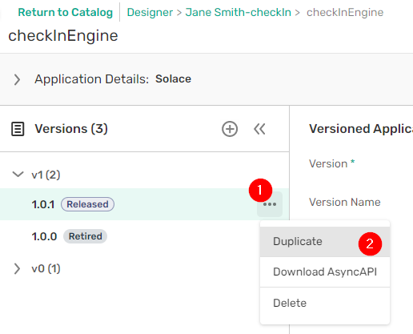
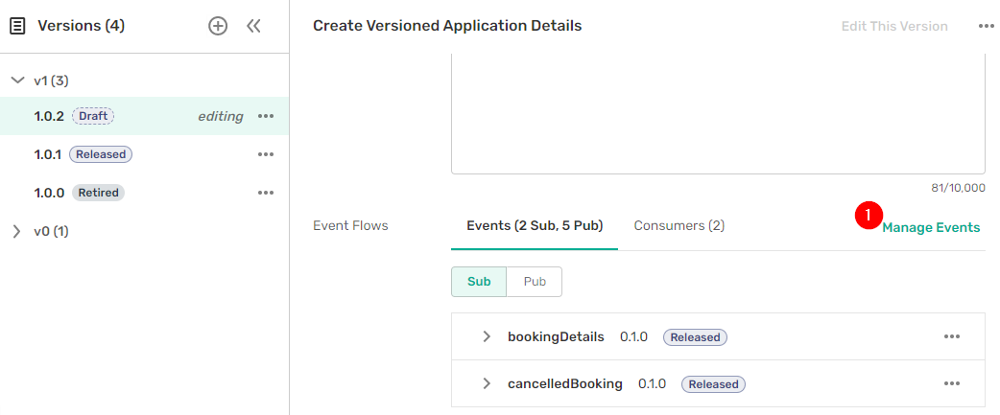
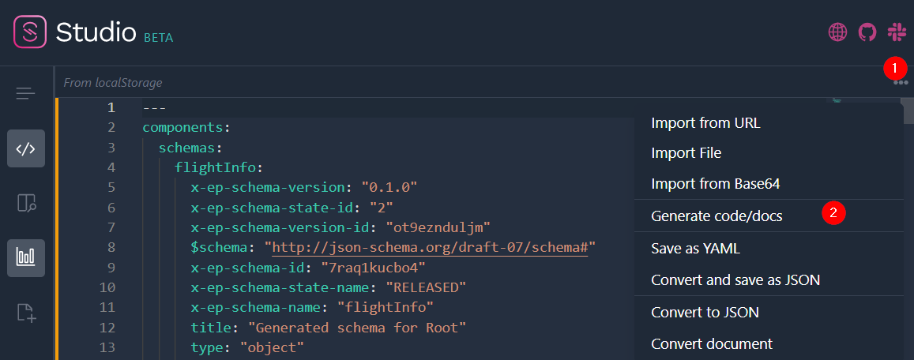
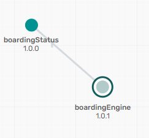
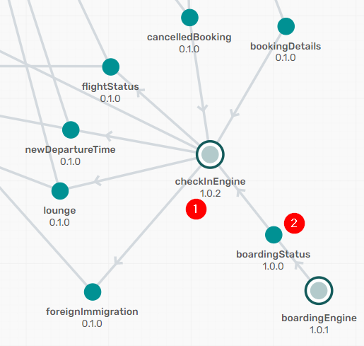

author: Jesse Menning
summary:
id: ep2-workshop-versioning-airline
tags:event-portal
categories:
environments: Web
status: Published
feedback link: https://github.com/SolaceDev/solace-dev-codelabs/blob/master/markdown/ep2-workshop-versioning-airline

# Solace PubSub+ Event Portal Training for Airlines

## What you'll learn: Overview

Duration: 0:03:00

During this code lab you'll put your PubSub+ knowledge into action, seeing a day in the life of a developer, and later on a deployment manager.

## What to do before the start of the workshop

Duration: 0:05:00

### Find your invite email
Prior to the start of the workshop you should have received an email with an invitation to join special Event Portal account used for this workshop.  Note that this is different than the main account used by your company.

### Get all signed up
When you click on Accept Invite, you'll be taken to a page to provide information and create a password.  Once you've done that, click on Sign Up.  

### Make sure you've got the latest features
Once you enter Event Portal, the turn on Event Portal 2.0 features using the toggle switch.

## Understand your current application

### Launch the catalog
Since you want to change the existing checkInEngine application,  use the catalog to find it, and examine what it looks like right now.

### Find your existing application

1. Make sure you are on the Applications tab
1. In the search box, type check
1. In the results, you can see all applications related to checkin
1. For the checkInEngine result, click on the three dots button on the right hand side 
1. Click on Open in Designer

### Better understand how the application works today

Here you see all of the information related to the checkInEngine.  Note that:
1.  There are multiple different versions of the application, including some that are retired and are no longer used.
1.  The most recent version is in the released state, which means that it cannot be modified.
1.  The application currently subscribes to two events: bookingDetails and cancelledBooking
1.  Now that you're familiar with the basic structure of the current application, click on return to catalog.

## Find hidden assets in your enterprise

### Dig for buried event treasure

Now you will find an interesting, existing event and add it to checkInEngine, to make it even more useful.  It would be helpful to have the lastest boarding status for flights, so try to find an event related to boarding.

1. Click on the Events tab at the top of the screen and type in boarding to the search box
1. Find the boardingStatus event that belongs to your domain and click on the ... button
1. Click on Open in Designer

### Better understand the event you found

Similar to the application page, the event page shows relevant information for the boardingStatus event.

1. There is a single released version, along with additional retired events.
1. It's a shared event, so applications outside the CheckIn domain can use it.
1. No applications are subscribing to the event right now (which is a huge missed opportunity), and its being published by the boardingEngine application.

So you know you've found hidden event gold.  Now it's time to update your existing application to use it!

## Exploiting your buried event 

Now you know a great event to add functionality to the checkIn application.  Navigate back to the checkin application definition and get started.

### Create a new draft application version 
As mentioned earlier, once an application is put into released status, it can no longer be updated.  To create a new version

1. Click on the three dots next to the latest released version
1. Click on duplicate

Now you have a new version of the checkInEngine application in Draft status, which can be edited.  

### Add an event to your application
Since you want to add an existing event, click on Manage Events, which lets you modified subscribed and published events.

You will see a list of events in the checkin domain.  (If you wanted to use a shared event outside the active domain you could use the Application Domain drop down at the top of the popup).  To subscribe to the boardingStatus event:

1. Click on the boardingStatus row to expand it
1. Find the latest version that is in released state, and click on Sub (for subscribe)
1. Click on the X at the top of the popup to close it.

Make sure your changes are saved by clicking on Save Version

### Add a consumer for the new event

Now the application is expecting the boardingStatus event, but you also need to specify where on the event broker to get the event.  A consumer lets you do that.

1. Switch from the Events tab to the Consumers tab.  You should see existing consumers for the existing events.
1. Click on Add Consumer.
1. Name the queue `checkinEngine.boardingStatus`
1. Select `Solace Direct Client` from the Type pull down
1. Click on Add Subscriptions

### Add a subscription to your consumer

In the next screen, Event Portal suggests events you might want to consume.  Click on the Select button next to `boardingStatus`

1. After selecting the event, Event Portal then tells you what events it will attract for a particular environment.  Here we are seeing events in Development
1. The application will attract only the boardingStatus event using that subscription, which is probably what you want (unintentionally receiving events due to an overly broad subscription is a major problem in EDA).  
1. You can see the suggested subscription in the topic address box
1. Click on Add Subscription to confirm your choice.

### Make sure everyone knows a new version is coming

Since you want to release the updated spec to your dev team, change the state of the version by first clicking on Change State

1. Make sure the "New State" is Released
1. Then click on Change State.

### Make sure everyone knows the old version is leaving

While you're at it, deprecate the old version so people know it's going away soon.

1. Click on the older version of the application
2. Click on Change state.

1. Make sure the New State is Deprecated
1. Click on Change State

> Now you've got a new application definition that is much more functional.  But what can you do with it?  In the next section, you will put your new application version into action.

## Make your application real

So you've got the structure of the new checkInEngine application. Now it's time to take it from design to implementation.  The key is AsyncAPI, which gives you access to a wide variety of tooling--including code generation.

### Download the AsyncAPI
Picking up where you left off in the last section:

1. Find the lastest version of checkInEngine
1. Click on the ... 
1. Click on Download AsyncAPI

In the resulting Download AsyncAPI window, 
1. Select the radio button to download the AsyncAPI in yaml
1. Click on Download File

Save the AsyncAPI file on your desktop and open it in the text editor of your choice.

### Get the spec into AsyncAPI Studio

There is wide support for AsyncAPI in many different tools, but the easiest way to get started is with [AsyncAPI Studio](http://studio.asyncapi.com)

1. Navigate to [AsyncAPI Studio](http://studio.asyncapi.com)
1. Cut and paste the contents of the downloaded AsyncAPI into the editor window

### Examine the AsyncAPI

Now would be a good time to check out structure of an AsyncAPI document.  You'll see that:

1. It's very similar to an OpenAPI document
1. Most of the information stored within Event Portal is reflected in the exported file.

### Generate code from the AsyncAPI

To actually generate the code, 
1. Click on the ... at the top of the screen
1. Click on Generate code/docs

On the next popup, 

1. Select Java Spring Cloud Stream Project from the Generate dropdown
1. Click on Generate
1. Save the generated .zip file to your desktop

### Celebrate your freshly generated code

The code generated by the AsyncAPI tooling has a deep folder structure, with the source AsyncAPI at the top level.  To see the generated code:

1. Navigate to `/template/src/main/java`
1. Open `Application.java`    This contains the application logic, which would be filled in by developers with your specific business logic.
1. Open the remaining files in the directory.  These are the Plain Old Java Objects (POJOs), which represent the events that will flow in and out of your application.

Example of generated POJOs.

So now you have defined an interface, specified where on the broker you will send and receive events, and generated code that implements it all.  But how do you keep everything in order while moving environments?  That's coming soon, but first some behind the scenes work.

## A quick change in hats

To this point you've played the role of a developer.  And your access in Event Portal has reflected that. You've only been able to see domains that you have authorization to, not those of other students.  In the same way, developers in a real-organization wouldn't be able to see or at least change events and applications owned by another group.

In this section, you'll support the infrastructure.  But to do that, you will need a different role in Event Portal. 

- If you're doing this class independently, you can do this on your own.
- If you're doing this class as part of a group instruction, your instructor will do these steps.

### See what users can do and change it

If you're an admin, you can see all users for an account by 

1. Clicking on the person icon at the very bottom left of the screen
1. Clicking Account Details

On the resulting admin screen, 
1. Click on User Management
1. Click the ... next to the user you want to modify
1. Click on Edit

You will see a variety of different roles for the user.  For this scenario though, make them a Event Portal manager.

Now you are all set for the next section, where you will play the part of a deployment manager.

## Fix deployment issues quickly

With your new job role of deployment manager in place, there is of course an immediate crisis.  Luckily you have the tools to quickly analyze what's going on.

### New tools, new buttons, new access

The first thing you'll notice is that as a deployment manager you have a new tool availabe to you: the Runtime Event Manager. You can get to it two ways:
1. The Home Screen
1. The Sidebar

Open the Runtime Event Manager using the sidebar

### Explore the Runtime Event Manager

Once you open the runtime event manager, you'll see 
1. All modelled event meshes for your organization.  A modelled event mesh shows what applications and events are currently available for one group of connected brokers (e.g. a Solace Event Mesh or a Kafka cluster)
2. Each modelled event mesh lives within an environment like production, integration or development.  Just like in real life, MEMs in different environments can look radically different. 

Your new access also lets you see additional resources within Event Portal, including others students' domains.  So for the rest of the lab, please be careful not to touch other peoples' stuff.

### A crisis arrives

A co-worker runs into the room, panicked because boardingStatus events are piling up on the event broker in Integration.  And there is a big presentation in 5 minutes.

### Analyzing issues quickly

Not wasting any time, you open up your integration modelled event mesh.

One thing is immediately obvious: the boarding status event isn't being consumed as expected in the Integration environment. But why?

Then you spot it: the wrong version of checkInEngine is deployed!

1.  You can see the events that checkInEngine subscribes to
1.  You can see the events that checkInEngine publishes
1.  You can see boardingStatus completely unattached
1.  And...you can see an old, deprecated version of checkInEngine connected to that mesh.

You get on the phone immediately to the deployment team, and they promote the new version of checkInEngine to integration.  Crisis resolved!

### Navigate from MEM to the application version

In the meantime you get started on updating the modelled event mesh to match the new deployment.

1. Click on the version of checkInEngine on the modelled event mesh graph
1. The application version is highlighted in the list on the left. You can see that it's deprecated, but that doesn't mean that it's been removed from all environments yet.  Click on checkInEngine.

1. Then click on Open in Designer, which takes you right to the application version.

### Change environments assignments to match reality

Under Environments for the version
1. Expand the airline Integration environment
1. Remove the two environment associations listed

Now switch to the version of the application that you created and add it to Integration by 
1. Clicking on the version in the left hand column
1. Clicking on the ... in the upper right corner
1. Selecting Add to Environment

Now you can assign the application to a particular environment, modelled event mesh and a messaging service, which is one event broker within an event mesh.

1. Select airline integration from the Environment pull down
1. Select your modelled event mesh
1. Select your messaging service (there should only be one available).
1. Click on Add.

### See the fruits of your labor

Navigate back to your integration modelled event mesh.  You should now see a beatifully connected graph, with boardingStatus flowing into checkInEngine. 

## What's next?

So, you've saved the day with Event Portal.  But having to manually update the modelled event mesh to reflect reality probably isn't the best process.   A better way would be to have Event Portal updates be part of your CICD pipeline.  If you're in a classroom setting, you're in luck, because that's the next topic.  If you are working independently, check out this [summary blog on Solace.com](https://solace.com/blog/software-development-lifecycle-with-event-portal/)

Duration: 0:07:00

Thanks for participating in this codelab! Let us know what you thought in the [Solace Community Forum](https://solace.community/)! If you found any issues along the way we'd appreciate it if you'd raise them by clicking the Report a mistake button at the bottom left of this codelab.
