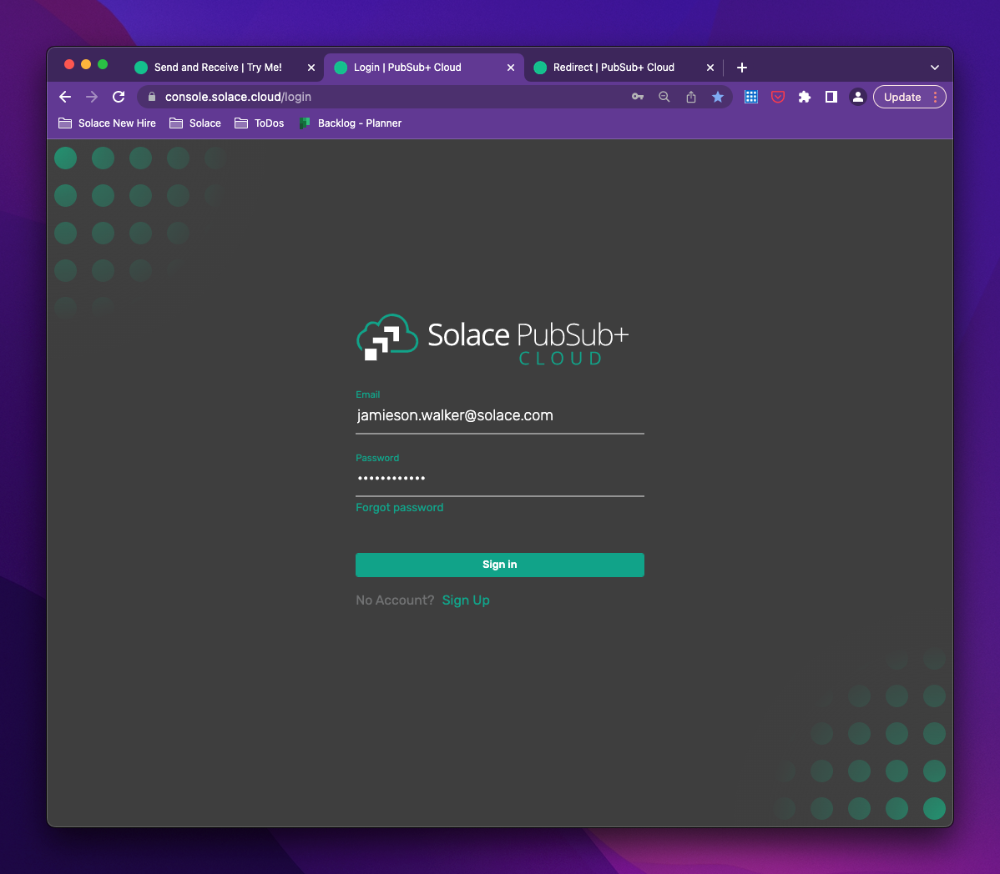
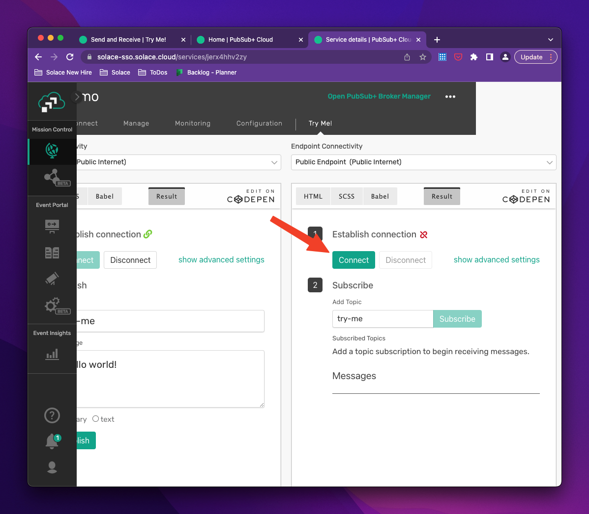

author: Jamieson Walker
summary:
id: explore-dmr
tags:
categories: solace,dmr
environments: Web
status: Published
feedback link: https://github.com/SolaceDev/solace-dev-codelabs/blob/master/markdown/explore-dmr/explore-dmr.md

<!--
 # Explore DMR - change

## What you'll learn: Overview

Duration: 0:05:00

Enter a codelab overview here: what & why and github repo link where you can find related code if applicable

### Info Boxes
Plain Text followed by green & yellow info boxes 

Negative
: This will appear in a yellow info box.

Positive
: This will appear in a green info box.

### Bullets
Plain Text followed by bullets
* Hello
* CodeLab
* World

### Numbered List
1. List
1. Using
1. Numbers

### Add an Image or a GIF


## What you need: Prerequisites

Duration: 0:07:00

Enter environment setup & prerequisites here

### Add a Link
Add a link!
[Example of a Link](https://www.google.com)

### Embed an iframe


## Custom Step 1
## Custom Step 2
## Custom Step 3

## Takeaways

Duration: 0:07:00

✅ < Fill IN TAKEAWAY 1>   
✅ < Fill IN TAKEAWAY 2>   
✅ < Fill IN TAKEAWAY 3>   


Thanks for participating in this codelab! Let us know what you thought in the [Solace Community Forum](https://solace.community/)! If you found any issues along the way we'd appreciate it if you'd raise them by clicking the Report a mistake button at the bottom left of this codelab. 
-->

# DMR (Event Mesh) Exploration Procedures

## Objectives
Duration: 0:05:00

### Prerequisites
1. 2+ Solace PubSub+ Brokers deployed in environments where they are visable to eachother over a network.
2. Access to the Solace Broker WebUI for all Brokers via administrator credentials. 

If you do not meet both of these requirements please use the following resources to setup and configure Solace PubSub+ Brokers.
* [Solace Broker CodeLab](https://codelabs.solace.dev/codelabs/get-started-basics/index.html)
* [Solace Cloud Trial](https://console.solace.cloud/login/new-account)
* [Solace PubSub+ Standard Docker](https://hub.docker.com/r/solace/solace-pubsub-standard)
<br>

In this post will lay the groundwork for a Solace Event Mesh by setting up a Dynamic Message Routing (DMR) link between two stand alone brokers.  These brokers can be running in Docker or on Solace Cloud, in any cloud environment.  Then we will explore how events are propogatted across a DMR link.  Setup publishers and Subscribers to each of the brokers in our Event Mesh to see events publish to one broker be dynamically routed to the other brokers in our Event Mesh where there are active subscribers. 

### Learning Objectives:
⬜ < Setup a DMR link between two Solace Brokers >  
⬜ < Publish and Subscribe to DMR enabled topics with Try Me >  
⬜ < Publish and Subscribe to DMR enabled topics with SDKPerf >   
<br><br>

### Resulting Architecture:


## Setting up DMR with the Solace Broker WebUI
Duration: 0:05:00

**What is a Solace Event Mesh Powered by DMR**

If you have not heard about Solace Dynamic Message Routing(DMR) or Event Mesh here is a quick refresher: An event mesh is like a super-efficient highway system for data that allows event data to flow only to parts of the mesh where that event is needed. This occurs dynamically, meaning that new event types can be added any time, and new interests in events can also be registered, immediately changing the flow of events in real time. Event Brokers that make up the mesh can be running in any environment (data center, private cloud, public cloud, or combination), and are configured to dynamically route data from producing applications to consuming applications without forcing those applications to know about one another, or how they connect to the mesh.


## Exploration with “Try Me” tab
Duration: 0:01:00

## Setting up and running "Try Me"

**Option A: For your local (on-premise) broker**

1. Navigate to your on-premise broker WebUI and Login
    
    
    
2. Select the Message VPN you wish to use
    
    
    
3. Select“Try Me” tab on the left side bar menu inside of the WebUI
    
    
    
4. Populate with your on-premise broker details into the Publisher side, unless you are running the broker on your local machine you will likely have to change the “Broker URL”, “Client Username” and “Client Password”. You may also have to change the “Message VPN” depending on your setup. 
    
    
    
5. Select the “Connect” button on the Publisher side of “Try Me”.
    
    
    
6. Select the “Connect” button on the Subscriber side of “Try Me” as well.  The connection details will carry over from the Publisher side unless you expand the drop down menu, uncheck the “Same as Publisher” option and modify them.
    
    
    
7.  Now we can customize our Publish topic, Delivery Mode and Message Content and Publish messages directly to our local (on-premise) broker. 
    
    
    
8. We can also subscribe to any topics that we would like on the right side by changing the subscribe field and pressing “Subscribe”. The topic can be one that is published to our local broker or published to any other broker in the DMR(Event Mesh) that your user has access to.
Do not forget about our Solace wild cards here 
<br>
    `* is a single level wild card: example/topic/with/a/*/wildcard`
<br>
    `> is a multi level wild card: example/topic/>`
   
    
    
    

**Option B: For your Solace Cloud Brokers**

1. Log into Solace Cloud
    
    
    
2. Select the Service you would like to test. Remember that the service must already be DMR linked to the other services you want to experiment with.
    
    
    
3. Navigate to the “Try Me!” Tab along the top of the services web page
    
    
    
4. On Solace Cloud the Service connection details should already be correctly populated and you can simply click “Connect” on the Publisher side.  However if that does not work you can select “show advanced settings” to manually configure “Broker URL” “Client Username” “Client Password” and “Message VPN”
    
    
    
5. On the Subscriber side you can also simply select “Connect”. However if that does not work you can select “show advanced settings” to manually configure “Broker URL” “Client Username” “Client Password” and “Message VPN”
    
    
    
6. Now we will specify a unique publish topic on the Publisher side of the “Try Me!” tab and begin publishing events to our cloud broker
    
    
    
7. We can also subscribe to any topics that we would like on the right side by changing the subscribe field and pressing “Subscribe”. The topic can be one that is published to our local broker or published to any other broker in the DMR(Event Mesh) that your user has access to.
Do not forget about our Solace wild cards here 
<br>
    `* is a single level wild card: sample/topic/with/a/*/wildcard`
<br>
    `> is a multi level wild card: sample/topic/>`

    
    
    
💡 Note: in this screen grab you can see that we are subscribed to a topic that is being published to a topic on a different Solace Broker which is in a DMR link (Event Mesh) with this broker. Thus requiring that DMR route the event from that other broker to this cloud broker when events are published. 

### Seeing Events flow across the DMR (Event Mesh):

Now that we have created publishers and subscribers via the “Try Me” tabs on our different DMR linked (Event Mesh) brokers we can start publishing events and watch them flow between brokers.  Experiment with “Try Me” subscriptions to only local topics, remote topics and combinations of both to get a better understanding of how Solace is Dynamically Routing messages between brokers.

## Exploration with SDKPerf tool
Duration: 0:05:00

Obtain the SDKPerf Solace Performance testing tool from our downloads page here: [https://solace.com/downloads/](https://solace.com/downloads/) at the bottom of the page.  You can select from your desired flavor or the testing tool.  


Check out general SDKPerf documentation here: [https://docs.solace.com/API/SDKPerf/SDKPerf.htm](https://docs.solace.com/API/SDKPerf/SDKPerf.htm)

And additional command line argument options here: [https://docs.solace.com/API/SDKPerf/Command-Line-Options.htm](https://docs.solace.com/API/SDKPerf/Command-Line-Options.htm)

💡 I will be using the Solace SDKPerf_java tool on a unix based system for this example.  All of the flavors behave similarly with different underlying protocols. 

## Running SDKPerf
Duration: 0:05:00

Navigate to the unpacked directory of your recently downloaded SDKPerf tool in the terminal of your choice.  When you list the contents of the directory you should see some libraries and in the case of the java tool: sdkperf_java.sh and sdkperf_java.bat.  We will use these scripts to execute the tool. 

List of common SDKPerf flags

```
-cip= <- the ip address(host name) and port of the broker we wish to connect to 
-cu=  <- userid and message vpn we wish to connect as seperated by @
-cp=  <- password for the user we are connecting as
-ptl= <- publish topic list, the topics we want to publish to separeated by ,
-stl= <- list of topics we want to subscribe to separated by a ,
-mn=  <- integer for the number of messages we want to publish
-mr=  <- integer for the rate at which we want to publish or subscribe in msg/sec

```

### Create SDKPerf Publisher to Broker A on topic sample/broker/a

```
./sdkperf_java.sh -cip=localhost:55554 -cu=admin@default -cp=admin -ptl=sample/broker/a -mn=100 -mr=1
```


### Create SDKPerf Publisher to Broker B on topic sample/broker/b

```
./sdkperf_java.sh -cip=mr-6d275srp5ae.messaging.solace.cloud:55555 -cu=solace-cloud-client@jamiesontest -cp=vkkveu1ublk5ekl4mffh7uvmf -ptl=sample/broker/b -mn=100 -mr=1
```


### Create SDKPerf Subscriber to Broker A on topic sample/broker/b

```
./sdkperf_java.sh -cip=localhost:55554 -cu=admin@default -cp=admin -stl=sample/broker/b
```


### Create SDKPerf Subscriber to Broker B on topic sample/broker/a

```
./sdkperf_java.sh -cip=mr-6d275srp5ae.messaging.solace.cloud:55555 -cu=solace-cloud-client@jamiesontest -cp=vkkveu1ublk5ekl4mffh7uvmf -stl=sample/broker/a
```


## Conclusion
Duration: 0:05:00

✅ < Setup a DMR link between two Solace Brokers >   
✅ < Publish and Subscribe to DMR enabled topics with Try Me >   
✅ < Publish and Subscribe to DMR enabled topics with SDKPerf >   

We have explored two different ways of easily publishing and subscribing to Solace topics.  Using these two methods and Solace Brokers that are connected into a DMR Event Mesh you can create a suite of publishers and subscribers on each broker in the Event Mesh.  By experimenting with the topics each subscriber SDKPerf tool or “Try Me” tool is advertising a subscription to you can see how events are dynamically routed between brokers that are DMR linked.  As a side note you can also cause a broker in the DMR Event Mesh to have advertise a topic subscription by creating a queue on the broker and subscribing to a topic that is being published to a different broker in the DMR Event Mesh.  But keep in mind that the subscriptions in these queues will be a more static subscription so unless you delete the queue or its subscription the events will always be passed to that broker to be stored on the queue.
