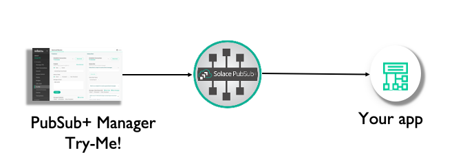
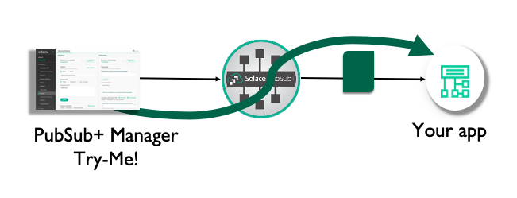
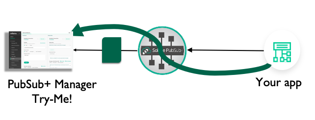

author: Tom Fairbairn
summary: An exploration of the basics of getting started with Solace's Native APIs
id: exploring-solace-native-apis
tags: workshop
categories: Solace, Java, C
environments: Web
status: Published
feedback link: https://github.com/SolaceSamples
analytics account: UA-3921398-10

# Exploring Solace Native APIs - The Basics

## Introduction
Duration: 0:02:00

### New to Solace? Using open APIs such as REST, Paho for MQTT or JMS with Solace?  Want to learn the basics of how the Solace native APIs work? 

This is the place for you!  

Open APIs provide a great way to use event and message broking products in an interoperable way, but they tend to be limited in scope and often features.  There's no Request/Reply pattern in MQTT, for instance.

To access the full power and performance of Solace's Event Broker, you'll want to use Solace's Native APIs.  Best of all, the Solace Broker allows transparent operation between all the Open APIs and protocols and the Solace Native APIs, so you can pick and mix between them without worrying about compatibility.

### Native API languages
* C
* Java
* Real-time Java (no garbage collection)
* C#
* iOS
* JavaScript
* NodeJs

### What you'll learn
* Where to go for sample code and documentation
* How to get started
* How to connect to the broker
* The callback pattern for asynchronous event driven coding
* What a Solace session is
* Dealing with session events
* Sending and Receiving messages 

## Prerequisites & Assumptions

Duration: 0:07:00

Before you start, make sure:
* You have your favourite IDE fired up and ready to go

* You have a "broker" set up and ready to go.  A "broker" could be [Solace Cloud](https://console.solace.cloud/) plan, local PubSub+ software running under [Docker](https://products.solace.com/download/PUBSUB_DOCKER_STAND) or a [VM](https://products.solace.com/download/PUBSUB_STAND_OVA), or even a hardware appliance if you're lucky.  Just make sure you have the client credentials, for instance "client_username@messag-vpn" and the password.
* You have "no" or "basic" authentication configured on the broker you're connecting to.  Of course we can do TLS, but that's waaaaay beyond the scope of this one...
* You've [downloaded](https://solace.com/downloads/), installed or included in your dependency manager the native API of your choice
*  You know that [github.com/SolaceSamples](https://github.com/SolaceSamples) exists, and, even better, you've cloned it
* (Somewhat optional) You can write code.
* (A bit more optional) You've downloaded and installed [sdkperf](https://products.solace.com/download/SDKPERF_JAVA)

Positive
: We have a lot of excellent Tutorial material available to help you get started.  This CodeLab doesn't replace those, it's here to encourage you to use them!
* Nice simple [Get Connected Tutorials](https://www.solace.dev/)
* More detailed [Developer Tutorials](https://docs.solace.com/Developer-Tutorials/Developer-Tutorials.htm)

#### Cloning SolaceSamples

Create a directory in the location of your choice where you'll follow along and run the samples.  We then want to clone SolaceSamples in to your directory.  You have 3 choices: 
* git clone
* svn checkout
* use your browser and pick the "download" button.

As an example, using git clone for the java samples:

	git clone https://github.com/SolaceSamples/solace-samples-java	

### Free Solace Stuff!
Positive
: All of the broker images and API software are available on the [Solace Downloads Page](https://solace.com/downloads/).  If you haven't already, go to it!

## Overview
Duration: 0:05:00

We will walk through the basic code path to get you connected to a Solace broker using the Native APIs and exchanging messages.  By the end, you should have a good grasp of the basic principles of the APIs.

Positive
: These samples tend to use Java, but the basic concepts and terminology behind the APIs are the same across all the APIs.

### Getting Started: verifying a connection
At the start we'll validate we can connect to the broker using the Try-Me! feature of PubSub+ Broker Manager.  We'll then use PubSub+ Broker Manager to find and validate our connection.

### Part A
We'll then get your code to connect to the broker.  This introduces the *session* concept.

### Part B
We'll then create a session callback and have your code receive messages

### Part C 
Now it's time to send a message.  We'll reverse the flow so that your application is sending it to Try-Me!

## Start: connect using Try-Me!
Duration: 0:05:00

### Connect Try-Me! to your broker

We will connect Try-Me! to the broker, then validate we have a connection using PubSub+ Broker Manager.

#### An aside: SDKPerf 

For performance or advanced feature debugging, we have a specialised test harness called SDKPerf.  If you think an API feature doesn't work as expected, try the feature with SDKPerf to check.  SDKPerf's message display is also dynamite, and it gives you the option to listen with the API of your choice.  Grab it from the [download site](https://solace.com/downloads/) and install, then:

Linux:

	./sdkperf_java.sh -h

Windows:

	sdkperf_java.bat -h

Positive
: Replace "sdkperf_java.sh" with "sdkperf" for C or your favourite SDKPerf variant for your API of choice.

### 1 Find Try-Me!

Firstly, start PubSub+ Broker Manager.  This should be fairly straight-forward.  You need the IP address of your broker, and the SEMP port.

* Docker: "localhost:8080"
* VM image: "{ip address}:8080
* Cloud: o to the Solace Cloud console, select "Messaging Services," click the service and go to the "Manage" tab.

### 2 Connect Try-Me!

If you are using PubSub+ Cloud, go to the Solace Cloud console, select "Messaging Services," click the service and go to the Connect tab:

Pick "Solace Messaging" and make a note of the username, password, Message VPN and "SMF Host" entries:

You'll need these details later.  But to connect Try-Me, just navigate to the Try-Me tab on the left hand menu:

Now we need to connect.  The connection details are filled in, which makes things easy, so just go to the **Subscriber** and click the "Connect" button.

Positive
:  If you're using Docker, you may not connect.  This is because the default docker compose yaml doesn't expose the port Try-Me uses.  Simply stop the containerand edit the .yml file.  Fine the Port Mappings section, and uncomment the line below "#Web transport"

	    #Port Mappings:  Ports are mapped straight through from host to
    #container.  This may result in port collisions on commonly used
    #ports that will cause failure of the container to start.
      #Web transport
      - '80:80'		<----  Uncomment this line.

Then recreate and restart your container.

## Start: find connection in PubSub+ Broker Manager
Duration: 0:05:00

#### For local (Docker/VM/Appliance brokers)

Open PubSub+ Broker Manager.  Go to your web browser and type the IP address and port of your broker: for default Docker or VM installations, this is http://{ip address}:8080.  In my installation above, that looks like

	http://192.168.0.31:8080/

PubSub+ Broker Manager will start.  Click on the message VPN ("default" for vanilla installs), then click Client Connections.  

### For PubSub+ Cloud

Go to the [PubSub+ Cloud console](https://console.solace.cloud/), then pick the  **Messaging Services** item on the left hand menu, then click on your service, then click on the **Manage** tab.  

Then, under the **PubSub+ Broker Manager Quick Settings** heading, click **Clients**.  This will take you to the PubSub+ Broker Manager Client Connections screen.

### PubSub+ Broker Manager Connections Screen

In the Client Connections Screen, you should see a list of the client connections for your broker.  Since this is a *native* connection, it will appear in the **Solace Clients** tab: here's what I saw:

It's worth spending a minute or two exploring the client connection screens.  For instance, by clicking on a client, you'll be able to find out what topics this client is subscribed to, what computer it is running on, the process ID, the version of the API, and lots of other useful information that will help you debug clients.

I would always recommend checking that you have connected to the broker you think you have and to the VPN you think you have.  Checking you can see the connection using PubSub+ Broker Manager is a great way to make sure you're where you think you are.

Now we've successfully connected a test client (sdkerf), validated that it has connected to the broker and used PubSub+ Broker Manager to interrogate the connection, we can get started with code!

## API Initialisation
Duration: 0:15:00

Let's start by working out how to get the API initialised and ready to connect.

### Samples and docs

A good way to get started is to have a look at [Solace Samples in Github](https://github.com/SolaceSamples).

The documentation for the APIs is available [on the Solace documentation website](https://docs.solace.com/) under the [API documentation section](https://docs.solace.com/Solace-PubSub-Messaging-APIs/Solace-APIs-Overview.htm), including API reference manuals.

### API Initialisation

Some APIs, C for instance, requires a call to be made to initialise the API first.In the case of C, you need to call

	solClient_initialize(<log level>, <properties>)

For Java, no initialisation call is needed.

There's also logging to consider: the Solace APIs generally let you use your own logging approach.  Standard log levels have been chosen for you to use (INFO, DEBUG etc).

I'll leave you to investigate the details of API initialisation and log levels in the docs, as we're going to concentrate on getting connected with a session.

## Part A: Get Connected: The Session

The Solace APIs use the concept of the **session** to abstract the communication to the broker.  It's the communication channel between the API and the broker, wrapping up details such as the underlying TCP socket.

Multiple sessions can be created, but we'll only use one here.

### 1 Create the session properties

To configure the session (for instance, where should it connect to?), we create session properties and fill them out.  

In most samples you'll see a "TopicSubscriber."  Open this is the sample language of your choice, and find the section where the session properties are filled out.

Java:
Go to line 57ish, under "TopicSubscriber initializing...".

	JCSMPProperties properties = new JCSMPProperties();
	properties.setProperty(JCSMPProperties.HOST, <host name or IP address>);
	properties.setProperty(JCSMPProperties.USERNAME, <username>);
	properties.setProperty(JCSMPProperties.VPN_NAME, <message VPN name>);

C uses an array:
Go to line 115ish, under "Configure the Session properties."

	const char     *sessionProps[50];
	int             propIndex = 0;
	sessionProps[propIndex++] = SOLCLIENT_SESSION_PROP_HOST;
	sessionProps[propIndex++] = <host name or IP address>;
	/* Similarly for SOLCLIENT_SESSION_PROP_VPN_NAME & SOLCLIENT_SESSION_PROP_USERNAME */

### Threads

Before we create the session, let's briefly discuss threading.  

#### Java, Javascript

In most of the Solace APIs, the context thread is automatically created for you.This reads and writes from the socket.  An internal queue is used to accept data to be sent and data received.  Data from this queue is then handed off to the application thread.  You can turn this queuing mechanism off in Java (it's called the *reactor*) but please don't until you've researched it - for instance, by understanding why you might want to.

#### C

We need a thread to read and write to the socket, which in the Solace APIs we call the *context thread*.  In the C API, the context must be explicitly created.  You have lots of control over how this is done, but for today, we'll stick with the API provided thread:

	solClient_opaqueContext_pt context_p;
	solClient_context_createFuncInfo_t contextFuncInfo = SOLCLIENT_CONTEXT_CREATEFUNC_INITIALIZER;
	returnCode = solClient_context_create ( SOLCLIENT_CONTEXT_PROPS_DEFAULT_WITH_CREATE_THREAD,
	  &context_p, &contextFuncInfo, sizeof ( contextFuncInfo ) )

Negative
: I have omitted checking the return code from the C function calls for clarity.  Please don't.  If you get something other than SOLCLIENT_OK, you need to do something.

The context thread will run reading from the socket.  The *callbacks* (see below) are executed in the context thread, so please return from them as quick as possible - for instance by putting data in a structure to be processed in the application thread.  

Don't block the context thread.  A classic problem is to get a message in the receive callback, realise it's a request/response message, create a reply and try to send() it, all in the receive callback.  It'll probably work most of the time.  People have made a lot of money making cars that work all the time while other people have lost a lot making cars that probably work most of the time.  

### 2 Create the session

Finally!  Let's create the session.  It's important to note that in the Solace native APIs, creating an object at the API level is just that - generally it just creates the object in the API and doesn't actually do anything with it.  

This is true for sessions - create it at the API level, then we need to connect it so that the session is actually started.  Java:

	JCSMPSession session = JCSMPFactory.onlyInstance().createSession(properties, null, eventHandler); 
	session.connect();

In C:

	solClient_session_create ( sessionProps,
	  context_p,
	  session_p, &sessionFuncInfo, sizeof ( sessionFuncInfo ) );
	solClient_session_connect ( session_p );

That's it!  We now have enough to start the API and connect to the broker.  It won't do anything very interesting, but it might be worth trying it out just to check you're happy with the concepts.  

I've created a mini sample that illustrates this in Java:

	import com.solacesystems.jcsmp.JCSMPException;
	import com.solacesystems.jcsmp.JCSMPFactory;
	import com.solacesystems.jcsmp.JCSMPProperties;
	import com.solacesystems.jcsmp.JCSMPSession;
	
	
	public class Session {
	
	  public static void main(String... args) throws JCSMPException {
            final JCSMPProperties properties = new JCSMPProperties();
            properties.setProperty(JCSMPProperties.HOST, args[0]);  // msg-backbone-ip:port
            properties.setProperty(JCSMPProperties.VPN_NAME, args[1]); // message-vpn
            properties.setProperty(JCSMPProperties.USERNAME, args[2]);
            properties.setProperty(JCSMPProperties.PASSWORD, args[3]);
            final JCSMPSession session = JCSMPFactory.onlyInstance().createSession(properties);
            session.connect();
         
            while (true) { }
    	  }
	}

But it doesn't do anything!  Quite.  Read on...

## Part B: Receiving Messages & Callbacks
Duration: 0:10:00

### 1 Callbacks

Now we have a session, but we have to have a mechanism for dealing with asynchronous events: a message arriving, or the connection being interupted, for instance.

The way nearly all asynchronous programming models deal with this is via a *callback*, specifying some code to be executed when the event occurs.

#### Session Event callback

Things that happen to the session as a whole - a disconnection, for example - are handled by the session event callback.

	public class EventHandler implements SessionEventHandler {
	  public void handleEvent(SessionEventArgs event) {

And in C:

	void eventCallback ( solClient_opaqueSession_pt opaqueSession_p,
                       solClient_session_eventCallbackInfo_pt eventInfo_p, void *user_p ) {

Once we're in the event call back, we can decode which session event was the cause (event.getEvent() in Java or eventInfo_p->sessionEvent in C) and take appropriate action.

#### Registering the callback

In C we have to supply the session event callback when we create the session function information structure:

	sessionFuncInfo.rxMsgInfo.callback_p = event_callback;
	
Which we then pass to the session creation call:

	solClient_session_create ( sessionProps,
		context_p, &session_p, &sessionFuncInfo, sizeof ( sessionFuncInfo ) )	

In Java, we pass the session event callback to createSession:

	session = JCSMPFactory.onlyInstance().createSession(properties,
			null,
			SessionEventHandler);

This is optional, though, but best practice says please do something with your session events, even if it's just log them.

Positive
: If you're the kind of person that asked the teacher for extra work after you'd finished the optional work before the rest of the class had finished the first question, a good exercise is to create code that prints out all session events and run it in various scenarios.

### 2 Receiving messages

#### Subscribing

OK, we've got a session, how do we get messages?  For that we need a receive callback.  How do we tell the broker *what* we want to receive?  We use a *topic subscription*.  First things first, we need to create the topic to which we'll subscribe.

Positive
: Remember!  This is just creating the Topic object in the API.  No topic is created in the broker.

TopicSubscriber.java, line 63:

	final Topic topic = JCSMPFactory.onlyInstance().createTopic("tutorial/topic");

We can then send the subscription request to the broker.  Make sure you're connected to the session first.

TopicSubscriber.java, line 91:

	session.addSubscription(topic);

In C, because we don't have objects we simply send the subscription request with the topic as a string (TopicSubscriber.c line 143):

	solClient_session_topicSubscribeExt ( session_p,
			SOLCLIENT_SUBSCRIBE_FLAGS_WAITFORCONFIRM,
			argv[5] );

It's no good having a subscription if we don't do anything with our messages when they arrive.  How are we going to get messages asynchronously as they arrive?  With a callback, of course.

In Java, we create an object called a Message Consumer.  TopicSubscriber.java, line 72:

	final XMLMessageConsumer cons = session.getMessageConsumer(new XMLMessageListener() {
	  @Override
	  public void onReceive(BytesXMLMessage msg) {

In C, we create a function and add the function pointer to the session information structure.  TopicSubscriber.c, line 37:

	solClient_rxMsgCallback_returnCode_t sessionMessageReceiveCallback(
			solClient_opaqueSession_pt opaqueSession_p,
			solClient_opaqueMsg_pt msg_p,
			void *user_p ) {
Then at line 110:

	    sessionFuncInfo.rxMsgInfo.callback_p = sessionMessageReceiveCallback;

That's it!  All we now have to do is add some logic to actually do something with the message, like print out it's contents.  We now have all that's required for TopicSubscriber to work.  Go ahead and run it. 

###3 Validating TopicSubscriber

Run TopicSubscriber, and *publish* a message using Try-Me!

#### 1. Connect Try-Me! Publisher

Go to the **Publisher** Try-Me! pane, and hit connect.

#### 2. Send a message

We need to make sure we publish to the right topic.  If you recall, we're subscribing to "tutorial/topic":

	        final Topic topic = JCSMPFactory.onlyInstance().createTopic("tutorial/topic");

So fill out the topic box appropriately and hit Publish:

You should see the message printed in TopicSubsriber.  Make sure you publish to the same topic (-ptl in sdkperf) as you are subscribed to.  SDKPerf in this example is publishing to topic ("-ptl") tutorial/topic as that's the default topic used in the samples.

You should see something like:

	Connected. Awaiting message...
	Message received.
	Message Dump:
	Destination:                            Topic 'tutorial/topic'
	Priority:                               4
	Class Of Service:                       USER_COS_1
	DeliveryMode:                           DIRECT
	Message Id:                             4
	
	Exiting.

Next, go to PubSub+ Broker Manager, find TopicSubscriber, and check that you've subscribed to tutorial/topic.  We covered most of this in Section 5, so refer back there if you need to, but we didn't cover it all - have a look around!

We've now completed Part B - sdkperf has sent a message which we've received in TopicSubscriber.

So, let's move on and see how we can actually send messages.

## Part C: Sending Messages
Duration: 0:15:00

### Java: Message Producers

Let's start with Java.  Just like receiving messages, where we have a *Message Consumer*, we need to create a **Message Producer**.  Looking at line 69 of **TopicPublisher.java**, you can see how this object is created:

	XMLMessageProducer prod = session.getMessageProducer(

As for receiving messages, we can provide some callbacks - what happens if there's a response (for request/reply messages), or some kind of error.  In TopicPublisher we provide an anonymous class to do this.  You could, of course, implement **JCSMPStreamingPublishEventHandler** and pass your class in.

###1 Creating a message object/buffer to populate

Before we send a message, we'll need to create it.  The native APIs provide message objects or buffers to handle this for you.

TopicPublisher.java, line 82:

	TextMessage msg = JCSMPFactory.onlyInstance().createMessage(TextMessage.class);

TopicPublisher.c, line 141:

	solClient_msg_alloc ( &msg_p );

Some best practices around message object/buffer handling: as you'd expect, allocating/deallocating is expensive.  Try not to use a message once, throw it away and create another.  Once you've finished with a message, **reset** it and use the object/buffer again:

	msg.reset();

C:

	solClient_msg_reset(msg_p);

In C, if you really have finished with the buffer, it's always a good idea to free it:

	solCliet_msg_free( &msg_p );

###2 Delivery Mode

In the C API the next thing the TopicPublisher sample does is set the **Delivery Mode**: put simply, do you want a Guaranteed (Persisted) message, or a direct, fire-and-forget message?  I'll not get in to the differences, or how to send and receive guaranteed messages (you use an API concept called a "flow"), and for now we'll use the simplest mode:

	solClient_msg_setDeliveryMode ( msg_p, SOLCLIENT_DELIVERY_MODE_DIRECT );

This is assumed by default in Java.

###3 Destinations

Now we have a message, and we've decided what Quality of Service (Guaranteed or Direct - we chose Direct in this case) it will be.  We now need to decide where to send the message - to a queue, and if so what the queue name should be, or to a topic, and if so what topic.

Positive
: Always **always** send to a topic.  Even if you plan to send to a queue, send to a topic and have the queue map the topic.  Always.  Can I say it one more time?  Always send to a topic.

In Java, this is pretty simple: we just call send on the producer and provide the topic, remembering that **Topic** is an object we need to create:

	final Topic topic = JCSMPFactory.onlyInstance().createTopic("tutorial/topic");

In C we have to do a bit more (line 147):

	destination.destType = SOLCLIENT_TOPIC_DESTINATION;
	destination.dest = argv[5];
	solClient_msg_setDestination ( msg_p, &destination, sizeof ( destination ) );

###4 Message contents

There's not much point sending a message if there's nothing in it (actually, that's not true - there's plenty of information that can be encoded in the message topic and in message headers, but that's a subject for a separate discussion!)

The Java API has several message types that you can use to make manipulating message payloads easier.  You'll notice from before that we create a **TextMessage** - you could just as easily create a BytesMessage, for instance.

#### Adding the contents to the message

In Java, we simply call the appropriate function for the message object we've created.  In TopicPublisher, we've create a TextMessage, so:

	msg.setText(text);

In C, we manipulate the **Binary Attachment**:

	solClient_msg_setBinaryAttachment ( msg_p, text_p, ( solClient_uint32_t ) strlen ( (char *)text_p ) );

###5 Send!

In Java, we tell the producer where to send the message:

	prod.send(msg,topic);

In C, we've already annotated the message with the destination, so we just call send:

	solClient_session_sendMsg ( session_p, msg_p );

So, let's do that.  Firstly, let's use Try-Me!  Make sure Try-Me! is connected and subscribed to the right topic.  Try-Me! is a good place to experiment with **Topic Wildcards**, as I've done here:

I said earlier that SDKPerf can be very handy for application debug as its message display functionality is very good.  Let's set up our SDKPerf subscriber so we can see the message being received:

	sdkperf -cip <broker ip> -cu <username>@<message-vpn> -stl tutorial/topic -md

The "-md" stands for "message dump."

Positive
: I'd encourage you to always attach an sdkperf subsriber with message dump turned on whenever you're debugging an application if you can't get enough information from Try-Me!

Then we'll just fire up TopicPubisher and see what comes out:

	^^^^^^^^^^^^^^^^^^ Start Message ^^^^^^^^^^^^^^^^^^^^^^^^^^^
	Destination:                            Topic 'tutorial/topic'
	Priority:                               4
	Class Of Service:                       USER_COS_1
	DeliveryMode:                           DIRECT
	Message Id:                             6
	Binary Attachment:                      len=15
	1c 0f 48 65 6c 6c 6f 20    77 6f 72 6c 64 21 00       ..Hello.world!.
	
	^^^^^^^^^^^^^^^^^^ End Message ^^^^^^^^^^^^^^^^^^^^^^^^^^^

This is what TopicPublisher sent.  Since it's what we were hoping to send, we can now attach our own subscribing application.  If only we had one... hold on - TopicSubscriber!

###6 Publish/Subscribe

**LEAVE TRY-ME! RUNNING** and run TopicSubscriber.  The re-run topic publisher.  What you should see is that same message appearing in both applications.  By the magic of Publish/Subscribe, we've sent a single message to two different applications *without either of the original sender or receiver being aware of it*.

You could even download and run different TopicSubscribers from different APIs, or different SolaceSamples.  That shows how you can send a message in one language and receive it in different languages.

## Wrap up, and Things We Didn't Cover
Duration: 0:03:00

So there we go - that's the basics of creating a connection, receiving and sending messages using the Solace Native APIs.

###Why use the Native APIs?

Why use the Native Solace APIs over, say an open API?

* Best feature support,  e.g. MQTT 3.1 doesn't support request/reply
* Best performance
* Solace support for the API itself

###What's the psuedo-flow?
1. Initialise API.  Set up logging.
2. Create Session properties.
3. Create session.
4. Add subscriptions.
5. Start consumer.
6. Create messages & populate them.
7. Send them.
8. Clean up - free, dispose, close.

###We ran out of time...
* Guranteed messages - we didn't cover this.  The basic idea is the **flow**, both on the producer and consumer side, which is an API object which holds the state associated with whether the message has been acknowledged yet.
* Cleaning up - we brushed up againt this.  Free/dispose of your message buffers, close() the session cleanly.
* Correlation - for request/reply messages and Guaranteed Message acknowledgements.
* Request/Reply - there's a topic (the "reply-to" topic) that has a default you can over-ride.
* Last Value Queues, Queue Browsers, Dead Message Queues, Time To Live...

I hope you enjoyed this CodeLab and found it useful!  We're always keen to hear your feedback or discuss your event or messaging needs.
