author: Aaron Lee
summary: Absolute basics of first connecting to a Solace event broker
id: get-started-basics
tags: howto
categories: solace
environments: Web
status: Published
feedback link: https://solace.community/
analytics account: UA-3921398-10

# A Solace Primer - Getting Started with Solace PubSub+ Event Broker


## What you'll learn: Overview

Duration: 0:01:00

Hello and welcome!  If you've never interacted with a Solace event broker before, you're in the right place. In this introductory CodeLab, you'll learn how to:

* Setup a **Solace PubSub+ event broker**, and/or start a **PubSub+ Cloud** service
* Login to the PubSub+ Manager GUI
* Utilize test WebSockets applications to send and receive data using **Publish-Subscribe**, the fundamental communication pattern for event-driven applications
* Improve routing and filtering using **topic hierarchies and wildcards**
* Create a durable queue for **Guaranteed** Messaging
* Test Guaranteed messaging to ensure no message loss
* Enable **Replay** on the Solace broker, and test it


Positive
: This CodeLab does not cover the **Event Portal**. That will be addressed in a separate CodeLab.


## Prerequisites

Duration: 0:01:00

In order to complete this CodeLab, you will need to get access to a Solace PubSub+ event broker.

At minimum, you will need to have internet access and a browser to use Solace PubSub+ Cloud.

To run the software broker, you'll need to have Docker, VirtualBox, VMWare Player, or another similar technology available to you.  More details in the next step.


## Starting a Solace PubSub+ Event Broker

Duration: 0:10:00

Let's get access to a Solace PubSub+ event broker!


### PubSub+ Cloud

Super easy, with no setup or hardware or anything required.  _Solace as a Service_!  Point your browser to [console.solace.cloud](https://console.solace.cloud/login/new-account) to sign up for a free account.


Enter your specifics, and get signed up for an account.

Once you are logged in, you should see something like this:


Click on "Cluster Manager" to go into where you create and manage your broker services.  Then click the big "+" Plus button to create a new Service.  Ensure you have selected Developer Service, choose a cloud provider you'd like to host the broker, and then click the map to find a region close to you:

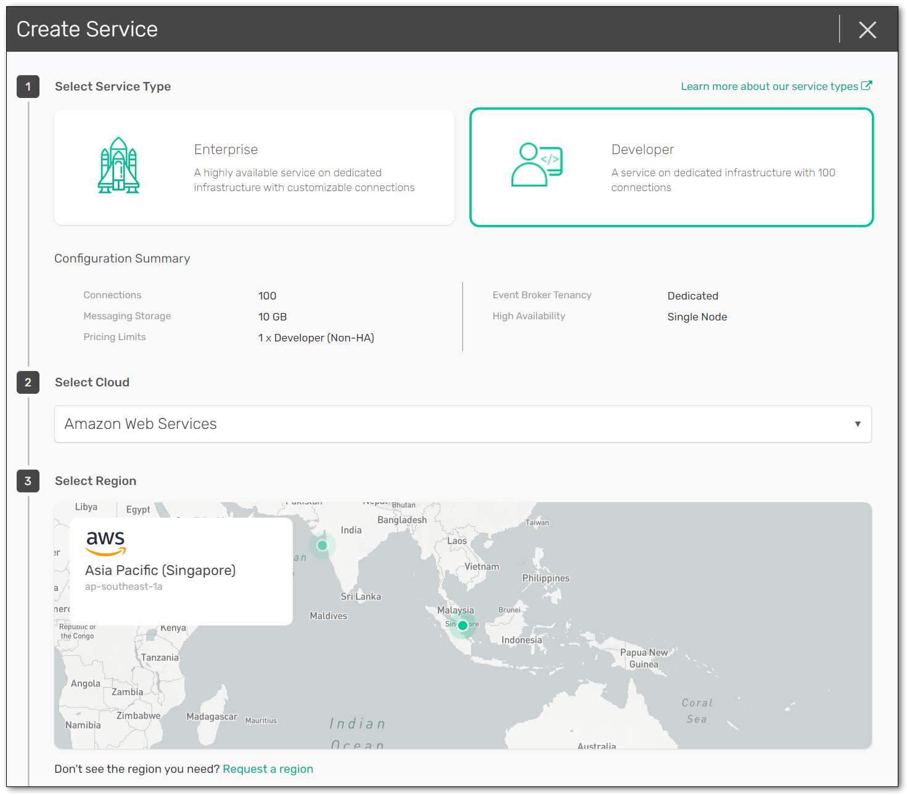 


Give your Solace PubSub+ Cloud service instance a name, and then tell it to start!  Under the covers, a Solace event broker will be deployed and configured in the cloud you indicated, ports configured, load-balancer setup, monitoring enabled, etc.  It takes about 5 minutes, and then you'll be ready!

Positive
: It is safe to navigate away from the "Solace is starting" page while the broker is being deployed in the cloud.  Feel free to explore the rest of Solace Mission Control, including the Event Portal!


### Software Broker

There are multiple options on how to install/download/configure/run the PubSub+ broker:

* If you have Docker installed, this is [probably the easist way](https://solace.com/products/event-broker/software/getting-started/). Simply copy this line into a terminal to pull the latest image from Docker Hub, and boot it:

```
docker run -d -p 8080:8080 -p 55555:55555 -p:8008:8008 -p:1883:1883 -p:8000:8000 -p:5672:5672 -p:9000:9000 -p:2222:2222 --shm-size=2g --env username_admin_globalaccesslevel=admin --env username_admin_password=admin --name=solace solace/solace-pubsub-standard

```
   * Other Docker options are here: [https://docs.solace.com/Solace-SW-Broker-Set-Up/Docker-Containers/Set-Up-Docker-Container-Image.htm](https://docs.solace.com/Solace-SW-Broker-Set-Up/Docker-Containers/Set-Up-Docker-Container-Image.htm)

Negative
: **NOTE:** if you are running on a **Mac**, OSX has now reserved one of the default Solace ports: 55555. Change the port mapping in the `docker run` command above, with `-p 4444:55555`

* To run VirtualBox, VMWare, HyperV, and others: check out [solace.com/downloads](https://solace.com/downloads)
* Lots of other software install options are here:
   * [https://docs.solace.com/Solace-SW-Broker-Set-Up/Docker-Containers/Set-Up-Docker-Container-Image.htm](https://docs.solace.com/Solace-SW-Broker-Set-Up/Docker-Containers/Set-Up-Docker-Container-Image.htm)
   * [https://docs.solace.com/Solace-SW-Broker-Set-Up/Machine-Image-Set-Up.htm](https://docs.solace.com/Solace-SW-Broker-Set-Up/Machine-Image-Set-Up.htm)


## Log in to the Management GUI

Duration: 0:02:00

Ok, now that we (are pretty sure we) have a Solace broker up and running, let's log in to it!

### Solace PubSub+ Cloud

Once your service is deployed and ready, simply click on it to go into it and look at some basic configuration information:


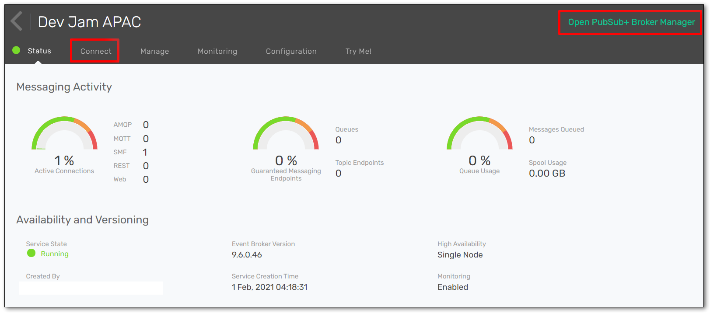

Notice some of the buttons across the top:
* The "Connect" tab shows you all the required connection information for your messaging pub/sub applications (e.g. host, username, password, etc.), which we'll need in later steps. The info can be grouped either by protocol or by programming language.
* At the top-right, there should be a button saying "Open PubSub+ Broker Manager".  Click on that to go into the Manager GUI.


### Installed Software Broker

If you've installed Solace on your local host (laptop or whatever), point your browser to [http://localhost:8080](http://localhost:8080).  Or whatever IP address where it's running.  Just remember to use port 8080 for the managment access. You should see a login screen like:

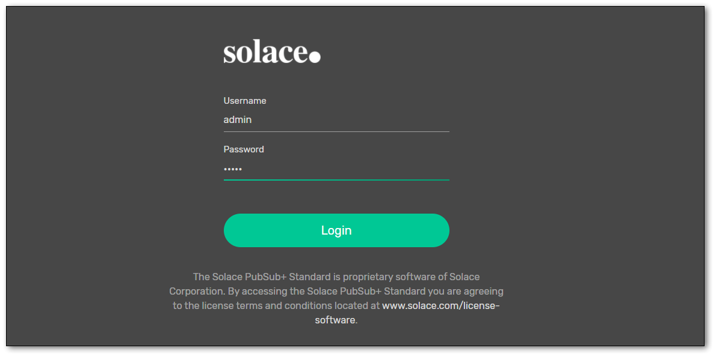


Login with credentials `admin` / `admin`.  Once connected, you should presented with a screen to choose which Message VPN to use.  You will only have one, the "default" VPN:


Click on that box!


## Looking around the PubSub+ Manager

Duration: 0:05:00

Welcome to the Solace event broker management GUI!  From this webapp, you'll be able to view configured and runtime information, create new queues, create usernames and profiles, and other various administrative tasks for the Solace broker.  


On the left side of the screen are the main sections to navigate through:
* **Message VPN:** VPN-level stats and config (a [Message VPN](https://docs.solace.com/PubSub-Basics/Message-VPNs.htm) is a _virtual partition_ of a single broker... one Solace broker can host multiple Message VPNs, and each VPN can have different authorization schemes and topic spaces; client/messaging application activity happens within the scope of a VPN)
* **Clients:** information about connected and configured client applications
* **Queues:** used for Guaranteed / persistent messaging
* **Connectors:** helpful wizards to connect to a variety of web services
* **Access Control:** where you create new client usernames, ACL profiles, and client profiles
* **Replay:** where you can enable replay, to allow the broker to send previous messages again
   * **NOTE:** Solace brokers do not use replay for recovery of persistent data (like Kafka)... there is a more fine-grained approach in Solace where each individual message is ACKnowledged to the broker when the consumer application is done with it
* **Try Me!** this is where we will connect two WebSocket test applications

Positive
: Feel free to poke around and look at the various screens. Within each section, there are multiple sub-sections, arranged in buttons across the top. There are also sometimes actions you can perform, generally visible as a button at the top-right, near the user ID.


## Try Me!

Duration: 0:05:00

On the left menu, click the **Try Me!** button to load the two WebSocket test apps: a Publisher (left) and a Subscriber (right).

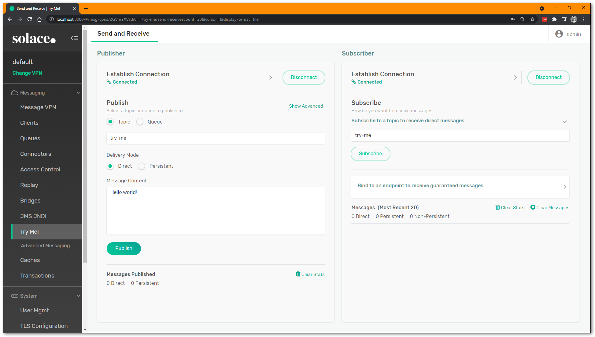


Click on the "Connect" button of both the Publisher and the Subscriber.  The green "Connected" icon should light up. This creates _two WebSocket connections_ from your browser using a JavaScript API into the Solace event broker. The two apps are going to talk to each other _through_ the Solace broker, even though they are running on the same page.


### Solace Cloud

Negative
: **NOTE:** if using **Solace Cloud**, you will need to enter your client application credentials here, rather than using the `default` values.  These can be found on the "Connect" tab of the Cloud console, probably located on the tab left of the PubSub+ Manager.


Choose, "Solace Web Messaging" and copy the username, password, and port for Secure `wss`. Back on the Try Me! tab, click the little right-arrow `>` next to the "Connect" button to open the dropdown list, and enter your connection information (make sure you use the correct port number).

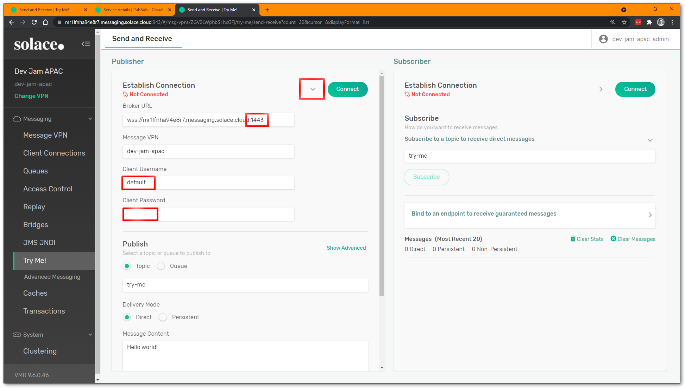


### Connected!

Once you are connected, hit the "Subscribe" button on the right to add a single topic subscription to the Subscriber application (currently `try-me` topic). On the left side, try Publishing some messages and ensure they go through.

Try changing the topic and see what happens. Try unsubscribing and see what happens. When using **Direct** messaging, subscribing clients must be online (and subscribed) in order to receive published messages.


## Topic Hierarchies and Wildcards

Duration: 0:05:00

Solace supports a **hierarchical topic** structure, which mean you can be very descriptive in defining your topic... use it to describe the contents/intent of your message payload data. No need to use flat, coarse-grained topic labels like other brokers. Check out this documenation and this video for more information:
* [Docs: Understanding Topics](https://docs.solace.com/PubSub-Basics/Understanding-Topics.htm)
* [Video: All About Solace Topics](https://www.youtube.com/watch?v=PP1nNlgERQI)

Each and every message can be published to a unique topic, depending on the event metadata. Some examples of valid Solace topics are:
* `hello/world/solace`
* `acme/taxi/rider/hail`
* `city/train/1234/alert/stopped`
* `mfg/plant42/inv/update/p12345667`
* `payme/debit/qr/bank01/f89a09-2b9c065a3/ok`


### Subscription Wildcards

Because published topics can be so variable and dynamic, subscribers can use wildcards to match a single subscription to multiple published topics. Solace supports two different types of wildcards:

* `*` single-level wildcard, matches up to the next level `/`. Can be used with a prefix e.g.: `abc*`
* `>` multi-level wildcard, matches one-or-more levels. Must occur at the end of the topic subscription.

Some examples of Solace topic subscriptions:
* `hello/world/*`
* `acme/taxi/rider/>`
* `city/*/*/alert/>`
* `mfg/plant*/inv/update/>`
* `payme/debit/*/bank01/*/ok`

You can read more about [topic wildcard subscriptions](https://docs.solace.com/PubSub-Basics/Wildcard-Charaters-Topic-Subs.htm) here.

Positive
: Try modifying your subscription on the Try Me! apps to use wildcards, and publish matching topics with the publisher.


## Creating a Queue for Guaranteed Delivery

Duration: 0:03:00

To use Solace's Guaranteed delivery (aka persistent messaging) so that no messages can be lost, even during network disconnects or broker restarts, then we need a **queue endpoint** to hold onto the messages for the consumer while it might be offline.

On the left side of the Manager GUI, click on "Queues":
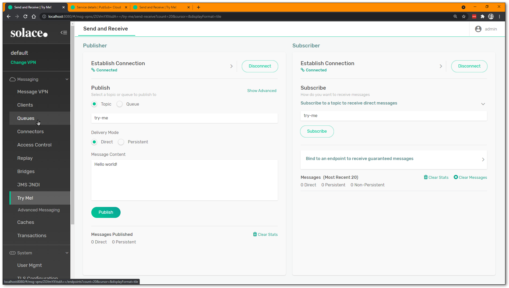


Click the "+ Queue" to create a new queue:
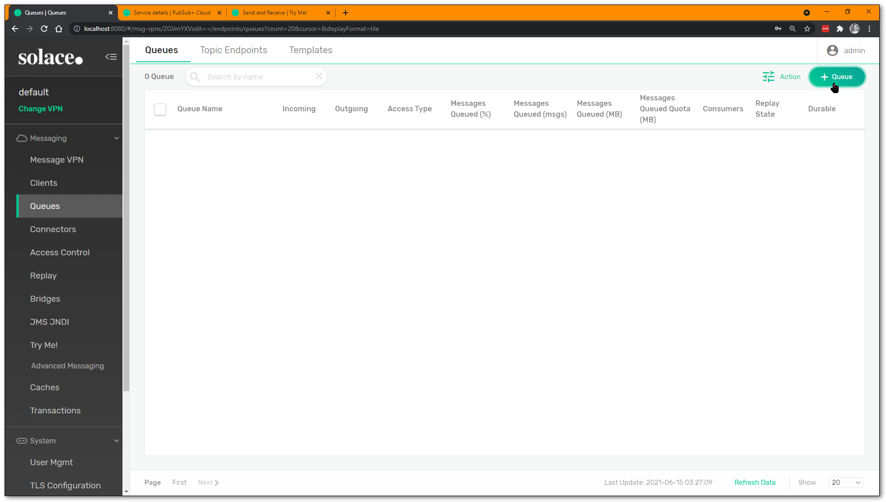


Give the queue a name, and hit "Create":


Optionally configure some settings (e.g. max quota), but you can leave everything as-is for now. Hit "Apply":
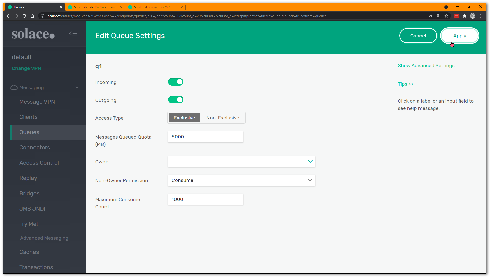

You have a new queue! 🎉 

### A Bit of Best Practices: Queue Subscriptions!

Now, Solace supports publishing directly to a queue, and many legacy point-to-point style applications still do this. But there are massive architectural benefits to using the **Publish-Subscribe** or **pub/sub** pattern. And for this, we will need to **add a topic subscription to the queue**, so it attracts messages with matching topics (just like the test WebSocket app was doing).

Click on the queue to go into its details:
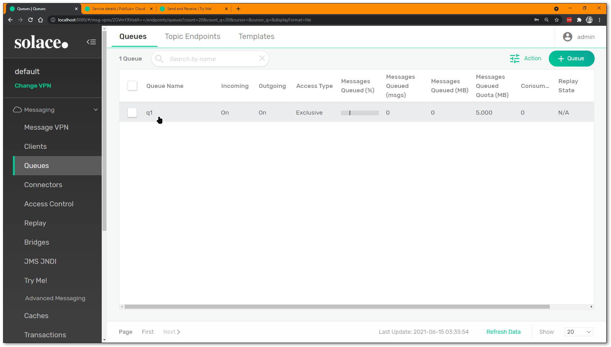

Click on the "Subscriptions" tab on the top row:
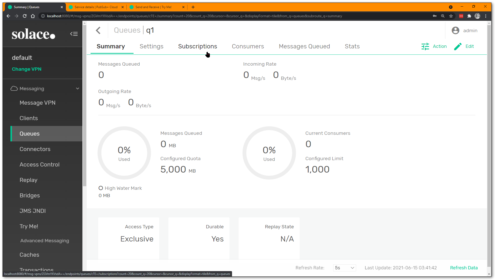

Click on the "+ Subscription" to add a new subscription(s):


Enter a new topic subscription, feel free to use wildcards:
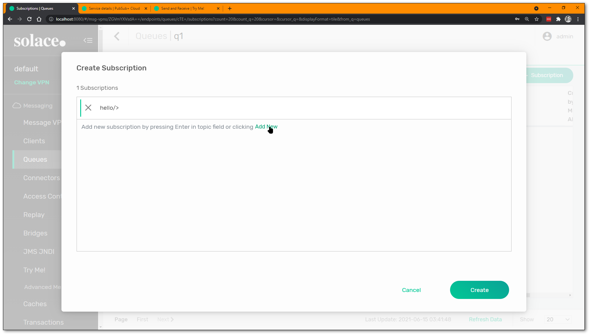

Add another one if you wish, queues can have multiple subscriptions:
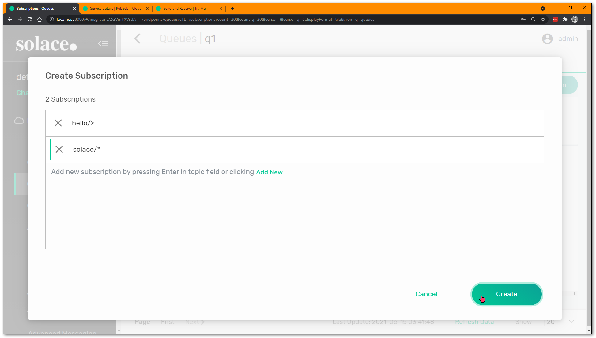


Click "Create" and that's it... your queue now has topic subscriptions to attract messages published on matching topics!

Positive
: Some brokers call this "topic-to-queue chaining" or "topic-to-queue mapping", but in Solace this is just how to do pub/sub with persistence: it gives the one-to-many option of delivery, but all the benefits of queued delivery (persistence, exclusive or round-robin delivery, redeliveries, TTL, DMQ, etc.).


## Persistent Pub/Sub Try Me!

Duration: 0:05:00

Now that a queue is created for the consumer, we can test it out with the Try Me! test apps again. On the Try Me! tab, on right right side Subscriber, click the "Bind to endpoint to receive guaranteed messages" button:
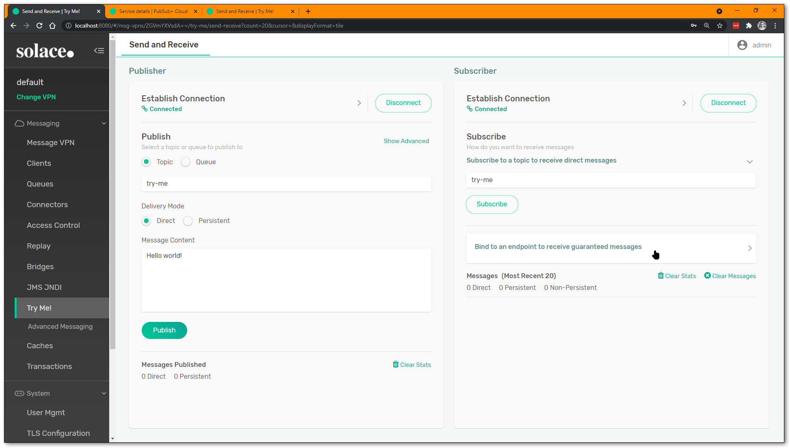


Enter the name of your queue, and hit "Start Consume":
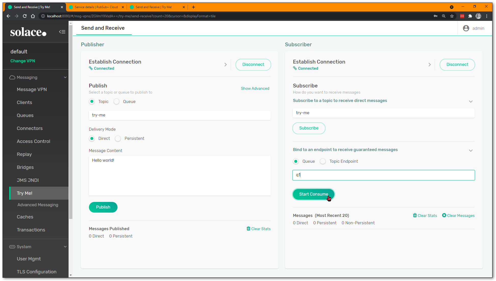


This will _bind_ the Subscriber application to the queue, and any data that the queue receives will be send to the application.

Now you're ready to publish. On the Publisher side, change the topic to something that will match the (wildcarded?) subscription you added to the queue. Ensure that you have changed the "Delivery Mode" (aka quality of service) to **Persistent**:
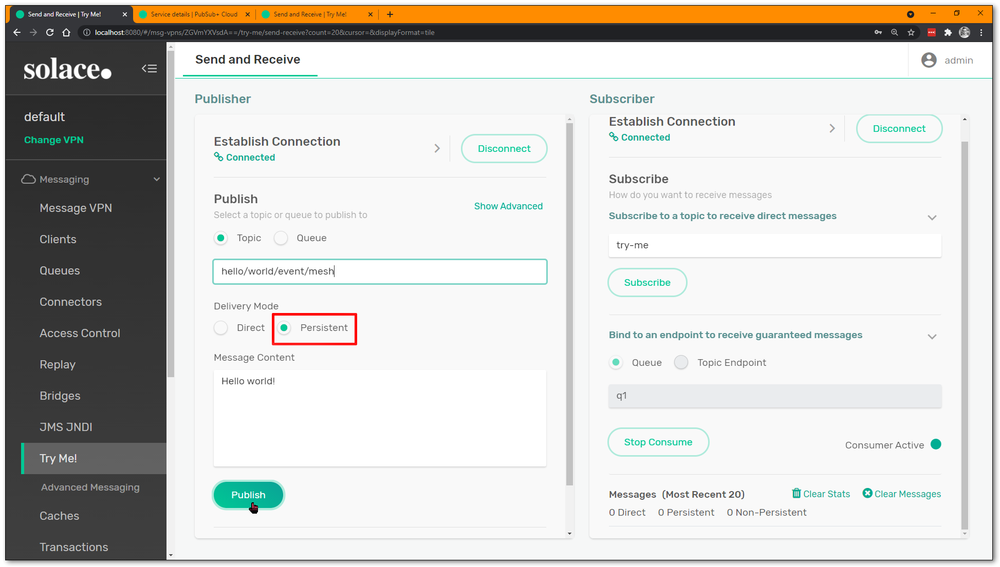

Hit "Publish" and make sure your messages appear on the other side.
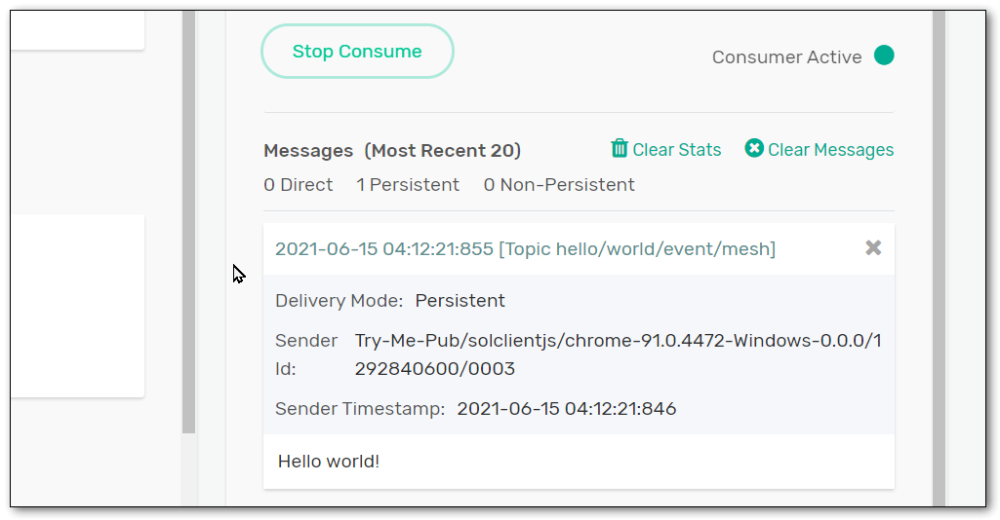

Now try disconnecting the Subscriber application, and publish a few more messages. Reconnect the subscriber and rebind to the queue and observe what happens.

Negative
: **NOTE:** it is possible to publish your messages as "Direct", and they will still go into the queue if the topic subscription matches. This is called _message promotion_ and is a more advanced concept. For use cases where end-to-end persistence is desired, ensure the publisher has set the Delivery Mode of the message to "Persistent" for sending Guaranteed messages.

For more information on Guaranteed messaging and queues, please refer to these links:

* [https://docs.solace.com/PubSub-Basics/Core-Concepts-Message-Delivery-Modes.htm](https://docs.solace.com/PubSub-Basics/Core-Concepts-Message-Delivery-Modes.htm)
* [https://docs.solace.com/PubSub-Basics/Core-Concepts-Endpoints-Queues.htm](https://docs.solace.com/PubSub-Basics/Core-Concepts-Endpoints-Queues.htm)


## Enabling Message Replay

Duration: 0:04:00


This will be left as an exercise to the reader. Once you turn it on, navigate back to the "Queues" tab, select your queue, and see what "Actions" you can find to perform.

Negative
: **NOTE:** if using **Solace Cloud**, you will have to send a service request to the Solace Cloud Support team to enable Replay on your broker. Click on the "?" icon in Solace Cloud Mission Control, and say that you would like to test out Replay.


Back on the Try Me! tab, even though the Subscriber has consumed and ACKnowledged all its Guaranteed messages, you can use Repaly to send the messages to it again. But recall: **Solace does not use replay for recovery**... if a subscriber application crashes after receiving a message but hasn't ACKnowledged it, the broker will resend the message when the subscriber reconnects.

For more information about Replay and/or acknowledging messages, check the following links:

* [https://docs.solace.com/Overviews/Message-Replay-Overview.htm?Highlight=replay](https://docs.solace.com/Overviews/Message-Replay-Overview.htm?Highlight=replay)
* [https://docs.solace.com/Solace-PubSub-Messaging-APIs/API-Developer-Guide/Acknowledging-Messages.htm](https://docs.solace.com/Solace-PubSub-Messaging-APIs/API-Developer-Guide/Acknowledging-Messages.htm)


## Next Steps

Duration: 0:01:00

This CodeLab has shown the very basics of application messaging using publish-subscribe and the Solace event broker.  For next steps, please consider one of these other CodeLab tutorials:

* [Exploring Solace Native APIs - The Basics](https://codelabs.solace.dev/codelabs/exploring-solace-native-apis/index.html)
* [How to Event-Enable your REST Architecture with Solace PubSub+](https://codelabs.solace.dev/codelabs/solace-event-enable-rest/index.html)

Thank you for your time.  Please come find us on [Solace Community](https://solace.community/) to ask any questions!


