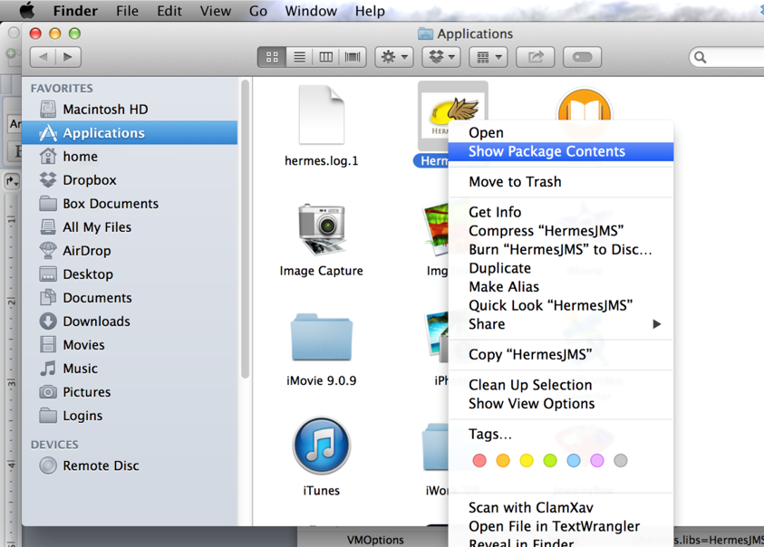
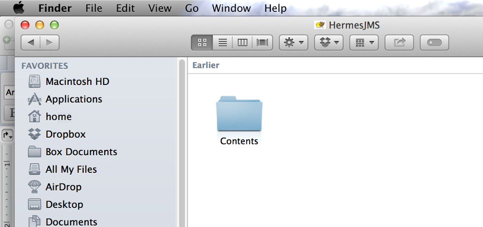
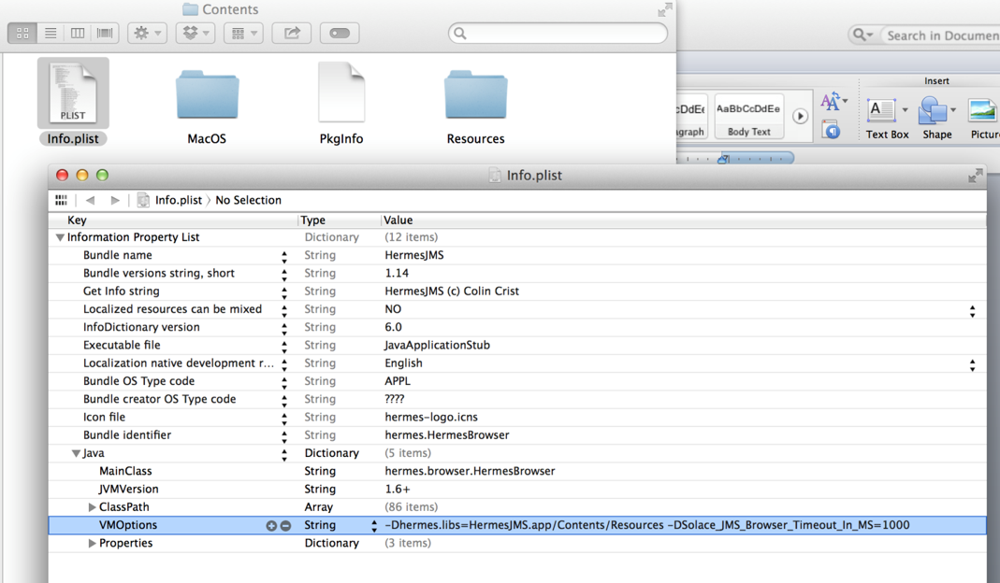
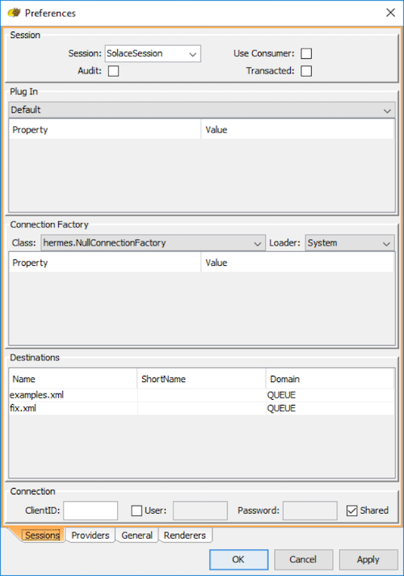
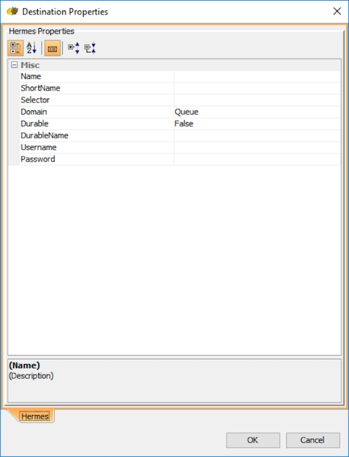
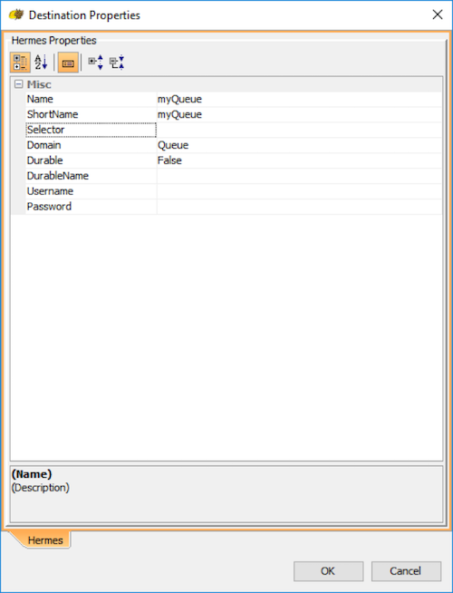
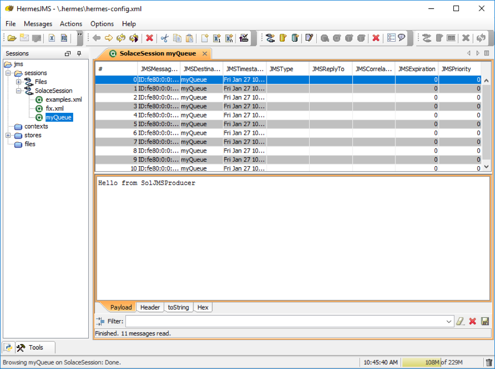
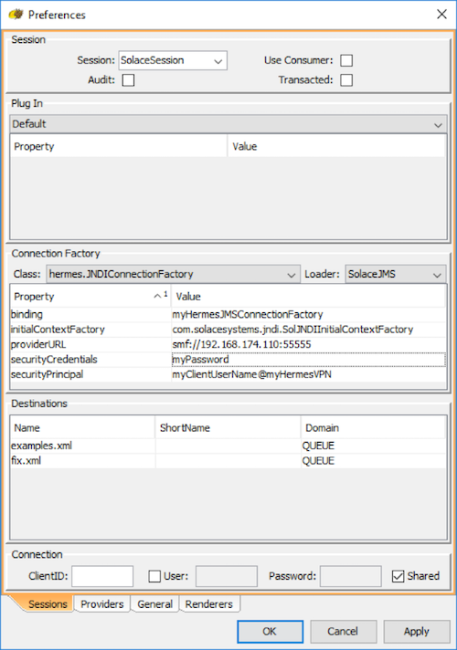
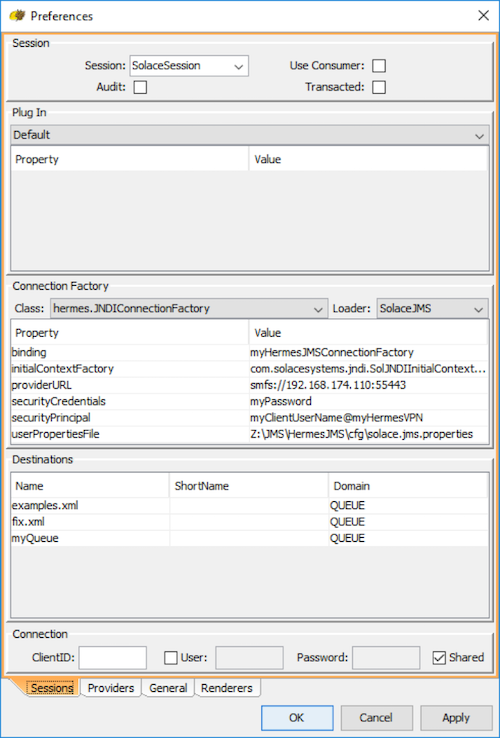

author: Tamimi
summary:
id: hermesjms
tags: iguide
categories: HermesJMS, Integration
environments: Web
status: Published
feedback link: https://github.com/SolaceDev/solace-dev-codelabs/blob/master/markdown/integrations/hermesjms

# Integration Guide: Hermes JMS

## Prerequisites

This guide assumes that:

-	You have successfully installed HermesJMS on your machine
-	You have access to Solace JMS libraries (version 6.2 or above)
-	You have access to a Solace Messaging Router
-	The necessary configuration on the Solace Event Broker is done. Configuration includes the creation of elements such as the message-VPN and the JMS Connection Factory.
-	If SSL connectivity is desired, you will need to ensure that the Solace Event Broker is correctly configured with SSL certificate(s), and that you have obtained a copy of the trust store, and keystore (if necessary) from your administrator.


## Get Solace Messaging
Duration: 0:10:00


This tutorial requires access to Solace PubSub+ event broker and requires that you know several connectivity properties about your event broker. Specifically you need to know the following:

<table>
  <tr>
    <td>Resource</td>
    <td>Value</td>
    <td>Description</td>
  </tr>
  <tr>
    <td>Host</td>
    <td>String</td>
    <td>This is the address clients use when connecting to the event broker to send and receive messages. (Format: <code>DNS_NAME:Port</code> or <code>IP:Port</code>)</td>
  </tr>
  <tr>
    <td>Message VPN</td>
    <td>String</td>
    <td>The event broker Message VPN that this client should connect to. </td>
  </tr>
  <tr>
    <td>Client Username</td>
    <td>String</td>
    <td>The client username. (See Notes below)</td>
  </tr>
  <tr>
    <td>Client Password</td>
    <td>String</td>
    <td>The client password. (See Notes below)</td>
  </tr>
</table>

There are several ways you can get access to Solace messaging and find these required properties.

### Option 1: Use Solace Cloud

* Follow [these instructions](https://solace.com/products/platform/cloud/) to quickly spin up a cloud-based Solace messaging service for your applications.
* The messaging connectivity information is found in the service details in the connectivity tab (shown below). You will need:
    * Host:Port (use the JMS URI)
    * Message VPN
    * Client Username
    * Client Password


### Option 2: Start a Solace PubSub+ Software Event Broker

* Follow [these instructions](https://solace.com/downloads/) to start the software event broker in leading Clouds, Container Platforms or Hypervisors. The tutorials outline where to download and how to install the Solace software event broker.
* The messaging connectivity information are the following:
    * Host: \<public_ip> (IP address assigned to the software event broker in tutorial instructions)
    * Message VPN: default
    * Client Username: sampleUser (can be any value)
    * Client Password: samplePassword (can be any value)

    Note: By default, the Solace software event broker "default" message VPN has authentication disabled.

### Option 3: Get access to a Solace PubSub+ appliance

* Contact your Solace PubSub+ appliance administrators and obtain the following:
    * A Solace Message-VPN where you can produce and consume direct and persistent messages
    * The host name or IP address of the appliance hosting your Message-VPN
    * A username and password to access the appliance


## Modify HermesJMS startup 
Duration: 0:05:00

#### Windows or Linux

* In the HermesJMS distribution you will find a bin directory with the startup files, hermes.bat and hermes.sh. Edit the file you use to start HermesJMS and add the system property definition `-DSolace_JMS_Browser_Timeout_In_MS=1000` to the Java command. 

#### OS X
Step 1. Open the Applications directory in Finder. Right-click on the HermesJMS icon and select "Show Package Contents". 



Step 2. Go into the Contents subdirectory.



Step 3. Double-click to edit the Info.plist file with the (optionally installed) Apple Xcode editor. Add the string `-DSolace_JMS_Browser_Timeout_In_MS=1000` to the Java->VMOptions with a space between the existing options and the new String. Save the change. 
  



## Start HermesJMS and create a new Hermes JMS session
Duration: 0:15:00

Step 1. Right-click on jms/sessions tree node in the "Sessions" area and select New…/New session… Call it "SolaceSession". Make sure to uncheck `Use Consumer and Transacted.`


Step 2. You will be presented with a Preferences dialog which contains 4 tabs. Select the Providers tab.


Step 3. Add a new Classpath group, by right clicking on "Classpath Groups" and selecting Add Group from the popup menu. Type "SolaceJMS" in the Classpath group name text field and hit OK. 
  


Step 4. Now, add all of the jars in the lib directory of the Solace JMS distribution package, and hit "OK". A confirmation dialog will be presented (see below). Hit "Don’t scan" to proceed.
  


Step 5. Hit "Apply" to save the configuration.


Step 6. Switch to the Sessions tab to start configuring the ConnectionFactory.



Step 7. Select the following settings in the drop-down menu for the Connection Factory.
  * For Class,  select hermes.JNDIConnectionFactory
  * For Loader, select SolaceJMS which was previously configured. Sometimes the drop-down menu has not been updated with the SolaceJMS option. If this happens, close the dialog with "OK" and reopen by right clicking the "SolaceJMS" and selecting "edit".
  


Step 8. Add the following properties for the Connection Factory:

<table>
    <tr>
    <td>Property</td>
    <td>Value</td>
    </tr>
    <tr>
    <td>binding</td>
    <td>JNDI name of the connection factory you want to use</td>
    </tr>
    <tr>
    <td>initialContextFactory</td>
    <td>com.solacesystems.jndi.SolJNDIInitialContextFactory</td>
    </tr>
    <tr>
    <td>providerURL</td>
    <td>smf://SOLACE_HOST_IP[:PORT]</td>
    </tr>
    <tr>
    <td>securityPrincipal</td>
    <td>SOLACE_CLIENT_USERNAME@SOLACE_MSG_VPN_NAME</td>
    </tr>
    <tr>
    <td>securityCredentials</td>
    <td>SOLACE_CLIENT_PASSWORD</td>
    </tr>
</table>
  

 
Step 9. Hit "OK" to finish creating the new Hermes JMS session.
   
## Create a new Hermes Queue
Duration: 0:05:00

a)	Right-click on jms/sessions/SolaceSession tree node in the "Sessions" area and select New…/Add queue…



b)	Input the following properties:

<table>
    <tr>
    <td>Property</td>
    <td>Value</td>
    </tr>
    <tr>
    <td>Name</td>
    <td>JNDI name of the queue that you wish to connect to</td>
    </tr>
    <tr>
    <td>ShortName</td>
    <td>Any desired display name. For simplicity, this example will keep it as the same as the JNDI name.</td>
    </tr>
</table>



c)	Hit "OK" to finish creating the new Hermes JMS queue.

### Test the setup

a)	To browse the message in the queue added in the previous setup, simply double click on it in the tree on the left hand side. If the queue contains messages they will be displayed in a queue tab as shown below



##	Configure Hermes JMS session to connect securely over SSL
Duration: 0:10:00

a)	Using your preferred text editor, create a new file to pass additional user properties to HermesJMS. For this example, the name of the properties file will be "solace.jms.properties".

b)	Insert the following two lines of text into your file. Note that the text should be modified to point to the location of your trust store, and must also contain the password of your trust store.

```
Solace_JMS_SSL_TrustStore=C:\\JMS\\HermesJMS\\truststore.jks
Solace_JMS_SSL_TrustStorePassword=myTrustStorePassword
```

c)	Edit the Hermes JMS session in Start HemesJMS to have the session connect securely over SSL. Right-click on jms/sessions/SolaceSession tree node in the "Sessions" area and select Edit…



d)	Edit the providerURL property to connect to `smfs://<event broker IP>:[<SSL port>]`.

e)	Add "userPropertiesFile" property to the connection factory. This value of this property must be the full file name of the solace.jms.properties file that was created earlier in step (a).



###	Configure Hermes JMS session to connect using client certificate authentication

a)	"Configure Hermes JMS session to connect securely over SSL" must be done prior to enabling client certificate authentication.

b)	Edit the solace.jms.properties custom user property file to specify additional properties, modifying them to point to your actual files, and passwords as necessary.

```
Solace_JMS_SSL_TrustStore=C:\\JMS\\HermesJMS\\truststore.jks
Solace_JMS_SSL_TrustStorePassword=myTrustStorePassword

Solace_JMS_Authentication_Scheme=AUTHENTICATION_SCHEME_CLIENT_CERTIFICATE
Solace_JMS_SSL_KeyStore=C:\\JMS\\HermesJMS\\keystore.jks
Solace_JMS_SSL_KeyStorePassword=myKeyStorePassword
Solace_JMS_SSL_PrivateKeyAlias=myPrivateKeyAlias
Solace_JMS_SSL_PrivateKeyPassword=myPrivateKeyPassword
```

Here is a brief summary of the properties used, but you should refer to the Solace JMS API guide for full details.

<table>
    <tr>
    <td>Property</td>
    <td>Description</td>
    </tr>
    <tr>
    <td>Solace_JMS_SSL_TrustStore</td>
    <td>The trust store to use. </td>
    </tr>
    <tr>
    <td>Solace_JMS_SSL_TrustStorePassword</td>
    <td>The trust store password for the trust store provided for the SSL Trust Store property.</td>
    </tr>
    <tr>
    <td>Solace_JMS_Authentication_Scheme</td>
    <td>This property specifies the authentication scheme to be used.</td>
    </tr>
    <tr>
    <td>Solace_JMS_SSL_KeyStore</td>
    <td>This property specifies the keystore to use in the URL or path format. The keystore holds the client’s private key and certificate required to authenticate a client during the TLS/SSL handshake.</td>
    </tr>
    <tr>
    <td>Solace_JMS_SSL_KeyStorePassword</td>
    <td>This property specifies keystore password to use. This password allows JMS to verify the integrity of the keystore.</td>
    </tr>
    <tr>
    <td>Solace_JMS_SSL_PrivateKeyAlias</td>
    <td>This property specifies which private key in the keystore to use for authentication. This property is necessary when a keystore with multiple private key entries is used.</td>
    </tr>
    <tr>
    <td>Solace_JMS_SSL_PrivateKeyPassword</td>
    <td>This property specifies the password for the private key in the keystore.</td>
    </tr>
</table>


