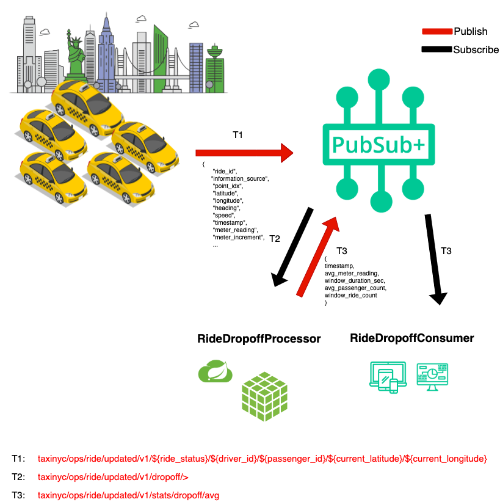

author: Jonathan Schabowsky
summary:
id: introduction-to-event-portal
tags:
categories:
environments: Web
status: Published
feedback link: https://solace.community/
analytics account: UA-3921398-10

# Introduction to Solace PubSub+ Event Portal

## What you'll learn: Overview

Duration: 0:01:00

Most organizations are adopting an event-driven architecture (EDA) to compete in a world where customer satisfaction requires real-time outcomes. 

In this code lab we’ll build and expand your toolbox by learning how an Event Portal, paired with industry standard specifications and frameworks, enable a smooth journey to bring your EDA from initial architecture and design to code running in production while also setting your team up for success as the business needs, architecture and applications themselves are enhanced over time.

Throughout this workshop we will get hands on and talk about:

PubSub+ Event Portal
* Architect, Design and extend an EDA which includes multiple Applications, Events and Schemas.
* Document Applications, Events and Schemas along with best practices for documentation
* Use Discovery capability to see what you already have in runtime and audit for changes
* Use the Event Catalog and Designer to Learn, Understand and Ideate 

AsyncAPI
* AsyncAPI is an open initiative for defining asynchronous APIs, providing a specification, and tooling such as code generation.
* Use the AsyncAPI Generator to generate skeleton code and object models for event-driven microservices


## What you need: Prerequisites

Duration: 0:08:00

🛠 This page covers the setup needed to perform this codelab. 🛠 

### AsyncAPI Generator Requirements
✅ Install instructions available [here](https://github.com/asyncapi/generator#requirements)
* Node.js v12.16+ (Check version using `node -v`)
* npm v6.13.7+  (Check version using `npm -version`)

We'll install the generator itself later 👍

### Spring Cloud Stream Requirements
✅ Spring Cloud Stream just requires Java and Maven to use 🚀  
* Java 1.8+ (Check version using `java -version`)
* Maven 3.3+ (Check version using `mvn -version`)
	* On mac you can `brew install maven`
	* Other install instructions [here](https://maven.apache.org/install.html)
* Your favorite Java IDE 💥

### PubSub+ Event Broker Connection Info
✅ The credentials below are for a public event feed found on the [Solace feed Marketplace](http://solace.dev/marketplace) that we'll use during this codelab.
* SMF Host: `tcp://taxi.messaging.solace.cloud:55555`
* Message VPN: `nyc-modern-taxi`
* Username: `public-taxi-user`
* Password: `iliketaxis`

✅ Note that this client-username has permissions to subscribe to `taxinyc/>` and `test/taxinyc/>` and permissions to publish to `test/taxinyc/>`

### Prepare PubSub+ Event Portal

#### Sign-up for Solace Cloud
✅ If you already have a Solace Cloud account just login, otherwise please sign-up for a free Solace Cloud Account using [this link](https://bit.ly/try-solace-free). Note that no credit card is required. You will receive an email to activate the account and will then be prompted to start the free trail. 


#### Import Existing Designed EDA
✅ Download the Application Domain export file: [EventPortal_Export_NYCModernTaxiCo.json]( https://github.com/Mrc0113/design-to-code-workshop/blob/master/EventPortal_Export_NYCModernTaxiCo.json)

You can download the file via curl or by cloning the git repo
```bash
curl -k -XGET https://raw.githubusercontent.com/Mrc0113/design-to-code-workshop/master/EventPortal_Export_NYCModernTaxiCo.json -o EventPortal_Export_NYCModernTaxiCo.json
```
OR
```bash
git clone https://github.com/Mrc0113/design-to-code-workshop.git
```

✅ Inside of your logged into Solace Cloud Account navigate to the Event Portal Designer by clicking "Designer" in the menu on the left. 


✅ Then import the previously downloaded Application Domain file by clicking the `Import` button at the top right of the _Designer_ and importing the  file. 


🚀 Setup complete! Let's get going! 🚀


## Foundational Concepts 

Duration: 0:08:00

Before we dive deeper, let ensure we are all aligned with terminology of the objects and concepts we will use in PubSub+ Event Portal. 

### Application Domain & Workspace

An application domain represents a namespace where applications, events, and schemas can live. Within this namespace, you can create a suite of applications, events and schemas that are independent of other application domains. In our NYC Taxi use case we introduced earlier, we may group application into different domains, for ex. we may have a domain for our rideshare apps and services, one for our back-office apps where we invoicing and background checks are being processed, and maybe another domains for analytics where we group apps that are responsible for analyzing the successful operation of our rideshare services.

In the Event Portal you will associate all objects like Consumer Groups, Topics, Schema, etc, to one or more Application Domains. 

You can further group multiple domains into a *Workspace*, which will make it easier to review our Discovery scan. So our Analytics, Operations, and Back-Office Application Domain in the NYC taxi example could be part of a single Workspace.


### Events/Topics

Events are an important part of the Event Portal. Think of a event as a concept of the publish-subscribe (pub/sub) architectural pattern. Topics are used to route data or events (in the form of messages) between distributed applications, often using a message broker or an event broker.

A Solace topic and an Apache Kafka topic might seem fundamentally the same but there are quite a few [differences between them](https://solace.com/blog/solace-topics-vs-kafka-topics/). Later in this CodeLab, when you run a discovery scan against a Kafka cluster the Topic Scheme for events discovered will be Kafka format.

Here are some examples from our use case:

* taxinyc.analytics.fraud.alerted.v1
* taxinyc.ops.payment.charged.v1
* taxinyc.ops.ride.called.v1

### Schemas

In simple terms, a schema represents the contract to describe the payload of an event. Producers and consumers of an event can trust that the event's payload matches the schema definition assigned to that event. Schemas define a type of payload through JSON, AVRO, XML, Binary, or Text. JSON, AVRO, and XML schemas have content that describes each property of the schema. 

In our use case all events are in AVRO Schema format.


### Applications

An application represents a piece of software that produces and consumes events. Applications connect to the event broker in an event-driven architecture and communicate with other applications via events. A single application represents a class of applications that are running the same code base; therefore, a Kafka consumer group can be associated with an Application object in the Event Portal.

### Kafka Specific Objects and Terminology 

#### Consumer Groups

Event Portal supports the concept of Kafka's consumer groups. A consumer group is used by Kafka to group consumers into a logical subscriber for a topic. In Event Portal, you can model consumer groups in Designer. This enables the Event Portal's runtime discovery to associate a discovered consumer group to an existing application. 

Kafka consumers that belong to the same consumer group share a group ID. The consumers in a group divide the topic partitions, as fairly as possible, so that each consumer consumes only a single partition from the group.

A few examples of Consumers Groups from our NYC Taxi Analytics use case would be:

* Passenger Surge Detection
* Fraud Detection
* Driver Incentive Calculation

#### Connector

A connector is used in Kafka for connecting Kafka brokers with external systems to stream data into or out of Apache Kafka. In the Event Portal, a Kafka Connector is an application class you select to configure associated published and/or subscribed events and a set of Kafka-native attributes like Connector Type, Class, Cluster ID, and Maximum Task.

## Best Practices
Duration: 0:08:00

### Decomposing the Enterprise 

Whether you perform discovery manually or using our agent, it is important to consider how your enterprise is organized so that it can be decomposed using the Application Domain construct. An Application Domain provides the ability to organize and decompose an enterprise into logical groupings. These groupings could be based on-line of business, related functional capabilities or based on team dynamics. The benefits of doing this include: 
1. Event sharing rules – decide which events should be shared with other application domains and those which are for internal application domain usage only. This has implications both from a security perspective, but also which events need to be managed more tightly as they affect others outside of the application domain
1. Provide uniform event topic prefixes – ensures that the prefix is unique and that topic best practices are followed

### Topic Naming Best Practices 
The topic of which an event is addressed seems like a pretty simple decision, but in reality, it can result in some negative consequences if not planned in advance. A topic is more than an address, it is metadata that describes the event and can be used for several purposes such as routing, access control and versioning. Thus, it is important to properly govern and manage the topic structure. Regardless of your broker type, it is a good practice to make topics structured and hierarchical the same way a RESTful Resource uses hierarchical addressing. In other words we want to produce hierarchical topics that rank from least specific to most specific. 

#### Parts of the Event Topic
The event topic structure has two parts:

The event topic root contains enough information to describe the type of event that has occurred. Each event topic root is a static field that describes the type of event. The list of event topic roots forms a catalog of events that can be produced and consumed. This catalog could be brought into the PubSub+ Event Portal's event catalog, listing each event type along with details about the event. Each event topic root describes the event in as much detail as necessary to map it to a single data schema.
The event topic properties are optional fields that further describe a particular event. This part of the topic has fields that are dynamically filled when the producer publishes the event. These fields are used to describe the specific or unique attributes of this event instance that would be used for routing and filtering.

* Event Topic Root: The event topic root of an event should have the following form:
        
        Domain/ObjectType/Verb/Version/

* Event Topic Properties: The event topic properties should have the following form:
        
        Locality/SourceID/ObjectID

* ✅ Complete Event Topic Format: Putting together an event topic root and event topic properties creates an event topic that describes the event with a series of fields from least specific to most specific.
      
        Domain/ObjectType/Verb/Version/Locality/SourceID/ObjectID
        
For more information about topic best practices, review the [Topic Architecture Best Practices Guide] (https://docs.solace.com/Best-Practices/Topic-Architecture-Best-Practices.htm)

### Event Information Exchange Patterns 
There are multiple Event Exchange Patterns (EEP) that should be considered when using EDA:

* If using a “Thin Event Notification” pattern, where only the necessary details are provided from a data point of view, this does tend to increase coupling between the event source and sink’s (consumers) as what attributes are provided are typically directly correlated with the needs of the use case vs being more flexible. The pro of this pattern however is that the data is smaller in size and can thus reduce latency and bandwidth when important. In general, the source of that event should be the single authoritative source for all published attributes. 
* If using “Hypermedia-Driven Events” pattern, links are provided in the event payload and works to bridge event notifications with dynamic API backends. This can be a good pattern to use where multiple levels of security are concerned related to attributes of the event. Consumers are still notified in realtime of state changes but must invoke the hyperlink in order to get access to more data. The service can then filter the response based on the client’s access level. The con to this pattern is it increases the latency of the interaction as all the data is not available within the event and puts more complexity on the client and its behavior. 
* If using “Event-Carried State Transfer” pattern, all known data is broadcast with the event (possibly entire record) thus enabling the consuming system to know the entire entity state vs just what changed as is the case with Thin Events. This is very common approach as many times the subscribing application want the entire snapshot to avoid having to persist previous state changes. The challenge in this case is that the publishing application may not be the authoritative source of all attributes published. Additionally, the event may become large and increase latency/decrease performance. The benefit however is that decoupling has been achieved in that it will support a variety of use cases and the publisher does not need to be aware of the client’s usage of the data. 

## Use Case Overview
Duration: 0:05:00

You are a member of the engineering team at the _NYC Modern Taxi Co_, a fictional taxi cab company based in New York City. Your team is playing from behind and racing to catch up with technology innovation introduced to the industry by Rideshare competitors such as Uber and Lyft. In order for the company to survive and eventually thrive your team has convinced the board that transforming the companies' IT systems is of utmost importance. Your team has done it's research and determined that moving to an Event-Driven Architecture is essential to future rapid innovation and has already kicked this initiative off by deploying a Solace Event Mesh and updating the taxi fleet to stream real-time events that include ride and location information. We know what the fleet is up to! Now it's time to start to continually improve and provide a world class customer experience.  

In order to react in a real-time manner the team has decided that we want to process the updates as they stream in from the fleet of taxis instead of putting them directly into a datastore and then having to retrieve them to do processing later. To prototype this work, you'll see a high level design in the diagram below. Since we already have the taxi fleet streaming their updates into our PubSub+ Event Mesh we need to do three things: 

1. 🚖 Create and capture this design in the PubSub+ Event Portal where we can define our Event-Driven Architecture, including its' components: Applications, Events and Schemas. This will allow us to define the details needed to implement, visualize and extend the architecture as it evolves, and share/collaborate with our entire engineering team as we continue to innovate.  
1. 🚕 Next up we're going to document some of the designed applications and events so that they can be understood and reused by others.
1. 🚕 We will run a "discovery" scan of a Kafka Cluster to reverse engineer what another team at NYC Taxi already has implemented
1. 🚕 Learn, Understand and Reuse some of our events in a new use case
1. 🚖 Lastly we'll implement the _ProcessPayement_ microservice that that receives the stream of _RideUpdated_ events, charges the customer's credit card and generate a _PaymentCharged_ Event. 




Positive
: The dataset you will be using in this lab originally comes from the NYC Taxi & Limousine Commission's open data release of more than a billion taxi ride records. Google then extended one week worth of data (3M taxi rides) from their original pickup and drop-off points into full routes in order to simulate a fleet of taxis roaming the streets of NYC as they define [here](https://codelabs.developers.google.com/codelabs/cloud-dataflow-nyc-taxi-tycoon/?_ga=2.11039092.-1355519641.1572284467/#0). Solace is streaming this data over Solace PubSub+ for you to analyze and process. 
<p>Terms of Use: This dataset is publicly available for anyone to use under the following terms provided by the Dataset Source — [https://data.cityofnewyork.us/](https://data.cityofnewyork.us/) — and is provided "AS IS" without any warranty, express or implied, from Solace. Solace disclaims all liability for any damages, direct or indirect, resulting from the use of the dataset.</p>

## Design an Event Driven Architecture
Duration: 0:10:00

By designing a new event-driven application or extending your extending event-driven architecture, your able to deliver new real-time business capabilities in a decoupled and reusable fashion. There are however several key elements which should be considered when designing events, schemas and applications including topic best practices, options for exchanging event data and sharing/visibility rules. Considering these things early will put you on the road to success and enable better reusability down the road.

### Design new Back Office EDA

#### Design Payment Processor Application

#### Design KPIThreshold Exceeded Event

#### Design SendToExecutiveDashboard

## Documentation Best Practices
Duration: 0:05:00

✅  Know your Audience 
The events which you have are used to enable Realtime collaboration between systems and solve a problem for a specific industry and organization. These events are integrated into applications by software developers/engineers but they are not all the same and can be decomposed into:

* Decision Makers - Some people in the organization are looking and evaluating the events and schemas available in order to decide if it makes sense to have the development team further explore the service. They are evaluating with a problem in mind and are looking to see if the events registered within the Event Portal can be used to solve that problem. In many cases they will not be the ones writing the code that solves the problem but are extremely important as they drive the decision as to if the effort to use it will be undertaken. Examples of these types of decision makers include but are not limited to: CTO, Product Managers, Data Analysts and Data Scientists/Engineers. 
* Users - These are the people who will be directly consuming and developing using the events and schemas defined in the event portal. Typically, the decision to use an event/schemas has been made and they need to understand the event, how it applies to their use case and how to integrate with it. They are critical to enable as they are always short on time and are the last link to getting an event to be reused. In addition, these users are the ones creating the documentation to enable others if they are the author of an event or schema so they are critical to the maintainability of the event-driven ecosystem of documentation. Examples of users include but are not limited to integration engineers, front end developer, backend developer. 

✅  Capture Business Point of View and Moment
* The hardest thing to capture is the “what does this event represent” and without it, it will be hard for a decision maker to understand if it provides value. Be sure to document the moment in which the event was generated, the attributes of which it is the authoritative source and the intended use of the event. Do not assume the user will read the corresponding payload schema or understand much about the publishing application so focus on documenting the event concisely and thoroughly 

✅  Technical Requirements
* This is the section where you need to provide the developer the information needed to consume the event itself. What are some suggest client APIs that should be used to consume the event? Are there important headers being used? What authentication/authorization schemes are required? All of this type of information should be captured to ensure an easy development process.

✅  Link to other References
* The Event Portal is just one source of information within the organization. Addition info on the application may be stored in a github repo, so provide a link. A schema may also have a corresponding github or wiki page, so provide a link. An event may have been a part of a larger development task tracked in JIRA, so provide a link. The point is link to all of the places the organization captures information and ideally link from those places into the event portal so that no matter where you start, you can understand what’s available and the state. 

✅  Provide Examples
* An example can be an often-underutilized format of communication. By seeing an example of an event, the user may better understand a concrete business moment rather than the description. In addition, those examples are also all part of our search mechanism so anything within it provides better search context. 

✅  Terms of Use
* This is the legal agreement between the event producer and any/all consumers. Talk to the API teams about their Terms of Use contracts and decide if it should be updated for event-driven API relationships. Also think of others within the same organization and their expectations of use and document them here. 

✅  Tags
* When in doubt, add a tag (within reason). As more and more events, apps and schemas are input into the system, search and tagging becomes more and more important for users to find the capabilities available. Browse the existing tags and see which may apply to your event, application or schema. Add tags if needed so that others can more easily filter and find your event, application or schema. 


## Document Events, Applications and Schemas
Duration: 0:08:00
Events are only as good as their documentation. After all, it is up to a human to understand what something is and make a determination as to wither it provides value. This is why documentation is critical for success in Event Driven Architecture. Creating and maintaining good documentation that’s easy to read, enjoyable to interact with and sets up the user for success can be challenging. Great documentation requires effort but has significant implications on the reuse of the events within the eco-system. The PubSub+ Event portal enables you to document Events easily while also managing the decoupled relationships so that users can easily understand the context of an event. Before you sit down and write documentation on events, applications and schemas, its good to consider its purpose along with who will be using it. 


### Update Documentation of KPIThreshold Exceeded Event

### Update Documentation of Payment Processor Application 

## Discover Existing EDA Assets
Duration: 0:36:00

Most organizations already leverage event driven architecture (EDA) and have one or more event brokers. Today the Solace PubSub+ Event Portal supports the ability to scan, catalog and reverse engineer the following Event Brokers: 
1. Kafka – Confluent Kafka, Amazon MSK, Apache Kafka
1. Solace PubSub+ Event Broker – Coming Soon!

If you have a non-supported Event Broker type/configuration, then you will need add the schemas, events and applications to the Event Portal manually by using your existing documentation. While this may seem like a lot of work, it may be possible to capture this metadata and use the PubSub+ Event Portal’s APIs in order to automate the ingestion of this data. The benefits of doing this from a dependency management perspective is enormous as your EDA evolves and enables you to begin to manage and expose the existing event-driven capabilities implemented. 


### Automated Discovery and Data Importation from Kafka 
Once you have decided on the application domains that are required for your enterprise, it is time to start the data importation process. 

If you have an event broker type/configuration that is supported by the discovery agent then an automated discovery process not only provides a faster path to managing and governing your existing EDA assets, it also ensures that the data is valid and up to date. 

[Event Portal Discovery with Kafka Code Lab] (https://codelabs.solace.dev/codelabs/ep-discovery-kafka/index.html?index=..%2F..index#3)

## Learn, Understand, Reuse
Duration: 0:10:00

A critical aspect of the Event Portal is the capability to capture the EDA design and documentation in a central place to enable cross organizational learnings. These learnings come in multiple forms from creating new ideas, to enabling and training members of the team on the architecture to performing change impact analysis and more. The purpose of this section is to outline some of these scenarios and for you to think about ways to incorporate them into your organization.

### Ideate
To create new business value you must be able to imagine or conceive of a new solution to an existing problem. These ideas can be derived from two different directions. First, I have a known problem and I am searching for a solution or secondly, let us look at what is available and uncover unique solutions for problems we were not actively looking for. The Event Portal enables learnings from both directions as without it, you do not have a central location to capture all of the events that are available, nor do you have a way to understand whether a given event stream solves your problem. The search and filter functionality enable the user to perform keyword searches which range from data level attributes to metadata within the description. This helps when you are aware of the problem and are looking for ideas of how to solve them with events. For example, let’s say you’re a Taxi company and are getting complaints about drivers speeding and you want to in real-time analyze the problem. You know the data has an attribute called “speed”, but what event streams have that data? You can simply search for speed in the schemas section of the catalog, review the matches, decide which schema is of interest and navigate to which events actually capture the moment you want to analyze. But what if you don’t have a specific problem and are simply wanting to think about the art of the possible? This is where browsing the event catalog can be key. Maybe you want to improve an area of your business and simply want to see what events are available in that area. Filter by that application domain and view the events like a menu of business capabilities that when combined could fundamentally transform that business area.  

Once a new idea has been formulated, you can jump to the Design phase and start down the path of defining the new business capability in detail. Of course, in that phase you should consider making this new capability event-driven so that your colleges can ideate and solve more problems. The more events you have, the more ideation that can occur. 


### Organizational Enablement
Organizational changes happen all the time. How ready are you to take over another groups EDA implementation? How about enable new members on yours?  What if your current architect were to resign, are you capturing everything you should be? 

Tribal knowledge happens and is dangerous. The above organizational changes showcase the multitude of scenarios that can occur that leave the business in limbo and result in reverse engineering something that was already engineered. If you get into the habit and develop the muscle memory around designing/documenting and continuously validating your EDA, tribal knowledge is eliminated as its now available centrally and kept up to date. While most organizations believe they have a software development and governance process that will prevent this from happening, it is typically comprised of multiple conflicting sources of truth, none of which actually representing the current truth. This leads the team to constantly as the question “so how does this actually work” and wasting time trying to investigate vs simply using a tool that captures the information and ensures it matches reality. 

So next time you are faced with the questions presented above, your answer should be an emphatic YES for your event-driven architecture. 

### Change Impact Analysis 
Changes happen. The question is what is the effect and who is affected? In the synchronous world changes to an API of course may/will affect the clients, so changes are rolled out, clients notified, and changes implemented. The challenge in the EDA world is that consumers are decoupled from producers and vice/versa. In addition, the ripple effect can be large in that integrations though connectors and integration capabilities can move events between different groups which further casts a fog upon dependency management. 

## Implement 
Duration: 0:16:00

### AsyncAPI Code Generators

### Custom Code Generators

### Integration Platforms

#### Dell Boomi Connector

## Takeaways

Duration: 0:05:00

✅ < Fill IN TAKEAWAY 1>   
✅ < Fill IN TAKEAWAY 2>   
✅ < Fill IN TAKEAWAY 3>   


Thanks for participating in this codelab! Let us know what you thought in the [Solace Community Forum](https://solace.community/)! If you found any issues along the way we'd appreciate it if you'd raise them by clicking the Report a mistake button at the bottom left of this codelab.
