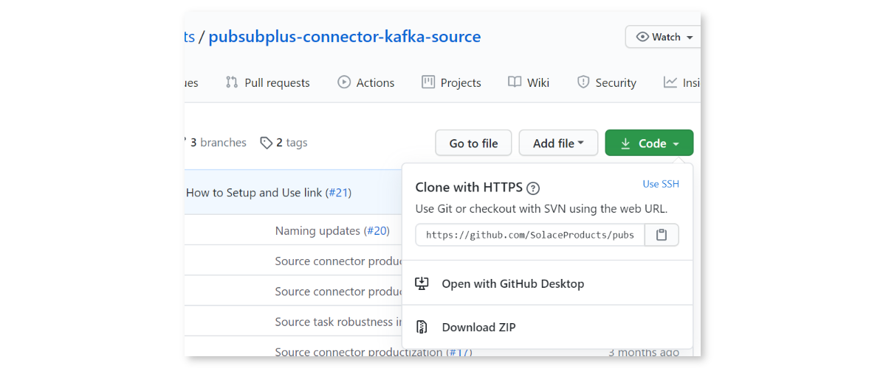
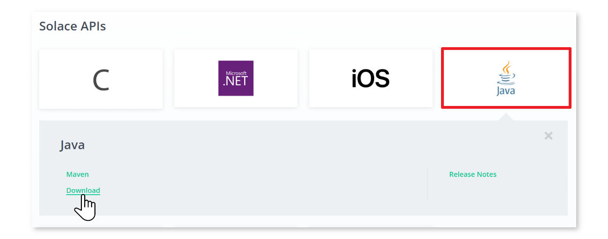

author: Aaron Lee
summary: Learn how to install the Solace PubSub+ Kafka source and sink Connectors for Kafka
id: kafka-connectors
tags:
categories: Kafka
environments: Web
status: Draft
feedback link: https://github.com/SolaceDev/solace-dev-codelabs/blob/master/markdown/kafka-connectors/kafka-connectors.md

# Getting Started with the Solace PubSub+ Connectors for Kafka

## Introduction

Duration: 0:05:00

Do you use or want to use Kafka? Want to learn how to integrate Kafka with Solace PubSub+ event brokers?

Using the Kafka Connect API, the Solace-designed PubSub+ Kafka Connectors allow you to both on-ramp and off-ramp data between Solace and Kafka.

Solace allows a wide variety of standard protocols and APIs to connect directly to the broker, such as **MQTT, AMQP 1.0, REST, WebSocket, and JMS**. This, coupled with Solace's dynamic hierarchical topic structure, and the multi/hybrid cloud event mesh capability, allows Kafka architectures to extend much further than the standard Connector framework allows.


### Are The Connectors Proprietary?

No, Solace has released the PubSub+ Connectors for Kafka as open source, and you can find them on GitHub in the following sections of this CodeLab.

## What you'll learn: Overview

Duration: 0:02:00

- Where to find and download the PubSub+ Connectors for Kafka
- How to (optionally) build and install the PubSub+ Connectors
- Where to download the required Solace PubSub+ Java libraries
- How to run sample Source and Sink Connectors
- How to modify the PubSub+ Connectors to allow for custom functionality

## Prerequisites

Duration: 0:02:00

- (Optional) Access to a Solace event broker (see below)
- Network connectivity (!?)
- (Optional) JDK for building the Connectors from source

### Free Solace Access!

- [Sign up for a free Solace Cloud service](https://console.solace.cloud/login/new-account)
- [Download the free feature-complete Standard Edition software broker](https://solace.com/downloads/)
- [Quickstart Video for Solace PubSub+ Docker container](https://youtu.be/s2n5V-IXCaM)

## Ensure Kafka is Installed

Duration: 0:10:00

The Solace PubSub+ Connectors will work with either standard Apache Kafka, or the proprietary Confluent variant.

### Option 1: Installing Apache Kafka (66 MB)

[Apache Kafka Quickstat](http://kafka.apache.org/quickstart)

Download and unzip Kafka onto your server or local machine. This tutorial will assume that it is installed in `~/kafka_2.13-2.7.0/`, the current version of Apache Kafka at the time of this writing.

### Option 2: Installing Confluent Platform (1.7 GB)

Download and unzip Confluent Platform onto your server or local machine. This tutorial will assume that it is installed in `~/confluent-6.1.0/`, the current version of Confluent Platform at the time of this writing.

[Download Confluent Platform](https://www.confluent.io/download)

[Confluent Quickstart](https://docs.confluent.io/current/quickstart/index.html)

## Create a Kafka Topic and Test Publishing and Subscribing

Duration: 0:10:00

Follow the appropriate Quickstart guide (links in previous section) and verify you can publish and subscribe to Kafka topics. From the quickstart guides, the basic steps for this are (with **examples for standard Kafka** given):

1. Start Zookeeper instance. E.g.:

```
bin/zookeeper-server-start.sh config/zookeeper.properties
```

1. Start Kafka server. E.g.: (in new terminal)

```
bin/kafka-server-start.sh config/server.properties
```

1. Create a new Kafka Topic "quickstart-events". E.g.: (in new terminal)

```
bin/kafka-topics.sh --create --topic quickstart-events --partitions 2 --bootstrap-server localhost:9092

bin/kafka-topics.sh --describe --topic quickstart-events --bootstrap-server localhost:9092
Topic: quickstart-events        PartitionCount: 2       ReplicationFactor: 1    Configs: segment.bytes=1073741824
        Topic: quickstart-events        Partition: 0    Leader: 0       Replicas: 0     Isr: 0
        Topic: quickstart-events        Partition: 1    Leader: 0       Replicas: 0     Isr: 0
```

1. Start the publisher application, and send some messages. E.g.:

```
bin/kafka-console-producer.sh --topic quickstart-events --bootstrap-server localhost:9092
```

1. Publish ten messages: e.g. "first message", "2nd one", "third", 4, 5, 6, ...

```
>First message
>2nd one
>third
>4
>5
>6
>7
>8
>9
>10
```

1. Then, start the consumer application to receive the messages. E.g.: (in new terminal)

```
bin/kafka-console-consumer.sh --topic quickstart-events --from-beginning --bootstrap-server localhost:9092

2nd one
4
5
6
7
10
First message
third
8
9
```

    - Notice the messages are somewhat out-of-order.  This is because Kafka only has ordering at the partition level.  In this case, within each of the two partitions message order is maintained; but not across the whole Kafka topic.

1. Now that the consumer is caught up, publish more messages and observe they are received by the consumer.

```
>11
>12
>13
>
```

- Note the delay between publishing and consuming. This is due to the consumer periodically polling the broker and pulling messages from it (unlike Solace, where messages are pushed to the consumer). [https://kafka.apache.org/documentation/#theconsumer](https://kafka.apache.org/documentation/#theconsumer)

## Download the PubSub+ Source and Sink Connectors

Duration: 0:10:00

Next, we are ready to fetch all the required components for the Solace PubSub+ Connectors for Kafka. Point your favourite browser to [https://github.com/SolaceProducts](https://github.com/SolaceProducts) and search for `kafka`:


Click on the "source" one.

### Option 1: Download and Build the Latest (better)

You can download either or both, building and installation is the same. For simplicity, we will only do the source connector. Download the zip, or clone the project:


The Connectors use **Gradle** as the Java build tool. There is no need to intall Gradle if you do not have it, everything is self-contained within the Connector distributions.

Simply run `./gradlew assemble` on Linux, Mac, or WSL, or `.\gradlew.bat assemble` on Windows Command Prompt or PowerShell. It might take a little bit of time while the appropriate dependencies are downloaded:

```
alee@LAPTOP-OQFKDPM0:/mnt/c/Users/AaronLee/Downloads/pubsubplus-connector-kafka-source-master$ ./gradlew assemble
Downloading https://services.gradle.org/distributions/gradle-6.1.1-bin.zip
.........10%.........20%.........30%..........40%.........50%.........60%..........70%.........80%.........90%.........100%

Welcome to Gradle 6.1.1!

Here are the highlights of this release:
 - Reusable dependency cache
 - Configurable compilation order between Groovy/Kotlin/Java/Scala
 - New sample projects in Gradle's documentation

For more details see https://docs.gradle.org/6.1.1/release-notes.html

Starting a Gradle Daemon (subsequent builds will be faster)

BUILD SUCCESSFUL in 39s
4 actionable tasks: 2 executed, 2 up-to-date
alee@LAPTOP-OQFKDPM0:/mnt/c/Users/AaronLee/Downloads/pubsubplus-connector-kafka-source-master$
```

```
PS C:\Users\AaronLee\Downloads\pubsubplus-connector-kafka-sink-master> .\gradlew.bat clean assemble
Starting a Gradle Daemon (subsequent builds will be faster)

> Task :compileJava

BUILD SUCCESSFUL in 23s
5 actionable tasks: 5 executed
PS C:\Users\AaronLee\Downloads\pubsubplus-connector-kafka-sink-master>
```

Look inside the directory `./build/libs/` and there should be a single JAR file there. This is the PubSub+ Connector JAR and **must be copied inside the Kafka distribution**:

- if standard Apache Kafka, copy to `~/kafka_2.13-2.7.0/libs`
- if Confluent platform, create a new directory `kafka-connect-solace` inside `~/confluent-6.1.0/share/java/` and copy it there

Repeat the same procedure for the PubSub+ Sink Connector.

### Option 2: Download the Latest Release (easier)

If you want the latest release you can download a pre-compiled version.
On the right side of the screen, click the "Releases" and download the latest ZIP or TAR file. Open the archive, and look in the `lib` directory. Copy the `pubsubplus-connector-kafka-[source|sink]-x.x.x.jar` file into the Kafka installation location as in the step above.

## Download Solace PubSub+ Java API

Duration: 0:08:00

Next, we need the Solace application APIs so the Connectors know how to connect to Solace. Point your favourite browser to [https://solace.com/downloads](https://solace.com/downloads), and be sure to tick the box "Solace APIs" under Categories. and scroll towards the bottom, looking for "Messaging APIs & Protocols":


Click on "Java / JCSMP", and select "Download":


Once the ZIP is downloaded, look inside the `lib` directory and copy all JARs (should be about 7 files) into the appropriate Kafka location:

- if standard Apache Kafka, copy to `~/kafka_2.13-2.7.0/libs`
- if Confluent platform, create a new directory `kafka-connect-solace` inside `~/confluent-6.1.0/share/java/` and copy it there

## Configure the PubSub+ Kafka Connectors

Duration: 0:07:00


Included with the Source and Sink Connectors inside the `etc` directory are example **configuration** files. Both properties and JSON format are provided, depending on your runtime requirements:

- When running Connect in standalone mode, use the properties file. Copy the properties files into the `config` directory of Kafka
- When running in distributed mode, use the JSON file

For this CodeLab, the examples will use the standalone mode of the standard Apache Kafka.

Open the properties file and note all of the various configuration options exposed. There are both Solace Java (JCSMP) API properties and Kafka Connect properties available to be configured. For more information:

- [Solace JCSMP Properties](https://docs.solace.com/API-Developer-Online-Ref-Documentation/java/com/solacesystems/jcsmp/JCSMPProperties.html)
- [Kafka Connect Properties](http://kafka.apache.org/documentation#connect)

At the least, you will need to edit the properties/config files to add the basic Solace connection parameters, so the Source and/or Sink connectors know how to connect to the Solace PubSub+ broker. These properties are:

- `sol.host`
- `sol.username`
- `sol.password`
- `sol.vpn_name`

Other useful properties are explained below:

- `kafka.topic`: which Kafka topic to either write to, or read from. The default is "test" but can be set to anything.

### Source Connector

- `sol.topics`: one or more (comma separated) topics the Source connector can subscribe _Directly_ to
- `sol.queue`: to use Persistent/Guaranteed messaging, the Source connetor binds to a queue instead
- `sol.message_processor_class`: which Processor to use when receiving a Solace message before writing into Kafka:
  - **SolSampleSimpleMessageProcessor**: very basic, uses `null` for the key, copies the message payload into the Kafka record
  - **SolaceSampleKeyedMessageProcessor**: allows you to specify what attribute to key the Kafka record on (e.g. Destination (aka Solace topic), CorrelationID, etc.). See next property.
- `sol.kafka_message_key`: when writing records into Kafka, this allows you to specify what Solace message attribute to use as the Kafka key. The limited options can be expanded by customizing the source code.

### Sink Connector

- `sol.topics`: one or more (comma separated) topics the Sink connector will publish to with Direct messaging
- `sol.queue`: to use Persistent/Guaranteed messaging, the Sink connetor publish to a queue
- `sol.record_processor_class`: which Processor to use when creating a Solace message to publish for each Kafka record:

  - **SolSimpleRecordProcessor**: very basic, specify which fixed Solace topic or queue to publish to
  - **SolSimpleKeyedRecordProcessor**: allows the ability to specify CorrelationID and other Solace headers
  - **SolDynamicDestinationRecordProcessor**: example of how to construct **dynamic Solace topics** using the record payload. Modify as appropriate for your data.

- `sol.kafka_message_key`: when writing records into Kafka, this allows you to specify what Solace message attribute to use as the Kafka key. The limited options can be expanded by customizing the source code.
  The sample Solace PubSub+ Connector properties files assume the Kafka topic to be `test`.

## Connect the Solace Source Connector (Basic)

Duration: 0:10:00

If you have access to a Solace PubSub+ broker (local Docker container, free Solace Cloud, etc.), then let's connect the Solace Source Connector to it and verify it works. Otherwise, skip to the next step to use an existing Solace broker.

1. First, the default configuration files both use a Kafka Topic called "test", so create that first:

```
bin/kafka-topics.sh --create --topic test --bootstrap-server localhost:9092
```

1. In a new terminal window, restart the Kafka Consumer app, and tell it to connect to the "test" topic. This way you'll be able to see messages as they arrive:

```
bin/kafka-console-consumer.sh --topic test --property print.key=true --from-beginning --bootstrap-server localhost:9092
```

1. Next, edit the `solace_source.properties` file which you copied into the config folder (or corresponding JSON if you want to run distributed) with the appropriate info. For example:

```
# PubSub+ connection information
sol.host=tcp://localhost
sol.username=default
sol.password=default
sol.vpn_name=default
# Solace PubSub+ topics to subscribe to
sol.topics=samples/>
```

1. Start the Connect framework in standalone mode. Only one instance of the standalone can run, but you can pass in multiple properties files:

```
bin/connect-standalone.sh config/connect-standalone.properties config/solace_source.properties
```

1. If everything is running properly (Solace broker, Kafka broker, etc.) you should see the log entries:

```
INFO Connected to host 'orig=tcp://localhost, scheme=tcp://, host=localhost'
INFO Adding subscription for topic samples/>
```

1. Now we are ready to publish some test Solace messages. Connect to the Solace PubSub+ Manager (e.g. http://localhost:8080 or via the Solace Cloud console). Choose the correct Message VPN, and select the **Try Me!** menu selection. Connect the publisher, change the topic to match the Solace Source Connector topic subscription (e.g. `samples/hello`), and publish. You should see the message arrive in the Kafka Consumer:

```
null    Hello world!
```

Positive
: Success! The reason you see `null` is that the Consumer is displaying the Kafka message key, but we have not configured it in the Source Processor. We will do that in the next section.

## Connect the Solace Source Connector (Better)

Duration: 0:10:00

Next, we will use an existing Solace demo stream of messages: the Solace taxi demo. You can visualize the datastream here: [Solace Taxi Map Demo](https://sg.solace.com/taxi/).

Stop the Connector instance (`Ctrl-C`), but leave the Kafka Consumer running. We'll repoint the Source Connector to the taxi demo stream.

1. Edit the `solace_source.properties` file again with the following. Note that the Processor is now changing to the "keyed" processor, and we'll use the messages' Destination (aka Topic) as the key:

```
# PubSub+ connection information
sol.host=tcp://taxi.messaging.solace.cloud
sol.username=public-taxi
sol.password=iliketaxis
sol.vpn_name=nyc-modern-taxi
# Solace PubSub+ topics to subscribe to
sol.topics=taxinyc/>
# Which Processor class to use
sol.message_processor_class=com.solace.connector.kafka.connect.source.msgprocessors.SolaceSampleKeyedMessageProcessor
# What attribute to use for the Kafka message key?
sol.kafka_message_key=DESTINATION
```

1. Restart the Connect framework in standalone mode:

```
bin/connect-standalone.sh config/connect-standalone.properties config/solace_source.properties
```

1. Once the Source Connector connects to Solace, you should immediately see lots of taxi ride information arriving in the Kafka Consumer app:

```
taxinyc/ops/ride/updated/v1/enroute/00000190/54846519/040.74084/-073.94572
{
    "ride_id": "7a63e37c-b4f2-4085-9b3e-0b24873cea00",
    "information_source": "RideDispatcher",
    "point_idx": 442,
    "latitude": 40.74084,
    "longitude": -73.94572,
    "heading": 100,
    "speed": 4,
    "timestamp": "2021-03-18T09:55:30.017-04:00",
    "meter_reading": 9.26,
    "meter_increment": 0.0209495,
    "ride_status": "enroute",
    "passenger_count": 1,
    "driver": {
        "driver_id": 190,
        "first_name": "Allison",
        "last_name": "Schwager",
        "rating": 2.75,
        "car_class": "Sedan"
    },
    "passenger": {
        "passenger_id": 54846519,
        "first_name": "Joe",
        "last_name": "Caswell",
        "rating": 4.75
    }
}
```

Positive
: SUCCESS!

## Connect the Solace Sink Connector

Duration: 0:10:00

Now that we have made the Source connector go from Solace→Kafka, let's configure the basic Sink Connector to publish data from Kafka→Solace.

1. Using the PubSub+ Manager GUI again, connect the Subscriber to your broker. Add a subscription for `sink/>`. This will echo/display any Solace messages received that match that subscription.

1. Edit the `solace_sink.properties` file which you copied into the config folder (or corresponding JSON if you want to run distributed) with the appropriate info. Let's use the Kafka topic "quickstart-events".

```
# Kafka topics to read from
topics=quickstart-events
# PubSub+ connection information
sol.host=tcp://localhost
sol.username=default
sol.password=default
sol.vpn_name=default
# Solace PubSub+ topics to PUBLISH to
sol.topics=sink/events
```

1. If it's still running, stop the Connect instance (Ctrl-C), and restart it using the Sink properties file:

```
bin/connect-standalone.sh config/connect-standalone.properties config/solace_sink.properties
```

1. Once it connects, you should see your 10 or so messages you originally wrote to the quickstart topic published into Solace with the topic `sink/events`.
   

1. Feel free to restart the Kafka publisher app again, and add more messages to the Kafka topic, which will then get published into Solace:

```
bin/kafka-console-producer.sh --topic quickstart-events --bootstrap-server localhost:9092
```

## Custom Sink Connector for Solace Dynamic Topics

Duration: 0:10:00

In the previous section, the very basic **SolSimpleRecordProcessor** Sink Connector simply published on a single Solace topic that was defined in the properties file (e.g. `sink/events`). But Solace supports a **very dynamic and expressive topic hierarchy**, where each level of the topic can represent a piece of metadata from the message. For example, from the taxi data feed:

```
TOPIC: taxinyc/ops/ride/updated/v1/enroute/00000190/54846519/040.74084/-073.94572
LEVLS: app/division/type/verb/version/status/driver_id/pass/id/latitude/longitude

PAYLOAD:
{
    "ride_id": "7a63e37c-b4f2-4085-9b3e-0b24873cea00",
    "information_source": "RideDispatcher",
    "point_idx": 442,
    "latitude": 40.74084,
    "longitude": -73.94572,
    "heading": 100,
    "speed": 4,
    "timestamp": "2021-03-18T09:55:30.017-04:00",
    "meter_reading": 9.26,
    "meter_increment": 0.0209495,
    "ride_status": "enroute",
    "passenger_count": 1,
    "driver": {
        "driver_id": 190,
        "first_name": "Allison",
        "last_name": "Schwager",
        "rating": 2.75,
        "car_class": "Sedan"
    },
    "passenger": {
        "passenger_id": 54846519,
        "first_name": "Joe",
        "last_name": "Caswell",
        "rating": 4.75
    }
}
```

To be able to dynamically change which Solace topic the Sink Connector publishes to, check out the source code for the **SolDynamicDestinationRecordProcessor**. You'll find this under folder `src/main/java/com/solace/connector/kafka/connect/sink/recordprocessor` of the Solace PubSub+ Sink Connector code which you downloaded from GitHub.

Note the `processRecord()` method, which takes a Kafka record as a parameter and returns a Solace Message. Inside the method, you can see how the (example) code examines the payload of the Kafka record for certain strings and values, and then builds the corresonponding or appropriate Solace topic. This particular example is looking at bus alerting data (comms and control messages) coming from Kafka, and builds dynamic Solace toipcs. Very cool!

```
public class SolDynamicDestinationRecordProcessor implements SolRecordProcessorIF {
  private static final Logger log =
      LoggerFactory.getLogger(SolDynamicDestinationRecordProcessor.class);

  @Override
  public BytesXMLMessage processRecord(String skey, SinkRecord record) {
    BytesXMLMessage msg = JCSMPFactory.onlyInstance().createMessage(BytesXMLMessage.class);

    // Add Record Topic,Partition,Offset to Solace Msg
    String kafkaTopic = record.topic();
    msg.setApplicationMessageType("ResendOfKafkaTopic: " + kafkaTopic);
...
    String payload = "";
    Topic topic;

    String busId = payload.substring(0, 4);
    String busMsg = payload.substring(5, payload.length());

    if (busMsg.toLowerCase().contains("stop")) {
      topic = JCSMPFactory.onlyInstance().createTopic("ctrl/bus/" + busId + "/stop");
      log.debug("================ Dynamic Topic = " + topic.getName());

    } else if (busMsg.toLowerCase().contains("start")) {
      topic = JCSMPFactory.onlyInstance().createTopic("ctrl/bus/" + busId + "/start");
      log.debug("================ Dynamic Topic = " + topic.getName());
    } else {
      topic = JCSMPFactory.onlyInstance().createTopic("comms/bus/" + busId);
      log.debug("================ Dynamic Topic = " + topic.getName());
    }
    // Also include topic in dynamicDestination header
    try {
      userHeader.putDestination("dynamicDestination", topic);

```

You can modify this source code to make toipcs for your specific data, or duplicate it, rebuild the JAR using Gradle, and copy the Sink JAR back into the Kafka distribution. Or you can also deploy a new JAR with only the modified Processor classes, so you don't need to copy over the previous Sink JAR.

Not many apps are written to take data _out_ of Kafka... typically, Kafka is seen as a massive ingest engine. However, if data that's generated in Kafka (e.g. with Streams or KSQL or something) needs to be sent to edge devices or microservices that aren't all connected direclty to Kafka, the Solace Sink is a great way to publish a message with a very specific topic that can find its way through the Solace Event Mesh to your application.

## Some Tips and Tricks

Duration: 0:01:00

The following are all for the standard Apache Kafka variant.

Create a topic:

```
bin/kafka-topics.sh --bootstrap-server localhost:9092 --create --replication-factor 1 --partitions 2 --topic test2
```

Use 2 partitions.

Then use the console publisher to publish 10 messages into the Kafka topic:

```
bin/kafka-console-producer.sh --bootstrap-server localhost:9092 --topic test2
```

Then start a consumer and see the order of the records returned. This is why order is not guaranteed for a Kafka topic:

```
bin/kafka-console-consumer.sh --bootstrap-server localhost:9092 --topic test --from-beginning --property print.key=true
```

Note the `--property print.key=true`. This comes in handy when using (e.g.) the Solace Topic (aka Destination) as the key.

At this point, try running the Source connector. Hopefully you have access to some streaming data. We (CTO team at Solace) are building a demo that will provide streaming taxi location info publicly.

Due to the custom capabilities in the Solace PubSub+ Connector framework, it is easy to extend the Processors to convert from one payload format (e.g. Google ProtoBufs in Solace) to another (e.g. AVRO for Kafka).

## Next Steps

Duration: 0:02:00

Much more detailed documentation on configuration and usage can be found on the Solace PubSub+ Connectors GitHub pages. Please refer there for more information.

✅ For more information on the Kafka Source, Sink and Consumer connectors check out the [PubSub+ Connector Hub](https://solace.com/connectors/?fwp_connectors_search=kafka) page

Thanks for participating in this codelab! Let us know what you thought in the [Solace Community Forum](https://solace.community/)! If you found any issues along the way we'd appreciate it if you'd raise them by clicking the Report a mistake button at the bottom left of this codelab.
