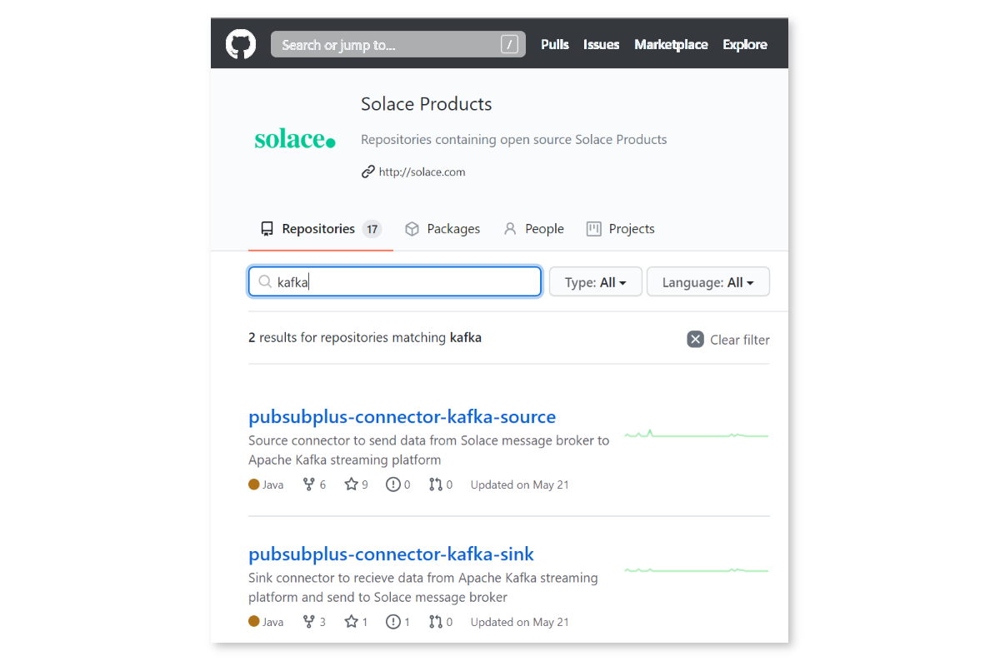
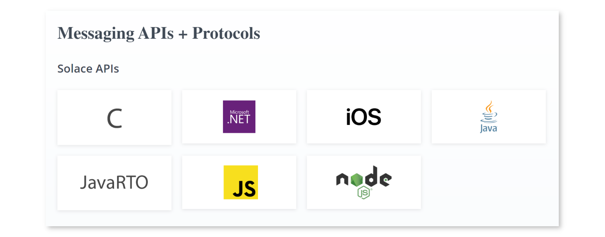

author: Aaron Lee
summary: Learn how to install the Solace PubSub+ Kafka source and sink Connectors for Kafka
id: kafka-connectors
tags: iguide,howto
categories: Kafka,API,pub/sub
environments: Web
status: Draft
feedback link: https://github.com/SolaceDev/solace-dev-codelabs/blob/master/markdown/kafka-connectors/kafka-connectors.md
analytics account: UA-3921398-10


# Getting Started with the Solace PubSub+ Connectors for Kafka


## Introduction

Do you use or want to use Kafka?  Want to learn how to integrate Kafka with Solace PubSub+ event brokers?

Using the Kafka Connect API, the Solace-designed PubSub+ Kafka Connectors allow you to both on-ramp and off-ramp data between Solace and Kafka.

Solace allows a wide variety of standard protocols and APIs to connect directly to the broker, such as **MQTT, AMQP 1.0, REST, WebSocket, and JMS**. This, coupled with Solace's dynamic hierarchical topic structure, and the multi/hybrid cloud event mesh capability, allows Kafka architectures to extend much further than the standard Connector framework allows.


### Are The Connectors Proprietary?

No, Solace has released the PubSub+ Connectors for Kafka as open source, and you can find them on GitHub in the following sections of this CodeLab.


## What you'll learn: Overview

Duration: 0:05:00

- Where to find and download the PubSub+ Connectors for Kafka
- How to (optionally) build and install the PubSub+ Connectors
- Where to download the required Solace PubSub+ Java libraries
- How to run sample Source and Sink Connectors


## Prerequisites

- Access to a Solace event broker (see below)
- Network connectivity  (!?)


### Free Solace Access!

- [Sign up for a free Solace Cloud service (50 connections)](https://console.solace.cloud/login/new-account)
- [Download the free feature-complete Standard Edition software broker](https://solace.com/downloads/)
- [Quickstart Video for Solace PubSub+ Docker container](https://youtu.be/s2n5V-IXCaM)


## Ensure Kafka is Installed

The Solace PubSub+ Connectors will work with either standard Apache Kafka, or the proprietary Confluent variant.  

### Installing Apache Kafka

[Apache Kafka Quickstat](http://kafka.apache.org/quickstart)

Download and unzip Kafka onto your server or local machine.  This tutorial will assume that it is installed in `/opt/kafka_2.12-2.5.0/`, the current version of Kafka at the time of this writing.


### Installing Confluent Platform

Download and unzip Confluent Platform onto your server or local machine. This tutorial will assume that it is installed in `/opt/confluent-5.5.1/`, the current of Confluent at the time of this writing.


[Download Confluent Platform](https://www.confluent.io/download)

[Confluent Quickstart](https://docs.confluent.io/current/quickstart/index.html)


### Create a Topic and Test Publishing and Subscribing

Follow the Quickstart guide and verify you can publish and subscribe to Kafka topics.  The sample Solace PubSub+ Connector properties files assume the Kafka topic to be `test`.


## Download the PubSub+ Source and Sink Connectors

Point your favourite browser to [https://github.com/SolaceProducts](https://github.com/SolaceProducts) and search for `kafka`:



### Option 1: Download the Latest Release

If you want the latest release you can download a pre-compiled version.
On the right side of the screen, click the "Releases" and download the latest ZIP or TAR file.  Open the archive, and look in the `lib` directory.  Copy the `pubsubplus-connector-kafka-[source|sink]-x.x.x.jar` file into the Kafka installation location as in the step above.

### Option 2: Download and Build the Latest

You can download either or both, building and installation is the same. For simplicity, we will only do the source connector.  Download the zip, or clone the project:


The Connectors use **Gradle** as the Java build tool. There is no need to intall Gradle if you do not have it, everything is self-contained within the Connector distributions.

Simply run `./gradlew assemble` on Linux, Mac, or WSL, or `.\gradlew.bat assemble` on Windows Command Prompt or PowerShell. It might take a little bit of time while the appropriate dependencies are downloaded:
```
alee@LAPTOP-OQFKDPM0:/mnt/c/Users/AaronLee/Downloads/pubsubplus-connector-kafka-source-master$ ./gradlew assemble
Downloading https://services.gradle.org/distributions/gradle-6.1.1-bin.zip
.........10%.........20%.........30%..........40%.........50%.........60%..........70%.........80%.........90%.........100%

Welcome to Gradle 6.1.1!

Here are the highlights of this release:
 - Reusable dependency cache
 - Configurable compilation order between Groovy/Kotlin/Java/Scala
 - New sample projects in Gradle's documentation

For more details see https://docs.gradle.org/6.1.1/release-notes.html

Starting a Gradle Daemon (subsequent builds will be faster)

BUILD SUCCESSFUL in 39s
4 actionable tasks: 2 executed, 2 up-to-date
alee@LAPTOP-OQFKDPM0:/mnt/c/Users/AaronLee/Downloads/pubsubplus-connector-kafka-source-master$
```
```
PS C:\Users\AaronLee\Downloads\pubsubplus-connector-kafka-sink-master> .\gradlew.bat clean assemble
Starting a Gradle Daemon (subsequent builds will be faster)

> Task :compileJava

BUILD SUCCESSFUL in 23s
5 actionable tasks: 5 executed
PS C:\Users\AaronLee\Downloads\pubsubplus-connector-kafka-sink-master>
```


Look inside the directory `./build/libs/` and there should be a single JAR file there. This is the PubSub+ Connector JAR and must be copied inside the Kafka distribution:

- if standard Apache Kafka, copy to `/opt/kafka_2.12-2.5.0/libs`
- if Confluent platform, create a new directory `kafka-connect-solace` inside `/opt/confluent-5.5.1/share/java/` and copy it there

Repeat the same procedure for the Sink Connector.


## Download Solace PubSub+ Java API

Point your favourite browser to [https://solace.com/downloads](https://solace.com/downloads) and scroll towards the bottom, looking for "Messaging APIs & Protocols":



Click on "Java", and select "Download":


Once the ZIP is downloaded, look inside the `lib` directory and copy all JARs into the appropriate Kafka location:
- if standard Apache Kafka, copy to `/opt/kafka_2.12-2.5.0/libs`
- if Confluent platform, create a new directory `kafka-connect-solace` inside `/opt/confluent-5.5.1/share/java/` and copy it there


## Configure the PubSub+ Kafka Connectors

Included with the Source and Sink Connectors inside the `etc` directory are example configuration files. Both properties and JSON format are provided, depending on your runtime requirements:

- When running Connect in standalone mode, use the properties file. Copy the properties files into the `config` directory
- When running in distributed mode, use the JSON file

Open the properties file and note all of the various configuration options exposed.  There are both Solace Java (JCSMP) API properties and Kafka Connect properties available to be configured.  For more information:

- [Solace JCSMP Properties](https://docs.solace.com/API-Developer-Online-Ref-Documentation/java/com/solacesystems/jcsmp/JCSMPProperties.html)
- [Kafka Connect Properties](http://kafka.apache.org/documentation#connect)


### Anatomy of the Kafka Connect Framework


Inside the Solace PubSub+ Connectors, they come with a few different Processors. The source code for all of these is included, and can be customized and extended as required:

#### Source

- **SolSampleSimpleMessageProcessor**: very basic, uses `null` for the key, copies the message payload into the Kafka record
- **SolaceSampleKeyedMessageProcessor**: allows you to specify what attribute to key the Kafka record on (e.g. Destination (aka Solace topic), CorrelationID, etc.)


#### Sink

- **SolSimpleRecordProcessor**: very basic, specify which fixed Solace topic or queue to publish to
- **SolSimpleKeyedRecordProcessor**: allows the ability to specify CorrelationID and other Solace headers
- **SolDynamicDestinationRecordProcessor**: example of how to construct **dynamic Solace topics** using the record payload. Modify as appropriate for your data.


## Some Tips and Tricks

The following are all for the standard Apache Kafka variant.

Create a topic:
```
bin/kafka-topics.sh --bootstrap-server localhost:9092 --create --replication-factor 1 --partitions 2 --topic test
```
Use 2 partitions.

Then use the console publisher to publish 10 messages into the Kafka topic:
```
bin/kafka-console-producer.sh --bootstrap-server localhost:9092 --topic test
```

Then start a consumer and see the order of the records returned.  This is why order is not guaranteed for a Kafka topic:
```
bin/kafka-console-consumer.sh --bootstrap-server localhost:9092 --topic test --from-beginning --property print.key=true
```
Note the `--property print.key=true`. This comes in handy when using (e.g.) the Solace Topic (aka Destination) as the key.


At this point, try running the Source connector.  Hopefully you have access to some streaming data.  We (CTO team at Solace) are building a demo that will provide streaming taxi location info publicly.


## Next Steps

Much more detailed documentation on configuration and usage can be found on the Solace PubSub+ Connectors GitHub pages.  Please refer there for more information.

✅ For more information on the Kafka Source, Sink and Consumer connectors check out the [PubSub+ Connector Hub](https://solace.com/connectors/?fwp_connectors_search=kafka) page    


Thanks for participating in this codelab! Let us know what you thought in the [Solace Community Forum](https://solace.community/)! If you found any issues along the way we'd appreciate it if you'd raise them by clicking the Report a mistake button at the bottom left of this codelab.
