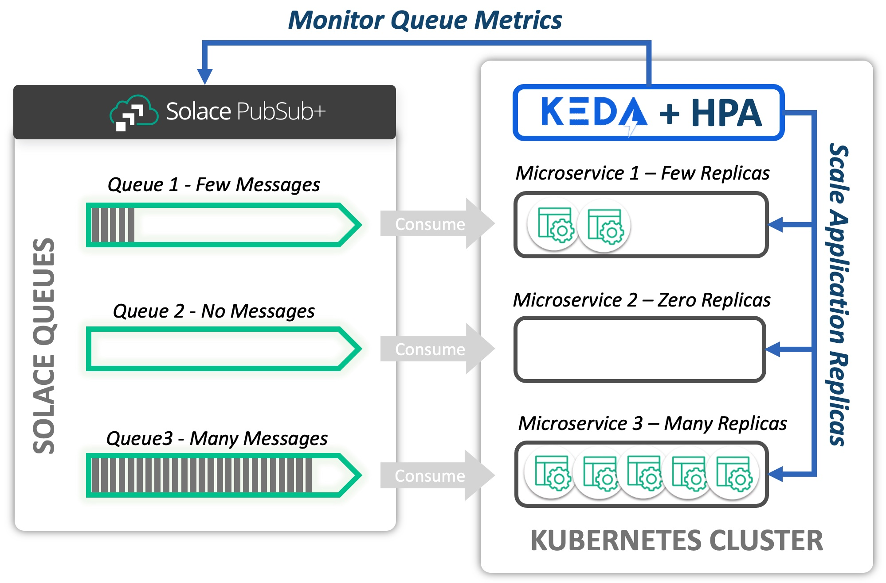
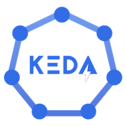

author: Dennis Brinley
summary: Deploy KEDA and Scale an Application on Kubernetes by Monitoring a Solace PubSub+ Queue
id: keda-solace-queue
tags: keda, kubernetes, scale, scaler, scaling, autoscaler, solace, pubsub, event, broker, queue, message, messaging, msgCount, msgSpoolSize, scaledobject, trigger, triggerauthentication
categories: KEDA
environments: Web
status: Draft
feedback link: https://github.com/SolaceDev/solace-dev-codelabs/blob/master/markdown/keda-solace-queue

# KEDA with Solace PubSub+ Event Queues

## Introduction

Duration: 0:03:00

The purpose of this CodeLab is to provide an introduction to the **Solace PubSub+ Event Broker Queue Scaler** for KEDA, and to show how these tools can be used to scale Consumers of Solace Queues elastically in a Kubernetes environment.

### What is KEDA?
[KEDA](https://keda.sh) is a [CNCF](https://www.cncf.io) sandbox project (current as of this writing). KEDA expands the capability of the native [Kubernetes Horizontal Pod Autoscaler](https://kubernetes.io/docs/tasks/run-application/horizontal-pod-autoscale/). It does this by providing an interface for HPA to retrieve custom metric values that can be used for scaling.

### What is the Solace Scaler?
The [Solace PubSub+ Event Broker Queue Scaler](https://keda.sh/docs/2.8/scalers/solace-pub-sub/) defines an interface that allows KEDA to scale applications based on Solace Queues, specifically the current ***Message Count*** and ***Message Spool Usage***. Based on the observed values of these metrics, KEDA and HPA can scale target Deployments, Jobs, and Stateful Sets in response to fluctuating demand. The Solace Scaler itself is merged into the KEDA project and is therefore available when KEDA is installed.

Consider the following diagram. A Solace PubSub+ Event Broker hosts a set of queues. The messages from each queue are being consumed by a microservice deployed to a Kubernetes cluster. KEDA uses the Solace Scaler to interface with the PubSub+ Broker via the SEMP API to obtain metrics related to the queue. In this example, we are interested in _Message Count_. Based on the Message Count retrieved for each queue, KEDA and the Horizontal Pod Autoscaler maintain the appropriate number of desired replicas. 



### The Goal
The instructions in this CodeLab will provide a practical guide to using KEDA for the purpose of scaling consumers of Solace Queues.

## What you'll learn

Duration: 00:02:00


- How to install KEDA to your Kubernetes Cluster
- The basics of how KEDA works with Kubernetes Horizonal Pod Autoscaler (HPA)
- How to configure KEDA to scale an application based on a Solace PubSub+ Event Broker Queue
- How to scale an Application based on message backlog (message count) on a queue
- How to scale an Application based on the message spool usage (resources utilized) on a queue
- How to Manage Horizontal Pod Autoscaler behavior using KEDA Configuration

## Prerequisites

Duration: 0:10:00

### Proficiencies
This Codelab assumes that you have at least minimum proficiency with:
- Kubernetes, including command line administration using `kubectl` command
- Solace PubSub+ Event Broker
- Messaging system concepts

### Desktop Software
You must have the following command line tools available to complete the CodeLab.
- [kubectl](https://kubernetes.io/docs/tasks/tools/)
- [Helm](https://helm.sh/docs/intro/quickstart/)

### Kubernetes
Access to a Kubernetes cluster from your desktop is required to complete the Codelab. You will need sufficient priviledges to create and delete Pods, Deployments, StatefulSets, Services, and Secrets. The following minimum resources on the Kubernetes cluster are recommended:
- 2 CPU
- 5 GBytes Memory
- 8 GBytes Disk Space

## What you'll do

Duration: 0:15:00

### Install Software
We will use **Helm** to install software to your Kubernetes cluster. **Helm** charts (coded instructions for installation) are available in public repositories.
- **KEDA** - We will use **Helm** to deploy the KEDA software to the Kubernetes cluster
- **Solace PubSub+ Event Broker** (Dev Mode) - We will install a small scale Event Broker to complete the lab

### Create Deployments
We will create the following objects on the Kubernetes cluster:
- **kedalab-helper** - Kubernetes **Pod** that will be created for the purpose of running configuration scripts and to publish messages.
- **solace-consumer** - Kubernetes **Deployment** that we will scale using KEDA and the Solace Queue Scaler.

### Configure KEDA to Scale the solace-consumer Deployment
We will create the following objects to configure KEDA:
- **kedalab-scaled-object** - KEDA **ScaledObject** informs KEDA that a Scaler (Solace Event Queue Scaler for this Codelab) will be applied to our deployment
- **kedalab-solace-secret** - Kubernetes **Secret** with encoded credentials for the admin ID to connect to the Solace SEMP endpoint of our broker
- **kedalab-trigger-auth** - KEDA **TriggerAuthentication**; bridges a KEDA **ScaledObject** configuration to a Kubernetes **Secret**

### Publish Messages and Observe!
- We will use SDK-Perf utility, provided for you on **kedalab-helper** pod, to publish messages to our broker.
- Based upon the message backlogs that we create, we will observe how KEDA scales the **solace-consumer** deployment

> aside positive
> Let's Get Started!

## Install KEDA

Duration: 0:15:00



You will need to install KEDA if it is not already available on your cluster. Instructions here are reproduced from the [KEDA Web site](https://keda.sh/docs/2.8/deploy/). We will use Helm to install KEDA. Please refer to the KEDA site if you wish to use a deployment method other than Helm to install KEDA.

> aside negative
> If KEDA was already installed to your cluster and you intend to use it to complete the CodeLab:<br>_It may be necessary to update the installation OR to uninstall keda and then re-install it if the Solace Scaler is not available in your installed version of KEDA. The Solace Scaler is available in KEDA core starting with version 2.4_.

### Add Helm repo (if not already added)
```bash
helm repo add kedacore https://kedacore.github.io/charts
```

### Update Helm repo
```bash
helm repo update
```

### Create keda namespace
```bash
kubectl create namespace keda
```

### Install KEDA Using the Helm chart:
```bash
helm install keda kedacore/keda --namespace keda
```

### Check your installation
```bash
## Make sure that the deployments/pods are Ready!
kubectl get deployments -n keda
kubectl get pods -n keda
```

## Install Solace PubSub+ Event Broker

Duration: 0:15:00


Follow the instructions to install a Solace PubSub+ Event Broker to your Kubernetes cluster. The broker will be installed to `namespace=solace`. The broker will be created with an administrative user=**admin** and password=**KedaLabAdminPwd1**. We will configure the broker subsequently in the next section.

### Add Helm repo
```bash
helm repo add solacecharts https://solaceproducts.github.io/pubsubplus-kubernetes-helm-quickstart/helm-charts
```

### Update Helm repo
```bash
helm repo update
```

### Create solace namespace
```bash
kubectl create namespace solace
```

### Install the broker
```bash
##  This installation will use ephemereal storage, which means if pod is shut down and restored, the configuration will be lost.
helm install kedalab solacecharts/pubsubplus-dev --namespace solace --set solace.usernameAdminPassword=KedaLabAdminPwd1 --set storage.persistent=false
```

### Wait and Verify
```
## Command will hold until the pod = kedalab-pubsubplus-dev-0 is ready for use
## Note: This make take up to a minute if you execute immediately after deploying the broker
kubectl wait -n solace --for=condition=Ready --timeout=120s pod/kedalab-pubsubplus-dev-0

## Then, double-check:
kubectl get statefulsets -n solace kedalab-pubsubplus-dev -o wide
kubectl get pods -n solace kedalab-pubsubplus-dev-0 -o wide
```

### **OPTIONAL**: Connect to Solace PubSub+ Broker Console
You can connect to the broker and inspect the installation using a web browser. The installed broker will have the default configuration. (We haven't configured it yet)

#### First, you'll need to obtain the service IP Address for the broker
```bash
kubectl get services -n solace kedalab-pubsubplus-dev -o jsonpath="{.status.loadBalancer.ingress[0].ip}"
```

#### Next, use the IP Address in a web browser to navigate to the Solace Console
```
http://[service-external-ip-address]:8080
## e.g. http://34.199.88.200:8080
```

#### Enter username and password to authenticate
- username: admin
- password: KedaLabAdminPwd1

_You should be connected to the Solace PubSub+ Event Broker_

## Deploy Apps and Configure Solace Broker

Duration: 0:20:00

After these steps are complete, we will have a configured Solace Event Broker, our kedalab-helper pod will be available, and the solace-consumer will be ready to process messages.

### Create kedalab-helper Pod
The kedalab-help pod contains configuration scripts and tools we need to complete the lab. We will create it on our Kubernetes cluster.

#### Apply the kedalab-helper.yaml file to the cluster to create the pod
```bash
kubectl apply -f https://codelabs.solace.dev/codelabs/keda-solace-queue/config/kedalab-helper.yaml
```

#### Verify that the pod is created and ready
```bash
kubectl get pods -n solace
##  You should see kedalab-helper pod Running
```

### Configure Solace PubSub+ Event Broker
Next, we'll execute a script included on **kedalab-helper** to configure our Solace PubSub+ Event Broker with the objects necessary for the code lab. Execute the following command to configure the Event Broker:
```bash
kubectl exec -n solace kedalab-helper -- ./config/config_solace.sh
```

> aside positive
> If you completed optional step #6 above in **Install Solace PubSub Event Broker**, then you can view the results of the configuration script: Refresh the screen to observe the configured VPN and associated objects. If you navigate to the queue **SCALED_CONSUMER_QUEUE1**, you can view the attached consumers. Initially there will be zero consumers. This list will grow and shrink as we publish messages with KEDA configured.

### Create solace-consumer Deployment
The Solace PubSub+ Event Broker should be created and configured prior to completing this step. Create the **solace-consumer** deployment by executing the following steps.

#### Apply the solace-consumer.yaml file to the cluster to create the deployment
```bash
kubectl apply -f https://codelabs.solace.dev/codelabs/keda-solace-queue/config/solace-consumer.yaml
```

#### Verify that the consumer is deployed and ready
```bash
kubectl get deployments -n solace
kubectl get pods -n solace
```

> aside positive
> Note that there should be one replica of the **solace-consumer** pod running at this point. We are now ready to proceed with using KEDA to scale the solace-consumer deployment!

## Review ScaledObject Configuration

Duration: 0:15:00

KEDA ScaledObject provides the core configuration for KEDA. This section reviews the configuration parameters.

### ScaledObject
We are going to apply a configuration file called `scaledobject-complete.yaml` to the Kubernetes cluster. This file contains a KEDA **ScaledObject**, **TriggerAuthentication** _and_ a Kubernetes **Secret** to manage credentials. The ScaledObject is shown in the exerpt below. (Elipses are in horizontalPodAutoscalerConfig, indicating that section is eliminated from the reproduction).

```yaml
apiVersion: keda.sh/v1alpha1
kind: ScaledObject
metadata:
  name:      kedalab-scaled-object
  namespace: solace
spec:
  scaleTargetRef:
    apiVersion:    apps/v1
    kind:          Deployment
    name:          solace-consumer
  pollingInterval:  5
  cooldownPeriod:  10
  minReplicaCount:  0
  maxReplicaCount: 10
  advanced:
    horizontalPodAutoscalerConfig:
       ...                     ## Removed for brevity
  triggers:
  - type: solace-event-queue
    metadata:
      solaceSempBaseURL:       http://kedalab-pubsubplus-dev.solace.svc.cluster.local:8080
      messageVpn:              keda_vpn
      queueName:               SCALED_CONSUMER_QUEUE1
      messageCountTarget:      '20'
      messageSpoolUsageTarget: '1'
    authenticationRef:
      name: kedalab-trigger-auth
```

#### The ScaledObject
- References a specific deployment, in this example: `spec.scaleTargetRef.name=solace-consumer`
- Is declared in `namespace=solace`, the same namespace as the solace-consumer
- Declares at least one or more `triggers`, in this example a `solace-event-queue` trigger

#### The following table describes important KEDA ScaledObject configuration parameters

|**Field Name**|**Codelab Value**|**Impact**|
|----|:-----------:|------------------|
|pollingInterval|_5_|KEDA will poll the Solace SEMP API every 5 seconds|
|cooldownPeriod|_10_|This is the period in seconds that must elapse before KEDA will scale the application from 1 replica to zero replicas|
|minReplicaCount|_0_|If there are no messages on the queue, then our solace-consumer deployment will scale to zero replicas|
|maxReplicaCount|_10_|KEDA/HPA may scale the solace-consumer deployment up to 10 replicas|

> aside positive
> We will discuss the **horizonalPodAutoscalerConfig** in our last exercise.

### Solace Event Queue Trigger
Let's inspect the `triggers:` section of the ScaledObject. The trigger type is specified as `solace-event-queue`. The fields contained in the trigger configuration shown here _are specific to a Solace Event Queue scaler._ Other trigger types interface with different technology and logically have different requirements. The Solace Event Queue Scaler uses the SEMP API to obtain metrics from the broker. Therefore, we expect that then information necessary to connect to SEMP is required.

The `solaceSempBaseURL`, `messageVpn`, and `queueName` form a path to the queue we'll use for scaling the Deployment. Note the fields called out in the following table and their impact on the scaling operation. 

|**Field Name**|**Codelab Value**|**Impact**|
|----|:-----------:|------------------|
|solaceSempBaseURL|_SEMP URL_|Solace SEMP Endpoint in format: `<protocol>://<host-or-service>:<port>`|
|messageVpn|_keda\_vpn_|Message VPN hosted on the Solace broker|
|queueName|_SCALED\_CONSUMER\_QUEUE1_|The name of the queue being monitored|
|messageCountTarget|_20_|The average number of messages desired per replica.|
|messageSpoolUsageTarget|_1_|Value in Megabytes; The average spool usage desired per replica|

> aside negative
> **AT LEAST** one of **messageCountTarget** or **messageSpoolUsageTarget** is required. If both values are present, the metric value resulting in the higher desired replicas will be used. (Standard KEDA/HPA behavior)

> aside positive
> You can find more information about the [Solace Event Queue Trigger](https://keda.sh/docs/2.8/scalers/solace-pub-sub/) on the KEDA web site.

### Metric Target Values
Target values, `messageCountTarget` and `messageSpoolUsageTarget` for the Solace Queue Scaler, represent the _maximum_ value desired per replica for the metric. From the Kubernetes HPA Documentation, the computation is expressed as:
```
desiredReplicas = ceil[currentReplicas * ( currentMetricValue / desiredMetricValue )]
```
Using `messageCountTarget` with a value of 20 as an example (same as our lab), then:
- If there are two active replicas, and a message count of 44 (mean average = 22), then we expect the target deployment to scale to 3 replicas. (_observed_ 22 msg/replica > 20 msg/replica _desired_)
- If the current replica count is zero, and the messageCount is 1, then the application will scale to 1 replica
- There must be > 180 messages on the queue for our application to scale to the maximum of 10 replicas

### KEDA Trigger Authentication
Note that the Trigger record in the ScaledObject depicted above specifies `authenticationRef.name=kedalab-trigger-auth`. This reference points to a KEDA TriggerAuthentication record. The contents are shown below. The TriggerAuthentication maps authentication parameters to the Solace Trigger. In this case, the parameters are mapped to a Kubernetes Secret called `kedalab-solace-secret`. The `username` and `password` will be used to authenticate to the Solace SEMP RESTful API.

```yaml
apiVersion: keda.sh/v1alpha1
kind: TriggerAuthentication
metadata:
  name: kedalab-trigger-auth
  namespace: solace
spec:
  secretTargetRef:
    - parameter:   username
      name:        kedalab-solace-secret
      key:         SEMP_USER
    - parameter:   password
      name:        kedalab-solace-secret
      key:         SEMP_PASSWORD
```

> aside positive
>  **TriggerAuthentication** You can find more information about **TriggerAuthentication** records on the KEDA Web site: [KEDA Authentication](https://keda.sh/docs/2.8/concepts/authentication/)

## Create ScaledObject with Solace Queue Trigger

Duration: 0:15:00

In this exercise we will apply the ScaledObject to configure KEDA - _and simultaneously Secret + TriggerAuthentication!_ We will then observe the solace-consumer Deployment scale to zero replicas.

### Pre-Flight Check
At this point, the following statements should all be **true**:
- KEDA is installed
- Solace PubSub+ Event Broker is installed _and_ configured for the Codelab
- kedalab-helper Pod is created and ready to accept commands
- solace-consumer Deployment is created _and_ there is 1 active replica (pod)

We can verify these conditions with the following commands:
```bash
kubectl get deployments -n keda
## Result: keda-metrics-apiserver, keda-operator READY

kubectl get pods -n solace
## Result: kedalab-helper, kedalab-pubsubplus-dev-0, and solace-consumer-[identifiers] listed
```

### Open Watch Window
We will use a separate terminal window to watch KEDA scale the application. Open a new terminal window and execute the following command. This command will display the status of the deployment continuously.

```bash
kubectl get deployment solace-consumer -n solace -w
```

### Apply the ScaledObject (and TriggerAuthentication and Secret)
In your main terminal window execute the command:

```bash
kubectl apply -f https://codelabs.solace.dev/codelabs/keda-solace-queue/config/scaledobject-complete.yaml
```

### Observe the Result
You should observe the replicas scale to zero pods after a few seconds. You can observe the activity in one of your terminal windows where you have an active watch `-w` option, or execute `kubectl get deployments solace-consumer -n solace`

### View the HPA (Horizontal Pod Autoscaler) entry
When a ScaledObject is created for KEDA, KEDA creates a scaler in the Horizonal Pod Autoscaler (HPA). We can list HPA entries with the following command.

```bash
kubectl get hpa -n solace
```

Note the generated name: `keda-hpa-kedalab-scaled-object`. Let's look at the details of our scaler:

```bash
kubectl describe hpa -n solace keda-hpa-kedalab-scaled-object
```

In the output, you should be able to find the named metrics and the target values, as well as the target values as shown below. Note that the **Min replicas** value is 1, even though our KEDA configuration specified zero. This is because HPA is not capable of scaling to zero replicas, and this entry is used by HPA exclusively, not by KEDA. KEDA itself has reponsibility for scaling from 0 -> 1 and 1 -> 0 replicas. Also, the current values are shown as `<unknown>`. The reason is because (if KEDA is working properly), the target deployment has been scaled to zero replicas.
```yaml
Metrics:                                                                          ( current / target )
  "solace-keda_vpn-SCALED_CONSUMER_QUEUE1-msgcount" (target average value):       <unknown> / 20
  "solace-keda_vpn-SCALED_CONSUMER_QUEUE1-msgspoolusage" (target average value):  <unknown> / 1048576
Min replicas:                                                                     1
Max replicas:                                                                     10
```

### **OPTIONAL**: Stop the Watch Command
In your watch window, press Control-C to stop the command from watching the deployment or pod replicas and return to a command prompt. (Or you can leave this command active for the next exercise)

### Recap
In this exercise we checked our readiness and then created a KEDA ScaledObject. We verified that the ScaledObject was created and active by watching the solace-consumer Deployment scale to zero replicas, and by checking the HPA entry.

> aside negative
> There should be 0 replicas of the solace-consumer running in the Kubernetes cluster at this point!

## Scale Deployment on Message Count

Duration: 0:20:00

We will publish messages to the queue of sufficient volume that KEDA and HPA will scale the solace-consumer Deployment to 10 replicas.

### Open Watch Window
_(Skip this step if the watch is already active.)_ 

Open a new terminal window and execute the following command. This commands will display the status of the deployment continuously.

```bash
kubectl get deployment solace-consumer -n solace -w
```

### Publish Messages
We will use SDK-Perf (Java Command-Line app) to write messages to the queue read by the solace-consumer application. SDK-Perf is available on the kedalab-helper pod and we will execute it from there. At this point, there should be no active instances of the solace-consumer application. We will publish 400 messages to the queue at a rate of 50 messages per second. Each message will have a 256 byte payload. On your command line, enter:
```bash
kubectl exec -n solace kedalab-helper -- ./sdkperf/sdkperf_java.sh -cip=kedalab-pubsubplus-dev:55555 -cu consumer_user@keda_vpn -cp=consumer_pwd -mr 50 -mn 400 -msx 256 -mt=persistent -pql=SCALED_CONSUMER_QUEUE1
```

### Observe Scaling
View the the scaling of solace-consumer deployment in the command line window Upon publication of our messages. We expect:
- KEDA will detect that the application should be active and scale the application to 1 replica.
- Horizontal Pod Autoscaler will then take over and scale the application to 10 replicas.
- When the messages have finished processing, HPA will reduce the total replicas to 1.
- KEDA scales the application zero replicas

### **OPTIONAL**: Stop the Watch Command
In your watch window, press Control-C to stop the command from watching the deployment or pod replicas and return to a command prompt. (Or you can leave this command active for the next exercise)

> aside positive
> You can repeat the step to Publish Messages as many times as you like and review the results. You can also modify the SDK-Perf command options to see the effects if you are familiar with the tool.<br>The command `kubectl exec -n solace kedalab-helper -- ./sdkperf/sdkperf_java.sh -h` will display the options.

### Recap
We published messages to the consumer input queue hosted on our Solace Broker. We observed KEDA and HPA scale the application based on the message count from 0 to 10 replicas, and back down to 0 replicas after the input queue was cleared.

> aside negative
> The solace-consumer should have scaled from its maximum of 10 replicas back down to zero

## Scale Deployment on Message Spool Size

Duration: 0:15:00

In the last exercise, we scaled based on message count. In this exercise, we will scale the deployment to 10 replicas based on message spool usage.<br>We will publish 50 messages to the queue at a rate of 10 messages per second. Each message will have a size of 4 megabytes so that KEDA and HPA will scale the solace-consumer Deployment to 10 replicas. (4 megabytes = 4 * 1024 * 1024 = 4194304 bytes) Our trigger is configured with a **messageSpoolUsageTarget** of 1 megabyte, so a message spool size > (9 megabytes + 1 byte) will cause our deployment to scale to 10 replicas.

> aside positive
> Note that 50 messages is not sufficient for the scaler to reach 10 replicas based on ***message count.*** So we will know that the ***message spool usage*** target is in effect.

### Open Watch Window
_(Skip this step if the watch is already active.)_ 

Open a new terminal window and execute the following command. This commands will display the status of the deployment continuously.

```bash
kubectl get deployment solace-consumer -n solace -w
```

### Publish Messages
Again we will use SDK-Perf (Java Command-Line app) to write messages to the input queue of the solace-consumer application. We will publish 50 messages to the queue at a rate of 10 messages per second. Each message will have a 4194304 byte (4 megabyte) payload. On your command line, enter:

```bash
kubectl exec -n solace kedalab-helper -- ./sdkperf/sdkperf_java.sh -cip=kedalab-pubsubplus-dev:55555 -cu consumer_user@keda_vpn -cp=consumer_pwd -mr 10 -mn 50 -msx 4194304 -mt=persistent -pql=SCALED_CONSUMER_QUEUE1
```

### Observe Scaling
View the the scaling of solace-consumer deployment in the command line window Upon publication of our messages. We expect:
- KEDA will detect that the application should be active and scale the application to 1 replica.
- Horizontal Pod Autoscaler will then take over and scale the application to 10 replicas.
- When the messages have finished processing, HPA will reduce the total replicas to 1.
- KEDA scales the application zero replicas

### **OPTIONAL**: Stop the Watch Command
In your watch window, press Control-C to stop the command from watching the deployment or pod replicas and return to a command prompt. (Or you can leave this command active for the next exercise)

### Recap
We published messages to the consumer input queue hosted on our Solace Broker. We observed KEDA and HPA scale the application based on the message spool size from 0 to 10 replicas, and back down to 0 replicas after the input queue was cleared.

> aside negative
> The solace-consumer should have scaled back down from its maximum of 10 back down to 0 replicas

## Modify HPA Behavior

Duration: 0:20:00

In this exercise, we will modify the KEDA ScaledObject to adjust the Horizonal Pod Autoscaler settings. The settings will be adjusted so that HPA can increase and decrease the number of desired replicas by a maximum of two pods in an interval of ten seconds. In this way, we can control how quickly replicas are added or removed from our deployment in order to prevent undesirable churn or ***flapping*** as observed metrics fluctuate. See [Kubernetes Horizonal Pod Autoscaler](https://kubernetes.io/docs/tasks/run-application/horizontal-pod-autoscale/) for more details.

### Initial HPA Behavior Configuration
Consider the following excerpt from the ScaledObject (this section was elipsized in the earlier excerpt). This is the configuration that was used in the excercises we just completed. It specifies that HPA is permitted to scale down 100 _Percent_ of the maximum pods in a 10 second period; and to scale up a maximum of 10 _Pods_ in a 10 second period (The maximum number of replicas is 10). The `stabilizationWindowSeconds` is zero and therefore has no effect. Effectively, this configuration allows HPA to fully scale up from 1 to 10 pods or down from 10 to 1 pods in a ten second period. This situation may be counter-productive if the queue backlog varies greatly between polling intervals but the overall demand is smooth over time.

```yaml
horizontalPodAutoscalerConfig:
  behavior:
    scaleDown:
      stabilizationWindowSeconds: 0
      policies:
      - type:          Percent
        value:         100
        periodSeconds: 10
    scaleUp:
      stabilizationWindowSeconds: 0
      policies:
      - type:          Pods
        value:         10
        periodSeconds: 10
      selectPolicy:    Max
```

### Updated HPA Behavior Configuration
We will update the configuration to reflect the following exerpt.

```yaml
horizontalPodAutoscalerConfig:
  behavior:
    scaleDown:
      stabilizationWindowSeconds: 30
      policies:
      - type:          Pods
        value:         5
        periodSeconds: 10
    scaleUp:
      stabilizationWindowSeconds: 0
      policies:
      - type:          Pods
        value:         2
        periodSeconds: 10
```

In the updated configuration, we expect that two replicas may created and up to 5 may be removed during a 10 second period. In addition, _scaleDown_ has `stabilizationWindowSeconds=30` seconds. This parameter allows us to smooth out the scaling curve so that HPA is not constantly scaling up and down due to localized fluctuations in observed metric values. I.e.: Don't instantly retire replicas if the load on the queue drops, give it some time!<br>
[Kubernetes Horizonal Pod Autoscaler](https://kubernetes.io/docs/tasks/run-application/horizontal-pod-autoscale/) documentation does a nice job explaining these parameters.

### Open Watch Window
_(Skip this step if the watch is already active.)_ 

Open a new terminal window and execute the following command. This commands will display the status of the deployment continuously.

```bash
kubectl get deployment solace-consumer -n solace -w
```

### Update the ScaledObject to adjust the HPA Behavior
_This update also contains the TriggerAuthentication and Secret configuration._

```bash
kubectl apply -f https://codelabs.solace.dev/codelabs/keda-solace-queue/config/scaledobject-complete-hpa.yaml
```

### Inspect the updated HPA entry
When we first created the HPA scaler, you were invited to view the configuration. Let's check the details again after the changes:

```bash
kubectl describe hpa -n solace keda-hpa-kedalab-scaled-object
```

This time, let's focus on the `Behavior:` section. The output should be as follows or similar. Note the **Scale Up** and **Scale Down** values have been updated to 2 and 5 respectively.
```yaml
Behavior:
  Scale Up:
    Stabilization Window: 0 seconds
    Select Policy: Max
    Policies:
      - Type: Pods  Value: 2  Period: 10 seconds
  Scale Down:
    Stabilization Window: 30 seconds
    Select Policy: Max
    Policies:
      - Type: Pods  Value: 5  Period: 10 seconds
```

### Publish Messages
We will publish a load of messages as before: 400 messages total at a rate of 50 messages per second.

```bash
kubectl exec -n solace kedalab-helper -- ./sdkperf/sdkperf_java.sh -cip=kedalab-pubsubplus-dev:55555 -cu consumer_user@keda_vpn -cp=consumer_pwd -mr 50 -mn 400 -msx 256 -mt=persistent -pql=SCALED_CONSUMER_QUEUE1
```

### Observe Scaling
View the the scaling of solace-consumer deployment in the command line window Upon publication of our messages. We expect:
- KEDA will detect that the application should be active and scale the application to 1 replica.
- Horizontal Pod Autoscaler will then take over and scale the application, incrementing by 2 replicas at a time (It may not reach the maximum of 10 replicas).
- The maximum replica count reached will hold longer than necessary to process all of the messages due to the `stabilizationWindowSeconds=30` setting on _scaleDown_
- When the messages have finished processing and the stabilization window expires, HPA will scale down to 1 replica, decrementing by a maximum of 5 at a time.
- KEDA scales the application zero replicas

### Stop the Watch Command
In your watch window, press Control-C to stop the command from watching the deployment or pod replicas and return to a command prompt.

### Recap
In this exercise we modified the HPA configuration in our scaled object. Then we published messages and observed effects, showing that we can control the increment and rate at which replicas are created and destroyed. And we observed how the stabilization window can be used to smooth out scaling over time due to transient fluctuations in metric values.

## Clean Up

Duration: 0:15:00

Execute the following steps to remove the components from your cluster as desired.

### Delete the KEDA Scaled Object
Deletes the ScaledObject, TriggerAuthentication, and Secret

```bash
kubectl delete -f https://codelabs.solace.dev/codelabs/keda-solace-queue/config/scaledobject-complete-hpa.yaml
```

### Delete the solace-consumer Deployment

```bash
kubectl delete -f https://codelabs.solace.dev/codelabs/keda-solace-queue/config/solace-consumer.yaml
```

### Delete the kedalab-helper Pod

```bash
kubectl delete -f https://codelabs.solace.dev/codelabs/keda-solace-queue/config/kedalab-helper.yaml
```

### Delete the Solace PubSub+ Event Broker

```bash
helm uninstall kedalab --namespace solace
```

### Check that solace namespace is empty
```bash
kubectl get deployments,statefulsets,pods,services,hpa,scaledobjects,secrets,triggerauthentications -n solace

## If there is a solace secret left over, then delete it explicitly before proceeding
## Type: kubernetes.io/service-account-token
kubectl delete secret -n solace <token-name>
```

### Delete the solace namespace (assuming it is empty).
If you delete the namespace without clearing all of the objects, then the operation may hang indefinitely.

```bash
## Ok to proceed if empty!
kubectl delete namespace solace
```

### If desired, delete KEDA from the cluster

```bash
helm uninstall keda --namespace keda
```

### If the last step is complete, then delete the keda namespace
```bash
kubectl get deployments,pods,services -n keda

## Ok to proceed if empty!
kubectl delete namespace keda
```

## Conclusion
In the course of this CodeLab you learned how to install KEDA. And you learned how to configure KEDA to use the Solace Event Queue Scaler to scale deployments.

### Takeaways
✅ Scale one of your own applications using your own Solace broker.<br>
✅ The scaler is still experimental: At a minimum, TLS must be added to make it operational (on our TODO list)<br>
✅ Look for Blogs and Updates about KEDA and the Solace Event Queue Scaler on Solace Community!<br>

### References

- [KEDA Web Site](https://keda.sh)
- [Solace PubSub+ Event Broker Queue Scaler](https://keda.sh/docs/2.8/scalers/solace-pub-sub/)
- [KEDA GitHub Project](https://githhub.com/kedacore/keda)
- [Kubernetes Horizontal Pod Autoscaler](https://kubernetes.io/docs/tasks/run-application/horizontal-pod-autoscale/)

> aside positive
> ***Thank you*** for trying the Solace-KEDA CodeLab! We hope you found it informative.


