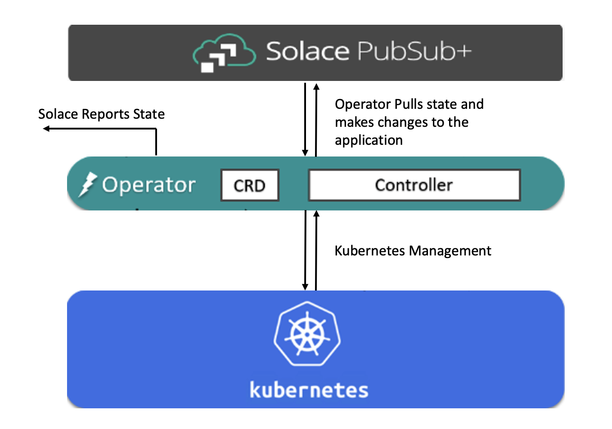
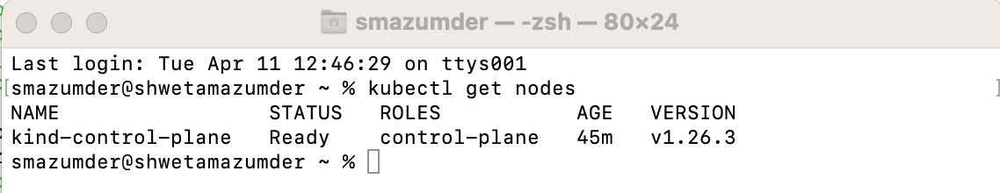
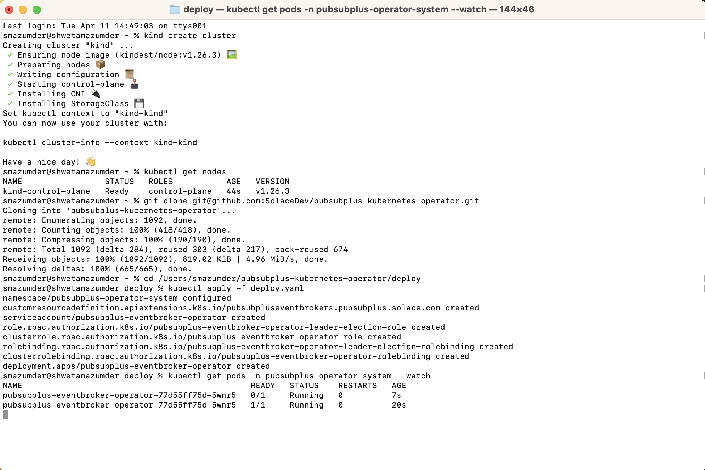
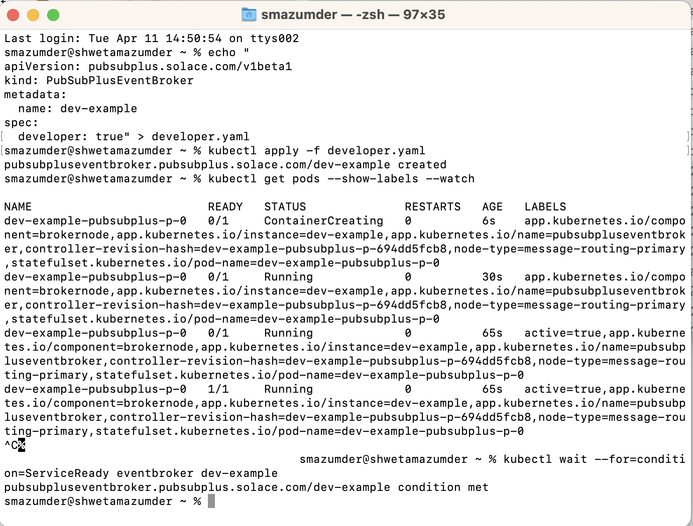
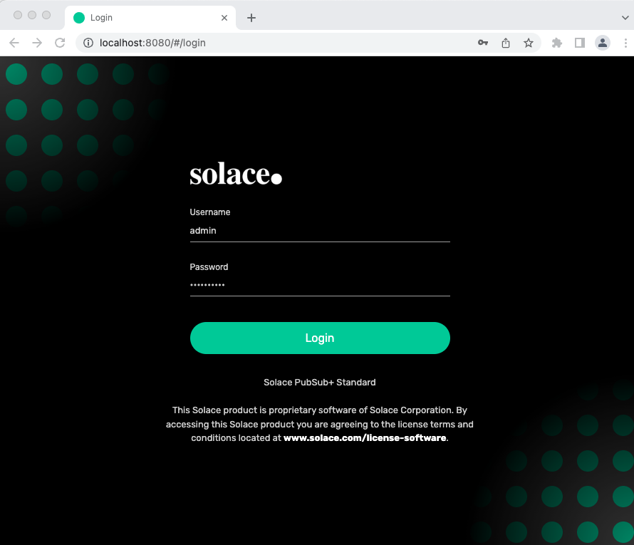
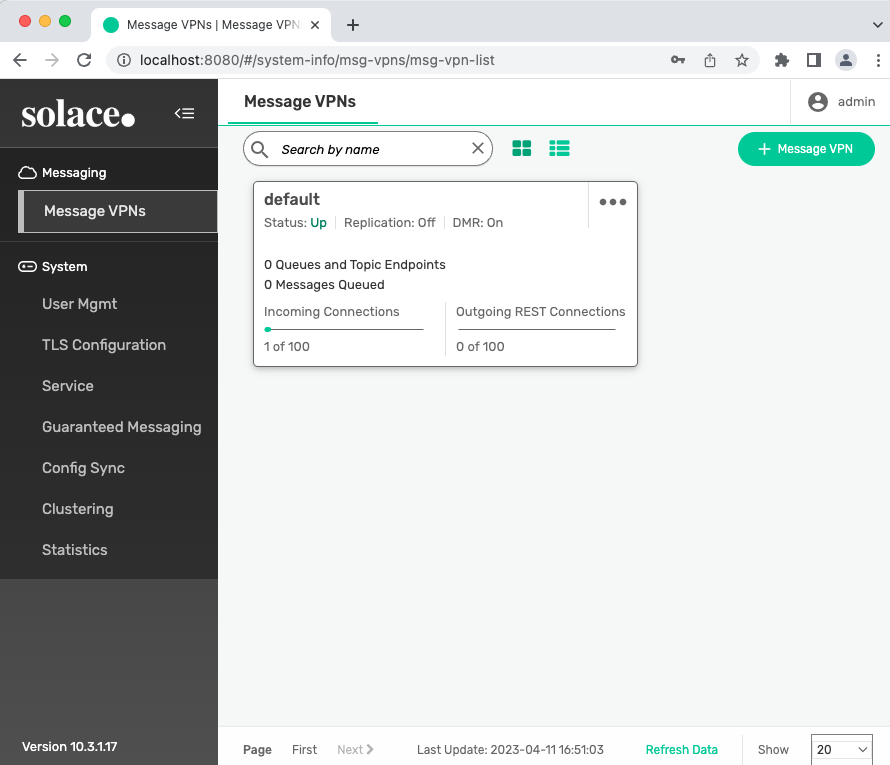

author: shwetamazumder
summary:
id: kubernetes_operator_codelab
tags:
categories:
environments: Web
status: Published
feedback link: https://github.com/SolaceDev/solace-dev-codelabs/blob/master/markdown/kubernetes_operator_codelab

# How to deploy Solace Pubsub+ Event Broker with Pubsub+ Event Broker Operator in Kubernetes

## What you'll learn: Overview

Duration: 0:01:00

Hello and Welcome! If you are wondering how to use our Operator , then you are in the right place! 

This codelab will show how to:
* Setup a kubernetes environment with Kind
* Install the Solace Pubsub+ Event Broker Operator in kubernetes
* Deploy a dev instance of Solace Pubsub+ Event Broker using the Operator
* Test the Pubsub+ Event Broker deployement and login to Pubsub+ Manager


<!--### Info Boxes
Plain Text followed by green & yellow info boxes 

Negative
: This will appear in a yellow info box.

Positive
: This will appear in a green info box.

### Bullets
Plain Text followed by bullets
* Hello
* CodeLab
* World

### Numbered List
1. List
1. Using
1. Numbers

### Add an Image or a GIF -->

<!-- -->

## Prerequisites

Duration: 0:05:00

Before we setup the kubernetes environment in Kind, we need to make sure the below installations are complete and successful.


* Install [Docker Desktop](https://docs.docker.com/desktop/install/mac-install/) on macOS. For other OS options you can visit [Docker](https://docs.docker.com/get-docker/).
* Install Kubernetes command-line tool [kubectl](https://kubernetes.io/docs/tasks/tools/install-kubectl-macos/) on macOS. For other OS options you can visit: \
            [kubectl for Linux](https://kubernetes.io/docs/tasks/tools/install-kubectl-linux/)\
            [kubectl for Windows](https://kubernetes.io/docs/tasks/tools/install-kubectl-windows/) 


<!--### Add a Link
Add a link!
[Example of a Link](https://www.google.com) -->

<!--### Embed an iframe


## Custom Step 1
## Custom Step 2
## Custom Step 3 -->

## Environment Setup

Duration: 0:03:00

Below steps will help you create a kubernetes cluster in Kind and setup the environment for installing the Pubsub+ Event Broker Operator.

### 1. Install Kind On macOS 
#### Option A: Installing via Homebrew
```bash
brew install kind
```
#### Option B: Installing from Release Binaries
```bash
# for Intel Macs
[ $(uname -m) = x86_64 ]&& curl -Lo ./kind https://kind.sigs.k8s.io/dl/v0.18.0/kind-darwin-amd64
# for M1 / ARM Macs
[ $(uname -m) = arm64 ] && curl -Lo ./kind https://kind.sigs.k8s.io/dl/v0.18.0/kind-darwin-arm64
chmod +x ./kind
mv ./kind /some-dir-in-your-PATH/kind
```
For other install options visit [Kind Installation](https://kind.sigs.k8s.io/docs/user/quick-start/).

### 2. Create Kubernetes Cluster using Kind
```bash
kind create cluster
```
### 3. Verify that the Kubernetes Environment is ready
```bash
# This command returns the list of worker nodes and their status
kubectl get nodes
```


### Next Step is to install the Operator


## Install Solace Pubsub+ Event Broker Operator

Duration: 0:05:00

You can install the Operator in two ways:

#### Option A: Operator Hub and OLM install
Follow the steps from [OperatorHub](https://operatorhub.io/operator/pubsubplus-eventbroker-operator) to first setup OLM, then to install the PubSub+ Event Broker Operator. Click on the Install button to see the detailed instructions.
#### Option B: Direct Install
Today, you will learn to do the direct install.

```bash
# clone the directory
git clone git@github.com:SolaceDev/pubsubplus-kubernetes-operator.git

# cd to the pubsubplus-kubernetes-operator/deploy folder and apply deploy.yaml
# Manifest creates a namespace and all K8s resources for the Operator deployment
kubectl apply -f deploy.yaml

# Wait for deployment to complete
kubectl get pods -n pubsubplus-operator-system --watch
```
Note: If you do not have SSH setup on your machine and got an error cloning the repo, you can clone the https link instead `https://github.com/SolaceDev/pubsubplus-kubernetes-operator.git`




### Next Step is to install the Event Broker

## Install Solace Pubsub+ Event Broker 

We are going to deploy a dev instance of the Solace Pubsub+ Event Broker using the Operator.

### Minimum-footprint Deployment for Developers
```bash
# This command returns the list of worker nodes and their status
# Create deployment manifest

echo "
apiVersion: pubsubplus.solace.com/v1beta1
kind: PubSubPlusEventBroker
metadata:
  name: dev-example
spec:
  developer: true" > developer.yaml

# Then apply it
kubectl apply -f developer.yaml

# Wait for broker deployment pods to be ready
kubectl get pods --show-labels --watch

# Check service-ready
kubectl wait --for=condition=ServiceReady eventbroker dev-example
```



### Next Step is to test the deployment

## Test Solace Pusbub+ Event Broker Deployment

Duration: 0:05:00

In this section we are going to check the event broker deployment status, get information about the service name and type to access the broker services, and obtain the secret that contains the credentials to be used for admin access.

### 1. Check the Event Broker Status
```bash
kubectl describe eventbroker dev-example
```
### 2. Obtain the management admin password
```bash
ADMIN_SECRET_NAME=$(kubectl get eventbroker dev-example -o jsonpath='{.status.broker.adminCredentialsSecret}')

# This command returns the management "admin" user's password
kubectl get secret $ADMIN_SECRET_NAME -o jsonpath='{.data.username_admin_password}' | base64 -d
```

### 3. Obtain the IP address to access the broker services

```bash
BROKER_SERVICE_NAME=$(kubectl get eventbroker dev-example -o jsonpath='{.status.broker.serviceName}')

# This command returns the broker service's external IP address
kubectl get svc $BROKER_SERVICE_NAME -o jsonpath='{.status.loadBalancer.ingress}'
```

### 4. Access the PubSub+ Broker Manager


* In your browser, navigate to the IP address you obtained, using port 8080

```bash
http://<ip-address>:8080
```
Note: If you did not get the external ip address of broker service in step 3 that means there is no external load balancer created. As a workaround, you can run port forwarding in the background.

```bash
# Run port forwarding for SEMP
kubectl port-forward svc/$BROKER_SERVICE_NAME 8080:8080

# Now you can access to localhost at port 8080 and login to Pubsub+ Manager
http://localhost:8080
```

* Login as user `admin` with the management admin password you obtained.
* Use the Broker Manager [built-in Try-Me](https://docs.solace.com/Admin/Broker-Manager/PubSub-Manager-Overview.htm?Highlight=manager#Test-Messages) tool to test messaging.






## Takeaways
Duration: 0:01:00


This codelab shows how the operator makes an event broker deployment easy by simply applying the yaml file. We have deployed a dev instance of the Pubsub+ Event Broker using the Operator in a Kubernetes cluster, where, Kind is used to run Kubernetes locally on a mac machine. \
Checkout [Kubernetes Operator - Quickstart](https://github.com/SolaceProducts/pubsubplus-kubernetes-quickstart) for more deployment options.
<!--✅ < Fill IN TAKEAWAY 1>   
✅ < Fill IN TAKEAWAY 2>   
✅ < Fill IN TAKEAWAY 3>   -->

 

Thanks for participating in this codelab! Let us know what you thought in the [Solace Community Forum](https://solace.community/)! If you found any issues along the way we'd appreciate it if you'd raise them by clicking the Report a mistake button at the bottom left of this codelab.
