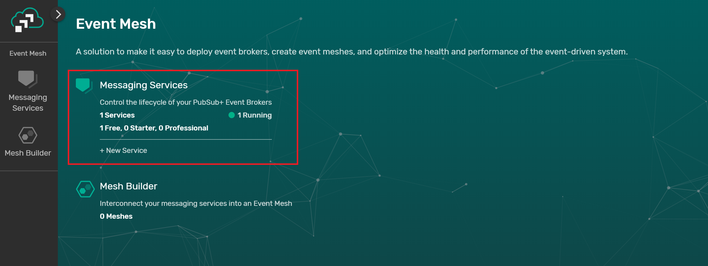
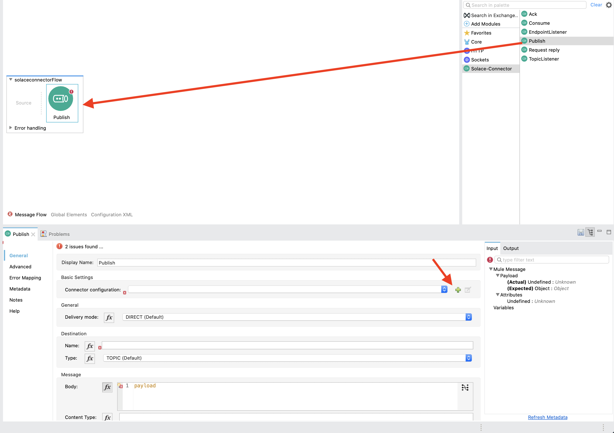

author: Tamimi
summary: This Codelab shows you how to use the Solace Connector in MuleSoft Anypoint Platform. 
id: mulesoft-connector
tags: 
categories: Mulesoft
environments: Web
status: Published
feedback link: https://github.com/SolaceDev/solace-dev-codelabs/blob/master/markdown/mulesoft-connector
analytics account: UA-3921398-10

# Using the MuleSoft Solace Connector to publish events

## What you'll learn: Overview

Duration: 0:01:00


In this codelab, I will be showing you how to use and configure the Solace connector on MuleSoft Anypoint Platform to send or receive events. 

The MuleSoft Anypoint Platform in an integration platform and acts as a complete solution for API-led connectivity. You can learn more about MuleSoft Anypoint [here](https://videos.mulesoft.com/watch/bakFGgwqNDJzoJFNydiMiH). Alternatively you can checkout the ultimate [MuleSoft developer quick start guide](https://blogs.mulesoft.com/dev-guides/how-to-tutorials/new-developer-quick-start-guides/)

So put your seatbelt on and tag along in the following steps!     


## What you need: Prerequisites

Duration: 0:01:00

To run this codelab all you need

1. Access to a Solace PubSub+ Event Broker (Cloud, Hardware, Software Image)
1. MuleSoft Anypoint Account & Anypoint Studio

## Setup a Solace PubSub+ Cloud Broker 
Duration: 0:05:00

Access to a Solace messaging service, Solace PubSub+, can be achieved in anyone of the three flavours
1. Hardware Appliance
1. Software broker image (Docker, Virtual image)
1. Solace Cloud service instance

If you already have a Solace PubSub+ Cloud account, you can skip this step

This tutorial will walk you through setting up a Solace Cloud service instance. If you are interested in setting up a local broker running on Docker or a virtual machine check out the [PubSub+ Event  Broker: Software](https://docs.solace.com/Solace-SW-Broker-Set-Up/SW-Broker-Image-Setup.htm) documentation

### Sign up for free Solace Cloud account 
Navigate to the [Create a New Account](https://console.solace.cloud/login/new-account) page and fill out the required information. No credit card required!

### Create a messaging service
After you create your Solace Cloud account and sign in to the Solace Cloud Console, you'll be routed to the event mesh page.




Click on 'Messaging Services' and all the messaging services associated with your account will show up if you have any already created. To create a new service, click either button as depicted in the image below:


Fill out all the details for your messaging service, and then click "Create" at the bottom of the page.


Your service should be ready to use in a couple seconds! 🌪

## Sign up for a MuleSoft Anypoint Account
Duration: 0:05:00

If you already have a MuleSoft Anypoint account and Anypoint Studio, you can skip this step.

- Navigate to the MuleSoft Anypoint [signup page](https://anypoint.mulesoft.com/login/signup) and signup for a trial account  


- After successfully signing up, you will have access to Anypoint


- [Anypoint Studio IDE](https://www.mulesoft.com/platform/studio) has pre-built modules for common integration components like querying backends and routing events. We will be installing the Solace connector in the IDE.


## Install the Solace Connector
Duration: 0:02:00

- Now that you have Anypoint Studio IDE installed, let's go ahead and create a new project 


- Give your project a name. Note that you can also scaffold a new MuleSoft project from a template using [RAML](https://www.mulesoft.com/resources/api/design-apis-easily-with-RAML)


- As per the Solace connector documentation on [solace-iot-team/solace-mule-connector](https://github.com/solace-iot-team/solace-mule-connector) github repo, edit the pom.xml file to add a new dependency and repository

```
<dependency>
	<groupId>com.solace.connector</groupId>
	<artifactId>solace-mulesoft-connector</artifactId>
	<version>0.3.3-SNAPSHOT</version>
	<classifier>mule-plugin</classifier>
</dependency>
```
```
	<repositories>
	<!-- keep all the mulesoft repositories that are configured here --->
		<repository>
			<id>myMavenRepo.read</id>
			<url>https://mymavenrepo.com/repo/27AIdW4GdyXFzutegEs5/</url>
		</repository>
	</repositories>
```


Positive
: Note: If you are new to Anypoint Studio, you can switch from `Design` to `Source` view for the file 👇


- Save the file. Note that when you save the file, the IDE immediately executes a `mvn install` which installs the solace connector


Positive
: The connector is installed and ready to use 💥

## Basic Publisher Flow
Duration: 0:05:00

Now that the connector is installed, go ahead and navigate to `src/main/mule` and double click on the xml file. When you do so, you will see an empty Message Flow canvas


Observe in the Main Palette on the right hand side the Solace Connector with all the different operations that you can use


Let's go ahead and create a basic flow that publishes events to a predefined topic on the previously created solace broker.

- Drag the publish Palette from the Solace directory into the Message Flow canvas 



- Double click on the Publish object and navigate to the Basic Settings. Click on the green `Add` icon to add a new connection configuration

- Fill in the connection information to configure the Publisher object


Positive
: You can find the host configuration from the `Connect` tab in your Solace Cloud Account 


- Once done, you can test the connection


## Put it all together
Duration: 0:9:00

Now that you have a publisher object configured, let's test it out! In this step, we will configure a scheduler that will publish messages every second on a predefined topic

Positive
: Note: You can use **any** trigger like a post REST request 

### Flow Configuration

- To do so, let's go ahead and search for `Scheduler` under the main palette catalogue on the left hand side of the IDE


- Drag it to the Source section of the flow


- Configure the scheduler to trigger every second


- Now back to the Publisher object, double click on it to configure the topic publish string and the body of the payload. Under the `Deliver Mode` make sure its set to `Direct`. The Destination name field is the topic; populate it with this topic `solace/mule/flow` and add whatever you want in the Message Body


- Click on the canvas and save the file! 

### Subscribe to topic on the broker

Before executing the flow, let's setup a subscriber on the broker to observe the messages flowing. To do so:

- Navigate to your Solace Cloud messaging service, and click on the TryMe! tab


- In the Subscriber section, click on `Connect` and add a topic subscription `solace/mule/>`


Positive
: Notice the usage of the `>` [Solace Wildcard](https://docs.solace.com/PubSub-Basics/Wildcard-Charaters-Topic-Subs.htm)

- Now navigate back to your AnypointStudio and run the flow. You can either do that by clicking the 


- While the flow is running, navigate back to the Solace Cloud console and observe the messages flowing every second  


And that's it! You can check out more information on [solace-iot-team/solace-mule-connector](https://github.com/solace-iot-team/solace-mule-connector) github repo to see other functionalities with the broker

## [Optional] Add a subscriber flow
Duration: 0:5:00

Now that you have created a publisher flow and tested it out, let's go ahead and create a `TopicListener` object that will connect to the broker and subscribe to the topic we sent. To do so:

- Navigate to the Solace-Connector Palette, drag and drop the `TopicListener` object into the canvas


- Double click on the TopicListner object to configure it. Notice how the Connector Configuration settings is auto populated. Change the Subscription value from `Bean Reference` to `Inline`		
	

- Click on the green add icon to add a subscription. Add `solace/mule/>`


- Add a logging shape. Search for `Logger` from the pallette menu and drag it to the TopicListner flow	
	

- Configure the logger to log out the received message. Double click on the logger object, in the Message input under Generic, add the following
	


```
%dw 2.0
output application/java
---
payload
```

- Your full flow should look like this		
		

- Run it! Observe in the logs every second an output of the message will be logged
		


## Takeaways

Duration: 0:02:00

✅ We were able to show how to create a new Solace Cloud Account     
✅ Install Anypoint Studio    
✅ Install the Solace Connector    
✅ Configure a publish object     
✅ Use the Solace Cloud TryMe tab to test out our connection and configuration    

Positive
: For more examples on how to use the Solace MuleSoft connector checkout the [solace-iot-team/solace-mule-connector-examples](https://github.com/solace-iot-team/solace-mule-connector-examples) github repository.

Thanks for participating in this codelab! Let us know what you thought in the [Solace Community Forum](https://solace.community/)! If you found any issues along the way we'd appreciate it if you'd raise them by clicking the _Report a mistake_ button at the bottom left of this codelab.


