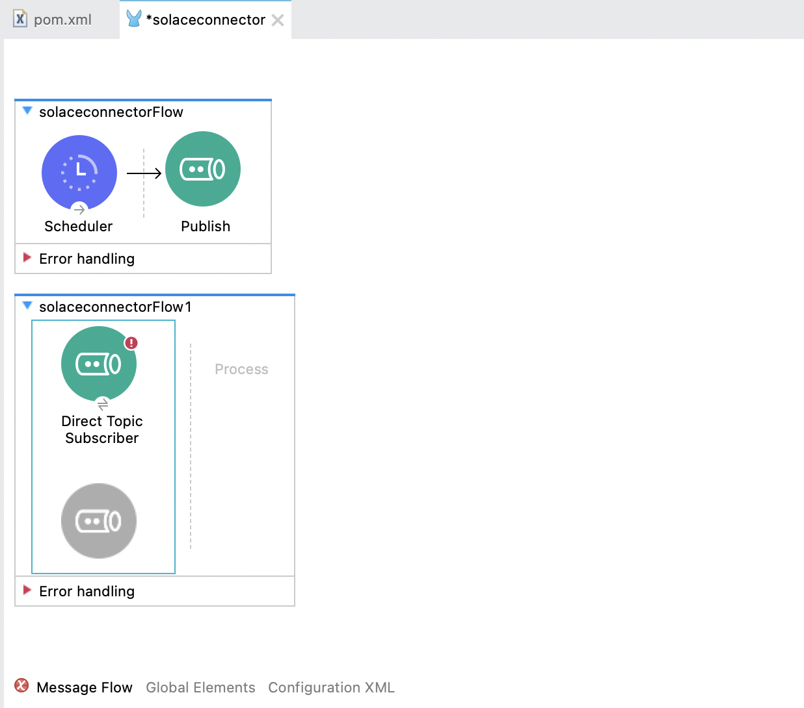

author: Tamimi
summary: This Codelab shows you how to use the Solace Connector in MuleSoft Anypoint Platform.
id: mulesoft-connector
tags:
categories: Mulesoft
environments: Web
status: Published
feedback link: https://github.com/SolaceDev/solace-dev-codelabs/blob/master/markdown/mulesoft-connector

# Using the MuleSoft Solace Connector to publish events

## What you'll learn: Overview

Duration: 0:01:00


In this codelab, I will be showing you how to use and configure the Solace connector on MuleSoft Anypoint Platform to send or receive events.

The MuleSoft Anypoint Platform is an integration platform and acts as a complete solution for API-led connectivity. 

To learn more about Mulesoft Anypoint platform, checkout the following resources:

[MuleSoft Videos - Anypoint Platform](https://videos.mulesoft.com/watch/bakFGgwqNDJzoJFNydiMiH) 

[MuleSoft Developer - Quick Start guide](https://blogs.mulesoft.com/dev-guides/how-to-tutorials/new-developer-quick-start-guides/)  

[Solace PubSub+ Connector - Mule 4, Documentation and Examples](https://github.com/SolaceProducts/pubsubplus-connector-mule-docs)


So put your seatbelt on and tag along in the following steps!


## What you need: Prerequisites

Duration: 0:01:00

To run this codelab all you need

1. Access to a Solace PubSub+ Event Broker (Cloud, Hardware, Software Image)
1. MuleSoft Anypoint Account & Anypoint Studio

## Setup a Solace PubSub+ Cloud Broker

Duration: 0:05:00

Access to a Solace messaging service, Solace PubSub+, can be achieved in anyone of the three flavours

1. Hardware Appliance
1. Software broker image (Docker, Virtual image)
1. Solace Cloud service instance

If you already have a Solace PubSub+ Cloud account, you can skip this step

This tutorial will walk you through setting up a Solace Cloud service instance. If you are interested in setting up a local broker running on Docker or a virtual machine check out the [PubSub+ Event Broker: Software](https://docs.solace.com/Solace-SW-Broker-Set-Up/SW-Broker-Image-Setup.htm) documentation

### Sign up for free Solace Cloud account

Navigate to the [Create a New Account](https://console.solace.cloud/login/new-account) page and fill out the required information. No credit card required!

### Create a messaging service

After you create your Solace Cloud account and sign in to the Solace Cloud Console, you'll be routed to the event mesh page.


Click on 'Cluster Manager' and all the messaging services associated with your account will show up if you have any already created. To create a new service, click either button as depicted in the image below:


Fill out all the details for your messaging service, and then click "Create" at the bottom of the page.


Your service should be ready to use in a couple seconds! 🌪

## Sign up for a MuleSoft Anypoint Account

Duration: 0:05:00

If you already have a MuleSoft Anypoint account and Anypoint Studio, you can skip this step.

- Navigate to the MuleSoft Anypoint [signup page](https://anypoint.mulesoft.com/login/signup) and signup for a trial account  
  

- After successfully signing up, you will have access to Anypoint
  

- [Anypoint Studio IDE](https://www.mulesoft.com/platform/studio) has pre-built modules for common integration components like querying backends and routing events. We will be installing the Solace connector in the IDE.
  

## Install the Solace Connector

Duration: 0:02:00

- Now that you have Anypoint Studio IDE installed, let's go ahead and create a new project
  

- Give your project a name. Note that you can also scaffold a new MuleSoft project from a template using [RAML](https://www.mulesoft.com/resources/api/design-apis-easily-with-RAML)
  

- Locate and click on the menu item "Search in Exchange" in the top-right pane "Mule Palette", a popup to identify dependencies will appear
  
  
- Enter "Solace" in the search box to see the "Solace PubSub+ Connector - Mule 4" listed in the available modules list. Select and click on "Add" button and click on Finish.
  


- Review the new Solace Connector made available in the palette list.
  

- Save the file. Note that when you save the file, the IDE immediately executes a `mvn install` which installs the solace connector
  

> aside positive
> The connector is installed and ready to use 💥

## Configure Connection to Solace PubSub+ Broker
Launch Solace PubSub+ console and select the Broker
 

Select the Broker and open the Connect tab
 

Open the Connect tab and make a note of the parameters
- Username
- Password
- Message VPN and
- Secured SMF Host
  


Now, we can configure Solace PubSub+ Connector in the Anypoint Studio.

In order to create a connection to Solace PubSub+ Broker, we need to create a new connector configuration. Select the "Global Configuration" in the flow and select "Solace PubSub+ Connector config" option


In the popup dialog, in the Connection tab enter values for Client Username, Password, Message VPN and Broker Host with the noted values from the previous step.


Click on "Test Connection" to ensure that the connection to Broker is successful.


## Basic Publisher Flow

Duration: 0:12:00

Now that the connector is installed, go ahead and navigate to `src/main/mule` and double click on the xml file. When you do so, you will see an empty Message Flow canvas


Observe in the Main Palette on the right-hand side the Solace Connector and all the different operations that you can use in the flow.


Let's go ahead and create a basic flow that publishes events to a predefined topic on the previously created solace broker.

Drag the publish Palette from the Solace directory into the Message Flow canvas


Ensure that the "Connector configuration" of "Publish" in the bottom pane is selected with the Solace PubSub+ Connection configuration "Solace_PubSub__Connector_Config" created in the previous step.

Now that you have a publisher object configured, let's test it out! In this step, we will configure a scheduler that will publish messages every second on a predefined topic

> aside positive
> Note: You can use **any** trigger like a post REST request

### Flow Configuration

- To do so, let's go ahead and search for `Scheduler` under the main palette catalogue on the left hand side of the IDE
  

- Drag it to the Source section of the flow
  

- Configure the scheduler to trigger every second
  

- Now back to the Publisher object, double click on it to configure the topic publish string and the body of the payload. 
  - Under the `Destination`, set
    `Deliver Mode` to `Direct`,
    `Type` to `Topic`, and
    `Name` to `solace/mule/flow`
  - Set the `Message Body` as "This is the body of the message sent from a mule flow"

    

- Click on the canvas and save the file!

### Subscribe to topic on the broker

Before executing the flow, let's setup a subscriber on the broker to observe the messages flowing. To do so:

- Navigate to your Solace Cloud messaging service, and click on the TryMe! tab
  

- In the Subscriber section, click on `Connect` and add a topic subscription `solace/mule/>`
  

> aside positive
> Notice the usage of the `>` [Solace Wildcard](https://docs.solace.com/PubSub-Basics/Wildcard-Charaters-Topic-Subs.htm)

- Now navigate back to your AnypointStudio and run the flow. You can either do that by clicking the
  

- While the flow is running, navigate back to the Solace Cloud console and observe the messages flowing every second  
  

And that's it! You can check out demos on [SolaceProducts/pubsubplus-connector-mule-docs](https://github.com/SolaceProducts/pubsubplus-connector-mule-docs) github repo to see other functionalities with the broker.

## [Optional] Add a subscriber flow

Duration: 0:5:00

Now that you have created a publisher flow and tested it, let's go ahead and create a `Direct Topic Subscriber` object that will connect to the broker and subscribe to the topic we sent. To do so:

- Navigate to the Solace-Connector Palette, drag and drop the `Direct Topic Subscriber` object into the canvas



- Double click on the `Direct Topic Subscriber` object to configure it. Set 
  - Ensure that the "Solace_PubSub_Connector_Config" is chosen as the `Connector Configuration`
  - `Topic(s)` in the `Subscriptions` as "solace/mule/>" and 
  
    


- Add a logging shape. Search for `Logger` from the pallette menu and drag it to the Topic Subscriber flow


- Configure the logger to log out the received message. Double click on the logger object, in the Message input under Generic, add the following
  

```
%dw 2.0
output application/java
---
payload
```

- Your full flow should look like this
  

- Run it! Observe in the logs every second an output of the message will be logged
  


We successfully created a publisher to publish events on a topic to the PubSub+ Broker, and subscribe to the topic as well. This Mule-Solace interaction is enabled using the Solace PubSub+ MuleSoft Connector.

## Takeaways

Duration: 0:02:00

✅ We were able to show how to create a new Solace Cloud Account  
✅ Install Anypoint Studio  
✅ Install the Solace Connector  
✅ Configure a publish object   
✅ Use the Solace Cloud TryMe tab to test out our connection and configuration    
✅ Configure a subscriber object    
✅ Run the subscriber flow to receive the published events

> aside positive
> For more examples on how to use the Solace MuleSoft connector checkout the [SolaceProducts/pubsubplus-connector-mule-docs](https://github.com/SolaceProducts/pubsubplus-connector-mule-docs) github repository.

Thanks for participating in this codelab! Let us know what you thought in the [Solace Community Forum](https://solace.community/)! If you found any issues along the way we'd appreciate it if you'd raise them by clicking the _Report a mistake_ button at the bottom left of this codelab.


