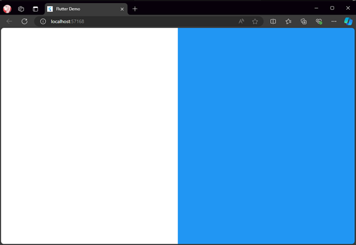
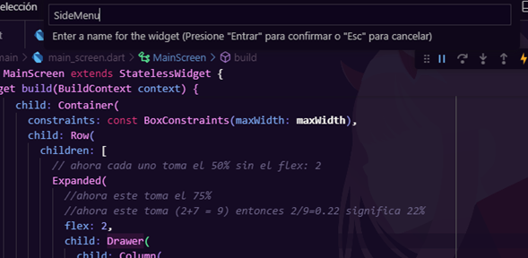
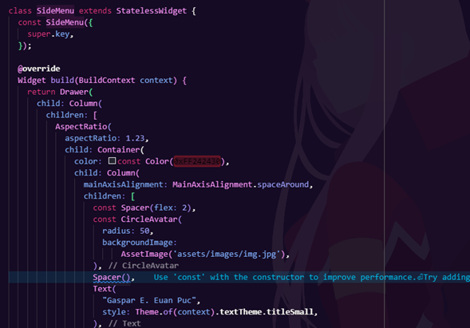
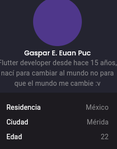
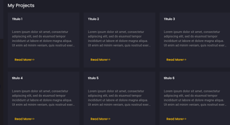

author: gaspareuan155@gmail.com
summary: "Este es un portafolio responsivo desarrollado con Flutter."
id: portafolio-responsivo
tags: Flutter, Responsive, Portafolio
categories: web
environments: Web
status: Published
feedback link: https://github.com/SolaceDev/solace-dev-codelabs/blob/master/markdown/portafolio

# Portafolio Flutter

## Introducción 

Este manual explica cómo se creó un portafolio responsivo usando Flutter, pensado para que se vea bien en diferentes dispositivos como celulares y computadoras. En los videos se muestra paso a paso cómo organizar todo, agregar contenido y darle un diseño atractivo. La idea es que cualquiera pueda seguir este proceso y terminar con un portafolio personal que le sirva para mostrar sus proyectos de manera profesional y sencilla.  

Videos utilizado.  
Responsive and Animated Portfolio Website & App - Episode 1 - Flutter UI - Speed Code  
[Parte 1](https://youtu.be/G_ZIJseX6AU?si=4HfYQJeVIgqQCx-w)    
Responsive and Animated Portfolio Website & App Episode 2!   
[Parte 2](https://youtu.be/KopZ01vN4uE?si=ycC0jThkT2LJvLZS)  

Creditos: [The Flutter Way](https://www.youtube.com/@TheFlutterWay)  


## Requisitos previos
### Requisitos 

Instalar flutter!
[ILink de como instalar flutter para windws](https://youtu.be/BTubOBvfEUE?si=uxK--dScKQLvRyiZ)

Primero se deben agregar las dependencias que se pretenden usar en el proyecto mirar la figura 1.   
Figura 1  


Existe una dependencia change_app_package_name que nos permite cambiar varios documentos de nombre para evitar problemas con la construcción de la aplicación en móviles. Se utiliza poniendo en la terminal flutter pub run change_app_package_name:main app.delivery mirar la Figura 2

Ejemplo: flutter pub run change_app_package_name:main app.delivery

Figura 2.  


Luego se deberá crear cuatro carpetas, dos archivos como los que vemos a continuación:

Figura 3  
  

Cuatro carpetas, una en la raíz principal que tendrá por nombre assets donde se importaran las dos carpetas icons y images que estaran en el repositorio: ……
Esas carpetas deberán estar referenciados en el archivo pubspec.yaml mirar la figura 4, luego dentro de la carpeta lib se crearan dos carpetas models y screens además de dos archivos en la misma jerarquía de lib tendrán como nombre constants.dart y responsive.dart mirar la figura 3.

Figura 4  
 


## Pasos detallados

Continuación...   

El archivo constants.dart va tener lo siguiente:

```dart
const primaryColor = Color(0xFFFFC107);
const secondaryColor = Color(0xFF242430);
const darkColor = Color(0xFF191923);
const bodyTextColor = Color(0xFF8B8B8D);
const bgColor = Color(0xFF1E1E28);

const defaultPadding = 20.0;
const defaultDuration = Duration(seconds: 1);
const maxWidth = 1440.0;
```

Dentro de la carpeta models tendremos dos archivos Project.dart y Recommendation.dart mirar la figura 5.  
Figura 5    
 

Dentro de Project.dart estará los proyectos que nosotros hemos hecho, recuerden que es un portafolio de proyectos para presentar, por ejemplo, puede seguir el siguiente formato donde irán tantos items como proyectos tengan:  

```dart
class Project {
  final String? title, description;

  Project({this.title, this.description});
}

List<Project> demo_projects = [
  Project(
    title: "Titulo 1",
    description: "Lorem ipsum dolor sit amet, consectetur adipiscing elit, sed do eiusmod tempor incididunt ut labore et dolore magna aliqua. Ut enim ad minim veniam, quis nostrud exercitation ullamco laboris nisi ut aliquip ex ea commodo consequat. Duis aute irure dolor in reprehenderit in voluptate velit esse cillum dolore eu fugiat nulla pariatur. Excepteur sint occaecat cupidatat non proident, sunt in culpa qui officia deserunt mollit anim id est laborum.",
  ),
  Project(
    title: "Titulo 2",
    description: "Lorem ipsum dolor sit amet, consectetur adipiscing elit, sed do eiusmod tempor incididunt ut labore et dolore magna aliqua. Ut enim ad minim veniam, quis nostrud exercitation ullamco laboris nisi ut aliquip ex ea commodo consequat. Duis aute irure dolor in reprehenderit in voluptate velit esse cillum dolore eu fugiat nulla pariatur. Excepteur sint occaecat cupidatat non proident, sunt in culpa qui officia deserunt mollit anim id est laborum.",
  ),
];
```
Dentro de Recommendations.dart va una lista de las recomendaciones que tenemos a favor de nosotros por ejemplo la podemos seguir esta estructura.

``` dart
class Recommendation {
  final String? name, source, text;

  Recommendation({this.name, this.source, this.text});
}

final List<Recommendation> demo_recomendations = [
  Recommendation(
    name: "",
    source: "",
    text: ""
  ),
  Recommendation(
    name: "",
    source: "",
    text: ""
  ),
  Recommendation(
    name: "",
    source: "",
    text: ""
  ),
];
```
Para empezar en la carpeta screens tenemos otra carpeta llamada main y dentro de esa carpeta estará el archivo que lleva por nombre main_screen.dart
Que tiene la siguiente estructura de codigo:

``` dart
import 'package:flutter/material.dart';

class MainScreen extends StatelessWidget {
  const MainScreen({super.key});

  @override
  Widget build(BuildContext context) {
    return Container();
  }
}
```
Empezaremos modificando el main.dart donde se especificara algunas configuraciones que tendremos para el proyecto como por ejemplo se usara el tema dark. Modificaremos el widget Myapp quedando de la siguiente forma.

``` dart
class MyApp extends StatelessWidget {
  // This widget is the root of your application.
  @override
  Widget build(BuildContext context) {
    return MaterialApp(
      debugShowCheckedModeBanner: false,
      title: 'Flutter Demo',
      // we are using dark theme and we modify it as our need
      theme: ThemeData.dark().copyWith(
        primaryColor: primaryColor,
        scaffoldBackgroundColor: bgColor,
        canvasColor: bgColor,
        textTheme: GoogleFonts.poppinsTextTheme(Theme.of(context).textTheme)
            .apply(bodyColor: Colors.white)
            .copyWith(
              bodyLarge: const TextStyle(color: bodyTextColor),
              bodyMedium: const TextStyle(color: bodyTextColor),
            ),
      ),
      home: const MainScreen(),
    );
  }
}
```
Como ven estamos indicando que el home será MainScreen procederemos a modificar el widget build quedado algo como esto.

``` dart
 Widget build(BuildContext context) {
    return Scaffold(
      body: Row(
        children: [
          Expanded(
            child: Container(
              color: Colors.white,
            ),
          ),
          Expanded(
            child: Container(
              color: Colors.blue,
            ),
          ),
        ],
      ),
    );
  }

```
al correr el programa por el navegador tendremos algo como esto de resultado figura 6.  
Figura 6    
 

hacemos un salto de linea en ambas lineas donde está el Expanded
quedando una configuración de este estilo donde solo se agregó flex para tener el siguiente resultado.

Figura 7    


Figura 8    


Una vez tengamos ese resultado pasaremos a envolver el widget row con un container se puede poner el cursor sobre row y presionas ctrl +. y saldra el menu siguiente y escogeremos wrap with container.

Figura 9    


En la siguiente linea entre el row y el container escribiremos un constrains.  
Figura 10    
  

Luego de la misma manera vamos a envolver container en un center (Wrap with center) quedando un codigo así. Nota: Se corrigió la parte marcada en rojo.  
Figura 11    

En el primer expanded quitaremos el container y en su lugar tendremos Drawer con la siguiente configuración ver figura 12 donde se tendrá el siguiente resultado ver figura 13.

Figura 12    


Figura 13    


Continuando con lo anterior se va poner debajo de color un child dentro un colum ver Figura 14.

Figura 14    
  
En assetName se pone la ruta de la imagen que tenemos en la carpeta images, la ruta lo sacamos presionando sobre la imagen un click derecho y la opción copiar ruta de acceso relativa y lo pegamos en donde esta assetName entre las comillas simples quedando algo así, se puede cambiar por otra imagen pero por motivos prácticos ese está bien.
backgroundImage: AssetImage('assets/images/IMG_7344.jpg'), agregaremos nuestro nombre y una descripcion con los widgets de text ademas de otras configuraciones como el mainAxisAligment dejando un codigo como este ver figura 15, con el siguiente resultado ver figura 16.
figura 15.  
Figura 15    


Figura 16    
  
Ahora nos vamos a parar sobre el Drawer y presionamos ctrl+ . y daremos en la opción Extract Widget ver figura 17, nos saldrá para escribir para escribir el nombre del nuevo widget escribimos SideMenu ver figura 18 lo cual nos formará el siguiente widget con ese nombre en el mismo archivo donde estamos trabajando, pero hasta el final del codigo ver figura 19.

Figura 17    


Figura 18    


Figura 19    
  
Ese widget lo seleccionamos y lo recortamos para moverlo a un documento que crearemos en la carpeta main de la siguiente manera como pueden ver el archivo está dentro de lib/screen/main/components ver figura 20.

Figura 20    
  
Ahora dentro del side_menu.dart de igual manera haremos lo mismo con que con drawer solo que ahora será con AspecRation extraemos el widget y le ponemos MyInfo ver figura 21 y a la misma jerarquia de side_menu.dart creamos my_info.dart y ahí pegamos el widget que extraemos ver figura 22, no olviden que en cada archivo creado se debe importar el import 'package:flutter/material.dart';

Figura 21    


Figura 22    
  
Como podemos observar esta llorando en rojo, pobrecito vamos a consolarlos y darle lo que quieren, y es que al separar los códigos debemos decirle donde se encuentra. Mas técnico serio, importar cada uno en los documentos donde ves que este rojo con la ayuda de flutter esto se vuelve tan sencillo como pararse encima del problema y presionar ctrl + . e importar la librería ver figura 23.

Figura 23    
  
Después de resolver todos estos problemas toca escribir codigo, nos situamos en el archivo side_menu.dart y debajo de MyInfo() creamos un extend donde escribiremos todo esto ver figura 24.  
Figura 24    
  
Ahora en ese codigo vamos a extraer el row y le pondremos de nombre AreaInfoText ver figura 25, conforme avance iré siendo menos especifico asumiendo que lo que lo que se hace ya se explicó antes a más detalle.  
Figura 25    
  
Del widget modificado solo se agregará esta parte ver figura 26 y se modificará la información que se tenía puesto en lugar de “Residencia” se dejará como title! Lo mismo con “Mérida” ver figura 27.  
Figura 26    
  
Figura 27    
  
Esto permitirá que agregar el codigo sea más limpio y legible ver figura 28.  
Figura 28    
  
En el Widget AreaInfoText se va a envolver el Row en un padding donde se pondrá la configuración siguiente ver figura 29 después de esa configuración debemos tener lo siguiente ver figura 30.  
Figura 29    
  
Figura 30    
  

Debajo de donde se terminó el AreaInfoText se escribió lo siguiente.
``` dart
const Divider(),
                  Padding(
                    padding:
                        const EdgeInsets.symmetric(vertical: defaultPadding),
                    child: Text(
                      "Skils",
                      style: Theme.of(context).textTheme.bodySmall,
                    ),
                  ),
                  Column(
                    children: [
                      AspectRatio(
                        aspectRatio: 1,
                        child: TweenAnimationBuilder(
                          tween: Tween<double>(begin: 0, end: 1),
                          duration: defaultDuration,
                          builder: (context, double value, child) => Stack(
                            fit: StackFit.expand,
                            children: [
                              CircularProgressIndicator(
                                value: value,
                                color: primaryColor,
                                backgroundColor: darkColor,
                              ),
                              Center(
                                child: Text(
                                  (value * 100).toInt().toString() + "%",
                                  style: Theme.of(context).textTheme.bodySmall,
                                ),
                              ),
                            ],
                          ),
                        ),
                      ),
                      SizedBox(height: defaultPadding/2),
                      Text(
                        "Flutter",
                        maxLines: 1,
                        overflow: TextOverflow.ellipsis,
                        style: Theme.of(context).textTheme.bodySmall,
                      ),
                    ],
                  ),

```
cuando se tenga el codigo se deberá extraer el widget column le pondremos el nombre de skills como se hizo antes y ese widget que se genera lo cortamos y se creara un archivo skills.dart en la misma jerarquía donde se extrajo lo pegamos ahí ver figura 31 y en ese widget skills vamos a extraer al AspectRation y dentro de la carpeta lib se creara una carpeta llamada components y ahí dentro se creara un archivo animated_progress_indicator.dart donde se meterá el widget que creamos AnimatedCircularProgressIndicator ver figura 32 y resultado de esta configuración estará en la figura 33, ten en cuenta que cada vez que separamos los codigos queda solo el nombre del widget que estamos extrayendo, como si llamaramos una función ejemplo Skills().   


Figura 31    
  
Figura 32    
  
Figura 33    
  
Seguimos trabajando en el archivo side_menu.dart donde debajo del skills() pondremos esto ver figura 34.  
Figura 34    
   
Hasta abajo creamos este widget con el que tendremos el siguiente resultado en pantalla ver figura 35.  

 ``` dart
class Coding extends StatelessWidget {
  const Coding({
    super.key,
  });

  @override
  Widget build(BuildContext context) {
    return Column(
      crossAxisAlignment: CrossAxisAlignment.start,
      children: [
        Divider(),
        Padding(
          padding: const EdgeInsets.symmetric(vertical: defaultPadding),
          child: Text(
            "coding",
            style: Theme.of(context).textTheme.bodyMedium,
          ),
        ),
        TweenAnimationBuilder(
          tween: Tween<double>(begin: 0, end: 0.8),
          duration: defaultDuration,
          builder: (context, value, child) => Column(
            children: [
              Row(
                mainAxisAlignment: MainAxisAlignment
                    .spaceBetween, //Deja espacios entre los hijos
                children: [
                  Text(
                    "dart",
                    style: TextStyle(color: Colors.white),
                  ),
                  Text((value * 100).toInt().toString() + "%"),
                ],
              ),
              SizedBox( //Deja un espacio entre elementos
                  height: defaultPadding / 2),
              LinearProgressIndicator(
                value: value,
                color: primaryColor,
                backgroundColor: darkColor,
              ),
            ],
          ),
        ),
      ],
    );
  }
}
```  
Figura 35    
  
Este widget vamos a separar el TweenAnimationBuilder extraemos ese widget y le asignamos el nombre AnimatedLinearProgressIndicator y en ese nuevo widget agregaremos y modificaremos lo siguiente ver figura 36 y en donde se mando a llamar se debe especificar las variables que necesita el widget sino llora en rojo ver figura 37.  
Figura 36      
    
Figura 37      
 
Donde está el return TweenAnimationBuilder hay que envolverlo en un padding quedando lo siguiente ver figura 38 al final en la pantalla podemos tener un resultado como este ver figura 39, para tener varios podemos copiar y pega el codigo que se muestra en la figura 37 y cambiar los datos dependiendo tu gusto.  
Figura 38      
  
Figura 39    
  
Ahora el widget AnimatedLinearProgressIndicator lo pondremos en el archivo animated_progress_indicator.dart que previamente ya habíamos dentro la carpeta lib/components. Luego el widget Coding crearemos un archivo coding.dart en la misma jerarquía de side_menu y lo meteremos en el archivo que creamos ver figura 40, recuerda importar lo necesario para que no lloren en rojo.   
Figura 40    
  
Debajo de coding() escribimos lo siguiente   
``` dart
Divider(),
                  Padding(
                    padding:
                        const EdgeInsets.symmetric(vertical: defaultPadding),
                    child: Text(
                      "Knowledge",
                      style: Theme.of(context).textTheme.bodyMedium,
                    ),
                  ),
                  Row(
                    children: [
                      SvgPicture.asset("assets/icons/check.svg"),
                      SizedBox(width: defaultPadding / 2),
                      Text("Flutter, dart"),
                    ],
                  )
```  
Ahora a row le crearemos su propio widget luego lo modificamos ver figura 41.  
Figura 41    
    
Debajo de coding() tendremos los siguientes codigos, aquí es donde se pondrá la información del conocimiento que tenemos, lo podemos rellenar a gusto. 

``` dart
Column(
                    crossAxisAlignment: CrossAxisAlignment.start,
                    children: [
                      Divider(),
                      Padding(
                        padding: const EdgeInsets.symmetric(
                            vertical: defaultPadding),
                        child: Text(
                          "Knowledge",
                          style: Theme.of(context).textTheme.bodyMedium,
                        ),
                      ),
                      KnowledgeText(text: "Flutter, dart"),
                      KnowledgeText(text: "Stylus, Sass, Less"),
                      KnowledgeText(text: "Gulp, Webpack, Grunt"),
                      KnowledgeText(text: "GIT Knowledge"),
                    ],
                  ),

```  
Todo lo widgets que se crearon se mete en un archivo llamado knowledges.dart luego se llaman sus respectivos imports, para una mejor visualización del codigo y que así se puede modificar los datos en cualquier momentos sin confundirse con eso terminamos la parte de conocimientos ver figura 42.  

Figura 42     
  
Por último en el side_menu.dart debajo de los conocimientos se agregaron los enlaces para descargar el cv y entrar a las redes sociales.

``` dart
Divider(),
                  SizedBox(height: defaultPadding / 2),
                  TextButton(
                    onPressed: () {},
                    child: FittedBox(
                      child: Row(
                        children: [
                          Text(
                            "DOWNLOAD CV",
                            style: TextStyle(
                                color: Theme.of(context)
                                    .textTheme
                                    .bodyLarge!
                                    .color),
                          ),
                          SizedBox(width: defaultPadding / 2),
                          SvgPicture.asset("assets/icons/download.svg")
                        ],
                      ),
                    ),
                  ),
                  Container(
                    margin: const EdgeInsets.only(top: defaultPadding),
                    color: const Color(0xFF24242E),
                    child: Row(
                      children: [
                        const Spacer(),
                        IconButton(
                          onPressed: () {},
                          icon: SvgPicture.asset("assets/icons/linkedin.svg"),
                        ),
                        IconButton(
                          onPressed: () {},
                          icon: SvgPicture.asset("assets/icons/linkedin.svg"),
                        ),
                        IconButton(
                          onPressed: () {},
                          icon: SvgPicture.asset("assets/icons/twitter.svg"),
                        ),
                        const Spacer(),
                      ],
                    ),
                  ),

```  
Ahora se comenzará con el home_screen.dart donde se tendrá a la vista los proyectos se creara una carpeta dentro de screen, la carpeta nueva se llamara home donde estara la carpeta components y home_screen.dart se escribe lo siguiente.  

``` dart
import 'package:app_portafolio_reto/screens/main/main_screen.dart';
import 'package:flutter/material.dart';

class HomeScreen extends StatelessWidget {
  const HomeScreen({super.key});

  @override
  Widget build(BuildContext context) {
    return MainScreen(
      children: [],
    );
  }
}
```  
Dentro del archivo main se debe llamar a este nuevo archivo quitando el antiguo valor y escribiendo HomeScreen() tendremos la siguiente configuración.  

``` dart
class HomeScreen extends StatelessWidget {
  const HomeScreen({super.key});

  @override
  Widget build(BuildContext context) {
    return MainScreen(
      children: [
        HomeBanner()
      ],
    );
  }
}
 
```  
En la carpeta components se va a agregar un archivo con nombre home_banner.dart y ahí se va meter estos códigos que el primero es el widget principal donde se muestra el banne, los siguientes son código de estética donde se agrega animación a los textos que aparecen sobre el banner.  
``` dart
class HomeBanner extends StatelessWidget {
  const HomeBanner({
    super.key,
  });

  @override
  Widget build(BuildContext context) {
    return AspectRatio(
      aspectRatio: 3,
      child: Stack(
        fit: StackFit.expand,
        children: [
          Image.asset(
            "assets/images/bg.jpeg",
            fit: BoxFit.cover,
          ),
          Container(color: darkColor.withOpacity(0.66)),
          Padding(
            padding: const EdgeInsets.symmetric(horizontal: defaultPadding),
            child: Column(
              crossAxisAlignment: CrossAxisAlignment.start,
              mainAxisAlignment: MainAxisAlignment.center,
              children: [
                Text(
                  "Discover my Amazing \nArt space!",
                  style: Theme.of(context).textTheme.displaySmall!.copyWith(
                        fontWeight: FontWeight.bold,
                        color: Colors.white,
                      ),
                ),
                MyBuildAnimatedText(),
                SizedBox(width: defaultPadding),
                ElevatedButton(
                  onPressed: () {},
                  style: TextButton.styleFrom(
                    padding: EdgeInsets.symmetric(
                        horizontal: defaultPadding * 2,
                        vertical: defaultPadding),
                    backgroundColor: primaryColor,
                  ),
                  child: Text(
                    "EXPLORE NOW",
                    style: TextStyle(color: darkColor),
                  ),
                ),
              ],
            ),
          )
        ],
      ),
    );
  }
}

class MyBuildAnimatedText extends StatelessWidget {
  const MyBuildAnimatedText({
    super.key,
  });

  @override
  Widget build(BuildContext context) {
    return DefaultTextStyle(
      //Aplica el mismo estilo a todos los widget que estan debajo de el.
      style: Theme.of(context).textTheme.titleMedium!,
      child: Row(
        children: [
          FlutterCodedText(),
          SizedBox(width: defaultPadding / 2),
          Text("I build "),
          AnimatedTextKit(
            animatedTexts: [
              TyperAnimatedText(
                "responsive web and mobile app.",
                speed: Duration(milliseconds: 60),
              ),
              TyperAnimatedText(
                "complete e-Commerce app UI.",
                speed: Duration(milliseconds: 60),
              ),
              TyperAnimatedText(
                "chat app with dark and light theme.",
                speed: Duration(milliseconds: 60),
              ),
            ],
          ),
          SizedBox(width: defaultPadding / 2),
          FlutterCodedText(),
        ],
      ),
    );
  }
}

class FlutterCodedText extends StatelessWidget {
  const FlutterCodedText({
    super.key,
  });

  @override
  Widget build(BuildContext context) {
    return Text.rich(
      TextSpan(
        text: "<",
        children: [
          TextSpan(
            text: "flutter",
            style: TextStyle(color: primaryColor),
          ),
          TextSpan(text: ">"),
        ],
      ),
    );
  }
}
```  
Con esta parte finalizamos la PARTE 1 
Figura 43    


.: PARTE 2 :.  

Entramos a la carpeta lib -> screens -> home -> home_screen.dart 
en este archivo despues del HomeBanner() se agrego esta parte se agregue el widget Row para organizar otros widget en una fila horizontal que mostrara el texto en pantalla, se le aplica estilos al texto y con el copyWith personalizamos el estilo en este caso se cambio el color del texto como se muestra en la figura 44.  
``` dart
  @override
  Widget build(BuildContext context) {
    return MainScreen(
      children: [
        HomeBanner(),
        Row(
          children: [
            Text(
              "100+",
              style: Theme.of(context)
                  .textTheme
                  .titleLarge!
                  .copyWith(color: primaryColor),
            ),
          ],
        ),
      ],
    );
  }
```  
Figura 44    


Se agrega el widget TweenAnimationBuilder que es una amimacion para un conteo se especifica una duración de la animación con el duration: defaultDuration en la siguiente línea Text("$value+") muestra el valor actual de la animación seguida del + que da como resultado una cadena “0+”, “50+” hasta “100+”  

``` dart
          TweenAnimationBuilder(
              tween: IntTween(begin: 0, end: 100),
              duration: defaultDuration, //especifica la duracion de la animacion 
              builder: (context, value, child) => 
              Text(  //constriye cada cuadro de la animacion "value" es el rango animado
                "$value+", //muestra el valor actual de la animacion 
                style: Theme.of(context)
                    .textTheme
                    .titleLarge!
                    .copyWith(color: primaryColor),
              ),
            ),

```  
Se utiliza una animación para contar hasta un valor específico (en este caso, 119) con un símbolo adicional ("+") al final, y muestra el texto "Subscribers" junto al contador animado. Añadiendo un widget AnimatedCounter s epuede observar en el código adjuntado y en la figura 45 se puede observar el resultado.

``` dart
@override
  Widget build(BuildContext context) {
    return MainScreen(
      children: [
        HomeBanner(),
        Row(
          children: [
            //We want this texto to animation
            AnimatedCounter(
              value: 119, //valor final que mostrara el contador
              text: "+", //texto adicional que se mostrara
            ),
            SizedBox(width: defaultPadding / 2), //proporciona espacio entre el contador animado y el texto usando deffauldpadding 
            Text("Subscribers", style: Theme.of(context).textTheme.titleSmall),
          ],
        ),
      ],
    );
  }
}

class AnimatedCounter extends StatelessWidget {
  const AnimatedCounter({
    Key? key,
    required this.value,
    this.text,
  }) : super(key: key);

  final int value;

```  
Figura 45    
  

Se agrego un nuevo widget en el Row que contiene cuatro widgets HeighLigth cada uno mostrando un contador con el AnimatedCounter y un texto adicional se agrega una etiqueta label para describir cada métrica como se muestra en la Figura 46.  
``` dart
    @override
  Widget build(BuildContext context) {
    return MainScreen(
      children: [
        HomeBanner(),
        Row(
          mainAxisAlignment: MainAxisAlignment.spaceBetween,
          children: [
            HeighLigth(
              counter: AnimatedCounter(
                value: 119, //valor final que mostrara el contador
                text: "K+", //texto adicional que se mostrara
              ),
              label: "Subscribers",
            ),
            HeighLigth(
              counter: AnimatedCounter(
                value: 40, //valor final que mostrara el contador
                text: "+", //texto adicional que se mostrara
              ),
              label: "Videos",
            ),
            HeighLigth(
              counter: AnimatedCounter(
                value: 30, //valor final que mostrara el contador
                text: "+", //texto adicional que se mostrara
              ),
              label: "GitHub Projects",
            ),
            HeighLigth(
              counter: AnimatedCounter(
                value: 13, //valor final que mostrara el contador
                text: "K+", //texto adicional que se mostrara
              ),
              label: "Stars",
            ),
          ],
        ),
      ],
    );
  }
}

```  
Figura 46    
  
Se agrega un Wrap with padding y un widget HighLightsInfo, agrego un nuevo archivo en donde se corto una parte del archivo “home_screen.dar” y se copió en el nuevo archivo que se llamó “animated_counter.dart” e importamos la librería.  
``` dart
import 'package:flutter/material.dart'; 

import '../constants.dart';

class AnimatedCounter extends StatelessWidget {
  const AnimatedCounter({
    Key? key,
    required this.value,
    this.text,
  }) : super(key: key);

  final int value;
  final String? text;

  @override
  Widget build(BuildContext context) {
    return TweenAnimationBuilder(
      tween: IntTween(begin: 0, end: value),
      duration:
          defaultDuration, //especifica la duracion de la animacion ya esta definido en constants.dart
      builder: (context, value, child) => Text(
        //constriye cada cuadro de la animacion "value" es el rango animado
        "$value$text", //muestra el valor animado y el texto adicional
        style: Theme.of(context)
            .textTheme
            .titleLarge!
            .copyWith(color: primaryColor),
      ),
    );
  }
}

```   
Se corto la última parte del archivo “home_banner” y en la carpeta components añadimos un nuevo archivo llamado “heigh_light.dart” donde pegamos esa parte que quitamos del archivo anterior. Importamos la librería para el defaultPadding.   

``` dart
import 'package:flutter/material.dart';
import '../../../constants.dart';
class HeighLigth extends StatelessWidget {
  const HeighLigth({
    super.key,
    required this.counter,
    this.label,
  });

  final Widget counter;
  final String? label;

  @override
  Widget build(BuildContext context) {
    return Row(
      children: [
        //We want this texto to animation
        counter,
        SizedBox(
            width: defaultPadding /
                2), //proporciona espacio entre el contador animado y el texto usando deffauldpadding
        Text(label!, style: Theme.of(context).textTheme.titleSmall),
      ],
    );
  }
}

```   
Se corto la última parte del archivo “home_banner” y en la carpeta components añadimos un nuevo archivo llamado “heighlights.dart” donde pegamos esa parte que quitamos del archivo anterior. Importamos la librería para el defaultPadding, para el HeighLigth y para el AnimatedCounter.

``` dart
import 'package:app_portafolio_reto/components/animated_counter.dart';
import 'package:flutter/material.dart';

import '../../constants.dart';
import 'components/heigh_light.dart';

class HighLightsInfo extends StatelessWidget {
  const HighLightsInfo({
    super.key,
  });

  @override
  Widget build(BuildContext context) {
    return Padding(
      padding: const EdgeInsets.symmetric(vertical: defaultPadding),
      child: Row(
        mainAxisAlignment: MainAxisAlignment.spaceBetween,
        children: [
          HeighLigth(
            counter: AnimatedCounter(
              value: 119, //valor final que mostrara el contador
              text: "K+", //texto adicional que se mostrara
            ),
            label: "Subscribers",
          ),
          HeighLigth(
            counter: AnimatedCounter(
              value: 40, //valor final que mostrara el contador
              text: "+", //texto adicional que se mostrara
            ),
            label: "Videos",
          ),
          HeighLigth(
            counter: AnimatedCounter(
              value: 30, //valor final que mostrara el contador
              text: "+", //texto adicional que se mostrara
            ),
            label: "GitHub Projects",
          ),
          HeighLigth(
            counter: AnimatedCounter(
              value: 13, //valor final que mostrara el contador
              text: "K+", //texto adicional que se mostrara
            ),
            label: "Stars",
          ),
        ],
      ),
    );
  }
}

```   
Terminamos la sección anterior ahora hace la sección de abajo con un banner, con información destacada, un título y una cuadrícula de 3x3 contenedores esto se realiza en el archivo home_screen.dart.  

``` dart
class HomeScreen extends StatelessWidget {
  const HomeScreen({super.key});

  @override
  Widget build(BuildContext context) {
    return MainScreen(
      children: [
        HomeBanner(),
        HighLightsInfo(),
        Text(
          "My Projects",
          style: Theme.of(context).textTheme.titleLarge,
        ),
        GridView.builder(
          shrinkWrap: true,
          itemCount: 9, //se muestras 9 cuadros
          gridDelegate: SliverGridDelegateWithFixedCrossAxisCount(
            crossAxisCount: 3, //de 3 cuadros
            childAspectRatio: 1.3,
            crossAxisSpacing:
                defaultPadding, //se agrega espacio vertical entre los cuadros
            mainAxisSpacing:
                defaultPadding, //se agrega espaciado horizontal entre los cuadros
          ),
          itemBuilder: (context, index) => Container(
            padding: const EdgeInsets.all(defaultPadding),
            color: secondaryColor,
          ),
        ),
      ],
    );
  }
}
```  
El código que se escribió en el home_screen.dart. Se divide en dos archivos.   
El primero es Project_card.dart que está a continuación.   
	Nota: importamos librerías

``` dart
import 'package:app_portafolio_reto/models/Project.dart';
import 'package:flutter/material.dart';

import '../../../constants.dart';
class ProjectCard extends StatelessWidget {
  const ProjectCard({
    super.key,
    required this.project,
  });

  final Project project;

  @override
  Widget build(BuildContext context) {
    return Container(
      padding: const EdgeInsets.all(defaultPadding),
      color: secondaryColor,
      child: Column(
        crossAxisAlignment: CrossAxisAlignment.start,
        children: [
          Text(
            project.title!,
            maxLines: 2,
            overflow: TextOverflow.ellipsis,
            style: Theme.of(context).textTheme.titleSmall,
          ),
          Spacer(),
          Text(
            project.description!,
            maxLines: 4, //maximo de lineas que va a mostrar
            overflow: TextOverflow
                .ellipsis, //oara que aparezcan (...) de que aun tiene mas texto
            style: TextStyle(height: 1.5),
          ),
          Spacer(), //espaciado entre texto y boton
          TextButton(
            onPressed: () {},
            child: Text(
              "Read More>>",
              style: TextStyle(
                  color: primaryColor), //cambia el color del boton  //
            ),
          ),
        ],
      ),
    );
  }
}

```  
El segundo es My_projects.dart que está a continuación.  
	Nota: importamos librerías necesarias

``` dart
import 'package:app_portafolio_reto/models/Project.dart';
import 'package:flutter/material.dart';
import '../../../constants.dart';
import 'project_card.dart';
class MyProjects extends StatelessWidget {
  const MyProjects({
    super.key,
  });
  @override
  Widget build(BuildContext context) {
    return Column(
      crossAxisAlignment: CrossAxisAlignment.start, //MIn 11:34
      children: [
        Text(
          "My Projects",
          style: Theme.of(context).textTheme.titleLarge,
        ),
        const SizedBox(height: defaultPadding),
        GridView.builder(
          shrinkWrap: true,
          physics: NeverScrollableScrollPhysics(),
          itemCount: demo_projects.length, //se muestras 9 cuadros
          gridDelegate: SliverGridDelegateWithFixedCrossAxisCount(
            crossAxisCount: 3, //de 3 cuadros
            childAspectRatio: 1.3,
            crossAxisSpacing:
                defaultPadding, //se agrega espacio vertical entre los cuadros
            mainAxisSpacing:
                defaultPadding, //se agrega espaciado horizontal entre los cuadros
          ),
          itemBuilder: (context, index) => ProjectCard(
            project: demo_projects[index],
          ),
        ),
      ],
    );
  }
}

```  
El home_screen.dart así queda y así concluimos con esta parte figura 47.
``` dart
import 'package:animated_text_kit/animated_text_kit.dart';
import 'package:app_portafolio_reto/constants.dart';
import 'package:app_portafolio_reto/screens/main/main_screen.dart';
import 'package:flutter/material.dart';

import '../../models/Project.dart';
import 'components/home_banner.dart';
import 'components/my_projects.dart';
import 'heighlights.dart';

class HomeScreen extends StatelessWidget {
  const HomeScreen({super.key});

  @override
  Widget build(BuildContext context) {
    return MainScreen(
      children: [
        HomeBanner(),
        HighLightsInfo(),
        MyProjects(),
      ],
    );
  }
}

```  
Figura 47    
  

``` dart
El home_screen.dart queda de esta manera:
import 'package:app_portafolio_reto/screens/main/main_screen.dart';
import 'package:flutter/material.dart';

import 'components/home_banner.dart';
import 'components/my_projects.dart';
import 'heighlights.dart';
import 'recommendation.dart';

class HomeScreen extends StatelessWidget {
  const HomeScreen({super.key});

  @override
  Widget build(BuildContext context) {
    return MainScreen(
      children: [
        HomeBanner(),
        HighLightsInfo(),
        MyProjects(),
        Recommendations(), //widget de columna
      ],
    );
  }
}

```  
Se agrega un nuevo archivo llamado recommendations_card.dar. Nota: agregar la paqueteria
``` dart
import 'package:app_portafolio_reto/models/Recommendation.dart';
import 'package:flutter/material.dart';

import '../../constants.dart';

class RecommendationCard extends StatelessWidget {
  const RecommendationCard({
    super.key, required this.recommendation,
  });

   final Recommendation recommendation;

  @override
  Widget build(BuildContext context) {
    return Container(
      width: 400,
      padding: EdgeInsets.all(defaultPadding),
      color: secondaryColor,
      child: Column(
        crossAxisAlignment: CrossAxisAlignment.start,
        children: [
          //Se agrega lo que se puso en el archivo Recommendation.dart
          Text(
            recommendation.name!,
            style: Theme.of(context).textTheme.titleSmall,
          ),
          Text(
            recommendation.source!),
          const SizedBox(height: defaultPadding),
          Text(
            recommendation.text!,
            maxLines: 4,
            overflow: TextOverflow.ellipsis,
            style: TextStyle(height: 1.5),
          ),
        ],
      ),
    );
  }
}

```  
Y un archivo mas que tiene de nombre recommendation.dart. Nota: agregar paquetería.  
``` dart
import 'package:app_portafolio_reto/models/Recommendation.dart';
import 'package:app_portafolio_reto/screens/home/recommendations_card.dart';
import 'package:flutter/material.dart';
import '../../constants.dart';
class Recommendations extends StatelessWidget {
  const Recommendations({
    super.key, 
  });
  @override
  Widget build(BuildContext context) {
    return Padding(
      padding: const EdgeInsets.symmetric(vertical: defaultPadding),
      child: Column(
        crossAxisAlignment:
            CrossAxisAlignment.start, //justificar a la izquierda
        children: [
          Text(
            "Recommendations",
            style: Theme.of(context).textTheme.titleLarge,
          ),
          const SizedBox(
              height:
                  defaultPadding), //espacio entre los cuadros y el titulo "recommendation"
          SingleChildScrollView(
            scrollDirection: Axis
                .horizontal, // para que los cuadritos rectangulares s epuedan mover de manera horizontal (como carrusel)
            child: Row(
              children: List.generate(
                demo_recomendations.length,
                (index) => Padding(
                  padding: const EdgeInsets.only(right: defaultPadding),
                  child: RecommendationCard(recommendation: demo_recomendations[index],),
                ),
              ),
            ),
          ),
        ],
      ),
    );
  }
}

```   
Y así terminamos esta parte quedara como la figura 48.  

Figura 48    
  
En el main_screen.dart se agregó la parte del menú, que cuando estemos en una pantalla más pequeña desaparezca la parte del perfil y cuando le demos al icono del menú aparezca esa parte. En la figura 49 se puede apreciar como quedo.  
``` dart
import 'package:app_portafolio_reto/constants.dart';
import 'package:app_portafolio_reto/responsive.dart';
import 'package:flutter/material.dart';

import 'components/side_menu.dart';

class MainScreen extends StatelessWidget {
  const MainScreen({super.key, required this.children});
  final List<Widget> children;
  @override
  Widget build(BuildContext context) {
    return Scaffold(
      //We hide the appbar on desktop
      appBar: Responsive.isDesktop(
              context) //cuando la pantalla sea más pequeña aparezca la barra con el icono del menu
          ? null
          : AppBar(
              backgroundColor:
                  bgColor, //cambiar el color en la parte del icono del boton
              leading: Builder(
                builder: (context) => IconButton(
                  onPressed: () {
                    Scaffold.of(context).openDrawer();  //para que esconda la parte del perfil y aparezca cuando le des al icono de menu
                  },
                  icon: Icon(Icons.menu), //icono del menu
                ),
              ),
            ),
      drawer: SideMenu(),
      body: Center(
        child: Container(
          constraints: const BoxConstraints(maxWidth: maxWidth),
          child: Row(
            crossAxisAlignment: CrossAxisAlignment.start,
            children: [
              if (Responsive.isDesktop(context))
                // ahora cada uno toma el 50% sin el flex: 2
                Expanded(
                  //ahora este toma el 75%
                  //ahora este toma (2+7 = 9) entonces 2/9=0.22 significa 22%
                  flex: 2,
                  child: SideMenu(),
                ),
              SizedBox(width: defaultPadding),
              Expanded(
                // este 7/9 = 0.78 significa 78% de ancho
                flex: 7,
                child: SingleChildScrollView(
                  child: Column(
                    children: [
                      ...children
                      //
                    ],
                  ),
                ),
              ),
            ],
          ),
        ),
      ),
    );
  }
}

```  
Figura 49    
      
.png)  
En la parte del home_banner.dart se agregaron cosas como para que el texto de flutter desaparezca cuando la pantalla sea más pequeña y tenga movimiento. Como se muestra en la figura 50.  
``` dart
@override
  Widget build(BuildContext context) {
    return AspectRatio(
      aspectRatio: 3,
      child: Stack(
        fit: StackFit.expand,
        children: [
          Image.asset(
            "assets/images/bg.jpeg",
            fit: BoxFit.cover,
          ),
          Container(color: darkColor.withOpacity(0.66)),
          Padding(
            padding: const EdgeInsets.symmetric(horizontal: defaultPadding),
            child: Column(
              crossAxisAlignment: CrossAxisAlignment.start,
              mainAxisAlignment: MainAxisAlignment.center,
              children: [
                Text(
                  "Discover my Amazing \nArt space!",
                  style: Responsive.isDesktop(context)
                      ? Theme.of(context).textTheme.displaySmall!.copyWith(
                            fontWeight: FontWeight.bold,
                            color: Colors.white,
                          )
                      : Theme.of(context).textTheme.headlineSmall!.copyWith(
                            //hace que cuando se disminuya el tamaño el tituto dle texto quede más chico
                            fontWeight: FontWeight.bold,
                            color: Colors.white,
                          ),
                ),
                if (Responsive.isMobileLarge(context))
                  const SizedBox(height: defaultPadding / 2),
                MyBuildAnimatedText(),
                SizedBox(height: defaultPadding),
                if (!Responsive.isMobileLarge(context))
                  ElevatedButton(
                    onPressed: () {},
                    style: TextButton.styleFrom(
                      padding: EdgeInsets.symmetric(
                          horizontal: defaultPadding * 2,
                          vertical: defaultPadding),
                      backgroundColor: primaryColor,
                    ),
                    child: Text(
                      "EXPLORE NOW",
                      style: TextStyle(color: darkColor),
                    ),
                  ),
              ],
            ),
          )
        ],
      ),
    );
  }
}

``` 
Figura 50    
  
En la parte de Project_card.dart se agregó Responsive.

``` dart
import 'package:app_portafolio_reto/models/Project.dart';
import 'package:app_portafolio_reto/responsive.dart';
import 'package:flutter/material.dart';

import '../../../constants.dart';

class ProjectCard extends StatelessWidget {
  const ProjectCard({
    super.key,
    required this.project,
  });

  final Project project;

  @override
  Widget build(BuildContext context) {
    return Container(
      padding: const EdgeInsets.all(defaultPadding),
      color: secondaryColor,
      child: Column(
        crossAxisAlignment: CrossAxisAlignment.start,
        children: [
          Text(
            project.title!,
            maxLines: 2,
            overflow: TextOverflow.ellipsis,
            style: Theme.of(context).textTheme.titleSmall,
          ),
          Spacer(),
          Text(
            project.description!,
            maxLines: Responsive.isMobileLarge(context)
                ? 3
                : 4, //maximo de lineas que va a mostrar
            overflow: TextOverflow
                .ellipsis, //oara que aparezcan (...) de que aun tiene mas texto
            style: TextStyle(height: 1.5),
          ),
          Spacer(), //espaciado entre texto y boton
          TextButton(
            onPressed: () {},
            child: Text(
              "Read More>>",
              style: TextStyle(
                  color: primaryColor), //cambia el color del boton  //
            ),
          ),
        ],
      ),
    );
  }
}

```  
En la parte my_projects.dart se hicieron ajustas en la Responsive para cuando se haga más chica la pantalla no aparezcan las rayas amarillas con negro.  
``` dart
import 'package:app_portafolio_reto/models/Project.dart';
import 'package:app_portafolio_reto/responsive.dart';
import 'package:flutter/material.dart';

import '../../../constants.dart';
import 'project_card.dart';

class MyProjects extends StatelessWidget {
  const MyProjects({
    super.key,
  });

  @override
  Widget build(BuildContext context) {
    return Column(
      crossAxisAlignment: CrossAxisAlignment.start, //MIn 11:34
      children: [
        Text(
          "My Projects",
          style: Theme.of(context).textTheme.titleLarge,
        ),
        const SizedBox(height: defaultPadding),
        Responsive(
          mobile: ProjectsGridView(CrossAxisCount: 1, childAspectRatio: 1.7,  //para que no salgan ayas amarillas y negras a la hora de dejar mas chica la pantalla
          ),
          mobileLarge: ProjectsGridView(CrossAxisCount: 2),
          tablet: ProjectsGridView(
            childAspectRatio: 1.1,
          ),
          desktop: ProjectsGridView(),
        )
      ],
    );
  }
}

class ProjectsGridView extends StatelessWidget {
  const ProjectsGridView({
    super.key,
    this.CrossAxisCount = 3,
    this.childAspectRatio = 1.3,
  });

  final int CrossAxisCount;
  final double childAspectRatio;

  @override
  Widget build(BuildContext context) {
    return GridView.builder(
      shrinkWrap: true,
      physics: NeverScrollableScrollPhysics(),
      itemCount: demo_projects.length, //se muestras 9 cuadros
      gridDelegate: SliverGridDelegateWithFixedCrossAxisCount(
        crossAxisCount:
            CrossAxisCount, //de 3 cuadros -> se cambio a CrossAxisCount
        childAspectRatio: childAspectRatio,
        crossAxisSpacing:
            defaultPadding, //se agrega espacio vertical entre los cuadros
        mainAxisSpacing:
            defaultPadding, //se agrega espaciado horizontal entre los cuadros
      ),
      itemBuilder: (context, index) => ProjectCard(
        project: demo_projects[index],
      ),
    );
  }
}

```  
Por último, en el heighlights.dar se agregó el Responsive igual para que no salgan esas líneas de colores y se vea feo.  
``` dart
import 'package:app_portafolio_reto/components/animated_counter.dart';
import 'package:app_portafolio_reto/responsive.dart';
import 'package:flutter/material.dart';
import '../../constants.dart';
import 'components/heigh_light.dart';
class HighLightsInfo extends StatelessWidget {
  const HighLightsInfo({
    super.key,
  });
  @override
  Widget build(BuildContext context) {
    return Padding(
      padding: const EdgeInsets.symmetric(vertical: defaultPadding),
      child: Responsive.isMobileLarge(context)
          ? Column(
              children: [
                Row(
                  mainAxisAlignment: MainAxisAlignment.spaceBetween,
                  children: [
                    HeighLigth(
                      counter: AnimatedCounter(
                        value: 119, //valor final que mostrara el contador
                        text: "K+", //texto adicional que se mostrara
                      ),
                      label: "Subscribers",
                    ),
                    HeighLigth(
                      counter: AnimatedCounter(
                        value: 40, //valor final que mostrara el contador
                        text: "+", //texto adicional que se mostrara
                      ),
                      label: "Videos",
                    ),
                  ],
                ),
                const SizedBox(height: defaultPadding),
                Row(
                  mainAxisAlignment: MainAxisAlignment.spaceBetween,
                  children: [
                    HeighLigth(
                      counter: AnimatedCounter(
                        value: 30, //valor final que mostrara el contador
                        text: "+", //texto adicional que se mostrara
                      ),
                      label: "GitHub Projects",
                    ),
                    HeighLigth(
                      counter: AnimatedCounter(
                        value: 13, //valor final que mostrara el contador
                        text: "K+", //texto adicional que se mostrara
                      ),
                      label: "Stars",
                    ),
                  ],
                )
              ],
            )
          : Row(
              mainAxisAlignment: MainAxisAlignment.spaceBetween,
              children: [],
            ),
    );
  }
}

```   
Resultado final.  
Figura 51    
 
.png)  


## Código relevante

### home_screen.dart  

Define la pantalla de inicio de la aplicación y organiza los componentes clave como el banner, proyectos, información destacada y recomendaciones. Utiliza el widget MainScreen para estructurar la interfaz y facilita la gestión modular de los elementos visuales.

### Relevancia   
Es esencial para la presentación visual en la pantalla principal, organizando los elementos clave que el usuario verá.

### Código
``` dart 
import 'package:app_portafolio_reto/screens/main/main_screen.dart'; // Importa el widget principal de la pantalla.
import 'package:flutter/material.dart'; // Importa la biblioteca de Flutter.

import 'components/home_banner.dart'; // Importa el componente del banner de inicio.
import 'components/my_projects.dart'; // Importa el componente para mostrar los proyectos.
import 'components/heighlights.dart'; // Importa el componente de información destacada.
import 'components/recommendation.dart'; // Importa el componente de recomendaciones.

class HomeScreen extends StatelessWidget { // Define la clase HomeScreen como un StatelessWidget.
  const HomeScreen({super.key}); // Constructor de la clase HomeScreen.

  @override
  Widget build(BuildContext context) { // Método build que construye la interfaz de usuario.
    return MainScreen( // Usa el widget MainScreen para estructurar la pantalla principal.
      children: [ // Lista de widgets que se mostrarán dentro del MainScreen.
        HomeBanner(), // Muestra el banner de inicio.
        HighLightsInfo(), // Muestra la sección de información destacada.
        MyProjects(), // Muestra la lista de proyectos.
        Recommendations(), // Muestra las recomendaciones.
      ],
    );
  }
}

``` 

### main_screen.dart  
Establece la estructura general de la pantalla principal utilizando un Scaffold que incluye el menú lateral, el cuerpo de la pantalla y la lógica para hacer el diseño responsivo. Adapta el diseño según el tamaño de la pantalla (escritorio o móvil).  
### Relevancia  
Define la estructura y navegación principal de la aplicación, asegurando una experiencia coherente y adaptativa en diferentes dispositivos.

### Código

``` dart
import 'package:app_portafolio_reto/constants.dart'; // Importa las constantes de color y otros valores
import 'package:app_portafolio_reto/responsive.dart'; // Importa la clase Responsive para el diseño responsivo
import 'package:flutter/material.dart'; // Importa el paquete de Flutter para interfaces de usuario

import 'components/side_menu.dart'; // Importa el menú lateral de la aplicación

class MainScreen extends StatelessWidget { //sin
  const MainScreen({super.key, required this.children});
  final List<Widget>
      children; // Lista de widgets que se mostrarán en la pantalla principal

  @override
  Widget build(BuildContext context) {
    return Scaffold( //estructura
      // Oculta el AppBar en pantallas de escritorio
      appBar: Responsive.isDesktop(context)
          ? null
          : AppBar(
              backgroundColor:
                  bgColor, // Cambia el color del AppBar en pantallas pequeñas
              leading: Builder(
                builder: (context) => IconButton(
                  onPressed: () { //define la accion d eun boton al ser presionado
                    Scaffold.of(context) //.of pide informacion de otro widget
                        .openDrawer(); // Abre el menú lateral cuando se presiona el icono
                  },
                  icon: Icon(Icons.menu), // Icono de menú en la barra superior
                ),
              ),
            ),
      drawer:
          SideMenu(), // Menú lateral que se muestra al presionar el ícono de menú en pantallas pequeñas
      body: Center(
        child: Container(
          padding: const EdgeInsets.only(
              right: defaultPadding), // Padding a la derecha
          constraints: const BoxConstraints(
              maxWidth:
                  maxWidth), // Limita el ancho máximo de la pantalla a 1440px
          child: Row(
            crossAxisAlignment: CrossAxisAlignment
                .start, // Alinea los widgets en la parte superior
            children: [
              if (Responsive.isDesktop(context))
                // Si la pantalla es de escritorio, muestra el menú lateral
                Expanded(
                  flex: 2, // El menú lateral toma el 22% del ancho disponible
                  child: SideMenu(),
                ),
              SizedBox(
                  width:
                      defaultPadding), // Espacio entre el menú lateral y el contenido principal
              Expanded(
                flex:
                    7, // El contenido principal toma el 78% del ancho disponible
                child: SingleChildScrollView(
                  // Permite que el contenido principal sea desplazable si es necesario
                  child: Column(
                    children: [
                      ...children // Inserta los widgets hijos pasados a MainScreen
                    ],
                  ),
                ),
              ),
            ],
          ),
        ),
      ),
    );
  }
}

``` 


## Conclusión

El resultado final fue un portafolio responsivo hecho en Flutter, que funciona bien en diferentes dispositivos y es ideal para mostrar habilidades y proyectos. Este proyecto no solo ayudó a practicar y aprender más, sino que también es un ejemplo práctico de algo útil que se puede personalizar y mejorar con el tiempo. Es un gran punto de partida para seguir explorando y creando nuevas ideas.  

✅ <  ¡No dejes de practicar y aprender! >   

### Resultado 
 
.png)    


