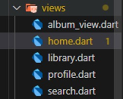
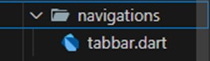
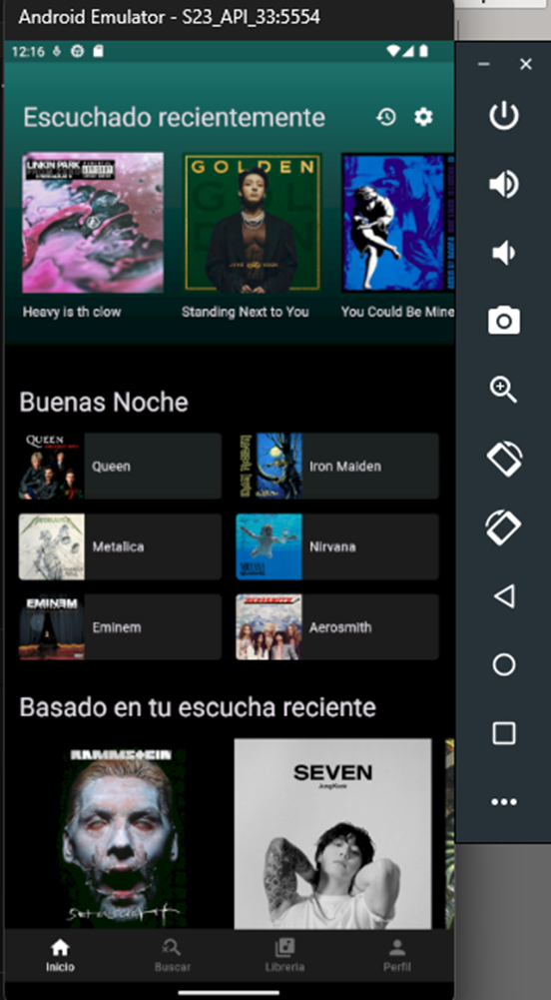
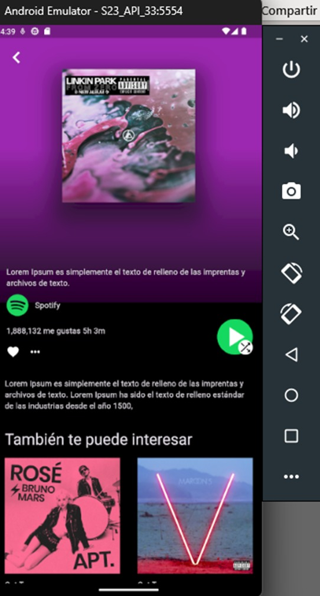

author: JoelCauich423
summary: "Clon de spotify"
id: portafoliojoel
tags: spotify, clon, flutter
categories: movil, web
environments: Web
status: Published
feedback link: https://github.com/SolaceDev/solace-dev-codelabs/blob/master/markdown/portafoliojoel

# Manual de Práctica para la Creación de la App de Clon de Spotify

## Introducción

El objetivo de esta práctica es crear un clon de app móvil que imite las funciones principales de Spotify, como el módulo de inicio que solo tengo los álbumes de las canciones con scroll, puedas dar clic a una de los álbumes y entrar a una presentación de ello. El propósito es usar Flutter para desarrollar aplicaciones móviles, ya que permite crear apps para Android e iOS con un solo código. Dart, el lenguaje de Flutter, se utilizará para programar la app.

También se aplicarán buenas prácticas como el uso de GitHub para controlar el código, lo que facilita la organización del proyecto. Esta práctica me ayudará a mejorar mis habilidades en el desarrollo de apps móviles.

### Conceptos previos:

- **Resolución de Problemas e Investigación:** Saber buscar información en internet es esencial. Incluso los desarrolladores más experimentados usan herramientas como Google para resolver problemas.
- **Fundamentos de Programación:** Conocer los conceptos básicos como estructuras de control, variables, funciones y tipos de datos es esencial para escribir código eficiente.
- **Aprendizaje de Dart:** Dart es el lenguaje de programación usado con Flutter. Es necesario entender su sintaxis y cómo funcionan las clases y funciones.
- **Diseño de Interfaz de Usuario (UI/UX):** Crear interfaces atractivas y fáciles de usar es clave. Se debe organizar bien la pantalla y facilitar la navegación.
- **Control de Versiones con Git:** Git y GitHub son fundamentales para gestionar el código y colaborar con otros desarrolladores.
- **Widgets en Flutter:** Los widgets son componentes esenciales de Flutter. Es necesario entender cómo usarlos para crear interfaces interactivas, como listas de canciones o botones de reproducción.
- **Instalación y Configuración de Flutter:** Instalar y configurar el entorno de Flutter es el primer paso para comenzar a desarrollar en esta plataforma.
- **Conceptos de Programación Orientada a Objetos (POO):** Aunque no es obligatorio al principio, entender los principios de la POO (como clases y objetos) ayuda a organizar mejor el código.
- **Práctica y Proyectos Pequeños:** Antes de desarrollar un clon de Spotify, es útil practicar con proyectos pequeños, como una lista de reproducción o una app de música simple.

---

## Requisitos Previos

- Conocimientos de Flutter y Dart: Uso de widgets, estructuras de control, funciones y clases.
- Instalación de Flutter SDK y Android Studio: El entorno de desarrollo debe estar correctamente configurado.
- Acceso a un video tutorial de YouTube: Para poder realizar la app.

---

## Objetivo

### Spotify clone app ui in flutter | Build from scratch | Flutter UI Challenge

Crear una aplicación móvil que funcione como clon de Spotify, utilizando Flutter y Dart en Android Studio. La práctica permite familiarizarse con la creación de interfaces de usuario dinámicas en Flutter.

---

## Herramientas

- **Flutter y Dart:** Para la programación y desarrollo de la interfaz.
- **Visual Studio Code:** Para crear el código.
- **Android Studio:** Para emulación y pruebas.
- **SmartPhone:** Para correr la aplicación.
- **GitHub:** Para control de versiones y colaboración.

---

## Metodología

1. Instalación y configuración de Flutter en Visual Studio.
2. Creación de un proyecto básico en Flutter y luego subirlo a GitHub.
3. Diseño de la interfaz de usuario (pantalla de inicio, álbum, buscar, librería y perfil).
4. Programación de la lógica para el scroll, tap y visualización del álbum con listas.
5. Pruebas de funcionamiento de la app.
6. Emularlo en un smartphone.

---

## Desarrollo de la práctica

1. Crear un repositorio en GitHub.
2. Crear un proyecto básico de Flutter en Visual Studio y subirlo a GitHub.
3. Crear una carpeta `views` que contenga los archivos `.dart` de `home`, `library`, `profile` y `search`.

4. Crear una carpeta llamada `navigation` que contenga el archivo `.dart` de `tabbar`.

5. luego en archivo tabbar, se le creara una clase que nos ayudara a concertar los demás módulos de inicio, búsqueda, librería y perfil. Luego en el archivo main importo las bibliotecas necesarias. material.dart trae los componentes básicos de Flutter, y tabbar.dart es un a  rchivo que creé para la barra de navegación de la app.

```dart
import 'package:flutter/material.dart';
import 'package:spotify_clone/navigations/tabbar.dart';

```
6. Defino la función main y llamo a runApp para iniciar la app con el widget principal, MyApp.

```dart
void main() {
  runApp(MyApp());
}
```
7. Creo la clase MyApp como un StatefulWidget para que la interfaz pueda actualizarse cuando haya cambios. Luego, creo el estado asociado _MyAppState.

```dart
class MyApp extends StatefulWidget {
  @override
  _MyAppState createState() => _MyAppState();
}
```

8. En _MyAppState, creo el método build, que define cómo se construye la interfaz principal usando MaterialApp.

```dart
class _MyAppState extends State<MyApp> {
  @override
  Widget build(BuildContext context) {
    return MaterialApp(

```

9. Quito el banner de "debug" de la esquina superior derecha al ponerlo en false.

```dart
debugShowCheckedModeBanner: false,
```

10. Configuro la app en modo oscuro con un fondo negro y ajusto el brillo en oscuro.

```dart
themeMode: ThemeMode.dark,
      darkTheme: ThemeData(
        scaffoldBackgroundColor: Colors.black,
        brightness: Brightness.dark,
```

11. Personalizo la barra de navegación inferior, dándole un fondo oscuro y colores para los ítems seleccionados y no seleccionados.

```dart
  bottomNavigationBarTheme: const BottomNavigationBarThemeData(
          backgroundColor: Colors.white10,
          selectedLabelStyle: TextStyle(fontSize: 12),
          unselectedLabelStyle: TextStyle(fontSize: 12),
          selectedItemColor: Colors.white,
          unselectedItemColor: Colors.white38,
          type: BottomNavigationBarType.fixed,
        ),
      ),
```
12. Establezco la pantalla principal (home) como el widget Tabbar, que es la barra de pestañas de navegación en la app.

```dart
      home: const Tabbar(),
    );
  }
}
```

13. Ahora en el archivo tabbar importo las librerías básicas de Flutter y también los archivos que contienen las vistas (páginas) de la aplicación: home.dart, library.dart, profile.dart, y search.dart.

```dart
import 'package:flutter/material.dart';
import 'package:spotify_clone/views/home.dart';
import 'package:spotify_clone/views/library.dart';
import 'package:spotify_clone/views/profile.dart';
import 'package:spotify_clone/views/search.dart';
```

14. Creo el widget Tabbar, que es la barra de navegación inferior de la app. Lo hago StatefulWidget para que el estado de la pestaña seleccionada pueda cambiar.

```dart
class Tabbar extends StatefulWidget {
  const Tabbar({super.key});

  @override
  State<Tabbar> createState() => _TabbarState();
}
```

15. Declaro _selectedTab, una variable entera que guarda el índice de la pestaña seleccionada; empiezo con la pestaña en la posición 0.

```dart
class _TabbarState extends State<Tabbar> {
  int _selectedTab = 0;
```
16. Defino el método build, que construye la interfaz de Tabbar, usando Scaffold para la estructura básica de la pantalla.

```dart
@override
  Widget build(BuildContext context) {
    return Scaffold(
```

17. Creo BottomNavigationBar, la barra de navegación inferior. La propiedad currentIndex es el índice de la pestaña activa, y con onTap actualizo _selectedTab cada vez que toco una pestaña.

```dart
bottomNavigationBar: BottomNavigationBar(
        currentIndex: _selectedTab,
        onTap: (index) {
          setState(() {
            this._selectedTab = index;
          });
        },
```

18. Defino los BottomNavigationBarItem que representan las opciones de navegación: "Inicio", "Buscar", "Libreria", y "Perfil", cada una con su icono correspondiente.

```dart
        items: [
          BottomNavigationBarItem(
            icon: Icon(Icons.home),
            label: "Inicio",
          ),
          BottomNavigationBarItem(
            icon: Icon(Icons.search_off_outlined),
            label: "Buscar",
          ),
          BottomNavigationBarItem(
            icon: Icon(Icons.library_music),
            label: "Libreria",
          ),
          BottomNavigationBarItem(
            icon: Icon(Icons.person),
            label: "Perfil",
          ),
        ],
      ),
```

19. Uso un Stack en el cuerpo de la pantalla para superponer las vistas. renderView carga la vista correcta según la pestaña seleccionada: HomeView, SearchView, LibraryView, y ProfileView.

```dart
body: Stack(
        children: [
          renderView(0, HomeView()),
          renderView(1, SearchView()),
          renderView(2, LibraryView()),
          renderView(3, ProfileView()),
        ],
      ),
```

20. Defino renderView, una función que muestra solo la vista activa. IgnorePointer evita que interactúe con las vistas no seleccionadas, y Opacity ajusta la visibilidad de la vista en función de la pestaña activa.

```dart
  Widget renderView(int tabIndex, Widget views) {
    return IgnorePointer(
      ignoring: _selectedTab != tabIndex,
      child: Opacity(
        opacity: _selectedTab == tabIndex ? 1 : 0,
        child: views,
      ),
    );
  }
}
```

21. Luego descargo las imágenes de los álbumes que se van a usar en la app después creo una carpeta assets, luego se configura en la carpeta Windows, en el pubspec.yaml y agreo:

```dart
Assets: 
   - assets/ 
```

22. Ahora para los demás archivos (library, search y profile) importo material.dart para usar los widgets básicos de Flutter.

```dart
import 'package:flutter/material.dart';
```

23. Creo el widget LibraryView como un StatefulWidget para la vista de la librería en la app. Al ser Stateful, puede actualizarse dinámicamente si es necesario. Luego, creo el estado _LibraryViewState para manejar los cambios.

```dart
class LibraryView extends StatefulWidget {
  const LibraryView({super.key});

  @override
  State<LibraryView> createState() => _LibraryViewState();
}
```

24. Defino _LibraryViewState, donde construyo la interfaz de la vista de librería usando Scaffold como estructura principal de la pantalla.

```dart
class _LibraryViewState extends State<LibraryView> {
  @override
  Widget build(BuildContext context) {
    return Scaffold(
```

25. En body, uso un Center para centrar el contenido. Dentro de Center, coloco un Text que simplemente dice "Library Works" para mostrar que la vista está funcionando.

```dart
      body: Center(
        child: Text("Library Works"),
      ),
    );
  }
}
```

26. Ahora en el archivo home primero, importo material.dart para usar los widgets básicos de Flutter, junto con algunas vistas y widgets personalizados como AlbumCard y SongCard.

```dart
AlbumCard y SongCard.
import 'package:flutter/material.dart';
import 'package:spotify_clone/views/album_view.dart';
import 'package:spotify_clone/widgets/song_card.dart';
import '../widgets/album_card.dart';
```
27. Defino HomeView como un StatefulWidget para que pueda actualizarse si es necesario. El estado _HomeViewState se encargará de manejar los cambios en la interfaz.

```dart
class HomeView extends StatefulWidget {
  const HomeView({super.key});

  @override
  State<HomeView> createState() => _HomeViewState();
}
```

28. En _HomeViewState, uso un Scaffold para construir la interfaz y un Stack para superponer los widgets, donde el primer widget es un Container de fondo.

```dart
class _HomeViewState extends State<HomeView> {
  @override
  Widget build(BuildContext context) {
    return Scaffold(
      body: Stack(
        alignment: Alignment.topLeft,
        children: [
```

29. Este Container crea un fondo en la parte superior de la pantalla, ocupando el 60% de la altura, y le asigno un color específico.

```dart
        Container(
          width: MediaQuery.of(context).size.width,
          height: MediaQuery.of(context).size.height * .6,
          decoration: BoxDecoration(
            color: Color(0xFf1C7A74),
          ),
        ),
```

30. Dentro del SingleChildScrollView, agrego un Container que tiene un fondo degradado para crear una transición entre el color de fondo y el contenido principal de la pantalla.

```dart
        SingleChildScrollView(
          physics: BouncingScrollPhysics(),
          child: Container(
            decoration: BoxDecoration(
              gradient: LinearGradient(
                begin: Alignment.topCenter,
                end: Alignment.bottomCenter,
                colors: [
                  Colors.black.withOpacity(0),
                  Colors.black.withOpacity(0.9),
                  Colors.black.withOpacity(1),
                  Colors.black.withOpacity(1),
                  Colors.black.withOpacity(1),
                ],
              )
            ),
```

31. Agrego un título "Escuchado recientemente" con un Text, y a la derecha coloco dos íconos para el historial y la configuración, organizados en una fila.

```dart
child: SafeArea(
              child: Column(
                crossAxisAlignment: CrossAxisAlignment.start,
                mainAxisAlignment: MainAxisAlignment.start,
                children: [
                  SizedBox(height: 40),
                  Padding(
                    padding: const EdgeInsets.symmetric(horizontal: 20),
                    child: Row(
                      mainAxisAlignment: MainAxisAlignment.spaceBetween,
                      children: [
                        Text("Escuchado recientemente",
                        style: Theme.of(context).textTheme.headlineMedium,
                        ),
                        Row(
                          children: [
                            Icon(Icons.history),
                            SizedBox(width: 16),
                            Icon(Icons.settings),
                          ],
                        )
                      ],
                    ),
                  ),
```

32. Creo un carrusel horizontal con álbumes usando AlbumCard y SingleChildScrollView. Cada álbum tiene una imagen y un nombre, y dejo espacio entre cada tarjeta.

```dart
SingleChildScrollView(
                    scrollDirection: Axis.horizontal,
                    physics: BouncingScrollPhysics(),
                    padding: EdgeInsets.all(20),
                    child: Row(
                      children: [
                        AlbumCard(
                          label: "Heavy is the Clown",
                          image: AssetImage("assets/album_1.jpg"), 
                          onTap: () {},
                        ),
                        SizedBox(width: 20),
                        AlbumCard(
                          label: "Standing Next to You",
                          image: AssetImage("assets/album_2.jpg"), 
                          onTap: () {},
                        ),
                        // Más `AlbumCard` aquí... ahorre espacio profe jajaja
                      ],
                    ),
                  ),
```

33. Agrego otra sección con un saludo ("Buenas Noches") y algunos artistas destacados, organizados en filas usando RowAlbumCard.

```dart
Padding(
                    padding: const EdgeInsets.all(16.0),
                    child: Column(
                      crossAxisAlignment: CrossAxisAlignment.stretch,
                      children: [
                        Text("Buenas Noches",
                          style: Theme.of(context).textTheme.headlineMedium,
                        ),
                        SizedBox(height: 16),
                        Row(
                          children: [
                            RowAlbumCard(
                              label: "Queen",
                              image: AssetImage("assets/album_6.jpg"),
                            ),
                            SizedBox(width: 16),
                            RowAlbumCard(
                              label: "Iron Maiden",
                              image: AssetImage("assets/album_7.jpg"),
                            ),
                          ],
                        ),
                        // Más `RowAlbumCard` aquí... ahorre más espacio profe jaja
                      ],
                    ),
                  ),
```

34. En esta sección, muestro sugerencias basadas en la música reciente del usuario ósea las mias, usando SongCard para mostrar cada álbum en un carrusel horizontal.

```dart
                  Column(
                    crossAxisAlignment: CrossAxisAlignment.start,
                    children: [
                      Padding(
                        padding: const EdgeInsets.all(16.0),
                        child: Text("Basado en tu escucha reciente",
                          style: Theme.of(context).textTheme.headlineMedium,
                        ),
                      ),
                      SingleChildScrollView(
                        scrollDirection: Axis.horizontal,
                        physics: BouncingScrollPhysics(),
                        padding: EdgeInsets.symmetric(horizontal: 20),
                        child: Row(children: [
                          SongCard(image: AssetImage("assets/album_12.jpg"),),
                          SizedBox(width: 16),
                          SongCard(image: AssetImage("assets/album_15.jpg"),),
                          // Más `SongCard` aquí...
                        ],),
                      )
                    ],
                  ),
```

35. La última sección muestra estaciones recomendadas usando SongCard, similar a la anterior, pero con diferente contenido.

```dart
Column(
                    crossAxisAlignment: CrossAxisAlignment.start,
                    children: [
                      Padding(
                        padding: const EdgeInsets.all(16.0),
                        child: Text("Estaciones recomendadas",
                          style: Theme.of(context).textTheme.headlineMedium,
                        ),
                      ),
                      SingleChildScrollView(
                        scrollDirection: Axis.horizontal,
                        physics: BouncingScrollPhysics(),
                        padding: EdgeInsets.symmetric(horizontal: 20),
                        child: Row(children: [
                          SongCard(image: AssetImage("assets/album_18.jpg"),),
                          SizedBox(width: 16),
                          SongCard(image: AssetImage("assets/album_19.jpg"),),
                          // Más `SongCard` aquí... ahorre espacio profe jajaja
                        ],),
                      )
                    ],
                  ),
                ],
              ),
            ),
          ),
        ),
      ],
    ),
  );
}
```

36. Finalmente, RowAlbumCard define el diseño de cada tarjeta en la fila de artistas, con una imagen y un texto del nombre del artista, en un Container con un color de fondo y bordes redondeados.

```dart
class RowAlbumCard extends StatelessWidget {
  final AssetImage image;
  final String label;
  const RowAlbumCard({
    super.key, required this.image, required this.label,
  });

  @override
  Widget build(BuildContext context) {
    return Expanded(
      flex: 1,
      child: Container(
        decoration: BoxDecoration(
          color: Colors.white10,
          borderRadius: BorderRadius.circular(4),
        ),
        clipBehavior: Clip.antiAlias,
        child: Row(
          children: [
            Image(
              image: image, 
              width: 70,
              fit: BoxFit.cover,
            ),
            SizedBox(width: 8),
            Text(label)
          ],
        ),
      ),
    );
  }
}
```

37. Ahora para el archivo álbum_card.dar  y se cree antes el archivo dentro de view. Primero, importo material.dart para acceder a widgets básicos y componentes visuales, junto con la vista AlbumView, que se abrirá al tocar la tarjeta.

```dart
import 'package:flutter/material.dart';
import 'package:flutter/widgets.dart';
import 'package:spotify_clone/views/album_view.dart';
```

38. AlbumCard es un StatelessWidget, lo que significa que no cambia de estado. Tiene cuatro propiedades:

- image: un ImageProvider para mostrar la imagen del álbum.
- label: el título o nombre del álbum o artista.
- onTap: el callback que se ejecuta cuando se toca la tarjeta.
 -size: el tamaño de la imagen de la tarjeta (por defecto 150).

```dart
class AlbumCard extends StatelessWidget {
  final ImageProvider image;
  final String label;
  final GestureTapCallback onTap; // Cambiado de Function a GestureTapCallback
  final double size
```

39. Defino el constructor AlbumCard, que permite configurar la imagen, el título, el evento onTap, y el tamaño opcional.

```dart
const AlbumCard({
    super.key,
    required this.image,
    required this.label,
    required this.onTap,
    this.size = 150,
  });
```

40. Uso GestureDetector para detectar el toque en la tarjeta. Al activarse, se usa Navigator.push para abrir la vista AlbumView, pasando la imagen del álbum como parámetro para mostrarla en la nueva vista.

```dart
@override
  Widget build(BuildContext context) {
    return GestureDetector(
      onTap: () {
        Navigator.push(
          context,
          MaterialPageRoute(
            builder: (context) => AlbumView(image: image),
          ),
        );
      }, // Ahora esto funcionará correctamente
```

41. El contenido de AlbumCard se organiza en una Column que contiene:

- Image: la imagen del álbum, con dimensiones size x size y el ajuste BoxFit.cover para llenar el espacio sin deformarse.
- Un espacio de 10px (SizedBox).
- Text(label): el título del álbum o artista.


```dart
      child: Column(
        crossAxisAlignment: CrossAxisAlignment.start,
        children: [
          Image(
            image: image,
            width: size,
            height: size,
            fit: BoxFit.cover,
          ),
          const SizedBox(height: 10),
          Text(label),
        ],
      ),
    );
  }
}
```

42. Ahora creó el archivo song_card.dar, luego importo material.dart para los widgets básicos de Flutter, y la vista AlbumView, que se abrirá al tocar la tarjeta.

```dart
import 'package:flutter/material.dart';
import 'package:spotify_clone/views/album_view.dart';
```

43. SongCard es un StatelessWidget, así que no cambia de estado. Tiene una propiedad: image: de tipo AssetImage, para mostrar la imagen de la tarjeta.

```dart
class SongCard extends StatelessWidget {
  final AssetImage image;
```

44. Defino el constructor SongCard, que requiere la imagen como parámetro.

```dart
  const SongCard({
    Key? key, 
    required this.image,
  }) : super(key: key);
```

45. Uso GestureDetector para detectar el toque en la tarjeta. Cuando se toca, Navigator.push abre la vista AlbumView, pasándole la imagen como parámetro.

```dart
  @override
  Widget build(BuildContext context) {
    return GestureDetector(
      onTap: () {
        Navigator.push(
          context, 
          MaterialPageRoute(
            builder: (context) => AlbumView(image: image),
          ),
        );
      },
```

46. Dentro de un Container de 210 píxeles de ancho, organizo el contenido en una Column. El primer elemento es una Image de 210x210 píxeles para la portada de la canción o álbum.

```dart
child: Container(
        width: 210,
        child: Column(
          children: [
            Image(
              image: image,
              width: 210,
              height: 210,
            ),
```

47. Luego de la imagen, agrego un Text con nombres de artistas, usando bodySmall para el estilo de texto. Configuro que el texto tenga un ajuste automático de línea (softWrap) y que se recorte (TextOverflow.ellipsis) si supera las dos líneas (maxLines: 2).

```dart
            Text(
              "Rammstein, Mago de Oz, Jungkook, Imagine Dragons, Metro Booming, One Republic",
              style: Theme.of(context).textTheme.bodySmall,
              softWrap: true,
              overflow: TextOverflow.ellipsis,
              maxLines: 2,
            )
          ],
        ),
      ),
    );
  }
}
```

48. Luego creé el archivo álbum_ view, después importé los paquetes necesarios para el diseño de la interfaz. AlbumView es un widget StatefulWidget, lo que permite el cambio dinámico de elementos según el desplazamiento del usuario.

```dart
import 'package:flutter/gestures.dart';
import 'package:flutter/material.dart';
import 'package:spotify_clone/widgets/album_card.dart';
```

49. Primero, definí la clase AlbumView, que es un StatefulWidget porque necesito que algunos elementos cambien de estado cuando se hace scroll. La vista recibe una imagen como parámetro, que se mostrará en la parte superior.

```dart
class AlbumView extends StatefulWidget {
  final ImageProvider image;

  const AlbumView({super.key, required this.image});

  @override
  State<AlbumView> createState() => _AlbumViewState();
}
```

50. En _AlbumViewState, definí varias variables de estado para manejar el tamaño de la imagen, la altura del contenedor, la opacidad de la imagen, y si se muestra o no una barra en la parte superior (showTopBar). Estas cambian según el desplazamiento.

```dart
class _AlbumViewState extends State<AlbumView> {
  late ScrollController scrollController;
  double imageSize = 0;
  double initialSize = 240;
  double containerHeight = 500;
  double containerinitalHeight = 500;
  double imageOpacity = 1;
  bool showTopBar = false;
```
51. Inicializo el tamaño de la imagen y configuro el ScrollController. Cada vez que hay un desplazamiento, ajusto el tamaño de la imagen y la opacidad según el desplazamiento, y muestro la barra superior si el desplazamiento supera cierto valor.

```dart
  @override
  void initState() {
    imageSize = initialSize;
    scrollController = ScrollController()
      ..addListener(() {
        imageSize = initialSize - scrollController.offset;
        if (imageSize < 0) imageSize = 0;
        containerHeight = containerinitalHeight - scrollController.offset;
        if (containerHeight < 0) containerHeight = 0;
        imageOpacity = imageSize / initialSize;
        showTopBar = scrollController.offset > 224;
        setState(() {});
      });
    super.initState();
  }
```

52. En build, construí un Stack con tres partes principales:

- El contenedor de la imagen de fondo, que cambia de tamaño y opacidad.
- El contenido desplazable principal, que contiene el detalle del álbum y más tarjetas de álbumes.
- La barra superior animada que aparece al hacer scroll.


```dart
@override
  Widget build(BuildContext context) {
    final cardSize = MediaQuery.of(context).size.width / 2 - 32;
    return Scaffold(
      body: Stack(
        children: [
          // Imagen y sombra de fondo
          Container(
            height: containerHeight,
            width: MediaQuery.of(context).size.width,
            alignment: Alignment.center,
            color: Colors.purple,
            child: Opacity(
              opacity: imageOpacity.clamp(0, 1.0),
              child: Container(
                decoration: BoxDecoration(boxShadow: [
                  BoxShadow(
                    color: Colors.black.withOpacity(.5),
                    offset: Offset(0, 20),
                    blurRadius: 32,
                    spreadRadius: 16,
                  ),
                ]),
                child: Image(
                  image: widget.image,
                  width: imageSize,
                  height: imageSize,
                  fit: BoxFit.cover,
                ),
              ),
            ),
          ),
```

53. Añadí un SingleChildScrollView para los detalles del álbum y otras tarjetas de álbumes similares. El texto y las tarjetas (AlbumCard) están alineados y distribuidos dentro de Padding y Column.

```dart
SafeArea(
            child: SingleChildScrollView(
              controller: scrollController,
              physics: BouncingScrollPhysics(),
              child: Column(
                children: [
                  Container(
                    width: MediaQuery.of(context).size.width,
                    decoration: BoxDecoration(
                      gradient: LinearGradient(
                        begin: Alignment.topCenter,
                        end: Alignment.bottomCenter,
                        colors: [
                          Colors.black.withOpacity(0),
                          Colors.black.withOpacity(.59),
                          Colors.black.withOpacity(1),
                        ],
                      ),
                    ),
                    child: Padding(
                      padding: const EdgeInsets.only(top: 20),
                      child: Column(
                        children: [
                          SizedBox(height: initialSize + 132),
                          Padding(
                            padding: const EdgeInsets.all(19.0),
                            child: Column(
                              crossAxisAlignment: CrossAxisAlignment.start,
                              children: [
                                Text("Descripción del álbum",
                                    style: Theme.of(context).textTheme.bodyMedium),
                                Row(
                                  children: [
                                    Image.asset("assets/LogoSpotify.png", width: 40, height: 40),
                                    SizedBox(width: 8),
                                    Text("Spotify")
                                  ],
                                ),
                                SizedBox(height: 16),
                                Text("1,888,132 me gustas 5h 3m",
                                    style: Theme.of(context).textTheme.bodyMedium),
                              ],
                            ),
                          ),
                        ],
                      ),
                    ),
                  ),
                  Container(
                    padding: EdgeInsets.all(16),
                    color: Colors.black,
                    child: Column(
                      crossAxisAlignment: CrossAxisAlignment.start,
                      children: [
                        Text("Descripción detallada del álbum..."),
                        SizedBox(height: 32),
                        Text("También te puede interesar",
                            style: Theme.of(context).textTheme.headlineMedium),
                        // Tarjetas de álbum
                        ...List.generate(3, (index) => 
                          Padding(
                            padding: const EdgeInsets.symmetric(vertical: 16),
                            child: Row(
                              mainAxisAlignment: MainAxisAlignment.spaceBetween,
                              children: [
                                AlbumCard(
                                  size: cardSize,
                                  label: "Álbum ${index + 1}",
                                  image: AssetImage("assets/album_${24 + index}.jpg"),
                                  onTap: () {},
                                ),
                                AlbumCard(
                                  size: cardSize,
                                  label: "Álbum ${index + 2}",
                                  image: AssetImage("assets/album_${25 + index}.jpg"),
                                  onTap: () {},
                                ),
                              ],
                            ),
                          ),
                        )
                      ],
                    ),
                  ),
                ],
              ),
            ),
          ),
```

54. Finalmente, incluí una AppBar que se muestra al hacer scroll y contiene el nombre del álbum, además de un botón de retroceso y otros iconos.

```dart
Positioned(
            child: AnimatedContainer(
              duration: Duration(milliseconds: 250),
              color: showTopBar ? Color(0xFF9b27af).withOpacity(1) : Colors.transparent,
              padding: EdgeInsets.symmetric(horizontal: 16, vertical: 10),
              child: SafeArea(
                child: Stack(
                  alignment: Alignment.center,
                  children: [
                    Positioned(
                      left: 0,
                      child: GestureDetector(
                        onTap: () {
                          Navigator.pop(context);
                        },
                        child: Icon(Icons.keyboard_arrow_left, size: 42),
                      ),
                    ),
                    AnimatedOpacity(
                      duration: Duration(milliseconds: 250),
                      opacity: showTopBar ? 1 : 0,
                      child: Text("Rosé & Bruno Mars",
                          style: Theme.of(context).textTheme.headlineSmall),
                    ),
                    Positioned(
                      right: 0,
                      child: Stack(
                        alignment: Alignment.bottomRight,
                        children: [
                          Container(
                            width: 64,
                            height: 64,
                            decoration: BoxDecoration(
                              shape: BoxShape.circle,
                              color: Color(0xff14D860),
                            ),
                            child: Icon(Icons.play_arrow, size: 60),
                          ),
                          Container(
                            width: 26,
                            height: 26,
                            decoration: BoxDecoration(
                              shape: BoxShape.circle,
                              color: Colors.white,
                            ),
                            child: Icon(Icons.shuffle, color: Colors.black, size: 26),
                          ),
                        ],
                      ),
                    ),
                  ],
                ),
              ),
            ),
          ),
        ],
      ),
    );
  }
}
```


## Conclusión

Este proyecto fue una buena práctica para aplicar animaciones y estructurar una app con una experiencia de usuario fluida. Logré una interfaz atractiva que, aunque básica, tiene una estructura que podría expandirse con más funciones, como playlists o recomendaciones personalizadas.

---

## Referencias

[1] "Create a grid list," Flutter.dev, 2024. https://docs.flutter.dev/cookbook/lists/grid-lists  (accessed Nov. 12, 2024).

[2] FlutterFlow, "FlutterFlow - Visual Development Platform," flutterflow.io, 2024. [Online]. Available: https://flutterflow.io/

[3] Flutter Community, "Flutter Gems - UI Packages and Widget Library," fluttergems.dev, 2024. [Online]. Available: https://fluttergems.dev/widget-library-ui-framework/ 

[4] Flutter Community, "Flutter Library - Free Flutter Templates and Components," flutterlibrary.com, 2024. [Online]. Available: https://flutterlibrary.com/ 

[5] Flutter Team, "flutter/flutter: Flutter makes it easy and fast to build beautiful apps for mobile and beyond," GitHub, 2024. [Online]. Available: https://github.com/flutter/flutter 

[6] Google Developers, "Flutter - Beautiful native apps in record time," flutter.dev, 2024. [Online]. Available: https://www.flutter.dev 

[7] Google Developers, "pub.dev - The official package repository for Dart and Flutter apps," pub.dev, 2024. [Online]. Available: https://pub.dev/ 

[8] Google Fonts, "Google Fonts Icons," fonts.google.com, 2024. [Online]. Available: https://fonts.google.com/icons 

[9] Icons8, "Icons8 - Iconos, ilustraciones, fotos, música y herramientas de diseño," iconos8.es, 2024. [Online]. Available: https://iconos8.es/ 

[10] in, "Spotify clone app ui in flutter | Build from scratch | Flutter UI Challenge," YouTube, May 09, 2021. https://www.youtube.com/watch?v=Bd0RkYBQxGo  (accessed Nov. 12, 2024).

[11] in, "What's the logic of clamp function in dart?," Stack Overflow, Jul. 10, 2019. https://stackoverflow.com/questions/56970838/whats-the-logic-of-clamp-function-in-dart  (accessed Nov. 12, 2024).

[12] "Lorem Ipsum - All the facts - Lipsum generator," Lipsum.com, 2024. https://es.lipsum.com/  (accessed Nov. 12, 2024).

[13] "Navigate to a new screen and back," Flutter.dev, 2024. https://docs.flutter.dev/cookbook/navigation/navigation-basics  (accessed Nov. 12, 2024).

[14] Rive Team, "Rive - Create and ship interactive animations," rive.app, 2024. [Online]. Available: https://rive.app/ 

[15] Freepik Company, "Flaticon - The largest database of free icons," flaticon.es, 2024. [Online]. Available: https://www.flaticon.es/ 

---

## Anexos

- [GitHub: Repositorio del proyecto](https://github.com/JoelCauich423/spotify_clone.git)
- [YouTube: Video tutorial](https://youtu.be/9cx1S--HTpg)
-  