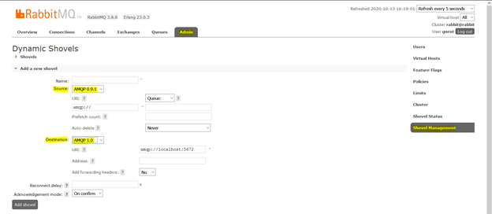
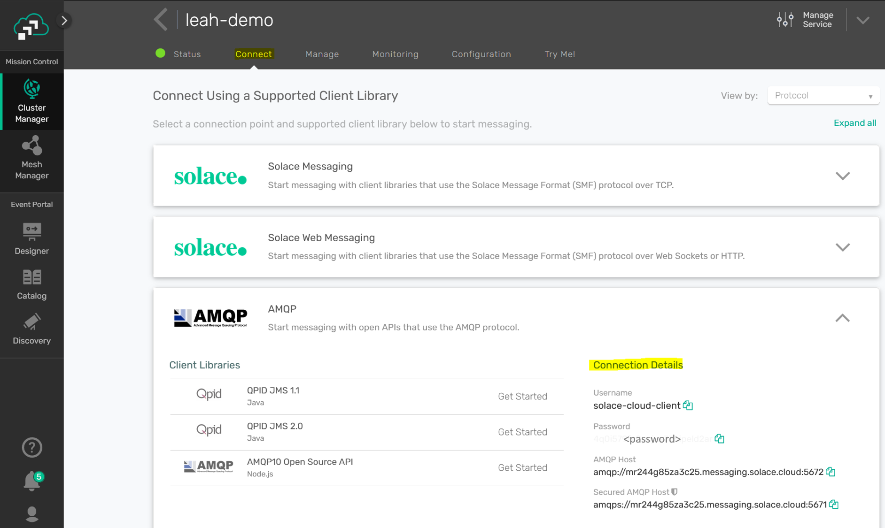

author: Leah Robert
summary: Bridge data from RabbitMQ to Solace PubSub+ with the RabbitMQ Shovel plugin
id: solace-rabbit-shovel
tags: iguide, amqp, rabbit
categories: Solace,RabbitMQ,AMQP
environments: Web
status: Published
feedback link: https://github.com/SolaceDev/solace-dev-codelabs/blob/master/markdown/rabbitmq-shovel-to-solace
analytics account: UA-3921398-10

#Bridge data from RabbitMQ to Solace PubSub+

## Welcome!

Duration: 0:01:00

Extending RabbitMQ with an Event Mesh provides you with the ability to dynamically route data to applications hosted in cloud or other locations and consume that data in a variety of different protocols and languages. This codelab will act as a guide to configuring the AMQP connection between RabbitMQ and Solace PubSub+.

While AMQP 0-9-1 and AMQP 1.0 are similar in name, they are different implementations of the protocol. 

RabbitMQ has a plugin, called a Shovel, to enable the movement of data from a source to a destination, using either AMQP 0-9-1, AMQP 1.0 or a mixture of both. The Shovel will do any necessary translations when moving from one version to another.
 


By the end of the codelab, you will have a Rabbit Shovel moving data from a RabbitMQ queue to a Solace PubSub+ queue.

---

## Environment Setup

Duration: 0:15:00

### Solace PubSub+ Cloud Messaging Service

**(1) Sign up for a free Solace Cloud account**

Navigate to [this link](https://console.solace.cloud/login/new-account) and fill out the required information. No credit card required! If you already have an account, skip right to #2.


**(2) Create a messaging service**

After you create your Solace Cloud account and sign in to the Solace Cloud Console, you'll be routed to the Welcome page.


Click on 'Cluster Manager' and all the messaging services associated with your account will show up if you have any already created. To create a new service, click either button as depicted in the image below:


Fill out all the details for your messaging service. For the Advanced Options, enable the AMQP plaintext port.


Click "Start Service" at the bottom of the page. Your service should be ready to use in a couple seconds!

### RabbitMQ

Once we have our Solace messaging service started, we can start a RabbitMQ docker instance:
```
docker pull rabbitmq
docker run -d --hostname rabbit -p 5672:5672 -p 25672:25672 -p 15672:15672 --name rabbit rabbitmq
```

The following RabbitMQ plugins must be installed and enabled – they all come prepackaged with the latest version of the RabbitMQ docker image. To enable, we can use the RabbitMQ CLI:
```
docker exec -it rabbit /bin/bash
rabbitmq-plugins enable rabbitmq_management
rabbitmq-plugins enable rabbitmq_amqp1_0
rabbitmq-plugins enable rabbitmq_shovel
rabbitmq-plugins enable rabbitmq_shovel_management
```

To verify the change, we can check the plugins:
```
rabbitmq-plugins list
Configured: E = explicitly enabled; e = implicitly enabled
 | Status: * = running on rabbit@rabbit
 |/
[E*] rabbitmq_amqp1_0                  3.8.8
[E*] rabbitmq_management               3.8.8
[e*] rabbitmq_management_agent         3.8.8
[E*] rabbitmq_shovel                   3.8.8
[E*] rabbitmq_shovel_management        3.8.8
```

After a restart of the RabbitMQ broker, we can configure the Shovel with the Management UI by navigating to “localhost:15672” in a browser and using the management credentials to sign in (default is guest/guest).  

---

## Create the Queues

Duration: 0:05:00

Our RabbitMQ Shovel requires a queue on both brokers - in this step we will create a queue on RabbitMQ and on the Solace Messaging Service.

### RabbitMQ Queue

On the RabbitMQ Management UI, "localhost:15672", navigate to the Queue tab and create a new queue.


### Solace Queue

From the Solace Messaging Service, navigate to the Management UI using the 'Manage' tab > Queues button. This will open a new tab in your browser.


Create a new queue by clicking the +Queue button at top right. Provide your queue with a name, and click Create. 


On the queue settings page, click Apply.


---

## Create the RabbitMQ Shovel

Duration: 0:05:00

In this step, we will use the RabbitMQ Management UI to create our Shovel. This is the component that will bridge data from the RabbitMQ queue to the Solace queue.

### Create the Shovel

On the RabbitMQ Management UI, "localhost:15672", navigate to the Admin > Shovel Management page.


The first step for our Shovel is to indicate the version of AMQP at the source and destination. For this example, we will be moving AMQP 0-9-1 messages from RabbitMQ and publishing the messages to Solace with AMQP 1.0.



The URI for the local RabbitMQ instance can be left to default "amqp://". The field beside the URI indicates the RabbitMQ queue name to receive messages from.

For the Solace connection, we need to specify the host, port, and authentication. You can find these details on the Solace Messaging Service 'Connect' tab under AMQP protocol.



On the RabbitMQ Shovel page, enter the URI in the format "amqp://\<username\>:\<password\>@\<host\>:\<port\>"


Finally, add the Solace queue name in the 'Address' field for the Shovel, and click 'Add Shovel'.


### View the Shovel

On the Shovel page, go to Admin > Shovel Status. Your new Shovel should be in the table and the state should say 'running'.


---

## Test the RabbitMQ Shovel

Duration: 0:02:00

To test the RabbitMQ Shovel connection to Solace, we can simply publish a message to the RabbitMQ and see that it is received by the Solace queue.

### Send a Message

On the RabbitMQ Management UI, "localhost:15672", navigate to the Queues page. Click on the queue that is configured as the source for the Shovel to view the queue-specific page.

On the queue page, use the 'Publish message' functionality to send a message to the queue.


On the Solace Management UI Queue page, the destination queue from the bridge should show a message has been saved in the queue. Click on the queue to view this page.


---

## Takeaways

Duration: 0:01:00


Thanks for participating in this codelab! Let us know what you thought in the [Solace Community Forum](https://solace.community/)! If you found any issues along the way we'd appreciate it if you'd raise them by clicking the Report a mistake button at the bottom left of this codelab.
