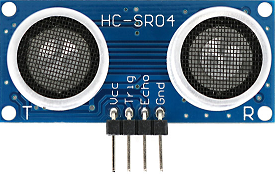
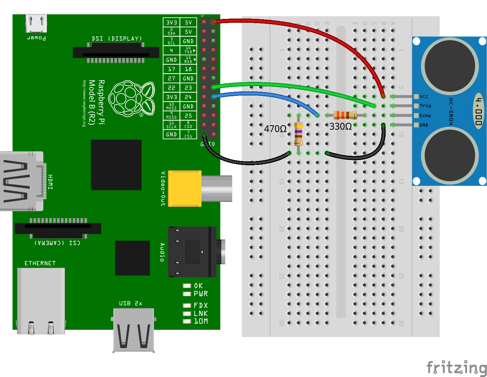
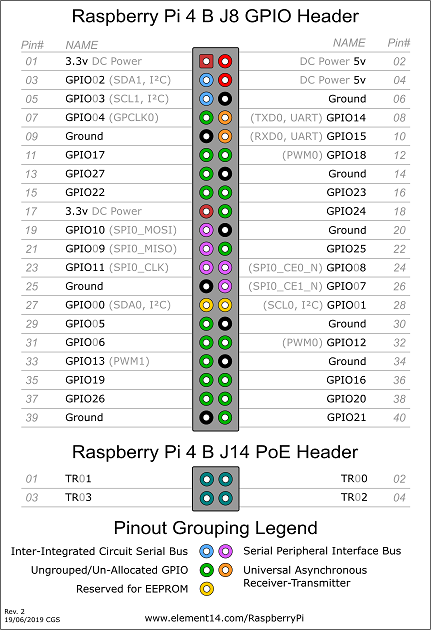
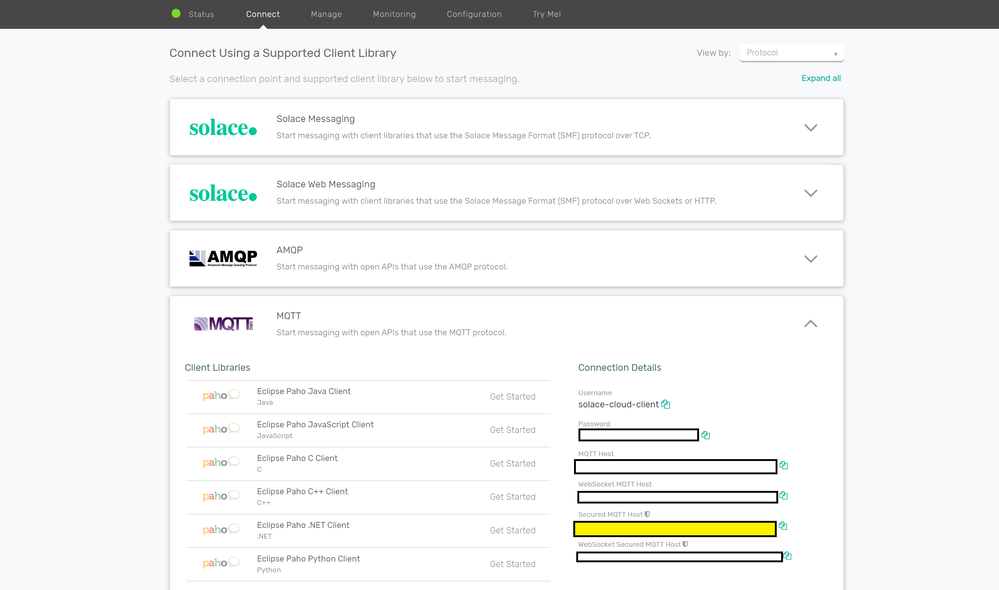

author: Thomas Kunnumpurath
summary: An intro to Raspberry-PI setup
id: raspberry-pi-proximity-sensor
tags: iot, raspberry-pi
categories: iot,raspberry-pi, javascript
environments: Web
status: Published
feedback link: https://github.com/solacese/raspberry-pi-ultrasonic-sensor-mqtt/issues
analytics account: UA-3921398-10

# Introduction to Raspberry-PI

## Welcome!
Duration: 0:05:00


In this codelab, you will learn about a Raspberry PI and how to set it up so that you can start building IoT applications on it.

### What is a Raspberry PI?

_"The Raspberry Pi is a series of small single-board computers developed in the United Kingdom by the Raspberry Pi Foundation to promote teaching of basic computer science in schools and in developing countries. The original model became far more popular than anticipated, selling outside its target market for uses such as robotics. It does not include peripherals (such as keyboards and mice) or cases. However, some accessories have been included in several official and unofficial bundles."_ - [Wikipedia](https://en.wikipedia.org/wiki/Raspberry_Pi)


What makes a RaspberryPI exciting for IoT is that it has a series of GPIO pins that can be connected to a variety of inexpensive sensors available on the market that can be used for things such as motors, temperature sensors, or proximity sensors thereby democratizing and making IoT projects accessible to the masses. Any of the GPIO pins can be accessed through software to control what is connected to it.


This codelab will run you through the process of setting up your raspberry-pi, connecting it to a proximity sensor, and publishing proximity events onto a Solace Cloud PubSub+ Broker.

## Materials required
Duration: 0:05:00


To assemble this kit, you will need the following materials. Links to appropriate websites are provided below but search your favorite online shop for better prices/deals:

### Raspberry PI and accessories

You can buy various starter kits for the raspberry pi which includes the base Raspberry PI as well as all required accesories such as display cables, but at the bear minimum you require the following ():

- [Raspberry PI Model 2,3 or 4](https://www.raspberrypi.org/products/)
- [Power Source](https://www.raspberrypi.org/products/raspberry-pi-universal-power-supply/)
- A MicroSD Card
- A USB Keyboard, USB Mouse, MiniHDMI display cable

### Sensor and Circuitry

You will need to purchase the following additional components which includes the sensor and circuitry to connect the sensor the raspberry pi.

To make this accesible, this does not require any sort of soldering. A breadboard eassentially is a solderless circuit board with labelled rows and columns allow you to connect wires/resistors/sensors by just plugging them into holes.

- [HC-SR04 Sensor](https://www.amazon.com/gp/product/B07RGB4W8V/ref=ppx_yo_dt_b_asin_title_o01_s00?ie=UTF8&psc=1&pldnSite=1)
- [400 Points Breadboard](https://www.amazon.com/gp/product/B0819VF8T3/ref=ppx_yo_dt_b_asin_title_o08_s00?ie=UTF8&psc=1&pldnSite=1)
- [Female to Male Jumper wires](https://www.amazon.com/gp/product/B077N7J6C4/ref=ppx_yo_dt_b_asin_title_o02_s00?ie=UTF8&psc=1&pldnSite=1)
- [Male to Male Jumper Wires](https://www.amazon.com/gp/product/B005TZJ0AM/ref=ppx_yo_dt_b_asin_title_o02_s00?ie=UTF8&psc=1&pldnSite=1)
- [330 Ω Resistor](https://www.amazon.com/gp/product/B07QH5PFG3/ref=ppx_yo_dt_b_asin_title_o08_s01?ie=UTF8&psc=1&pldnSite=1)
- [470 Ω Resistor](https://www.amazon.com/gp/product/B07QG1V4BH/ref=ppx_yo_dt_b_asin_title_o08_s01?ie=UTF8&psc=1&pldnSite=1)

## Setting up your Raspberry-Pi
Duration: 1:00:00


Once you have purchased the requisite kit, you will have to setup your raspberry pi with an O/S and connect it to your local WiFi.

Use the following link to setup your raspberry pi:

- [Setting up your Raspberry-PI](https://projects.raspberrypi.org/en/projects/raspberry-pi-setting-up)

Once your Raspberry PI, has been setup use the following instructions to install NodeJS which will be the primary mechanism through which you interface with the Proximity Sensor.

Type the following command into the Terminal:

```
$ curl -sL https://deb.nodesource.com/setup_12.x | sudo -E bash -
```

At the time of this writing, the latest release version of NodeJS is 12. Update the command above with the latest release of NodeJS.

After the command above is run, add type the following command:

```
$ sudo apt install -y nodejs
```

To verify installation, type the following command:

```
$ node -v
```

This should result in output with the following format:

```
$ v12.16.1
```

## Connecting the HC-SR404 Proxmity Sensor



The HC-SR404 sensor uses sonar to determine the distance to an object with the following steps:


1. A high frequency sound is emitted from the Trigger Pin
2. Once it comes in contact with the object, it is reflected back to the echo pin
3. The time it took to receive the reflected sound wave back allows us to calculate the distance to the object from the sensor

The math involved here is quite simple:

```
Distance that sound travelled = speed of sound in air (~343 m/s) * time it took to receive the echo back

Distance to the object from the sensor = 1/2 * Distance that the sound travelled
```

Now that you understand how sonar sensors work, lets wire it up to your raspberry pi.

Use the following diagram as a reference to connect your raspberry pi to the sensor:



Note the diagram above is for a Raspberry PI 2 but use the following diagram to translate the Pins to the Raspberry PI that you have purchased:




You will notice that the Breadboard has columns marked from a-f and rows marked from 1-30.


Follow the instructions below to connect the components:

1. Connect a wire from the 5V Pin on the Raspberry PI to b6 on the breadboard
2. Connect a wire from the GPIO 23 Pin on the Raspberry PI to c7 on the Breadboard
3. Connect a wire from the GPIO 24 Pin on the Raspberry PI to g8 on the Breadboard
4. Connect a 330 Ω resistor from f8 to d8 on the breadboard
5. Connect a 470 Ω resistor from i9 to i13
6. Connect a wire from GND on the Raspberry PI to j13 on the breadboard
7. Connect a wire from f13 to b9 on the breadboard
8. Finally, connect the sensor from a6 to a9 on the breadboard (ensure the sensor is facing outwards - away from the raspberry pi)

## Reading sensor events from the Raspberry PI
Duration: 0:15:00


Ok now that you have the proximity sensor hooked up to your Raspberry PI, the next step is to create a simple application to read from the sensor.

While there are a variety of libraries and languages that are available for you to interact with your GPIO pins and the connected sensors, we will be using the [Johnny-Five](http://johnny-five.io/) JavaScript Framework.

Johnny-Five is a JavaScript based Robotics and IoT Platform that works across multiple processor architectures such as Arduino, Raspberry PI, and SparkFun.

Co-incidentally it is also the name of a robot in a campy 80's movie called [Short Circuit](<https://en.wikipedia.org/wiki/Short_Circuit_(1986_film)>) which I wholly recommend against watching :)!

### Setting up the code

Clone the following repo by running the following command from your Raspberry PI terminal:

`git clone https://github.com/solacese/raspberry-pi-ultrasonic-sensor-mqtt.git`

From there, run the following command

```
cd raspberry-pi-ultrasonic-sensor-mqtt
git checkout setting-up-with-johnny-five
npm i
```

### Reading sensor events

Open src\index.js and add the following code:

```
/**
 * index.js
 *
 */

// polyfill async
import "core-js";
import "regenerator-runtime";
import { Board, Proximity } from "johnny-five";
const PiIO = require("pi-io");


async function run() {
  // initialize and connect to the Raspberry-PI
  let board = new Board({
    io: new PiIO()
  });

  let sensor = null;

  board.on("ready", () => {
    sensor = new Proximity({
      controller: PiIO.HCSR04,
      triggerPin: "GPIO23",
      echoPin: "GPIO24"
    });
  });

  sensor.on("data",(measurement)=>{
    console.log(`Sensor measurement: ${JSON.stringify(measurement)}`);
  })

}

run();

```

### Running the application

Once you've done that, you will need to type the following command to start the application and read measurement events from the sensor:

`$sudo npm run start`

You should see output similar to the following:

```
1583858715516 Available Pi-IO
1583858715614 Connected Pi-IO
1583858715619 Repl Initialized
```

Now place an object in front of the sensor and you should see a flurry of events being published to the console with the following format:

```
Distance measurement: {"cm":18.299,"centimeters":18.299,"in":7.14,"inches":7.14}
```

### Summary

You succesfully wired up the HCSR04 proximity sensor to your Raspberry PI. In addition, you used the Johnny-Five JavaScript library to read events from the proximity sensor and print them to the console.

Be sure to commit the changes you made to this branch by running `git commit -m "setting-up-with-johnny-five"`

To see the completed code for this section, sync the following branch [setting-up-with-johnny-five-solution](https://github.com/solacese/raspberry-pi-ultrasonic-sensor-mqtt/tree/setting-up-with-johnny-five-solution) using the command:

```
git checkout setting-up-with-johnny-five-solution
```

## Publishing your sensor events on Solace PubSub+
Duration: 0:15:00


Now you've succesfully extracted distance measurements from the sensor, but wouldn't it be great if you could expose the event outside your Raspberry PI in realtime. For example you could build a low cost security system that streams out events over the internet so that it could be picked up by a dashboard and a mobile app when someone comes near your PC.

To accomplish this, we will now introduce an event broker into the application stack, at a high level it will work as follows:


Before we start implementing this, lets do a brief primer on the MQTT protocol

### MQTT

_"MQTT stands for MQ Telemetry Transport. It is a publish/subscribe, extremely simple and lightweight messaging protocol, designed for constrained devices and low-bandwidth, high-latency or unreliable networks. The design principles are to minimise network bandwidth and device resource requirements whilst also attempting to ensure reliability and some degree of assurance of delivery. These principles also turn out to make the protocol ideal of the emerging “machine-to-machine” (M2M) or “Internet of Things” world of connected devices, and for mobile applications where bandwidth and battery power are at a premium."_ - [MQTT.ORG](http://www.mqtt.org)

MQTT messages are published and subscribed to over topics which are "/" delimited strings. If an application is interested in receiving these messages, they subscribe to topics which can be wildcarded as well.

For example, if you had 100 sensors scattered over various locations each publishing on a unique topic

```
SENSOR1/DISTANCE/MEASUREMENT
SENSOR2/DISTANCE/MEASUREMENT
...
SENSOR100/DISTANCE/MEASUREMENT
```

You can have microservices subscribe to individual SENSORS with explicit subscriptions or you can have a microservice consume all SENSOR measurements with the following subscription:

```
+/DISTANCE/MEASUREMENT
```

### Introducing Solace PubSub+

To parttake in the MQTT protocol, you will need an MQTT broker. Thats where Solace PubSub+ comes into play. Apart from supporting MQTT protocol, it also supports a whole host of other protocols natively so you could publish an MQTT message from your sensor and subscribe to it via JMS. The publisher of the event doesn't care who the subscribers are or what protocol they are subscribing with, Solace PubSub+ takes care of this for you.


### Sign up for a Solace PubSub+ Cloud account for FREE!

The quickest way to get started with Solace PubSub+ is to sign up for Solace PubSub+ Cloud

**(1) Sign up for a free Solace Cloud account**

Navigate to [this link](https://console.solace.cloud/login/new-account) and fill out the required information. No credit card required! If you already have an account, skip right to #2.

**(2) Create a messaging service**

After you create your Solace Cloud account and sign in to the Solace Cloud Console, you'll be routed to the event mesh page.


Click on 'Messaging Services' and all the messaging services associated with your account will show up if you have any already created. To create a new service, click either button as depicted in the image below:


Fill out all the details for your messaging service, and then click "Create" at the bottom of the page.


Your service should be ready to use in a couple seconds!!!

**(3) Take note of the MQTT connection details**

If your messaging service was created successfully, you'll be routed to the summary page of your new messaging service. From the service summary page, click on the "Connect" tab so we can take note of the connection details we'll need later.


After you click the "Connect" tab, click the "MQTT" box, and then take note of the "Connection Details" section. We'll be using the "Secured MQTT Host" URL for this excercise, the Username and Password



### Bringing it all together

Run the following command from the `raspberry-pi-ultrasonic-sensor-mqtt` directory

```
git checkout sensor-with-pubsub-plus
```

You will need to instantiate enviornment variables for that copy over a template file using the following command:

```
cp .EDIT-ME.env .env
```

Open up the .env file and add the following details from the Solace Connect MQTT details tab as described above:

```
#SOLACE SETTINGS
SOLACE_MQTT_HOST_URL=
SOLACE_USERNAME=
SOLACE_PASSWORD=
```

Note, you will also see prefilled settings for the following:

```
MQTT_CLIENT_ID=SENSOR1


#PROXIMITY SENSOR SETTINGS
MIN_RANGE_CM=10
MAX_RANGE_CM=60
```

If you have more than one sensor, modify the MQTT_CLIENT_ID accordingly.

If you noticed in the implementation in the previous section, the sensor events get triggered no matter what distance the object is at. Most likely, you want to trigger it when the object is within a specific range.

So a MIN and MAX range property (specified in centimeters) is exposed to you - and only when an object appears in that range, will an event be triggered. Feel free to modify it to suit your needs.

Once you've filled in the properties, modify `src\index.js` with the following code:

```

// polyfill async
import "core-js";
import "regenerator-runtime";
// load env variables
import dotenv from "dotenv";

let result = dotenv.config();
if (result.error) {
  throw result.error;
}
import MqttClient from "./mqtt-client";
import ProximitySensor from "./proximity-sensor";

async function run() {
  // initialize and connect mqtt client
  let mqttClientConfig = {
    hostUrl: process.env.SOLACE_MQTT_HOST_URL,
    username: process.env.SOLACE_USERNAME,
    password: process.env.SOLACE_PASSWORD,
    clientId: process.env.MQTT_CLIENT_ID
  };

  console.log("=== Starting MQTT producer ===");

  let mqttClient;

  try {
    mqttClient = MqttClient(mqttClientConfig);
    console.log("Connecting MQTT client to Solace...");
    await mqttClient.connect();
    console.log("MQTT client connected to Solace.");
  } catch (err) {
    console.error(err);
    process.exit();
  }

  let proximitySensor;

  try {
    //Connect to the Raspberry PI
    proximitySensor = new ProximitySensor();
    console.log("Connecting to board...");
    await proximitySensor.connectToBoard();
    console.log("Connected to the board!");
  } catch (err) {
    console.error(err);
    process.exit();
  }

  proximitySensor.addProximityHandler(process.env.MIN_RANGE_CM, process.env.MAX_RANGE_CM, measurement => {
    let measurementJson = JSON.stringify(measurement);
    console.log(`Distance measurement: ${measurementJson}`);
    //Publish a message on the topic ${SENSOR_ID}/DISTANCE/MEASUREMENT
    mqttClient.send(`${mqttClientConfig.clientId}/DISTANCE/MEASUREMENT`, measurementJson);
  });
}

run();

```

### Running the application

Once again, type the following command in the command prompt:

```
sudo npm run start
```

You should now see the following output in your console:

```
=== Starting MQTT producer ===
Connecting MQTT client to Solace...
MQTT client connected to Solace.
Connecting to board...
1583858715516 Available Pi-IO
1583858715614 Connected Pi-IO
1583858715619 Repl Initialized
>> Connected to the board!
Enabling range of proxmity dection to be [10,60]cms
```

Once the sensor detects an object within the specified range, you will also see the following log:

```
Distance measurement: {"cm":18.299,"centimeters":18.299,"in":7.14,"inches":7.14}
```

### Seeing the MQTT Message

As you noticed in the code above, we simplified event handling of the proximity events and sending MQTT messages using convenience functions exposed via `src/proximity-sensor.js` and `src/mqtt-client.js`. You may be wondering how to subscribe to these events from your microservice hosted in the cloud - you can use a variety of APIs/Protocols to do this which you can find from the Connect tab in your Solace Cloud Console. (Note you can filter by both Protocol and Language using the 'View by' dropdown on the top right)


In addition, you can navigate to the 'Try Me' tab and specify the topic subscription (ex.`SENSOR1/DISTANCE/MEASUREMENT`) to see the events in realtime as below:


### Summary

You succesfully 'liberated' the sensor events to be streamed over the internet. You can now build microservices off these events by connecting into the Solace PubSub+ broker.

Be sure to commit the changes made to the branch by running `git commit -m "sensor-with-pubsub-plus"`

To see the completed code for this section, sync the following branch [sensor-with-pubsub-plus-solution](https://github.com/solacese/raspberry-pi-ultrasonic-sensor-mqtt/tree/sensor-with-pubsub-plus-solution) using the command:

```
git checkout sensor-with-pubsub-plus-solution
```
