author: Andrew Roberts
summary: This codelab walks you through how to use Solace PubSub+ Event Portal to design applications, events, and schemas, export AsyncAPI specifications, generate code using AsyncAPI Generator, and see your events flow across your apps.
id: retail-dev-workshop
tags: workshop
categories: retail, spring, event portal, asyncapi
environments: Web
status: Published
feedback link: https://github.com/SolaceDev/solace-dev-codelabs/blob/master/markdown/retail-dev-workshop

# Retail Developer Workshop

## What You'll Learn

Duration: 0:05:00

Welcome to the hands-on portion of this workshop!

Now that you've learned a little bit about Solace and watched the demo video to set the stage, it's your turn to try things out for yourself. We'll jump into the goals of this portion of the workshop shortly, but first let's recap the main technologies you'll be using:

1. **Solace Cloud**: Enterprise-grade messaging as a service, on demand in your favorite public and virtual private clouds, and in your preferred on-premises and cloud Kubernetes environments. You'll log into the Solace Cloud console, start your own service, and use it to run the event streams of your applications.
2. **Solace PubSub+ Event Portal**: You'll be extending the model that you saw in the video demo. While you're not working as a team during this workshop think about how a tool like this would be useful as you collaborate with your team on a day to day basis to design, implement, and iteratively enhance applications.
3. **AsyncAPI**: AsyncAPI is an open source initiative that seeks to improve the current state of Event-Driven Architectures (EDA). The initiative's long-term goal is to make working with EDAs as easy as it is to work with REST APIs, from documentation to code generation, from discovery to event management. You'll be exporting AsyncAPI specifications from Event Portal and using the AsyncAPI Generator to kickstart application development.
4. **Spring Cloud Stream**: Spring Cloud Stream is a framework for building highly scalable event-driven microservices connected with shared messaging systems. The framework provides a flexible programming model built on already established and familiar Spring idioms and best practices. You'll generate a code skeleton for a Spring Cloud Stream application and then sprinkle in some business logic, seeing how easy it is to develop event-driven applications with modern tooling.


## Use Case Overview

Duration: 0:05:00

You are working as a technologist at Retail Co—the world's premier retailer—during an exciting time. Forward looking executives have decided to transform the overall business architecture of the company to an event based model in order to become more agile as a business, to improve SLAs, and to reduce costs. This transformation initiative was prompted by technology teams running into challenges related to data replication, data movement, and data access and security because Retail Co's core business processes consist of a complicated sprawl of distributed internal and external systems, and many of those systems have dependencies on mainframe systems.

The initial use case Retail Co's executives are targeting is their primary order process.

As the order process exists today, orders are flowing from Retail Co's customer facing web frontend to a mainframe system of record. Transforming this process will first require those orders to be captured using a change data capture (CDC) strategy and pushed into the Solace event mesh. Once the order events are flowing throughout the Solace event mesh, application teams will be able to build event-driven microservices to do things with the order events like order validation, product line specific logic, etc.

### _Architecture diagram_


### _Recap of video demo_

So far, Retail Co's stellar innovation group has already been able to:

1. **Deploy event brokers**: moving to an event based model is impossible without an intermediary system called an event broker. Event brokers are like databases in that it's best to deploy them close to where your applications are running. Retail Co's engineers have successfully deployed event brokers into all the locations where applications are running.
2. **Create an event mesh**: some event brokers require outside processes to replicate events between brokers/clusters, but Solace PubSub+ Event Brokers have built-in features that allow you to connect them to form an event mesh. An event mesh allows your applications to connect to their local event broker but send/receive events to/from applications connected to any other event broker connected to the mesh. Logically it acts as one giant event broker. Retail Co have configured the event brokers they deployed to form an event mesh.
3. **Model the initial event flows in Event Portal**: the model currently includes the CDC Order Source, Order Validation Processor, and Paper Order Consumer applications, showing events sourced from a mainframe system being validated and processed by event-driven microservices. This model was built to be extended and iterated on as more application teams transition to adopt the event based model of building applications.
4. **Event-enable mainframe order systems**: it's currently not cost effective to replace mainframe systems, so the next best thing is to extend their value by making their data readily available throughout the enterprise. In practice, this is usually accomplished using strategies like [change data capture (CDC)](https://en.wikipedia.org/wiki/Change_data_capture) or bridging (MQ, REST, etc). In the interest of not bloating this CodeLab with too many requirements, this step was mimicked with a CDC Order Source—a small Node.js application that publishes out _OrderCreated_ events.
5. **Build Order Validation Processor and Paper Order Consumer microservices**: Retail Co's stellar innovation group has built out the first event-driven microservices in the company in order to prove out a multi-step event-driven process. _Order Validation Processor_ consumes _OrderCreated_ events and publishes different flavors of _OrderValidated_ events, and the _Paper Order Consumer_ application consumes _PaperOrderValidated_ events. Next step is migrating crufty old services as well as building net new microservices to consume the event streams that the innovation group has made readily available in the event mesh.

### _What you'll be doing_

1. **Deploy an event broker**: even though event brokers are something that are usually managed by central teams and exposed to application teams, and the Retail Co's innovation group has already set up an event mesh, being the good technologist that you are you want to test things out yourself. For the purposes of this workshop, you'll be deploying a Solace PubSub+ Event Broker: Cloud developer-tier service.
2. **Extend the Event Portal model**: you'll take the initial Event Portal model that includes the CDC Order Source, Order Validation Processor, and Paper Order Consumer applications and extend it to include another consumer application—the Furniture Order Consumer. The point of this exercise is to click around and get a feel for Event Portal as well as to appreciate how it aids collaboration, discovery, and event reuse across teams.
3. **Develop the Furniture Order Consumer**: you'll export the AsyncAPI specification for the Furniture Order Consumer application you just modeled, generate a Spring Cloud Spring code skeleton from it, and then fill in some very basic business logic to see how easy it is to interact with events once they're on a Solace event mesh. Solace makes filtering events dead simple, so adding product line specific microservices like this one is as easy as subscribing to a subset of the overall orders event stream using topic filters—no provisioning/broker configuration changes required. This will show you that modern tooling makes event-driven architecture accessible to developers of all experience levels because frameworks are available that abstract away complicated messaging APIs in favor of event-handler style code execution.
4. **Run your application**: you'll run the Furniture Order Consumer you just developed and feel like an event-driven pro.

## What You'll Need

Duration: 0:05:00

This page covers the setup required for this CodeLab.

### AsyncAPI Generator

You'll need either Node.js or Docker to install/run the AsyncAPI Generator:

**Node**

- Node.js v12.16+ (Check version using `node -v`)
- npm v6.13.7+ (Check version using `npm -version`)

On Mac, you can `brew install node`.
For other systems, [Installing Node.js via package manager
](https://nodejs.org/en/download/package-manager/).

**Docker**

[Get Docker](https://docs.docker.com/get-docker/)

### Spring Cloud Stream

Spring Cloud Stream requires Java and Maven to use.

- Java 1.8+ (Check version using `java -version`)
- Maven 3.3+ (Check version using `mvn -version`)
  - On Mac you can `brew install maven`
  - Other install instructions [here](https://maven.apache.org/install.html)
- Your favorite Java IDE

### Solace Cloud

If you already have a Solace Cloud account just login, otherwise please sign-up for a free Solace Cloud Account using [this link](https://bit.ly/try-solace-free).

Positive
: **Note:** if you are participating in an instructor led workshop run by Solace, you may have been invited to join a shared Solace Cloud Organization. Check your email for the signup link so that you'll be able to collaborate with your teammates and use the shared Event Portal instance.

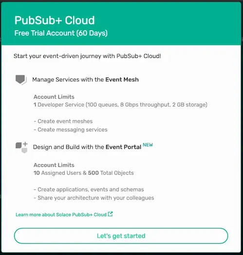

Positive
: **Note:** no credit card is required. You will receive an email to activate the account and will then be prompted to start the free trial.

## Starting a Solace Cloud Service

Duration: 0:10:00

This page covers how to start a Solace PubSub+ Event Broker: Cloud service.

### Step 1: From the Cluster Manager tab, click on the + button

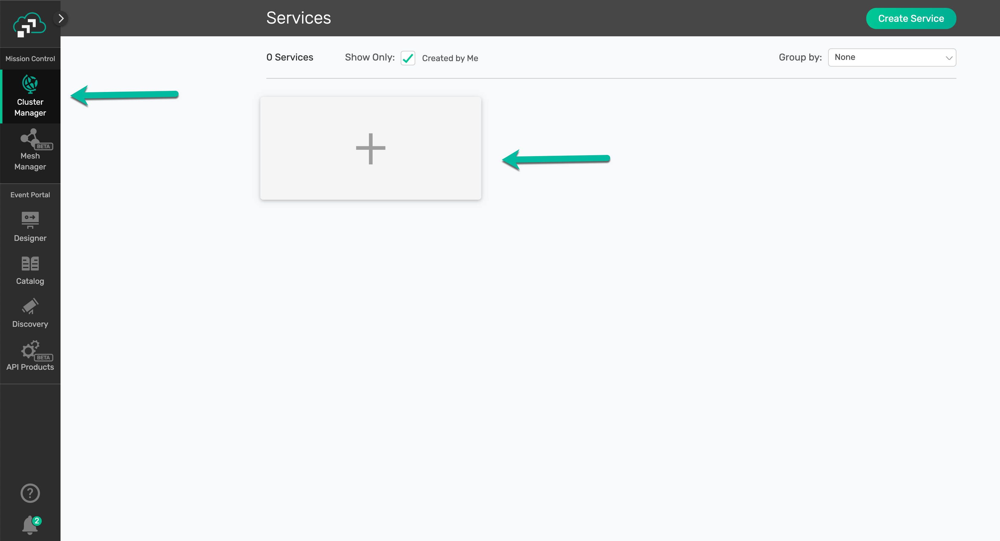

### Step 2: Fill out the required details for the service

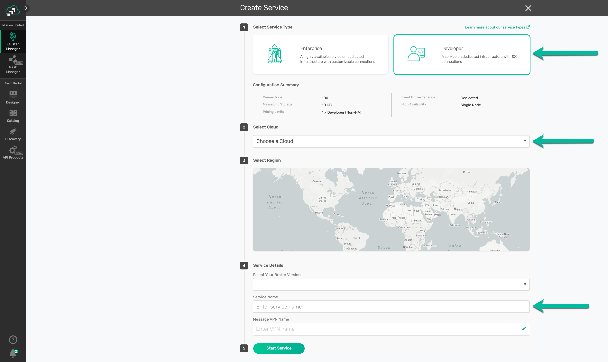

- Select Developer Service Type
- Select a public cloud to deploy the service in
- Give the event broker service a name. `<cloud provider>-<your name>` is a good naming convention, e.g. `aws-andrew-roberts`.

### Step 3: Wait for the service's underlying resources to provision

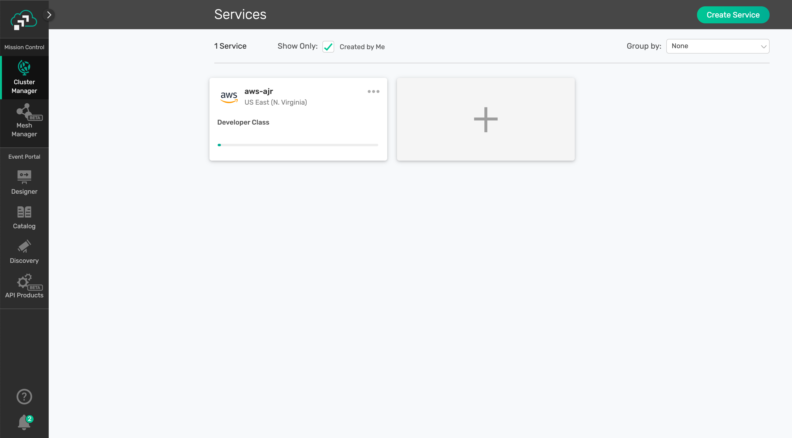

### Step 4: Explore the management console for your new event broker service

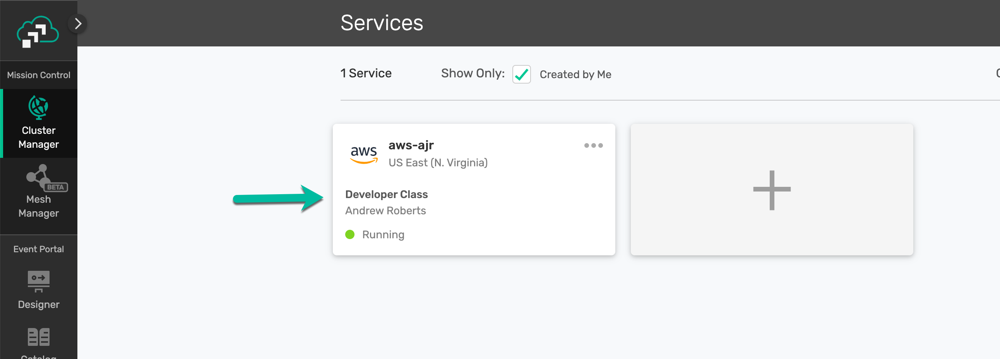

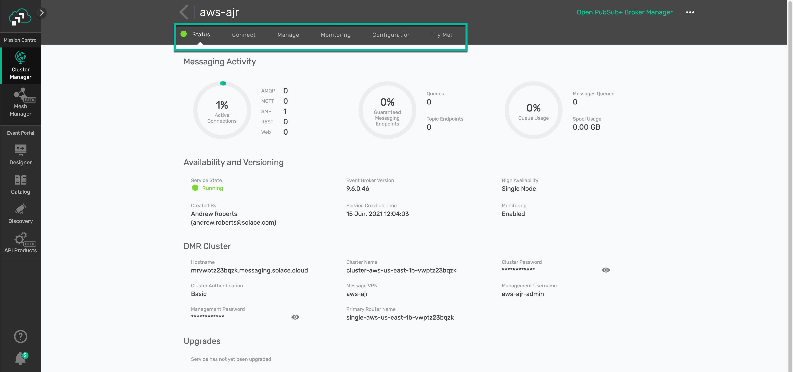

## Modeling the Furniture Order Consumer

Duration: 0:25:00

This page covers how to model the Furniture Order Consumer microservice in Event Portal.

### Step 1: Import the initial Application Domain model

As described in the Use Case Overview page, Retail Co's stellar innovation group has put together a model in Event Portal for the initial event flows that include the _CDC Order Source_, _Order Validation Processor_, and _Paper Order Consumer_ applications, showing events sourced from a mainframe system being validated and processed by event-driven microservices.

Positive
: **Note**: If you are participating in an instructor led workshop, this step should have been completed for you. Navigate to the Event Portal Designer view of the Solace Cloud Console and check to see if there's an Application Domain configured just for you (FirstName LastName). If there is, the initial model should be there waiting for you to extend.

To import the initial model, first download the Application Domain export file: [RetailCo-Template-Initial.json](https://github.com/solacese/retail-dev-workshop/blob/master/event-portal/RetailCo-Template-Initial.json)

**You can download the file via curl or by cloning the git repo**

```bash
curl -k -XGET https://github.com/solacese/retail-dev-workshop/blob/master/event-portal/RetailCo-Template-Initial.json -o RetailCo-Template-Initial.json
```

OR

```bash
git clone https://github.com/solacese/retail-dev-workshop.git
```

Inside of your logged into Solace Cloud Account navigate to the Event Portal Designer by clicking "Designer" in the menu on the left.

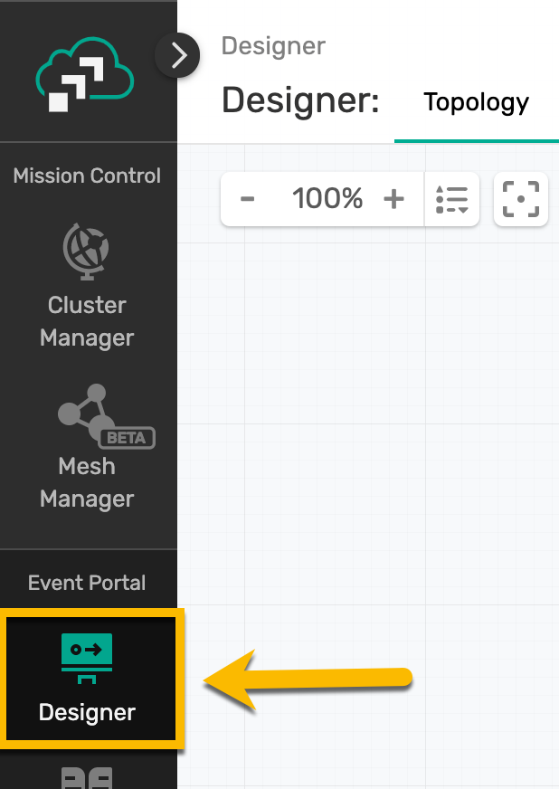

Then import the previously downloaded Application Domain file by clicking the `Import` button at the top right of the _Designer_ and importing the file.

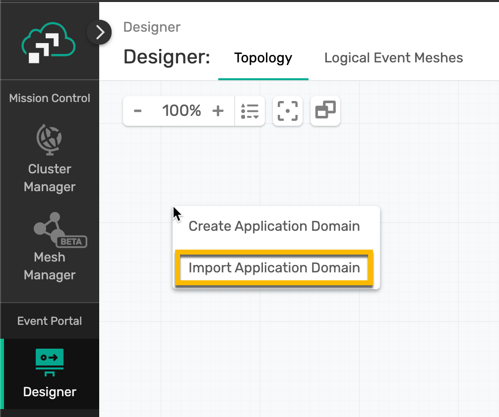

### Step 2: Extending the initial model

Now that you're familiar with the use case and you've imported the Application Domain into the Event Portal, let's put our application developer team hats on and update the model to include another application.

Open the _RetailCo-Template-Initial_ Application Domain that you previously imported in the Event Portal Designer (or your ready-to-go personal Application Domain if you're currently in an instructor led workshop, _FirstName LastName_). You should see the following model:

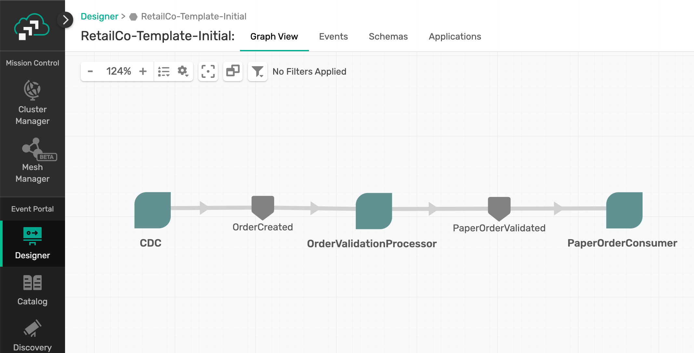

We'll be extending this initial Application Domain model by adding a _Furniture Order Consumer_ Application. Similar to the _Paper Order Consumer_ that is already modeled, the _Furniture Order Consumer_ application will be consuming a specific flavor of validated _OrderCreated_ events—_FurnitureOrderValidated_ events.

#### Add the _FurnitureOrderConsumer_ Application

The first step towards doing this is to add the RideDropoffProcessor.

Right click on the graph and choose _Create Application_.

Fill in the fields as follows:

1. **Name**: _FurnitureOrderConsumer_
2. **Description**: This is a Spring Cloud Stream microservice that will consume _FurnitureOrderValidated_ events.
3. **Application Type**: Leave as "Standard"
4. **Owners**: Click _Add/Remove Owners_ and choose yourself
5. **Tags**: Click _Add/Remove Tags_ and add "SCSt" as a tag. This tag is short for "Spring Cloud Stream" which is the framework we will use to develop our microservice later.
6. **Associated Events/Client Delivery Endpoints**: Leave empty for now
7. Click the _Save_ Button

✅ You should now see _FurnitureOrderConsumer_ added to the graph.

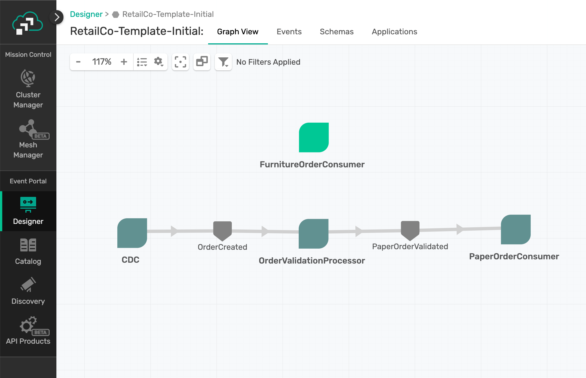

#### Add the _FurnitureOrderValidated_ Event

Next we need to create the _FurnitureOrderValidated_ event and associate it with the _OrderValidated_ schema that defines it's payload.

Right click on the graph and choose _Create Event_.

Fill in the fields as follows:

1. **Name**: _FurnitureOrderValidated_
2. Leave the _Shared_ checkbox unticked.
3. **Description**: This event contains the details associated with validated furniture orders.
4. **Logical Event Mesh**: Select _TemplateInitial_
5. **Topic Address**: Use the topic builder to create the structure `retailco/order/update/validated/v1/B2C/furniture`, note: all topic levels are _Literal_ in this example.
6. **Value**: Select _Schema_ and then pick _OrderValidated_ from the dropdown.
7. **Owners**: Click _Add/Remove Owners_ and choose yourself

Positive
: When designing your own Event-Driven Architecture, properly designing your topic space is an important step towards achieving the benefits promised by EDA. Be sure to take the time to read our [Topic Architecture Best Practices](https://docs.solace.com/Best-Practices/Topic-Architecture-Best-Practices.htm).

✅ Go ahead and click _Save_ to complete the creation of our _FurnitureOrderValidated_ event.

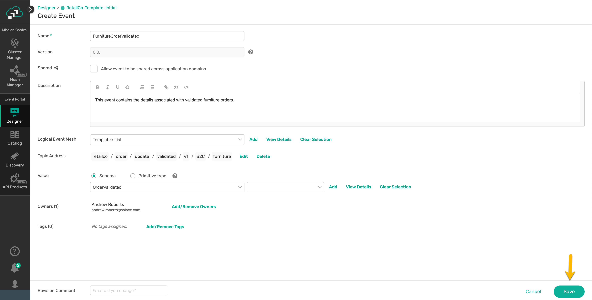

After you click save, if you click the _Events_ tab in the top tab panel, then _FurnitureOrderValidated_, you'll see the details of the event you just created. If you then click the green _View Details_ link next to the _Schema_ property, you'll be able to see the details of the _OrderValidated_ schema you associated with the event.

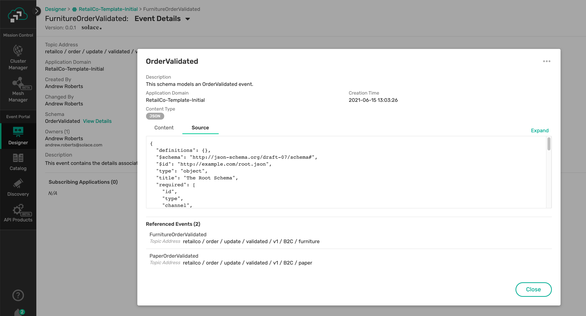

#### Update _OrderValidationProcessor_ to produce _FurnitureOrderValidated_ events

Now that we've created our _FurnitureOrderValidated_ event and defined its payload, we need to update _OrderValidationProcessor_ to produce it.

**To do this follow these steps:**

1. Right click on the _OrderValidationProcessor_ Application and choose _Manage Events_
2. For ease of searching, tick the _Only show events in this Application Domain_ checkbox on
3. Search for "FurnitureOrderValidated" and click "Pub" next to it since the _OrderValidationProcessor_ needs to publish these events.
4. Click _Save_

✅ _OrderValidationProcessor_ is now complete and you should see it publishing both _PaperOrderValidated_ and _FurnitureOrderValidated_ events.

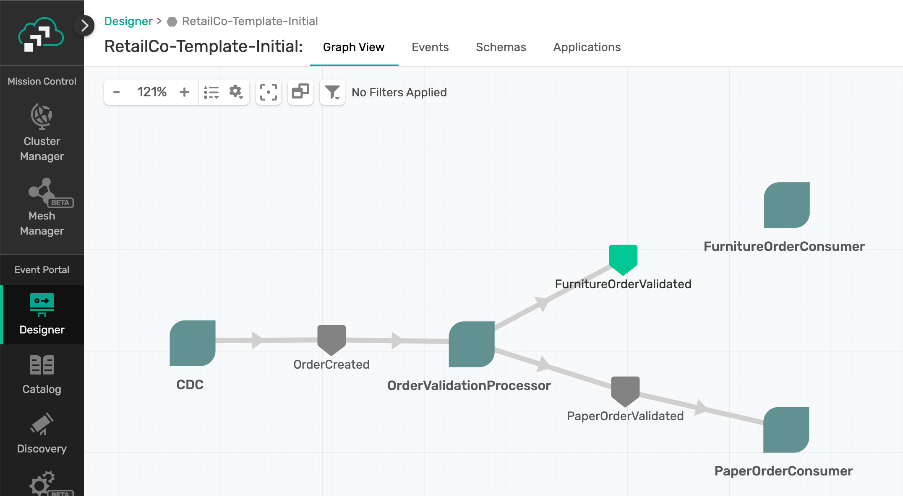

#### Update _FurnitureOrderConsumer_ to consume _FurnitureOrderValidated_ events

Lastly, we need to update _FurnitureOrderConsumer_ to consume _FurnitureOrderValidated_ events.

**To do this follow these steps:**

1. Right click on the _FurnitureOrderConsumer_ Application and choose _Manage Events_
2. For ease of searching, tick the _Only show events in this Application Domain_ checkbox on
3. Search for "FurnitureOrderValidated" and click "Sub" next to it since the _FurnitureOrderConsumer_ needs to subscribe to these events.
4. Click _Save_

✅ _FurnitureOrderConsumer_ is now complete and you should see it consuming _FurnitureOrderValidated_ events published by the _OrderValidationProcessor_!

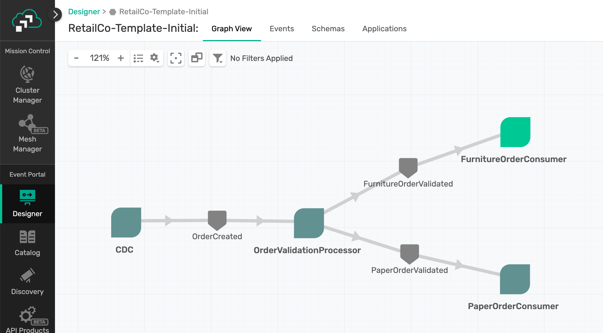

Next up, we'll develop the application in Spring Cloud Stream with the help of AsyncAPI Generator.

## Install the AsyncAPI Generator

Duration: 0:03:00

Now that we've defined the architecture for our use case in the Event Portal we're ready to write some code! But we don't want to have to write everything from scatch so we're going to use the [AsyncAPI Generator](https://github.com/asyncapi/generator)

In order to use the AsyncAPI Generator we first need to install the CLI.

If you have the prequisites installed as defined earlier in the "What You'll Need" section you should be able to pop open your terminal and use the command below to install the CLI.

```bash
npm install -g @asyncapi/generator
```

Negative
: Note that the AsyncAPI project is continuously updated so if you previously installed the generator you can also use the command above to update to the latest.

If you don't have Node.js installed or would rather use Docker, they also make AsyncAPI Generator available as an image and provide instructions for it [here](https://github.com/asyncapi/generator#cli-usage-with-docker).

## Developing the Furniture Order Consumer

Duration: 0:15:00

On to developing the _FurnitureOrderConsumer_ microservice. As mentioned, we want to implement this app using the [Spring Cloud Stream](https://spring.io/projects/spring-cloud-stream) framework. For more information on the framework the [reference guide](https://cloud.spring.io/spring-cloud-static/spring-cloud-stream/current/reference/html/) is an excellent resource.

### Generate the Code Skeleton

In the Solace Event Portal right click on the _FurnitureOrderConsumer_, Choose _Download AsyncAPI_, Choose _YAML_, and click _Download_.

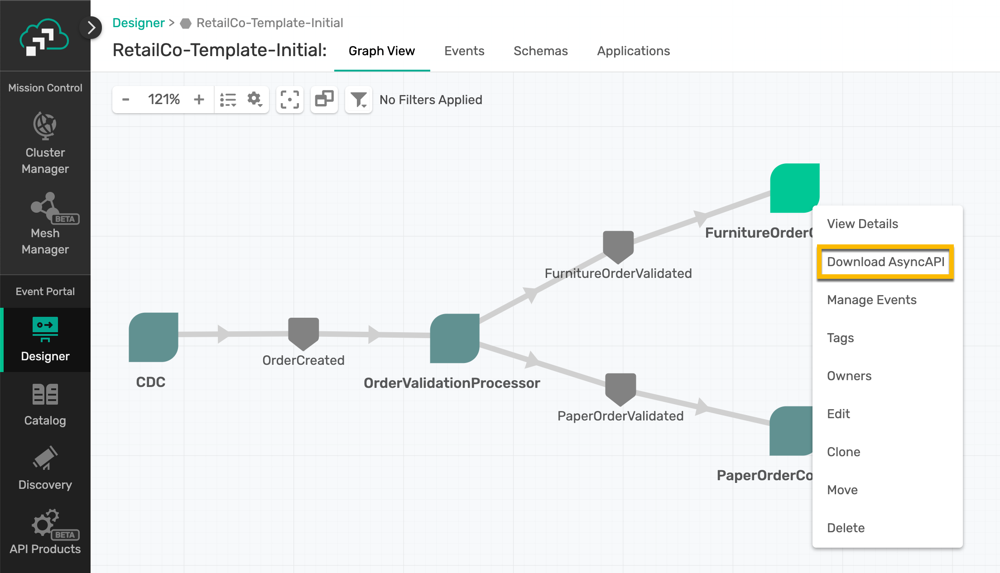

It should includes a lot of the information about the app that we defined via the Event Portal, including:

- The **title** and **description** under the **info** section
- Our **events**, referred to as **messages** in the AsyncAPI specification
- The **schemas** that define the payloads of our events
- The **channels** on which the events are exchanged, i.e. Solace topics

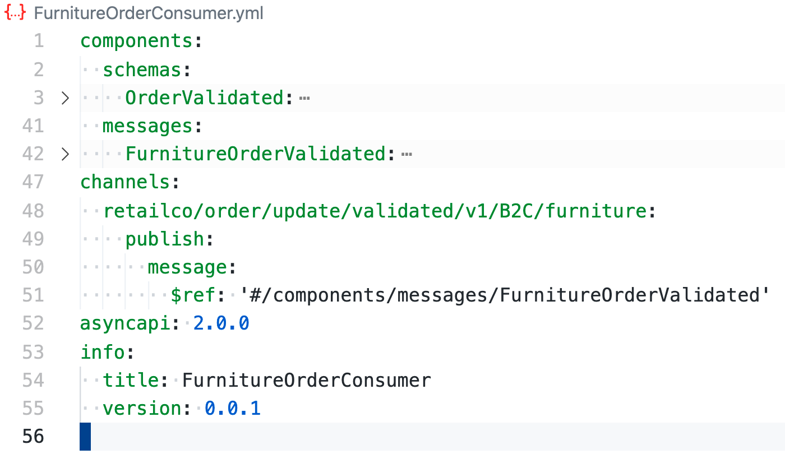

Positive
: The AsyncAPI Java Spring Cloud Stream Generator Template includes many [Configuration Options](https://github.com/asyncapi/java-spring-cloud-stream-template#configuration-options) that allow you to change what the generated code will look like.

We're now ready to generate the code! Head over to your terminal and enter the following command:

```bash
ag -o FurnitureOrderConsumer -p binder=solace -p artifactId=FurnitureOrderConsumer -p groupId=org.retailco.orders -p javaPackage=org.retailco.orders -p host=localhost:55555 -p username=default -p password=default -p msgVpn=default ~/Desktop/FurnitureOrderConsumer.yml @asyncapi/java-spring-cloud-stream-template
```

Note the different pieces of the command:

- `ag` is the AsyncAPI Generator command
- `-o` is the output directory
- `-p` allows you to specify [parameters](https://github.com/asyncapi/java-spring-cloud-stream-template#parameters) defined for the template you're using
- `binder` is the Spring Cloud Stream binder you wish to use, in this case Solace
- `artifactId` & `groupId` configure Maven params of the same names
- `javaPackage` specifies the Java Package to place the generated classes into
- `host`, `username`, `password` and `msgVpn` allow you to set binder connection information, i.e. Solace connection details
- The YAML file (second to last option) is the location of your AsyncAPI specification
- And lastly, `@asyncapi/java-spring-cloud-stream-template` is the AsyncAPI Generator template we are using.

✅ After running the command you should see output that ends with where you can find your generated files.

```
Done! ✨
Check out your shiny new generated files at /private/tmp/codelab/FurnitureOrderConsumer.
```

💥Boom💥 We've generated our code skeleton!

### Import and Explore the Generated Project

The generated project is a Maven project, so head over to your favorite IDE and import the project so we can add our business logic. Once imported you should see something like the image below:

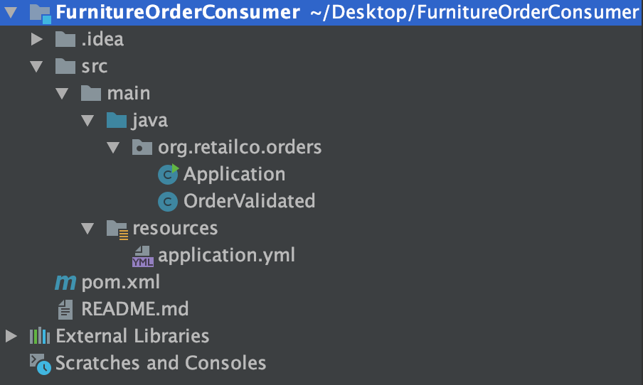

A few notes on the project:

- The generated Java classes are in the `org.retailco.orders` package that we specified.
- The `OrderValidated` POJO was generated from the schema defined in our AsyncAPI spec, and includes getters/setters/toString/etc.
- `Application.java` contains a Consumer method that will trigger whenever an event is received on the channel specified by the event definition, and inside the method can use a functional programming model to access the event's payload as an already-deserialized `OrderValidated` object.
- The Consumer methods name, `retailcoOrderUpdateValidatedV1B2CFurnitureConsumer`, was autogenerated by removing the topic delimiter `/` and camel casing each topic level. This CAN be overridden by modifying the AsyncAPI specification file before running the code generator to include a `x-scs-function-name` property, and the queue name for the Consumer can also be overridden using the `x-scs-destination` property. More details [here](https://github.com/asyncapi/java-spring-cloud-stream-template#configuration-options).
- The `application.yml` file contains the Spring configuration which tells our app how to connect to Solace using the SCSt binder as well as which message channels to bind our methods to.
- The `pom.xml` file contains the dependencies needed for the microservice. These include the `spring-cloud-starter-stream-solace` dependency which allows you to use the Solace SCSt Binder.

### Fill in the Business Logic

Navigate to and open the `Application.java` file. We're going to edit the _retailcoOrderUpdateValidatedV1B2CFurnitureConsumer_ method to add our business logic. Remember that our Use Case defines that our _FurnitureOrderConsumer_ should listen to the stream of _FurnitureOrderValidated_ events. In real life, we'd be doing something with the validated orders-but in this CodeLab we're just logging out some of the payload properties to show how easy they are to access.

Go ahead and code up this business logic yourself or feel free to add your business logic by looking at the code snippet available below.

```java
package org.retailco.orders;


import org.slf4j.Logger;
import org.slf4j.LoggerFactory;
import org.springframework.boot.SpringApplication;
import org.springframework.boot.autoconfigure.SpringBootApplication;
import org.springframework.context.annotation.Bean;

import java.util.function.Consumer;


@SpringBootApplication
public class Application {

	private static final Logger logger = LoggerFactory.getLogger(Application.class);

	public static void main(String[] args) {
		SpringApplication.run(Application.class);
	}

	@Bean
	public Consumer<OrderValidated> retailcoOrderUpdateValidatedV1B2CFurnitureConsumer() {
    return furnitureOrderValidated -> {
      logger.info("Received Furniture Order Validated Event: " + furnitureOrderValidated.toString());
    };
	}
}

```

## Connecting the Applications

Duration: 0:05:00

Now that our _FurnitureOrderConsumer_ app has been developed, let's run it!

If your IDE has support for Spring Boot you can run it as a Spring Boot App.

Or run it from the terminal by navigating to the directory with the pom and running the `mvn clean spring-boot:run` command.

Negative
: If you get an error that says something like `Web server failed to start. Port XXXX was already in use.` then change the `server.port` value in `application.yml` to an open port.

Positive
: Notice that by using Spring Cloud Stream the developer doesn't need to learn the Solace Messaging API. The developer just writes generic Spring beans and configuration, filled in by the AsyncAPI generator, in the application.yml file binds the messaging channels and connection to the broker for the developer.

**The microservice is now is now running, connected to the Solace Event Broker, and receiving events. You should see the payloads of the FurnitureOrderValidated events being logged to your console!**

## Takeaways

Duration: 0:02:00

✅ [Solace Event Portal](solace.com/products/portal) is a tool that helps you design and visualize your Event-Driven Architecture, discover what applications/events/schemas exist, collaborate with your team, and kickstart development via exporting of AsyncAPI specifications.

✅ [AsyncAPI Generator](https://github.com/asyncapi/generator) templates streamline the way developers create event-driven applications by generating code skeletons that are pre-wired with the events and channels defined in the AsyncAPI specifications.

✅ [Spring Cloud Stream](https://spring.io/projects/spring-cloud-stream) allows developers to implement highly scalable, event-driven microservices without having to learn how to use messaging APIs.


Thanks for participating in this codelab! Let us know what you thought in the [Solace Community Forum](https://solace.community/)! If you found any issues along the way we'd appreciate it if you'd raise them by clicking the Report a mistake button at the bottom left of this codelab.
