author: HariRangarajan-Solace
summary: Day 1/5 : This code lab walks the participant through the experience of using SAP AEM to event enable their SAP ecosystem and workflows
id: sap-aem-int-day-1
tags: SAP, AEM, Event Portal, SAP BTP, CAPM
categories:
environments: Web
status: Hidden
feedback link: https://github.com/SolaceDev/solace-dev-codelabs/blob/master/markdown/sap-aem-int-day-1

# Event Enable SAP Using SAP Advanced Event Mesh - Day 1

## What you'll learn: Overview

Duration: 0:05:00

### Problem Statement

#### Opportunity to EDA Enable your ERP Environment
* Would you like clarity on how to keep the core clean with BTP and Event Driven Architecture?
* Would you like a prescriptive approach to building extensions with BTP?
* Have you heard the term Enterprise Event Mesh?
* Have you ever considered the potential outcome of your ERP operating in real time?
* Have you considered the possibility that batch jobs and out of sync data stores could be a thing of the past?
* Have you considered the implication of starting to become event driven?

#### Scenarios where customers are starting with EDA
* Do you provide an amazon like customer experience where all order status changes are proactively sent to your customers when their order has been delayed, cancelled or shipped early?
* Do you notify your service technicians when they have a new high priority work order?
* How do you distribute master data changes to both SAP and non-SAP applications in real time to avoid costly manual rework? (for example GL Accounts, Customer, Cost Center, etc…)
* Can you react in real time to employee changes like promotions, transfers, onboarding activities,off boarding, etc…(e.g. removing access for employees once terminated across all applications and systems)
* As part of your adoption and rollout of Integration Suite or as part of your PI/PO move strategy, are you adopting best practices for event driven integration scenarios?
* Are you actively triggering microservices based on Events from S/4 or ECC? (e.g. CAPM services)
* Have you considered feeding your Datasphere (or other Analytics Platforms ) environment with real time S/4 or ECC Events?
* As part of SAP Rise, are you aware that there are hundreds of events out of the Box with S/4?

### Workshop Scenarios

#### Scenario 1 – Customer Experience
**Question**: How can we use EDA to actively and selectively push relevant and timely events out to the Enterprise?
**For Example**: A customer orders a new pair of shoes, and they will ship late, how will we notify the customer about this update.
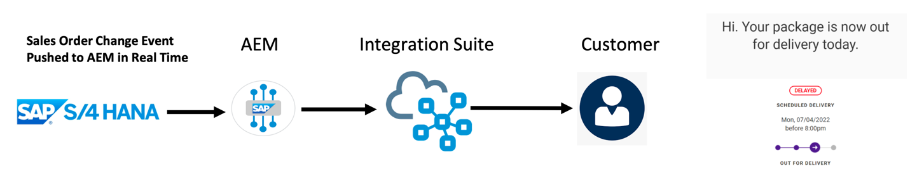

#### Scenario 2 – Customer Master Data Change
**Question**: How can we use EDA to actively and selectively push any and all master data changes to the entire enterprise?
**For Example**: Customer changes their address information.


### Workshop structure
For logistics and ease of delivery, this workshop has been divided into 5 half-days and this covers day 1. It describes the below topics :
- Setting up of  AEM Services
- Building an Event Mesh 
- Deploying a SAP CAP based Simulator on CloudFoundry
- Testing the Simulator and publishing SAP objects to the Event Mesh

## What you need: Prerequisites

You will need the following resources prior to the commencement of the workshop : 

1. CPEA Contract in place
2. Approximately 5K of CPEA credits available to activate 2 AEM brokers for 4 weeks
   - Please refer to the following link to activate the service should you need assistance : [Enable AEM in BTP](https://drive.google.com/file/d/1IWsCTKQDZX6_BL0K35KOQJPPZY4oWwTs/view?usp=drive_link)
3. Signed ASAPIO trial agreement : [ASAPIO Store - Evaluation Licenses - ASAPIO](https://protect-us.mimecast.com/s/g1YTCR6nxjIrnKJri9FGqr?domain=asapio.com/)
   - ASAPIO Plugin to be downloaded and installed prior to the workshop
4. SAP Build Process Automation (Free Tier Available)
   - Access to SAP WorkZone
5. Access to Integration Suite (Free Tier Available)
   - Integration Suite Activated prior to the workshop
6. Access and ability to change ERP Environment
7. A BTP Resource who has the appropriate authorizations to activate/use the relevant BTP Services. (E.g. Advanced Event Mesh, SAP Bus. Process Automation and Integration Suite)
8. ASAPIO Plugin to be downloaded and installed prior to the workshop. This will be made available as transport that will need to be installed once the Agreement is signed, link on previous page)
9. Authorization for your development SAP Landscape to send events to the AEM Service.
10. SAP Build Process Automation – a resource who is familiar with Building Processes/Workflows
11. Integration Suite – a resource who is familiar with building iFlows and has the necessary authorizations to deploy new artifacts
12. Relevant Functional Resources who might be responsible for the Sales Order, Business Partner, GL, Material Master or Notification Objects within SAP, so they can fully appreciate the art of the possible once these objects are event enabled.

## Create AEM Services
In this task, you will be creating two Enterprise AEM services, connecting them to form a mesh and verifying your mesh health.

Before starting, it will be helpful to know what cloud provider and region your SAP environment is in, and the primary cloud provider and region where your cloud applications are deployed. 
The value of building a mesh topology is realized when placing your AEM services close to your event producing and consuming systems. 
If your SAP environment is running in an on-premises data center, you will use the geographic region of that site to help select an appropriate location for that AEM service.

### Create your first AEM service:

1. From the SAP AEM Console, open the Cluster Manager.\
   

2. Click the + box to create a new AEM service.\
   

3. Name your service\
   

   > aside negative
   > Note that service names must be unique within your account. We suggest using the mesh name you want, a hyphen, and
   a
   > service ID to make it unique.

4. Pick Enterprise as the service type.\
   
   \
   For now, keep the default service class and message storage settings.
5. Choose your cloud provider from the pull down list.\
   \
   For the first AEM service, select the same IaaS (Infrastructure as a Service) provider and region where your SAP is
   running, the RISE provider and region where your SAP Cloud is
   running, or for an on-premises SAP pick a cloud provider and region closest to where your data center is located.\
   \
   For the second AEM service, select the same provider and region where your cloud applications are located. If you
   have
   several, pick one that is distant from your SAP environment (you can expand your mesh later to include additional
   cloud locations).\
   
   > aside negative
   > Note that you can also request buildout of a private cloud region on-premises at your data center later, but for
   > now please select the best matching cloud provider.

6. Click the Select Region box inside the map and select your cloud region. \
   
   \
   This example shows selecting Azure as the provider and East US 2 (Virginia) as the region: \
   
   \
   Please substitute your best provider and region as you make your selection and click OK.

7. Keep the Default Broker Version selection. \
   

8. Expand the Advanced Connection Options section. \
   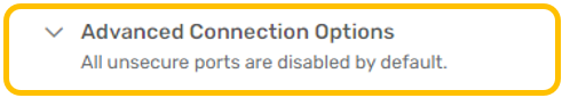

9. Enter the name for your cluster.
   \
   AEM services can be clustered within a cloud location to expand capacity horizontally.
   These clusters can then be interconnected across cloud locations to form a mesh.
   Today, we will create two clusters of one AEM service each and then interconnect them.
   \
   When clicking in the Cluster Name field, you will see a pull-down menu of existing clusters (the list will likely be
   empty) and a search box at the top.
   \
   Click in the search box and use your mesh name plus the cloud provider and region
   to define the name of your cluster. As you type, the search results will include the cluster name you are defining:\
   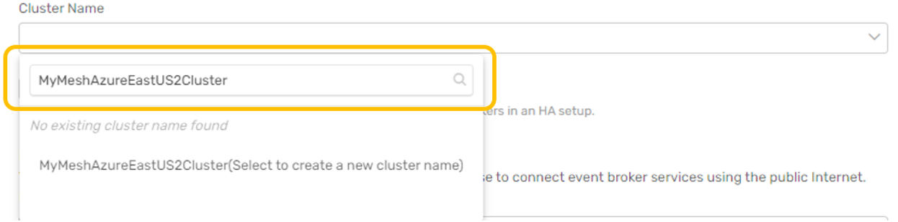
   \
   Remember to use your specific mesh name, provider and region followed by the word Cluster and then click your cluster
   name in the search result to select it: \
   
   \
   Leave the Enable mate-link encryption checkbox selected.

10. Set the Message VPN Name.
    \
    By default, each AEM service has a unique VPN name. The message VPN is a logical messaging
    domain where events are shared by producing and consuming applications.
    For our evaluation exercise, we will use a single message VPN across both AEM services. \
    Click on the pencil icon to the right of the Message VPN Name field and set the name to your mesh name followed by
    the
    keyword VPN : \
    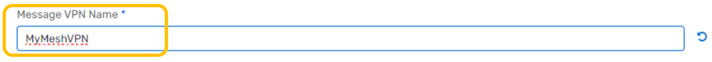
    \
    Leave the Port Configuration section default values for now. After reviewing all the settings on the Create Service
    page, click Create Service to launch your AEM service.\
    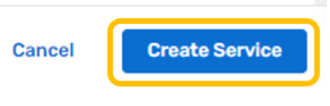
    \
    You will see a progress bar as the service is being started. Click the back-arrow at the top of the window next to
    your
    service name to return to the Cluster Manager view. You will see your AEM service instance with the progress bar. \
    
    \
    You can proceed with the next step while your first AEM service is starting.

11. Repeat steps 2 through 10 for your second AEM service. \
    Substitute the name (Svc2) along with the appropriate cloud provider and region.
    > aside negative
    > Note that your second service can be with the same cloud provider or a different cloud provider.\
    > For example, it is common for organizations to use Azure as their SAP IaaS provider for cost/location reasons,
    > but to have applications being built in AWS or another cloud provider.

    **IMPORTANT - For your second AEM service:**
    - Location will be in a **DIFFERENT region** (with the same or different cloud provider).
    - The **cluster name** follows the same pattern but is **DIFFERENT** from the first AEM service.
    - You will use the **EXACT SAME Message VPN Name** as for the first AEM service.

    Once your services have started, you can click to open them and view details of their status:
    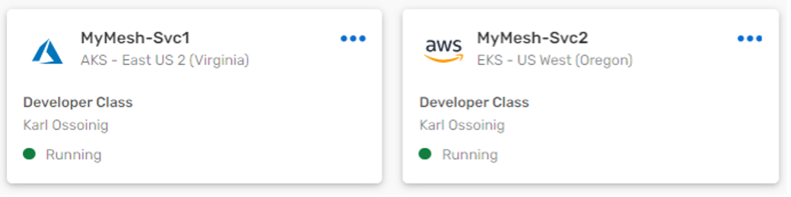
    > aside negative
    > (Note - This example shows developer class services)

    Click on each service to inspect the detailed status: \
    
    \
    This example shows low utilization, version detail and cluster detail which includes the message VPN name which
    should be the same for both AEM services.
## Build an event mesh

1. Define a new mesh. From the SAP AEM Console, open the Mesh Manager: \
    
    \
    In the top right, click the Create Mesh action to open the mesh definition. \
      \
    Enter the same mesh name used when defining your AEM services. \
    
2. Add your AEM services to the mesh. \
    Click Add Service, then use the pull down search box to find and select your first service. \
     \
    Click Add Service in the dialog to complete the action: \
     \
    Click Add Service again and add your second service. \
     \
    Mesh Manager will show the layout of your mesh geography. \
     \
    Click Create Mesh to complete the mesh setup. \
     \
    Mesh Manager will update the status of your mesh when configuration is complete. \
    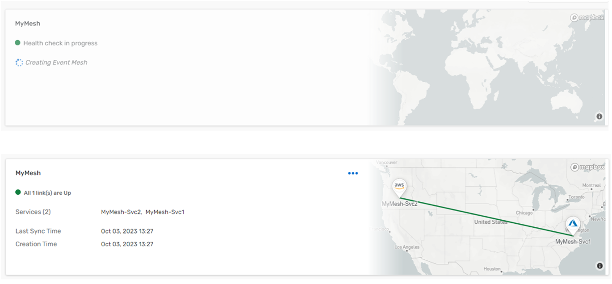

3. (**Optional**) Run a health check on your event mesh.
    From the Mesh Manager, click on your event mesh to open the status page : \
    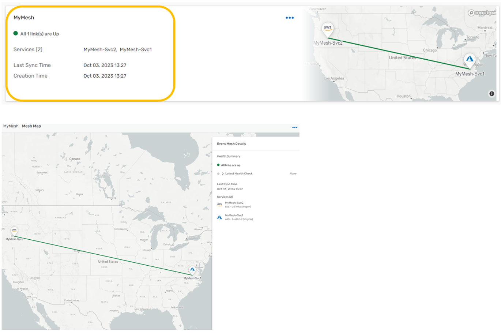 \
    Expand the Latest Health Check and click Run Health Check action: \
    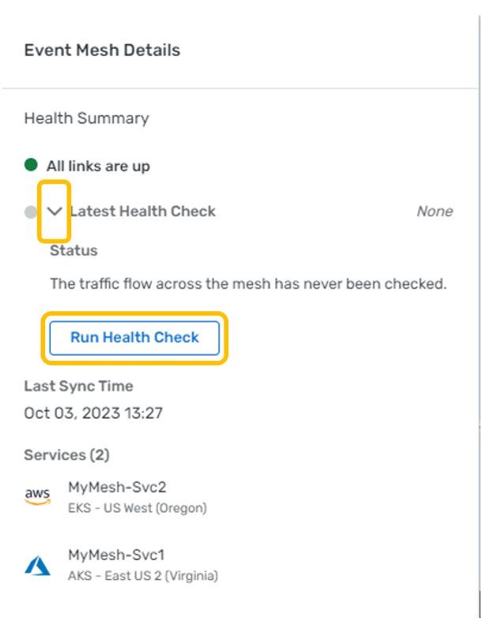 \
    The health check progress is shown, followed by the health check status: \
    


## SAP Simulator setup

The SAP Cloud Application Programming Model (CAP) is a framework of languages, libraries, and tools for building
enterprise-grade services and applications. It guides developers along a 'golden path' of proven best practices and a
great wealth of out-of-the-box solutions to recurring tasks.
CAP-based projects benefit from a primary focus on domain. Instead of delving into overly technical disciplines, we
focus on accelerated development and safeguarding investments in a world of rapidly changing cloud technologies.

For more information on SAP CAP, you can refer to the
link : [SAP Cloud Application Programming Model](https://cap.cloud.sap/docs/)

To showcase the integration capability of SAP CAP and AEM, we have created a CAP based Java microservice which will
publish different SAP business object events into your AEM instance.
This application can be deployed in your SAP CloudFoundry space.

###  1 : CloudFoundry CLI installation

To start with, we will be installing the CloudFoundry CLI for the deployment process.
Follow the steps mentioned over
here [Installing the cf CLI](https://github.com/cloudfoundry/cli/wiki/V8-CLI-Installation-Guide) for detailed
instructions on this.

###  2 : Downloading the deployables artefacts

Download the following files artefact files and save them in the same directory:

- capm-erp-simulation-exec.jar : [https://github.com/SolaceLabs/aem-sap-integration/blob/main/deployable/capm-erp-simulation-exec.jar](https://github.com/SolaceLabs/aem-sap-integration/blob/main/deployable/capm-erp-simulation-exec.jar)
- manifest.yml : [https://github.com/SolaceLabs/aem-sap-integration/blob/main/deployable/manifest.yml](https://github.com/SolaceLabs/aem-sap-integration/blob/main/deployable/manifest.yml)

###  3 : Login to CloudFoundry space

You can log in to the SAP CloudFoundry space in your account as below :

- Use the command : `cf login` to log in, which will prompt for your SAP login credentials.
- Once authenticated, the details of the default cloudfoundry space will be displayed.

###  4 : Deploying the SAP Simulator application

- Navigate to the directory where the above deployable artefact files are saved.
- Run the command `cf push` which will upload the jar file and use the manifest.yml for properties. **Note : this
  command will take some time to completely execute as it uploads the jar deployable and also start the application.**
- Once the command is completely executed, run the command `cf apps` to view a listing of the apps in your cloudfoundry
  space
- Verify that the app **capm-erp-simulation** is deployed and started

## Test SAP Simulator

### 1 : Accessing the SAP Simulator application

- Navigate to the Cloud Foundry environment in your SAP BTP Cockpit
- You should see a screen like below :
  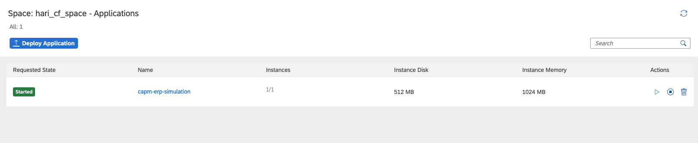
- Click on the application name : **capm-erp-simulation** and enter the application overview screen.
  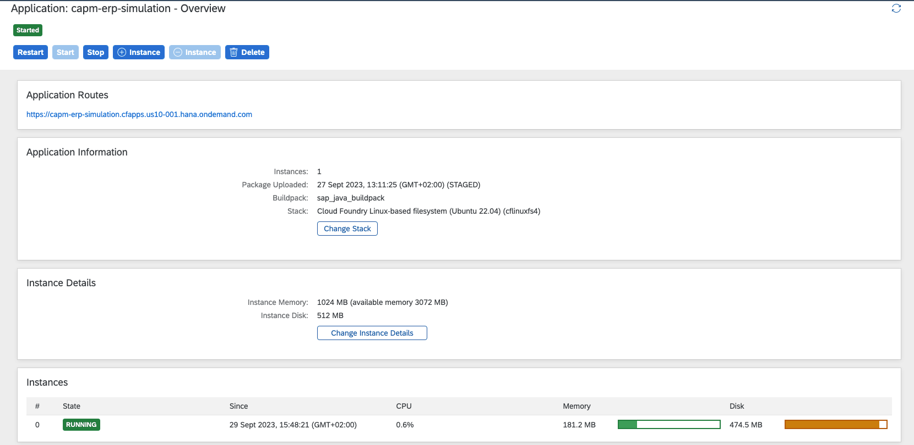
- Click on the application route as highlighted below. Note : this route url will differ from for different SAP BTP
  accounts.
  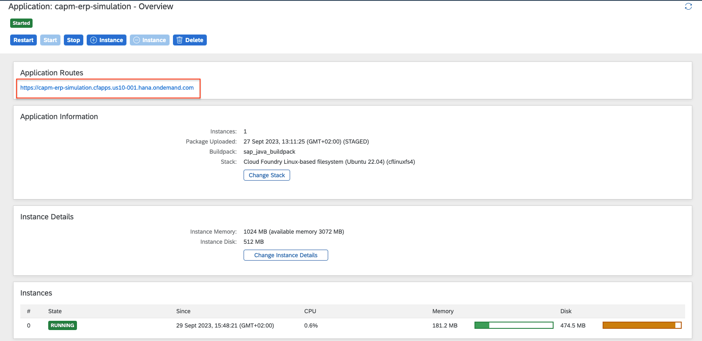

### 2 : Connecting to SAP AEM and running the simulator

- As you click on the above application route url, you will be redirected to the simulator screen as below
  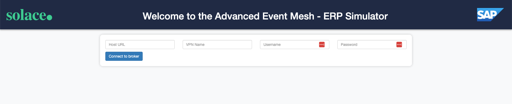
  Here you can connect to your SAP AEM instance to publish events. 
    > aside negative
    > As long as both of your SAP AEM services are connected to the event mesh, messages will flow freely between the two of them.
    > Due to this intelligent routing, you can connect the simulator to either of your AEM services created earlier.
- The connection parameters for the simulator can be captured from below :
  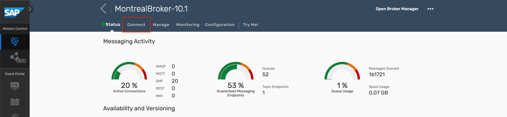
  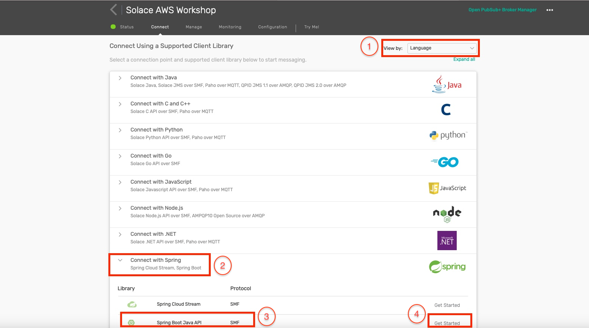
  Enter the appropriate value as specified below :
- Host URL : Public Endpoint
- VPN Name : Message VPN
- Username : Username
- Password : Password
  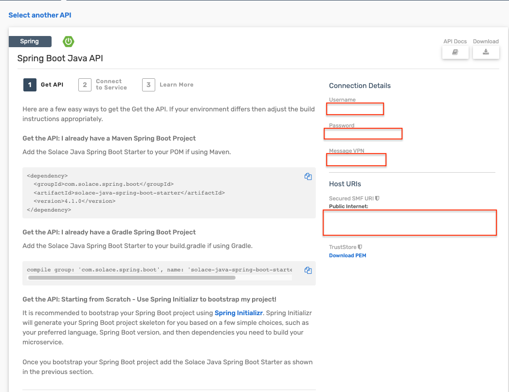
- Once the broker is successfully connected, you will be displayed a screen as below :
  
- You can choose which events to simulate and its frequency by using the sliders. As you change a schedule, the submit
  button in the bottom will be enabled
  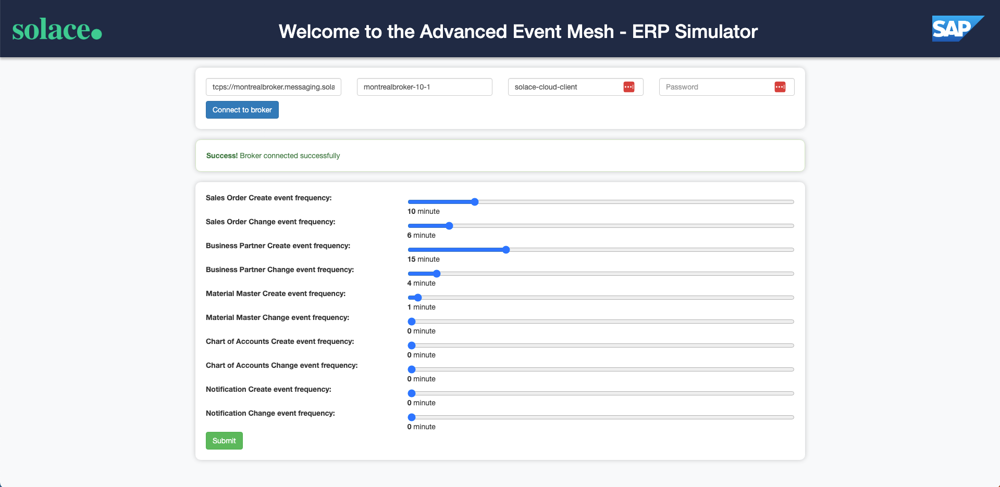
- In case you want to disable any of the events, then pull the slider to **0** and click submit and the event will be
  disabled immediately
  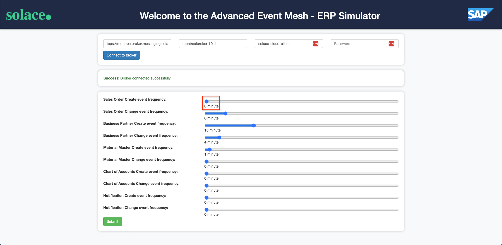

### 3 : Test the incoming events

You can easily test the simulator by using the **Cluster Manager - Try-Me** as below:
    > aside negative
    > As mentioned earlier due to the intelligent routing in the event mesh, you can connect the simulator and try-me to either of the two SAP AEM services in the event mesh and see the messages flowing freely.

- Click on the **Connect** button in the **Subscriber** side of the panel as below :
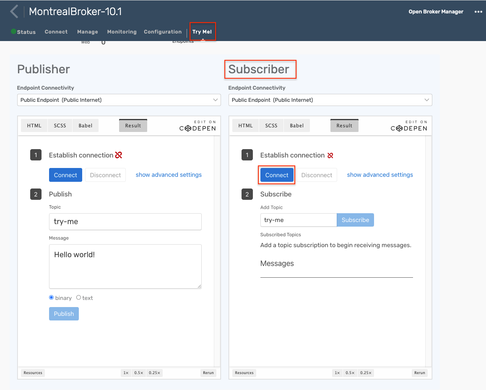
- Add topic subscription(s) to view incoming messages on the topic as below :
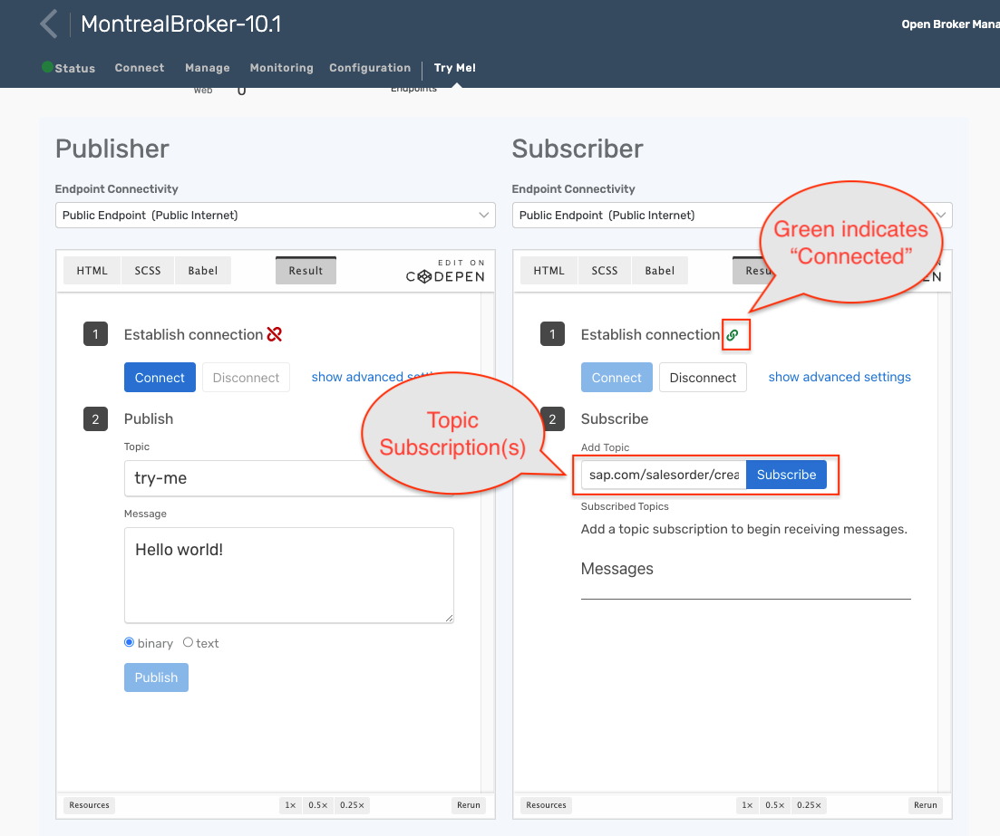
- You can use the below topic structures for different event types : 

  - **Sales Order** :
    - Create : ```sap.com/salesorder/create/>```
    - Change : ```sap.com/salesorder/change/>```
  - **Business Partner** :
    - Create : ```sap.com/businesspartner/create/>```
    - Change : ```sap.com/businesspartner/change/>```
  - **Chart of Accounts** :
    - Create : ```sap.com/chartofaccounts/create/>```
    - Change : ```sap.com/chartofaccounts/change/>```
  - **Material Master** :
    - Create : ```sap.com/material/create/>```
    - Change : ```sap.com/material/change/>```
  - **Notifications** :
    - Create : ```sap.com/notification/create/>```
    - Change : ```sap.com/notification/change/>```
- As the simulator publishes events to the broker you should see events appearing in the subscribed topic(s)

## Takeaways

Duration: 0:07:00

✅ Introduction to the workshop \
✅ Understanding how to create AEM services \
✅ Set up an Event Mesh \
✅ Deploy the SAP CAPM based simulator in CloudFoundry \
✅ Testing the simulator and publishing events to the Event Mesh 


Thanks for participating in this codelab! Let us know what you thought in the [Solace Community Forum](https://solace.community/)! If you found any issues along the way we'd appreciate it if you'd raise them by clicking the Report a mistake button at the bottom left of this codelab.
