author: HariRangarajan-Solace
summary: Day 1/5 : This code lab walks the participant through the experience of using SAP AEM to event enable their SAP ecosystem and workflows
id: sap-aem-int-day-2
tags: SAP, AEM, Event Portal, SAP BTP, CAPM
categories:
environments: Web
status: Hidden
feedback link: https://github.com/SolaceDev/solace-dev-codelabs/blob/master/markdown/sap-aem-int-day-2

# Event Enable SAP Using SAP Advanced Event Mesh - Day 2

## What you'll learn: Overview

Duration: 0:05:00

Day 2 of 5.
Topics covered :

SAP EDA artifacts visualized using the Event Portal
- Explore the Event Portal and learn how to import objects.
- Learn how to create a design so that your events can be maped and understood.

SAP UI5 Integration cards displaying events in real time
- Using the services provided in the SAP BTP, you will learn how to create visualizations for your data using eventing.
- Learn how easy it is to bring your events to life.

## What you need: Prerequisites

Duration: 0:07:00

Complete all activities in day#1. You access and use the same broker you setup previously as well as the simulator push events.

## SAP EDA artefacts visualized

In this task, you will be importing the design representing the events for this rapid evaluation. \
This design is an example, and not a full implementation. The intent is to have enough design for an evaluation while
allowing easy understanding of the concepts being demonstrated.
The level of detail in the model is "medium size," meaning that there are enough attributes to enable the demonstration,
but it is not the full schema for the SAP objects involved.

1. From the SAP AEM Console, open the Designer. \
   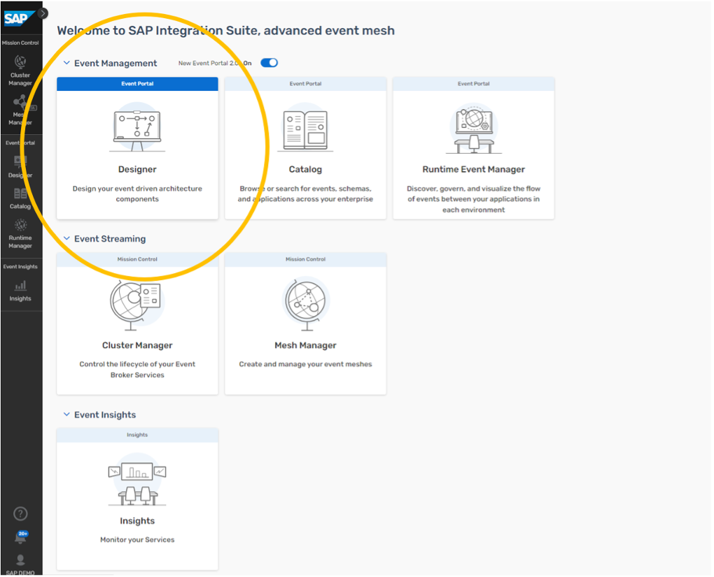

2. Import the demo domain from the provided export file. \
   \
   Pull down the menu extension in the Application Domains view and select the import function.
   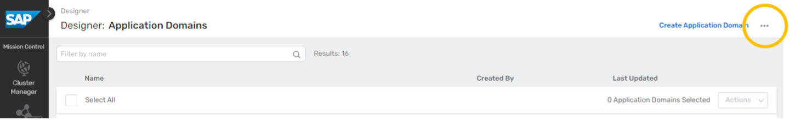\
   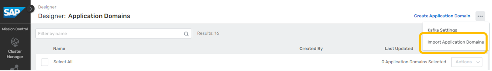\
   \
   Locate the **btp_aem_demo.json** file in your file system and import it: \
   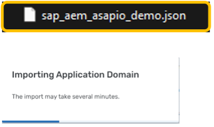 \
   After the import is complete, you will see the evaluation domain in the domains list. \
   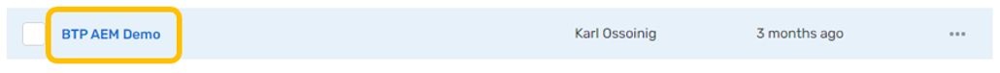

3. Take a quick tour of the domain model. \
   \
   The initial view of the domain will be of the Applications tab. \
   You will see a number of modeled applications in the list related to the demo. \
   

   Event APIs and Event API Products can be used to expose and manage AsyncAPI interfaces within organizations, or with
   external partners through your APIM vendor.
   > aside negative
   > Note that Event APIs and Event API Products are advanced topics that will not be covered by this demonstration
   design.

   Clicking on the Events tab, you will see a listing of events defined for the domain.
   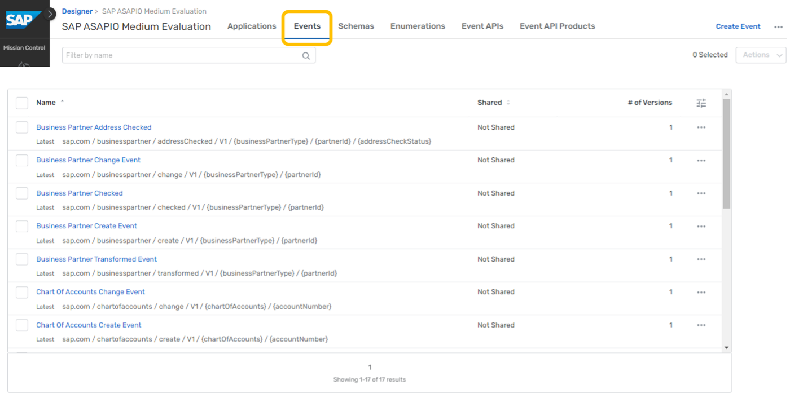
   \
   Clicking on the Schemas tab, you will see 5 schemas.
   
   \
   For simplicity, we have defined one schema for use by all events dealing with each object. \
   Clicking on the Enumerations tab, you will see one enum.
   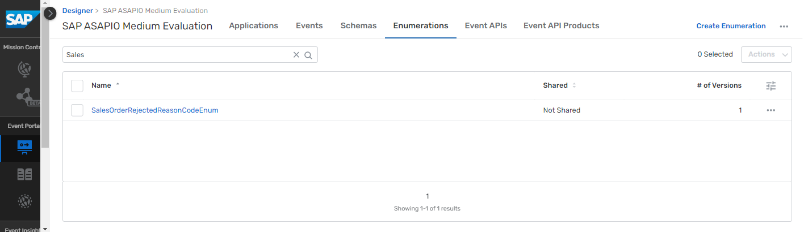
   \
   Enums are used in the model to show a finite set of possible values. \
   For example, this one is defined to hold a concise set of rejected reason code values for sales orders.

   Moving back to the Events tab, we can use the search box near the top to filter down to the event(s) we want to find.
   For example, typing "Sales" here results in a live search that filters the list down to just Sales Order related
   events.
   \
   \
   Clicking on the Sales Order Create event in this view will drill into the definition of that event.
   
   \
   This provides an overview of the event details including the version, state, description, topic address, schema
   reference, and reference-by links.
   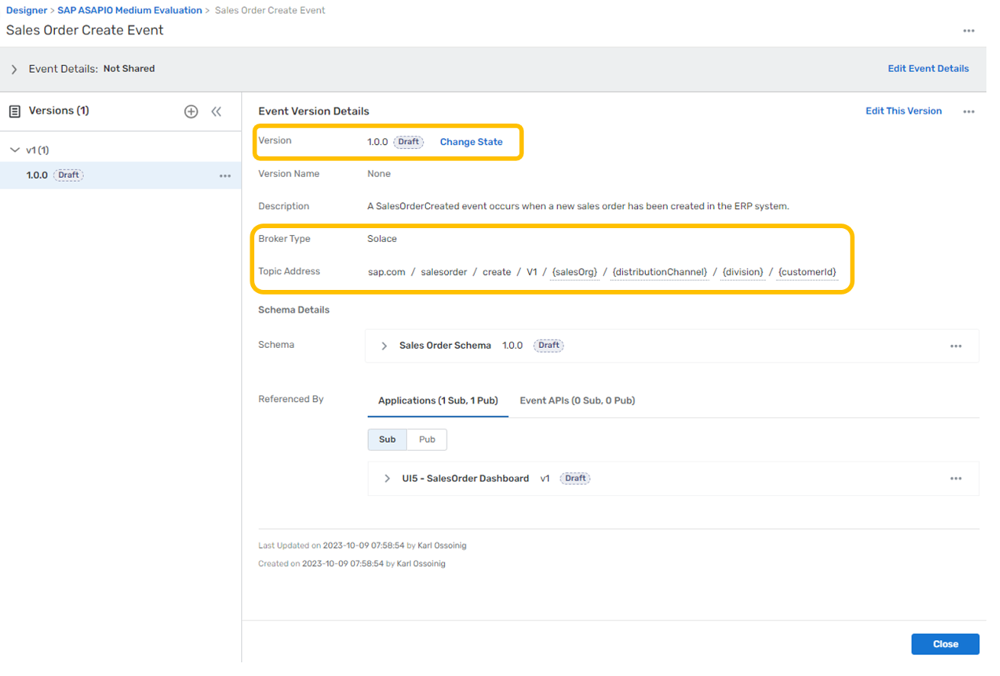

   **Version & State:** \
   Designer can be used to manage the version and state of model objects and tracks their relationships for you,
   enabling full SDLC (software development lifecycle) visibility.
   It also serves as a collaboration space that allows you to leverage events you create more effectively to derive new
   value for the business.
   \
   **Broker Type & Topic Address:** \
   For AEM services (broker type = Solace), the topic address is a string with **“/”** separators that enables dynamic routing and filtering.
   Following best practice guidelines for creating topic strings is critical to your EDA success. \
   \
   The general format is **ORG/DOMAIN/VERB/VERSION/{ATTRIBUTE1}/{ATTRIBUTE2}/…** \
   Topics are a powerful mechanism employed by AEM to perform dynamic routing in an event mesh, moving copies of events
   only where they are needed. It also enables consuming clients to filter events within topics using subscriptions and
   wildcard characters **(*, >)**. \
   This capability avoids client applications having to implement brittle, complex filtering logic to reject unwanted
   events.\
   \
   Next, click on the referenced schema to expand your view.
   \
   The referenced schema can be displayed as content in this view. \
   Now click on the expanded menu in this section and select Open Schema. \
   \
   This takes you directly to the Schema tab content. Here, you can see a more detailed description and have control to
   edit, create a version, and adjust the state of the schema. \
   The description includes links to references used to define the objects in the demonstration. \
   If you click on the expander, you can view just the schema text in a larger view without opening it for editing.
   \
   The Designer tool will be a useful way to explore the demonstration data throughout your evaluation.
4. Practice using the Catalog.
   The Catalog is an important collaboration feature that allows you to quickly find objects across domains. Let’s use this tool to find the Sales Order events again.
   From the SAP AEM Console, open the Catalog: \
   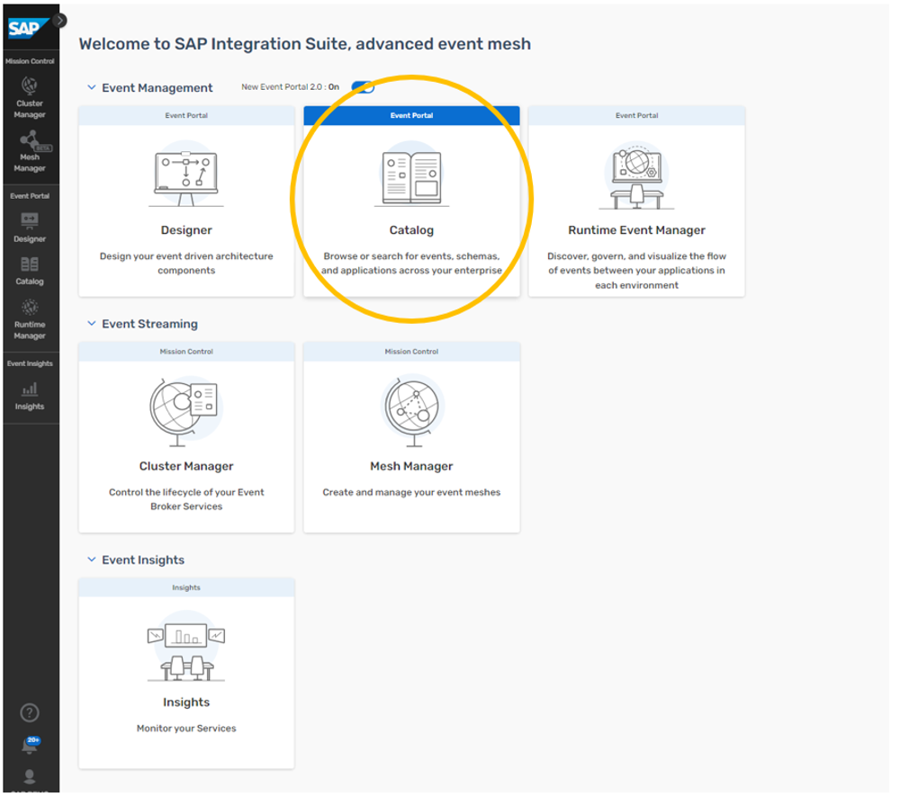

   After clicking on the Events tab, enter “Sales Order” into the search box: \
   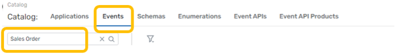\
   You will see the filtering of the live search as you type.  Next, get more specific and “Create” to the search string.  This will narrow your results to Sales Order related events: \
   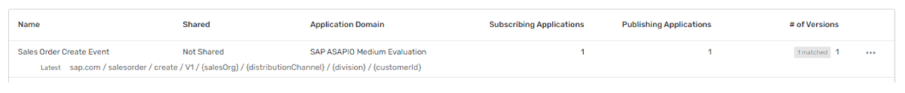\
   Finally, click on the filter icon next to the search box to see how results can be filtered further: \
   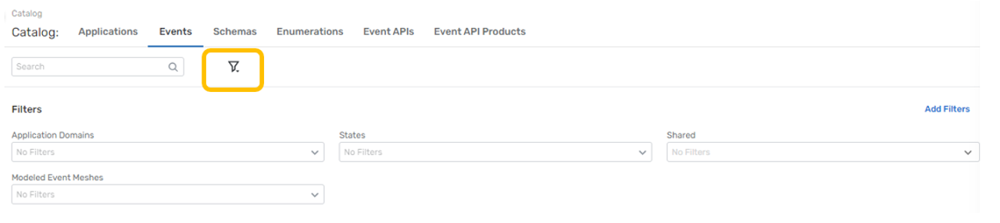
5. Visualize your imported design with a modeled event mesh.
   Event Portal includes a powerful tool called the Runtime Manager. One of the functions of this tool is to associate a domain model with a “modeled event mesh” running on your launched AEM event services. 
   This allows the Runtime Manager to display a visualization of the interactions between applications and events. \
   While there are many additional powerful features of Runtime Manager, our evaluation will focus just on visualization. \
   From the SAP AEM Console, open the Runtime Manager: \
   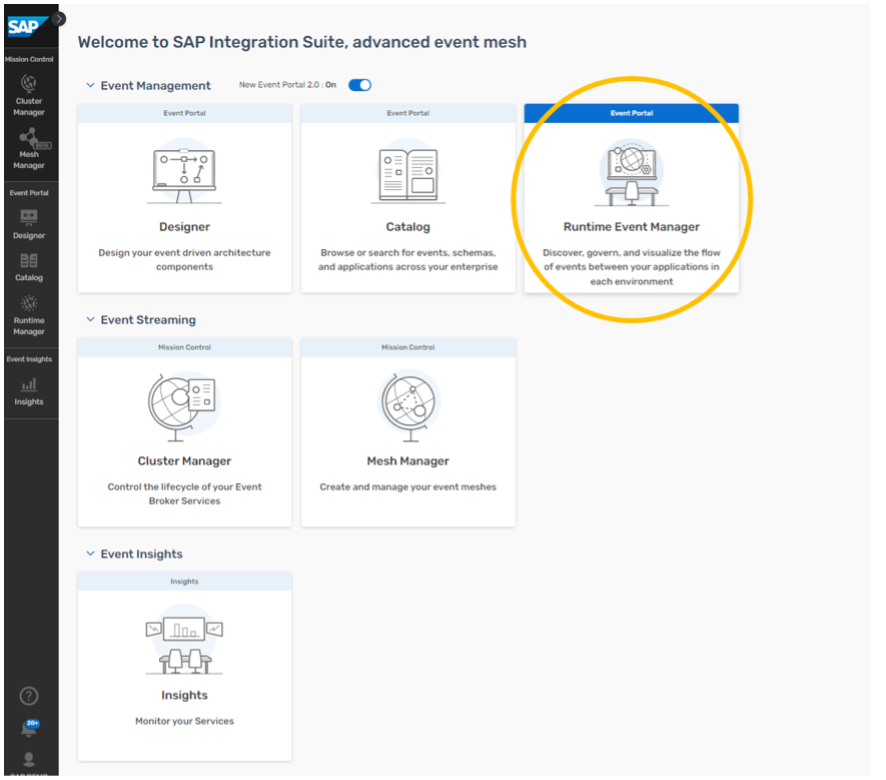\
   Click on Create Modeled Event Mesh top right: \
   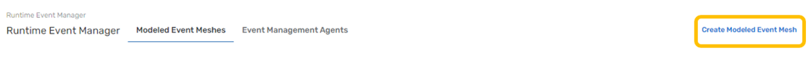\
   Enter the name of your modeled event mesh and click on Create: \
   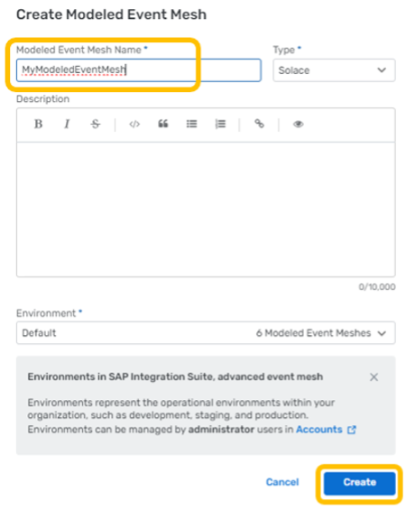\
   Now click on your MEM to open it: \
   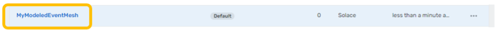\
   Note that there are no objects in your MEM. \
   In the Event Broker Connections tab, click on Connect Event Broker: \
   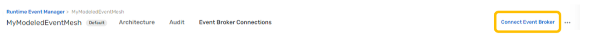\
   Use the search box to filter to your services, mark the checkboxes for both and click Add: \
   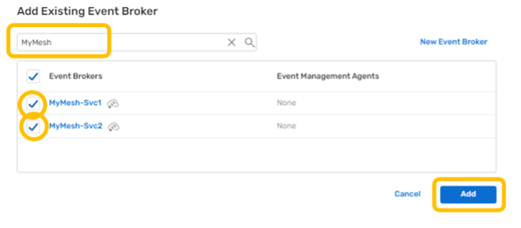\
   You will see both of your brokers listed in the modeled event mesh.  For the scope of this evaluation, we will not be exercising the Discovery Scan or Audit capabilities. \
   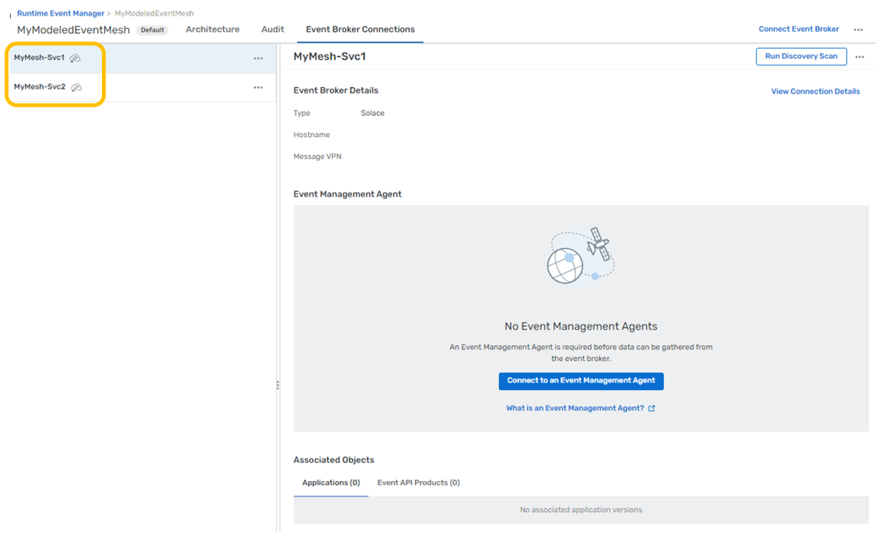

   Next, navigate back to the Designer and open the **BTP AEM Demo** domain. \
   Under the Applications tab, you will see all the modeled applications. **For each application**, perform the following actions: 
   - Click on the application’s row where it says “Standard” for application type. 
   - In the preview pane to the right, select the “Add to Environment” extended menu action for version 1.0.0 of the application object. 
   - Leaving the Default environment selected, pick your Modeled Event Mesh from the second pull down and both of your event mesh services from the Event Broker menu, then click Add.
   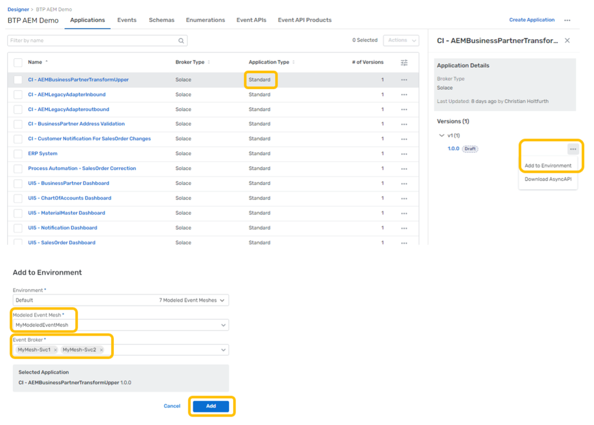\
   This will add the modeled applications to your modeled event mesh.  Since these applications reference the events, and those events reference the schemas, all of your model will now be associated with your modeled event mesh. \
   \
   Finally, navigate back to the Runtime Manager and your modeled event mesh to see the default visualization: 
   \
   The applications are connected to one another with flow lines through the events which they are exchanging. This provides an overview of the interactions being modeled by the design.\
   You can use the view controls to zoom, center and change visualization settings: \
   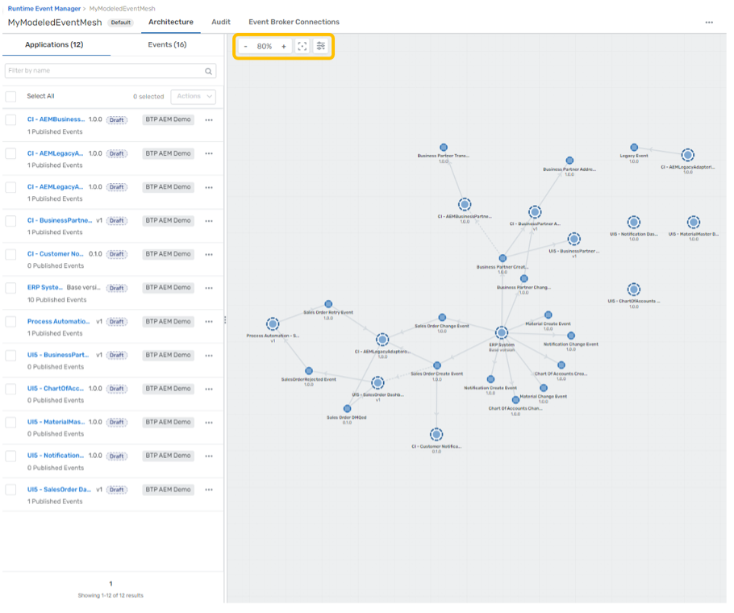\
   You can also re-arrange and save your visualization layout to organize the relationships to your preferences.  If you like the changes, click on Publish Layout to save them.
   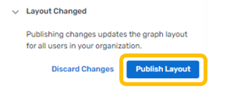

## UI5 Cards in realtime

SAP Ui5 Integration cards present a new means to expose application content to the end user in a unified way. Depending
on the use cases, cards can be easily embedded in a host environment, such as an application, SAP Build, dashboards, or
any HTML page. A variety of card types can be configured by a simple JSON configuration (schema) without the need to
write code for UI rendering. In this way, even users without programming skills are enabled to create new cards
according to their specific needs. Cards are composite controls that follow a predefined structure and offer content in
a specific context. Cards contain the most important information for a given object (usually a task or a list of
business entities). You can use cards for presenting information, which can be displayed in flexible layouts that work
well across a variety of screens and window sizes.

With the use of cards, you can group information, link to details, or present a summary. As a result, your users get
direct insights without the need to leave the current screen and choose further navigation options.

For more information on SAP Ui5 Integration cards, you can refer to the
link: [UI Integration cards](https://ui5.sap.com/test-resources/sap/ui/integration/demokit/cardExplorer/index.html)

To showcase the simplicity of using SAP integration cards to visualize the power of the SAP Advanced Event Mesh, we have
created a dashboard using HTML5 for each business scenario. We also made them easy to use. All you need to do is enter
your broker details, click "Connect," and watch the business case come to life as events flow in. Each integration card
that is displayed in the dashboard represents another tool at your fingertips to visualize your data. The cards are each
subscribed to the various Topics in which you will send your events from your SAP System. Follow the steps below to set
up your dashboard and get started.

### 1: Choose the Business Case Dashboard

Here is a portal where you can find all of the available dashboards that support the 5 business scenarios. Visit the
link below and choose the dashboard that you want to see. Here you will also find additional documentation and helpful
videos to get started with.

- [DashBoard Portal](https://solacedemo-uf1dchbp.launchpad.cfapps.ca10.hana.ondemand.com/125692ff-95ad-4b2d-a216-fde644eef1c0.DashboardPortal.DashboardPortal-1.0.0/index.html)

### 2: Connect with Your Broker Details

To connect with your broker details:

- Open your broker and select the “connect” tab at the top.
  
- Then, under the “Solace Web Messaging” section, you will find the 4 inputs you need to connect your broker to the
  dashboard.
  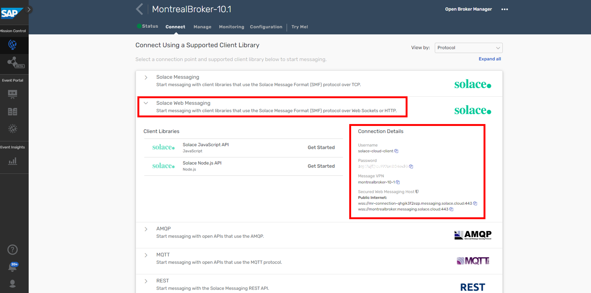
- Now, you can copy and paste each input into the fields at the top of the dashboard and then finally click “Connect”.
  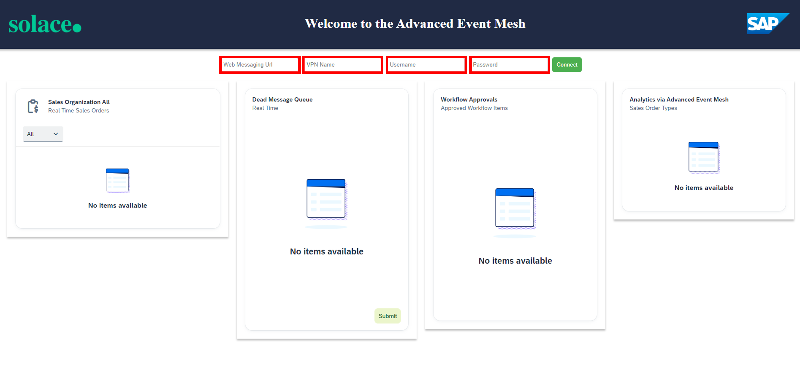
- If your credentials are entered correctly, you will get a “Success” message that will verify that you are connected
  properly to the dashboard. If you do not see a “Success” message, then try again and make sure your details are
  correct for each input.
  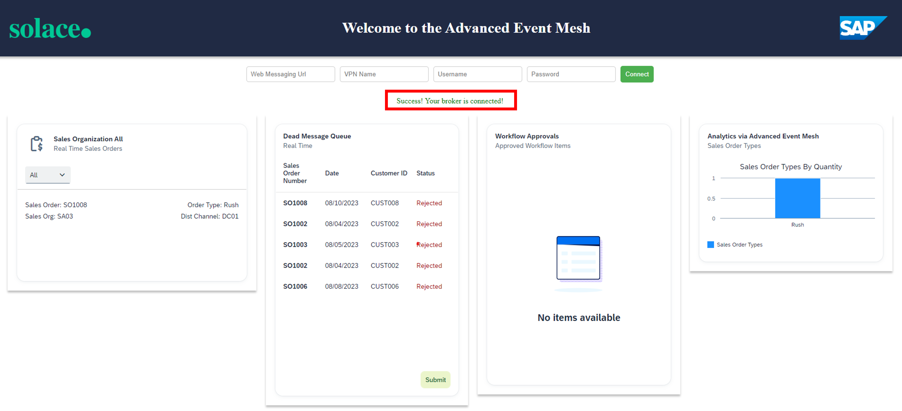

Repeat these steps for each dashboard.

### 3: Getting to Know Your Dashboard

Each dashboard has different components and scenarios to showcase the capabilities of SAP Advanced Event Mesh. For
example, in the Sales Order Dashboard, there is a card that is reading messages from a Dead Message queue. This
showcases how error handling can be achieved. Furthermore, you can submit a message from that queue to trigger an SAP
Process Automation flow with the click of a button. You'll also find different data visualization types, as well as
functional visualizations that highlight integration with other parts of SAP BTP.

### Troubleshooting

Here are some troubleshooting tips:

- Use the latest version of Chrome, and you can try opening the dashboard in “incognito” mode if you have issues with
  caching.
- If you do not see the “Success” message at the top, then you are not connected. In case you entered your credentials
  correctly and still don’t see the message, try to refresh your browser to prompt the application to try your
  credentials again. You may need to refresh a couple of times to get the “Success” message.
- If messages are being sent and the cards are not updating, right-click anywhere on the dashboard and click “inspect”.
  Then select the “console” tab and look at the logs. It may be the case that the payload format is off, or possibly
  that the events are flowing to the wrong topic. Error messages here should help.

## Takeaways

Duration: 0:07:00

✅ Import objects into the Event portal \
✅ Visualize events coming from the simulator into your broker

Thanks for participating in this codelab! Let us know what you thought in the [Solace Community Forum](https://solace.community/)! If you found any issues along the way we'd appreciate it if you'd raise them by clicking the Report a mistake button at the bottom left of this codelab.