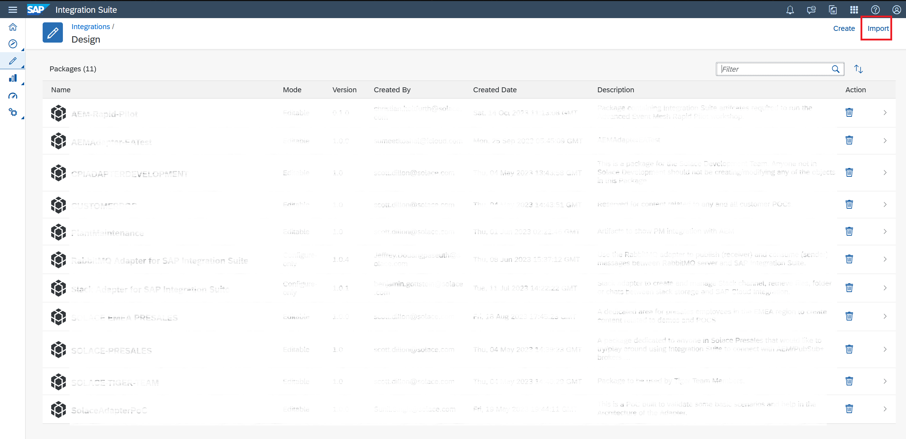
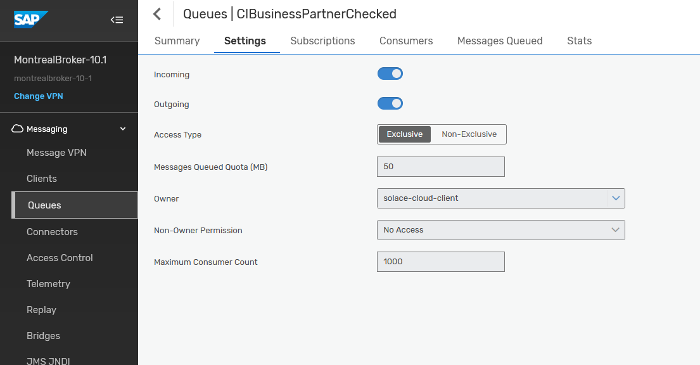
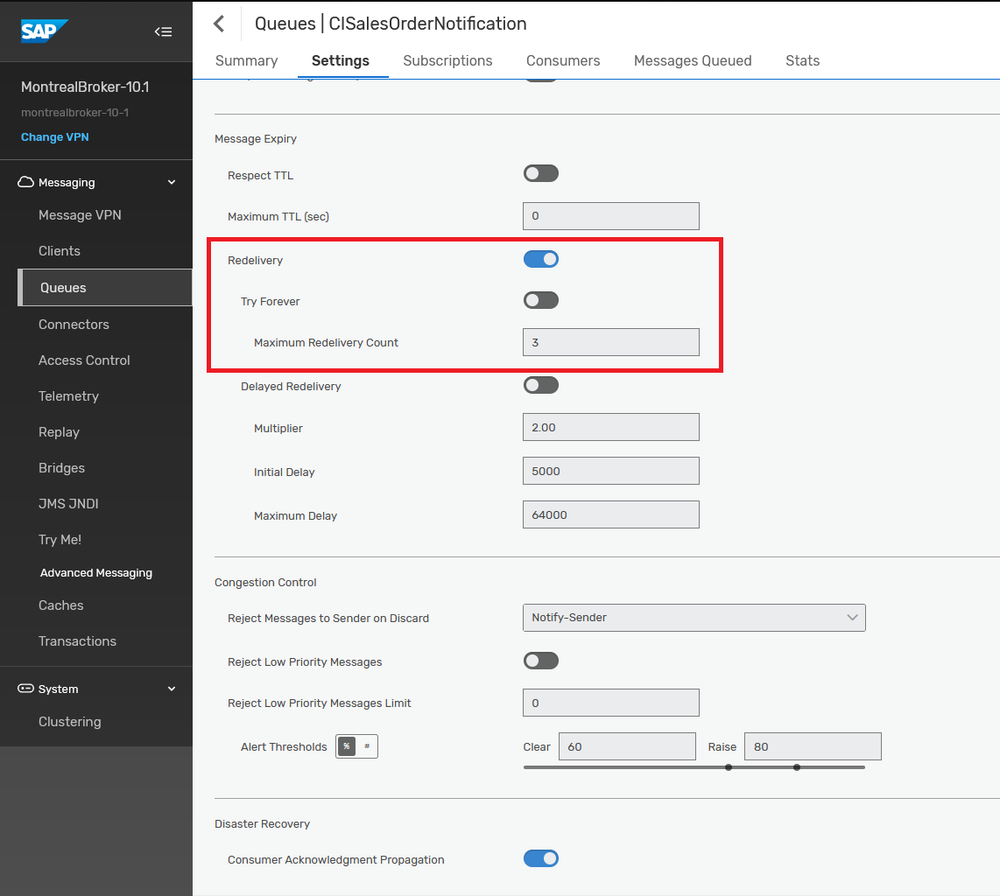
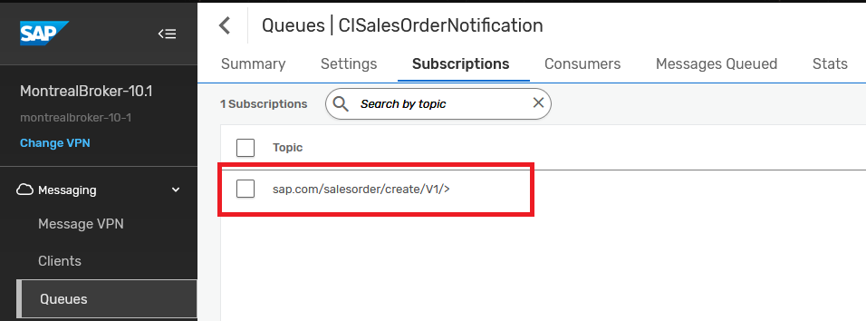
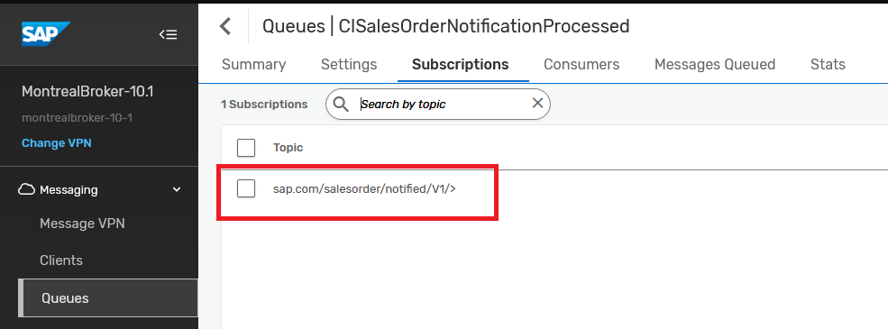
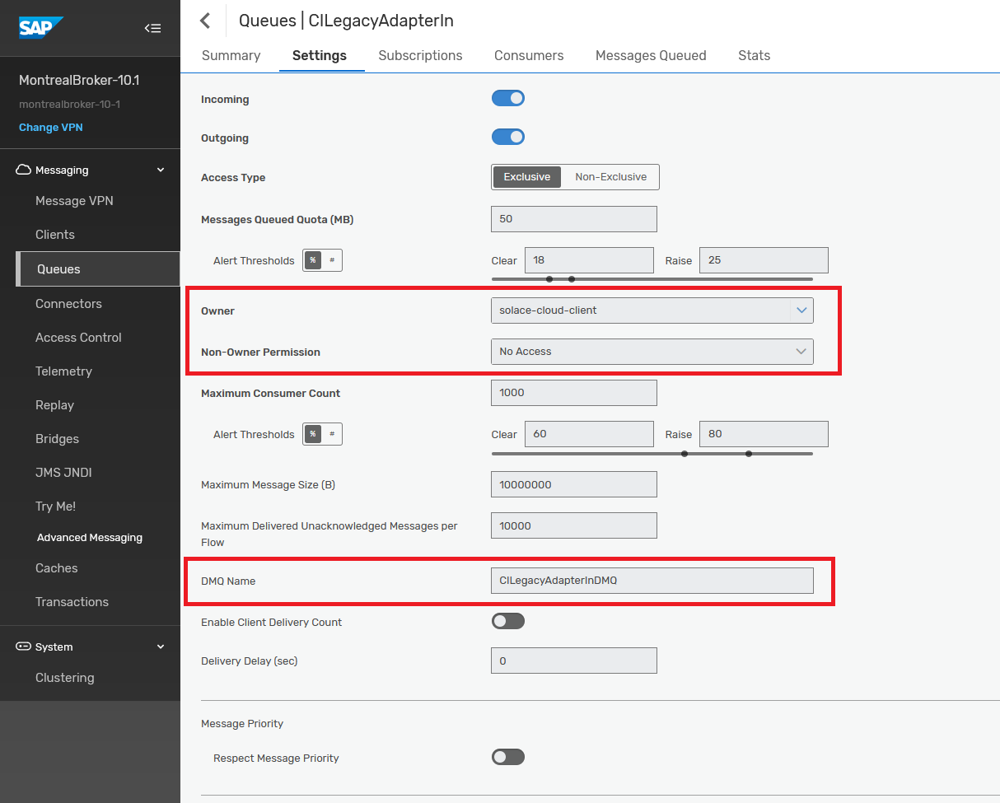
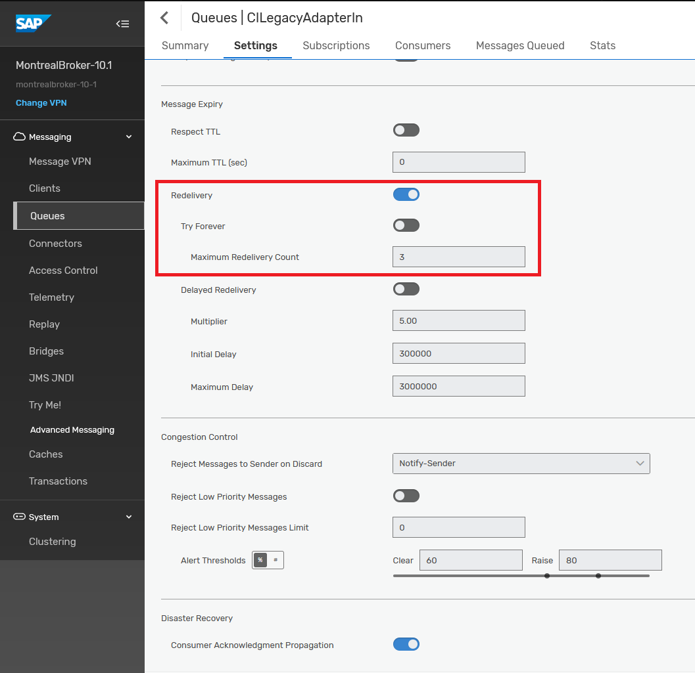
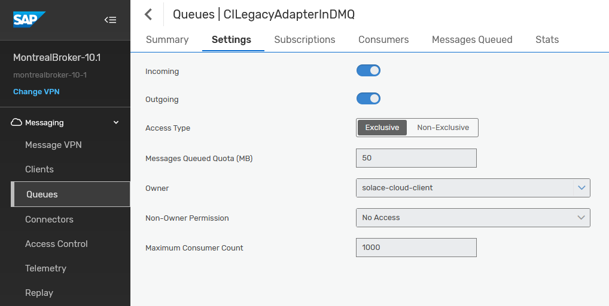
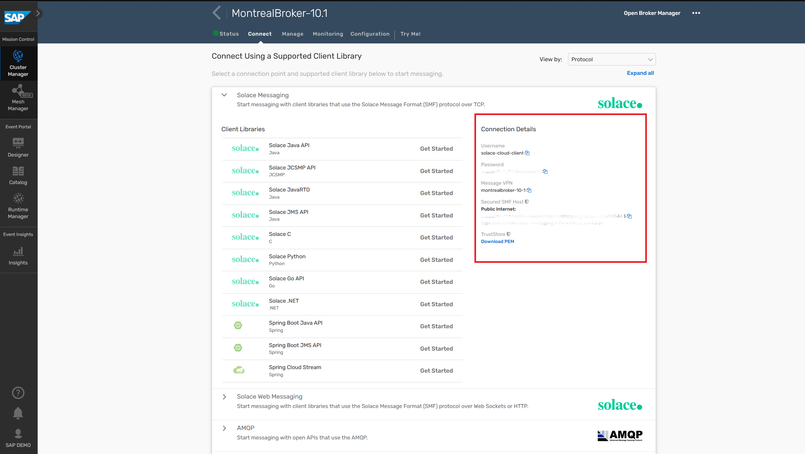
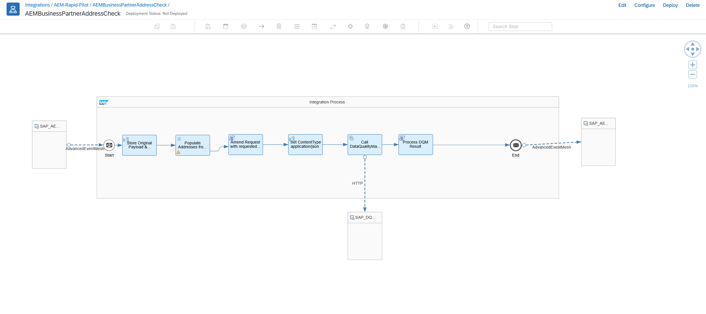

author: ChristianHoltfurth
summary: Day 3/5 : This code lab walks the participant through the experience of using SAP AEM to event enable their SAP ecosystem and workflows
id: sap-aem-int-day-3
tags: SAP, AEM, Event Portal, SAP BTP, CAPM, CPI, Cloud Integration
categories:
environments: Web
status: Hidden
feedback link: https://github.com/SolaceDev/solace-dev-codelabs/blob/master/markdown/sap-aem-int-day-3

# Event Enable SAP Using SAP Advanced Event Mesh - Day 3

## What you'll learn: Overview

Duration: 0:05:00

Day 3 of 5.
Topics covered :
- Configuring AEM brokers' queues and topic subscriptions.
- Event enabling integration flows and connecting them to AEM brokers to create event-driven integration flows.

## What you need: Prerequisites

Duration: 0:07:00

- Complete all activities in day 1 & 2. You access and use the same broker you setup previously as well as the simulator push events.
- Have access to an active Integration Suite Cloud Integration tenant.
- Have an email server and account credentials that allows smtp access if you want to send email notifications from your flow.
- Have an SFTP server and account credentials if you want to test successful integration of events to a file based interface of a legacy system.
- Have a subscription to SAP Data Quality Management for location data or permission to activate it.

## Step 1 - Set up Integration Suite and import Event Enabled Integration flows

### A) - Activate SAP Data Quality Management service in BTP

One of our iflows that we are going to deploy is invoking the SAP Data Quality Management service (DQM) to check and cleanse address data in the BusinessPartner events. For the flow to work properly, you will need a working DQM service subscription so you can configure your iflow with this. The good news, if you don't have one already, you can use a free tier subscription for this purpose.
Please follow along the steps in this [blog post](https://blogs.sap.com/2022/02/15/getting-started-with-sap-data-quality-management-microservices-for-location-data-btp-free-tier/) by Hozumi Nakano to active the service.

### B) - Download and import the AEM adapter for integration suite

A new Advanced Event Mesh specific adapter will be made available in November 2023. If you already have this enabled in your Integration Suite environment, you can skip this step.
Otherwise, follow the steps in this section to get a preview of the soon to be released AEM adapter:
- Download [Integration Suite AEM Adapter](artifacts/AEM-Adapter-EA.zip)
- Import the AEM adapter into your Integration Suite tenant.

### C) - Download and import the template integration flows package

<!---
Download [AEMBusinessPartnerAddressCheck.zip](artifacts/cloud-integration-flows/AEMBusinessPartnerAddressCheck.zip), [AEMLegacyOutputAdapter.zip](artifacts/cloud-integration-flows/AEMLegacyOutputAdapter.zip) & [AEMSalesOrderNotification.zip](artifacts/cloud-integration-flows/AEMSalesOrderNotification.zip)
-->
Download [AEM-Rapid-Pilot.zip](artifacts/AEM-Rapid-Pilot.zip)
- Import AEM-Rapid-Pilot.zip as a new package into your Integration Suite tenant:
	

## Step 2 - Setup/configure SAP AEM

Create input queues for your integration flows:
- Go to Cluster Manager -> <your service> -> Manage -> Queues - to open the Broker UI

1. For the AEMBusinessPartnerAddressCheck flow, create:
    * CIBusinessPartnerChecker
      
      
      *Add the following subscriptions to the queue
      

    * CIBusinessPartnerCheckerDMQ
      
    * CIBusinessPartnerChecked (optional - if you want to see the output)
      
      *Add the following subscriptions to the queue
      
	  > Notice the second subscriptions that starts with `!` ?  
	  > This is called a topic exception and removes any events matching topic subscription `sap.com/businesspartner/addressChecked/V1/*/*/Invalid` from the previously matched list of events matched by `sap.com/businesspartner/addressChecked/V1/>`. This is a really handy feature to exclude subsets of events matched by a larger topic subscription. See [link](https://docs.solace.com/Messaging/SMF-Topics.htm) for more details on Solace's topic syntax.
    * CIBusinessPartnerInvalid (optional - if you want to see the output)
      
      *Add the following subscriptions to the queue
      

2. For the AEMSalesOrderNotification flow, create:
    * CISalesOrderNotification
      
      
      *Add the following subscriptions to the queue
      

    * CISalesOrderNotificationProcessed (optional - if you want to see the output)
      
      *Add the following subscriptions to the queue
      

3. For the AEMLegacyOutputAdapter flow, create:
    * CILegacyAdapterIn
      
      
      *Add the following subscriptions to the queue
      

    * CILegacyAdapterInDMQ
      

## 3 - Setup/configure dependency services

1. For AEMBusinessPartnerAddressCheck
    * Activate SAP's Data Quality Management Service (DQM) by following
      this [blog](https://blogs.sap.com/2022/02/15/getting-started-with-sap-data-quality-management-microservices-for-location-data-btp-free-tier/)
2. For AEMSalesOrderNotification
    * You'll need an external email service to be able to automatically send emails, details like smtp server address,
      username (email) and password.
3. For AEMLegacyOutputAdapter
   > The legacy output adapter is simulating appending events to a file via an SFTP adapter, which could be imported to
   a legacy system. The actual flow doesn't require a working sftp destination as it's just being used to simulate a
   failure to demonstrate the retry and error handling capabilities of AEM. The flow will try a few times to deliver
   each event to the SFTP destination. After 3 failed attempts messages will be moved to a Dead Message Queue for manual
   processing by a UI5 and Business Process Automation workflow.

   > If, after successful demonstration of the error handling, you would still like to see a successful delivery of
   events to a file via sftp, you will need an sftp server and sftp credentials to configure the flow with a valid
   endpoint (sftp server address and username password) and import the ssh identidy into .

## 4 - Configure your Integration Suite flows

One more thing, before we jump back into Integration Suite: Let's head to our Advanced Event Mesh Console and go to Cluster Manager, select the service that you want to connect your Integration Suite flows to and go to the "Connect" tab. Take a note of the connectivity details underneath "Solace Messaging" (click on the section to open it up):

> The connect tab lists all the various connectivity details for the various supported protocols. Our Cloud Integration AEM adapter uses the Solace Messaging protocol, which is AEM's very own protocol with a broad feature support.
> Each AEM service also comes with a default client user called `solace-cloud-client` that is configured for convenience reasons and is allowed to publish and subscribe to all topics. We will be using this user for all our iflows. In a real production environment where security is important, you or your administrator will likely have this user disabled and will be creating separate users for each of the applications that connect to the AEM broker. Or this may even be deferred to an external authentication service over LDAP or OAuth.

Now that we have set up all the prerequisites for our Integration Suite flows, we can take a look at the individual flows and prepare them for deployment.

1. Let's take a look at the AEMBusinessPartnerAddressCheck iflow:

> This flow receives Business Partner Create and Change events and invokes the Data Quality Management Service in BTP to check and correct the addresses inside the Business Partner event payload. It does this by  
> a) Storing the original event payload in an environment variable.
> b) Populating the DQM request payload with the addresses in the input event.
> c) Invoking the DQM service over REST and 
> d) Parsing the response, checking whether the DQM service evaluated the input addresses to be Valid, Invalid, Blank or has Corrected them.
> e) Merging any corrected addresses back into the original payload.
> f) And finally publishing the result back as a new event to the AEM broker with an updated topic in the format: 
> `sap.com/businesspartner/addressChecked/V1/{businessPartnerType}/{partnerId}/{addressCheckStatus}`

## 5 - Deploy your integration flows

## Takeaways

Duration: 0:07:00

✅ < Fill IN TAKEAWAY 1>   
✅ < Fill IN TAKEAWAY 2>   
✅ < Fill IN TAKEAWAY 3>   

Thanks for participating in this codelab! Let us know what you thought in the [Solace Community Forum](https://solace.community/)! If you found any issues along the way we'd appreciate it if you'd raise them by clicking the Report a mistake button at the bottom left of this codelab.
