author: ChristianHoltfurth
summary: Day 3/5 : This code lab walks the participant through the experience of using SAP AEM to event enable their SAP ecosystem and workflows
id: sap-aem-int-day-3
tags: SAP, AEM, Event Portal, SAP BTP, CAPM, CPI, Cloud Integration
categories:
environments: Web
status: Hidden
feedback link: https://github.com/SolaceDev/solace-dev-codelabs/blob/master/markdown/sap-aem-int-day-3

# Event Enable SAP Using SAP Advanced Event Mesh - Day 3

Overall Duration: 2:20:00

## What you'll learn: Overview

Duration: 0:01:00

Day 3 of 5.
Topics covered :
- Configuring an AEM brokers' queues and topic subscriptions.
- Event enabling integration flows and connecting them to AEM brokers to create event-driven integration flows.
- How to use the broker's config APIs to automate configuration and enable CI/CD pipelines.
- Fine-grained security access in AEM.

## What you need: Prerequisites

Duration: 0:09:00

- Complete all activities in day 1 & 2. <br>You access and use the same broker you setup previously as well as the simulator to push events for testing.
- Have access to an active Integration Suite Cloud Integration tenant.
- Have an SFTP server and account credentials if you want to test successful integration of events to a file based interface of a legacy system **(optional)**.
- Access to SAP Data Quality Management for location data via a provided service instance (by your hosts) or permission to activate or use your own instance.<br> (We'll show you how to activate one, if you don't have it already). **(optional)**


## Set up Integration Suite and Import Event Enabled Integration Flows

Duration: 0:20:00

### A) Download and import the template integration flows package

Download [AEM-Rapid-Pilot-day3.zip](https://github.com/SolaceLabs/aem-sap-integration/blob/main/deployable/IS-artifacts/AEM-Rapid-Pilot-day3.zip)
- Import AEM-Rapid-Pilot-day3.zip as a new package into your Integration Suite tenant:
	

### B) Importing the official SAP AdvancedEventMesh Adapter into your CI tenant
>aside negative A new Advanced Event Mesh specific adapter was made available in January 2024. If you haven't used this adatper in your CI tenant before, you may need to import it once. Follow these steps to get the official adapter from SAP. <br>

- Navigate to your newly imported package: AEM-Rapid-Pilot-day3.
- Take a copy of the AEMLegacyOutputAdapter flow.
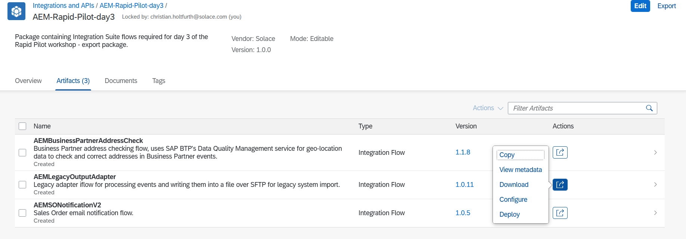
- Choose a new name. (Accepting the default of `AEMLegacyOutputAdapter_copy` will do.)
- Then open and edit your copy named  `AEMLegacyOutputAdapter_copy` or similar.
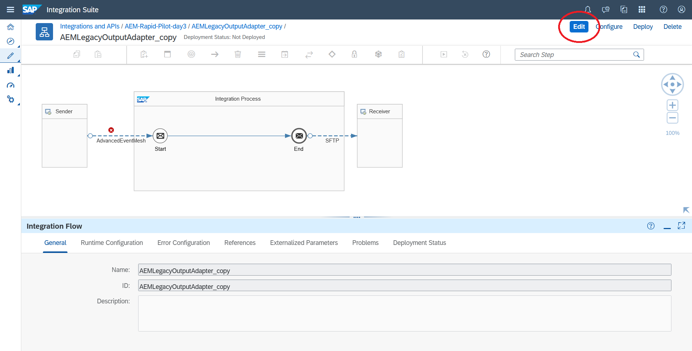
- Select the line named AdvancedEventMesh and delete it by clicking on the rubbish bin icon that appears.
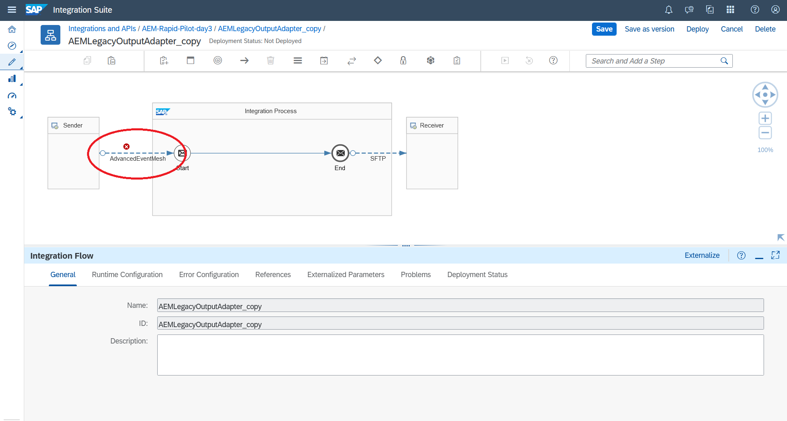
- After deletion, select the connector tool from the top and reconnect the Sender box to the Start icon.
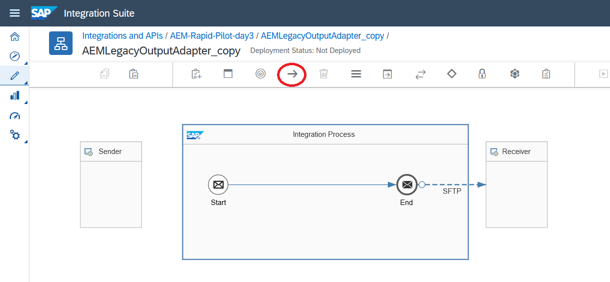
- You should see a pop up appear in which you can select the AdvancedEventMesh adapter. Selecting this should pull the SAP version of this adapter into your CI tenant.

That's it, we should now be good to proceed.
(You can cancel the changes in your copy `AEMLegacyOutputAdapter_copy` or similar and delete the copy of the flow now.)

>aside negative Skip over C) if you have successfully completed this step.

### C) Download and import the AEM adapter for Integration Suite

>aside negative A new Advanced Event Mesh specific adapter was made available in January 2024. <br>
**Only follow this step if you can't see the AdvancedEventMesh adapter in your Integration Suite tenant or if you want to use the preview version (provided) instead.** <br>
	In that case, follow the steps in this section to get a preview of the AEM adapter:<br>
	- Download [Integration Suite AEM Adapter](https://github.com/SolaceLabs/aem-sap-integration/blob/main/deployable/IS-artifacts/AEM-Adapter-EA-10-16.zip)<br>
	- Import the AEM adapter into your Integration Suite tenant and deploy this adapter.

Import the adapter into your package.


Extract the downloaded zip and select the .esa file in the upload dialog. Runtime Profile should be Cloud Integration. (You should not be seeing the warning message `Integration adapter with the ID 'AdvancedEventMesh' already exists`. If you do, then you can skip this step as the adapter has already been made available to you.)


Deploy the adapter after import.


See  [SAP documentation](https://help.sap.com/docs/integration-suite/sap-integration-suite/importing-custom-integration-adapter-in-cloud-foundry-environment#procedure) for more detailed instructions


## Scenario 1 - SalesOrder: AEMLegacyOutputAdapter (mandatory)
Duration: 0:30:00

### Setup/configure SAP AEM broker service

In this section we will create the required input queues for your integration flows.
- Go to Cluster Manager -> {your service} -> Manage -> Queues - to open the Broker UI


To create the queues in the next sections, repeatedly click on the "+ Queue" button to bring up the create queue dialog.


Provide the name as given (in the next sections).


Open up the "Advanced Queue Settings" section, then follow along and provide the details as showing in the screenshots below.


Create the following queues and provide the details as given.

#### 1. CILegacyAdapterIn queue
- Name: `CILegacyAdapterIn`
- Owner: `solace-cloud-client`
- Non-Owner Permission: `No access`
- DMQ Name: `CILegacyAdapterInDMQ`
- Redelivery: `enabled`
- Try Forever: `disabled`
- Maximum Redelivery Count: `3`


- Once the queue is created, click on the queue name in the list, navigate to the Subscriptions tab and open the subscriptions dialog.


- Add the following subscriptions to the queue
 - `sap.com/salesorder/create/V1/>`
 - `sap.com/salesorder/change/V1/>`
 - `sap.com/salesorder/retry/V1`
 - `salesorder/retry/V1`


#### 2. CILegacyAdapterInDMQ queue
- Name: `CILegacyAdapterInDMQ`
- Owner: `solace-cloud-client`
- Non-Owner Permission: `No access`


Now, before we jump back into Integration Suite: Let's head to our Advanced Event Mesh Console and go to Cluster Manager, select the service that you want to connect your Integration Suite flows to and go to the "Connect" tab. Take a note of the connectivity details underneath "Solace Messaging" (click on the section to open it up):

We will need them in the next steps when configuring our flows.

> The connect tab lists all the various connectivity details for the various supported protocols. Our Cloud Integration AEM adapter uses the Solace Messaging protocol, which is AEM's very own protocol with a broad feature support.
> Each AEM service also comes with a default client user called `solace-cloud-client` that is configured for convenience reasons and is allowed to publish and subscribe to all topics. We will be using this user for all our iflows. In a real production environment where security is important, you or your administrator will likely have this user disabled and will be creating separate users for each of the applications that connect to the AEM broker. Or this may even be deferred to an external authentication service over LDAP or OAuth.

Now that we have set up all the prerequisites for our Integration Suite flows, we can take a look at the individual flows and prepare them for deployment.


### Configure Your Integration Suite Flow

### Security Configuration
Let's configure the security details we will need to connect to the various services like AEM & SFTP server.
- Go to Integration Suite Monitor Artifacts -> Manage Security -> Security Material.

- In here, create security credentials for your AEM broker service, and SFTP server (sftp optional).
- Create SecureParameter `CABrokerUserPass` and store the password for your `solace-cloud-client` application user credentials.
- Create UserCredentials `sftpuser` and store SFTP servers user and password credentials (these can be prepopulated with dummy values for now).

### Configure/Deploy AEMLegacyOutputAdapter
#### 1. Let's take a look at the AEMLegacyOutputAdapter iflow:


This flow is really straightforward. It receives Sales Order events and appends them to a file over SFTP. This could be used for legacy system integration (as the name suggests) for systems that do not have capabilities to receive data/events in an event-driven fashion and instead are relying on batch-based file imports. AEM + CI could send all relevant events in real-time to the file and the downstream legacy system can then simply consume the file in batch intervals (or potentially triggered by a file detector if available), move/delete the import file and AEM + CI will simply create a new one as soon as the next event arrives.<br>
Now we are going to use this simple flow to demonstrate the error handling capabilities of AEM.
The flow will try to send events to a file, but we have deliberately misconfigured to SFTP adapter to point to an invalid destination, so all messages delivery attempts will fail and trigger the AEM adapter's retry behaviour.<br>
Once the max configured retry attempts are exceeded, the AEM broker will move the message to a configured DMQ for exception processing.<br>
Let's take a look at some of the relevant settings of the AEM adapter that control this behaviour.


Let's look at these settings one by one:<br>
1) Acknowledgement Mode: "Automatic on Exchange Complete"<br>
The most important setting when it comes to not accidentally acknowledging and therefore removing a message from the broker's queue. This setting tells the flow/AEM adapter to only acknowledge (ack) the message after the flow has successfully completed processing the message. If any in the processing occurs, the AEM adapter will instead send a negative acknowledgment back (nack) to tell the broker to keep the message and retry it, because it couldn't be successfully processed by the flow. The alternative is to immediately ack the message when it's received, which will always result in the message being removed from the queue even if the flow fails to successfully process the message. (!!)<br>
2) Settlement Outcome After Maximum Attempts: "Failed"<br>
This setting controls the nack type and behaviour, we have two options here:<br>
	a) Failed, which will nack the message back to the broker and let's the broker check the retry count of the message to trigger retries based on the queue settings and only sending messages to DMQ when the retry count on the message has exceeded the max retry settings on the queue.<br>
	b) Rejected, which will nack the message telling the broker to immediately move the message to DMQ when the AEM adapter settings (Maximum Message Processing Attempts) are exceeded irrespective of queue settings.<br>
3) Max. Message Processing Attempts: 2<br>
Controls how often we want to retry a message inside the iflow before we "give up" and pass it back to the broker.<br>
4) Retry interval, Max Retry Interval and Exponential Backoff Multiplier<br>
These are all settings that control how quickly we want to retry and whether we want to incremently increase our retry delay with each failure. A good retry delay value prevents the iflow from repeatedly retrying a message within a few milli-seconds and gives some time for transient error situations to clear before we retry.

Note that the error handling and retry settings go hand-in-hand with the DMQ and retry settings on the input queue for this flow (queue retry settings multiply with the internal retry settings in the iflow, e.g. if the iflow tries 2 times internally every time we pass it a message and the broker is configured to retry the same message 3 times to the broker, then we might get 8 executions before the message is actually stopped being processed and moved to the DMQ [(1 initial attempt + 3 times retry) * 2 times retry inside the iflow = 8 processing attempts]):


> aside negative
> Note: The delayed redelivery settings on the queue are not currently used by the AEM adapter. We can only set these settings in the adapter itself, but the queue needs to have a DMQ configured, a max redelivery count set (as opposed to retrying forever) and the events/messages have had to be published as DMQ eligible by the publisher.

#### 2. Configuring and deploying  the AEMLegacyOutputAdapter iflow:

Remember the connectivity details for our AEM broker from the previous step?
We will need those now.


- Hit configure at the top right and fill in the details to connect to your AEM broker service:


- Then hit deploy at the bottom right.

#### 3. Check that your flow was deployed successfully and fix if necessary.
- Go to Monitor Artifacts -> Manage Integration Content -> All. <br>
You should be seeing the AEMLegacyOutputAdapter flow as Started, similar to this view:

- Go to your AEM Console and navigate to Cluster Manager -> {your service} -> Manage and click on the Queues tile:

- Check that the AEMLegacyOutputAdapter input queue has at least one consumer connected to it.


### Complete the success path for this scenario **(optional step for later)**

> aside negative
> Only complete this step *after* you have seen the flow interact end to end with the UI5 components and the BPA process in this Dead Message Queue (DMQ) error handling scenario.

The legacy output adapter is simulating appending events to a file via an SFTP adapter, which could be imported to a legacy system. **The workshop scenario doesn't require a working sftp destination**, as we are using this iflow to simulate a failure to demonstrate the retry and error handling capabilities of AEM. The iflow will try a few times to deliver each event to the SFTP destination. After 3 failed attempts messages will be moved to a Dead Message Queue for manual  processing by a UI5 and Business Process Automation workflow.

> aside negative
> If, **AFTER** successful demonstration of the error handling, you would still like to see a successful delivery of events to a file via sftp, you will need an sftp server and sftp credentials to configure the flow with a valid endpoint (sftp server address and username password) and import the ssh identidy into .

### Security Configuration
Let's go back and configure the security details we will need to connect to the SFTP server.
- Go to Integration Suite Monitor Artifacts -> Manage Security -> Security Material.

- Update UserCredentials `sftpuser` and store your SFTP servers user and password credentials.
- You may also need to create a known.hosts file, populate it with your SFTP server's ssh id if you want to complete this optional step of successfully sending events to a file via SFTP (success path of the AEMLegacyOutputAdapter flow). See [this post](https://blogs.sap.com/2017/09/26/how-to-generate-sftp-known_host-file-cloud-platform-integration/) by Pravesh Shukla if you need help with this step.

### Configure and Deploy your iflows
Go back to your iflow, reconfigure the SFTP adapter with your SFTP servers address and redeploy.

## Automation of AEM setup via APIs and CI/CD (optional)
Duration: 0:15:00
### Advanced Event Mesh APIs & CI
All configuration within AEM can be automated using a combination of two APIs:
- AEM Cloud API (for any configuration on the AEM Cloud Console)
- The broker's SEMP API (for any configuration on the broker service directly)

The documentation of these APIs can be found in the AEM docs [here](https://help.pubsub.em.services.cloud.sap/Cloud/gqs_building_apps.htm)

Both these APIs are RESTful and can be used in numerous ways to pull/push configuration like queues and client configuration throught CI/CD pipelines or configure/promote Event Portal content in step with code promotion from environment to environment.

### Sample CI/CD Configuration Tool
There are many options/tools that can be used to automate these tasks, like Jenkins, Ansible, scripts, Terraform etc. For the purpose of this exercise we are going to use a sample application written in CAP that has the nice advantage of running in our browser that we can point at our broker's API and feed some configuration files.
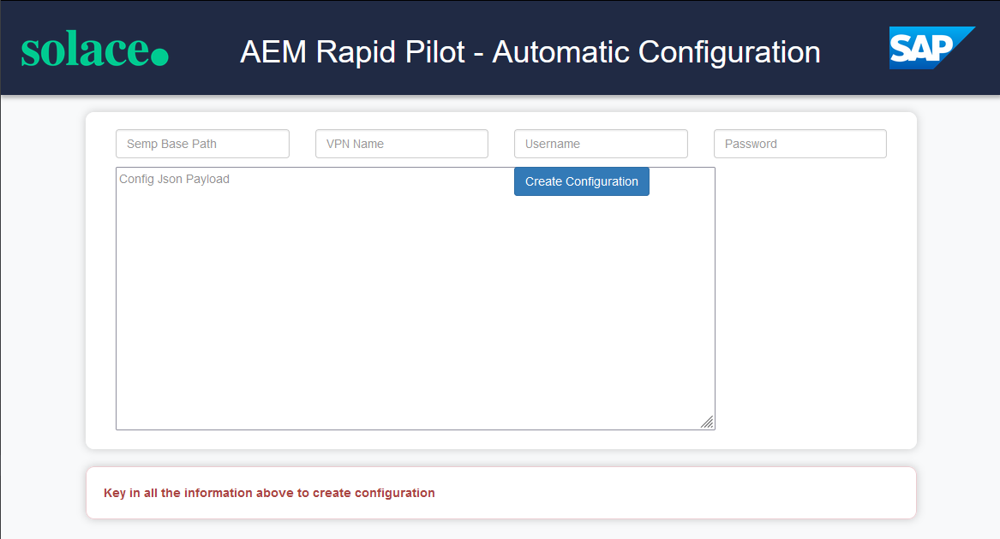

### Pushing AEM Configuration for Scenario 2 & 3
Here we will look at one example for automating our broker configuration for scenario 2 & 3 respectively, which will save us some time not having to repeat similar configuration steps like in scenario 1 again and again.

The AEM Rapid Pilot - Automatic Configuration can be accessed [here](https://rapid-pilot-createconfig-quiet-elephant-yt.cfapps.ca10.hana.ondemand.com/)

We will need some details from your AEM service again to connect the configuration tool with your AEM service. Let's head to our Advanced Event Mesh Console and go to Cluster Manager, select the service that you want to connect your Integration Suite flows to and go to the "Manage" tab. Take a note of the connectivity details underneath "SEMP - REST API" (click on the section to open it up):
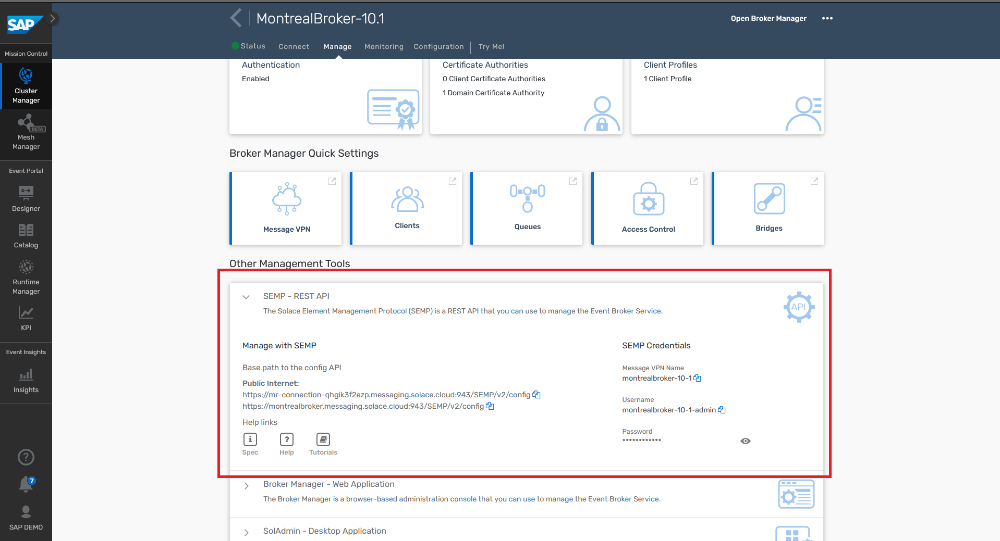

And copy & paste the URL, vpn name, admin username and password into the config tool:
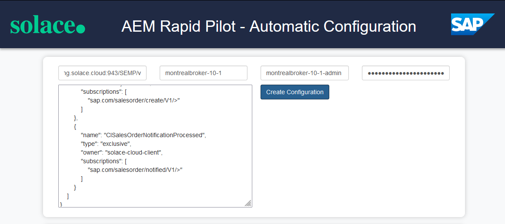

Please download the configuration file from [AEM configuration file](https://github.com/SolaceLabs/aem-sap-integration/blob/main/AEMConfiguration/AEMConfigDay3-scenario_2_and_3.json) and copy & paste the content into the "Config JSON Payload" input field.

Hit "Create Configuration" to apply this config to your broker.

## Scenario 2 - SalesOrder: AEMSONotificationV2 (mandatory)
Duration: 0:30:00

### Setup/Configure Dependency Services
We will give you connectivity details to one of our brokers where we have an iflow deployed that is configured to send emails via an external email service to enable us to automatically send welcome/confirmation emails.

### Setup/configure SAP AEM broker service

> aside negative
> **You can skip over this step for configuring the AEM queues if you have used the CI/CD tool in section 5 to automate the configuration in the previous step. Resume with the Integration Suite flow configuration next.**

In this section we will create the required input queues for your integration flows.
- Go to Cluster Manager -> {your service} -> Manage -> Queues - to open the Broker UI


To create the queues in the next sections, repeatedly click on the "+ Queue" button to bring up the create queue dialog.


Provide the name as given (in the next sections).


Open up the "Advanced Queue Settings" section, then follow along and provide the details as showing in the screenshots below.


Create the following queues and provide the details as given.


#### 1. CISalesOrderNotification queue
- Name: `CISalesOrderNotification`
- Owner: `solace-cloud-client`
- Non-Owner Permission: `No access`
- Redelivery: `enabled`
- Try Forever: `disabled`
- Maximum Redelivery Count: `3`


- Once the queue is created, click on the queue name in the list, navigate to the Subscriptions tab and open the subscriptions dialog.


- Add the following subscriptions to the queue
 - `sap.com/salesorder/create/V1/>`


#### 2. CISalesOrderNotificationProcessed queue <br>(optional - if you want to see/check the output of the flow)
- Name: `CISalesOrderNotificationProcessed`
- Owner: `solace-cloud-client`
- Non-Owner Permission: `No access`


- Once the queue is created, click on the queue name in the list, navigate to the Subscriptions tab and open the subscriptions dialog.


- Add the following subscriptions to the queue
 - `sap.com/salesorder/notified/V1/>`


### Configure Your Integration Suite Flow
>aside negative
> **Continue here, if you have completed the CI/CD section or configured your queues manually in the step above.**

One thing, before we jump back into Integration Suite: Let's head to our Advanced Event Mesh Console and go to Cluster Manager, select the service that you want to connect your Integration Suite flows to and go to the "Connect" tab. Take a note of the connectivity details underneath "Solace Messaging" (click on the section to open it up):

We will need them in the next steps when configuring our flows.

> The connect tab lists all the various connectivity details for the various supported protocols. Our Cloud Integration AEM adapter uses the Solace Messaging protocol, which is AEM's very own protocol with a broad feature support.
> Each AEM service also comes with a default client user called `solace-cloud-client` that is configured for convenience reasons and is allowed to publish and subscribe to all topics. We will be using this user for all our iflows. In a real production environment where security is important, you or your administrator will likely have this user disabled and will be creating separate users for each of the applications that connect to the AEM broker. Or this may even be deferred to an external authentication service over LDAP or OAuth.

Now that we have set up all the prerequisites for our Integration Suite flows, we can take a look at the individual flows and prepare them for deployment.

### 0) - Security Configuration
Let's configure the security details we will need to connect to the various services like AEM & email service iflow's AEM broker.
- Go to Integration Suite Monitor Artifacts -> Manage Security -> Security Material.

- In here, create security credentials for your AEM broker service **(if not already done)** & email server.
- Create SecureParameter `CABrokerUserPass` and store the password for your `solace-cloud-client` application user credentials.
- Create another SecureParamter `email-profile-pwd` and store the password we have handed out in the workshop.


### Configure/Deploy AEMSONotificationV2
#### 1. Let's take a look at the AEMSONotificationV2 iflow:
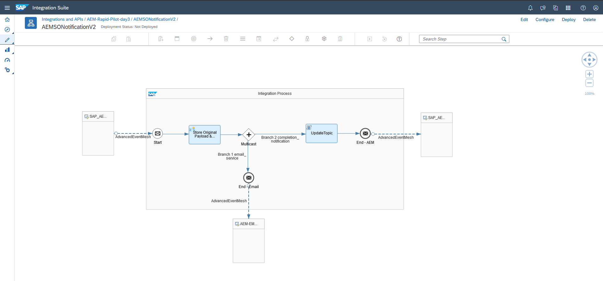

This flow gets triggered by Sales Order events and does two things:<br>
a) It creates an email request and by forwarding this event to an email service iflow on another broker (hosted by us) on topic `sap.com/emailnotification/created/V1`.<br>
b) It sends a new event to `sap.com/salesorder/notified/V1/{salesOrg}/{distributionChannel}/{division}/{customerId}` to indicate that the email request was successfully forwarded.

#### 2. Configuring and deploying  the AEMSONotificationV2 iflow:
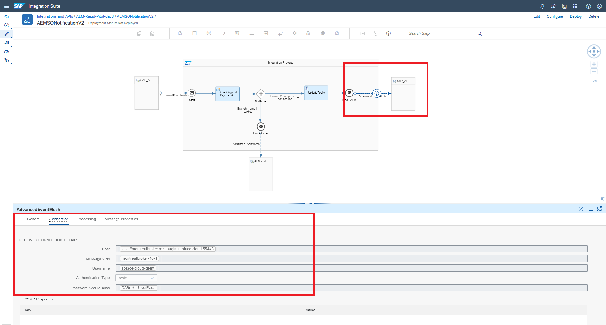
- Populate the connection details for the AEM broker service to send an event to the AEM broker provided by us whenever the flow successfully sends a notification email.
- Hit configure at the top right and fill in the details to connect to your AEM broker service:

>aside negative
> **If you get confused about which parts of your iflow to connect to your broker and which ones to connect to our broker, remember this simple rule:<br>
> The sender and receiver (left and right of your iflow) connect to your broker.
> The connector down at the bottom connects to our, from your point of view external, broker.**

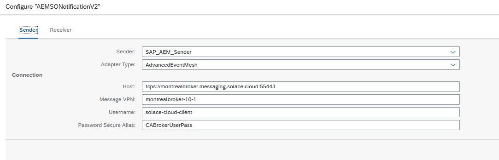
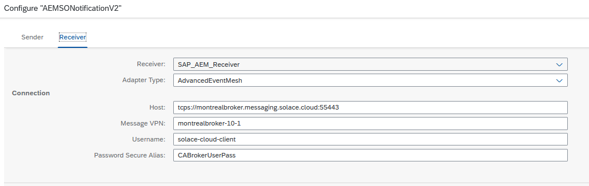
- No need to configure the adapter connecting to our email service, we've prepopulated this one and we have already deployed the necessary security configuration in the step above.
- Then hit deploy at the bottom right.

#### 3. Check that your flow was deployed successfully and fix if necessary.
- Go to Monitor Artifacts -> Manage Integration Content -> All. <br>
You should be seeing the AEMSONotificationV2 flow as Started, similar to this view (instead of AEMSalesOrderNotification, you should see AEMSONotificationV2):


- Go to your AEM Console and navigate to Cluster Manager -> {your service} -> Manage and click on the Queues tile:


- Check that the AEMSalesOrderNotification input queue has at least one consumer connected to it.


## Scenario 3 - BusinessPartner: AEMBusinessPartner AddressCheck (optional)
Duration: 1:00:00

### Setup/Configure Dependency Services

One of our iflows that we are going to deploy is invoking the SAP Data Quality Management service (DQM) to check and cleanse address data in the BusinessPartner events. For the flow to work properly, you will need a working DQM service subscription so you can configure your iflow with this.
For completing this section, you have two options:

#### A) Use DQM service credentials provided by us during the workshop

SAP is providing us with a credentials for a SAP owned DQM service instance.
We will hand out the token and connectivity details to our DQM service, which can use instead.

#### B) Alternative: Activate your own SAP Data Quality Management service in BTP

> aside negative
> Please note that if you want to proceed down this route, it may take some time to complete, so you may want to complete this in your own time after the workshop.

The good news, if you don't have a DQM subscription already or are not using our instance, then you can use a free tier subscription for this purpose.
Please follow along the steps in this [blog post](https://blogs.sap.com/2022/02/15/getting-started-with-sap-data-quality-management-microservices-for-location-data-btp-free-tier/) by Hozumi Nakano to active the service.

Additionally, you will have to create a service instance and a service key to be configured with your integration flow later. Follow [these steps](https://developers.sap.com/tutorials/btp-sdm-gwi-create-serviceinstance.html) to create a service instance and key.<br>
Take a note of the URL and user credentials once you've activated the service.<BR>
<!-- TODO specify which URL to be taken. -->

### Setup/configure SAP AEM broker service

> aside negative
> **You can skip over this step for configuring the AEM queues if you have used the CI/CD tool in section 5 to automate the configuration in the previous step. Resume with the Integration Suite flow configuration next.**

In this section we will create the required input queues for your integration flows.
- Go to Cluster Manager -> {your service} -> Manage -> Queues - to open the Broker UI


To create the queues in the next sections, repeatedly click on the "+ Queue" button to bring up the create queue dialog.


Provide the name as given (in the next sections).


Open up the "Advanced Queue Settings" section, then follow along and provide the details as showing in the screenshots below.


Create the following queues and provide the details as given.


#### 1. CIBusinessPartnerChecker queue

- Name: `CIBusinessPartnerChecker`
- Owner: `solace-cloud-client`
- Non-Owner Permission: `No access`
- DMQ Name: `CIBusinessPartnerCheckerDMQ`
- Redelivery: `enabled`
- Try Forever: `disabled`
- Maximum Redelivery Count: `3`


- Once the queue is created, click on the queue name in the list, navigate to the Subscriptions tab and open the subscriptions dialog.


- Add the following subscriptions to the queue
 - `sap.com/businesspartner/create/V1/>`
 - `sap.com/businesspartner/change/V1/>`


#### 2. CIBusinessPartnerCheckerDMQ queue
- Name: `CIBusinessPartnerCheckerDMQ`
- Owner: `solace-cloud-client`
- Non-Owner Permission: `No access`


#### 3. CIBusinessPartnerChecked queue <br>(optional - if you want to see/check the output of the flow)
- Name: `CIBusinessPartnerChecked`
- Owner: `solace-cloud-client`
- Non-Owner Permission: `No access`


- Once the queue is created, click on the queue name in the list, navigate to the Subscriptions tab and open the subscriptions dialog.


- Add the following subscriptions to the queue
 - `sap.com/businesspartner/addressChecked/V1/>`
 - `!sap.com/businesspartner/addressChecked/*/*/Invalid`


> aside negative
> Notice the second subscriptions that starts with `!` ? <br>   
> This is called a topic exception and removes any events matching topic subscription `sap.com/businesspartner/addressChecked/V1/*/*/Invalid` from the previously matched list of events matched by `sap.com/businesspartner/addressChecked/V1/>`. This is a really handy feature to exclude subsets of events matched by a larger topic subscription. See [link](https://docs.solace.com/Messaging/SMF-Topics.htm) for more details on Solace's topic syntax.

#### 4. CIBusinessPartnerCheckedInvalid queue <br>(optional - if you want to see/check the output of the flow)
- Name: `CIBusinessPartnerCheckedInvalid`
- Owner: `solace-cloud-client`
- Non-Owner Permission: `No access`


- Once the queue is created, click on the queue name in the list, navigate to the Subscriptions tab and open the subscriptions dialog.


- Add the following subscriptions to the queue
 - `sap.com/businesspartner/addressChecked/V1/*/*/invalid`


### Configure Your Integration Suite Flow
>aside negative
> **Continue here, if you have completed the CI/CD section or configured your queues manually in the step above.**

One thing, before we jump back into Integration Suite: Let's head to our Advanced Event Mesh Console and go to Cluster Manager, select the service that you want to connect your Integration Suite flows to and go to the "Connect" tab. Take a note of the connectivity details underneath "Solace Messaging" (click on the section to open it up):

We will need them in the next steps when configuring our flows.

> The connect tab lists all the various connectivity details for the various supported protocols. Our Cloud Integration AEM adapter uses the Solace Messaging protocol, which is AEM's very own protocol with a broad feature support.
> Each AEM service also comes with a default client user called `solace-cloud-client` that is configured for convenience reasons and is allowed to publish and subscribe to all topics. We will be using this user for all our iflows. In a real production environment where security is important, you or your administrator will likely have this user disabled and will be creating separate users for each of the applications that connect to the AEM broker. Or this may even be deferred to an external authentication service over LDAP or OAuth.

Now that we have set up all the prerequisites for our Integration Suite flows, we can take a look at the individual flows and prepare them for deployment.

### 0) - Security Configuration
Let's configure the security details we will need to connect to the various services like AEM.
- Go to Integration Suite Monitor Artifacts -> Manage Security -> Security Material.

- In here, create security credentials for your AEM broker service **(if not already done)**.
- Create SecureParameter `CABrokerUserPass` and store the password for your `solace-cloud-client` application user credentials.
- Create OAuth2 Client Credentials and store your credentials from your DQM service key.
 - Token Service URL (should end in /oauth/token)
 - Client ID
 - Client Secret (either use your own or the one we will have handed out during the workshop.)


### Configure/Deploy AEMBusinessPartnerAddressCheck **(optional)**
#### 1. Let's take a look at the AEMBusinessPartnerAddressCheck iflow:

This flow receives Business Partner Create and Change events and invokes the Data Quality Management Service in BTP to check and correct the addresses inside the Business Partner event payload. It does this by<br>
a) Storing the original event payload in an environment variable.<br>
b) Populating the DQM request payload with the addresses in the input event.<br>
c) Invoking the DQM service over REST and<br>
d) Parsing the response, checking whether the DQM service evaluated the input addresses to be Valid, Invalid, Blank or has Corrected them.<br>
e) Merging any corrected addresses back into the original payload.<br>
f) And finally publishing the result back as a new event to the AEM broker with an updated topic in the format:<br>
`sap.com/businesspartner/addressChecked/V1/{businessPartnerType}/{partnerId}/{addressCheckStatus}`

Let's also look at what happens in order to publish a new event back to the Advanced Event Mesh broker.
First of all, on the integration flow overall configuration settings, we are preserving the destination header field to have access to the original topic that this event was published on. This matters, because the event may contain valuable meta-data that helps us and downstream consumers filter for events relevant to them and it saves us from reparsing the payload, which can be CPU and I/O intensive.

Secondly we are using a couple of lines in the script that is evaluating the DQM service result and merging the corrected addresses back into the original payload to retrieve and parse the original topic, replace one level (the verb) to create a new event and amend another extra meta-data level that contains the result of the address check (either Valid, Corrected, Invalid or Blank), which can be used by downstream systems to filter for specific outcomes. We are storing the newly created topic in the Destination field of the message header.

Lastly, the AEM Receiver adapter is configured to persistently (to avoid message loss) publish to a topic, taking the value from the header field that we set in the previous step/script.


#### 2. Configuring and deploying the AEMBusinessPartnerAddressCheck iflow:
You
- Populate the connection details for the DQM service call out with the ones for your own DQM service instance. (You don't need to change the address, if you are using our DQM service. If you are using your own DQM service, you'll need to take the API URL from your token and append `/dq/addressCleanse/batch` to the end of it. It should look something like `https://api.dqmmicro.cfapps.eu10.hana.ondemand.com/dq/addressCleanse/batch`).
- Hit configure at the top right and fill in the details to connect to your AEM broker service:


- Then hit deploy at the bottom right.

#### 3. Check that your flow was deployed successfully and fix if necessary.
- Go to Monitor Artifacts -> Manage Integration Content -> All. <br>
You should be seeing the AEMBusinessPartnerAddressCheck flow as Started, similar to this view:


- Go to your AEM Console and navigate to Cluster Manager -> {your service} -> Manage and click on the Queues tile:


- Check that the CIBusinessPartnerChecker input queue has at least one consumer connected to it.


Congratulations, if you are seeing both the Started iflow as well as the consumers on the queue, then that confirms that your iflow is running and has successfully opened and bound to the queue waiting for event to flow!

## Security and fine grained access control to topics
Duration: 0:20:00

For this section and in general, we would like to take this opportunity to answer a common question. Is it possible to prevent clients from publishing to certain Topics and/or subscribing to certain topics?<br>
***The answer is absolutely!***

We would like everyone to experience an Access Control List and how it can be used to control what is published or subscribed.

#### Experimenting publishing and subscribing to protected topics

From the console, we need to navigate to the broker manager. You can get there by either clicking on the “Open Broker Manager” button or clicking any of the Tiles labelled “Clients”, “Queues”, “Access Control”.

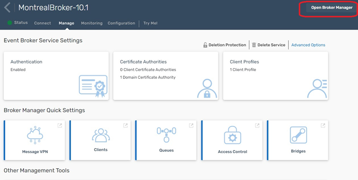

You will then see the Broker Manager Screen and on the left you will see a more advanced “try-me” test client. Click on it, to reveal the information you must provide to connect:
For this screen, you will be trying to connect to our Broker (Note: We are doing this because your iFlow on Day 3 will send an Event to our broker to send an email) where we have created an ACL to limit what you can do and on what topics you can publish. The information you will use is as follows:
````
Broker URL: wss://montrealbroker.messaging.solace.cloud:443
Message VPN: montrealbroker-10-1
Client UserName: email-profile
Client Password: ******** <- provided during the course
````

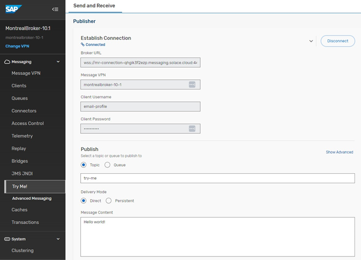

Once you have entered in the connectivity information, you should see the “Connected” message in blue.

Once connected, change nothing and hit “Publish”, you should immediately see the “Publish ACL Denied” on this action because the ACL will not permit you to complete this action.

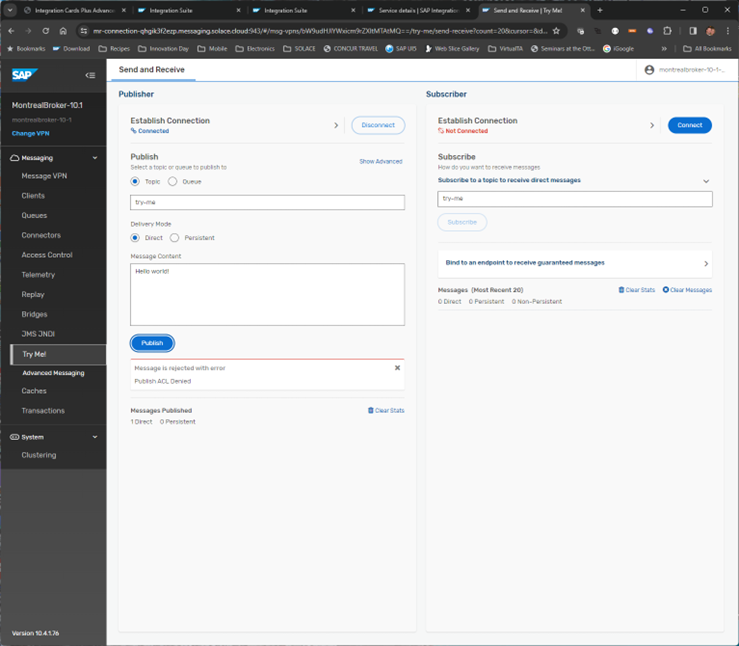

Now, let’s try the exact same thing with the subscription. Hit the “Connect” button, and you should see the connection properties already populated so accept this and hit connect.

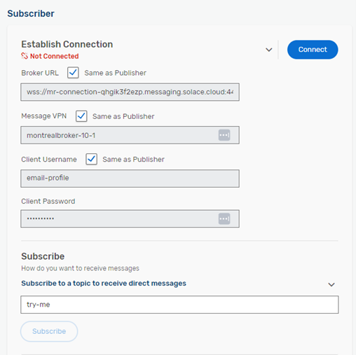

Once connected, you will see this:

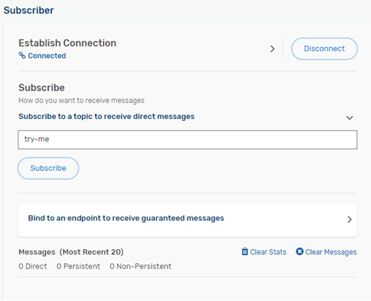

From here, just hit the Subscribe button and you should see the following screen:

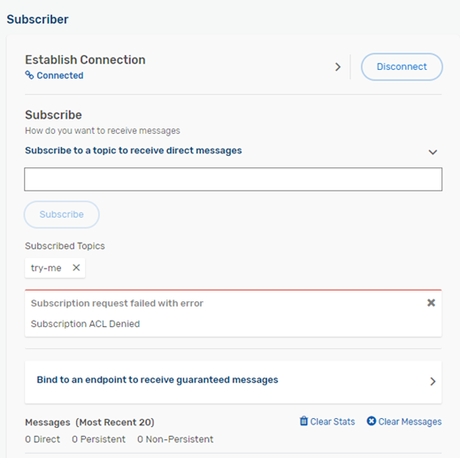

Again, you have been “Denied” - That was expected. 😊

Now, lets head back to the “Publisher” and change the “Topic” to ``sap.com/emailnotification/created/V1``
Use the following structure for your Message Content….be sure to copy the entire structure below including all of the curly braces. This is the structure that is passed to the Solace Event Mesh for processing. If successful, you should receive an email shortly after publishing with the information contained in the message.
In the structure below, please replace “YOUREMAILADDRESS” with your actual email address prior to hitting the publish button.

`` {"orderHeader": [{"salesOrderNumber":"SO2958","creator":"John Doe","date":"2023-08-11","salesType":"Online","ordertype":"Expedited","salesOrg":"SA03","distributionChannel":"DC01",
"division":"DV02","netvalue":423.76,"currency":"CAD","customer":[{"customerId":"CUST008",
"customerName":"scott","zipCode":"13579","street":"Seventh Avenue",
"phone":"555-888-9999","country":"USA","city":"Houston",
"emailAddress":[{"email":"YOUREMAILADDRESS"}]}],
"orderItem":[{"item":"ITEM013","material":"MAT013",
"materialType":"Product",
"itemType":"Standard","itemDescription":"Volt Electric bike",
"orderSchedule":[{"scheduleNumber":"SCH013","quantity":40,"uom":"EA"}]}]}]} ``


If you have entered the topic and message body correctly, you should see that 1 message has been published.

So how did we do that? The magic happens in the ACL Profile as shown next.

#### Broker Topic ACLs

We have changed the Default Publish Action to be Disallow. In other words, unless we specify an exception, the user profile associated with this ACL cannot publish anything by default. In this case, as you can see, we have listed one exception.

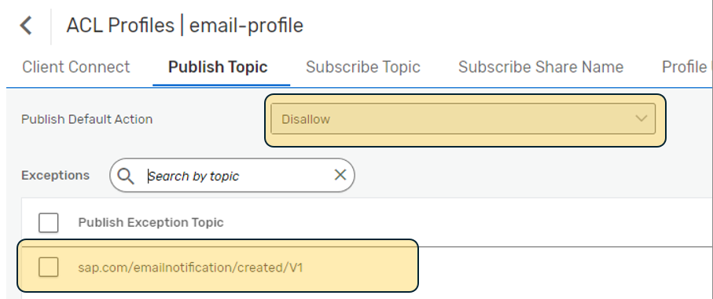

For the subscription settings, it’s very simple:
We specify the Default Action is “Disallow” and do not provide any exceptions. AKA, this ACL does not permit any subscriptions.

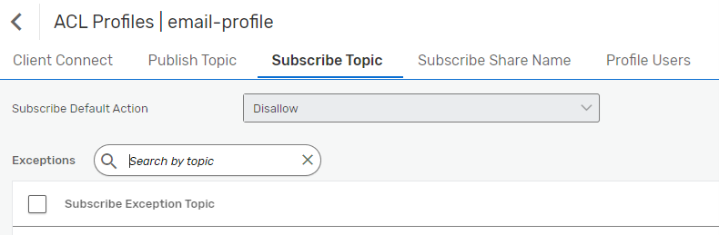

Now that you have this understanding, you will see when you configure/deploy this iFlow why we have a Username “email-profile”. It has been assigned the ACL email-profile so the iFlow can publish to our broker but only on that topic.
Everything else is prohibited by the email-profile user ACL, so it can only be used for this single purpose.

See below screenshot for where you would have used these credentials in your iflow.

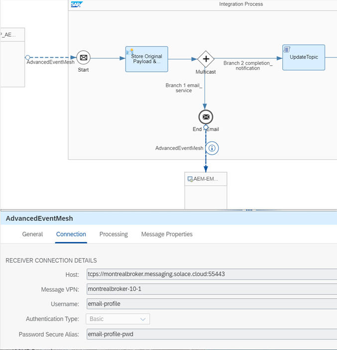

As you can see, broker ACLs are a quite powerful tool to tightly control access to the broker and its topics. You can separately control publish topics and subscribe topics and even IP address ranges that clients are allowed to connect from.
In addition to topic ACLs, remember that queue access is controlled by the queue ownership model and the "other permission".

## Troubleshooting

#### Checking that your flow was deployed successfully.
- Go to Monitor Artifacts -> Manage Integration Content -> All. <br>
You should be seeing your flow as Started, similar to this view:

- Go to your AEM Console and navigate to Cluster Manager -> {your service} -> Manage and click on the Queues tile:

- Check that the input queue for your flow has at least one consumer connected to it.


#### Checking your flow is running successfully.
- Go to Monitor Artifacts -> Monitor Message Processing -> All Artifacts (Past Hour). <br>
In this view you can see whether your flows are being triggered and completing successfully or running into any errors.
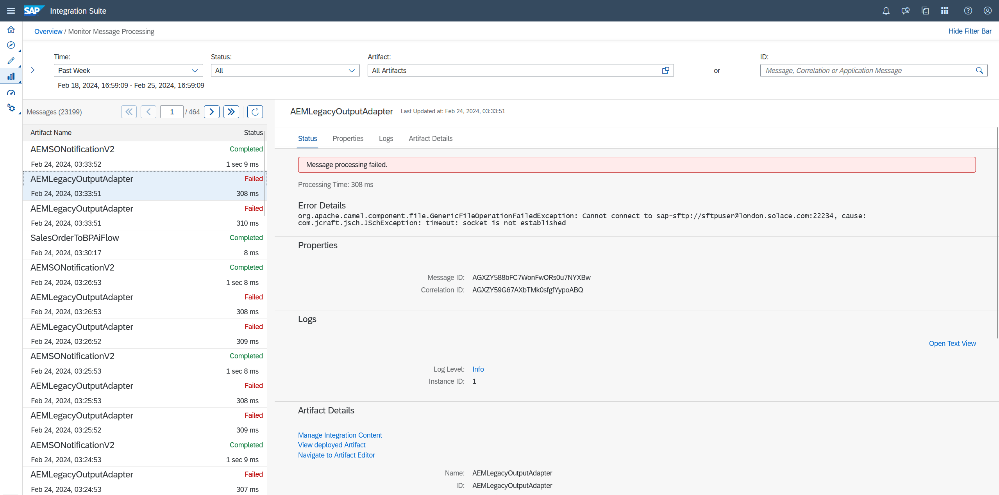
(Please note that the AEMLegacyOutputAdapter flow is meant to fail in the initial scenario.)
You can use this view to see various details about the flow execution and click on the trace/log to see exactly where the flow has failed. (If the log is set to info and isn't givin you enough information to troubleshoot, then you may want to go over to the flow monitor as seen in the previous step to change it to a more detailed level.)
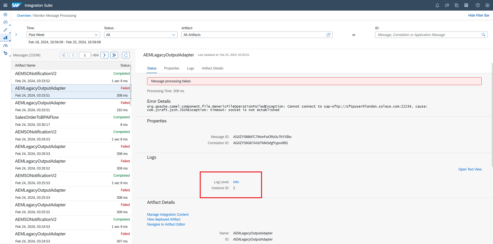
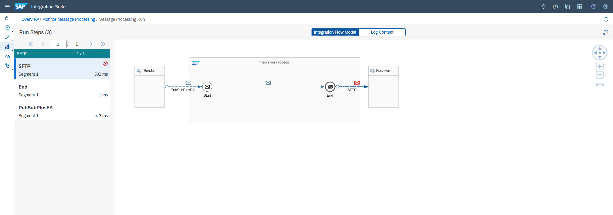


## Takeaways

Duration: 0:10:00

✅ Configuring AEM broker queues, subscriptions and queue related settings <br>
✅ Import additional adapters into Integration Suite (if not already present) <br>
✅ Import Integration Suite packages <br>
✅ Configure security related settings in Integration Suite <br>
✅ Understand event-driven iflows and configure them for your AEM environment <br>
✅ Receive events in Integration Suite and publish new events <br>
✅ Access topic information and parse and modify topic levels to publish to new dynamic Topics <br>
✅ Understand retry and error processing capabilities in the AEM adapter and the AEM broker <br>
✅ How to use the broker's config APIs to automate configuration and enable CI/CD pipelines.<br>
✅ How fine-grained security access in AEM works.<br>

Thanks for participating in this codelab! Let us know what you thought in the [Solace Community Forum](https://solace.community/)! If you found any issues along the way we'd appreciate it if you'd raise them by clicking the Report a mistake button at the bottom left of this codelab.
