author: ChristianHoltfurth
summary: Day 3/5 : This code lab walks the participant through the experience of using SAP AEM to event enable their SAP ecosystem and workflows
id: sap-aem-int-day-3
tags: SAP, AEM, Event Portal, SAP BTP, CAPM, CPI, Cloud Integration
categories:
environments: Web
status: Hidden
feedback link: https://github.com/SolaceDev/solace-dev-codelabs/blob/master/markdown/sap-aem-int-day-3

# Event Enable SAP Using SAP Advanced Event Mesh - Day 3

Overall Duration: 2:20:00

## What you'll learn: Overview

Duration: 0:01:00

Day 3 of 5.
Topics covered :
- Configuring an AEM brokers' queues and topic subscriptions.
- Event enabling integration flows and connecting them to AEM brokers to create event-driven integration flows.

## What you need: Prerequisites

Duration: 0:09:00

- Complete all activities in day 1 & 2.  You access and use the same broker you setup previously as well as the simulator to push events for testing.
- Have access to an active Integration Suite Cloud Integration tenant.
- Have an SFTP server and account credentials if you want to test successful integration of events to a file based interface of a legacy system **(optional)**.
- Have an email server and account credentials that allows SMTP access if you want to send email notifications from your iflow **(optional)**.
- Have a subscription to SAP Data Quality Management for location data or permission to activate it.  (We'll show you how to activate one, if you don't have it already). **(optional)**

## Set up Integration Suite and Import Event Enabled Integration Flows

Duration: 0:30:00

### A) Download and import the template integration flows package

Download [AEM-Rapid-Pilot.zip](https://github.com/SolaceLabs/aem-sap-integration/blob/main/deployable/IS-artifacts/AEM-Rapid-Pilot.zip)
- Import AEM-Rapid-Pilot.zip as a new package into your Integration Suite tenant:
	

### B) Download and import the AEM adapter for Integration Suite

>aside negative A new Advanced Event Mesh specific adapter was made available in January 2024.  
**Only follow this step if you can't see the AdvancedEventMesh adapter in your Integration Suite tenant.**  
	In that case, follow the steps in this section to get a preview of the AEM adapter: 
	- Download [Integration Suite AEM Adapter](https://github.com/SolaceLabs/aem-sap-integration/blob/main/deployable/IS-artifacts/AEM-Adapter-EA-10-16.zip) 
	- Import the AEM adapter into your Integration Suite tenant and deploy this adapter.

Import the adapter into your package.
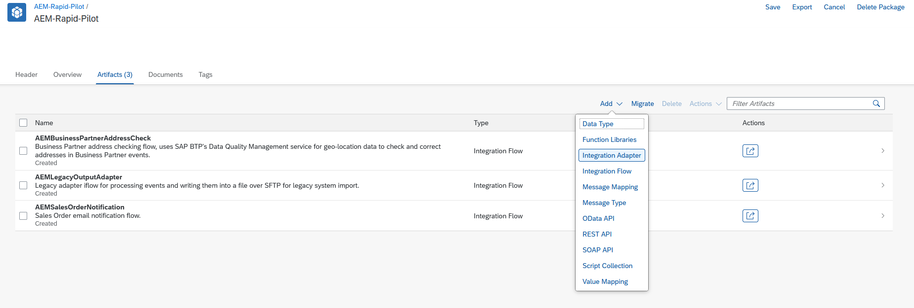

Extract the downloaded zip and select the .esa file in the upload dialog. Runtime Profile should be Cloud Integration. (You should not be seeing the warning message `Integration adapter with the ID 'AdvancedEventMesh' already exists`. If you do, then you can skip this step as the adapter has already been made available to you.)
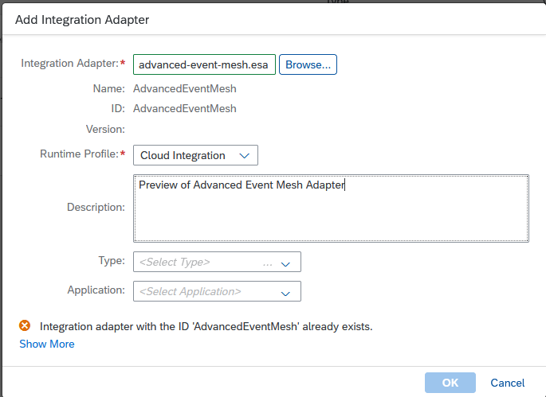

Deploy the adapter after import.
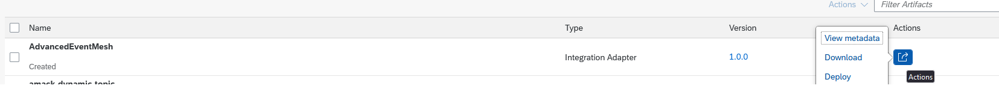

See  [SAP documentation](https://help.sap.com/docs/integration-suite/sap-integration-suite/importing-custom-integration-adapter-in-cloud-foundry-environment#procedure) for more detailed instructions

## Set up sales order scenario 1: AEMLegacyOutputAdapter **(mandatory)**
Duration: 0:45:00

### Setup/configure SAP AEM broker service

In this section we will create the required input queues for your integration flows.
- Go to Cluster Manager -> {your service} -> Manage -> Queues - to open the Broker UI
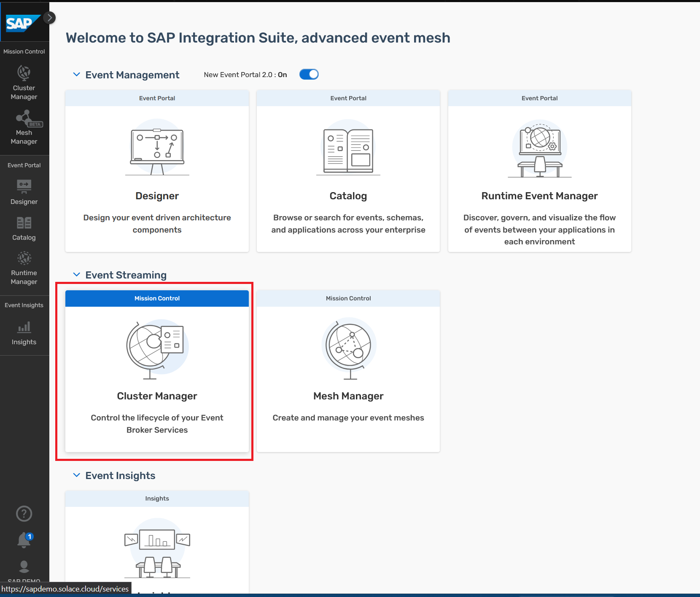
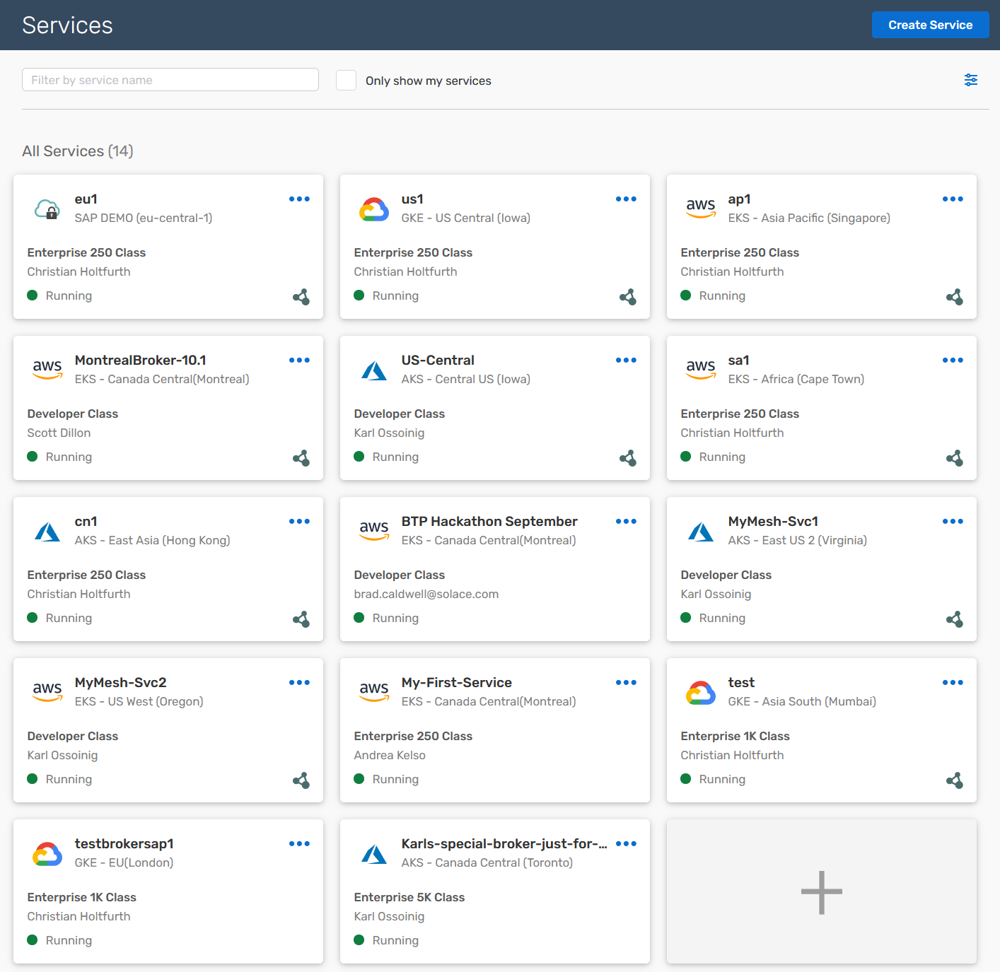
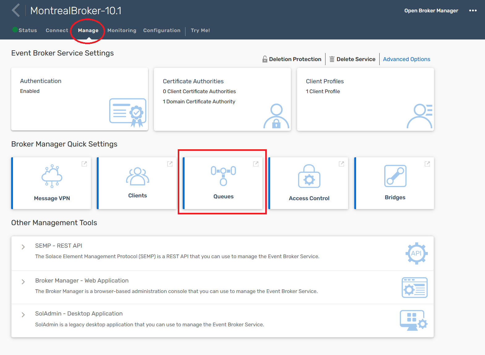

To create the queues in the next sections, repeatedly click on the "+ Queue" button to bring up the create queue dialog.
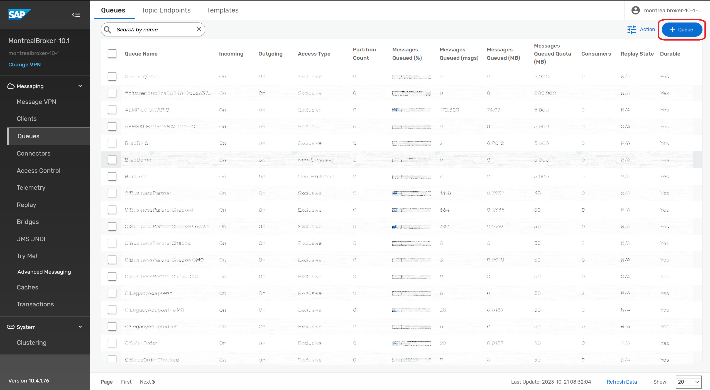

Provide the name as given (in the next sections).
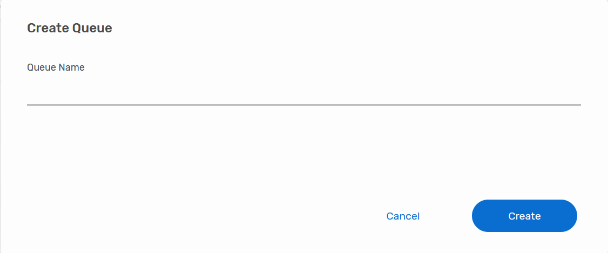

Open up the "Advanced Queue Settings" section, then follow along and provide the details as showing in the screenshots below.
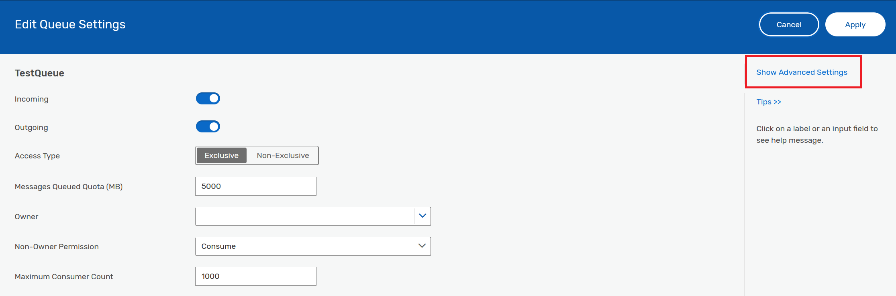

Create the following queues and provide the details as given.

#### 1. CILegacyAdapterIn queue
- Name: `CILegacyAdapterIn`
- Owner: `solace-cloud-client`
- Non-Owner Permission: `No access`
- DMQ Name: `CILegacyAdapterInDMQ`
- Redelivery: `enabled`
- Try Forever: `disabled`
- Maximum Redelivery Count: `3`

- Once the queue is created, click on the queue name in the list, navigate to the Subscriptions tab and open the subscriptions dialog.

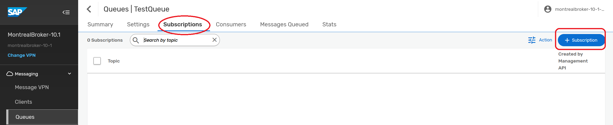

- Add the following subscriptions to the queue
 - `sap.com/salesorder/create/V1/>`
 - `sap.com/salesorder/change/V1/>`
 - `sap.com/salesorder/retry/V1`
 - `salesorder/retry/V1`

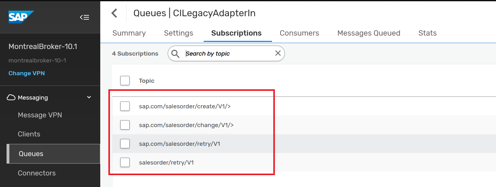

#### 2. CILegacyAdapterInDMQ queue
- Name: `CILegacyAdapterInDMQ`
- Owner: `solace-cloud-client`
- Non-Owner Permission: `No access`

Now, before we jump back into Integration Suite: Let's head to our Advanced Event Mesh Console and go to Cluster Manager, select the service that you want to connect your Integration Suite flows to and go to the "Connect" tab. Take a note of the connectivity details underneath "Solace Messaging" (click on the section to open it up):

We will need them in the next steps when configuring our flows.

> The connect tab lists all the various connectivity details for the various supported protocols. Our Cloud Integration AEM adapter uses the Solace Messaging protocol, which is AEM's very own protocol with a broad feature support.
> Each AEM service also comes with a default client user called `solace-cloud-client` that is configured for convenience reasons and is allowed to publish and subscribe to all topics. We will be using this user for all our iflows. In a real production environment where security is important, you or your administrator will likely have this user disabled and will be creating separate users for each of the applications that connect to the AEM broker. Or this may even be deferred to an external authentication service over LDAP or OAuth.

Now that we have set up all the prerequisites for our Integration Suite flows, we can take a look at the individual flows and prepare them for deployment.

### Configure Your Integration Suite Flow

### Security Configuration
Let's configure the security details we will need to connect to the various services like AEM & SFTP server.
- Go to Integration Suite Monitor Artifacts -> Manage Security -> Security Material.
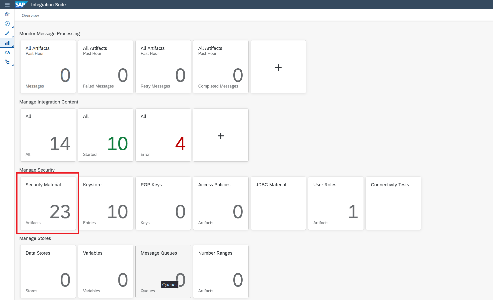
- In here, create security credentials for your AEM broker service, and SFTP server (sftp optional).
- Create SecureParameter `CABrokerUserPass` and store the password for your `solace-cloud-client` application user credentials.
- Create UserCredentials `sftpuser` and store SFTP servers user and password credentials (these can be prepopulated with dummy values for now).

### Configure/Deploy AEMLegacyOutputAdapter
#### 1. Let's take a look at the AEMLegacyOutputAdapter iflow:
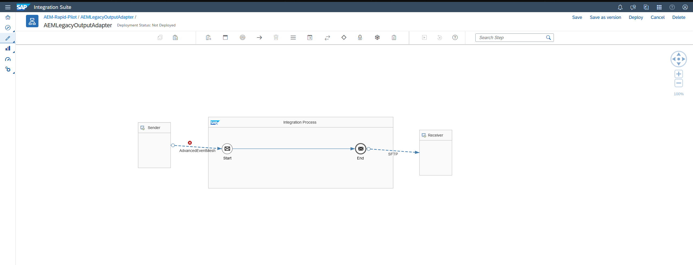

This flow is really straightforward. It receives Sales Order events and appends them to a file over SFTP. This could be used for legacy system integration (as the name suggests) for systems that do not have capabilities to receive data/events in an event-driven fashion and instead are relying on batch-based file imports. AEM + CI could send all relevant events in real-time to the file and the downstream legacy system can then simply consume the file in batch intervals (or potentially triggered by a file detector if available), move/delete the import file and AEM + CI will simply create a new one as soon as the next event arrives. 
Now we are going to use this simple flow to demonstrate the error handling capabilities of AEM.
The flow will try to send events to a file, but we have deliberately misconfigured to SFTP adapter to point to an invalid destination, so all messages delivery attempts will fail and trigger the AEM adapter's retry behaviour. 
Once the max configured retry attempts are exceeded, the AEM broker will move the message to a configured DMQ for exception processing. 
Let's take a look at some of the relevant settings of the AEM adapter that control this behaviour.

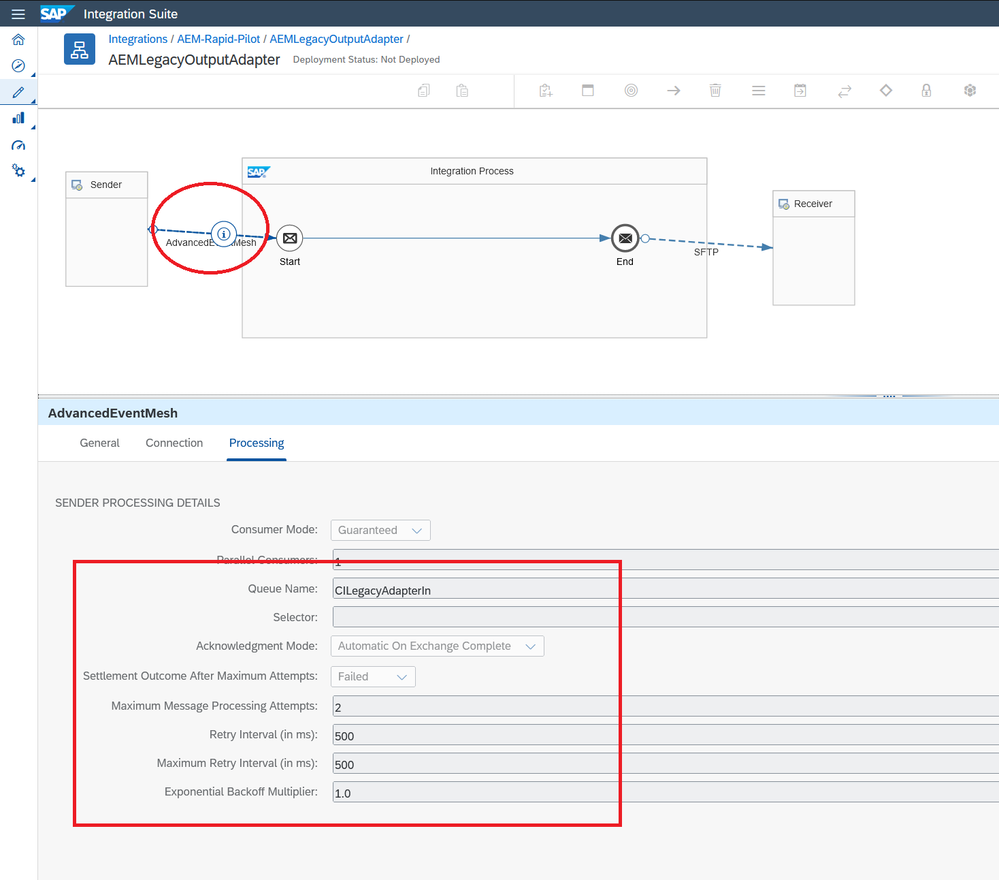
Let's look at these settings one by one: 
1) Acknowledgement Mode: "Automatic on Exchange Complete" 
The most important setting when it comes to not accidentally acknowledging and therefore removing a message from the broker's queue. This setting tells the flow/AEM adapter to only acknowledge (ack) the message after the flow has successfully completed processing the message. If any in the processing occurs, the AEM adapter will instead send a negative acknowledgment back (nack) to tell the broker to keep the message and retry it, because it couldn't be successfully processed by the flow. The alternative is to immediately ack the message when it's received, which will always result in the message being removed from the queue even if the flow fails to successfully process the message. (!!) 
2) Settlement Outcome After Maximum Attempts: "Failed" 
This setting controls the nack type and behaviour, we have two options here: 
	a) Failed, which will nack the message back to the broker and let's the broker check the retry count of the message to trigger retries based on the queue settings and only sending messages to DMQ when the retry count on the message has exceeded the max retry settings on the queue. 
	b) Rejected, which will nack the message telling the broker to immediately move the message to DMQ when the AEM adapter settings (Maximum Message Processing Attempts) are exceeded irrespective of queue settings. 
3) Max. Message Processing Attempts: 2 
Controls how often we want to retry a message before we "give up". 
4) Retry interval, Max Retry Interval and Exponential Backoff Multiplier 
These are all settings that control how quickly we want to retry and whether we want to incremently increase our retry delay with each failure. A good retry delay value prevents the broker from repeatedly retrying a message within a few milli-seconds and gives some time for transient error situations to clear before we retry.

Keep in mind that the error handling and retry settings go hand-in-hand with the DMQ and retry settings on the input queue for this flow:

> aside negative
> Note: The delayed redelivery settings on the queue are not currently used by the AEM adapter. We only need to set these settings in the adapter itself, but the queue needs to have a DMQ configured, a max redelivery count set (as opposed to retrying forever) and the events/messages have had to be published as DMQ eligible by the publisher.

#### 2. Configuring and deploying  the AEMLegacyOutputAdapter iflow:
- Hit configure at the top right and fill in the details to connect to your AEM broker service:
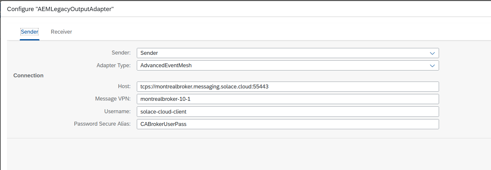
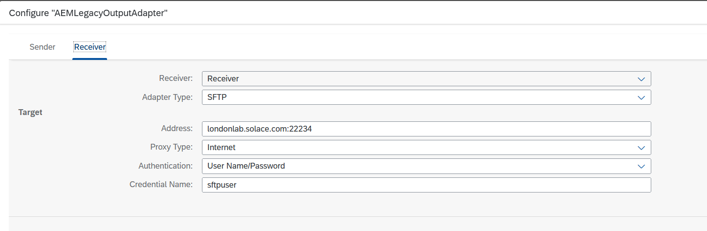
- Then hit deploy at the bottom right.

#### 3. Check that your flow was deployed successfully and fix if necessary.
- Go to Monitor Artifacts -> Manage Integration Content -> All.  
You should be seeing the AEMLegacyOutputAdapter flow as Started, similar to this view:
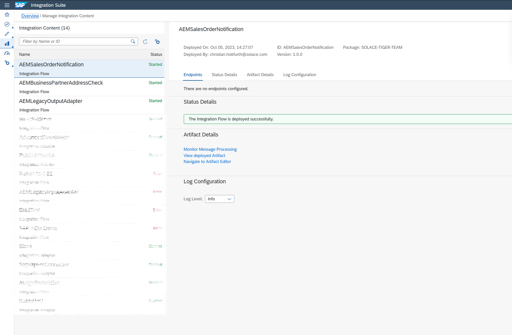
- Go to your AEM Console and navigate to Cluster Manager -> {your service} -> Manage and click on the Queues tile:
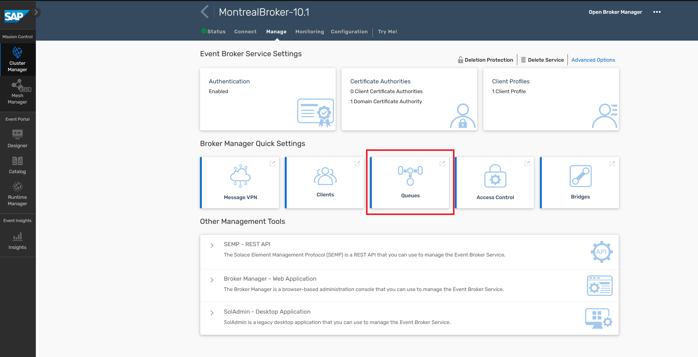
- Check that the AEMLegacyOutputAdapter input queue has at least one consumer connected to it.
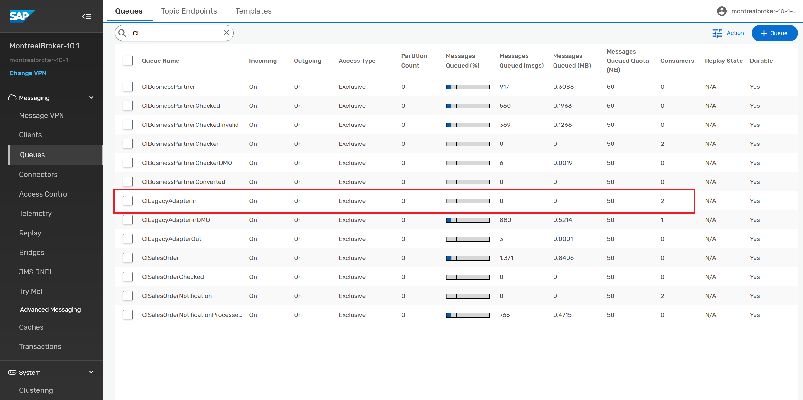

#### Troubleshooting
<!--
## Troubleshooting

TODO: Add some details on how to troubleshoot iflow issues and issues with events not being picked up.
-->

### Complete the success path for this scenario **(optional step for later)**

> aside negative
> Only complete this step *after* you have seen the flow interact end to end with the UI5 components and the BPA process in this Dead Message Queue (DMQ) error handling scenario.

The legacy output adapter is simulating appending events to a file via an SFTP adapter, which could be imported to a legacy system. **The workshop scenario doesn't require a working sftp destination**, as we are using this iflow to simulate a failure to demonstrate the retry and error handling capabilities of AEM. The iflow will try a few times to deliver each event to the SFTP destination. After 3 failed attempts messages will be moved to a Dead Message Queue for manual  processing by a UI5 and Business Process Automation workflow.

> aside negative
> If, **AFTER** successful demonstration of the error handling, you would still like to see a successful delivery of events to a file via sftp, you will need an sftp server and sftp credentials to configure the flow with a valid endpoint (sftp server address and username password) and import the ssh identidy into .

### Security Configuration
Let's go back and configure the security details we will need to connect to the SFTP server.
- Go to Integration Suite Monitor Artifacts -> Manage Security -> Security Material.

- Update UserCredentials `sftpuser` and store your SFTP servers user and password credentials.
- You may also need to create a known.hosts file, populate it with your SFTP server's ssh id if you want to complete this optional step of successfully sending events to a file via SFTP (success path of the AEMLegacyOutputAdapter flow). See [this post](https://blogs.sap.com/2017/09/26/how-to-generate-sftp-known_host-file-cloud-platform-integration/) by Pravesh Shukla if you need help with this step.

### Configure and Deploy your iflows
Go back to your iflow, reconfigure the SFTP adapter with your SFTP servers address and redeploy.

## Set up sales order scenario 2: AEMSalesOrderNotification
Duration: 0:30:00

### Setup/Configure Dependency Services
You'll need an external email service to be able to automatically send emails, details like smtp server address, username (email) and password. (A test Gmail account might serve this purpose if you don't have another email service you can use for this exercise.)

### Setup/configure SAP AEM broker service

In this section we will create the required input queues for your integration flows.
- Go to Cluster Manager -> {your service} -> Manage -> Queues - to open the Broker UI

To create the queues in the next sections, repeatedly click on the "+ Queue" button to bring up the create queue dialog.

Provide the name as given (in the next sections).

Open up the "Advanced Queue Settings" section, then follow along and provide the details as showing in the screenshots below.

Create the following queues and provide the details as given.

#### 1. CISalesOrderNotification queue
- Name: `CISalesOrderNotification`
- Owner: `solace-cloud-client`
- Non-Owner Permission: `No access`
- Redelivery: `enabled`
- Try Forever: `disabled`
- Maximum Redelivery Count: `3`

- Once the queue is created, click on the queue name in the list, navigate to the Subscriptions tab and open the subscriptions dialog.

- Add the following subscriptions to the queue
 - `sap.com/salesorder/create/V1/>`

#### 2. CISalesOrderNotificationProcessed queue  (optional - if you want to see/check the output of the flow)
- Name: `CISalesOrderNotificationProcessed`
- Owner: `solace-cloud-client`
- Non-Owner Permission: `No access`

- Once the queue is created, click on the queue name in the list, navigate to the Subscriptions tab and open the subscriptions dialog.

- Add the following subscriptions to the queue
 - `sap.com/salesorder/notified/V1/>`

### Configure Your Integration Suite Flow

One thing, before we jump back into Integration Suite: Let's head to our Advanced Event Mesh Console and go to Cluster Manager, select the service that you want to connect your Integration Suite flows to and go to the "Connect" tab. Take a note of the connectivity details underneath "Solace Messaging" (click on the section to open it up):

We will need them in the next steps when configuring our flows.

> The connect tab lists all the various connectivity details for the various supported protocols. Our Cloud Integration AEM adapter uses the Solace Messaging protocol, which is AEM's very own protocol with a broad feature support.
> Each AEM service also comes with a default client user called `solace-cloud-client` that is configured for convenience reasons and is allowed to publish and subscribe to all topics. We will be using this user for all our iflows. In a real production environment where security is important, you or your administrator will likely have this user disabled and will be creating separate users for each of the applications that connect to the AEM broker. Or this may even be deferred to an external authentication service over LDAP or OAuth.

Now that we have set up all the prerequisites for our Integration Suite flows, we can take a look at the individual flows and prepare them for deployment.

### 0) - Security Configuration
Let's configure the security details we will need to connect to the various services like AEM & email server.
- Go to Integration Suite Monitor Artifacts -> Manage Security -> Security Material.

- In here, create security credentials for your AEM broker service **(if not already done)** & email server.
- Create SecureParameter `CABrokerUserPass` and store the password for your `solace-cloud-client` application user credentials.
- Go to Integration Suite Monitor Artifacts -> Manage Security -> Manage Keystore.
- You will need to import your email servers public CA certificate, if you want the email adapter to successfully connect and send emails. In our case, we are sending from an Outlook address, so we imported the TLS certificate that Microsoft uses for those servers in order to connect.
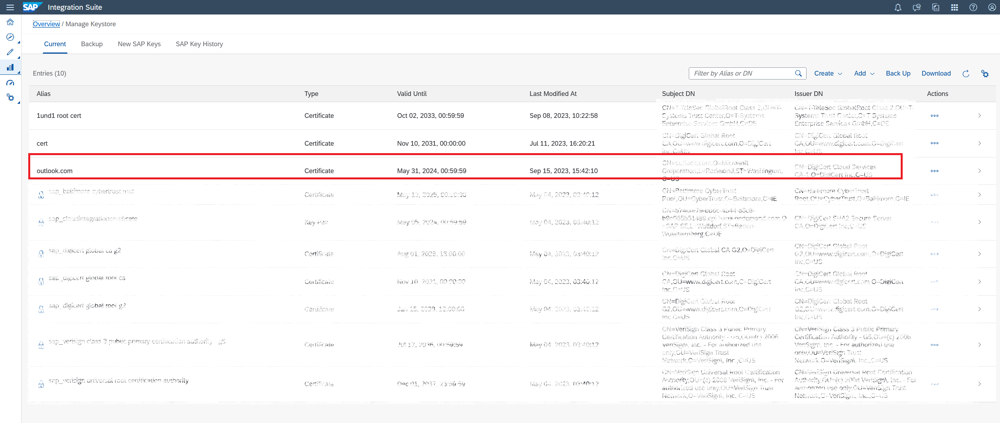
> aside negative
> See [this stackexchange post](https://security.stackexchange.com/questions/70528/how-to-get-ssl-certificate-of-a-mail-server) if you need help with finding and [this article](https://help.sap.com/docs/cloud-integration/sap-cloud-integration/uploading-certificate?locale=en-US) for help with importing the right CA certificate for your email server in Integration Suite.

### Configure/Deploy AEMSalesOrderNotification
#### 1. Let's take a look at the AEMSalesOrderNotification iflow:
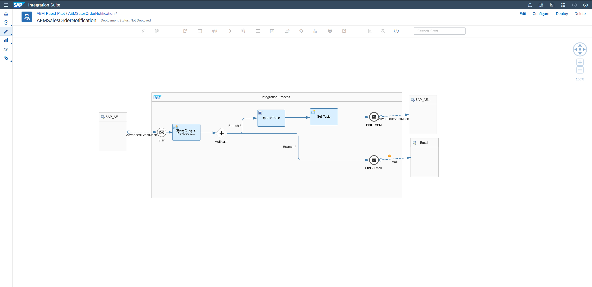

This flow gets triggered by Sales Order events and does two things: 
a) It creates an email and puts the Sales Order into the body of the email. 
(The recipient's address is currently fixed in this example, because we don't have an email address in the sample Sales Order nor did we want to overcomplicate the flow with another look up to get the email address from another service/database, but these are all possible ways to send the email to the original customer to confirm the order receipt.) 
b) It sends a new event to `sap.com/salesorder/notified/V1/{salesOrg}/{distributionChannel}/{division}/{customerId}` to indicate that the email was successfully sent.

#### 2. Configuring and deploying  the AEMSalesOrderNotification iflow:
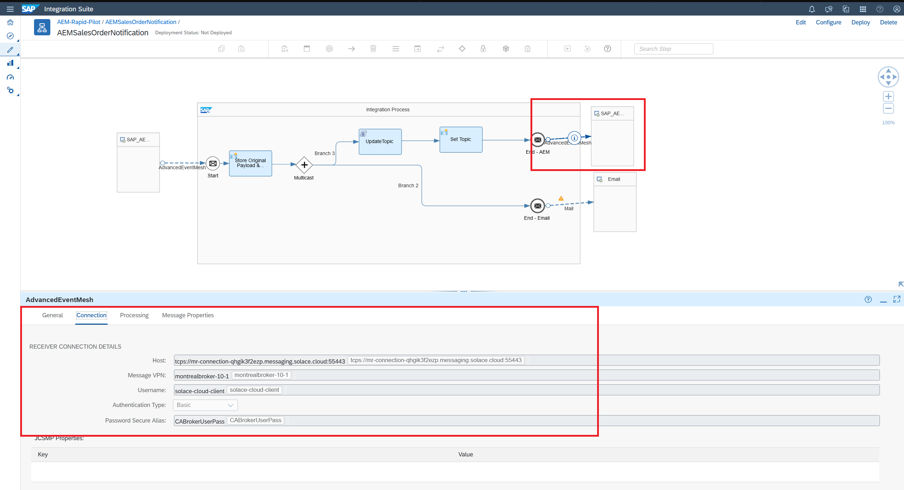
- Populate the connection details for the AEM broker service to send an event to the AEM broker whenever the flow successfully sends a notification email.
- Hit configure at the top right and fill in the details to connect to your AEM broker service:

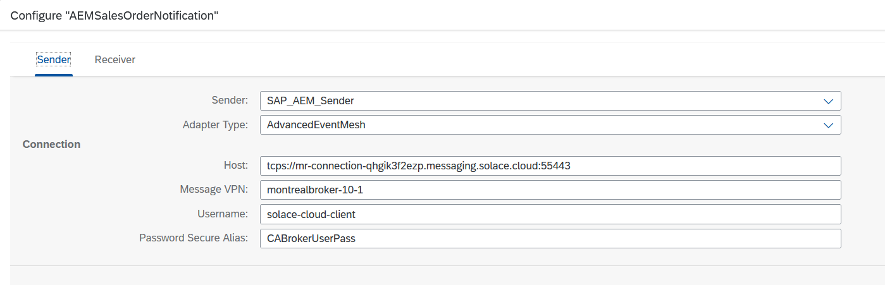
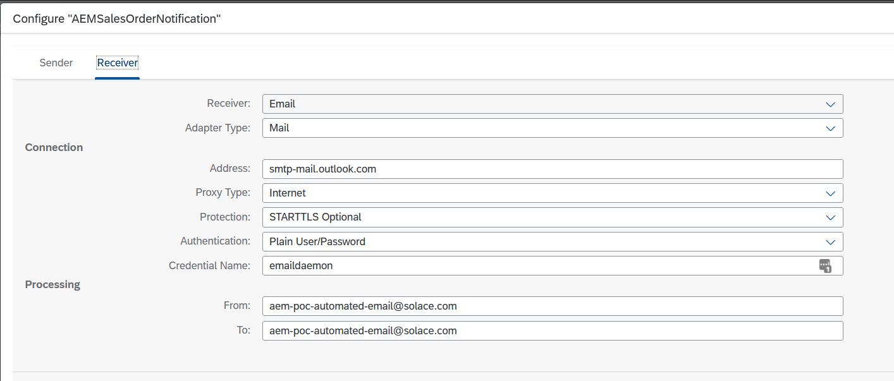
- Then hit deploy at the bottom right.

#### 3. Check that your flow was deployed successfully and fix if necessary.
- Go to Monitor Artifacts -> Manage Integration Content -> All.  
You should be seeing the AEMSalesOrderNotification flow as Started, similar to this view:

- Go to your AEM Console and navigate to Cluster Manager -> {your service} -> Manage and click on the Queues tile:

- Check that the AEMSalesOrderNotification input queue has at least one consumer connected to it.

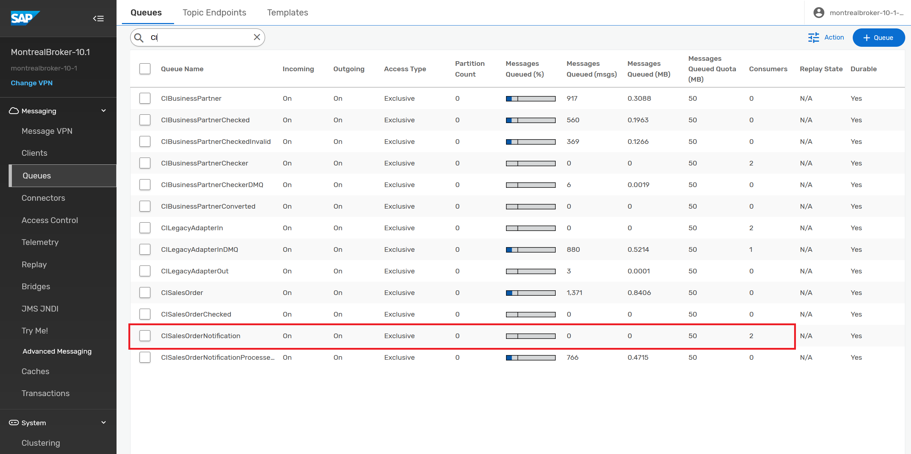

#### Troubleshooting
<!--
## Troubleshooting

TODO: Add some details on how to troubleshoot iflow issues and issues with events not being picked up.
-->

## Set up business partner scenario: AEMBusinessPartnerAddressCheck
Duration: 1:00:00

### Setup/Configure Dependency Services
#### Activate SAP Data Quality Management service in BTP **(optional)**

One of our iflows that we are going to deploy is invoking the SAP Data Quality Management service (DQM) to check and cleanse address data in the BusinessPartner events. For the flow to work properly, you will need a working DQM service subscription so you can configure your iflow with this. The good news, if you don't have one already, you can use a free tier subscription for this purpose.
Please follow along the steps in this [blog post](https://blogs.sap.com/2022/02/15/getting-started-with-sap-data-quality-management-microservices-for-location-data-btp-free-tier/) by Hozumi Nakano to active the service.

Additionally, you will have to create a service instance and a service key to be configured with your integration flow later. Follow [these steps](https://developers.sap.com/tutorials/btp-sdm-gwi-create-serviceinstance.html) to create a service instance and key. 
Take a note of the URL and user credentials once you've activated the service. 
<!-- TODO specify which URL to be taken. -->

#### Alternative: Use DQM service credentials provided by us during the workshop

### Setup/configure SAP AEM broker service

In this section we will create the required input queues for your integration flows.
- Go to Cluster Manager -> {your service} -> Manage -> Queues - to open the Broker UI

To create the queues in the next sections, repeatedly click on the "+ Queue" button to bring up the create queue dialog.

Provide the name as given (in the next sections).

Open up the "Advanced Queue Settings" section, then follow along and provide the details as showing in the screenshots below.

Create the following queues and provide the details as given.

#### 1. CIBusinessPartnerChecker queue

- Name: `CIBusinessPartnerChecker`
- Owner: `solace-cloud-client`
- Non-Owner Permission: `No access`
- DMQ Name: `CIBusinessPartnerCheckerDMQ`
- Redelivery: `enabled`
- Try Forever: `disabled`
- Maximum Redelivery Count: `3`

- Once the queue is created, click on the queue name in the list, navigate to the Subscriptions tab and open the subscriptions dialog.

- Add the following subscriptions to the queue
 - `sap.com/businesspartner/create/V1/>`
 - `sap.com/businesspartner/change/V1/>`

#### 2. CIBusinessPartnerCheckerDMQ queue
- Name: `CIBusinessPartnerCheckerDMQ`
- Owner: `solace-cloud-client`
- Non-Owner Permission: `No access`

#### 3. CIBusinessPartnerChecked queue  (optional - if you want to see/check the output of the flow)
- Name: `CIBusinessPartnerChecked`
- Owner: `solace-cloud-client`
- Non-Owner Permission: `No access`

- Once the queue is created, click on the queue name in the list, navigate to the Subscriptions tab and open the subscriptions dialog.

- Add the following subscriptions to the queue
 - `sap.com/businesspartner/addressChecked/V1/>`
 - `!sap.com/businesspartner/addressChecked/*/*/Invalid`

> aside negative
> Notice the second subscriptions that starts with `!` ?     
> This is called a topic exception and removes any events matching topic subscription `sap.com/businesspartner/addressChecked/V1/*/*/Invalid` from the previously matched list of events matched by `sap.com/businesspartner/addressChecked/V1/>`. This is a really handy feature to exclude subsets of events matched by a larger topic subscription. See [link](https://docs.solace.com/Messaging/SMF-Topics.htm) for more details on Solace's topic syntax.

#### 4. CIBusinessPartnerCheckedInvalid queue  (optional - if you want to see/check the output of the flow)
- Name: `CIBusinessPartnerCheckedInvalid`
- Owner: `solace-cloud-client`
- Non-Owner Permission: `No access`

- Once the queue is created, click on the queue name in the list, navigate to the Subscriptions tab and open the subscriptions dialog.

- Add the following subscriptions to the queue
 - `sap.com/businesspartner/addressChecked/V1/*/*/invalid`

### Configure Your Integration Suite Flow

One thing, before we jump back into Integration Suite: Let's head to our Advanced Event Mesh Console and go to Cluster Manager, select the service that you want to connect your Integration Suite flows to and go to the "Connect" tab. Take a note of the connectivity details underneath "Solace Messaging" (click on the section to open it up):

We will need them in the next steps when configuring our flows.

> The connect tab lists all the various connectivity details for the various supported protocols. Our Cloud Integration AEM adapter uses the Solace Messaging protocol, which is AEM's very own protocol with a broad feature support.
> Each AEM service also comes with a default client user called `solace-cloud-client` that is configured for convenience reasons and is allowed to publish and subscribe to all topics. We will be using this user for all our iflows. In a real production environment where security is important, you or your administrator will likely have this user disabled and will be creating separate users for each of the applications that connect to the AEM broker. Or this may even be deferred to an external authentication service over LDAP or OAuth.

Now that we have set up all the prerequisites for our Integration Suite flows, we can take a look at the individual flows and prepare them for deployment.

### 0) - Security Configuration
Let's configure the security details we will need to connect to the various services like AEM.
- Go to Integration Suite Monitor Artifacts -> Manage Security -> Security Material.

- In here, create security credentials for your AEM broker service **(if not already done)**.
- Create SecureParameter `CABrokerUserPass` and store the password for your `solace-cloud-client` application user credentials.
- Create OAuth2 Client Credentials and store your credentials from your DQM service key.
 - Token Service URL
 - Client ID
 - Client Secret
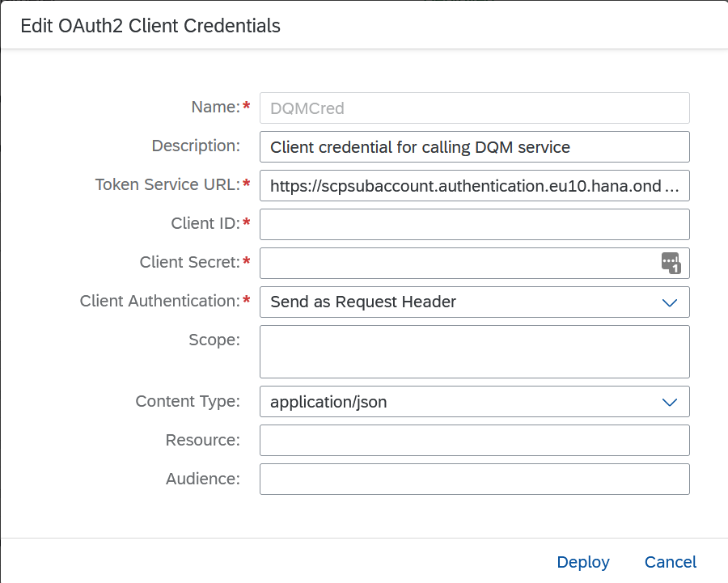
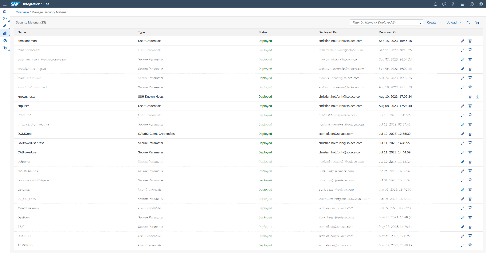

### Configure/Deploy AEMBusinessPartnerAddressCheck **(optional)**
#### 1. Let's take a look at the AEMBusinessPartnerAddressCheck iflow:

This flow receives Business Partner Create and Change events and invokes the Data Quality Management Service in BTP to check and correct the addresses inside the Business Partner event payload. It does this by 
a) Storing the original event payload in an environment variable. 
b) Populating the DQM request payload with the addresses in the input event. 
c) Invoking the DQM service over REST and 
d) Parsing the response, checking whether the DQM service evaluated the input addresses to be Valid, Invalid, Blank or has Corrected them. 
e) Merging any corrected addresses back into the original payload. 
f) And finally publishing the result back as a new event to the AEM broker with an updated topic in the format: 
`sap.com/businesspartner/addressChecked/V1/{businessPartnerType}/{partnerId}/{addressCheckStatus}`

Let's also look at what happens in order to publish a new event back to the Advanced Event Mesh broker.
First of all, on the integration flow overall configuration settings, we are preserving the destination header field to have access to the original topic that this event was published on. This matters, because the event may contain valuable meta-data that helps us and downstream consumers filter for events relevant to them and it saves us from reparsing the payload, which can be CPU and I/O intensive.
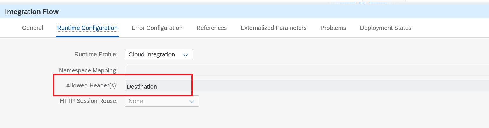
Secondly we are using a couple of lines in the script that is evaluating the DQM service result and merging the corrected addresses back into the original payload to retrieve and parse the original topic, replace one level (the verb) to create a new event and amend another extra meta-data level that contains the result of the address check (either Valid, Corrected, Invalid or Blank), which can be used by downstream systems to filter for specific outcomes. We are storing the newly created topic in the Destination field of the message header.
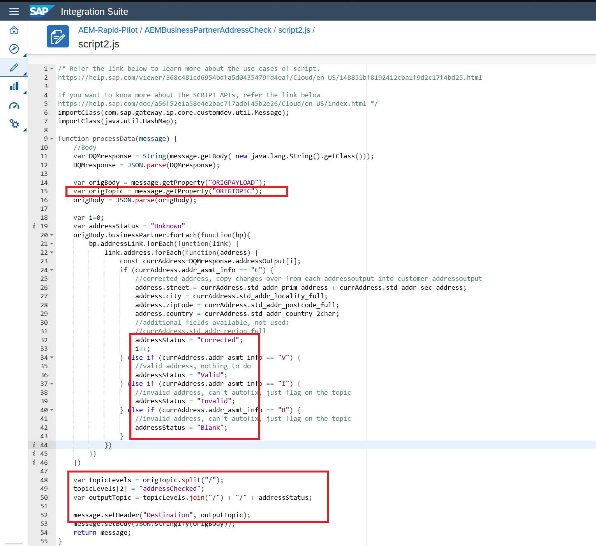
Lastly, the AEM Receiver adapter is configured to persistently (to avoid message loss) publish to a topic, taking the value from the header field that we set in the previous step/script.
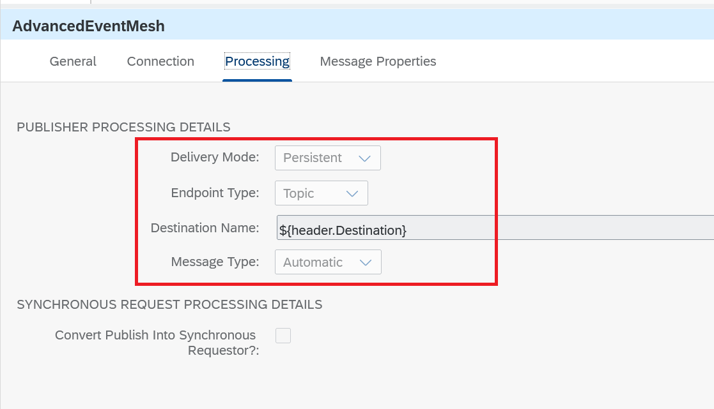

#### 2. Configuring and deploying the AEMBusinessPartnerAddressCheck iflow:
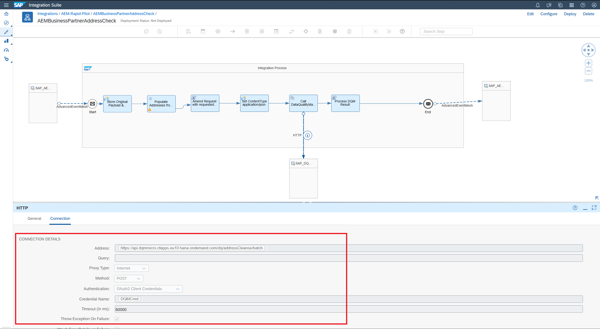
- Populate the connection details for the DQM service call out with the ones for your own DQM service instance.
- Hit configure at the top right and fill in the details to connect to your AEM broker service:

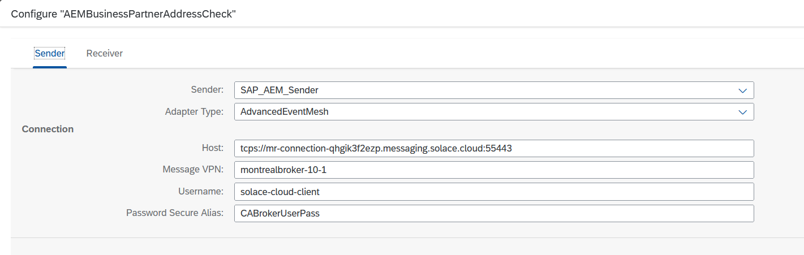
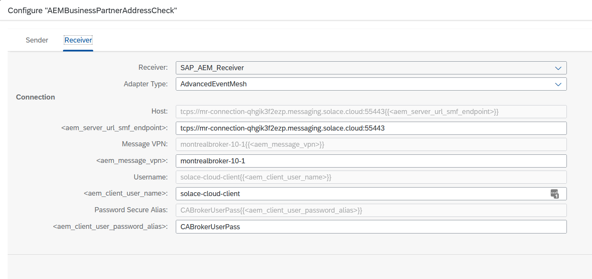
- Then hit deploy at the bottom right.

#### 3. Check that your flow was deployed successfully and fix if necessary.
- Go to Monitor Artifacts -> Manage Integration Content -> All.  
You should be seeing the AEMBusinessPartnerAddressCheck flow as Started, similar to this view:

- Go to your AEM Console and navigate to Cluster Manager -> {your service} -> Manage and click on the Queues tile:

- Check that the CIBusinessPartnerChecker input queue has at least one consumer connected to it.

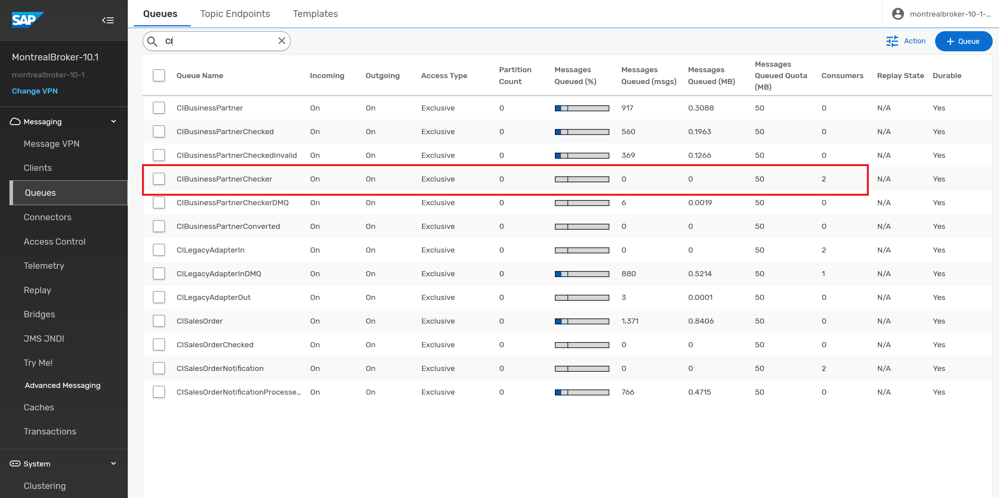

Congratulations, if you are seeing both the Started iflow as well as the consumers on the queue, then that confirms that your iflow is running and has successfully opened and bound to the queue waiting for event to flow!

#### Troubleshooting
<!--
## Troubleshooting

TODO: Add some details on how to troubleshoot iflow issues and issues with events not being picked up.
-->

## Takeaways

Duration: 0:10:00

✅ Configuring AEM broker queues, subscriptions and queue related settings  
✅ Import additional adapters into Integration Suite (if not already present)  
✅ Import Integration Suite packages  
✅ Configure security related settings in Integration Suite  
✅ Understand event-driven iflows and configure them for your AEM environment  
✅ Receive events in Integration Suite and publish new events  
✅ Access topic information and parse and modify topic levels to publish to new dynamic Topics  
✅ Understand retry and error processing capabilities in the AEM adapter and the AEM broker  

Thanks for participating in this codelab! Let us know what you thought in the [Solace Community Forum](https://solace.community/)! If you found any issues along the way we'd appreciate it if you'd raise them by clicking the Report a mistake button at the bottom left of this codelab.
