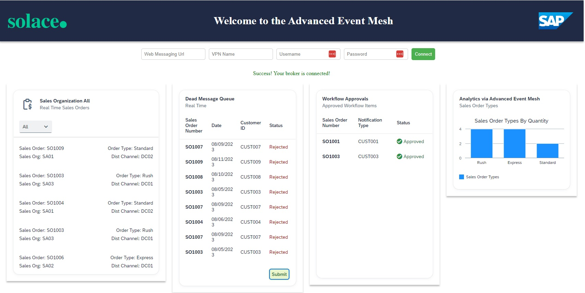
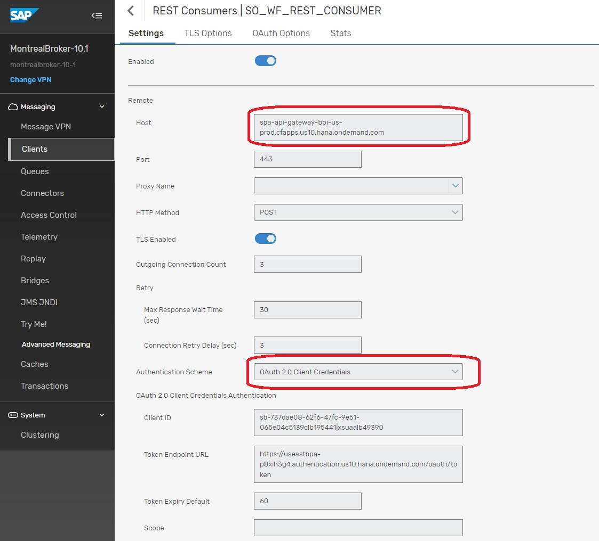
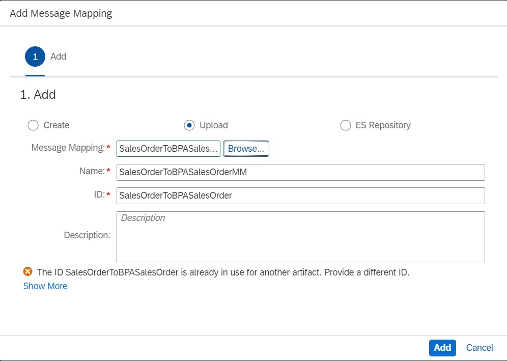
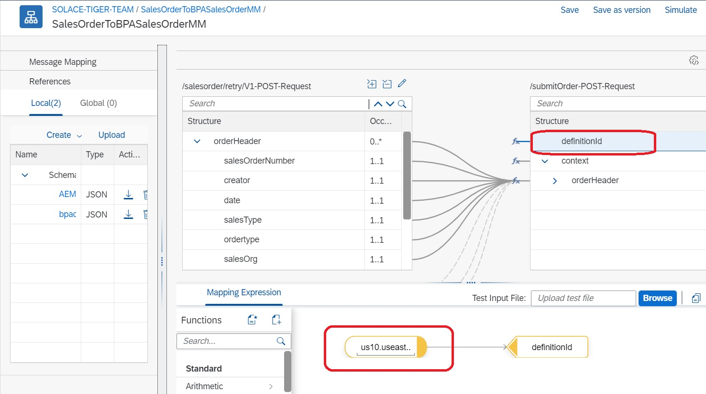
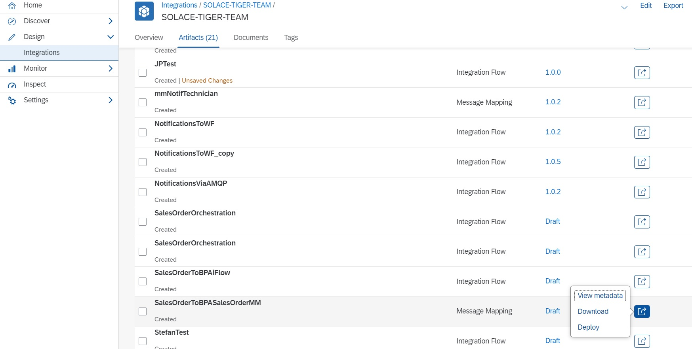
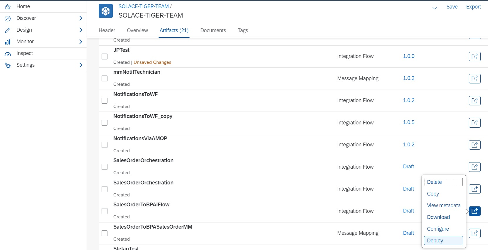
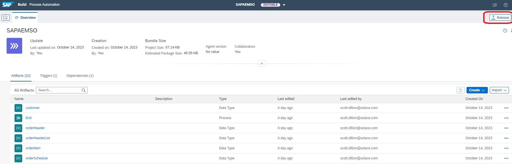
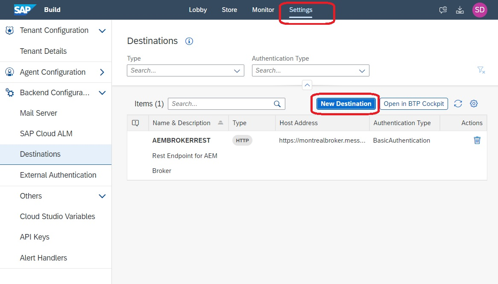
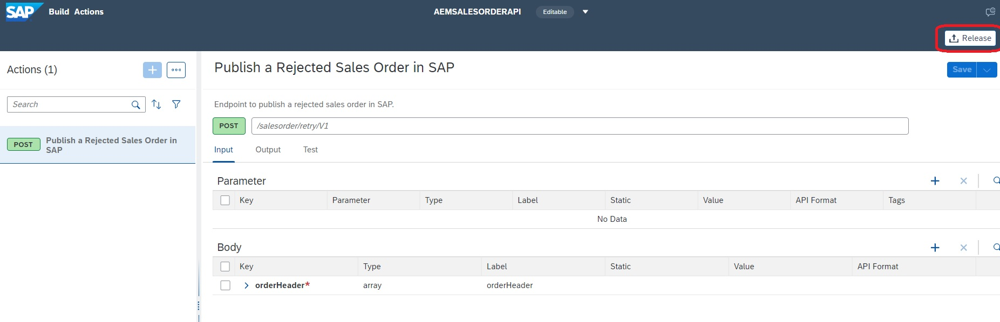
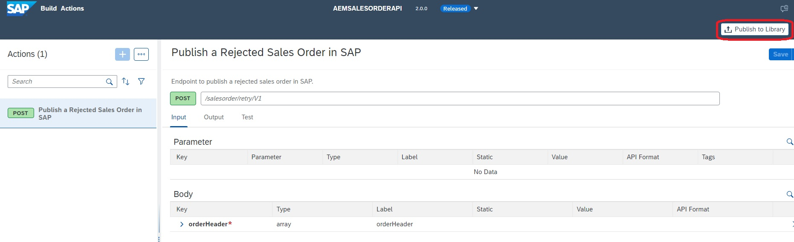

author: Scott Dillon
summary: Day 4/5 : This code lab walks the participant through the setup and configuration of using SAP Business Process Automation to deal with message exceptions generated when using SAP AEM. This scenario will use SAP BPA, SAP Cloud Integration and SAP UI5 for the end to end scenario.
id: sap-aem-int-day-4
tags: SAP, AEM, Event Portal, SAP BTP, CAPM
categories:
environments: Web
status: Hidden
feedback link: https://github.com/SolaceDev/solace-dev-codelabs/blob/master/markdown/sap-aem-int-day-4

# Event Enable SAP Using SAP Advanced Event Mesh - Day 4

## What you'll learn: Overview

Duration: 1:30:00

Day 4 of 5.
Topics covered :
- Using SAP Business Process Automation to review event exceptions

## What you need: Prerequisites
- SAP Business Process Automation Activated  
- Access to SAP BTP Cockpit and ability to create Destinations
- Access to Cloud Integration and Ability to create development artifacts
- Access to the AEM Console

## Step 1 - Using SAP BPA to handle event exceptions

In the world of Event Driven Asynchronous messaging, sometimes events cannot be successfully processed by a consumer and as a result, they need to be dealt with on an exception basis. As a result, there is built in capability within the broker referred to a Dead Messages Queue. Essentially, messages can be placed into a special queue where they can later be reviewed and properly dealt with. Should you wish to read more on the concept of Dead Message Queues, please refer to the following link. 

[Link to Blog](https://solace.com/blog/pubsub-message-handling-features-dead-message-queues/)

In our scenario, we will artificially create a situation where messages cannot be delivered to the endpoint. As a result, they end up in the Dead Message Queue and the application shown below has an integration card on it called "Dead Message Queue". This card is a very simple Queue browser. It displays the messages without removing them from the Queue unless you hit the submit button. Hitting the submit button will release the message from the Queue and it will be sent to the broker with a special topic. A special topic that will result in the message being placed into a Queue that is being actively monitored by Cloud Integration. The message will be transformed by Cloud Integration and the message will be placed back into the mesh. The broker will act upon this new message and instantiate a new business process for each message.

## Step 1 – Configure the required components for a Rest Delivery Point on the broker

Navigate to the main console and go to the cluster manager. From there, select the broker where you will be configuring your Rest Delivery Point.

From this screen, you will select the manage option at the top.

You will then select “Queues” towards the middle of the screen.

On this screen, we will start by creating a Queue and Subscription.

Create a new Queue with the name “SOREJECTED”.

Now we will create a subscription that will capture all the messages that are being pushed out from the Integration Card from the Dead Message Queue.

Repeat the process to add another Queue called “SO_WF”.

Next step to create the Rest Delivery Point and associated components.

The name of the RDP is “RDP1”.

You will now create a Rest Consumer that will be the target for your Events.

Enter “SO_WF_REST_CONSUMER” and press “Create”.

This is the screen that requires some attention to detail.

Next you will create the connection between the Rest Consumer and the Queue that it will use.

From the dropdown, select the previously created Queue “SO_WF”.

This is where you will enter the remainder of the endpoint…aka the endpoint for creating the Workflow Instances.

At this point, you should have a functioning RDP.

Congratulations, you have completed setup of the Rest Delivery Point. Each time a message is placed into the Queue, it will automatically call the API associated with the RDP.

## Integration Suite Setup

In the Business Process Automation scenario. In the Business Process Automation scenario, we will activate an instance each time a record from the Dead Message Queue is submitted for review. The Sales Order Event from the Queue will need to be augmented with some additional metadata that is required for the BPA API. In order to augment the message with the additional elements, we will use 2 Cloud Integration Artifacts to do this:
- SalesOrderToBPASalesOrderMM – This message mapping artifact will map the incoming Sales Order Event to the Structure required for the BPA API
- SalesOrderToBPAiFlow – This iFlow will connect to the Advanced Event Mesh and pull in all orders that have been submitted for processing from the UI5 application. Technically, the iFlow connects to a Queue that you will create on the broker. Once the Sales Order event is received, it will be routed  through the mapping and then published onto a new topic with the augmented schema. 

Two artifacts will be provided to you for import, so the first step is to navigate to the package where you will create your content and place your package into “Edit” mode.

Once you have the package in edit mode, select the DropDown under “Add” and select “Message Mapping”.

At the top of this form, you will select “Upload” and then you will select the zip file with the “MM” at the end for Message Mapping.
***Ignore the Red X…I had already deployed the mapping in my environment and hence the message 😊 ***

Once the artifact is uploaded, you will open it up and edit one of the properties. You will see one of the attributes in the target mapping is “DefinitionID”. This is the unique ID of the Business Process Automation process that we will be activating. This ID will be taken from the BPA environment. Within the BPA environment, navigate to the Monitor section, find your business process and you will find the ID that needs to be entered. Once you have modified the ID, be sure to hit Save at the top and then you can hit “Deploy” from there or back from the main screen as shown below.

The 2nd way to deploy an artifact is from the main screen as shown below.

Now we will import the iFlow using the same approach we just followed for the Message Mapping.

Select the “Upload” checkbox and use the 2nd zip file that contains the iFlow (***Not the one with the MM Extension ***).

Once the iFlow is imported, you can just select the arrow to the right and click “Deploy”.

Before proceeding, please check the monitor to ensure that both artifacts have been deployed successfully.

## Business Process Automation Setup

The business process that we will deploy is activated by an API Trigger which can be seen in the diagram and the last step of the process is the publishing of an event. This process uses a Rest Call to the broker that is encapsulated in the SAP BPA “Action” highlighted in Red Below. This action requires the creation of a Destination on the BTP Platform which will be the first step in this process.

From the BTP Cockpit, Select the “New Destination” option. You will be creating a destination called “AEMBROKERREST”.

For the destination information needed below, you will need connectivity information from your broker. Navigate to your AEM Cloud Console, you will select the Cluster Manager and then you will select your broker. From there, you will select the “Connect” option at the top. On this screen, make sure that the “View By” is set to Protocol as the first step. From there, expand the REST protocol and everything you need to create the destination will be visible. 

You will populate the Destination information as shown below and you will add two properties that are both set to true.
- sap.applicationdevelopment.actions.enabled – true
- sap.applicationdevelopment.actions.enabled – true

When your destination is finished and saved, double check to make sure both properties are there.

## Creating the SAP BPA Project

For the SAP BPA setup, we will be importing 2 different projects: 
- a project of type “Actions”
- a project of type “Process Automation”
- 
We will start by importing the Action project. Select the import option which is highlighted by the red square. When prompted, select the AEMSALESORDERAPI.mtar file for import. Once it’s successfully imported, you will see it listed as per the screenshot below and you should see type “Actions” listed. Repeat the exact same process to import the second file SAPAEMSO.mtar. It will result in the  project being imported of type “Process Automation”.

***Because I have deployed several versions of the project, you likely won’t see the information under versions matching and that’s okay*** 

In order to deploy the Action project, you need to first configure the project with a Destination that you have already created in BTP. The Destination will be selected in the deployment so we need to create that first. Navigate to the “Settings” tab from the BPA environment.
In this example, we are not really creating a destination but more referencing an already existing Destination. When you click “New Destination”, you should see the Destination you created in BTP called “AEMBROKERREST”, if you don’t, you have not specified the properties correctly and you will need to investigate. Select the Destination and you should see it populate in the UI. Now, we can deploy the Action project.

Return to the “Lobby” and Click into the AEMSALESORDERAPI project. From this screen you will now hit the Release Button.

Once the project is released, select the “Publish to Library” button.

## Takeaways

Duration: 1:30:00

✅  Understand concept of Dead Message Queus
✅  Understand how to use SAP BPA to process Dead Messages

Thanks for participating in this codelab! Let us know what you thought in the [Solace Community Forum](https://solace.community/)! If you found any issues along the way we'd appreciate it if you'd raise them by clicking the Report a mistake button at the bottom left of this codelab.
