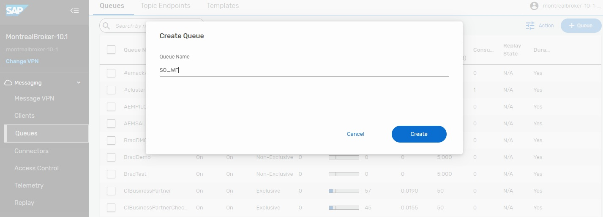
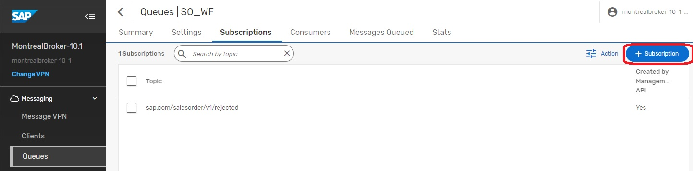
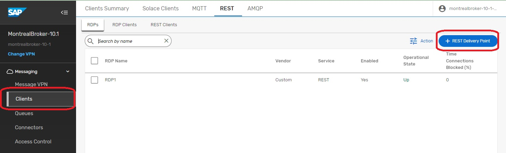

author: HariRangarajan-Solace
summary: Day 4/5 : This code lab walks the participant through the experience of using SAP AEM to event enable their SAP ecosystem and workflows
id: sap-aem-int-day-4
tags: SAP, AEM, Event Portal, SAP BTP, CAPM
categories:
environments: Web
status: Hidden
feedback link: https://github.com/SolaceDev/solace-dev-codelabs/blob/master/markdown/sap-aem-int-day-4

# Event Enable SAP Using SAP Advanced Event Mesh - Day 4

## What you'll learn: Overview

Duration: 0:05:00

Day 4 of 5.
Topics covered :
- Using SAP BPA to handle event exceptions

## What you need: Prerequisites

Duration: 0:07:00

Enter environment setup & prerequisites here

## Step 1 - Using SAP BPA to handle event exceptions

## Takeaways

Duration: 1:30:00

✅  Understand concept of Dead Message Queus
✅  Understand how to use SAP BPA to process Dead Messages

In the world of Event Driven Asynchronous messaging, occasionally an event will not be able to be processed by one of the subscribers. Sometimes you will hear customers referring to a “poison message”, something that cannot be processed due to the format of the message. Depending on your setup, you might decide to take advantage of the functionality of the Advanced Event Mesh to place messages in a Dead Message Queue. [Read more](https://solace.com/blog/pubsub-message-handling-features-dead-message-queues/)

In our scenario, we will artificially create a situation where messages cannot be delivered to the endpoint. In the iFlow you created on Day 3, we will essentially corrupt the name of the SFTP Server so that messages cannot be delivered. Once the iFlow attempts delivery of the message and is unsuccessful, the messages will be placed into a Queue (aka Dead Message Queue) for review/processing. The messages in this queue will remain there until they are reviewed and released back onto the broker for re-processing. To facilitate this operation, we have decided to take advantage of the SAP Business Process Automation service. 

There are several components to this scenario that work together to facilitate the review. 

The first component is the iFlow that you will have installed on Day 3. The first thing you will need to do is to “corrupt” the SFTP Server name so that the messages cannot be delivered to the SFTP Server. 

**Step 1** - Modify this iFlow with the bad SFTP Server name and redeploy the iFlow. Once the iFlow is redployed, it will start to send messages to the DMQ. Once these messages arrive at the DMQ, you will start to see the Dead Message Integration Card get populated with messages.

**Step 2** – Configure the RDP on the broker where the SO_WF Queue will be located. Navigate to the main console and goto your cluster manager. From there, select the broker where you will be configuring your Rest Delivery Point. 

From this screen, you will select the manage option at the top.

You will then select “Queues” towards the middle of the screen. Selecting the Queue option will now re-direct you to a different screen and will open the Broker Manager for the selected broker so you will see a much different display with many options.

On this screen, we will start by creating a Queue and Subscription that will be used to capture the items from the DMQ that users would like to start review processes for. Click on the +Queue option.

The name of the Queue we will create is “SO_WF”…press “Create”.

Now you will create a subscription to attract the correct entries into this Queue. The name of the subscription is “sap.com/salesorder/v1/rejected”.

Next step to create the Rest Delivery Point and associated components. Navigate to the clients tab as shown on the left and then click the + Rest Delivery Point Button.

The name of the RDP is “RDP1”. 

You will now create a Rest Consumer that will be the target for your Events. Click the + Rest Consumer.

Enter “SO_WF_REST_CONSUMER” and press “Create”

This is the screen that requires some attention to detail. For starters, if you notice in the first red highlighted box, it’s not the entire endpoint, this will come later. This is the address of your BPA service on BTP. Also take note of the Port and Http Method. The next section is the Authentication Scheme. You will need to select oAuth 2.0 Client Credentials. Once you have selected those, you will need to retrieve the oAuth specifics from the BTP Cockpit…specifically the Client ID and the Token URL.

Next you will create the connection between the Rest Consumer and the Queue that it will use. Select Queue Bindings and then click the “+Queue Binding”.

From the dropdown, select the previously created Queue “SO_WF”.

This is where you will enter the remainder of the endpoint…aka the endpoint for creating the Workflow Instances. This should be the same so you can use the same value “/workflow/rest/v1/workflow-instances”

At this point, you should have a functioning RDP. The operational status on the screen should say Up for all components with the exception of the RDP Client. If any of them says “Down”, you will need to TroubleShoot, go back and double check your settings. There is also a Stats link that you can use to sometimes see the Error Messages.

Thanks for participating in this codelab! Let us know what you thought in the [Solace Community Forum](https://solace.community/)! If you found any issues along the way we'd appreciate it if you'd raise them by clicking the Report a mistake button at the bottom left of this codelab.
