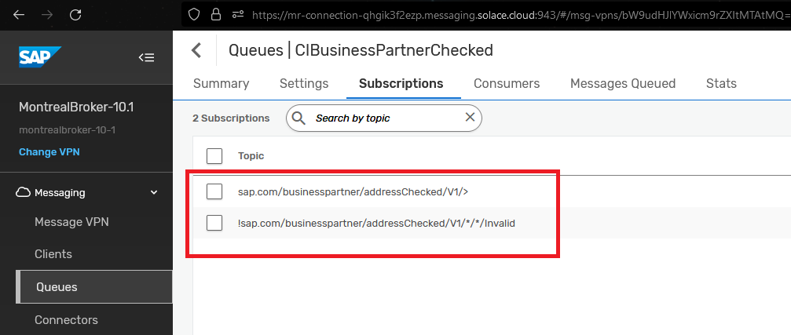
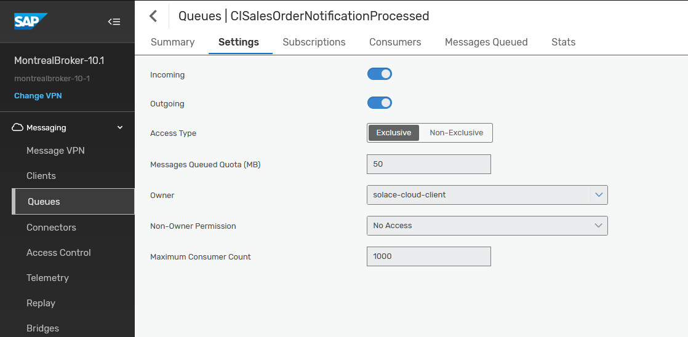
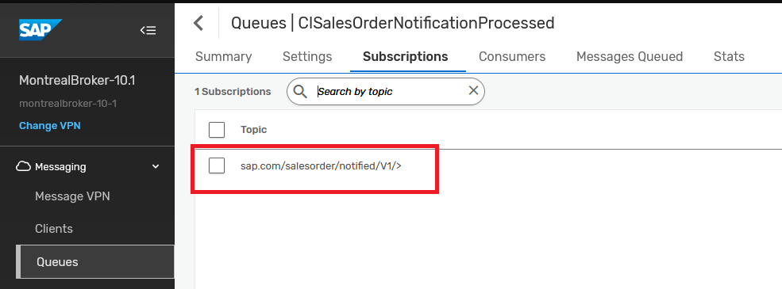

author: HariRangarajan-Solace
summary: This codelab walks a developer thru the experience of using SAP AEM to event enable their SAP ecosystem and workflows
id: sap-aem-int-demo
tags: SAP, AEM, Event Portal, SAP BTP, CAPM
categories:
environments: Web
status: Hidden
feedback link: https://github.com/SolaceDev/solace-dev-codelabs/blob/master/markdown/sap-aem-int-demo

# SAP AEM Codelab

## What you'll learn: Overview

Duration: 0:05:00

Enter a codelab overview here: what & why and github repo link where you can find related code if applicable

### Info Boxes
Plain Text followed by green & yellow info boxes 

> aside negative
> This will appear in a yellow info box.

> aside positive
> This will appear in a green info box.

### Bullets
Plain Text followed by bullets
* Hello
* CodeLab
* World

### Numbered List
1. List
1. Using
1. Numbers

### Add an Image or a GIF

## What you need: Prerequisites

Duration: 0:07:00

Enter environment setup & prerequisites here

### Add a Link
Add a link!
[Example of a Link](https://www.google.com)

### Embed an iframe

## Day 1 - Setup Advanced Event Mesh
### Part 1 -  Event Mesh
### Part 2 -  SAP simulator

The SAP Cloud Application Programming Model (CAP) is a framework of languages, libraries, and tools for building enterprise-grade services and applications. It guides developers along a 'golden path' of proven best practices and a great wealth of out-of-the-box solutions to recurring tasks.
CAP-based projects benefit from a primary focus on domain. Instead of delving into overly technical disciplines, we focus on accelerated development and safeguarding investments in a world of rapidly changing cloud technologies.

For more information on SAP CAP, you can refer to the link : [SAP Cloud Application Programming Model](https://cap.cloud.sap/docs/)

To showcase the integration capability of SAP CAP and AEM, we have created a CAP based Java microservice which will publish different SAP business object events into your AEM instance.
This application can be deployed in your SAP CloudFoundry space.

#### Step 1 : CloudFoundry CLI installation
To start with, we will be installing the CloudFoundry CLI for the deployment process.
Follow the steps mentioned over here [Installing the cf CLI](https://github.com/cloudfoundry/cli/wiki/V8-CLI-Installation-Guide) for detailed instructions on this.

#### Step 2 : Downloading the deployables artefacts
Download the following files artefact files and save them in the same directory:
- capm-erp-simulation-exec.jar : [https://github.com/SolaceLabs/aem-sap-integration/blob/main/deployable/capm-erp-simulation-exec.jar](https://github.com/SolaceLabs/aem-sap-integration/blob/main/deployable/capm-erp-simulation-exec.jar)
- manifest.yml : [https://github.com/SolaceLabs/aem-sap-integration/blob/main/deployable/manifest.yml](https://github.com/SolaceLabs/aem-sap-integration/blob/main/deployable/manifest.yml)

#### Step 3 : Login to CloudFoundry space
You can log in to the SAP CloudFoundry space in your account as below :

- Use the command : `cf login` to log in, which will prompt for your SAP login credentials.
- Once authenticated, the details of the default cloudfoundry space will be displayed.

#### Step 4 : Deploying the SAP Simulator application
- Navigate to the directory where the above deployable artefact files are saved.
- Run the command `cf push` which will upload the jar file and use the manifest.yml for properties. **Note : this command will take some time to completely execute as it uploads the jar deployable and also start the application.**
- Once the command is completely executed, run the command `cf apps` to view a listing of the apps in your cloudfoundry space
- Verify that the app **capm-erp-simulation** is deployed and started

#### Step 5 : Accessing the SAP Simulator application
- Navigate to the Cloud Foundry environment in your SAP BTP Cockpit
- You should see a screen like below :
  
- Click on the application name : **capm-erp-simulation** and enter the application overview screen.
  
- Click on the application route as highlighted below. Note : this route url will differ from for different SAP BTP accounts.

#### Step 6 : Connecting to SAP AEM and running the simulator
- As you click on the above application route url, you will be redirected to the simulator screen as below

Here you can connect to your SAP AEM instance to publish events.
- The connection parameters for the simulator can be captured from below :
  
  
  Enter the appropriate value as specified below :
- Host URL : Public Endpoint
- VPN Name : Message VPN
- Username : Username
- Password : Password
  
- Once the broker is successfully connected, you will be displayed a screen as below :
  
- You can choose which events to simulate and its frequency by using the sliders. As you change a schedule, the submit button in the bottom will be enabled
  
- In case you want to disable any of the events, then pull the slider to **0** and click submit and the event will be disabled immediately
  

## Day 2 - Event portal content and UI5 Cards
### Part -1 - Event Portal Setup
### Part -2 - Access UI5 Samples
SAP Ui5 Integration cards present a new means to expose application content to the end user in a unified way. Depending on the use cases, cards can be easily embedded in a host environment, such as an application, SAP Build, dashboards, or any HTML page. A variety of card types can be configured by a simple JSON configuration (schema) without the need to write code for UI rendering. In this way, even users without programming skills are enabled to create new cards according to their specific needs. Cards are composite controls that follow a predefined structure and offer content in a specific context. Cards contain the most important information for a given object (usually a task or a list of business entities). You can use cards for presenting information, which can be displayed in flexible layouts that work well across a variety of screens and window sizes.

With the use of cards, you can group information, link to details, or present a summary. As a result, your users get direct insights without the need to leave the current screen and choose further navigation options.

For more information on SAP Ui5 Integration cards, you can refer to the link: [UI Integration cards](link_here)

To showcase the simplicity of using SAP integration cards to visualize the power of the SAP Advanced Event Mesh, we have created a dashboard using HTML5 for each business scenario. We also made them easy to use. All you need to do is enter your broker details, click "Connect," and watch the business case come to life as events flow in. Each integration card that is displayed in the dashboard represents another tool at your fingertips to visualize your data. The cards are each subscribed to the various Topics in which you will send your events from your SAP System. Follow the steps below to set up your dashboard and get started.

### Step 1: Choose the Business Case Dashboard

Here is a portal where you can find all of the available dashboards that support the 5 business scenarios. Visit the link below and choose the dashboard that you want to see. Here you will also find additional documentation and helpful videos to get started with.

- [DashBoard Portal](https://solacedemo-uf1dchbp.launchpad.cfapps.ca10.hana.ondemand.com/125692ff-95ad-4b2d-a216-fde644eef1c0.DashboardPortal.DashboardPortal-1.0.0/index.html)

### Step 2: Connect with Your Broker Details

To connect with your broker details:

- Open your broker and select the “connect” tab at the top.

- Then, under the “Solace Web Messaging” section, you will find the 4 inputs you need to connect your broker to the dashboard.

- Now, you can copy and paste each input into the fields at the top of the dashboard and then finally click “Connect”.

- If your credentials are entered correctly, you will get a “Success” message that will verify that you are connected properly to the dashboard. If you do not see a “Success” message, then try again and make sure your details are correct for each input.

Repeat these steps for each dashboard.

### Step 3: Getting to Know Your Dashboard

Each dashboard has different components and scenarios to showcase the capabilities of SAP Advanced Event Mesh. For example, in the Sales Order Dashboard, there is a card that is reading messages from a Dead Message queue. This showcases how error handling can be achieved. Furthermore, you can submit a message from that queue to trigger an SAP Process Automation flow with the click of a button. You'll also find different data visualization types, as well as functional visualizations that highlight integration with other parts of SAP BTP.

### Troubleshooting

Here are some troubleshooting tips:

- Use the latest version of Chrome, and you can try opening the dashboard in “incognito” mode if you have issues with caching.
- If you do not see the “Success” message at the top, then you are not connected. In case you entered your credentials correctly and still don’t see the message, try to refresh your browser to prompt the application to try your credentials again. You may need to refresh a couple of times to get the “Success” message.
- If messages are being sent and the cards are not updating, right-click anywhere on the dashboard and click “inspect”. Then select the “console” tab and look at the logs. It may be the case that the payload format is off, or possibly that the events are flowing to the wrong topic. Error messages here should help.
## Day 3 - Deploy SAP BPA Processes
## Day 4 - Event Enabled Integration flows
### Step 1 - Download and import the template integration flows
- Download [AEMBusinessPartnerAddressCheck.zip](artifacts/cloud-integration-flows/AEMBusinessPartnerAddressCheck.zip), [AEMLegacyOutputAdapter.zip](artifacts/cloud-integration-flows/AEMLegacyOutputAdapter.zip) & [AEMSalesOrderNotification.zip](artifacts/cloud-integration-flows/AEMSalesOrderNotification.zip)
- Import AEMBusinessPartnerAddressCheck.zip, AEMLegacyOutputAdapter.zip & AEMSalesOrderNotification.zip into your Integration Suite tenant

### Step 2a - Setup/configure SAP AEM
Create input queues for your integration flows:
[Go to Cluster Manager -> <your service> -> Manage -> Queues - to open the Broker UI]
1. For AEMBusinessPartnerAddressCheck:
	* CIBusinessPartnerChecker
	
	
		*Add the following subscriptions to the queue
		
		
	* CIBusinessPartnerCheckerDMQ
	
	* CIBusinessPartnerChecked (optional)
	 
		*Add the following subscriptions to the queue
		
	* CIBusinessPartnerInvalid (optional)
	 
		*Add the following subscriptions to the queue
		 

2. For AEMSalesOrderNotification
	* CISalesOrderNotification
	
	
		*Add the following subscriptions to the queue
		 
		
	* CISalesOrderNotificationProcessed (optional)
	 
		*Add the following subscriptions to the queue
		  
	
3. For AEMLegacyOutputAdapter
	* CILegacyAdapterIn
	
	
		*Add the following subscriptions to the queue
		 
		
	* CILegacyAdapterInDMQ
	

### Step 2b - Setup/configure dependency services
1. For AEMBusinessPartnerAddressCheck
	* Activate SAP's Data Quality Management Service (DQM) by following this [blog](https://blogs.sap.com/2022/02/15/getting-started-with-sap-data-quality-management-microservices-for-location-data-btp-free-tier/)
2. For AEMSalesOrderNotification
	* You'll need an external email service to be able to automatically send emails, details like smtp server address, username (email) and password.
3. For AEMLegacyOutputAdapter
	> The legacy output adapter is simulating appending events to a file via an SFTP adapter, which could be imported to a legacy system. The actual flow doesn't require a working sftp destination as it's just being used to simulate a failure to demonstrate the retry and error handling capabilities of AEM. The flow will try a few times to deliver each event to the SFTP destination. After 3 failed attempts messages will be moved to a Dead Message Queue for manual processing by a UI5 and Business Process Automation workflow.
	
	> If, after successful demonstration of the error handling, you would still like to see a successful delivery of events to a file via sftp, you will need an sftp server and sftp credentials to configure the flow with a valid endpoint (sftp server address and username password) and import the ssh identidy into .

### Step 3 - Configure your integration flows

### Step 4 - Deploy your integration flows

## Day 5 - Event Enabled SAP objects

## Takeaways

Duration: 0:07:00

✅ < Fill IN TAKEAWAY 1>   
✅ < Fill IN TAKEAWAY 2>   
✅ < Fill IN TAKEAWAY 3>   

Thanks for participating in this codelab! Let us know what you thought in the [Solace Community Forum](https://solace.community/)! If you found any issues along the way we'd appreciate it if you'd raise them by clicking the Report a mistake button at the bottom left of this codelab.
