author: HariRangarajan-Solace
summary: This codelab walks a developer thru the experience of using SAP AEM to event enable their SAP ecosystem and
workflows
id: sap-aem-int-demo
tags: SAP, AEM, Event Portal, SAP BTP, CAPM
categories:
environments: Web
status: Hidden
feedback link: https://github.com/SolaceDev/solace-dev-codelabs/blob/master/markdown/sap-aem-int-demo

# SAP AEM Codelab

## What you'll learn: Overview

Duration: 0:05:00

Enter a codelab overview here: what & why and github repo link where you can find related code if applicable

### Info Boxes

Plain Text followed by green & yellow info boxes

> aside negative
> This will appear in a yellow info box.

> aside positive
> This will appear in a green info box.

### Bullets

Plain Text followed by bullets

* Hello
* CodeLab
* World

### Numbered List

1. List
1. Using
1. Numbers

### Add an Image or a GIF

## What you need: Prerequisites

Duration: 0:07:00

Enter environment setup & prerequisites here

### Add a Link

Add a link!
[Example of a Link](https://www.google.com)

### Embed an iframe

## Day 1 - Setup Advanced Event Mesh

### Part 1 - Build Your Advanced Event Mesh

In this task, you will be creating two Enterprise AEM services, meshing them, and verifying your mesh health.

Before starting, it will be helpful to know what cloud provider and region your SAP environment is in, and the primary
cloud provider and region where your cloud applications are deployed.
The value of building a mesh topology is realized when placing your AEM services close to your event producing and
consuming systems.
If your SAP environment is running in an on-premises data center, you will use the geographic region of that site to
help select an appropriate cloud location for that AEM service.

#### Create your first AEM service:

1. From the SAP AEM Console, open the Cluster Manager.\
   

2. Click the + box to create a new AEM service.\
   

3. Name your service\
   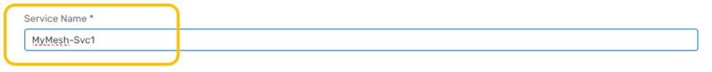

   > aside negative
   > Note that service names must be unique within your account. We suggest using the mesh name you want, a hyphen, and
   a
   > service ID to make it unique.

4. Pick Enterprise as the service type.\
   
   \
   For now, keep the default service class and message storage settings.
5. Choose your cloud provider from the pull down list.\
   \
   For the first AEM service, select the same IaaS (Infrastructure as a Service) provider and region where your SAP is
   running, the RISE provider and region where your SAP Cloud is
   running, or for an on-premises SAP pick a cloud provider and region closest to where your data center is located.\
   \
   For the second AEM service, select the same provider and region where your cloud applications are located. If you
   have
   several, pick one that is distant from your SAP environment (you can expand your mesh later to include additional
   cloud locations).\
   
   > aside negative
   > Note that you can also request buildout of a private cloud region on-premises at your data center later, but for
   > now please select the best matching cloud provider.

6. Click the Select Region box inside the map and select your cloud region. \
   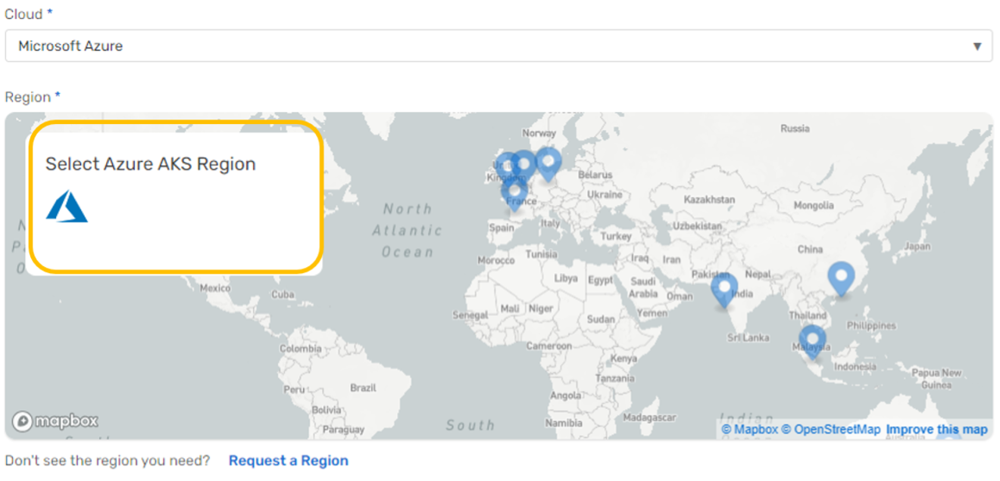
   \
   This example shows selecting Azure as the provider and East US 2 (Virginia) as the region: \
   
   \
   Please substitute your best provider and region as you make your selection and click OK.

7. Keep the Default Broker Version selection. \
   

8. Expand the Advanced Connection Options section. \
   

9. Enter the name for your cluster.
   \
   AEM services can be clustered within a cloud location to expand capacity horizontally.
   These clusters can then be interconnected across cloud locations to form a mesh.
   Today, we will create two clusters of one AEM service each and then interconnect them.
   \
   When clicking in the Cluster Name field, you will see a pull-down menu of existing clusters (the list will likely be
   empty) and a search box at the top.
   \
   Click in the search box and use your mesh name plus the cloud provider and region
   to define the name of your cluster. As you type, the search results will include the cluster name you are defining:\
   
   \
   Remember to use your specific mesh name, provider and region followed by the word Cluster and then click your cluster
   name in the search result to select it: \
   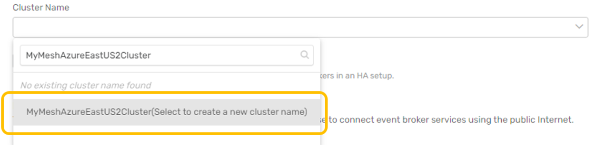
   \
   Leave the Enable mate-link encryption checkbox selected.

10. Set the Message VPN Name.
    \
    By default, each AEM service has a unique VPN name. The message VPN is a logical messaging
    domain where events are shared by producing and consuming applications.
    For our evaluation exercise, we will use a single message VPN across both AEM services. \
    Click on the pencil icon to the right of the Message VPN Name field and set the name to your mesh name followed by
    the
    keyword VPN : \
    
    \
    Leave the Port Configuration section default values for now. After reviewing all the settings on the Create Service
    page, click Create Service to launch your AEM service.\
    
    \
    You will see a progress bar as the service is being started. Click the back-arrow at the top of the window next to
    your
    service name to return to the Cluster Manager view. You will see your AEM service instance with the progress bar. \
    
    \
    You can proceed with the next step while your first AEM service is starting.

11. Repeat steps 2 through 10 for your second AEM service. \
    Substitute the name (Svc2) along with the appropriate cloud provider and region.
    > aside negative
    > Note that your second service can be with the same cloud provider or a different cloud provider.\
    > For example, it is common for organizations to use Azure as their SAP IaaS provider for cost/location reasons,
    > but to have applications being built in AWS or another cloud provider.

    **IMPORTANT - For your second AEM service:**
    - Location will be in a **DIFFERENT region** (with the same or different cloud provider).
    - The **cluster name** follows the same pattern but is **DIFFERENT** from the first AEM service.
    - You will use the **EXACT SAME Message VPN Name** as for the first AEM service.

    Once your services have started, you can click to open them and view details of their status:
    
    > aside negative
    > (Note - This example shows developer class services)

    Click on each service to inspect the detailed status: \
    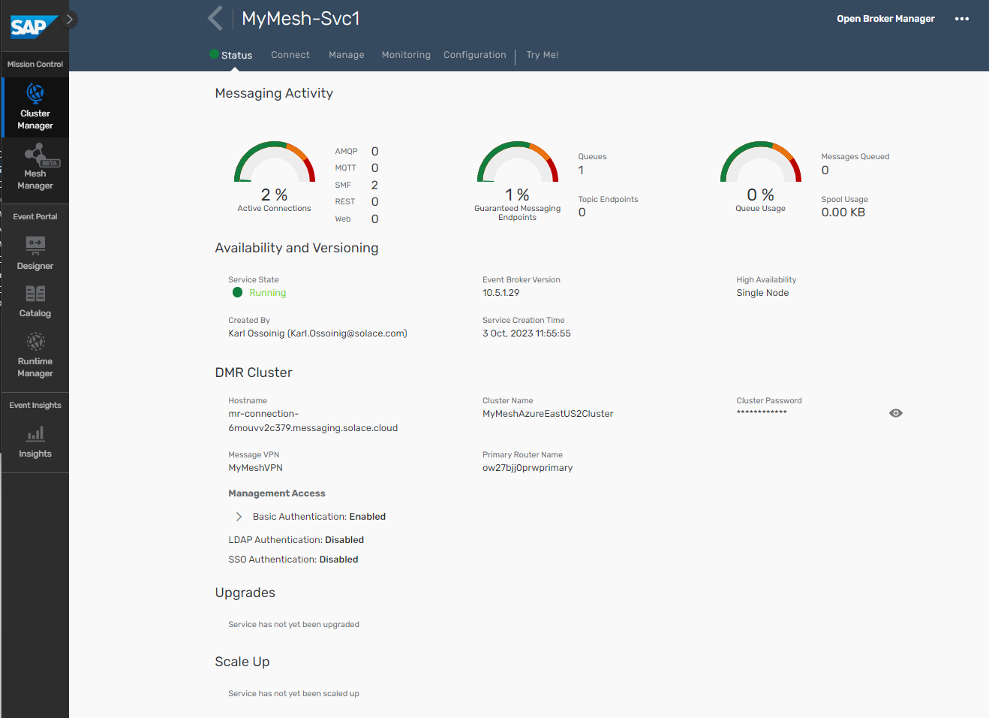
    \
    This example shows low utilization, version detail and cluster detail which includes the message VPN name which
    should be the same for both AEM services.

12. Define a new mesh. From the SAP AEM Console, open the Mesh Manager: \
    
    \
    In the top right, click the Create Mesh action to open the mesh definition. \
    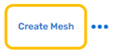  \
    Enter the same mesh name used when defining your AEM services. \
    
13. Add your AEM services to the mesh. \
    Click Add Service, then use the pull down search box to find and select your first service. \
     \
    Click Add Service in the dialog to complete the action: \
    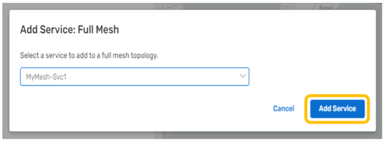 \
    Click Add Service again and add your second service. \
     \
    Mesh Manager will show the layout of your mesh geography. \
     \
    Click Create Mesh to complete the mesh setup. \
     \
    Mesh Manager will update the status of your mesh when configuration is complete. \
    

14. (**Optional**) Run a health check on your event mesh.
    From the Mesh Manager, click on your event mesh to open the status page : \
     \
    Expand the Latest Health Check and click Run Health Check action: \
    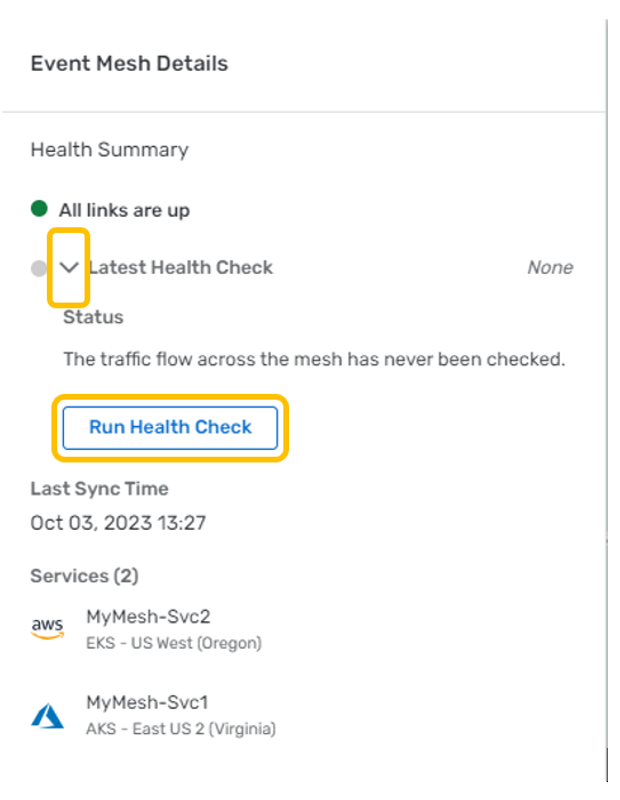 \
    The health check progress is shown, followed by the health check status: \
    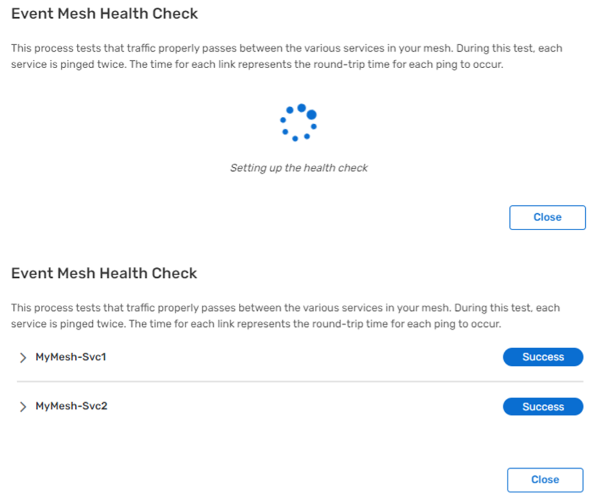

### Part 2 - SAP simulator

The SAP Cloud Application Programming Model (CAP) is a framework of languages, libraries, and tools for building
enterprise-grade services and applications. It guides developers along a 'golden path' of proven best practices and a
great wealth of out-of-the-box solutions to recurring tasks.
CAP-based projects benefit from a primary focus on domain. Instead of delving into overly technical disciplines, we
focus on accelerated development and safeguarding investments in a world of rapidly changing cloud technologies.

For more information on SAP CAP, you can refer to the
link : [SAP Cloud Application Programming Model](https://cap.cloud.sap/docs/)

To showcase the integration capability of SAP CAP and AEM, we have created a CAP based Java microservice which will
publish different SAP business object events into your AEM instance.
This application can be deployed in your SAP CloudFoundry space.

#### Step 1 : CloudFoundry CLI installation

To start with, we will be installing the CloudFoundry CLI for the deployment process.
Follow the steps mentioned over
here [Installing the cf CLI](https://github.com/cloudfoundry/cli/wiki/V8-CLI-Installation-Guide) for detailed
instructions on this.

#### Step 2 : Downloading the deployables artefacts

Download the following files artefact files and save them in the same directory:

- capm-erp-simulation-exec.jar : [https://github.com/SolaceLabs/aem-sap-integration/blob/main/deployable/capm-erp-simulation-exec.jar](https://github.com/SolaceLabs/aem-sap-integration/blob/main/deployable/capm-erp-simulation-exec.jar)
- manifest.yml : [https://github.com/SolaceLabs/aem-sap-integration/blob/main/deployable/manifest.yml](https://github.com/SolaceLabs/aem-sap-integration/blob/main/deployable/manifest.yml)

#### Step 3 : Login to CloudFoundry space

You can log in to the SAP CloudFoundry space in your account as below :

- Use the command : `cf login` to log in, which will prompt for your SAP login credentials.
- Once authenticated, the details of the default cloudfoundry space will be displayed.

#### Step 4 : Deploying the SAP Simulator application

- Navigate to the directory where the above deployable artefact files are saved.
- Run the command `cf push` which will upload the jar file and use the manifest.yml for properties. **Note : this
  command will take some time to completely execute as it uploads the jar deployable and also start the application.**
- Once the command is completely executed, run the command `cf apps` to view a listing of the apps in your cloudfoundry
  space
- Verify that the app **capm-erp-simulation** is deployed and started

#### Step 5 : Accessing the SAP Simulator application

- Navigate to the Cloud Foundry environment in your SAP BTP Cockpit
- You should see a screen like below :
  
- Click on the application name : **capm-erp-simulation** and enter the application overview screen.
  
- Click on the application route as highlighted below. Note : this route url will differ from for different SAP BTP
  accounts.
  

#### Step 6 : Connecting to SAP AEM and running the simulator

- As you click on the above application route url, you will be redirected to the simulator screen as below
  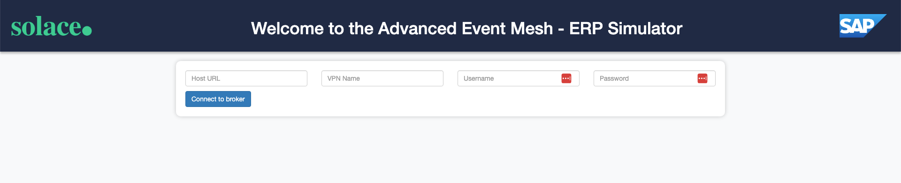
  Here you can connect to your SAP AEM instance to publish events.
- The connection parameters for the simulator can be captured from below :
  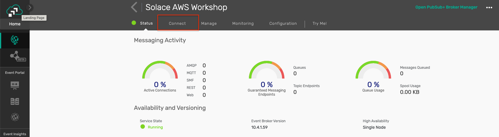
  
  Enter the appropriate value as specified below :
- Host URL : Public Endpoint
- VPN Name : Message VPN
- Username : Username
- Password : Password
  
- Once the broker is successfully connected, you will be displayed a screen as below :
  
- You can choose which events to simulate and its frequency by using the sliders. As you change a schedule, the submit
  button in the bottom will be enabled
  
- In case you want to disable any of the events, then pull the slider to **0** and click submit and the event will be
  disabled immediately
  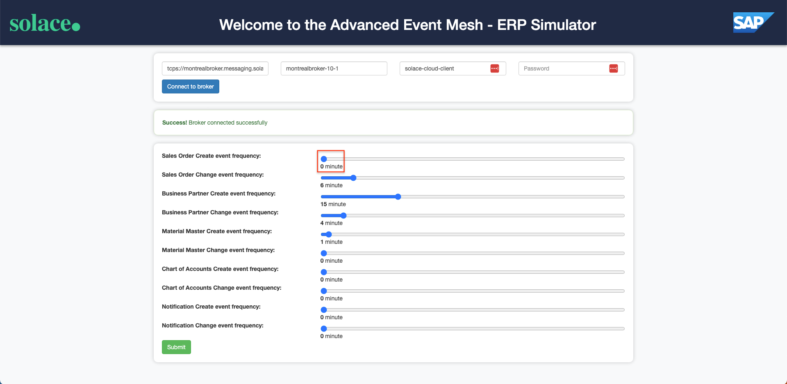

## Day 2 - Event portal content and UI5 Cards

### Part -1 - Import the Demo Example Design

In this task, you will be importing the design representing the events for this rapid evaluation. \
This design is an example, and not a full implementation. The intent is to have enough design for an evaluation while
allowing easy understanding of the concepts being demonstrated.
The level of detail in the model is "medium size," meaning that there are enough attributes to enable the demonstration,
but it is not the full schema for the SAP objects involved.

1. From the SAP AEM Console, open the Designer. \
   

2. Import the demo domain from the provided export file. \
   \
   Pull down the menu extension in the Application Domains view and select the import function.
   \
   \
   \
   Select the demo file from the file system. \
   \
   After the import is complete, you will see the evaluation domain in the domains list. \
   

3. Take a quick tour of the domain model. \
   \
   The initial view of the domain will be of the Applications tab. \
   You will see a number of modeled applications in the list related to the demo. \
   Note that these are simple references that allow visualization of the event flows – The designer tool does not
   simulate the actual applications. \
   

   Event APIs and Event API Products can be used to expose and manage AsyncAPI interfaces within organizations, or with
   external partners through your APIM vendor.
   > aside negative
   > Note that Event APIs and Event API Products are advanced topics that will not be covered by this demonstration
   design.

   Clicking on the Events tab, you will see a listing of 17 events defined for the domain.
   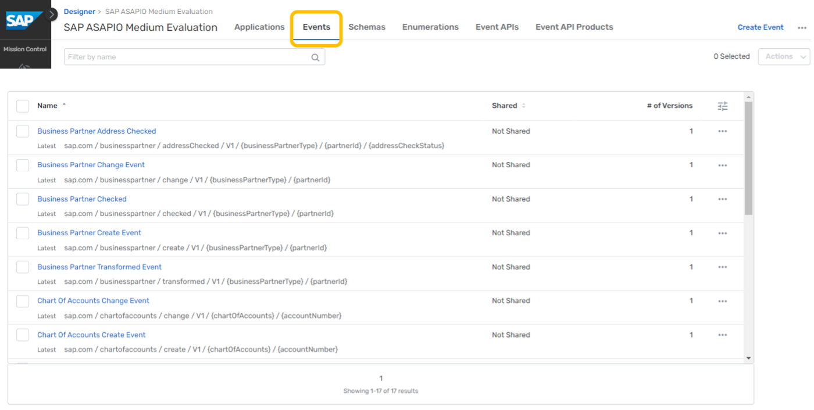
   \
   Clicking on the Schemas tab, you will see 5 schemas.
   
   \
   For simplicity, we have defined one schema for use by all events dealing with each object. \
   Clicking on the Enumerations tab, you will see one enum.
   
   \
   Enums are used in the model to show a finite set of possible values. \
   This one is defined to hold a concise set of rejected reason code values for sales orders.

   Moving back to the Events tab, we can use the search box near the top to filter down to the event(s) we want to find.
   For example, typing "Sales" here results in a live search that filters the list down to just Sales Order related
   events.
   \
   \
   Clicking on the Sales Order Create event in this view will drill into the definition of that event.
   
   \
   This provides an overview of the event details including the version, state, description, topic address, schema
   reference, and reference-by links.
   

   **Version & State:** \
   Designer can be used to manage the version and state of model objects and tracks their relationships for you,
   enabling full SDLC (software development lifecycle) visibility.
   It also serves as a collaboration space that allows you to leverage events you create more effectively to derive new
   value for the business.
   \
   **Topic Address:** \
   For AEM services (type = Solace), the topic address is a string with **"/"** separators that enables dynamic routing
   and filtering. Following best practice guidelines for creating topic strings is critical to your EDA success. \
   The general format is **ORG/DOMAIN/VERB/VERSION/{ATTRIBUTE1}/{ATTRIBUTE2}/ …** \
   Topics are a powerful mechanism employed by AEM to perform dynamic routing in an event mesh, moving copies of events
   only where they are needed. It also enables consuming clients to filter events within topics using subscriptions and
   wildcard characters **(*, >)**. \
   This capability avoids client applications having to implement brittle, complex filtering logic to reject unwanted
   events.\
   \
   Next, click on the referenced schema to expand your view.
   \
   The referenced schema can be displayed as content in this view. \
   Now click on the expanded menu in this section and select Open Schema. \
   \
   This takes you directly to the Schema tab content. Here, you can see a more detailed description and have control to
   edit, create a version, and adjust the state of the schema. \
   The description includes links to references used to define the objects in the demonstration. \
   If you click on the expander, you can view just the schema text in a larger view without opening it for editing.
   \
   The Designer tool will be a useful way to explore the demonstration data throughout your evaluation.

### Part -2 - Access UI5 Samples

SAP Ui5 Integration cards present a new means to expose application content to the end user in a unified way. Depending
on the use cases, cards can be easily embedded in a host environment, such as an application, SAP Build, dashboards, or
any HTML page. A variety of card types can be configured by a simple JSON configuration (schema) without the need to
write code for UI rendering. In this way, even users without programming skills are enabled to create new cards
according to their specific needs. Cards are composite controls that follow a predefined structure and offer content in
a specific context. Cards contain the most important information for a given object (usually a task or a list of
business entities). You can use cards for presenting information, which can be displayed in flexible layouts that work
well across a variety of screens and window sizes.

With the use of cards, you can group information, link to details, or present a summary. As a result, your users get
direct insights without the need to leave the current screen and choose further navigation options.

For more information on SAP Ui5 Integration cards, you can refer to the
link: [UI Integration cards](https://ui5.sap.com/test-resources/sap/ui/integration/demokit/cardExplorer/index.html)

To showcase the simplicity of using SAP integration cards to visualize the power of the SAP Advanced Event Mesh, we have
created a dashboard using HTML5 for each business scenario. We also made them easy to use. All you need to do is enter
your broker details, click "Connect," and watch the business case come to life as events flow in. Each integration card
that is displayed in the dashboard represents another tool at your fingertips to visualize your data. The cards are each
subscribed to the various Topics in which you will send your events from your SAP System. Follow the steps below to set
up your dashboard and get started.

### Step 1: Choose the Business Case Dashboard

Here is a portal where you can find all of the available dashboards that support the 5 business scenarios. Visit the
link below and choose the dashboard that you want to see. Here you will also find additional documentation and helpful
videos to get started with.

- [DashBoard Portal](https://solacedemo-uf1dchbp.launchpad.cfapps.ca10.hana.ondemand.com/125692ff-95ad-4b2d-a216-fde644eef1c0.DashboardPortal.DashboardPortal-1.0.0/index.html)

### Step 2: Connect with Your Broker Details

To connect with your broker details:

- Open your broker and select the “connect” tab at the top.
  
- Then, under the “Solace Web Messaging” section, you will find the 4 inputs you need to connect your broker to the
  dashboard.
  
- Now, you can copy and paste each input into the fields at the top of the dashboard and then finally click “Connect”.
  
- If your credentials are entered correctly, you will get a “Success” message that will verify that you are connected
  properly to the dashboard. If you do not see a “Success” message, then try again and make sure your details are
  correct for each input.

Repeat these steps for each dashboard.

### Step 3: Getting to Know Your Dashboard

Each dashboard has different components and scenarios to showcase the capabilities of SAP Advanced Event Mesh. For
example, in the Sales Order Dashboard, there is a card that is reading messages from a Dead Message queue. This
showcases how error handling can be achieved. Furthermore, you can submit a message from that queue to trigger an SAP
Process Automation flow with the click of a button. You'll also find different data visualization types, as well as
functional visualizations that highlight integration with other parts of SAP BTP.

As an additional way to trigger events and test the dashboards, choose the "Customer Order Form" application and create your own bike order. This order will create a mocked SAP Sales Order with the same payload format that the simulator and the ASAPIO package are providing.

### Troubleshooting

Here are some troubleshooting tips:

- Use the latest version of Chrome, and you can try opening the dashboard in “incognito” mode if you have issues with
  caching.
- If you do not see the “Success” message at the top, then you are not connected. In case you entered your credentials
  correctly and still don’t see the message, try to refresh your browser to prompt the application to try your
  credentials again. You may need to refresh a couple of times to get the “Success” message.
- If messages are being sent and the cards are not updating, right-click anywhere on the dashboard and click “inspect”.
  Then select the “console” tab and look at the logs. It may be the case that the payload format is off, or possibly
  that the events are flowing to the wrong topic. Error messages here should help.

## Day 3 - Deploy SAP BPA Processes

## Day 4 - Event Enabled Integration flows

### Step 1 - Download and import the template integration flows

-

Download [AEMBusinessPartnerAddressCheck.zip](artifacts/cloud-integration-flows/AEMBusinessPartnerAddressCheck.zip), [AEMLegacyOutputAdapter.zip](artifacts/cloud-integration-flows/AEMLegacyOutputAdapter.zip) & [AEMSalesOrderNotification.zip](artifacts/cloud-integration-flows/AEMSalesOrderNotification.zip)

- Import AEMBusinessPartnerAddressCheck.zip, AEMLegacyOutputAdapter.zip & AEMSalesOrderNotification.zip into your
  Integration Suite tenant

### Step 2a - Setup/configure SAP AEM

Create input queues for your integration flows:
[Go to Cluster Manager -> <your service> -> Manage -> Queues - to open the Broker UI]

1. For AEMBusinessPartnerAddressCheck:
    * CIBusinessPartnerChecker
      
      
      *Add the following subscriptions to the queue
      

    * CIBusinessPartnerCheckerDMQ
      
    * CIBusinessPartnerChecked (optional)
      
      *Add the following subscriptions to the queue
      
    * CIBusinessPartnerInvalid (optional)
      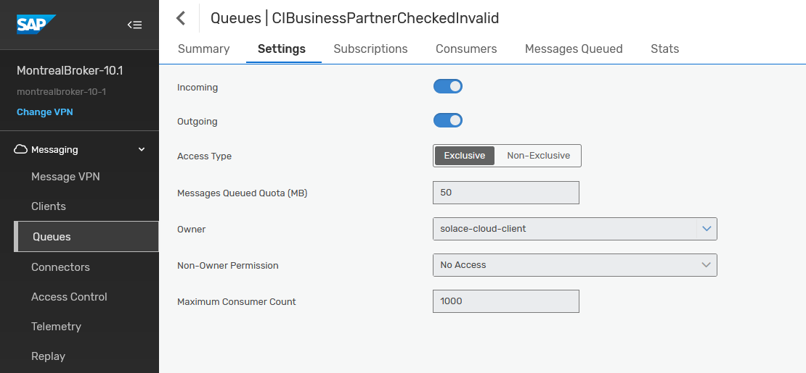
      *Add the following subscriptions to the queue
      

2. For AEMSalesOrderNotification
    * CISalesOrderNotification
      
      
      *Add the following subscriptions to the queue
      

    * CISalesOrderNotificationProcessed (optional)
      
      *Add the following subscriptions to the queue
      

3. For AEMLegacyOutputAdapter
    * CILegacyAdapterIn
      
      
      *Add the following subscriptions to the queue
      

    * CILegacyAdapterInDMQ
      

### Step 2b - Setup/configure dependency services

1. For AEMBusinessPartnerAddressCheck
    * Activate SAP's Data Quality Management Service (DQM) by following
      this [blog](https://blogs.sap.com/2022/02/15/getting-started-with-sap-data-quality-management-microservices-for-location-data-btp-free-tier/)
2. For AEMSalesOrderNotification
    * You'll need an external email service to be able to automatically send emails, details like smtp server address,
      username (email) and password.
3. For AEMLegacyOutputAdapter
   > The legacy output adapter is simulating appending events to a file via an SFTP adapter, which could be imported to
   a legacy system. The actual flow doesn't require a working sftp destination as it's just being used to simulate a
   failure to demonstrate the retry and error handling capabilities of AEM. The flow will try a few times to deliver
   each event to the SFTP destination. After 3 failed attempts messages will be moved to a Dead Message Queue for manual
   processing by a UI5 and Business Process Automation workflow.

   > If, after successful demonstration of the error handling, you would still like to see a successful delivery of
   events to a file via sftp, you will need an sftp server and sftp credentials to configure the flow with a valid
   endpoint (sftp server address and username password) and import the ssh identidy into .

### Step 3 - Configure your integration flows

### Step 4 - Deploy your integration flows

## Day 5 - Event Enabled SAP objects

## Takeaways

Duration: 0:07:00

✅ < Fill IN TAKEAWAY 1>   
✅ < Fill IN TAKEAWAY 2>   
✅ < Fill IN TAKEAWAY 3>

Thanks for participating in this codelab! Let us know what you thought in
the [Solace Community Forum](https://solace.community/)! If you found any issues along the way we'd appreciate it if
you'd raise them by clicking the Report a mistake button at the bottom left of this codelab.
